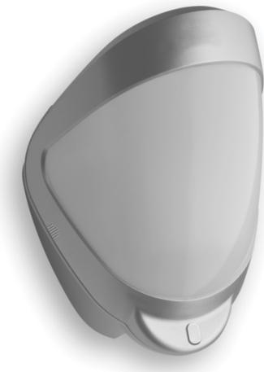

# Produktblad

# DDI602-F1

Kombidetektor, utomhus, 10/20/30 m valbart

## Kombidetektor, utomhus, Quad PIR/Mikrovåg

Kombidetektorn DDI602 är en rörelsedetektor för utomhusbruk med två separata passiva infraförda sensorer och en mikrovågssensor. Alla tre sensorerna måste aktiveras för att ett larm ska avges.

#### Installeras enkelt och snabbt

De programmerbara alternativen inkluderar variabel pulsräkning och tre täckningsområden:

10 m, 20 m eller 30 m.

DDI602 har byglar som tillåter konfiguration av inbyggda motståndsvärden (EOL). Den integrerade sensorn har dubbelaxellutning för utomhusbruk med 180º panorering och 90º lutning som ger ett noggrant och täckande detektionsmönster

#### Estetisk och dold sensor

DDI602 har ett snyggt och professionellt utseende som inte ger några synliga tecken på inställningen av sensorhuvudet. Tack vare den strömlinjeformade designen smälter dessa detektorer in i utomhusinstallationer, vilket ger en diskret installation.

#### Anpassad täckning

Täckningsområdet kan anpassas med integrerade ridåskydd. Ett extra set av ridåskydd tillhandahålls för att begränsa ridåernas mönster ännu mer, till en detektionsvinkel på 10 grader. En självhäftande silvermaskering kan sättas på linsen för att maskera ett område eller för att anpassa synfältet.

#### Alla årstider

Fungerar vid temperaturer från -30° till 65 °C. Dessa detektorer är säkra under alla årstider. IP65-godkännandet garanterar utomordentlig detektering även i dammiga och fuktiga miljöer.

### Standardprestanda

- ETäckningsområde valbart: 10/20/30 m
- EEstetisk och dold sensor
- E 10º till 70º detekteringsvinkel
- E180º panorering & 90º lutning för flexibel installation
- ESensormodulen är dold
- EInbyggda motstånd EOL
- EDamm och fuktmotståndig (IP65)
- E5 års garanti

# DDI602-F1

Kombidetektor, utomhus, 10/20/30 m valbart

# Tekniska data

| Täckningsområde                 | Programmerbar: 10 m, 20 m eller 30 m                                                                           |
|---------------------------------|----------------------------------------------------------------------------------------------------------------|
| Detekteringsvinkel              | 10° till 70°, max 30 x 24 m                                                                                    |
| Justering                       | 180° panorering, 90° lutning                                                                                   |
| Fresnellins                     | 28 zoner för varje detekteringselement                                                                         |
| Specialoptik                    | Dubbla silikonskyddade quadelement eliminerar 50,000 lux av vitljus                                         |
| Utgångar                        | Ljudlös, fasta lägen, immun mot magnetism.                                                                     |
| N/O                             | Spänningsfri kontakt, 24 VAC/DC vid 50 mA med ett integrerad 25 kOhms seriemotstånd. Larmtid 5 sekunder. |
| N/C                             | Spänningsfri kontakt, 24 VAC/DC vid 50 mA med ett integrerad 25 kOhms seriemotstånd. Larmtid 5 sekunder. |
| Spänningsmatning                | 12 VDC (9 till 15 VDC)                                                                                         |
| Strömförbrukning                | 11 mA (12 V nominellt)                                                                                         |
| Pulsräkning                     | 1 eller 2                                                                                                      |
| Temperaturkompensation          | Analog (termistor) och digital känslighetsjustering                                                         |
| Kontroll                        | Digital mikroprocessor med remanent minne                                                                      |
| Drifttemperatur                 | -30° till +65°C                                                                                                |
| Kapsling                        | Hög impakt ABS-plast med HDPE-hölje, UV beständigt                                                          |
| Dimensions, B x H x D           | 125 x 175 x 130 mm                                                                                             |
| Vikt                            | 323 g netto, 549 brutto                                                                                        |
| LEDs                            |                                                                                                                |
| Röd                             | PIR aktiv                                                                                                      |
| Grön                            | Mikrovåg aktiv                                                                                                 |
| Blå                             | Larm                                                                                                           |
| Mikrovågsenhet                  | 10,525 GHz                                                                                                     |
| Inbyggda EOL motståndsvärden | 1, 2,2, 3,3, 4,7, 5,6, och 6,8 kOhm                                                                            |
| Monteringshöjd                  | Valbart upp till 6 m. Optimal höjd 3 m för största täckning                                                 |
| EN godkänd                      | EN 50130-5, Grade 2, Class III                                                                                 |
| Miljöklass                      | III (-25° till +55°C)                                                                                          |

## Order data

| Artikelnummer | Beskrivning                                |
|---------------|--------------------------------------------|
| DDI602-F1     | Kombidetektor, utomhus, 10/20/30 m valbart |
| DI601-WT      | Testinstrument för DI601 och DDI602        |

