# DDI602 Outdoor Dual PIR Detector Installation Sheet

**EN DE ES FR IT NL PL PT SV** 

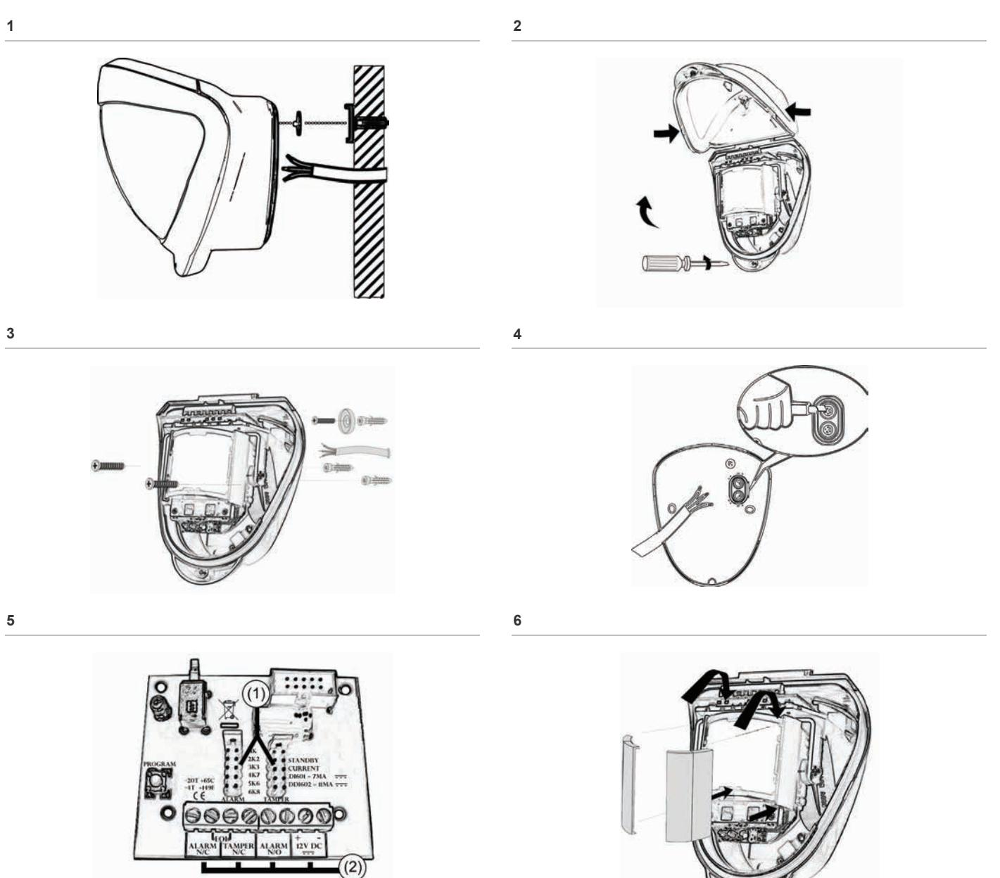

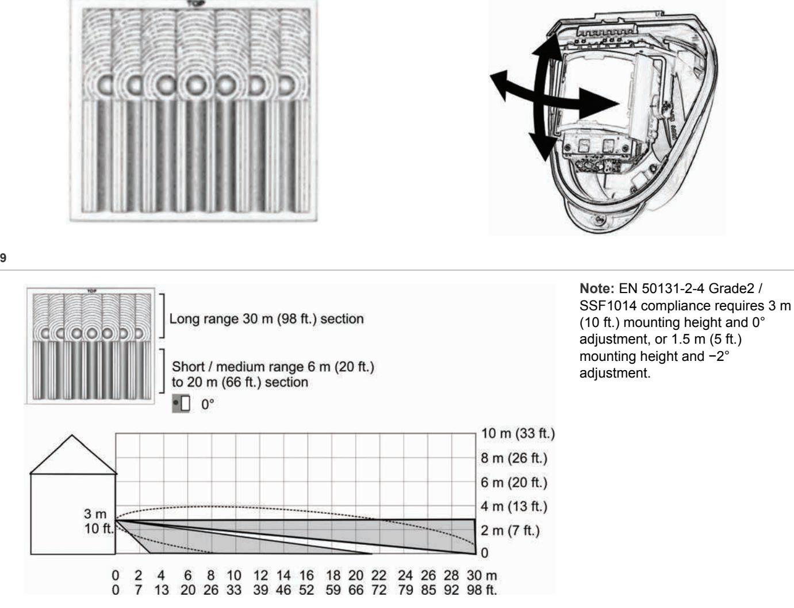

**10** 

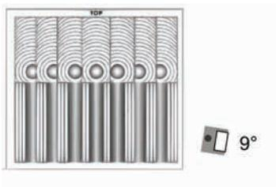

**Note:** This setup has not been tested to EN 50131-2-4 / SSF1014.

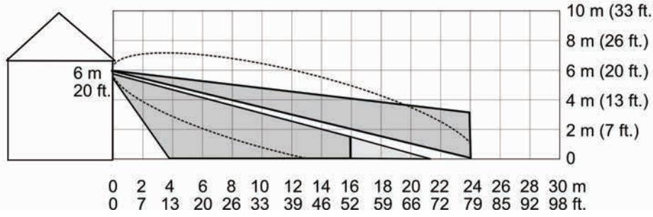

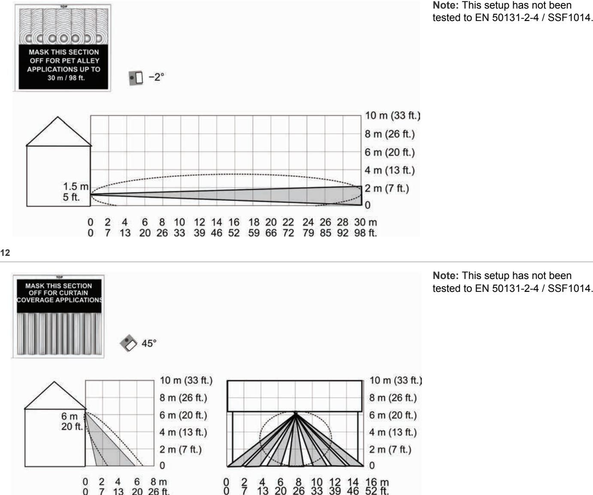

**13 14** 

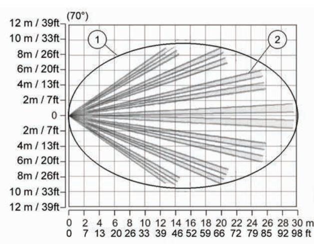

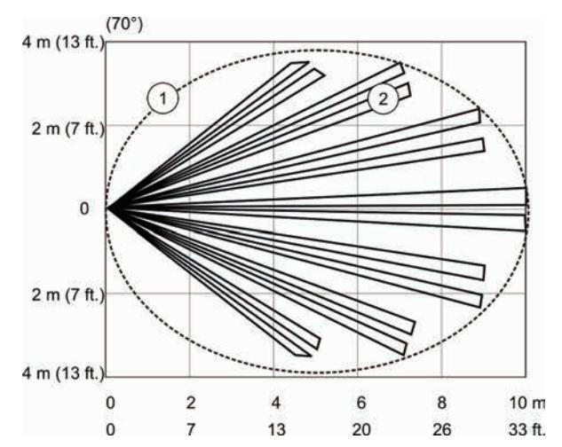

**Note:** This setup has not been tested to EN 50131-2-4 / SSF1014.

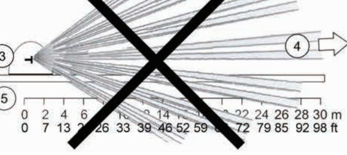

**16 17** 

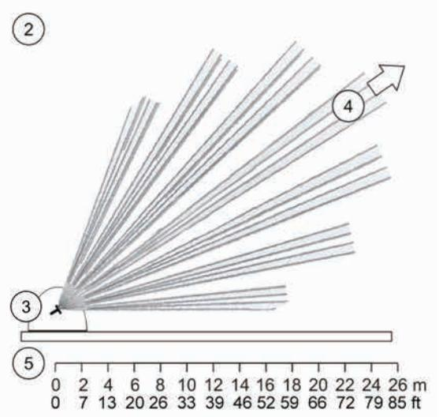

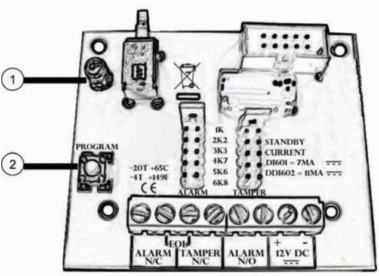

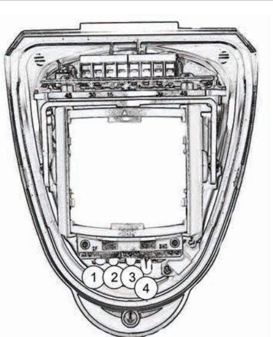

# **18 EN: Installation Sheet**

## **Package**

The package contains:

- 1X DDI602
- 1X drilling template for fixing holes
- 2X 31.75 mm / 1.25 in. wall plugs
- 2X 31.75 mm / 1.25 in. screws
- 1X lens mask
- 2X additional curtain shutters
- 1X tamper cup
- 2X tamper caps (different lengths)
- 1X plastic locking tool
- 1X installation sheet
- 1X front cover screw cap

### **Introduction**

The DDI602 Outdoor Dual PIR Detector is an outdoor motion detector and alarm trigger that uses two independent passive infrared detectors plus a microwave sensor module.

All three sensors must trigger to cause the detector to signal an alarm. The DDI602 uses triple detection technology to deliver precise, reliable presence detection. It is designed for use in CCTV and intruder alarm systems.

Programmable options include a variable pulse count and a choice of three detection ranges: 10 m / 33 ft., 20 m / 66 ft., and 30 m / 98 ft.

The integral dual-axis tilt sensor allows 180° of pan and 90° of tilt. This increases the speed of the outdoor installation and provides incredibly accurate aiming of the detection pattern.

The electronics module is acrylic coated for additional component stability. It is encased in a vandal-resistant, highimpact, UV stabilized plastic housing with an opaque polyethylene front cover ensuring that the sensor is impervious to and unaffected by weather conditions.

The combination of precision electronics, digital white light filtering, and double shielding eliminates false alarms from the sun and other visible light sources.

The DDI602 design has a neat and professional appearance that gives no visible indication of the orientation of the detector head and totally hides the wiring.

## **Quick installation**

- 1. Mount and connect the detector following the instructions given later in this sheet.
- 2. Apply supply voltage to the unit.

The detection LED (blue) flashes three times.

- 3. Wait approximately 2 to 3 minutes to allow the detector to settle.
- 4. Press the programming button once to activate walk test mode.

The detection LED is now enabled for five minutes.

**Note:** The front cover must be fitted when walk testing.

The default settings are:

- Range: 30 meters / 98 feet
- Pulse count: 1
- Detection LED: off

## **Mounting the unit**

Remove the foam packing sponge.

During installation, protect the electronics against water, as trapped moisture can affect or damage the unit.

We recommend that the cable entry and screw mounting holes are sealed from within the detector using acrylic (*non*-silicone based) sealants.

**Note:** When locating the detector, please ensure the detector's field of view is unobstructed.

**To mount the detector:** 

- 1. Drill the wall to accept the two fixing screws, the cable entry, and the tamper cup (if used). See Figures 1 and 3.
A hole-drilling template is provided.

### **Notes**

- Leave a minimum 10 cm (4 inches) clearance above the top of the detector housing to allow the cover and the detector to be positioned correctly.
- We recommend using the tamper cup on uneven wall surfaces.
- When mounting the units side by side, a minimum space of 1 m must be left between the detectors and the detectors must not be looking directly towards each other. No minimum space is required when mounting the units back to back.
- The recommended optimum mounting height for the detector is 3 m. Whilst it is possible to mount the unit higher, this will give a reduced detection range and will require the detection subject to move further through the already reduced detection area before an activation is signalled.
- 2. Remove the cover assembly by loosening the locking screw. Squeeze the sides of the front cover to release the internal catches. The cover hinges from the top and lifts out of the location slot. See Figure 2.
- 3. Use a razor knife to open a rubber seal to allow the cabling into the unit (see Figure 4). Feed standard eightcore alarm cable though the wall and directly into the cable entry. Bare the wires and connect to the top PCB terminal block (Figure 5, item 2).

**Caution:** Do not allow the cable to be trapped between the rear gasket and the mounting surface as this may cause water ingress. For surface mount cables use the conduit knock-out at the bottom of the detector.

- 4. Screw the unit to the wall ensuring that the tamper pin is correctly located and that the tamper microswitch is closed.
To aid installation, two spare tamper feet are provided. One is 1 mm shorter and the other is 1 mm longer than the tamper foot originally fitted. The tamper foot is a push fit and can be removed by carefully pulling it from the pin. See Figure 1.

- 5. When the detector is aligned, connected, and programmed to suit the installation:
	- a. Fit the cover to the detector base.
	- b. Lightly screw the locking screw.
	- c. Put the top of the locking tool into the small notch on each side of the cover, and then apply slight pressure until the cover locks into the base, as shown in Figure 17.
	- d. Tighten the locking screw.

## **Connecting the unit**

The DDI602 includes jumpers that let you configure internal end-of-line (EOL) resistor values, when EOL resistors are required. Values are: 1, 2.2, 3.3, 4.7, 5.6, and 6.8 kΩ. Figure 5 shows:

- 1. EOL resistor jumpers
- 2. Wiring points

Alternatively, you can remove the jumpers and connect a discrete resistor directly to the alarm or tamper outputs, as specified by third-party equipment.

#### **Table 1: Connections**

| Terminal | Label       | Description                   |
|----------|-------------|-------------------------------|
| 1, 2     | ALARM N/C   | Alarm relay, normally closed  |
| 2, 3     | EOL         | End-of-line resistors         |
| 3, 4     | TAMPER N/C  | Tamper relay, normally closed |
| 5, 6     | ALARM N/O   | Alarm relay, normally open    |
| 7, 8     | +, − 12V DC | 12 V power supply             |
|          |             |                               |

## **Multibeam alignment and masking**

The multifunction lens fitted to the DDI602 detector produces seven long-range beams and seven medium- to short-range curtain PIR beams. The PIR circuitry detects changes in heat and movement in the beam pattern; therefore items such as trees, shrubs, ponds, boiler flues, and animals should be considered when positioning the detector. The microwave module detects actual movement towards or away from the detector and is programmed to ignore any objects that move outside of the preselected detection range.

**Note:** PIR sensor is more sensitive to a movement across the beams, and less sensitive to a movement directly towards or away from the beams. Microwave sensor is more sensitive to movement towards and away from the sensor.

The detector module is fitted with two sliding shutters to reduce the detection angle of the PIR sensor only.

The curtains are fitted to the pan and tilt module as shown in Figure 6. Each section of the detector lens gives a coverage pattern of approximately 10 degrees.

An additional set of curtain sliders is provided should the beam pattern be narrowed even further, e.g. if the minimum detection angle of 10 degrees is required.

When coverage exceeds the desired detection area, adjust the module as required and mask off any beams, either vertically or horizontally, to avoid unwanted detection.

Use portions of the self-adhesive silver mask applied to the rear, smooth side of the lens as shown in Figures 9 to 12. Gently lift the top and bottom edges of the pan and tilt module to release the lens. To replace the module, please begin by sliding one side of the lens into the clips on the pan and tilt module. After one side is secure, do the same for the opposite side. Once both sides are secure, gently lift the top and bottom edges of the pan and tilt module and press on the lens to click it into place.

Always replace the lens the correct way up to ensure exact beam pattern coverage. The top of the lens is marked TOP as shown in Figure 7.

Table 2 below summarizes typical masking configurations for use when the range option is set to 30 meters.

|  | Table 2: Masking configurations for maximum range |  |
|--|---------------------------------------------------|--|
|--|---------------------------------------------------|--|

| Configuration      | Height (m / ft.) | Tilt (°) | Max. range (m / ft.) | Reference |
|--------------------|---------------------|----------|-------------------------|-----------|
| Multibeam, optimum | 3 / 10              | 0        | 30 / 98                 | Figure 9  |
| Multibeam          | 6 / 20              | 9        | 25 / 82                 | Figure 10 |
| Pet immunity [1]   | 1.5 / 5             | −2       | 30 / 98                 | Figure 11 |

| Configuration        | Height (m / ft.) | Tilt (°) | Max. range (m / ft.) | Reference |
|----------------------|---------------------|----------|-------------------------|-----------|
| Curtain coverage [2] | 6 / 20              | 45       | 5 / 16                  | Figure 12 |

[1] Black area should be masked for pet alley applications up to 30 meters / 98 feet.

[2] Black area should be masked for curtain coverage applications.

Figure 13 shows the pattern for the maximum range in the optimum position (see Figure 9). Masking the top section of the lens reduces the range to 20 m / 66 ft. Item 1 is the microwave coverage, item 2 is the PIR pattern.

Figure 14 shows the pattern for the minimum range (10 m / 33 ft.) In this case masking the top section of the lens reduces the range to 6 meters.

Figure 15 shows possible alignments when the detector is mounted close to a wall.

|  |  | Figure 15 legend |
|--|--|------------------|
|--|--|------------------|

| Item | Description                   |
|------|-------------------------------|
| 1.   | 90° mounting, not recommended |
| 2.   | 55° mounting, recommended     |
| 3.   | Detector housing              |
| 4.   | Long range beam direction     |
| 5.   | Wall                          |

The alignment shown as item 1 in Figure 15 is not recommended. If the detector head is mounted at an angle of 90° to the perimeter, the mounting wall may cut off short and medium range beams. The long-range beam still will detect an intruder, however the wall can cause false alarms when heated by sunlight.

Item 2 in Figure 15 shows the recommended alignment. The detector head is mounted at a 55° angle to the perimeter. As a result, short and medium range beams are parallel to the perimeter, but the detection range along the perimeter is reduced to 25 m.

### **LEDs**

LEDs are shown on Figure 18.

**Figure 18 legend** 

| Item | Colour   | Description               |
|------|----------|---------------------------|
| 1.   | Red      | PIR active                |
| 2.   | Green    | Microwave active          |
| 3.   | Blue     | Detection alarm           |
| 4.   | Infrared | Walk tester communication |

## **Programmable options**

### **Pulse count**

Pulse count is the number of times the detector must detect a presence before signalling an alarm.

The DDI602 includes magnetically immune, volt-free relay contacts that can be used to trigger alarm inputs on connected equipment.

The contacts are rated at a maximum of 24 V AC/DC at 50 mA.

When the pulse count is set to 1, the detector is most sensitive.

### **Detection LED enabled**

- Off: Detection LED is disabled
- On: Detection LED signals detection

## **Programming**

### **Figure 16 legend**

| Item | Description           |  |
|------|-----------------------|--|
| 1.   | Programming LED (red) |  |
| 2.   | Programming button    |  |

All available settings are listed in Table 3 below.

### **Table 3: Programming settings**

|        |                 | Value   |         |           |
|--------|-----------------|---------|---------|-----------|
| Option |                 | 1       | 2       | 3         |
| 1.     | Range (m / ft.) | 10 / 33 | 20 / 66 | 30* / 98* |
| 2.     | Pulse count     | 1*      | 2       |           |
| 3.     | Detection LED   | OFF*    | ON      |           |

- * Default settings
### **To change any of DDI602 settings:**

- 1. Press the programming button to select the option number you want to change. Press once for range, twice for pulse count, and three times for detection LED.
- 2. Wait until the programming (red) LED turns off (typically 4 seconds).
- 3. Count the number of times the programming LED flashes to determine the current value for that option.
- 4. Press the programming button to select the value number for the new setting. Example: To set the range to 30 m / 98 ft., press three times.

The programming LED blinks twice to indicate that the new value was set.

Any alterations made to DDI602 settings are stored in the detector's nonvolatile memory.

### **Example**

**To change the detection LED setting from OFF to ON:** 

- 1. Press the programming button three times.
- 2. Wait until the programming LED turns off.
- 3. The programming LED flashes once to show that the current value is off.
- 4. Press the programming button twice.
- 5. The programming LED flashes twice showing that the new value has been stored. The detector returns to normal operation.

## **Resetting options**

**To reset the detector to the default settings:** 

- 1. Remove the power from the detector.
- 2. Press and hold the programming button (see Figure 16, item 2).
- 3. Apply the power to the detector.
- 4. After the programming LED flashes, release the programming button.

You can reset the detector either before installation, with a PP3 battery, or by applying 12 V to the unit on site.

### **Walk test**

In walk test mode, the blue detection LED option is set to ON. The detection LED lights each time the DDI602 detects your presence.

To enter the walk test mode, press the programming button once. The unit can then be aligned. The detection LED lights on the DDI602 every time detection takes place.

The test mode ends automatically five minutes after last detection. Alternatively, press the program button three times, or remove and then reapply power to cancel the walk test mode.

**Note:** When you conduct a walk test, make sure that the front cover is in place. Do not conduct walk tests with the cover removed.

The range of the detector increases without the protective front cover. Therefore the front cover must be fitted to establish the correct beam pattern. Use Table 3 above to adjust the range as necessary. Pan and tilt the lens module over the field of view to obtain the correct coverage area.

## **Accessories**

UTC Fire & Security can provide a handheld walk tester DI601- WT to aid installations.

## **Specifications**

| Detection range                                         | Programmable: 10 m / 30 ft., 20 m / 66 ft., or 30 m / 98 ft.                                |  |
|---------------------------------------------------------|------------------------------------------------------------------------------------------------|--|
| Coverage                                                | 10 to 70° detection angle, 30 x 24 m / 98 x 79 ft. coverage max.                            |  |
| Adjustment                                              | 180° pan, 90° tilt                                                                             |  |
| Fresnel lens                                            | 28 zones for each detection element, which can be masked with the curtain sliders           |  |
| Customized optics                                       | Double silicon shielded quad element eliminates 50,000 lux of white light                   |  |
| LEDs                                                    | Top red: Programming LED Red: PIR active Green: Microwave active Blue: Detector alarm |  |
|                                                         | Infrared: Walk tester communication                                                            |  |
| Microwave module DDI602-F1 DDI602-F2 DDI602-F3 | Operating frequency (country specific) 10.525 GHz 10.587 GHz 9.9 GHz                  |  |
| Outputs                                                 | Silent, solid state, magnetically immune.                                                      |  |
| NO                                                      | Volt free relay, signal contact 24 VAC/DC at 50 mA with an integral 25 Ω series resistor.   |  |
|                                                         | Alarm time 5 seconds.                                                                          |  |
| NC                                                      | Volt free relay, signal contact 24 VAC/DC at 50 mA with an integral 25 Ω series resistor.   |  |
|                                                         | Alarm time 5 seconds.                                                                          |  |
| Power input                                             | 9 to 15 V                                                                                      |  |

| Current                     | 11 mA nominal (at 12 V)                                                            |  |
|-----------------------------|------------------------------------------------------------------------------------|--|
|                             | 30 mA max.                                                                         |  |
| Pulse count                 | 1 or 2                                                                             |  |
| Temperature compensation | Analogue (thermistor) and digital sensitivity adjustment                        |  |
| Control                     | Digital microprocessor with nonvolatile memory                                  |  |
| Walk test                   | Output test mode with LED indication. Option to disable LEDs.                   |  |
| Operating temperature       | −30 to +65°C / −22 to 149°F                                                        |  |
| Housing                     | High impact ABS plastic with HDPE cover, UV stabilized                          |  |
| Dimensions, W x H x D       | 125 x 175 x 130 mm / 4.92 x 6.89 x 5.12 in.                                        |  |
| Weight                      | 323 g net, 549 g gross / 11.39 oz net, 19.37 oz gross                           |  |
| Mounting height             | Variable up to 6 m / 20 ft. Optimum height 3 m / 10 ft. for full range          |  |
| Cable < 200 m / 656 ft.     | Utilising all three outputs (including tamper) — eight-core 7/0.2 mm² / 24 AWG  |  |
| Cable < 500 m / 1640 ft.    | Utilising all three outputs (including tamper) — eight-core 16/0.2 mm² / 20 AWG |  |

**Regulatory information**  Manufacturer UTC Fire & Security Americas Corporation, Inc. 1275 Red Fox Rd., Arden Hills, MN 55112-6943, USA Authorized EU manufacturing representative: UTC Fire & Security B.V. Kelvinstraat 7, 6003 DH Weert, Netherlands Certification INCERT C0010502 EN 50130-5 EN 50131-2-4, Grade 2, Class IV Cerftified by Telefication B.V. **Note:** EN 50131-2-4 / SSF1014 compliant only when mounted at or below 3 m. Environmental class IP65 FCC compliance This device complies with part 15 of the FCC Rules. Operation is subject to the following two conditions: (1) This device may not cause harmful interference, and (2) this device must accept any interference received, including interference that may cause undesired operation. 1999/5/EC (R&TTE directive): Hereby, UTC Fire & Security declares that this device is in compliance with the essential requirements and other relevant provisions of Directive 1999/5/EC. 2002/96/EC (WEEE directive): Products marked with this symbol cannot be disposed of as unsorted municipal waste in the European Union. For proper recycling, return this product to your local supplier upon the purchase of equivalent new equipment, or dispose of it at designated collection points. For more information see: www.recyclethis.info. Usage restrictions Only use the listed models in the following countries:

DDI602-F1 (10.525 GHz) Albania, Argentina, Australia, Belgium, Brazil, Denmark, Holland, Hungary, Iceland, Indonesia, Lativa, Lithuania, Malta, Norway, Portugal, Russia, South Africa, Spain, Taiwan, Ukraine, USA

DDI602-F2 (10.587 GHz) Greece, Italy, Thailand, UAE, UK DDI602-F3 (9.9 GHz) Austria, Czech Republic, Germany, France, Poland

## **Contact information**

www.utcfireandsecurity.com or www.interlogix.com

For customer support, see www.utcfssecurityproducts.eu

# **DE: Montageanleitung**

# **Lieferumfang**

Der Lieferumfang umfasst:

- 1X DDI602
- 1X Bohrschablone für die Montage
- 2X 31,75 mm Dübel
	- 2X 31,75 mm Schrauben
	- 1X Linsenmaske
	- 2X zusätzliche Vorhangabdeckungen
	- 1X Sabotageführung
	- 2X Sabotagekappen (verschiedene Längen)
	- 1X Klemmwerkzeug
	- 1X Montageanleitung
	- 1X Vorderabdeckungskappe

# **Einführung**

Der DDI602 Dual PIR-MW Außenbewegungsmelder ist ein Bewegungsmelder für die Außeninstallation mit zwei unabhängigen Passiv Infrarotkomponenten und einer Mikrowellenkomponente.

Alle drei Melderkomponenten müssen ausgelöst werden, damit der Melder einen Alarm aktiviert. Die dreifache Überwachung ermöglicht dem DDI602 die exakte, zuverlässige Präsenzerkennung. Der Melder kann in Videoüberwachungs- (CCTV) und Einbruchmeldesystemen eingesetzt werden.

Zu den programmierbaren Optionen gehören ein variabler Pulszähler sowie drei Reichweiten: 10 m, 20 m und 30 m.

Die integrierte zweiachsige Schwenk/Neigungemechanik ermöglicht einen 180°-Schwenk- und 90°-Neigungswinkel des Optikmoduls. Dies beschleunigt die Außeninstallation des Melders und ermöglicht eine äußerst genaue Ausrichtung des Erfassungsbereichs.

Das Elektronikmodul ist acrylbeschichtet, um die Bauteilstabilität zu erhöhen. Es verfügt über ein vandalismusgeschütztes, besonders schlagfestes Gehäuse aus UV-beständigem Kunststoff mit einer undurchsichtigen Polyethylen-Frontabdeckung. Dadurch ist der Melder unempfindlich gegen Wettereinflüsse.

Aufgrund der Kombination aus Präzisionselektronik, digitalem Weißlichtfilter und doppelter Abschirmung werden Falschalarme durch Sonneneinstrahlung oder andere Quellen sichtbaren Lichts verhindert.

Der DDI602 wirkt kompakt und professionell. Durch sein Design lässt sich die Ausrichtung des Melderkopfs nicht erkennen und die Kabeleinführung erfolgt verdeckt.

## **Schnellinstallation**

- 1. Montieren und verkabeln Sie den Melder gemäß der nachfolgenden Beschreibung in dieser Montageanleitung.
- 2. Schalten Sie die Spannungsversorgung des Geräts ein.

Die Detektions-LED (blau) blinkt drei Mal.

- 3. Warten Sie etwa 2 3 Minuten, um den Melder sich stabilisieren zu lassen.
- 4. Drücken Sie die Programmiertaste ein Mal, um den Gehtestmodus zu aktivieren.

Die Detektions-LED wird jetzt für fünf Minuten eingeschaltet.

**Hinweis:** Beim Gehtest muss die Frontabdeckung angebracht sein.

Die Standardeinstellungen lauten:

- Reichweite: 30 Meter
- Pulszähler: 1
- Detektions-LED: aus

## **Montage des Geräts**

Entfernen Sie den Schaumstoff-Schwamm (Transportschutz).

Achten Sie bei der Montage darauf, dass die Elektronik nicht nass wird, da eingedrungene Feuchtigkeit diese beeinträchtigen oder beschädigen kann.

Es wird empfohlen die Kabeleinführung und die Schraubenmontagelöcher innerhalb des Gehäuses mittels Acryl-Dichtungsmittel (nicht auf Silikon basierend) zu versiegeln.

**Hinweis:** Bitte achten Sie bei der Plazierung des Melders auf einen ungehinderten Erfassungsbereich.

### **So montieren Sie den Melder:**

- 1. Setzen Sie die Bohrungen für die beiden Befestigungsschrauben, die Kabeldurchführung und der Sabotageführung (falls verwendet). Siehe Abbildung 1 und Abbildung 3.
Verwenden Sie die mitgelieferte Bohrschablone.

### **Hinweise**

- Lassen Sie über dem Meldergehäuse mindestens 10 cm Platz, damit die Abdeckung richtig angebracht werden kann.
- Bei der Montage an unebenen Wänden wird die Verwendung der Sabotageführung empfohlen.
- Bei Montage mehrerer Melder nebeneinander muss ein Mindestabstand von 1 m zwischen den Meldern eingehalten werden und die Ausrichtung der Erfassungsbereiche darf nicht aufeinander erfolgen. Bei der Rücken-an-Rückenmontage ist kein Mindestabstand erforderlich.
- Die empfohlene Montagehöhe für eine optimale Erfassung beträgt 3 m für diesen Melder. Während es auch möglich ist den Melder höher anzubringen, verringert sich hierdurch die Erfassungsreichweite. Durch den reduzierten Erfassungsbereich erfolgt eine Aktivierung durch Bewegungen erst innerhalb des reduzierten Erfassugsbereichs.
- 2. Entfernen Sie die Abdeckung, indem Sie die Sicherungsschraube lösen. Drücken Sie auf die Seiten der Frontabdeckung, um die innenliegenden Verriegelungen zu lösen. Klappen Sie die Abdeckung nach oben und nehmen Sie sie ab. Siehe Abbildung 2.
- 3. Schneiden Sie mit einem Teppichmesser eine der Gummidichtungen auf, um das Kabel in das Gerät führen zu können (siehe Abbildung 4). Führen Sie ein achtadriges Kabel durch die Wand direkt durch die Kabeleinführung ein. Isolieren Sie die Kabeladern ab und schließen Sie sie an die obere Anschlussklemmleiste der Platine an (Abbildung 5, Position 2).

**Vorsicht:** Beachten Sie, dass das Kabel nicht zwischen der hinteren Dichtung und der Befestigungsfläche eingeklemmt wird, da dies zu einem Wassereintritt führen könnte. Verwenden Sie bei der Aufputzmontage der Zuleitung die Ausbruchöffnung für die Kabeleinführung an der Unterseite des Melders.

- 4. Schrauben Sie den Melder an die Wand. Achten Sie darauf, dass der Sabotagestift richtig angebracht wird und der Sabotage-Mikroschalter geschlossen ist.
Um die Montage zu erleichtern, werden zwei zusätzliche Sabotagehalterungen mitgeliefert. Die eine ist 1 mm kurzer, und die andere ist 1 mm länger als die ursprünglich verwendete Sabotagehalterung. Die Sabotagehalterung wird aufgesteckt und kann vorsichtiges Abziehen vom Sabotagestift entfernt werden. Siehe Abbildung 1.

- 5. Wenn Sie den Melder ausgerichtet, angeschlossen und entsprechend programmiert haben, führen Sie folgende Schritte durch:
	- a. Bringen Sie die Abdeckung am Meldersockel an.
	- b. Ziehen Sie die Sicherungsschraube leicht an.
	- c. Stecken Sie das Klemmwerkzeug in die kleine Kerbe an jeder Seite der Abdeckung und drücken Sie es leicht nach unten, bis die Abdeckung einrastet (siehe Abbildung 17).
	- d. Ziehen Sie die Sicherungsschraube fest.

## **Anschließen des Geräts**

DDI602 verfügt über Steckbrücken, mit denen Sie bei Bedarf die Werte der internen Abschlusswiderstände (EOL) konfigurieren können. Mögliche Werte sind: 1, 2.2, 3.3, 4.7, 5.6 und 6.8 kΩ. Abbildung 5 zeigt Folgendes:

- 1. Steckbrücke für Abschlusswiderstände
- 2. Verdrahtungsstützpunkte

Alternativ können Sie auch die Steckbrücken entfernen und einen einzelnen Widerstand direkt an die Alarm- oder Sabotageausgänge anschließen (beachten Sie hierbei die Angaben der Einbruchmeldezentrale).

#### **Tabelle 1: Anschlüsse**

| Anschluss | Beschriftung | Beschreibung                       |
|-----------|--------------|------------------------------------|
| 1, 2      | ALARM N/C    | Alarmrelais, normal geschlossen    |
| 2, 3      | EOL          | Abschlusswiderstände               |
| 3, 4      | TAMPER N/C   | Sabotagerelais, normal geschlossen |
| 5, 6      | ALARM N/O    | Alarmrelais, normal offen          |
| 7, 8      | +, − 12 VDC  | 12 V Spannungsversorgung           |

## **Multistrahlausrichtung und -abdeckung**

Die Multifunktionslinse des DDI602-Melders erzeugt sieben Strahlen hoher Reichweite und sieben Vorhang-PIR-Strahlen mit mittlerer bis geringer Reichweite. Der PIR-Schaltkreis erkennt Wärme- und Bewegungsänderungen im Erfassungsbereich. Aus diesem Grund sollten Objekte wie Bäume, Büsche, Teiche, Kesselzüge und Tiere bei der Auswahl des Melderstandorts berücksichtigt werden. Der Mikrowellenmelder erkennt konkrete Bewegungen, die zum Melder hinführen bzw. davon wegführen, und ist darauf programmiert, alle Objekte zu ignorieren, die sich außerhalb der festgelegten Detektionsreichweite bewegen.

**Hinweis:** Der PIR-Melder erfasst in erster Linie Bewegungen, die quer zu dem Erfassungsbereich erfolgen, als Bewegungen die auf den Melder zu oder von dem Melder weg erfolgen. Der Mikrowellenmelder hat eine höhere Empfindlichkeit für Bewegungen in Richtung des Melders oder von diesem weg.

Das Meldermodul verfügt über zwei verschiebbare Vorhangabdeckungen, mit denen der Detektionswinkel des PIR-Melders verringert werden kann.

Die Vorhänge werden am Schwenk- und Neigemodul angebracht (siehe Abbildung 6). Jeder Abschnitt der Melderlinse hat ein Abdeckungsbereich von ca. 10 Grad.

Im Lieferumfang sind noch zwei weitere Vorhangabdeckungen enthalten, falls Sie den Erfassungsbereich noch weiter reduzieren müssen (z. B. wenn der kleinstmögliche Detektionswinkel von 10 Grad erforderlich ist).

Wenn der Erfassungsbereich über den gewünschten Detektionsbereich hinausreicht, stellen Sie den Melder wie erforderlich ein und maskieren bestimmte Strahlen vertikal oder horizontal, um eine unerwünschte Detektion zu verhindern.

Bringen Sie Teile der selbstklebenden silbernen Maske auf der glatten Rückseite der Linse an (siehe Abbildungen 9 bis 12). Heben Sie die Ober- und Unterkanten des Schwenk- und Neigemoduls vorsichtig an, um die Linse zu lösen. Um das Modul wieder anzubringen, schieben Sie zuerst eine Seite der Linse in die Klammern am Schwenk- und Neigemodul. Wiederholen Sie diesen Vorgang dann für die gegenüberliegende Seite. Wenn beide Seiten sicher fixiert sind, heben Sie die Ober- und Unterkanten des Schwenk- und Neigemoduls vorsichtig an und drücken auf die Linse, damit es einrastet.

Achten Sie darauf, die Linse richtig herum einzusetzen, um einen exakten Erfassungsbereich zu gewährleisten. Die Oberseite der Linse ist mit der Aufschrift "TOP" gekennzeichnet (siehe Abbildung 7).

Tabelle 2 unten fasst die typischen Maskierungs-Konfigurationen zusammen, die verwendet werden, wenn die Reichweitenoption auf 30 Meter eingestellt ist.

### **Tabelle 2: Maskierung-Konfigurationen für die maximale Reichweite**

| Konfiguration            | Höhe (m) | Neigung (°) | Max. Reichweite (m) | Referenz     |
|--------------------------|-------------|----------------|------------------------|--------------|
| Multistrahl, Optimum  | 3           | 0              | 30                     | Abbildung 9  |
| Multistrahl              | 6           | 9              | 25                     | Abbildung 10 |
| Haustiererkennung [1] | 1,5         | −2             | 30                     | Abbildung 11 |

| Konfiguration                  | Höhe (m) | Neigung (°) | Max. Reichweite (m) | Referenz     |
|--------------------------------|-------------|----------------|------------------------|--------------|
| Vorhangartige Abdeckung [2] | 6           | 45             | 5                      | Abbildung 12 |

[1] Der schwarze Bereich sollte bei Haustieranwendungen bis zu 30 Metern maskiert werden.

- [2] Der schwarze Bereich sollte bei Anwendungen mit Vorhangabdeckung maskiert werden.
Abbildung 13 zeigt das Muster für die maximale Reichweite in optimaler Position (siehe Abbildung 9). Beim Maskieren des oberen Linsenbereichs verringert sich die Reichweite auf 20 m. Bereich 1 zeigt die Mikrowellenabdeckung, Bereich 2 das PIR-Muster.

Abbildung 14 zeigt das Muster für die minimale Reichweite (10 m). In diesem Fall verringert sich die Reichweite durch Maskieren des oberen Linsenbereichs auf 6 Meter.

Abbildung 15 zeigt mögliche Ausrichtungen, wenn sich der Melder nahe an einer Wand befindet.

| Abbildung 15 — Legende |  |
|------------------------|--|
|                        |  |

| Punkt | Beschreibung                              |
|-------|-------------------------------------------|
| 1.    | Montage im 90°-Winkel, nicht empfohlen    |
| 2.    | Montage im 55°-Winkel, empfohlen          |
| 3.    | Meldergehäuse                             |
| 4.    | Richtung des Strahls bei hoher Reichweite |
| 5.    | Wand                                      |

Die als Punkt 1 in Abbildung 15 gezeigte Ausrichtung wird nicht empfohlen. Wird der Melderkopf in einem Winkel von 90° zum Überwachungsbereich ausgerichtet, werden Strahlen geringer und mittlerer Reichweite eventuell abgeschnitten. Strahlen hoher Reichweite detektieren Eindringlinge weiterhin, es kann jedoch zu Falschalarmen kommen, wenn sich die Wand durch Sonneneinstrahlung aufheizt.

Punkt 2 in Abbildung 15 zeigt die empfohlene Ausrichtung. Der Melderkopf wird in einem Winkel von 55° zum Überwachungsbereich angebracht. Dadurch verlaufen Strahlen geringer und mittlerer Reichweite parallel zum Außenring, die Detektionsreichweite entlang des Überwachungsbereichs verkürzt sich jedoch auf 25 m.

## **LEDs**

Abbildung 18 zeigt die LEDs.

**Abbildung 18 — Legende** 

| Punkt | Farbe    | Beschreibung                      |
|-------|----------|-----------------------------------|
| 1.    | Rot      | PIR aktiv                         |
| 2.    | Grün     | Mikrowelle aktiv                  |
| 3.    | Blau     | Melderalarm                       |
| 4.    | Infrarot | Gehtestkommunikation für DI601-WT |

## **Programmierbare Optionen**

### **Pulszähler**

Der Pulszähler gibt an, wie oft der Melder eine Präsenz detektieren muss, bevor ein Alarm signalisiert wird.

DDI602 enthält magnetisch immune, potentialfreie Relaiskontakte, die zum Auslösen von Alarmeingängen an angeschlossenen Geräten verwendet werden können.

Die zulässige Kontaktbelastung beträgt maximal 24 VAC/DC bei 50 mA.

Bei einem Pulszähler von 1 ist die Melderempfindlichkeit am höchsten.

### **Detektions-LED aktiviert**

- Aus: Detektions-LED ist deaktiviert
- Ein: Detektions-LED signalisiert eine Bewegungserfassung

## **Programmierung**

### **Abbildung 16 — Legende**

| Punkt | Beschreibung          |
|-------|-----------------------|
| 1.    | Programmier-LED (rot) |
| 2.    | Programmiertaste      |

In Tabelle 3 unten werden die verfügbaren Einstellungen aufgeführt.

### **Tabelle 3: Programmiereinstellungen**

|        |                | Wert |     |     |
|--------|----------------|------|-----|-----|
| Option |                | 1    | 2   | 3   |
| 1.     | Reichweite (m) | 10   | 20  | 30* |
| 2.     | Pulszähler     | 1*   | 2   |     |
| 3.     | Detektions-LED | AUS* | EIN |     |

* Standardeinstellungen

### **So ändern Sie Einstellungen des DDI602:**

- 1. Drücken Sie die Programmiertaste, um die Nummer der zu ändernden Option auszuwählen. Drücken Sie die Taste ein Mal für die Reichweite, zwei Mal für den Pulszähler und drei Mal für die Detektions-LED.
- 2. Warten Sie, bis die Programmier-LED (rot) ausgeht (normalerweise nach 4 Sekunden).
- 3. Zählen Sie, wie oft die Programmier-LED blinkt, um den aktuellen Wert für die entsprechende Option festzustellen.
- 4. Drücken Sie die Programmiertaste, um den Wert für die neue Einstellung auszuwählen. Beispiel: Um die Reichweite auf 30 m einzustellen, drücken Sie die Taste drei Mal.

Die Programmier-LED blinkt zwei Mal, um anzuzeigen, dass der neue Wert eingestellt wurde.

An den Einstellungen von DDI602 vorgenommene Änderungen werden im permanenten Speicher des Melders gespeichert.

### **Beispiel**

**So ändern Sie die Einstellung der Detektions-LED von AUS in EIN:** 

- 1. Drücken Sie die Programmiertaste drei Mal.
- 2. Warten Sie, bis die Programmier-LED ausgeht.
- 3. Die Programmier-LED blinkt ein Mal, um anzuzeigen, dass aktuell der Wert AUS eingestellt ist.
- 4. Drücken Sie die Programmiertaste zwei Mal.
- 5. Die Programmier-LED blinkt zwei Mal, um anzuzeigen, dass der neue Wert gespeichert wurde. Der Melder nimmt den normalen Betrieb wieder auf.

### **Zurücksetzen von Optionen**

**So setzen Sie den Melder auf die Standardeinstellungen zurück:** 

- 1. Trennen Sie den Melder von der Stromversorgung.
- 2. Halten Sie die Programmiertaste gedrückt (siehe Abbildung 16, Punkt 2).
- 3. Schließen Sie den Melder wieder an die Stromversorgung an.
- 4. Wenn die Programmier-LED blinkt, lassen Sie die Programmiertaste los.

Sie können den Melder entweder vor der Installation mit einer PP3-Batterie (9V Block-Batterie) oder nach der Montage durch Anlegen von 12 V zurücksetzen.

## **Gehtest**

Im Gehtestmodus ist die Option für die blaue Detektions-LED auf EIN eingestellt. Die Detektions-LED leuchtet immer, wenn DDI602 Sie detektiert.

Zum Aktivieren des Gehtestmodus drücken Sie die Programmiertaste ein Mal. Das Gerät kann jetzt ausgerichtet werden. Die Detektions-LED am DDI602 leuchtet bei jeder Detektion.

Der Testmodus endet fünf Minuten nach der letzten Detektion automatisch. Alternativ, betätigen Sie 3 x den Programmiertaster oder unterbrechen Sie kurzzeitig die Spannungsversorgung, um den Gehtestmodus zu beenden.

**Hinweis:** Stellen Sie bei der Durchführung des Gehtests sicher, dass die Frontabdeckung angebracht wurde. Führen Sie Gehtests nicht ohne Frontabdeckung durch.

Ohne die Frontabdeckung vergrößert sich die Reichweite des Melders. Die Frontabdeckung muss daher angebracht sein, damit der exakte Erfassungsbereich ermittelt werden kann. Passen Sie die Reichweite wie nötig mit Hilfe von Tabelle 3 oben an. Schwenken und neigen Sie das Optikmodul über den Erfassungsbereich, um die richtige Abdeckung zu erzielen.

## **Zubehör**

Von UTC Fire & Security erhalten Sie das optionale Gehtest-Handgerät DI601-WT, das die Installation vereinfacht.

## **Technische Daten**

| Detektionsreichweite    | Programmierbar: 10 m, 20 m oder 30 m                                                        |  |
|-------------------------|---------------------------------------------------------------------------------------------|--|
| Abdeckung               | 10 bis 70° Detektionswinkel, 30 x 24 m Abdeckung max.                                    |  |
| Anpassung               | 180° schwenken, 90° neigen                                                                  |  |
| Fresnel-Linse           | 28 Zonen pro Detektionselement, die mit den Vorhangabdeckungen maskiert werden können |  |
| Kundenspezifische Optik | Ein doppelt Silizium-abgeschirmtes Quad Element unterdrückt 50.000 Lux Weißlicht         |  |

| LEDs                                                     | Oben, rot: Programmier-LED Rot: PIR aktiv Grün: Mikrowelle aktiv Blau: Alarm                            |
|----------------------------------------------------------|------------------------------------------------------------------------------------------------------------------|
|                                                          | Infrarot: Gehtestkommunikation mit DI601-WT                                                                   |
| Mikrowellenmelder DDI602-F1 DDI602-F2 DDI602-F3 | Betriebsfrequenz (länderspezifisch) 10,525 GHz 10,587 GHz 9,9 GHz                                       |
| Ausgänge                                                 | Solid–State Relais magnetisch immun.                                                                             |
| N/O                                                      | Potenzialfreies Relais, Signalkontakt 24 VAC/DC bei 50 mA mit einem integrierten seriellen 25 Ω-Widerstand |
|                                                          | Alarmzeit 5 Sekunden.                                                                                            |
| N/C                                                      | Potenzialfreies Relais, Signalkontakt 24 VAC/DC bei 50 mA mit einem integrierten seriellen 25 Ω-Widerstand |
|                                                          | Alarmzeit 5 Sekunden.                                                                                            |
| Versorgungsspannung                                      | 9 bis 15 V                                                                                                       |
| Stromaufnahme                                            | 11 mA nominal (bei 12 V)                                                                                         |
|                                                          | 30 mA max.                                                                                                       |
| Pulszähler                                               | 1 oder 2                                                                                                         |
| Temperaturausgleich                                      | Analoge (Thermistor) und digitale Anpassung der Empfindlichkeit                                               |
| Signalauswertung                                         | Digitaler Mikroprozessor mit permanentem Speicher                                                             |
| Gehtest                                                  | Ausgabetestmodus mit LED-Anzeige. LEDs können deaktiviert werden.                                             |
| Betriebstemperatur                                       | −30 bis +65°C                                                                                                    |
| Gehäuse                                                  | Schlagfester ABS-Kunststoff mit HDPE Abdeckung, UV-beständig                                                  |
| Abmessungen (B x H x T)                                  | 125 x 175 x 130 mm                                                                                               |
| Gewicht                                                  | 323 g netto, 549 g brutto                                                                                        |
| Montagehöhe                                              | Variabel bis zu 6 m Optimale Höhe 3 m für volle Reichweite                                                    |
| Kabel < 200 m                                            | Verwendung aller drei Ausgänge (einschließlich Sabotageausgang) – achtadriges 4 x 2 x 0,6 mm²              |
| Kabel < 500 m                                            | Verwendung aller drei Ausgänge (einschließlich Sabotageausgang) – achtadriges 4 x 2 x 0,8 mm²              |

## **Rechtliche Hinweise**

| Hersteller     | UTC Fire & Security Americas Corporation, Inc. 1275 Red Fox Rd., Arden Hills, MN 55112-6943, USA               |  |  |  |
|----------------|----------------------------------------------------------------------------------------------------------------------|--|--|--|
|                | Autorisierter EU-Herstellungsrepräsentant: UTC Fire & Security B.V. Kelvinstraat 7, 6003 DH Weert, Niederlande |  |  |  |
| Zertifizierung |                                                                                                                      |  |  |  |
| INCERT         | C0010502                                                                                                             |  |  |  |
|                | EN 50130-5                                                                                                           |  |  |  |
|                |                                                                                                                      |  |  |  |

EN 50131-2-4, Grad 2, Klasse IV

Zertifiziert von Telefication B.V.

**Hinweis:** Nur EN 50131-2-4 / SSF1014 konform bei einer Montagehöhe von oder oberhalb 3 m.

Umgebungsklasse IP65

1999/5/EG (FTEG-Richtlinie): UTC Fire & Security erklärt hiermit, dass dieses Gerät den grundlegenden Anforderungen und anderen maßgeblichen Vorschriften der Richtlinie 1999/5/EG entspricht.

|                           | 2002/96/EG (EEAG-Richtlinie): Innerhalb der Europäischen Union dürfen mit dem EEAG-Logo gekennzeichnete Produkte nicht als unsortierter Hausmüll entsorgt werden. Um die ordnungsgemäße Wiederverwertung zu gewährleisten, geben Sie dieses Produkt beim Kauf eines gleichwertigen neuen Geräts an Ihren Händler zurück, oder geben Sie es an einer entsprechend gekennzeichneten Sammelstelle ab. Weitere Informationen finden Sie unter: www.recyclethis.info. |
|---------------------------|------------------------------------------------------------------------------------------------------------------------------------------------------------------------------------------------------------------------------------------------------------------------------------------------------------------------------------------------------------------------------------------------------------------------------------------------------------------------------------------------|
| Nutzungs                  | Verwenden Sie die aufgeführten Modelle nur in                                                                                                                                                                                                                                                                                                                                                                                                                                                  |
| beschränkungen            | folgenden Ländern:                                                                                                                                                                                                                                                                                                                                                                                                                                                                             |
| DDI602-F1 (10,525 GHz) | Albanien, Argentinien, Australien, Belgien, Brasilien, Dänemark, Holland, Ungarn, Island, Indonesien, Lettland, Litauen, Malta, Norwegen, Portugal, Russland, Südafrika, Spanien, Taiwan, Ukraine, USA                                                                                                                                                                                                                                                                             |
| DDI602-F2                 | Griechenland, Italien, Thailand, Vereinigte                                                                                                                                                                                                                                                                                                                                                                                                                                                    |
| (10,587 GHz)              | Arabische Emirate, Großbritannien                                                                                                                                                                                                                                                                                                                                                                                                                                                              |
| DDI602-F3                 | Tschechien, Frankreich, Polen, Deutschland,                                                                                                                                                                                                                                                                                                                                                                                                                                                    |
| (9,9 GHz)                 | Österreich, Schweiz                                                                                                                                                                                                                                                                                                                                                                                                                                                                            |

## **Kontaktinformationen**

www.utcfireandsecurity.com oder www.interlogix.com

Kontaktinformationen für den Kundendienst finden Sie unter www.utcfssecurityproducts.de

# **ES: Hoja de instalación**

### **Paquete**

El paquete contiene:

- 1X DDI602
- 1X plantilla para taladrar los orificios de sujeción
- 2X tacos de pared de 31,75 mm
	- 2X tornillos de 31,75 mm
	- 1X máscara de lente
	- 2X cerradores de cortina adicionales
	- 1X tapa de tamper
	- 2X tapas de tamper (diferentes longitudes)
	- 1X herramienta de bloqueo de plástico
	- 1X hoja de instalación
	- 1X tapa para el tornillo de la cubierta frontal

## **Introducción**

El DDI602 Detector dual exterior PIR es un detector de movimiento de exterior y un activador de alarma que utiliza dos detectores de infrarrojos pasivos independientes además de un módulo de sensor de microondas.

Los tres sensores deben dispararse para provocar que el detector indique una alarma. El DDI602 utiliza una tecnología de detección triple gracias a la que obtendrá una detección de presencias fiable y de gran precisión. Y además está diseñado para poder utilizarse en sistemas de alarma contra intrusos y CCTV.

Entre las opciones programables se encuentran el conteo de pulso variable y la posibilidad de elegir entre tres alcances de detección: 10 m, 20 m y 30 m.

El sensor integral de inclinación de doble eje permite que la unidad gire 180° y se incline 90°, lo que agiliza la instalación en el exterior y proporciona un fijación increíblemente precisa del objetivo del patrón de detección.

El módulo de componentes electrónicos está revestido de material acrílico para una mayor estabilidad de los componentes. Éste se encuentra encastrado en una carcasa de plástico estable a la radiación UV, de gran resistencia y antivandálica que posee una cubierta frontal de polietileno opaca que garantiza que el sensor es impermeable y no se ve afectado por las condiciones meteorológicas.

Gracias a la combinación de los componentes electrónicos de precisión, el filtrado digital de la luz blanca y la doble protección se eliminan las falsas alarmas que se originan por causa del sol y otras fuentes de luz visibles.

El diseño del DDI602 posee un aspecto elegante y profesional que no muestra signos visibles de la orientación del cabezal del detector y oculta completamente el cableado.

## **Instalación rápida**

- 1. Monte y conecte el detector siguiendo las instrucciones que se facilitan más adelante en esta hoja.
- 2. Suministre tensión de alimentación a la unidad.

El LED de detección (azul) parpadeará tres veces.

- 3. Espere aproximadamente entre 2 y 3 minutos para que el detector se estabilice.
- 4. Pulse el botón de programación una vez para activar el modo de prueba de detección.

El LED de detección se activará durante cinco minutos.

**Nota:** cuando realice la prueba de detección la cubierta frontal debe encontrarse instalada.

Los valores predeterminados son:

- Alcance: 30 metros
- Conteo de pulso: 1
- LED de detección: off (apagado)

## **Montaje de la unidad**

Retire el embalaje de sujección de espuma.

Durante la instalación, proteja los componentes electrónicos del agua, ya que si penetra humedad ésta podría dañar o afectar a la unidad.

Se recomienda que la entrada de cables y los agujeros para los tornillos, se sellen utilizando pegamentos acrílicos, no siliconas.

**Nota:** Cuando coloque el detector, asegurese que el campo de vista del detector no este cubierto.

**Para montar el detector:** 

- 1. Taladre la pared para realizar los orificios de los dos tornillos de sujeción, la entrada del cable y la tapa de tamper (en caso de que se utilice). Consulte las figuras 1 y 3.
Junto con la unidad se facilita una plantilla para taladrar los orificios.

### **Notas**

- Deje libre una distancia de 10 cm por encima del detector para permitir posicionar la carcasa correctamente.
- Le recomendamos que utilice la tapa de tamper en las superficies de paredes irregulares.
- Cuando se instalen las unidades enfrentadas, se debe dejar un espacio minimo de 1 metro entre los detectores, y no deben enfocar uno directamente al otro. No es necesario un espacio minimo cuando se instalen trasera contra trasera.
- La altura de montaje optima recomendada es de 3 metros. Aunque es posible instalar la unidad a mas altura, esto reducirá el rango de detección y se necesitara una mayor cantidad de movimiento del intruso en el ya reducido campo de detección antes de la activación de la señal.
- 2. Retire el montaje de la cubierta aflojando el tornillo de bloqueo. Apriete los laterales de la cubierta frontal para soltar los cierres internos. La cubierta se abisagra desde la parte superior y se levanta fuera de la ranura de acceso. Consulte la figura 2.
- 3. Utilice un cutter para abrir un cierre de goma y poder introducir así el cableado en la unidad (consulte la figura 4). Utilice un cable de alarma estándar de ocho conductores desde la pared directamente a la entrada de cables del equipo. Pele los cables y conéctelos al bloque de terminales superior de la PCB (consulte la figura 5, elemento 2).

**Precaución:** Tenga cuidado en que el cable no quede atrapado entre la junta posterior y la superficie de montaje, esto puede causar la entrada de agua al interior del equipo. Para entrada de cables en superficie, utilice el conducto adecuado en la parte inferior del detector.

- 4. Atornille la unidad en la pared y asegúrese de que el pasador de tamper se encuentre correctamente colocado y que el microinterruptor de tamper se encuentre en la posición cerrada.
Para facilitar la instalación se proporcionan dos pies de tamper de repuesto. Uno de ellos es 1 mm más corto y el otro es 1 mm mas largo que el pie de tamper instalado originalmente. El pie de tamper es un acople por empuje y se puede extraer sacándolo con cuidado del pasador. Consulte la figura 1.

- 5. Una vez que haya alineado, conectado y programado el detector para adaptar la instalación:
	- a. Coloque la cubierta en la base del detector.
	- b. Atornille ligeramente el tornillo de bloqueo.
	- c. Sitúe la parte superior de la herramienta de bloqueo en la muesca pequeña que se encuentra en cada uno de los laterales de la cubierta y, a continuación, presione ligeramente hasta que la cubierta se quede encajada en la base, tal y como se muestra en la figura 17.
	- d. Apriete el tornillo de bloqueo.

## **Conexión de la unidad**

El DDI602 incluye puentes que le permiten configurar los valores de las resistencias de fin de línea (EOL) internas, cuando éstas son necesarias. Los valores son: 1; 2.2; 3.3; 4.7; 5.6 y 6.8 kΩ. En la figura 5 se muestran:

- 1. Los puentes de las resistencias EOL
- 2. Los puntos de cableado

Si lo prefiere, puede retirar los puentes y conectar una resistencia discreta directamente a las salidas de tamper o de alarma, tal y como se especifica en los equipos de terceros.

### **Tabla 1: Conexiones**

| Terminal | Etiqueta    | Descripción                         |
|----------|-------------|-------------------------------------|
| 1, 2     | ALARM N/C   | Relé de alarma, normalmente cerrado |
| 2, 3     | EOL         | Resistencias de fin de línea        |
| 3, 4     | TAMPER N/C  | Relé de tamper, normalmente cerrado |
| 5, 6     | ALARM N/O   | Relé de alarma, normalmente abierto |
| 7, 8     | +, − 12 VDC | Fuente de alimentación de 12 V      |

# **Alineación de multirrayos y ocultación**

La lente multifunción incorporada en el detector DDI602 produce siete rayos de largo alcance y siete rayos PIR de cortina de corto y medio alcance. El sistema de circuitos PIR detecta los cambios de calor y movimiento que se producen en el patrón de rayos, por lo que los elementos como los árboles, los arbustos, los estanques, las salidas de humo de las calderas y los animales deberían tenerse en cuenta a la hora de colocar el detector. El módulo de microondas detecta movimiento real que se acerque hacia el detector o se aleje desde el mismo y está programado para ignorar cualquier objeto que se mueva fuera del alcance de detección preseleccionado.

**Nota:** el sensor de PIR es más sensible al movimiento en los rayos y menos sensible al movimiento que se acerca directamente hacia los rayos o se aleja desde los mismos. El sensor de microondas es más sensible al movimiento que se acerca al sensor y que se aleja desde el mismo.

El módulo de detector incorpora dos cerradores corredizos que permiten reducir el ángulo de detección del sensor de PIR únicamente.

Las cortinas se encuentran instaladas en el módulo giratorio inclinable tal y como se muestra en la figura 6. Cada sección de la lente del detector ofrece un patrón de alcance de aproximadamente 10 grados.

Con la unidad se facilita un conjunto adicional de deslizadores de cortina para aquellos casos en los que el patrón de rayos se deba reducir aun más, por ejemplo, cuando se requiera el ángulo de detección mínimo de 10 grados.

Cuando el alcance sobrepase el área de detección deseada, ajuste el módulo según sea necesario y enmascare cualquier rayo, ya sea verticalmente u horizontalmente, para evitar que se realice una detección no deseada.

Utilice partes de la máscara plateada autoadhesiva situada en el lateral liso trasero de la lente tal y como se muestra en las figuras 9 a 12. Levante suavemente los extremos superior e inferior del módulo giratorio inclinable para soltar la lente. Para sustituir el módulo, deslice primero un lateral de la lente en las abrazaderas del módulo giratorio inclinable. Una vez que haya colocado un lateral, realice la misma operación con el lateral

opuesto. Tas colocar ambos laterales, levante suavemente los extremos superior e inferior del módulo giratorio inclinable y empuje la lente para que se quede encajada en su sitio.

Sustituya siempre la lente en el sentido correcto mirando hacia arriba para obtener un alcance del patrón de rayos exacto. La parte superior de la lente está indicada con la palabra TOP, tal y como se muestra en la figura 7.

Tabla 2 más adelante muestra configuraciones de máscara habituales que puede utilizar cuando la opción de alcance se encuentra establecida en 30 metros.

| Tabla 2: Configuraciones de máscara para el alcance máximo |  |
|------------------------------------------------------------|--|
|------------------------------------------------------------|--|

| Configuración                             | Altura (m) | Inclinación (°) | Alcance máximo (m) | Referencia |
|-------------------------------------------|---------------|--------------------|-----------------------|------------|
| Multirrayos, óptima                       | 3             | 0                  | 30                    | Figura 9   |
| Multirrayos                               | 6             | 9                  | 25                    | Figura 10  |
| Inmunidad a animales domésticos [1] | 1.5           | −2                 | 30                    | Figura 11  |
| Alcance de la cortina [2]              | 6             | 45                 | 5                     | Figura 12  |

[1] Debe ocultar la zona negra para las aplicaciones anti-animales domésticos hasta un máximo de 30 metros.

- [2] Debe ocultar la zona negra para las aplicaciones de alcance de cortina.
En la figura 13 se muestra el patrón del alcance máximo en la posición óptima (consulte la figura 9). La ocultación de la sección superior de la lente reduce el alcance a 20 m. El elemento 1 refleja el alcance de las microondas y el elemento 2 el patrón de los PIR.

En la figura 14 se muestra el patrón del alcance mínimo (10 m). En este caso la ocultación de la sección superior de la lente reduce el alcance a 6 metros.

La figura 15 muestra las alineaciones posibles para cuando el detector está montado cerca de un pared.

#### **Leyenda de la figura 15**

| Elemento | Descripción                             |
|----------|-----------------------------------------|
| 1.       | Montaje de 90°, no recomendado          |
| 2.       | Montaje de 55°, recomendado             |
| 3.       | Carcasa del detector                    |
| 4.       | Dirección de los rayos de largo alcance |
| 5.       | Pared                                   |

No se recomienda la alineación que se muestra como elemento 1 en la figura 15. Si el cabezal del detector está montado en un ángulo de 90° del perímetro, es posible que la pared en la que se encuentra montado el detector corte los rayos de corto y medio alcance. El rayo de largo alcance seguirá detectando intrusos. No obstante, la pared puede producir falsas alarmas cuando se caliente con la luz solar.

El elemento 2 de la figura 15 muestra la alineación recomendada. El cabezal del detector está montado en un ángulo de 55° del perímetro. Como resultado, los rayos de corto y medio alcance son paralelos al perímetro, pero el alcance de detección a lo largo del perímetro se reduce a 25 m.

Los LED se muestran en la figura 18.

### **Leyenda de la figura 18**

| Elemento Color |            | Descripción                                             |
|----------------|------------|---------------------------------------------------------|
| 1.             | Rojo       | PIR activos                                             |
| 2.             | Verde      | Microondas activas                                      |
| 3.             | Azul       | Alarma de detección                                     |
| 4.             | Infrarrojo | Comunicación del dispositivo de pruebas de detección |

## **Opciones programables**

### **Conteo de pulso**

El conteo de pulso refleja el número de veces que el detector debe detectar una presencia antes de indicar una alarma.

El DDI602 incluye contactos de relé libres de tensión magnéticamente inmunes que pueden utilizarse para activar entradas de alarmas en el equipo conectado.

Los contactos son de un máximo de 50 mA a 24 V CA/CC.

Cuando el contador de pulso se encuentra establecido en 1, el detector es muy sensible.

### **LED de detección activado**

- Off (desactivado): el LED de detección se encuentra desactivado
- On (activado): el LED de detección indica la detección

## **Programación**

**Leyenda de la figura 16** 

| Elemento | Descripción                |  |
|----------|----------------------------|--|
| 1.       | LED de programación (rojo) |  |
| 2.       | Botón de programación      |  |

Todas las configuraciones disponibles figuran en la Tabla 3 más adelante.

### **Tabla 3: Configuración de programación**

|        |                  | Valor                 |                  |     |
|--------|------------------|-----------------------|------------------|-----|
| Opción |                  | 1                     | 2                | 3   |
| 1.     | Alcance (m)      | 10                    | 20               | 30* |
| 2.     | Conteo de pulso  | 1*                    | 2                |     |
| 3.     | LED de detección | OFF* (DESACTIVADO) | ON (ACTIVADO) |     |

* Configuración predeterminada

**Para cambiar cualquiera de las configuraciones del DDI602:** 

- 1. Pulse el botón de programación para seleccionar el número de opción que desee cambiar. Pulse une vez para intervalo, dos veces para conteo de pulso y tres veces para LED de detección.
- 2. Espere hasta que el LED de programación (rojo) se apague (normalmente 4 segundos).
- 3. Cuente el número de veces que el LED de programación parpadea para determinar el valor actual de esa opción.
- 4. Pulse el botón de programación para seleccionar el número de valor de la nueva configuración. Ejemplo: para establecer el alcance en 30 m, pulse el botón tres veces.

El LED de programación parpadea dos veces para indicar que se ha establecido el nuevo valor.

Cualquier modificación que efectúe en las configuraciones del DDI602 se almacena en la memoria no volátil del mismo.

### **Ejemplo**

**Para cambiar la configuración del LED de detección de OFF (DESACTIVADO) a ON (ACTIVADO):** 

- 1. Pulse el botón de programación tres veces.
- 2. Espere hasta que el LED de programación se apague.
- 3. El LED de programación parpadea una vez para indicar que el valor actual es off (desactivado).
- 4. Pulse el botón de programación dos veces.
- 5. El LED de programación parpadea dos veces para indicar que se ha almacenado el nuevo valor. El detector regresa a su funcionamiento normal.

### **Opciones de restablecimiento**

**Para restablecer el detector a la configuración predeterminada:** 

- 1. Desconecte el detector.
- 2. Pulse y mantenga pulsado el botón de programación (consulte la figura 16, elemento 2).
- 3. Conecte el detector.
- 4. Después de que el LED de programación parpadee, suelte el botón de programación.

Puede restablecer el detector antes de la instalación, con una batería PP3, o bien suministrando a la unidad una alimentación de 12 V en el lugar.

## **Prueba de detección**

En el modo de prueba de detección, la opción del LED de detección azul se encuentra establecida en ON (ACTIVADO). El LED de detección se ilumina cada vez que el DDI602 detecta su presencia.

Para entrar en el modo de prueba de detección, pulse el botón de programación una vez. A continuación, ya puede alinear la unidad. El LED de detección se ilumina en el DDI602 cada vez que se realiza una detección.

El modo de prueba finaliza de forma automática tras transcurrir cinco minutos después de la última detección. Pulse el botón de programación tres veces, ó resetee el equipo quitándole la alimentación para cancelar el modo test de paseo.

**Nota:** cuando realice una prueba de detección, asegúrese de que la cubierta frontal se encuentre colocada en su sitio. No realice pruebas de detección cuando haya retirado la cubierta.

El alcance del detector aumenta sin la cubierta frontal protectora. Por lo tanto, la cubierta frontal debe estar colocada en su sitio para que se pueda establecer el patrón de rayos correcto. Utilice la Tabla 3 en la página 15 para ajustar el alcance según sea necesario. Gire e incline el módulo de lente situado sobre el campo de visión para obtener el área de alcance correcto.

## **Accesorios**

UTC Fire & Security puede proporcionarle un dispositivo DI601-WT portátil de pruebas de detección para facilitarle las instalaciones.

## **Especificaciones**

| Alcance de detección                                        | Programable: 10 m, 20 m o 30 m                                                                                        |  |  |  |  |
|-------------------------------------------------------------|-----------------------------------------------------------------------------------------------------------------------|--|--|--|--|
| Alcance                                                     | Ángulo de detección de 10 a 70°, alcance máximo de 30 x 24 m                                                       |  |  |  |  |
| Ajuste                                                      | Giro de 180°, inclinación de 90°                                                                                      |  |  |  |  |
| Lente de fresnel                                            | 28 zonas para cada elemento de detección, que puede ocultarse mediante los deslizadores de cortina              |  |  |  |  |
| Elementos ópticos personalizados                         | El elemento cuádruple protegido con silicona doble elimina 50.000 lx de luz blanca                              |  |  |  |  |
| LED                                                         | Rojo superior: LED de programación Rojo: PIR activos Verde: Microondas activas Azul: Alarma del detector     |  |  |  |  |
|                                                             | Infrarrojo: Comunicación del dispositivo de pruebas de detección                                                   |  |  |  |  |
| Módulo de microondas DDI602-F1 DDI602-F2 DDI602-F3 | Frecuencia de funcionamiento (específica de cada país) 10,525 GHz 10,587 GHz 9,9 GHz                      |  |  |  |  |
| Salidas                                                     | Silenciosa, estado sólido, magnéticamente inmune                                                                   |  |  |  |  |
| Normalmente abierta                                         | Contacto de señal de relé libre de tensión de 50 mA a 24 V CA/CC con una resistencia en serie de 25 Ω integral. |  |  |  |  |
|                                                             | Tiempo de alarma 5 segundos.                                                                                          |  |  |  |  |
| Normalmente cerrada                                         | Contacto de señal de relé libre de tensión de 50 mA a 24 V CA/CC con una resistencia en serie de 25 Ω integral. |  |  |  |  |
|                                                             | Tiempo de alarma 5 segundos.                                                                                          |  |  |  |  |
| Entrada de alimentación 9 a 15 V                            |                                                                                                                       |  |  |  |  |
| Corriente                                                   | 11 mA nominal (a 12 V) 30 mA max.                                                                                  |  |  |  |  |
| Conteo de pulso                                             | 1 ó 2                                                                                                                 |  |  |  |  |
| Compensación de temperatura                              | Ajuste de la sensibilidad analógico (termistor) y digital                                                          |  |  |  |  |
| Control                                                     | Microprocesador digital con memoria no volátil                                                                     |  |  |  |  |
| Prueba de detección                                         | Modo de prueba de salida con indicación LED. Opción para desactivar los LED.                                       |  |  |  |  |
| Temperatura de funcionamiento                            | −30 a +65°C                                                                                                           |  |  |  |  |
| Carcasa                                                     | Plástico ABS de gran resistencia con cubierta de HDPE, estable a la radiación UV                                   |  |  |  |  |
| Dimensiones, An x Al x Pro                               | 125 x 175 x 130 mm                                                                                                    |  |  |  |  |
| Peso                                                        | Peso neto 323 g y peso bruto 549 g                                                                                    |  |  |  |  |

| Altura óptima de 3 m para el alcance completo                                                   |
|----------------------------------------------------------------------------------------------------|
| Utilizando las tres salidas (incluida la de tamper): cable de 8 hilos de 7/0,2 mm² / 24 AWG  |
| Utilizando las tres salidas (incluida la de tamper): cable de 8 hilos de 16/0,2 mm² / 20 AWG |
|                                                                                                    |

# **Información acerca de la normativa**

| Fabricante                | UTC Fire & Security Americas Corporation, Inc. 1275 Red Fox Rd., Arden Hills, MN 55112-6943, USA                                                                                                                                                                                                                                                                                                                              |  |  |  |  |
|---------------------------|-------------------------------------------------------------------------------------------------------------------------------------------------------------------------------------------------------------------------------------------------------------------------------------------------------------------------------------------------------------------------------------------------------------------------------------|--|--|--|--|
|                           | Representante autorizado en UE del fabricante: UTC Fire & Security B.V. Kelvinstraat 7, 6003 DH Weert, Holanda                                                                                                                                                                                                                                                                                                                |  |  |  |  |
| Certificación             |                                                                                                                                                                                                                                                                                                                                                                                                                                     |  |  |  |  |
| INCERT                    | C0010502                                                                                                                                                                                                                                                                                                                                                                                                                            |  |  |  |  |
|                           | EN 50130-5 EN 50131-2-4, Grado 2 Clase IV                                                                                                                                                                                                                                                                                                                                                                                        |  |  |  |  |
|                           | Certificado por Telefication B.V.                                                                                                                                                                                                                                                                                                                                                                                                   |  |  |  |  |
|                           | Nota: La norma 50131-2-4 / SSF1014 aplica solo cuando se monta a 3 metros ó menos.                                                                                                                                                                                                                                                                                                                                               |  |  |  |  |
| Clase medioambiental   | IP65                                                                                                                                                                                                                                                                                                                                                                                                                                |  |  |  |  |
|                           | 1999/5/CE (Directiva R&TTE): mediante el presente documento, UTC Fire & Security declara que este dispositivo cumple con los requisitos esenciales y otras disposiciones pertinentes de la Directiva 1999/5/CE.                                                                                                                                                                                                         |  |  |  |  |
|                           | 2002/96/CE (Directiva WEEE): los productos marcados con este símbolo no pueden desecharse como residuos urbanos sin clasificar en la Unión Europea. Para reciclarlo de forma adecuada, devuelva el producto a su proveedor local tras la compra de un equipo nuevo equivalente al mismo o deséchelo en los puntos de recogida designados. Si desea obtener más información, consulte: www.recyclethis.info. |  |  |  |  |
| Restricciones de uso   | Utilice los modelos que figuran a continuación únicamente en los siguientes países:                                                                                                                                                                                                                                                                                                                                              |  |  |  |  |
| DDI602-F1 (10,525 GHz) | Albania, Argentina, Australia, Bélgica, Brasil, Dinamarca, Holanda, Hungría, Islandia, Indonesia, Letonia, Lituania, Malta, Noruega, Portugal, Rusia, Sudáfrica, España, Taiwán, Ucrania, EE.UU.                                                                                                                                                                                                                        |  |  |  |  |
| DDI602-F2 (10,587 GHz) | Grecia, Italia, Tailandia, Emiratos Árabes Unidos, Reino Unido                                                                                                                                                                                                                                                                                                                                                                   |  |  |  |  |
| DDI602-F3 (9,9 GHz)    | Alemania, Austria, Francia, Polonia, República Checa                                                                                                                                                                                                                                                                                                                                                                             |  |  |  |  |

## **Información de contacto**

www.utcfireandsecurity.com o www.interlogix.com

Para acceder al servicio técnico, consulte www.utcfssecurityproducts.es

# **FR: Fiche d'installation**

## **Emballage**

L'emballage contient :

- 1 DDI602
- 1 gabarit de perçage pour les trous de fixation
- 2 chevilles de 31,75 mm
- 2 vis de 31,75 mm
- 1 masque de lentille
- 2 obturateurs à rideaux supplémentaires
- 1 calotte d'autoprotection
- 2 couvercles d'autoprotection (différentes longueurs)
- 1 outil de verrouillage en plastique
- 1 fiche d'installation
- 1 bouchon fileté de couvercle avant

## **Introduction**

Le détecteur IRP double extérieur DDI602 est un détecteur de mouvement extérieur utilisant deux détecteurs à infrarouges passifs indépendants plus un module de capteur à microondes.

Les trois capteurs doivent se déclencher pour que le détecteur signale une alarme. Le DDI602 utilise une technologie de détection triple afin de fournir une détection de présence fiable et précise. Il est conçu pour être utilisé dans des systèmes CCTV et d'alarme anti-intrusion.

Les options programmables comprennent un comptage d'impulsions variable et un choix entre trois plages de détection : 10 m, 20 m et 30 m.

Le capteur du réglage vertical à axe double intégré permet un réglage horizontal sur 180° et un réglage vertical sur 90°. Ceci augmente la vitesse de l'installation extérieure et permet d'orienter précisément le détecteur.

Le module électronique est revêtu d'acrylique pour une plus grande stabilité des composants. Il est encastré dans un boîtier en plastique à l'épreuve du vandalisme, à résistance élevée aux chocs et stabilisé aux UV doté d'un couvercle frontal en polyéthylène opaque qui garantit l'imperméabilité du capteur et sa protection contre les conditions climatiques.

La combinaison de l'électronique de précision, du filtrage numérique de la lumière blanche et de la double protection élimine les fausses alarmes dues au soleil ou à d'autres sources de lumière visible.

La conception du DDI602 présente un aspect net et professionnel qui ne fournit aucune indication visible de l'orientation de la tête du détecteur et dissimule totalement le câblage.

## **Installation rapide**

- 1. Montez et raccordez le détecteur conformément aux instructions ci-après.
- 2. Alimentez le détecteur.

La LED de détection (bleue) clignote trois fois.

- 3. Attendez environ 2 à 3 minutes pour laisser au détecteur le temps de s'installer.
- 4. Appuyez une fois sur le bouton de programmation pour activer le mode test de marche.
La LED de détection est maintenant activée pendant cinq minutes.

**Note :** Pendant le test de marche, le couvercle avant doit être en place.

Les paramètres par défaut sont les suivants :

- Portée : 30 mètres
- Comptage d'impulsions : 1
- LED de détection : désactivée

# **Montage de l'unité**

Retirer la mouse d'emballage.

Pendant l'installation, veillez à protéger l'électronique contre l'eau, étant donné que l'humidité piégée dans l'appareil peut influencer négativement ou endommager le détecteur.

Nous recommandons que les trous d'entrée de câble et des vis de fixation soient scellés depuis l'intérieur du détecteur avec un mastic acrylique (non à base de silicone).

**Note:** Lors du montage du détecteur, assurez vous que le champ de vision du détecteur ne soit pas obstrué.

**Pour monter le détecteur :** 

- 1. Percez le mur pour introduire les deux vis de fixation, l'entrée du câble et la calotte d'autoprotection (le cas échéant). Voir les figures 1 et 3.
Un gabarit de perçage est fourni.

**Notes** 

- Laisser un minimum de 10 cm au dessus du détecteur pour permettre le positionnement correcte du couvercle.
- Nous vous recommandons d'utiliser la calotte d'autoprotection sur les surfaces inégales du mur.
- Lors du montage cote à cote, un espace minimum de 1 m doit être laissé entre les détecteurs, Les détecteurs ne doivent pas ce regarder directement les uns envers les autres. Pas d'espace minimum lors du montage des unités dos à dos.
- La hauteur de montage optimum recommandée du détecteur est de 3 m. Il est malgré tout possible de l'installer plus haut mais cela réduira la portée de détection.
- 2. Retirez le couvercle en desserrant la vis de blocage. Pincez les côtés du couvercle avant pour libérer les encoches intérieures. Le couvercle sort par le dessus et se soulève pour sortir de la fente. Voir la figure 2.
- 3. Utilisez une lame de rasoir pour ouvrir un joint en caoutchouc et permettre le câblage vers l'unité (voir la figure 4). Utiliser un câble d'alarme standard directement du mur au trou d'entrée de câble. Dénudez les fils et raccordez-les au bornier supérieur du circuit imprimé (figure 5, point 2).

**Attention:** Ne pas coincer le câble à l'arrière du détecteur cela pourrait provoquer une infiltration d'eau. Pour des câbles en saillie passer le câble dans une goulotte arrivant sous le détecteur.

- 4. Vissez le détecteur au mur en vérifiant que la broche d'autoprotection est correctement placée et que le commutateur d'autoprotection est fermé.
Pour faciliter l'installation, deux pieds d'autoprotection supplémentaires sont fournis. L'un est 1 mm plus court et l'autre 1 mm plus longue que le pied d'autoprotection monté à l'origine. Le pied d'autoprotection est emboîtable et peut être enlevé par une extraction délicate de la broche. Voir la figure 1.

- 5. Lorsque le détecteur est aligné, connecté et programmé pour s'adapter à l'installation :
	- a. Adaptez le couvercle à la base du détecteur.
	- b. Vissez légèrement la vis de blocage.
	- c. Faites passer le dessus de l'outil de blocage dans la petite fente de chaque côté du couvercle, puis appliquez une légère pression jusqu'à ce que le couvercle se bloque dans la base, comme le montre la figure 17.
	- d. Serrez la vis de blocage.

## **Connexion de l'unité**

Le DDI602 comprend des cavaliers qui vous permettent de configurer des valeurs de résistance de fin de ligne (FDL), lorsque des résistances de FDL sont nécessaires. Ces valeurs s'énoncent comme suit : 1, 2.2, 3.3, 4.7, 5.6, et 6.8 kΩ. La figure 5 représente :

- 1. Les cavaliers de résistances de FDL
- 2. Les points de câblage

Vous pouvez également retirer les cavaliers et raccorder une résistance discrète directement sur les sorties d'alarme ou d'autoprotection, comme spécifié par le matériel tiers.

|  | Tableau 1 : Connexions |
|--|------------------------|
|  |                        |

|      | Borne Référence | Description                                |
|------|-----------------|--------------------------------------------|
| 1, 2 | ALARM N/C       | Relais d'alarme, normalement fermé         |
| 2, 3 | EOL             | Résistances de fin de ligne                |
| 3, 4 | TAMPER N/C      | Relais d'autoprotection, normalement fermé |
| 5, 6 | ALARM N/O       | Relais d'alarme, normalement ouvert        |
| 7, 8 | +, − 12 VDC     | Alimentation de 12 V                       |

## **Alignement de plusieurs faisceaux et masquage**

La lentille à fonctions multiples montée sur le détecteur DDI602 produit sept faisceaux de longue portée et sept faisceaux IRP à rideaux de courte et moyenne portée. Le circuit IRP détecte les fluctuations thermiques et les mouvements dans le modèle des faisceaux ; les éléments comme les arbres, les arbrisseaux, les étangs, les carneaux et les animaux seront donc pris en compte lors du positionnement du détecteur. Le module à micro-ondes détecte le mouvement réel depuis ou vers le détecteur et est programmé pour ignorer tous les objets qui bougent en dehors de la plage de détection présélectionnée.

**Note :** Le capteur IRP est plus sensible à un mouvement à travers les faisceaux, et moins sensible à un mouvement qui va directement vers les faisceaux ou s'en éloigne directement. Le capteur à micro-ondes est plus sensible au mouvement vers et depuis le capteur.

Le module de détecteur est doté de deux obturateurs coulissants visant à réduire l'angle de détection du capteur IRP uniquement.

Les rideaux sont fixés au module de réglage vertical et horizontal comme le montre la figure 6. Chaque section de la lentille du détecteur donne lieu à un modèle de couverture d'environ 10 degrés.

Un ensemble supplémentaire de coulisses à rideaux est prévu si le modèle du faisceau est encore plus étroit, p. ex. si l'angle de détection minimum de 10 degrés est nécessaire.

Lorsque la couverture dépasse la zone de détection souhaitée, réglez le module de manière correspondante et masquez tous les faisceaux, verticalement ou horizontalement, afin d'éviter une détection indésirable.

Utilisez des parties du masque en acier autoadhésif appliqué sur le côté arrière lisse de la lentille comme le montrent les figures 9 à 12. Soulevez légèrement les bords inférieur et supérieur du module de réglage horizontal et vertical pour libérer la lentille. Pour replacer le module, commencez par faire coulisser un côté de la lentille dans les clips situés sur le module de réglage vertical et horizontal. Une fois qu'un côté est fixé, faites la même chose pour le côté opposé. Une fois que les deux côtés sont fixés, soulevez légèrement les bords inférieur et supérieur du module de réglage vertical et horizontal et appuyez sur la lentille pour la clipser en place.

Replacez toujours la lentille correctement pour garantir une couverture exacte du modèle de faisceaux. Le dessus de la lentille porte l'inscription TOP (dessus) comme indiqué sur la figure 7.

Le Tableau 2 ci-dessous résume les configurations de masquage classiques à utiliser lorsque l'option de portée est réglée sur 30 mètres.

**Tableau 2 : Configurations de masquage pour une plage maximum** 

| Configuration                                        | Hauteur (m) | Réglage vertical (°) | Portée max. (m/ft) | Référence |
|------------------------------------------------------|----------------|-------------------------|-----------------------|-----------|
| Faisceaux multiples, optimum                      | 3              | 0                       | 30                    | Figure 9  |
| Faisceaux multiples                               | 6              | 9                       | 25                    | Figure 10 |
| Immunité à l'égard des animaux domestiques [1] | 1.5            | −2                      | 30                    | Figure 11 |
| Couverture à rideau [2]                           | 6              | 45                      | 5                     | Figure 12 |

[1] La zone noire doit être masquée pour des applications de passage d'animaux domestiques jusqu'à 30 mètres.

- [2] La zone noire doit être masquée pour des applications de couvertures à rideaux.
La figure 13 représente le modèle pour la plage maximum dans la position optimale (voir figure 9). Le masquage de la section supérieure de la lentille réduit la plage à 20 m. Le point 1 est la couverture à micro-ondes, le point 2 est le modèle IRP.

La figure 14 représente le modèle pour la portée minimum (10 m). Dans ce cas, le masquage de la section supérieure de la lentille réduit la portée à 6 mètres.

La figure 15 représente les alignements possibles lorsque le détecteur est monté à proximité d'un mur.

### **Légende de la figure 15**

| Point | Description                              |
|-------|------------------------------------------|
| 1.    | montage à 90°, non recommandé            |
| 2.    | montage à 55°, recommandé                |
| 3.    | Boîtier du détecteur                     |
| 4.    | Direction des faisceaux de longue portée |
| 5.    | Mur                                      |
|       |                                          |

L'alignement représenté comme point 1 sur la figure 15 n'est pas recommandé. Si la tête du détecteur est montée selon un angle de 90° par rapport au périmètre, le mur de montage peut bloquer les faisceaux de courte et moyenne portée. Le faisceau de longue portée détectera toujours un intrus, bien que le mur puisse entraîner de fausses alarmes lorsqu'il est chauffé par la lumière du soleil.

Le point 2 de la figure 15 représente l'alignement recommandé. La tête du détecteur est montée selon un angle de 55° par rapport au périmètre. Il s'ensuit que les faisceaux de courte et moyenne portée sont parallèles au périmètre, mais que la portée de détection autour du périmètre est réduite à 25 m.

## **LED**

Les LED sont représentées sur la figure 18.

**Légende de la figure 18** 

| Point | Couleur    | Description                     |
|-------|------------|---------------------------------|
| 1.    | Rouge      | IRP actif                       |
| 2.    | Verte      | Micro-ondes actives             |
| 3.    | Bleue      | Détection d'alarme              |
| 4.    | Infrarouge | Communication du test de marche |

## **Options programmables**

### **Comptage d'impulsions**

Le comptage d'impulsions est le nombre de fois que le détecteur doit détecter une présence avant de signaler une alarme.

Le DDI602 comprend des contacts de relais libre de potentiel et magnétiquement immunisés qui peuvent être utilisés pour déclencher des entrées d'alarme sur le matériel connecté.

Les contacts ont une tension nominale maximum de 24 V ca/cc à 50 mA.

Lorsque le comptage d'impulsions est réglé sur 1, le détecteur est plus sensible.

### **LED de détection activée**

- Désactivée : La LED de détection est désactivée
- Activée : La LED de détection signale une détection

## **Programmation**

**Légende de la figure 16** 

| Point | Description                  |  |
|-------|------------------------------|--|
| 1.    | LED de programmation (rouge) |  |
| 2.    | Bouton de programmation      |  |

Tous les paramètres disponibles sont répertoriés dans le Tableau 3 ci-dessous.

### **Tableau 3 : Paramètres de programmation**

|        |                       | Valeur      |         |     |
|--------|-----------------------|-------------|---------|-----|
| Option |                       | 1           | 2       | 3   |
| 1.     | Plage (m)             | 10          | 20      | 30* |
| 2.     | Comptage d'impulsions | 1*          | 2       |     |
| 3.     | LED de détection      | DESACTIVEE* | ACTIVEE |     |
|        |                       |             |         |     |

* Paramètres par défaut

### **Pour modifier l'un des paramètres du DDI602 :**

- 1. Appuyez sur le bouton de programmation pour sélectionner le numéro de l'option que vous souhaitez modifier. Appuyez une fois pour la portée, deux fois pour le comptage d'impulsions et trois fois pour la LED de détection.
- 2. Attendez jusqu'à ce que la LED de programmation (rouge) s'éteigne (envion 4 secondes).
- 3. Comptez le nombre de fois que la LED de programmation clignote pour déterminer la valeur actuelle pour cette option.
- 4. Appuyez sur le bouton de programmation pour sélectionner la valeur pour le nouveau paramètre. Exemple : Pour régler la plage sur 30 m, appuyez trois fois.

La LED de programmation clignote deux fois pour indiquer que la nouvelle valeur a été réglée.

Toutes les modifications apportées aux réglages du DDI602 sont stockées dans la mémoire non volatile du détecteur.

### **Exemple**

**Pour ACTIVER le paramètre de la LED de détection :** 

- 1. Appuyez trois fois sur le bouton de programmation.
- 2. Attendez que la LED de programmation s'éteigne.
- 3. La LED de programmation clignote une fois pour indiquer que la valeur actuelle est « désactivée ».
- 4. Appuyez sur le bouton de programmation deux fois.
- 5. La LED de programmation clignote deux fois pour indiquer que la nouvelle valeur a été enregistrée. Le détecteur retourne à son fonctionnement normal.

### **Options de réinitialisation**

**Pour réinitialiser le détecteur aux paramètres par défaut :** 

- 1. Débranchez l'alimentation du détecteur.
- 2. Maintenez le bouton de programmation appuyé (voir la figure 16, point 2).
- 3. Appliquez l'alimentation au détecteur.
- 4. Une fois que la LED de programmation clignote, relâchez le bouton de programmation.

Vous pouvez réinitialiser le détecteur avant l'installation, avec une batterie PP3, ou en appliquant 12 V au détecteur.

## **Test de marche**

En mode test de marche, l'option LED de détection bleue est réglée sur ACTIVEE. La LED de détection s'allume chaque fois que le DDI602 détecte votre présence.

Pour entrer dans le mode test de marche, appuyez une fois sur le bouton de programmation. Le détecteur peut alors être aligné. La LED de détection s'allume sur le DDI602 chaque fois qu'une détection a lieu.

Le mode test se termine automatiquement cinq minutes après la dernière détection. Appuyer trois fois sur le bouton de programation, ou retirer et remettre l'alimentation pour annuler le test de marche.

**Note :** Lorsque vous procédez à un test de marche, assurezvous que le couvercle avant est bien en place. N'effectuez pas de tests de marche lorsque le couvercle est enlevé.

La portée du détecteur augmente sans le couvercle de protection avant. Le couvercle avant doit donc être fixé pour l'établissement du modèle de faisceaux correct. Utilisez le Tableau 3 en page 19 pour régler la plage le cas échéant. Réglez verticalement et horizontalement le module de lentille sur le champ de vision afin d'obtenir la zone de couverture correcte.

## **Accessoires**

UTC Fire & Security peut fournir un testeur de marche manuel DI601-WT pour faciliter les installations.

## **Caractéristiques techniques**

| Plage de détection    | Programmable : 10 m, 20 m, ou 30 m                                                                                         |
|-----------------------|----------------------------------------------------------------------------------------------------------------------------|
| Couverture            | Angle de détection de 10 à 70°, couverture max. 30 x 24 m                                                               |
| Ajustement            | Réglage horizontal de 180°, réglage vertical de 90°                                                                     |
| Lentille de Fresnel   | 28 zones pour chaque élément de détection, ces zones peuvent être masquées avec les coulisses à rideaux              |
| Optique personnalisée | L'élément quad à double protection en silicone élimine 50.000 lux de lumière blanche                                 |
| LED                   | Rouge supérieure : LED de programmation Rouge : IRP actif Verte : Micro-ondes actives Bleue : Alarme de détecteur |
|                       | Infrarouge: Communication du testeur de marche                                                                          |
| Module micro-ondes    | Fréquence de fonctionnement (spécifique au pays)                                                                        |
| DDI602-F1             | 10,525 GHz                                                                                                                 |
| DDI602-F2             | 10,587 GHz                                                                                                                 |
| DDI602-F3             | 9,9 GHz                                                                                                                    |
|                       |                                                                                                                            |

| Sorties                           | Silencieuses, solides, magnétiquement immunisées.                                                    |
|-----------------------------------|---------------------------------------------------------------------------------------------------------|
| N/O                               | Relais libre de potentiel, contact 24 V ca/cc à 50 mA avec une résistance de série 25 Ω intégrée. |
|                                   | Durée de l'alarme 5 secondes.                                                                           |
| N/F                               | Relais libre de potentiel, contact 24 V ca/cc à 50 mA avec une résistance de série 25 Ω intégrée. |
|                                   | Durée de l'alarme 5 secondes.                                                                           |
| Entrée d'alimentation             | 9 à 15 V                                                                                                |
| Intensité                         | 11 mA nominal (sous 12 V)                                                                               |
|                                   | 30 mA max.                                                                                              |
| Décompte de pulsations 1 ou 2     |                                                                                                         |
| Compensation de la température | Ajustement analogique (thermistor) et numérique de la sensibilité                                    |
| Contrôle                          | Microprocesseur numérique avec mémoire rémanente                                                     |
| Test de marche                    | Mode test de sortie avec indication par LED. Option permettant de désactiver les LED.                |
| Température de fonctionnement  | −30 à +65°C                                                                                             |
| Boîtier                           | Plastique ABS à résistance élevée aux chocs avec couvercle HDPE, à stabilisation d'UV             |
| Dimensions, l x H x p             | 125 x 175 x 130 mm                                                                                      |
| Poids                             | 323 g net, 549 g brut                                                                                   |
| Hauteur de montage                | Variable jusqu'à 6 m Hauteur optimale de 3 m pour plage complète                                  |
| Câble < 200 m                     | Utilise les trois sorties (y compris l'autoprotection) — huit âmes 7/0,2 mm² / 24 AWG             |
| Câble < 500 m                     | Utilise les trois sorties (y compris l'autoprotection) — huit âmes 16/0,2 mm² / 20 AWG            |

## **Informations relatives à la réglementation**

| Fabriquant                 | UTC Fire & Security Americas Corporation, Inc. 1275 Red Fox Rd., Arden Hills, MN 55112-6943, USA                                                                                                         |  |  |
|----------------------------|----------------------------------------------------------------------------------------------------------------------------------------------------------------------------------------------------------------|--|--|
|                            | Mandataire agréé UE: UTC Fire & Security B.V. Kelvinstraat 7, 6003 DH Weert, Pays-Bas                                                                                                                    |  |  |
| Certification              |                                                                                                                                                                                                                |  |  |
| INCERT                     | C0010502                                                                                                                                                                                                       |  |  |
|                            | EN 50130-5 EN 50131-2-4, Niveau 2 classe IV                                                                                                                                                                 |  |  |
|                            | Certifié par Telefication B.V.                                                                                                                                                                                 |  |  |
|                            | Note: Conforme EN 50131-2-4 / SSF1014 uniquement si pour une hauteur de montage jusqu'à 3 m inclus.                                                                                                      |  |  |
| Classe environnementale | IP65                                                                                                                                                                                                           |  |  |
|                            | 1999/5/CE (Directive R&TTE) : UTC Fire & Security déclare par les présentes que cet appareil est conforme aux exigences essentielles et autres dispositions pertinentes de la directive 1999/5/CE. |  |  |

2002/96/CE (Directive relative aux DEEE) : Les produits disposant de ce symbole ne peuvent pas être jetés avec les déchets municipaux non triés dans l'Union européenne. Pour un recyclage adéquat, renvoyez ce produit à votre fournisseur local après l'achat d'un nouveau matériel similaire ou déposez-le dans un point de collecte approprié. Pour plus d'informations, rendez-vous à l'adresse : www.recyclethis.info.

| Restrictions relatives à l'utilisation | Les modèles répertoriés peuvent être uniquement utilisés dans les pays suivants :                                                                                                                                      |
|----------------------------------------------|---------------------------------------------------------------------------------------------------------------------------------------------------------------------------------------------------------------------------|
| DDI602-F1 (10,525 GHz)                    | Albanie, Argentine, Australie, Belgique, Brésil, Danemark, Hollande, Hongrie, Islande, Indonésie, Lettonie, Lituanie, Malte, Norvège, Portugal, Russie, Afrique du Sud, Espagne, Taïwan, Ukraine, Etats-Unis. |
| DDI602-F2 (10,587 GHz)                    | Grèce, Italie, Thaïlande, EAU, RU                                                                                                                                                                                         |
| DDI602-F3 (9,9 GHz)                       | Allemagne, Autriche, France, Pologne, République tchèque                                                                                                                                                               |

## **Informations de contact**

www.utcfireandsecurity.com ou www.interlogix.com

Pour contacter l'assistance clientèle, voir www.utcfssecurityproducts.fr/mail_support.htm

# **IT: Manuale di installazione**

# **Confezione**

La confezione contiene:

- 1 unità DDI602
- 1 modello indicante la posizione dei fori di fissaggio
- 2 tasselli da 31,75 mm
- 2 viti da 31,75 mm
- 1 maschera per la lente
- 2 maschere a scorrimento aggiuntive per la lente
- 1 supporto per antimanomissione
- 2 piedini per contatto antimanomissione (lunghezze diverse)
- 1 utensile di bloccaggio in plastica
- 1 manuale di installazione
- 1 tappo per la vite del coperchio anteriore

## **Introduzione**

Rivelatore doppia tecnologia per esterni DDI602 è un rivelatore di movimento e attivatore di allarmi per esterni che utilizza due rivelatori a infrarossi passivi indipendenti abbinati a un modulo sensore a microonda.

Tutti e tre i sensori devono essere attivati per provocare la segnalazione di un allarme da parte del rivelatore. L'unità DDI602 utilizza la tecnologia a tripla rivelazione per offrire un rilevamento delle presenze preciso e affidabile. Il dispositivo è stato progettato per essere utilizzato nei sistemi TVCC e di allarme anti intrusione.

Le opzioni programmabili includono un conteggio degli impulsi variabile e tre diversi campi di copertura: 10 m, 20 m e 30 m.

Lo snodo a doppio asse integrale consente una panoramica di 180° e un'inclinazione di 90°. Ciò aumenta la velocità dell'installazione in esterno e offre un puntamento incredibilmente preciso del campo di rivelazione.

Il modulo elettronico è rivestito in acrilico per una maggiore stabilità dei componenti; è racchiuso in un contenitore in plastica stabilizzata UV altamente resistente agli impatti e a prova di atti vandalici dotato di un coperchio anteriore in polietilene opaco che offre al sensore la massima protezione contro le intemperie.

La combinazione tra i precisi componenti elettronici, il filtraggio digitale della luce bianca e la doppia schermatura elimina i falsi allarmi provocati dal sole e da altre sorgenti luminose visibili.

Il design dell'unità DDI602 è caratterizzato da un aspetto ordinato e professionale che non offre alcuna indicazione visibile dell'orientamento del rivelatore e nasconde completamente il cablaggio.

## **Installazione rapida**

- 1. Montare e collegare il rivelatore seguendo le istruzioni fornite più avanti in questo manuale.
- 2. Alimentare l'unità.

Il LED di rivelazione (blu) lampeggia tre volte.

- 3. Attendere all'incirca 2/3 minuti in modo da consentire al rivelatore di stabilizzarsi.
- 4. Premere il pulsante di programmazione una volta per attivare la modalità test di copertura.

Il LED di rivelazione è adesso attivo per cinque minuti.

**Nota:** durante il test di copertura il coperchio anteriore deve essere installato.

Le impostazioni predefinite sono:

- Portata: 30 metri
- Conteggio impulsi: 1
- LED di rivelazione: spento

# **Montaggio dell'unità**

Rimuovere l'imballo in schiuma.

Durante l'installazione, proteggere i componenti elettronici contro l'acqua, in quanto eventuale umidità rimasta al loro interno può influire negativamente sull'unità o danneggiarla.

Viene raccomandato che l'ingresso del cavo e i fori delle viti di fissaggio visiano sigillati dall'interno del sensore utilizzando sigillanti acrilici (non a base di silicone).

**Nota:** Nel posizionare il rivelatore, assicuratevi che i campi visivi siano liberi da ostacoli.

**Montaggio del rivelatore:** 

- 1. Praticare sul muro i fori per le due viti di fissaggio, l'ingresso dei cavi e il supporto antimanomissione (se utilizzato). Vedere le figure 1 e 3.
La confezione include un modello per la posizione dei fori.

### **Note**

- Lasciare uno spazio minimo di 10 cm. Sopra il rivelatore per permettere al coperchio di essere riposizionato correttamente.
- Si consiglia di utilizzare il supporto antimanomissione in caso di muri dalla superficie irregolare.
- Quando si installano i rivelatori uno accanto all'altro, è necessario lasciare uno spazio minimo di un metro tra di essi e gli stessi non devono essere rivolti direttamente uno verso l'altro. Non viene richiesta nessuna minima distanza quando si installano i rivelatori uno di spalle all'altro.
- L'altezza di montaggio ottimale consigliata per il rivelatore è 3 m. E' possible installare il sensore ad altezze maggiori, considerando una riduzione della portata del rivelatore ed il fatto che lo spostamento del soggetto da rilevare dovrà essere maggiore, all'interno dell'area di copertura ridotta, prima che l'attivazione venga segnalata.
- 2. Rimuovere il coperchio allentando la vite di bloccaggio. Esercitare pressione sui lati del coperchio anteriore in modo da rilasciare i fermi interni. Ruotare il coperchio verso l'alto e sganciarlo sollevandolo. Vedere la figura 2.
- 3. Utilizzare un taglierino per aprire una guarnizione in gomma in modo da consentire l'inserimento dei cavi nell'unità (vedere la figura 4). Inserire il cavo di allarme standard a otto cavi attraverso il muro e direttamente dentro l'ingresso cavo. Spelare i cavi e collegarli alla morsettiera della PCB superiore (figura 5, punto 2).

**Attenzione:** Non permettere al cavo di restare bloccato tra la guarnizione posteriore e la superficie di montaggio perchè questo potrebbe causare l'ingresso di acqua. Per l'ingresso di cavi fissati al muro utilizzare il condotto premarcato presente nella parte inferiore del sensore.

- 4. Avvitare l'unità al muro accertandosi che il perno antimanomissione sia posizionato correttamente e che il microinterruttore antimanomissione sia chiuso.
Per agevolare l'installazione, vengono forniti due piedini antimanomissione di ricambio. Uno è di 1 mm più corto e l'altro è di 1 mm più lungo al piedino antimanomissione originariamente montato. Il piedino antimanomissione è a pressione e può essere rimosso tirandolo con delicatezza dal perno. Vedere la figura 1.

- 5. Quando il rivelatore è allineato, collegato e programmato in base all'installazione:
	- a. Montare il coperchio sulla base del rivelatore.
	- b. Avvitare leggermente la vite di bloccaggio.
	- c. Inserire la parte superiore dell'utensile di bloccaggio nel piccolo intaglio su ciascun lato del coperchio, quindi applicare una leggera pressione fino a che il coperchio non è fissato alla base, come mostrato nella figura 17.
	- d. Stringere la vite di bloccaggio.

## **Collegamento dell'unità**

L'unità DDI602 include ponticelli che consentono di configurare i valori delle resistenze di fine linea (EOL) interne, nel caso in

cui queste siano necessarie. I valori sono: 1, 2.2, 3.3, 4.7, 5.6 e 6.8 kΩ. Nella figura 5 vengono mostrati:

- 1. Ponticelli delle resistenze di fine linea
- 2. Punti di cablaggio

In alternativa è possibile rimuovere i ponticelli e collegare una resistenza a parte direttamente alle uscite di allarme o antimanomissione come specificato sulle apparecchiature di altri produttori.

|  | Tabella 1: Collegamenti |
|--|-------------------------|

| Terminale | Etichetta   | Descrizione                                            |
|-----------|-------------|--------------------------------------------------------|
| 1, 2      | ALARM N/C   | Relè allarme normalmente chiuso                        |
| 2, 3      | EOL         | Resistenze di fine linea                               |
| 3, 4      |             | TAMPER N/C Relè antimanomissione normalmente chiuso |
| 5, 6      | ALARM N/O   | Relè allarme normalmente aperto                        |
| 7, 8      | +, − 12V CC | Alimentazione a 12 V                                   |
|           |             |                                                        |

## **Allineamento multifascio e mascheramento fasci**

La lente multifunzione montata sul rivelatore DDI602 produce sette fasci a lungo raggio e sette fasci PIR con tenda a medio/breve raggio. I circuiti PIR rilevano le variazioni di calore e movimento nel campo del fascio; pertanto al momento di posizionare il rivelatore occorre tenere conto di oggetti quali alberi, arbusti, stagni, condotti di riscaldamento e animali. Il modulo a microonda rileva il movimento effettivo verso il rivelatore o proveniente da esso ed è programmato per ignorare gli oggetti che si muovono al di fuori del campo di rivelazione preselezionato.

**Nota:** il sensore PIR è più sensibile a un movimento tra i fasci e meno sensibile a un movimento effettuato direttamente verso i raggi o proveniente da essi. Il sensore a microonda è più sensibile al movimento verso il/dal sensore.

Il modulo rivelatore è dotato di due dispositivi scorrevoli per ridurre l'angolo di rivelazione solo del sensore PIR.

Le tende sono montate sul modulo di brandeggio come mostrato nella figura 6. Ciascuna sezione della lente del rivelatore offre un campo di copertura di circa 10 gradi.

Viene fornito un set aggiuntivo di maschere a scorrimento per le tende nel caso in cui il fascio debba essere ulteriormente ristretto, ad esempio se è richiesto l'angolo di rivelazione minimo di 10 gradi.

Se la copertura supera l'area di rivelazione desiderata, regolare il modulo secondo necessità e coprire tutti i fasci, sia orizzontalmente che verticalmente, in modo da evitare rilevamento indesiderato.

Utilizzare parti della maschera argentata autoadesiva applicata alla parte liscia posteriore della lente come mostrato nelle figure da 9 a 12. Sollevare con delicatezza i bordi superiore e inferiore dello snodo per rilasciare la lente. Per rimettere al suo posto il modulo, iniziare a far scorrere un lato della lente sulle clip sullo snodo. Una volta fissato un lato, procedere allo stesso modo per l'altro. Una volta fissati entrambi i lati, sollevare con delicatezza i bordi superiore e inferiore dello snodo ed esercitare pressione sulla lente per farla scattare in posizione.

Rimontare sempre la lente nel modo corretto rivolta verso l'alto in modo da garantire un campo di copertura del fascio esatto.

La parte superiore della lente è contrassegnata con la dicitura TOP come mostrato nella figura 7.

Nella Tabella 2 di seguito vengono sintetizzate le configurazioni di mascheramento tipiche per l'uso quando l'opzione del campo è impostata su 30 metri.

### **Tabella 2: Configurazioni di mascheramento per il campo massimo**

| Configurazione          | Altezza (m) | Inclinazione (°) | Campo massimo (m) | Riferimento |
|-------------------------|----------------|---------------------|-------------------------|-------------|
| Multifascio, ottimale 3 |                | 0                   | 30                      | Figura 9    |
| Multifascio             | 6              | 9                   | 25                      | Figura 10   |
| Immunità animali [1] | 1.5            | −2                  | 30                      | Figura 11   |
| Copertura tenda [2] 6   |                | 45                  | 5                       | Figura 12   |

[1] L'area nera deve essere mascherata in caso di applicazioni che prevedono la presenza di animali fino a 30 metri.

[2] L'area nera deve essere mascherata in caso di applicazioni che prevedono la copertura tramite tenda.

Nella figura 13 viene mostrato il campo di copertura massima nella posizione ottimale (vedere la figura 9). Il mascheramento della sezione superiore della lente riduce il campo a 20 m. Il punto 1 indica la copertura della microonda, il punto 2 la copertura PIR.

Nella figura 14 viene mostrato il campo di copertura minimo (10 m). In questo caso la mascheratura della sezione superiore della lente riduce la portata a 6 metri.

Nella figura 15 vengono mostrati i possibili allineamenti quando il rivelatore è montato vicino a un muro.

### **Legenda della figura 15**

| Elemento | Descrizione                      |
|----------|----------------------------------|
| 1.       | Montaggio a 90°, non consigliato |
| 2.       | Montaggio a 55°, consigliato     |
| 3.       | Contenitore rivelatore           |
| 4.       | Direzione fascio a lungo raggio  |
| 5.       | Parete                           |

L'allineamento mostrato come punto 1 nella figura 15 non è consigliato. Se il rivelatore è montato a un angolo di 90° rispetto al perimetro, il muro di montaggio può interrompere i raggi a corto e medio raggio. Il fascio a lungo raggio può ancora rilevare un intruso; tuttavia il muro può provocare falsi allarmi quando viene riscaldato dalla luce del sole.

Il punto 2 nella figura 15 mostra l'allineamento consigliato. Il rivelatore è montato a un angolo di 55° rispetto al perimetro. Come risultato, i fasci a breve e medio raggio sono paralleli al perimetro, ma il campo di copertura lungo il perimetro si riduce a 25 m.

### **LED**

I LED vengono mostrati nella figura 18.

**Legenda della figura 18** 

| Elemento | Colore | Descrizione         |
|----------|--------|---------------------|
| 1.       | Rosso  | PIR attivo          |
| 2.       | Verde  | Microonda attiva    |
| 3.       | Blu    | Allarme rivelazione |
|          |        |                     |

| Elemento | Colore     | Descrizione                           |
|----------|------------|---------------------------------------|
| 4.       | Infrarossi | Comunicazione con dispositivo test di |
|          |            | copertura                             |

# **Opzioni programmabili**

### **Conteggio impulsi**

Il conteggio impulsi indica il numero di volte in cui il rivelatore deve rilevare una presenza prima di segnalare un allarme.

L'unità DDI602 include contatti a relè privi di tensione magneticamente immuni che possono essere utilizzati per attivare ingressi allarme sull'apparecchiatura collegata.

La potenza nominale dei contatti è di 24 VCA/CC a 50 mA.

Quando il conteggio degli impulsi è impostato su 1, il rivelatore è più sensibile.

### **LED rivelazione abilitato**

- Spento: il LED di rivelazione è disabilitato
- Acceso: il LED di rivelazione segnala un rilevamento

## **Programmazione**

**Legenda della figura 16** 

| Elemento | Descrizione                   |  |
|----------|-------------------------------|--|
| 1.       | LED di programmazione (rosso) |  |
| 2.       | Pulsante di programmazione    |  |

Tutte le impostazioni disponibili sono elencate nella Tabella 3 più sotto.

### **Tabella 3: Impostazioni di programmazione**

|    |                   | Valore  |        |     |
|----|-------------------|---------|--------|-----|
|    | Opzione           | 1       | 2      | 3   |
| 1. | Campo (m)         | 10      | 20     | 30* |
| 2. | Conteggio impulsi | 1*      | 2      |     |
| 3. | LED rivelazione   | SPENTO* | ACCESO |     |
|    |                   |         |        |     |

* Impostazioni predefinite

### **Modifica delle impostazioni dell'unità DDI602:**

- 1. Premere il pulsante di programmazione per selezionare il numero dell'opzione da modificare. Premere il pulsante una volta per il campo, due volte per il conteggio degli impulsi e tre volte per il LED di rivelazione.
- 2. Attendere fino a che il LED di programmazione (rosso) non si spegne (generalmente 4 secondi).
- 3. Contare il numero di lampeggiamenti del LED di programmazione per stabilire il valore corrente dell'opzione.
- 4. Premere il pulsante di programmazione per selezionare il numero corrispondente al valore della nuova impostazione. Esempio: per impostare il campo su 30 m, premere il pulsante tre volte.

Il LED di programmazione lampeggia due volte a indicare che il nuovo valore è stato impostato.

Le eventuali modifiche apportate alle impostazioni dell'unità DDI602 vengono salvate nella memoria non volatile del rivelatore.

### **Esempio**

**Per modificare l'impostazione del LED di rivelazione da SPENTO a ACCESO:** 

- 1. Premere il pulsante di programmazione tre volte.
- 2. Attendere che il LED di programmazione si spenga.
- 3. Il LED di programmazione lampeggia una volta indicando che il valore corrente è SPENTO.
- 4. Premere il pulsante di programmazione due volte.
- 5. Il LED di programmazione lampeggia due volte indicando che il nuovo valore è stato salvato. Il rivelatore riprende il funzionamento normale.

### **Opzioni di resettaggio**

**Per ripristinare i valori predefiniti del rivelatore:** 

- 1. Scollegare il rivelatore dall'alimentazione.
- 2. Premere e mantenere premuto il pulsante di programmazione (vedere la figura 16, punto 2).
- 3. Alimentare il rivelatore.
- 4. Quando il LED di programmazione inizia a lampeggiare, rilasciare il pulsante di programmazione.

È possibile resettare il rivelatore prima dell'installazione, con una batteria PP3 o applicando 12 V all'unità sul posto.

## **Test di copertura**

In modalità test di copertura il LED di rivelazione blu è impostato su ACCESO. Il LED di rivelazione si accende ogni volta che l'unità DDI602 rivela una presenza.

Per accedere alla modalità test di copertura, premere il pulsante di programmazione una volta. L'unità può quindi essere allineata. Il LED di rivelazione sull'unità DDI602 si accende ogni volta che ha luogo una rivelazione.

La modalità test termina automaticamente cinque minuti dopo l'ultima rivelazione. Per terminare la modalità walk test premere il pulsante di programmazione tre volte oppure togliere e ridare alimentazione al sensore.

**Nota:** quando si effettua un test di copertura, accertarsi che il coperchio anteriore sia installato. Non effettuare test di copertura senza coperchio installato.

Il campo di copertura del rivelatore aumenta senza il coperchio anteriore protettivo. Occorre pertanto che quest'ultimo sia installato per stabilire la copertura corretta del fascio. Utilizzare la Tabella 3 a pagina 23 per regolare il campo di copertura secondo necessità. Per ottenere l'area di copertura corretta effettuare il brandeggio dello snodo della lente sul campo.

## **Accessori**

UTC Fire & Security può fornire il dispositivo di test di copertura palmare DI601-WT per agevolare l'installazione.

### **Specifiche**

| Campo di rivelazione                                      | Programmabile: 10 m, 20 m o 30 m                                                                                  |
|-----------------------------------------------------------|-------------------------------------------------------------------------------------------------------------------|
| Copertura                                                 | Angolo di rivelazione da 10 a 70°, copertura max. 30 x 24 m                                                    |
| Regolazione                                               | 180° panoramica, 90° inclinazione                                                                                 |
| Lente di Fresnel                                          | 28 zone per ciascun elemento di rivelazione, mascherabili con i dispositivi di scorrimento a tenda          |
| Ottica personalizzata                                     | L'elemento quad schermato in silicio doppio elimina 50.000 lux di luce bianca                                  |
| LED                                                       | Rosso superiore: LED di programmazione Rosso: PIR attivo Verde: microonda attiva Blu: allarme rivelatore |
|                                                           | Infrarossi: comunicazione con dispositivo test di copertura                                                    |
| Modulo a microonda DDI602-F1 DDI602-F2 DDI602-F3 | Frequenza di funzionamento (specifica a seconda del paese) 10,525 GHz 10,587 GHz 9,9 GHz              |
| Uscite                                                    | Silenziosa, stato solido, magneticamente immune.                                                               |
| N/A                                                       | Relè privo di tensione, contatto segnale 24 VCA/CC a 50 mA con una resistenza in serie da 25 Ω integrale.   |
|                                                           | Tempo di allarme 5 secondi.                                                                                       |
| N/C                                                       | Relè privo di tensione, contatto segnale 24 VCA/CC a 50 mA con una resistenza in serie da 25 Ω integrale.   |
|                                                           | Tempo di allarme 5 secondi.                                                                                       |
| Ingresso alimentazione                                    | Da 9 a 15 V                                                                                                       |
| Corrente                                                  | 11 mA nominale (a 12 V)                                                                                           |
|                                                           | 30 mA max.                                                                                                        |
| Conteggio impulsi                                         | 1 o 2                                                                                                             |
| Compensazione temperatura                              | Regolazione della sensibilità analogica (termistore) e digitale                                                |
| Controllo                                                 | Microprocessore digitale con memoria non volatile                                                              |
| Test di copertura                                         | Modalità test uscite con indicazione LED. Opzione di disabilitazione LED.                                      |
| Temperatura di funzionamento                           | Da −30 a +65°C                                                                                                    |
| Contenitore                                               | Plastica ABS ad elevata resistenza agli urti con coperchio in HDPE, stabilizzata UV                            |
| Dimensioni (L x A x P)                                    | 125 x 175 x 130 mm                                                                                                |
| Peso                                                      | 323 gr netto, 549 gr lordo                                                                                        |
| Altezza di montaggio                                      | Variabile fino a 6 m Altezza ottimale 3 m per portata completa                                                 |
| Cavo < 200 m                                              | Utilizzando tutte e tre le uscite (antimanomissione inclusa) — otto poli 7/0.2 mm²/24 AWG                   |
| Cavo < 500 m                                              | Utilizzando tutte e tre le uscite (antimanomissione inclusa) — otto poli 16/0.2 mm²/20 AWG                  |

## **Informazioni sulle normative**

| Costruttore                | UTC Fire & Security Americas Corporation, Inc. 1275 Red Fox Rd., Arden Hills, MN 55112-6943, USA                                                                                                                                                                                                                                                                                                                                                    |
|----------------------------|--------------------------------------------------------------------------------------------------------------------------------------------------------------------------------------------------------------------------------------------------------------------------------------------------------------------------------------------------------------------------------------------------------------------------------------------------------|
|                            | Rappresentante costruttore EU autorizzato:                                                                                                                                                                                                                                                                                                                                                                                                             |
|                            | UTC Fire & Security B.V. Kelvinstraat 7, 6003 DH Weert, Netherlands                                                                                                                                                                                                                                                                                                                                                                                 |
| Certificazione             |                                                                                                                                                                                                                                                                                                                                                                                                                                                        |
| INCERT                     | C0010502                                                                                                                                                                                                                                                                                                                                                                                                                                               |
|                            | EN 50130-5 EN 50131-2-4, Grado 2 classe IV                                                                                                                                                                                                                                                                                                                                                                                                          |
|                            | Certificatoda Telefication B.V.                                                                                                                                                                                                                                                                                                                                                                                                                        |
|                            | Nota: La conformità alle norme EN50131-2-4 / SSF1014 è valida per altezze di montaggio di 3 m o inferiori.                                                                                                                                                                                                                                                                                                                                       |
| Classe ambientale       | Min. IP55 (IP65 in attesa di approvazione)                                                                                                                                                                                                                                                                                                                                                                                                             |
|                            | 1999/5/CE (Direttiva R&TTE): UTC Fire & Security dichiara che il dispositivo è conforme ai requisiti essenziali e ad altre importanti disposizioni della direttiva 1999/5/CE.                                                                                                                                                                                                                                                                 |
|                            | 2002/96/CE (Direttiva WEEE): i prodotti contrassegnati con questo simbolo non possono essere smaltiti come normali rifiuti all'interno dell'Unione europea. Ai fini di un adeguato riciclaggio, al momento dell'acquisto di un'apparecchiatura nuova analoga restituire il prodotto al fornitore locale o smaltirlo consegnandolo presso gli appositi punti di raccolta. Per ulteriori informazioni vedere: www.recyclethis.info. |
| Restrizioni di utilizzo | Utilizzare solo i modelli elencati nei seguenti paesi:                                                                                                                                                                                                                                                                                                                                                                                                 |
| DDI602-F1 (10,525 GHz)  | Albania, Argentina, Australia, Belgio, Brasile, Danimarca, Olanda, Ungheria, Islanda, Indonesia, Lettonia, Lituania, Malta, Norvegia, Portogallo, Russia, Sudafrica, Spagna, Taiwan, Ucraina, USA                                                                                                                                                                                                                                             |
| DDI602-F2 (10,587 GHz)  | Grecia, Italia, Thailandia, EAU, Regno Unito                                                                                                                                                                                                                                                                                                                                                                                                           |
| DDI602-F3 (9,9 GHz)     | Austria, Francia, Germania, Polonia, Repubblica Ceca                                                                                                                                                                                                                                                                                                                                                                                                   |

# **Informazioni di contatto**

www.utcfireandsecurity.com o www.interlogix.com

Per l'assistenza clienti, vedere www.utcfssecurityproducts.it

# **NL: Installation Sheet**

## **Pakket**

Het pakket bevat het volgende:

- 1X DDI602
- 1X boorsjabloon voor bevestigingsgaten
- 2X 31,75 mm wandpluggen
- 2X 31,75 mm schroeven
- 1X lensmaskering
- 2X extra gordijnmaskers
- 1X sabotagecup
- 2X sabotagedoppen (verschillende lengtes)
- 1X plastic vergrendelingsgereedschap
- 1X installatiehandleiding • 1X schroefdop voorklep

## **Inleiding**

De DDI602 Dual PIR-buitendetector is een bewegingsdetector voor buiten, die gebruik maakt van twee onafhankelijke, passieve infrarood detectors en een radardetector.

Sensoren moeten worden geactiveerd om de detector een alarm te laten signaleren. DDI602 maakt gebruik van een drievoudige detectietechnologie voor een nauwkeurige, betrouwbare detectie. De detector is ontworpen voor gebruik in CCTV- en inbraakalarmsystemen.

Programmeerbare opties zijn een variabele pulstelling en een keuze uit drie detectiebereiken: 10 m, 20 m en 30 m.

Dankzij het geïntegreerde, kantelmechanisme is een draaiing van 180° en een kanteling van 90° mogelijk. Dit zorgt voor een snellere montage van de detector en biedt een ongelofelijk nauwkeurige richting van het detectiepatroon.

De detector behuizing heeft een acrylcoating voor extra stabiliteit van de componenten. De detector bestaat uit een vandalisme- en UV-bestendige, slagvaste plastic behuizing, polyethyleen frontplaat, wat ervoor zorgt dat de sensor niet beschadigd kan raken en beschermd is voor alle weersomstandigheden.

De combinatie van de elektronica, digitale filtering van wit licht en dubbele afscherming voorkomt valse alarmen als gevolg van zonlicht en andere zichtbare lichtbronnen.

Het ontwerp van de DDI602 ziet er strak en professioneel uit zonder zichtbare indicatie van de richting van de detector en de bedrading is volledig afgeschermd.

## **Snelle installatie**

- 1. Monteer de detector en sluit deze aan volgens de instructies zoals deze verderop in deze handleiding worden beschreven.
- 2. Sluit voedingsspanning aan op de detector.

De detectie-LED (blauw) knippert drie keer.

- 3. Wacht ongeveer 2 tot 3 minuten om de detector tot rust te laten komen.
- 4. Druk één keer op de programmeerknop om de looptestmode te activeren.

De detectie-LED is nu vijf minuten lang ingeschakeld.

**Opmerking:** Het frontcover moet zijn geïnstalleerd tijdens de looptest.

Dit zijn de standaardinstellingen:

- Bereik: 30 meter
- Pulstelling: 1
- Detectie-LED: uit

### **Montage van de detector**

Verwijder de schuimblok voor de installatie.

Bescherm tijdens de installatie de elektronica tegen binnendringend vocht, omdat dit de werking van de detector kan beïnvloeden of deze beschadigen.

Het is raadzaam dat de kabelingang en schroefgaten worden dichtgemaakt in de detector met acryl (niet siliconengebaseerd) mastieken.

**Opmerking:** Bij het plaatsen van de detector, zorg ervoor dat het detectieveld van de detector niet wordt afgeschermd.

**Ga als volgt te werk om de detector te monteren:** 

- 1. Boor gaten in de wand voor de twee schroeven, de kabeldoorvoer en de sabotagecup (indien noodzakelijk). Zie afbeeldingen 1 en 3.
Er wordt een sjabloon voor de boorgaten meegeleverd in de verpakking.

### **Opmerkingen**

- Hou bij montage minimaal 10 cm vrij boven de detector om de voorkap goed te monteren.
- Wij raden het gebruik aan van de sabotagecup op ongelijkmatige wandoppervlakken.
- Wanneer de detectors naast mekaar gemonteerd worden moet er een minimale afstand van 1 meter tussen beiden worden aangehouden, beide detectors mogen ook niet naar mekaar toe kijken. Worden de detectoren met de rug naar mekaar gemonteerd benodigd dit geen minimale afstand..
- De voorgeschreven optimale montage hoogte is 3 meter, men kan de detector hoger monteren maar dit geeft een vermindering van het detectie bereik en men moet dan meer naar de detector toe bewegen in het lagere detectie niveau, om een activering van het alarm te krijgen.
- 2. Verwijder het front door de borgschroef los te draaien. Duw tegen de zijkanten van het voordeksel aan zodat de klemmen aan de binnenkant vrijkomen. Het deksel scharniert aan de bovenkant en kan zo van de behuizing worden getild. Zie afbeelding 2.
- 3. Maak met een scherp mesje een gaatje in de rubberen afdichting om de kabel in de eenheid te voeren (zie afbeelding 4). Gebruik standaard een acht-aderige alarm kabel en voer deze door de muur en rechtstreeks in de kabelingang. Strip de draaduiteinden en sluit deze aan op het bovenste PCB-aansluitblok (afbeelding 5, item 2).

**Let op:** De kabel mag niet tussen de pakking en de achterkant worden bekneld, dit kan leiden dat er water binnendringt in de detector. Als kabels opbouw zijn gebruik de wartel invoer aan onderzijde van de detector.

- 4. Schroef de detector tegen de wand, waarbij u ervoor zorgt dat de sabotagepin goed is bevestigd en dat de sabotagemicroschakelaar is gesloten.
Ter ondersteuning van de installatie, worden er twee reserve sabotagevoetjes meegeleverd. Een is 1 mm korter en de andere is 1 mm langer dan het oorspronkelijk gemonteerde sabotage voetje. De sabotagevoet moet worden aangedrukt en kan worden verwijderd door deze voorzichtig uit de pin te trekken. Zie afbeelding 1.

- 5. Na het uitlijnen, aansluiten en programmeren van de detector doet u het volgende:
	- a. Bevestig het deksel aan de voet van de detector.
	- b. Draai de borgschroef losjes aan.
	- c. Plaats de bovenkant van het vergrendelingsgereedschap in de kleine uitsparing aan weerszijden van het deksel en druk lichtjes totdat het deksel op zijn plaats klikt, zoals wordt weergegeven in afbeelding 17.

- d. Draai de vergrendelingsschroef aan.
### **De detector aansluiten**

DDI602 beschikt over jumpers waarmee u de waarden voor de interne eindelijnweerstand kunt configureren, indien eindelijnweerstanden zijn vereist. De waarden zijn: 1; 2.2, 3.3, 4.7, 5.6 en 6.8 kΩ. Afbeelding 5 toont:

- 1. Jumper voor eindelijnweerstand
- 2. Aansluitconnector

U kunt de jumpers eventueel ook verwijderen en een onopvallende weerstand rechtstreeks aansluiten op het alarm of de sabotage-uitgangen, zoals wordt aangeduid door de apparatuur door derden.

#### **Tabel 1: Aansluitingen**

| Aansluiting | Label                    | Beschrijving                                           |
|-------------|--------------------------|--------------------------------------------------------|
| 1, 2        | ALARM N/C                | Alarmrelais, "normally closed", normaal gesloten    |
| 2, 3        | EOL                      | Eindelijnweerstanden                                   |
| 3, 4        | TAMPER N/C               | Sabotagerelais, "normally closed", normaal gesloten |
| 5, 6        | ALARM N/O                | Alarmrelais, "normally open", normaal geopend       |
| 7, 8        | +, − 12V gelijkstroom | 12 V voeding                                           |

## **Multibeam-uitlijning en maskering**

De multifunctionele lens die op de DDI602-detector is gemonteerd, produceert zeven beams met een lang bereik en zeven PIR-gordijnbeams met een gemiddeld tot kort bereik. Het PIR-circuit detecteert wijzigingen in de warmte en beweging van het stralenpatroon; er moet rekening worden gehouden met items zoals bomen, struiken, vijvers, schoorsteenpijpen en dieren bij de plaatsing van de detector. De radarmodule detecteert de daadwerkelijke bewegingen naar de detector toe of van de detector af, en is geprogrammeerd om objecten te negeren die zich buiten het vooringestelde detectiebereik bewegen.

**Opmerking:** PIR-sensor is gevoeliger voor bewegingen door de beams heen, en minder gevoelig voor bewegingen rechtstreeks naar de beams toe of weg van de beams. Radarsensor is gevoeliger voor bewegingen naar de detector toe en van de detector af.

De detectormodule is uitgerust met twee gordijnmaskers om de detectiehoek te verkleinen van alleen de PIR-sensor.

De gordijnmaskers zijn gemonteerd op de draai- en kantelmodule, zoals in afbeelding 6 wordt getoond. Elk deel van de detectorlens heeft een dekkingspatroon van ongeveer 10 graden.

Een extra set gordijnmaskers is bijgevoegdvoor het nog verder verkleinen van het stralenpatroon, bijv. als een minimale detectiehoek van 10 graden noodzakelijk is.

Wanneer de dekking het gewenste detectiegebied overschrijdt, past u de module zo nodig aan en maskeert u de verticale of horizontale stralen om ongewenste detectie te voorkomen.

Breng delen van de zelfklevende, zilverkleurige maskering aan op de gladde achterzijde van de lens, zoals wordt getoond in afbeeldingen 9 t/m 12. Til voorzichtig de bovenste en onderste

randen van de draai- en kantelmodule op om de lens los te maken. Als u de lens wilt terugplaatsen, schuift u eerst één kant van de lens in de klemmen op de draai- en kantelmodule. Nadat een kant is vastgezet, doet u hetzelfde aan de andere kant. Als beide zijden vast zitten, tilt u de bovenste en onderste randen van de draai- en kantelmodule voorzichtig omhoog, zodat de lens op zijn plaats klikt.

Plaats de lens altijd op de goede manier terug, zodat u een juiste dekking van het stralenpatroon krijgt. De bovenkant van de lens is aangeduid met TOP, zoals in afbeelding 7 wordt getoond.

Tabel 2 hieronder vindt u een overzicht van de typische maskeringsconfiguraties die u kunt gebruiken wanneer het bereik is ingesteld op 30 meter.

| Tabel 2: Maskeringsconfiguraties voor een maximaal bereik |  |
|-----------------------------------------------------------|--|
|-----------------------------------------------------------|--|

| Configuratie                        | Hoogte (m.) | Hoek (°) | Max. bereik (m.) | Referentie    |
|-------------------------------------|----------------|-------------|---------------------|---------------|
| Multibeam, optimaal              | 3              | 0           | 30                  | Afbeelding 9  |
| Multibeam                           | 6              | 9           | 25                  | Afbeelding 10 |
| Ongevoelig voor (huis)dieren [1] | 1.5            | −2          | 30                  | Afbeelding 11 |
| Gordijndekking [2]                  | 6              | 45          | 5                   | Afbeelding 12 |

[1] Zwarte gebied moet worden gemaskeerd voor huisdiervriendelijke toepassingen tot maximaal 30 meter.

[2] Zwarte gebied moet worden gemaskeerd voor gordijndekking.

In afbeelding 13 wordt het patroon getoond voor het maximale bereik in de optimale positie (zie afbeelding 9). Door maskering van het bovenste deel van de lens wordt het bereik

gereduceerd tot 20 m. Item 1 is de radardekking, item 2 is het PIR-patroon.

In afbeelding 14 wordt het patroon getoond voor het minimale bereik (10 m). In dit geval wordt door maskering van het bovenste deel van de lens het bereik gereduceerd tot 6 meter.

In afbeelding 15 worden de mogelijke uitlijningen getoond wanneer de detector vlakbij een wand is gemonteerd.

**Legenda afbeelding 15** 

| Item | Beschrijving                 |
|------|------------------------------|
| 1.   | 90° montage, niet aanbevolen |
| 2.   | 55° montage, aanbevolen      |
| 3.   | Behuizing detector           |
| 4.   | Lang bereik richting beam    |
| 5.   | Wand                         |
|      |                              |

De uitlijning zoals deze wordt getoond bij item 1 in afbeelding 15 wordt niet aanbevolen. Indien de kop van de detector in een hoek van 90° is gemonteerd ten opzichte van het detectieveld, kunnen korte en middellange beams door wand waaraan de detector is gemonteerd worden afgekapt. Met de lange beams wordt een indringer wel gedetecteerd, maar als de wand wordt opgewarmd door zonlicht kunnen hierdoor valse alarmen worden geactiveerd.

Item 2 in afbeelding 15 toont de aanbevolen uitlijning. De kop van de detector is in een hoek van 55° gemonteerd ten opzichte van de gezichtsveldmeter. Dit heeft tot gevolg dat korte en middellange beams parallel lopen aan het detectieveld, maar het detectiebereik langs de gezichtsveldmeter is gereduceerd tot 25 m.

### **Leds**

De leds worden getoond in afbeelding 18.

#### **Legenda afbeelding 18**

| Item | Kleur     | Beschrijving         |  |
|------|-----------|----------------------|--|
| 1.   | Rood      | PIR actief           |  |
| 2.   | Groen     | Radar actief         |  |
| 3.   | Blauw     | Detectoralarm        |  |
| 4.   | Infrarood | Looptestcommunicatie |  |

### **Programmeeropties**

### **Pulstelling**

De pulstelling is het aantal maal dat de detector een beweging moet registreren alvorens een alarm wordt geactiveerd.

DDI602 bevat spanningsvrije relaiscontactpunten die ongevoelig zijn voor magnetisme, waarmee alarmmeldingen op aangesloten apparatuur kunnen worden geactiveerd.

De contacten hebben een maximale spanning van 24 V wissel- /gelijkstroom bij 50 mA.

Wanneer de pulstelling is ingesteld op 1, is de detector het meest gevoelig.

#### **Detectieleds ingeschakeld**

- Off: Detectieled is uitgeschakeld
- On: Detectieled signaleert detectie

### **Programmering**

**Legenda afbeelding 16** 

| Item | Beschrijving          |  |
|------|-----------------------|--|
| 1.   | Programmeerled (rood) |  |
| 2.   | Programmeerknop       |  |

Alle beschikbare instellingen worden getoond in Tabel 3 hieronder.

#### **Tabel 3: Programmeerinstellingen**

|             | Waarde |    |     |  |
|-------------|--------|----|-----|--|
| Optie       | 1      | 2  | 3   |  |
| Bereik (m)  | 10     | 20 | 30* |  |
| Pulstelling | 1*     | 2  |     |  |
| Detectieled | OFF*   | ON |     |  |
|             |        |    |     |  |

* Standaardinstellingen

**Ga als volgt te werk om de DDI602-instellingen te wijzigen:** 

- 1. Druk op de programmeerknop om de optie te selecteren die u wilt wijzigen. Druk één keer voor bereik, twee keer voor pulstelling, drie keer voor detectieleds.
- 2. Wacht totdat het (rode) programmeerled uit gaat (meestal na 4 seconden).
- 3. Tel hoe vaak de programmeerled knippert om de huidige waarde voor de desbetreffende optie te bepalen.

- 4. Druk op de programmeerknop om de waarde voor de nieuwe instelling te selecteren. Bijvoorbeeld: Als u het bereik wilt instellen op 30 m, drukt u drie maal.
De programmeerled knippert twee maal om aan te geven dat de nieuwe waarde is ingesteld.

Gewijzigde instellingen voor DDI602 worden opgeslagen in het permanente geheugen van de detector.

**Voorbeeld** 

**Ga als volgt te werk als u de instelling voor de detectieled wilt wijzigen van OFF in ON:** 

- 1. Druk drie maal op de programmeerknop.
- 2. Wacht totdat het programmeerled niet meer brandt.
- 3. De programmeeled knippert één maal om aan te geven dat de huidige waarde OFF (uit) is.
- 4. Druk twee maal op de programmeerknop.
- 5. De programmeerled knippert twee maal om aan te geven dat de nieuwe waarde is opgeslagen. De detector hervat de normale werking.

### **Opties resetten**

**Ga als volgt te werk om de detector te resetten naar de standaardinstellingen:** 

- 1. Verwijder de voeding van de detector.
- 2. Houd de programmeerknop ingedrukt (zie afbeelding 16, item 2).
- 3. Sluit de voeding aan op de detector.
- 4. Laat de progammeerknop pas los als het programmeerled knippert.

U kunt de detector resetten voor de installatie met een batterij, of door op lokatie 12 V aan te sluiten op de eenheid.

## **Looptest**

In de looptestmodus is de blauwe detectieled ingesteld op ON (aan). Het detectieledje gaat branden telkens als de DDI602 beweging detecteert.

Druk één keer op de programmeerknop om de looptestmode in te schakelen. De detector kan vervolgens worden uitgelijnd. Telkens wanneer er iets wordt gedetecteerd, gaat de detectieled op de DDI602 branden.

De testmode wordt vijf minuten na de laatste detectie automatisch beëindigd. Alternatief, druk de programmeer knop 3 maal in, of schakel de voedingspanning kort uit en in om de looptest mode uit te schakelen.

**Opmerking:** Controleer voordat u een looptest uitvoert of de frontcover is geïnstalleerd. Voer nooit een looptest uit zonder het frontpaneel.

Het bereik van de detector neemt toe zonder het beschermende frontpaneel. Het frontpaneel moet daarom zijn geïnstalleerd om het juiste detectiepatroon in te kunnen stellen. Gebruik Tabel 3 op pagina 27 om het bereik desgewenst aan te passen. Draai en kantel de lensmodule over het detectieveld om het juiste dekkingsgebied te bepalen.

### **Accessoires**

UTC Fire & Security kan een handheld looptester DI601-WT leveren, ter ondersteuning van installaties.

### **Specificaties**

| Detectiebereik                                     | Programmeerbaar: 10 m, 20 m of 30 m.                                                                          |  |  |  |
|----------------------------------------------------|---------------------------------------------------------------------------------------------------------------|--|--|--|
| Dekking                                            | 10 tot 70° detectiehoek, maximale dekking 30 x 24 m                                                        |  |  |  |
| Aanpassing                                         | 180° draaiing, 90° kanteling                                                                                  |  |  |  |
| Fresnellens                                        | 28 beams voor elk detectie-element, welke met de gordijnschuiven kunnen worden gemaskeerd               |  |  |  |
| Aangepaste optiek                                  | Dubbel, met siliconen afgeschermd, quad element elimineert 50.000 lux wit licht                            |  |  |  |
| Leds                                               | Bovenste rood: Programmeerled Rood: PIR actief Groen: Radar actief Blauw: Detectoralarm              |  |  |  |
|                                                    | Infrarood: Looptestcommunicatie                                                                               |  |  |  |
| Radarmodule DDI602-F1 DDI602-F2 DDI602-F3 | Bedrijfsfrequentie (verschilt per land) 10,525 GHz 10,587 GHz 9,9 GHz                                |  |  |  |
| Uitgangen                                          | Geruisloos, solid-state, ongevoelig voor magnetisme.                                                       |  |  |  |
| N/O                                                | Potetiaalvrij relais contact 24 V wissel- /gelijkstroom bij 50 mA met een geïntegreerde 25 Ω weerstand. |  |  |  |
|                                                    | Alarmtijd 5 seconden.                                                                                         |  |  |  |
| N/C                                                | Potetiaalvrij relais contact 24 V wissel- /gelijkstroom bij 50 mA met een geïntegreerde 25 Ω weerstand. |  |  |  |
|                                                    | Alarmtijd 5 seconden.                                                                                         |  |  |  |
| Voeding                                            | 9 t/m 15 V                                                                                                    |  |  |  |
| Stroom                                             | 11 mA Nominaal (bij 12 V)                                                                                     |  |  |  |
|                                                    | 30 mA Max.                                                                                                    |  |  |  |
| Pulstelling                                        | 1 of 2                                                                                                        |  |  |  |
| Temperatuur compensatie                         | Analoog (thermistor) en digitale gevoeligheidsaanpassing                                                   |  |  |  |
| Besturing                                          | Digitale microprocessor met permanent geheugen                                                             |  |  |  |
| Looptest                                           | Uitgangstestmodus met LED-indicatie. Optioneel uitschakelen van leds.                                      |  |  |  |
| Bedrijfstemperatuur                                | −30 tot +65°C                                                                                                 |  |  |  |
| Behuizing                                          | Slagvast ABS-plastic met HDPE-deskel, UV bestendig                                                         |  |  |  |
| Afmetingen, B x H x D                              | 125 x 175 x 130 mm                                                                                            |  |  |  |
| Gewicht                                            | 323 g netto, 549 g bruto                                                                                      |  |  |  |
| Montagehoogte                                      | Variabel tot max. 6 m Optimale hoogte 3 m voor volledig bereik                                             |  |  |  |
| Kabel < 200 m                                      | Bij gebruik van alle drie uitgangen (inclusief sabotage) — achtaderig 7/0,2 mm² / 24 AWG                |  |  |  |
| Kabel < 500 m                                      | Bij gebruik van alle drie uitgangen (inclusief sabotage) — achtaderig 16/0,2 mm² / 20 AWG               |  |  |  |

## **Reguleringsinformatie**

| Fabrikant                                        | UTC Fire & Security Americas Corporation, Inc. 1275 Red Fox Rd., Arden Hills, MN 55112-6943, USA                                                                                                                                                                                                                                                                                                                                 |  |  |  |
|--------------------------------------------------|----------------------------------------------------------------------------------------------------------------------------------------------------------------------------------------------------------------------------------------------------------------------------------------------------------------------------------------------------------------------------------------------------------------------------------------|--|--|--|
|                                                  | Fabrikant geautoriseerde EU vertegenwoordiger: UTC Fire & Security B.V. Kelvinstraat 7, 6003 DH Weert, Nederland                                                                                                                                                                                                                                                                                                                 |  |  |  |
| Certificatie                                     |                                                                                                                                                                                                                                                                                                                                                                                                                                        |  |  |  |
| INCERT                                           | C0010502                                                                                                                                                                                                                                                                                                                                                                                                                               |  |  |  |
|                                                  | EN 50130-5 EN 50131-2-4, Grade 2, Class IV                                                                                                                                                                                                                                                                                                                                                                                          |  |  |  |
|                                                  | Cerftified by Telefication B.V.                                                                                                                                                                                                                                                                                                                                                                                                        |  |  |  |
|                                                  | Opmerking: EN 50131-2-4 / SSF1014 compatibele alleen wanneer gemonteerd op of onder 3 m.                                                                                                                                                                                                                                                                                                                                         |  |  |  |
| Omgevingsklasse                                  | IP65                                                                                                                                                                                                                                                                                                                                                                                                                                   |  |  |  |
|                                                  | 1999/5/EC (R&TTE-richtlijn): Hierbij verklaart UTC Fire & Security dat dit apparaat in overeenstemming is met de essentiële vereisten en andere relevante voorschriften van Richtlijn 1999/5/EC.                                                                                                                                                                                                                           |  |  |  |
|                                                  | 2002/96/EC (WEEE-richtlijn): Producten die met dit symbool zijn gemarkeerd, mogen binnen de Europese Unie niet met het reguliere afval worden verwijderd. Voor een correcte recycling moet u dit product retourneren naar uw lokale leverancier na aankoop van een vergelijkbaar nieuw product, of verwijderen op de hiervoor toegewezen milieuverzamelpunten. Zie voor meer informatie: www.recyclethis.info. |  |  |  |
| Beperkingen met betrekking tot het gebruik | Gebruik de vermelde modellen alleen in de volgende landen:                                                                                                                                                                                                                                                                                                                                                                          |  |  |  |
| DDI602-F1 (10,525 GHz)                        | Albanië, Argentinië, Australië, België, Brazilië, Denemarken, Nederland, Hongarije, IJsland, Indonesië, Letland, Litouwen, Malta, Noorwegen, Portugal, Rusland, Zuid-Afrika, Spanje, Taiwan, Oekraïne, Verenigde Staten                                                                                                                                                                                                    |  |  |  |
| DDI602-F2 (10,587 GHz)                        | Griekenland, Italië, Thailand, Verenigde Arabische Emiraten, Verenigd Koninkrijk                                                                                                                                                                                                                                                                                                                                                    |  |  |  |
| DDI602-F3 (9,9 GHz)                           | Duitsland, Frankrijk, Oostenrijk, Polen, Tsjechië                                                                                                                                                                                                                                                                                                                                                                                      |  |  |  |

## **Contactgegevens**

www.utcfireandsecurity.com of www.interlogix.com

Voor klantenondersteuning, zie www.utcfssecurityproducts.nl

# **PL: Instrukcja montażu**

## **Opakowanie**

Zawartość opakowania:

- 1X DDI602
- 1X szablon do wiercenia otworów montażowych
- 2X zaślepki 31,75 mm
- 2X śruby 31,75 mm
- 1X maska soczewki
- 2X zasłony
- 1X podkładka sabotażowa
- 2X kołki sabotażowe (różne długości)
- 1X plastikowe narzędzie blokujące
- 1X arkusz instalacyjny
- 1X wkręt pokrywy czołowej

## **Wprowadzenie**

Zewnętrzna czujka dualna DDI602 — to zewnętrzna czujka ruchu , która wykorzystuje dwa niezależne, pasywne detektory podczerwieni oraz moduł czujki mikrofalowej.

Wszystkie trzy czujki muszą zostać wyzwolone, aby urządzenie zgłosiło alarm. W czujce DDI602 stosowana jest potrójna technologia, aby zapewnić precyzyjne i niezawodne wykrywanie. Urządzenie zostało zaprojektowane do użytku w systemach telewizji przemysłowej i systemach alarmowych.

Programowalne opcje obejmują zmienną liczbę impulsów i wybór jednego z trzech zasięgów: 10 m, 20 m lub 30 m.

Pochylana dwuosiowa obudowa umożliwia obracanie w zakresie 180° i przechylanie o 90°. Przyspiesza to montaż i zapewnia precyzyjne nakierowanie.

Moduł elektroniczny został pokryty akrylem w celu zapewnienia zwiększenia odporności na wilgoć. Umieszczono go w plastikowej, odpornej na zniszczenie, wstrząsy i UV osłonie z przezroczystą pokrywą z polietylenu, dzięki czemu czujka jest niewrażliwa na warunki pogodowe.

Połączenie precyzyjnych układów elektronicznych, cyfrowego filtrowania światła i podwójnej osłony eliminuje fałszywe alarmy spowodowane słońcem lub innymi źródłami światła widzialnego.

Czujka DDI602 ma atrakcyjny i profesjonalny wygląd, a jej konstrukcja całkowicie ukrywa okablowanie.

# **Szybka instalacja**

- 1. Zamontuj i podłącz czujkę, postępując zgodnie z instrukcjami przedstawionymi w dalszej części tej instrukcji.
- 2. Podłącz napięcie zasilające do urządzenia.

Dioda LED alarmowa (niebieska) zamiga trzy razy.

- 3. Odczekaj około 2—3 minut na ustabilizowanie detektora.
- 4. Naciśnij jeden raz przycisk programowania, aby włączyć tryb testu czujki.

Dioda LED alarmowa zostaje włączona na pięć minut.

**Uwaga:** Podczas testu czujek pokrywa przednia musi być zamocowana.

Ustawienia domyślne:

- Zakres: 30 metrów
- Liczba impulsów: 1
- Dioda LED alarmowa: wyłączona

## **Montaż urządzenia**

Usuń piankę wypełniającą.

Podczas instalacji należy chronić układy elektroniczne przed wodą, ponieważ wewnętrzna wilgoć może wpłynąć na działanie urządzenia lub je uszkodzić.

Rekomendujemy uszczelnienie przepustu kablowego oraz otworów na śruby motażowe uszczelniaczem akrylowym (nie używać silikonu).

**Uwaga:** Przy montażu czujki należy zwrócić uwagę, czy pole obserwacji nie jest przesłonięte.

**Aby zamontować czujkę:** 

- 1. Wywierć w ścianie otwory na dwie śruby mocujące, otwór na wprowadzenie kabli i podkładkę sabotażową (jeśli jest używana). Patrz rysunki 1 i 3.
W zestawie znajduje się szablon do wiercenia otworów.

### **Uwagi**

- Należy zachować minimalny odstęp 10 cm nad obudową czujki, aby zapewnić możliwość jej prawidłowego pozycjonowania i ustawienia pokrywy.
- W przypadku nierównej powierzchni ściany zaleca się użycie podkładki sabotażowej.
- W wypadku mocowania urządzeń obok siebie wymagana odległość między czujkami wynosi minimum 1 m i czujki nie mogą być skierowane bezpośrednio jedna na drugą. W wypadku mocowania urządzeń tyłem do siebie nie jest wymagana żadna odległość minimalna.
- Zalecana minimalna wysokość mocowania czujek wynosi 3 m. Chociaż możliwe jest wyższe zamocowanie urządzenia, spowoduje to ograniczenie zasięgu wykrywania i w celu aktywowania sygnału alarmowego będzie wymagane dalsze przesunięcie się obiektu przez już skrócony obszar wykrywania.
- 2. Zdejmij pokrywę, odkręcając śrubę blokującą. Ściśnij boczne krawędzie pokrywy , aby zwolnić wewnętrzne zatrzaski. Pokrywa podniesie się z gniazda na zawiasach u góry. Patrz rysunek 2.
- 3. Użyj noża do wykładzin, aby otworzyć gumową uszczelkę w celu wprowadzenia kabli do urządzenia (patrz rysunek 4). Przeciągnij standardowy 8-żyłowy przewód ze ściany bezpośrednio do przepustu kablowego. Przewody podłącz do górnego bloku zacisków płytki (rysunek 5, pozycja 2).

**Przestroga:** Należy zwrócić uwagę aby przewód nie był zawinięty miedzy uszczelką a ścianą — może to prowadzić do zaciekania czujki. Przy przewodach prowadzonych natynkowo, należy je wprowadzać przez otwór z dołu czujki.

- 4. Przykręć urządzenie do ściany, upewniając się, że kołek sabotażowy ma prawidłową pozycję, a mikroprzełącznik sabotażowy jest zamknięty.
Aby pomóc przy instalacji, dostarczono dwa zapasowe kołki sabotażowe. Jeden kołek jest krótszy o 1 mm, a drugi dłuższy o 1 mm niż kołek oryginalnie zamontowany. Kołek antysabotażowy jest mocowany przez wciśnięcie i można go zdemontować, delikatnie wyciągając. Patrz rysunek 1.

- 5. Po dopasowaniu, podłączeniu i zaprogramowaniu czujki:
	- a. Załóż pokrywę.
	- b. Lekko dokręć śrubę blokującą.
	- c. Włóż górną część narzędzia blokującego do małych wycięć po obu stronach pokrywy, a następnie naciśnij

lekko, aby zablokować pokrywę na podstawie, tak jak pokazano na rysunku 17.

- d. Dokręć śrubę blokującą.
## **Podłączanie urządzenia**

Czujka DDI602 jest wyposażona w zworki umożliwiające skonfigurowanie wartości wewnętrznych rezystorów końcowych (EOL). Wartości to: 1, 2.2, 3.3, 4.7, 5.6 i 6.8 kΩ. Rysunek 5 przedstawia:

- 1. Zworki rezystora EOL
- 2. Punkty połączeniowe

Można także usunąć zworki i podłączyć rezystor bezpośrednio do wyjść alarmu lub sabotażowych zgodnie ze specyfikacją innej centrali.

**Tabela 1: Połączenia** 

| Styk | Etykieta    | Opis                                          |
|------|-------------|-----------------------------------------------|
| 1, 2 | ALARM N/C   | Przekaźnik alarmu, normalnie zamknięty        |
| 2, 3 | EOL         | Rezystorae EOL                                |
| 3, 4 | TAMPER N/C  | Przekaźnik sabotażowy, normalnie zamknięty |
| 5, 6 | ALARM N/O   | Przekaźnik alarmu, normalnie otwarty          |
| 7, 8 | +, − 12V DC | Zasilanie 12 V                                |

## **Dopasowanie i maskowanie barier podczerwieni**

Zamontowana w czujce DDI602 soczewka wielofunkcyjna generuje siedem wiązek podczerwieni o dużym zasięgu oraz siedem wiązek kurtynowych o małym zasięgu. Układ podczerwieni wykrywa zmiany ciepła i ruch w zasięgu widzenia, dlatego podczas pozycjonowania należy uwzględnić takie obiekty jak drzewa, krzewy, stawy, kanały dymowe pieców oraz zwierzęta. Moduł mikrofalowy wykrywa ruch w stronę czujki lub od niej i jest zaprogramowany w celu ignorowania obiektów poruszających się poza zasięgiem wykrywania.

**Uwaga:** Czujka PCP jest bardziej czuła na ruch przecinający wiązki podczerwieni i mniej czuła na ruch w stronę wiązek lub od nich. Moduł mikrofalowy jest bardziej czuły na ruch w stronę czujki lub od niej.

Czujka jest wyposażona w dwie przesuwane przesłony kurtyny w celu zredukowania kąta czujki PCP.

Element z soczewkami jest przymocowany do przechylanej części czujki, tak jak pokazano na rysunku 6. Każda sekcja soczewki zapewnia kąt pokrycia około 10 stopni.

W zestawie znajduje się dodatkowy zestaw przesuwanych przesłon w celu dalszego zawężenia kąta wiązki podczerwieni, np. jeśli wymagany jest minimalny kąt wynoszący 10 stopni.

Kiedy detekcja ruchu wykracza poza żądany obszar , należy ustawić czujkę zgodnie z potrzebami i zamaskować odpowiednie wiązki.

Należy użyć fragmentów srebrnej maski samoprzylepnej, która jest mocowana do tylnej, gładkiej części soczewki, tak jak pokazano na rysunkach od 9 do 12. Aby zwolnić soczewkę, należy delikatnie podnieść górną i dolną krawędź modułu. Soczewkę należy zawsze wymieniać w prawidłowy sposób, aby zapewnić odpowiednie pokrycie wiązkami podczerwieni.

Górna część soczewki ma oznaczenie TOP, tak jak pokazano na rysunku 7.

Tabela 2 niżej zawiera podsumowanie typowych wariantów maskowania, które są używane po ustawieniu zasięgu na 30 metrów.

|  | Tabela 2: Warianty maskowania dla maksymalnego zasięgu |  |  |
|--|--------------------------------------------------------|--|--|
|  |                                                        |  |  |

| Wariant                                                    | Wysokość (m) | Pochylenie (°) | Maksymalny zasięg (m) | Wskazówka  |
|------------------------------------------------------------|-----------------|-------------------|--------------------------|------------|
| Wiele wiązek podczerwieni, konfiguracja optymalna | 3               | 0                 | 30                       | Rysunek 9  |
| Wiele wiązek podczerwieni                               | 6               | 9                 | 25                       | Rysunek 10 |
| Odporność na zwierzęta [1]                              | 1,5             | −2                | 30                       | Rysunek 11 |
| Pokrycie kurtyn [2]                                     | 6               | 45                | 5                        | Rysunek 12 |

[1] Czarny obszar powinien zostać zamaskowany w przypadku zastosowań w przejściu dla zwierząt w odległości do 30 metrów.

- [2] Czarny obszar powinien zostać zamaskowany w przypadku zastosowań z wykorzystaniem kurtyn.
Rysunek 13 przedstawia wariant dla maksymalnego zasięgu w optymalnej pozycji (patrz rysunek 9). Zamaskowanie górnej części soczewki redukuje zasięg do 20 m. Pozycja 1 to zasięg mikrofal, pozycja 2 to PCP.

Rysunek 14 przedstawia wariant dla minimalnego zasięgu (10 m). W tym przypadku zamaskowanie górnej części soczewki redukuje zasięg do 6 m.

Rysunek 15 przedstawia możliwe warianty w przypadku zamontowania czujki w pobliżu ściany.

### **Legenda do rysunku 15**

| Pozycja | Opis                                         |
|---------|----------------------------------------------|
| 1.      | Montaż 90°, nie zalecany                     |
| 2.      | Montaż 55°, zalecany                         |
| 3.      | Obudowa czujki                               |
| 4.      | Kierunek wiązek podczerwieni o dużym zasięgu |
| 5.      | Ściana                                       |

Ustawienie przedstawione jako pozycja 1 na rysunku 15 nie jest zalecane. Jeśli głowica czujki jest zamontowana pod kątem 90°, ściana montażowa może spowodować odcięcie wiązek podczerwieni o krótkim i średnim zasięgu. Wiązki podczerwieni o dużym zasięgu będą wykrywać intruzów, jednak ściana może powodować fałszywe alarmy w przypadku ogrzania przez światło słoneczne.

Pozycja 2 na rysunku 15 przedstawia zalecane ustawienie. Głowica czujki jest zamontowana pod kątem 55°. Oznacza to, że wiązki podczerwieni o krótkim i średnim zasięgu są równoległe do obudowy, ale zakres wykrywania wzdłuż obwodu zostaje zredukowany do 25 m.

# **Diody LED**

Diody LED zostały przedstawione na rysunku 18.

**Legenda do rysunku 18** 

| Pozycja Kolor |          | Opis               |
|---------------|----------|--------------------|
| 1.            | Czerwony | Aktywna czujka PCP |

| Pozycja Kolor |           | Opis                          |
|---------------|-----------|-------------------------------|
| 2.            | Zielony   | Aktywna czujka mikrofalowa    |
| 3.            | Niebieski | Alarm                         |
| 4.            | Dioda IR  | Komunikacja z testerem czujek |

## **Programowalne opcje**

### **Liczba impulsów**

Liczba impulsów to liczba wykryć ruchu przez detektor, zanim zostanie zasygnalizowany alarm.

Czujka DDI602 jest wyposażona w beznapięciowe styki przekaźnika, które mogą być używane do wyzwalania wejść alarmu podłączonych urządzeń.

Styki mają maksymalną wartość znamionową 24 V AC/DC przy 50 mA.

Gdy liczba impulsów jest ustawiona na 1, czujka jest najbardziej czuła.

### **Dioda LED alarmowa**

- Wyłączona: dioda LED wyłączona
- Włączona: dioda LED sygnalizuje alarm

### **Programowanie**

### **Legenda do rysunku 16**

| Element | Opis                               |
|---------|------------------------------------|
| 1.      | Dioda LED programowania (czerwona) |
| 2.      | Przycisk programowania             |

Wszystkie dostępne ustawienia przedstawia Tabela 3 niżej:

### **Tabela 3: Ustawienia programowania**

|                    | Wartość |     |     |
|--------------------|---------|-----|-----|
| Opcja              | 1       | 2   | 3   |
| Zasięg (m)         | 10      | 20  | 30* |
| Liczba impulsów    | 1*      | 2   |     |
| Dioda LED alarmowa | WYŁ.*   | WŁ. |     |
|                    |         |     |     |

* Ustawienia domyślne

**Aby zmienić dowolne ustawienia DDI602:** 

- 1. Naciśnij przycisk programowania, aby wybrać numer opcji, która ma zostać zmieniona. Naciśnij jeden raz, aby wybrać zasięg, dwa razy, aby wybrać liczbę impulsów, lub trzy razy, aby wybrać tryb diody LED.
- 2. Poczekaj do momentu, kiedy dioda LED programowania (czerwona) zgaśnie (zwykle 4 sekundy).
- 3. Policz liczbę mignięć diody LED programowania, aby ustawić bieżącą wartość danej opcji.
- 4. Naciśnij przycisk programowania, aby wybrać numer wartości nowego ustawienia. Przykład: Aby ustawić zasięg 30 m, naciśnij trzy razy.

Dioda LED programowania zamiga dwa razy, aby potwierdzić ustawienie nowej wartości.

Wszystkie zmiany dokonane w ustawieniach DDI602 są zapisywane w pamięci nieulotnej.

### **Przykład**

**Aby zmienić ustawienie diody LED alarmowej z WYŁ. na WŁ.:** 

- 1. Naciśnij przycisk programowania trzy razy.
- 2. Poczekaj do momentu, kiedy dioda LED programowania zgaśnie.
- 3. Dioda LED programowania zamiga jeden raz, aby wskazać, że bieżące ustawienie to WYŁ.
- 4. Naciśnij przycisk programowania dwa razy.
- 5. Dioda LED programowania zamiga dwa razy w celu wskazania, że zapisano nową wartość. Czujka wznowi normalne działanie.

### **Resetowanie opcji**

**Aby przywrócić domyślne ustawienia czujki:** 

- 1. Odłącz zasilanie.
- 2. Naciśnij i przytrzymaj przycisk programowania (patrz rysunek 16, pozycja 2).
- 3. Podłącz zasilanie.
- 4. Kiedy dioda LED programowania zamiga, zwolnij przycisk programowania.

Czujkę można zresetować przed zamontowaniem na ścianie, korzystając z dodatkowej baterii , lub podłączając napięcie 12 V do urządzenia w miejscu instalacji.

### **Test czujki**

W trybie testu niebieska dioda LED zostaje ustawiona na WŁ. Dioda LED zaczyna świecić za każdym razem, gdy czujka DDI602 wykryje obecność użytkownika.

Aby przejść do trybu testu, należy jeden raz nacisnąć przycisk programowania. Następnie możliwe jest wyregulowanie czujki. Dioda LED zaczyna świecić za każdym razem, gdy DDI602 wykryje obecność użytkownika.

Tryb testu kończy się automatycznie po upływie pięciu minut od ostatniego alarmu. Można także trzykrotnie nacisnąć przycisk programowania, lub odłączyć, a następnie podłączyć ponownie zasilanie, aby anulować tryb testu.

**Uwaga:** Podczas wykonywania testu należy upewnić się, że pokrywa przednia jest założona. Nie należy przeprowadzać testu po zdjęciu pokrywy.

Zasięg czujki zwiększa się po zdjęciu pokrywy przedniej. Z tego powodu konieczne jest zamontowanie pokrywy , aby stworzyć prawidłowe warunki pracy. Tabela 3 na stronie 31 zapewni pomoc podczas regulacji zasięgu. Aby uzyskać prawidłowy obszar pokrycia, należy przechylać moduł soczewki w polu widzenia.

## **Akcesoria**

Firma UTC Fire & Security ma w ofercie ręczny tester czujek DI601-WT, pomocny podczas instalacji.

## **Dane techniczne**

| Zasięg czujki                                            | Programowalny: 10 m, 20 m lub 30 m                                                                                                 |  |  |
|----------------------------------------------------------|------------------------------------------------------------------------------------------------------------------------------------|--|--|
| Pokrycie                                                 | Kąt od 10 do 70°, maksymalne pokrycie 30 x 24 m                                                                                 |  |  |
| Regulacja                                                | poziomo 180°, pionowo 90°                                                                                                          |  |  |
| Soczewka Fresnela                                        | 28 wiązek, które można zamaskować przy użyciu przesuwanych przesłon                                                             |  |  |
| Dostosowana optyka                                       | Poczwórny element z podwójną osłoną silikonową (odporność na światło białe do 50 000 luksów)                                 |  |  |
| Diody LED                                                | Górna czerwona: dioda LED programowania Czerwona: aktywna czujka PCP Zielona: aktywna czujka mikrofalowa Niebieska: Alarm |  |  |
|                                                          | Dioda IR: do komunikacji z testerem czujek                                                                                         |  |  |
| Moduł mikrofalowy DDI602-F1 DDI602-F2 DDI602-F3 | Częstotliwość robocza (zależna od kraju) 10,525 GHz 10,587 GHz 9,9 GHz                                                    |  |  |
| Wyjścia                                                  | Przekaźnik odporny na pole mangetyczne.                                                                                            |  |  |
| N/O                                                      | Beznapięciowy styk sygnałowy przekaźnika 24 VAC/DC przy 50 mA z wbudowanym opornikiem szeregowym 25 Ω.                       |  |  |
|                                                          | Czas alarmu 5 sekund                                                                                                               |  |  |
| N/C                                                      | Beznapięciowy styk sygnałowy przekaźnika 24 VAC/DC przy 50 mA z wbudowanym opornikiem szeregowym 25 Ω.                       |  |  |
|                                                          | Czas alarmu 5 sekund                                                                                                               |  |  |
| Wejście zasilania                                        | 9 do 15 V                                                                                                                          |  |  |
| Pobór prądu                                              | 11 mA nominalnie (dla 12 V)                                                                                                        |  |  |
|                                                          | 30 mA maks.                                                                                                                        |  |  |
| Liczba impulsów                                          | 1 lub 2                                                                                                                            |  |  |
| Kompensacja temperatury                               | Analogowa (termistor) i cyfrowa kompensacja czułości                                                                            |  |  |
| Element kontrolujący                                     | Mikroprocesor cyfrowy z pamięcią nieulotną                                                                                         |  |  |
| Test czujki                                              | Tryb testu wyjść ze wskazaniem przy użyciu diod LED. Opcja wyłączenia diod LED.                                                 |  |  |
| Temperatura robocza                                      | −30 do +65°C                                                                                                                       |  |  |
| Obudowa                                                  | Plastikowa obudowa ABS o dużej odporności na wstrząsy i UV z pokrywą HDPE,                                                      |  |  |
| Wymiary (Sz x W x G)                                  | 125 x 175 x 130 mm                                                                                                                 |  |  |
| Waga                                                     | 323 g netto, 549 g brutto                                                                                                          |  |  |
| Wysokość montażu                                         | Do 6 m. Optymalna wysokość 3 m w celu pełnego zasięgu                                                                        |  |  |
| Kabel < 200 m                                            | Wykorzystanie wszystkich trzech wyjść (włącznie z sabotażowym) — ośmiożyłowy 7/0,2 mm² / 24 AWG                              |  |  |
| Kabel < 500 m                                            | Wykorzystanie wszystkich trzech wyjść (włącznie z sabotażowym) — ośmiożyłowy 16/0,2 mm² / 20 AWG                             |  |  |

## **Informacje prawne**

| Producent | UTC Fire & Security Americas Corporation, Inc. 1275 Red Fox Rd., Arden Hills, MN 55112-6943, USA                     |
|-----------|-------------------------------------------------------------------------------------------------------------------------|
|           | Autortyzowany przedstawiciel producenta w UE: UTC Fire & Security B.V. Kelvinstraat 7, 6003 DH Weert, Netherlands |
|           |                                                                                                                         |

| Certyfikacja              |                                                                                                                                                                                                                                                                                                                                                               |
|---------------------------|---------------------------------------------------------------------------------------------------------------------------------------------------------------------------------------------------------------------------------------------------------------------------------------------------------------------------------------------------------------|
| INCERT                    | C0010502                                                                                                                                                                                                                                                                                                                                                      |
|                           | EN 50130-5 EN 50131-2-4, Poziom 2 klasa IV                                                                                                                                                                                                                                                                                                                 |
|                           | Certyfikowane przez Telefication B.V.                                                                                                                                                                                                                                                                                                                         |
|                           | Uwaga: Czujka spełnia wymagania normy EN 50131- 2-4 / SSF1014 tylko przy montażu na wysokości poniżej 3m.                                                                                                                                                                                                                                               |
| Klasa środowiskowa     | IP65                                                                                                                                                                                                                                                                                                                                                          |
|                           | 1999/5/WE (dyrektywa R&TTE): Niniejszym firma UTC Fire & Security deklaruje, że to urządzenia spełnia podstawowe wymagania i inne odpowiednie warunki dyrektywy 1999/5/WE.                                                                                                                                                                           |
|                           | 2002/96/WE (dyrektywa WEEE): Na obszarze Unii Europejskiej produktów oznaczonych tym znakiem nie wolno wyrzucać wraz z odpadami miejskimi. W celu zapewnienia prawidłowego recyklingu, produkt należy oddać lokalnemu sprzedawcy lub przekazać do wyznaczonego punktu zbiórki. Aby uzyskać więcej informacji, zobacz: www.recyclethis.info. |
| Ograniczenia użycia    | Wymienione modele powinny być używane tylko w następujących krajach:                                                                                                                                                                                                                                                                                       |
| DDI602-F1 (10,525 GHz) | Albania, Argentyna, Australia, Belgia, Brazylia, Dania, Holandia, Węgry, Islandia, Indonezja, Łotwa, Litwa, Malta, Norwegia, Portugalia, Rosja, RPA, Hiszpania, Tajwan, Ukraina, Stany Zjednoczone                                                                                                                                                   |
| DDI602-F2 (10,587 GHz) | Grecja, Włochy, Tajlandia, Zjednoczone Emiraty Arabskie, Wielka Brytania                                                                                                                                                                                                                                                                                   |
| DDI602-F3 (9,9 GHz)    | Austria, Czechy, Francja, Niemcy, Polska                                                                                                                                                                                                                                                                                                                      |

## **Informacje kontaktowe**

www.utcfireandsecurity.com lub www.interlogix.com

Informacje na temat pomocy technicznej można znaleźć na stronie www.utcfssecurityproducts.pl

# **PT: Ficha de instalação**

## **Embalagem**

A embalagem contém:

- 1X DDI602
- 1X molde de perfuração para furos de fixação
- 2X tomadas de parede de 31,75 mm
- 2X parafusos de 31,75 mm
- 1X máscara da lente
- 2X obturadores de cortina adicionais
- 1X bucha anti-vandalismo
- 2X tampas à prova de vandalismo (comprimentos diferentes)
- 1X ferramenta de bloqueio em plástico
- 1X ficha de instalação
- 1X tampa de parafuso da tampa frontal

# **Introdução**

O Detector Dual PIR Exterior DDI602 é um detector de movimento e dispositivo de alarme exterior que utiliza dois detectores de infra-vermelhos passivos independentes mais um módulo de sensor de microondas.

Três sensores têm de ser accionados para que o detector assinale um alarme. O DDI602 utiliza uma tecnologia de detecção tripla para uma detecção de presença exacta e fiável. Foi concebido para ser utilizado em sistemas de alarme de CCTV e de intrusão.

As opções programáveis incluem uma contagem variável de impulsos e três opções de intervalo de detecção: 10 m, 20 m e 30 m.

O sensor de inclinação integral de eixo duplo permite uma rotação panorâmica (pan) de 180° e uma inclinação (tilt) de 90°. Isto implica uma maior rapidez de instalação no exterior e proporciona uma mira incrivelmente precisa do padrão de detecção.

O módulo de electrónica apresenta um revestimento acrílico que proporciona uma estabilidade adicional aos componentes. Está contido numa caixa de plástico de alto impacto, resistente ao vandalismo e com estabilização de UV, com uma tampa frontal opaca em polietileno, o que garante a protecção e resistência do sensor contra as intempéries.

A combinação da electrónica de precisão, da filtragem digital da luz branca e da blindagem dupla elimina os alarmes falsos accionados pelo sol e por outras fontes de luz visível.

O DDI602 apresenta um aspecto compacto e profissional que não dá qualquer indicação visível da orientação da cabeça do detector e que oculta totalmente as ligações eléctricas.

## **Instalação rápida**

- 1. Instale e ligue o detector segundo as instruções apresentadas mais adiante nesta ficha.
- 2. Aplique tensão de alimentação à unidade.

O LED de detecção (azul) pisca três vezes.

- 3. Aguarde aproximadamente 2 a 3 minutos para permitir que o detector se estabilize.
- 4. Prima o botão de programação uma vez para activar o modo de walk test.

O LED de detecção fica activado durante cinco minutos.

**Nota:** a tampa frontal deve estar colocada durante o walk test.

As configurações predefinidas são:

- Alcance: 30 metros
- Contagem de impulsos: 1
- LED de detecção: desligado

## **Instalação da unidade**

### Remova a esponja.

Durante a instalação proteja os componentes electrónicos da água, uma vez que a humidade pode afectar ou danificar a unidade.

Recomendamos que a entrada de cabos assim como os orificios para os parafusos, sejam selados a partir do interior do detector com selante acrílico (não baseado em silicone).

**Nota:** A quando da colocação do detetor, por favor certifiquese de que o campo de visão não se encontra obstruído.

### **Para instalar o detector:**

- 1. Abra furos na parede para os dois parafusos de fixação, a passagem dos cabos e a bucha anti-vandalismo (se utilizado). Consulte as Figuras 1 e 3.
É fornecido um modelo de abertura de furos.

### **Notas**

- Por favor mantenha um espaço livre de 10cm por cima do detector por forma a permitir colocar a cobertura correctamente.
- Recomendamos a utilização da bucha antivandalismo em superfícies irregulares de paredes.
- Quando instalar as unidades lado a lado, deve existir um espaço mínimo de 1 m entre detectores e os mesmos não devem estar olhar directamente um para o outro. Não é necessário espço mínimo entre unidade quando instaladas costas com costas.
- A altura óptima recomendada para instalação do detector é de 3 m. Embora seja possível instalar a unidade a alturas superiores, irá resultar na redução do alcance de detecção e também irá requerer que o intruso se mova mais para perto da já reduzida área de detecção antes de ser activada a sinalização.
- 2. Para remover a tampa, desaperte o parafuso de bloqueio. Aperte os lados da tampa frontal para libertar as patilhas internas. A tampa abre-se a partir da parte de cima e é retirada da ranhura de localização. Ver a Figura 2.
- 3. Com a lâmina de um x-ato, abra o vedante em borracha para permitir a passagem dos cabos para dentro da unidade (ver a Figura 4). Coloque cabo de alarme standard de oito condutores através da parede e diretamente na entrada de cabo. Descarne os fios e ligue ao bloco de terminais da placa de circuito impresso (PCB) (Figura 5, item 2).

**Atenção:** Não deixe o cabo ficar preso entre a vedação traseira e superfície de montagem, pois isso pode causar a entrada de água. Para instalação com cabo à "vista", utilizar a entrada no fundo do detector.

- 4. Aparafuse a unidade à parede, certificando-se de que o pino de tamper está correctamente localizado e que o microinterruptor de tamper está fechado.
Para auxiliar a instalação, são fornecidos dois pés de tamper sobresselentes. Existe a diferença de 1mm a mais e outro com 1 mm a menos, do pé de tamper original. O pé de tamper encaixa no pino e pode ser removido puxando-o cuidadosamente do parafuso. Ver a Figura 1.

- 5. Quando o detector estiver alinhado, ligado e programado de acordo com a instalação:
	- a. Instale a tampa na base do detector.
	- b. Aparafuse ligeiramente o parafuso de bloqueio.
	- c. Coloque o topo da ferramenta de bloqueio no pequeno entalhe de cada lado da tampa, e aplique uma pressão ligeira até a tampa encaixar na base, conforme ilustrado na Figura 17.
	- d. Aperte o parafuso de bloqueio.

## **Ligação da unidade**

O DDI602 inclui jumpers que permitem configurar os valores da resistência de fim de linha (EOL) internos, quando são necessárias resistências EOL. Os valores são: 1, 2.2, 3.3, 4.7, 5.6 e 6.8 kΩ. A Figura 5 indica:

- 1. Jumpers da resistência EOL
- 2. Pontos de ligação

Em alternativa, pode remover os jumpers e ligar uma resistência discreta directamente às saídas de alarme ou de tamper, conforme especificado pelo equipamento de terceiros.

|  | Tabela 1: Ligações |
|--|--------------------|
|  |                    |

| Terminal | Etiqueta      | Descrição                           |
|----------|---------------|-------------------------------------|
| 1, 2     | ALARM N/C     | Relé de alarme, normalmente fechado |
| 2, 3     | EOL           | Resistências de fim de linha        |
| 3, 4     | TAMPER N/C | Relé de tamper, normalmente fechado |
| 5, 6     | ALARM N/O     | Relé de alarme, normalmente aberto  |
| 7, 8     | +, − 12 V DC  | Fonte de alimentação de 12 V        |

## **Alinhamento e mascaramento multifeixe**

A lente multifunções instalada no detector DDI602 produz sete feixes de longo alcance e sete feixes PIR de cortina de médio a curto alcance. O circuito PIR detecta alterações de calor e movimento no padrão do feixe, devendo-se ter em conta objectos como árvores, arbustos, pequenos lagos, tubos de caldeiras e animais ao posicionar o detector. O módulo de microondas detecta movimento real de aproximação ou afastamento do detector e está programado para ignorar os objectos que se desloquem para fora do alcance de detecção pré-seleccionado.

**Nota:** o sensor PIR é mais sensível ao movimento que cruza os feixes, e menos sensível a movimentos de aproximação ou afastamento directo dos feixes. O sensor de microondas é mais sensível a movimentos de aproximação ou afastamento do sensor.

O módulo do detector está equipado com dois obturadores deslizantes para reduzir o ângulo de detecção do sensor PIR apenas.

As cortinas estão instaladas no módulo pan e tilt, conforme mostrado na Figura 6. Cada secção da lente de detecção oferece um padrão de cobertura de cerca de 10 graus.

É fornecido um conjunto adicional de deslizadores de cortinas caso o padrão do feixe fique ainda mais estreito, por exemplo se for necessário o ângulo de detecção mínimo de 10 graus.

Quando a cobertura exceder a área de detecção pretendida, ajuste o módulo conforme requerido e mascare eventuais feixes, na vertical ou na horizontal, para evitar a detecção indesejada.

Utilize pedaços da fita de máscara prateada autocolante aplicados ao lado posterior liso da lente, conforme mostrado nas Figuras 9 a 12. Levante cuidadosamente os bordos superior e inferior do módulo pan e tilt para libertar a lente. Para voltar a colocar o módulo, comece por deslizar um dos lados da lente para dentro dos clipes no módulo pan e tilt. Depois de fixar um dos lados, repita o procedimento para o lado oposto. Quando ambos os lados estiverem fixos, levante cuidadosamente os bordos superior e inferior do módulo pan e tilt e carregue na lente para encaixá-la no lugar.

Volte a colocar sempre a lente na orientação correcta para assegurar uma cobertura exacta do padrão de feixes. O topo da lente está marcado como TOP (topo), conforme indicado no Figura 7.

A Tabela 2 abaixo resume as configurações de mascaramento típicas a utilizar quando a opção de alcance está definida para 30 metros.

### **Tabela 2: Configurações de mascaramento para o alcance máximo**

| Configuração                          | Altura (m) | Inclinação (°) | Alcance máximo (m) | Referência |
|---------------------------------------|---------------|-------------------|-----------------------|------------|
| Multifeixe, ideal                     | 3             | 0                 | 30                    | Figura 9   |
| Multifeixe                            | 6             | 9                 | 25                    | Figura 10  |
| Imunidade a animais domésticos [1] | 1.5           | −2                | 30                    | Figura 11  |
| Cobertura das cortinas [2]         | 6             | 45                | 5                     | Figura 12  |

[1] A área a preto deve ser mascarada para aplicações de caminho de animais domésticos até 30 metros.

[2] A área a preto deve ser mascarada para aplicações de cobertura de cortina.

A Figura 13 mostra o padrão para o alcance máximo na posição ideal (ver a Figura 9). Mascarar a secção superior da lente reduz o alcance para 20 m. O item 1 é a cobertura por microondas, o item 2 é o padrão PIR.

A Figura 14 mostra o padrão para o alcance mínimo (10 m). Neste caso, mascarar a secção superior da lente reduz o alcance para 6 metros.

A Figura 15 mostra os alinhamentos possíveis quando o detector é instalado junto a uma parede.

### **Legenda da Figura 15**

| Item | Descrição                          |
|------|------------------------------------|
| 1.   | Instalação a 90°, não recomendado  |
| 2.   | Instalação a 55°, recomendado      |
| 3.   | Caixa do detector                  |
| 4.   | Direcção do feixe de longo alcance |
| 5.   | Parede                             |

O alinhamento mostrado como item 1 na Figura 15 não é recomendado. Se a cabeça do detector for instalada a um ângulo de 90° em relação ao perímetro, a parede de instalação pode cortar feixes de médio e longo alcance. O feixe de longo alcance detectará ainda assim eventuais intrusos, no entanto, a parede pode causar alarmes falsos quando aquecida pela luz solar.

O item 2 na Figura 15 mostra o alinhamento recomendado. A cabeça do detector está instalada a um ângulo de 55° em relação ao perímetro. Consequentemente, os feixes de curto e médio alcance estão paralelos ao perímetro, mas o alcance de detecção ao longo do perímetro é reduzido para 25 m.

## **LEDs**

Os LEDs são mostrados na Figura 18.

**Legenda da Figura 18** 

| Item | Cor      | Descrição  |
|------|----------|------------|
| 1.   | Vermelho | PIR activo |

| Item | Cor            | Descrição                 |
|------|----------------|---------------------------|
| 2.   | Verde          | Microondas activo         |
| 3.   | Azul           | Detecção de Alarme        |
| 4.   | Infravermelhos | Comunicação do walk teste |

## **Opções programáveis**

### **Contagem de impulsos**

A contagem de impulsos é o número de vezes que o detector tem de detectar uma presença antes de assinalar um alarme.

O DDI602 inclui contactos de relé sem volts e magneticamente imunes que podem ser utilizados para accionar saídas de alarme em equipamentos ligados.

Os contactos têm uma tensão máxima de 24 V AC/DC a 50 mA.

Quando a contagem de impulsos está definida para 1, o detector atinge a sensibilidade máxima.

### **LED de detecção activado**

- Off (Desligado): O LED de detecção está desactivado
- On (Ligado): O LED de detecção assinala a detecção

## **Programação**

**Legenda da Figura 16** 

| Item | Descrição                     |
|------|-------------------------------|
| 1.   | LED de programação (vermelho) |
| 2.   | Botão de programação          |

Todas as definições disponíveis são apresentadas na Tabela 3 abaixo.

### **Tabela 3: Definições de programação**

|       |                      | Valor               |                |     |
|-------|----------------------|---------------------|----------------|-----|
| Opção |                      | 1                   | 2              | 3   |
| 1.    | Alcance (m)          | 10                  | 20             | 30* |
| 2.    | Contagem de impulsos | 1*                  | 2              |     |
| 3.    | LED de detecção      | OFF* (Desligado) | ON (Ligado) |     |

* Predefinições

### **Para alterar as definições do DDI602:**

- 1. Prima o botão de programação para seleccionar o número de opção que pretende alterar. Prima uma vez para alcance, duas vezes para contagem de impulsos e três vezes para o LED de detecção e quatro vezes para a lógica PIR/MW.
- 2. Aguarde até o LED de programação (vermelho) se desligar (geralmente 4 segundos).
- 3. Conte o número de vezes que o LED de programação pisca para determinar o valor actual para essa opção.
- 4. Prima o botão de programação para seleccionar o número do valor para a nova definição. Exemplo: Para definir o alcance como 30 m, prima três vezes.

O LED de programação pisca duas vezes para indicar que o novo valor foi definido.

As alterações efectuadas às definições do DDI602 são guardadas na memória não volátil do detector.

### **Exemplo**

**Para alterar a definição do LED de detecção de OFF (desligado) para ON (ligado):** 

- 1. Prima o botão de programação três vezes.
- 2. Aguarde até o LED de programação se desligar.
- 3. O LED de programação pisca uma vez para indicar que o valor actual está desligado.
- 4. Prima o botão de programação duas vezes.
- 5. O LED de programação pisca duas vezes para indicar que o novo valor foi guardado. O detector volta para o modo de operação normal.

### **Opções de reposição**

**Para repor as definições de fábrica do detector:** 

- 1. Desligue a alimentação do detector.
- 2. Prima continuamente o botão de programação (consulte a Figura 16, item 2).
- 3. Aplique alimentação ao detector.
- 4. Depois de o LED de programação piscar, solte o botão de programação.

Pode efectuar a reposição do detector antes da instalação, com uma bateria PP3, ou aplicando 12 V à unidade no local.

### **Walk teste**

No modo de walk test, a opção de LED de detecção azul está definida como ON (ligado). O LED de detecção acende-se de cada vez que o DDI602 detecta a sua presença.

Para entrar no modo de walk test, prima uma vez o botão de programação. A unidade pode então ser alinhada. O LED de detecção acende-se no DDI602 de cada vez que ocorre a detecção.

O modo de teste termina automaticamente cinco minutos após a última detecção. Em alternativa, pressione o botão de programação três vezes, ou remova e volte a colocar a alimentação para cancelar o modo de walk test.

**Nota:** ao efectuar um walk test, certifique-se de que a tampa frontal está colocada. Não efectue walk teste com a tampa removida.

O alcance do detector aumenta sem a tampa de protecção frontal. Por conseguinte, a tampa frontal tem de estar colocada para estabelecer o padrão de feixes correcto. Utilize a Tabela 3 na página nº 35 para ajustar o alcance conforme necessário. Efectue pan e tilt do módulo da lente sobre o campo de visão para obter a área de cobertura correcta.

## **Acessórios**

A UTC Fire & Security pode fornecer um walk teste portátil DI601-WT para auxiliar nas instalações.

### **Especificações**

| Alcance de detecção                                         | Programável: 10 m, 20 m ou 30 m                                                                                       |
|-------------------------------------------------------------|-----------------------------------------------------------------------------------------------------------------------|
| Cobertura                                                   | Ângulo de detecção entre 10 e 70°, 30 x 24 m de cobertura máx.                                                     |
| Ajuste                                                      | 180° pan, 90° tilt                                                                                                    |
| Lente Fresnel                                               | 28 zonas para cada elemento de detecção, que pode ser mascarado com os deslizadores de cortinas                 |
| Óptica personalizada                                        | Elemento quadrifilar com blindagem dupla de silicone elimina 50.000 lux de luz branca                              |
| LEDs                                                        | Vermelho superior: LED de programação Vermelho: PIR activo Verde: Microondas activo Azul: Alarme de detector |
|                                                             | Infravermelhos: Comunicação do walk tester                                                                            |
| Módulo de microondas DDI602-F1 DDI602-F2 DDI602-F3 | Frequência de operação (específico do país) 10,525 GHz 10,587 GHz 9,9 GHz                                 |
| Saídas                                                      | Silencioso, estado sólido, imunidade magnética.                                                                    |
| N/O                                                         | Contacto de sinal de relé sem tensão de 24 VAC/DC a 50 mA com uma resistência integral em série de 25 Ω.        |
|                                                             | Tempo de alarme 5 segundos.                                                                                           |
| N/C                                                         | Contacto de sinal de relé sem tensão de 24 VAC/DC a 50 mA com uma resistência integral em série de 25 Ω.        |
|                                                             | Tempo de alarme 5 segundos.                                                                                           |
| Entrada de alimentação                                      | 9 a 15 V                                                                                                              |
| Corrente                                                    | 11 mA nominal (a 12 V)                                                                                                |
|                                                             | 30 mA max.                                                                                                            |
| Contagem de impulsos                                        | 1 ou 2                                                                                                                |
| Compensação de temperatura                               | Ajuste de sensibilidade analógico (termistor) e digital                                                            |
| Controlo                                                    | Microprocessador digital com memória não volátil                                                                   |
| Walk test                                                   | Modo de saída de teste com indicação LED. Opção de desactivação dos LEDs.                                          |
| Temperatura de funcionamento                             | −30 a +65°C                                                                                                           |
| Caixa                                                       | Plástico ABS de alto impacto com tampa HDPE, estabilizado a UV                                                     |
| Dimensões, L x A x P                                        | 125 x 175 x 130 mm                                                                                                    |
| Peso                                                        | 323 g líquido, 549 g bruto                                                                                            |
| Altura da instalação                                        | Variável até 6 m Altura ideal 3 m para alcance total                                                               |
| Cabo < 200 m                                                | Utilização das três saídas (incluindo tamper) — oito núcleos 7/0,2 mm² / 24 AWG                                    |
| Cabo < 500 m                                                | Utilização das três saídas (incluindo tamper) — oito núcleos 16/0,2 mm² / 20 AWG                                   |

## **Informação reguladora**

| Fabricante | UTC Fire & Security Americas Corporation, Inc. 1275 Red Fox Rd., Arden Hills, MN 55112-6943, USA                   |
|------------|--------------------------------------------------------------------------------------------------------------------------|
|            | Representante autorizado do farbricante na EU: UTC Fire & Security B.V. Kelvinstraat 7, 6003 DH Weert, Netherlands |

| Certificação                |                                                                                                                                                                                                                                                                                                                                                                                                                                                                                 |
|-----------------------------|---------------------------------------------------------------------------------------------------------------------------------------------------------------------------------------------------------------------------------------------------------------------------------------------------------------------------------------------------------------------------------------------------------------------------------------------------------------------------------|
| INCERT                      | C0010502                                                                                                                                                                                                                                                                                                                                                                                                                                                                        |
|                             | EN 50130-5 EN 50131-2-4, Grau 2 Classe IV                                                                                                                                                                                                                                                                                                                                                                                                                                    |
|                             | Certificado por Telefication B.V.                                                                                                                                                                                                                                                                                                                                                                                                                                               |
|                             | Nota: Em conformidade com a EN 50131-2-4 / SSF1014, somente quando instalado a 3m ou abaixo.                                                                                                                                                                                                                                                                                                                                                                              |
| Classe ambiental            | IP65                                                                                                                                                                                                                                                                                                                                                                                                                                                                            |
|                             | 1999/5/CE (directiva de equipamentos de rádio e equipamentos terminais de telecomunicações R&TTE): Através da presente, a UTC Fire & Security declara que este dispositivo está em conformidade com os requisitos essenciais e outras disposições pertinentes da Directiva 1999/5/CE.                                                                                                                                                                         |
|                             | 2002/96/CE (directiva de resíduos de equipamentos eléctricos e electrónicos REEE): Os produtos marcados com este símbolo não podem ser eliminados como resíduos municipais não separados na União Europeia. Para uma reciclagem adequada, devolva este produto ao seu fornecedor local ao adquirir um equipamento novo equivalente, ou elimine o equipamento em pontos de recolha designados. Para mais informações, consulte: www.recyclethis.info. |
| Restrições de utilização | Utilizar apenas os modelos indicados nos seguintes países:                                                                                                                                                                                                                                                                                                                                                                                                                   |
| DDI602-F1 (10,525 GHz)   | África do Sul, Albânia, Argentina, Austrália, Bélgica, Brasil, Dinamarca, Espanha, EUA, Holanda, Hungria, Indonésia, Islândia, Letónia, Lituânia, Malta, Noruega, Portugal, Rússia, Taiwan, Ucrânia                                                                                                                                                                                                                                                                 |
| DDI602-F2 (10,587 GHz)   | Emiratos Árabes Unidos, Grécia, Itália, Reino Unido, Tailândia                                                                                                                                                                                                                                                                                                                                                                                                               |
| DDI602-F3 (9,9 GHz)      | Alemanha, Áustria, França, Polónia, República Checa                                                                                                                                                                                                                                                                                                                                                                                                                          |

## **Informação de contacto**

www.utcfireandsecurity.com ou www.interlogix.com.

Para assistência ao cliente, consulte www.utcfssecurityproducts.eu

# **SV: Installationsmanual**

# **Förpackning**

Förpackningen innehåller:

- 1X DDI602
- 1X borrmall för monteringshål
- 2X 31.75 mm plugg
- 2X 31.75 mm skruvar
- 1X linsmask
- 2X extra maskeringslappar
- 1X sabotageplatta
- 2X sabotageplatta (olika längd)
- 1X låsverktyg
- 1X installationmanual
- 1X täckbricka för låsskruven

## **Introduktion**

DDI602 PIR-detektorn är en rörelsedetektor för utomhusbruk med två separata passiva infraröda (PIR) sensorer plus en mikrovågsmodul (MW) i en och samma kapsling.

Alla tre sensorerna måste aktiveras för att detektorn ska utlösa ett larm. DDI602 använder trippeldetektering som ger en exakt och pålitlig närvarodetektering samtidigt som den förhindrar falsklarm. Detektorn är framtagen för inbrotts- och CCTVanläggningar.

De programmerbara alternativen inkluderar variabel pulsräkning och tre detekteringsavstånd: 10m, 20m och 30m.

Den inbyggda dubbelaxlade lutningssensor tillåter 180° i panorering och 90° lutning. Detta minskar installationstiden och ger otroligt exakt inställning av täckningsområdet.

Elektronikdelen är akrylbestruken för att vara extra komponentstabil. Den är inkapslad i ett vandalsäkert, slagstålig, UV-beständigt plasthölje med en ogenomskinlig polyetenhölje som säkerställer att sensorn är vattentät och opåverkbar av väderförhållanden.

Kombinationen av precisionselektronik, digital vitt ljus filtrering, och dubbel avskärmning eliminerar falsklarm från solen och andra synliga ljuskällor.

DDI602 design har ett snyggt och professionellt utseende och som inte visar synligt hur inriktningen av sensorhuvudet är.

## **Snabbinstallation**

- 1. Montera och installer detektorn enligt instruktioner I denna manual.
- 2. Anslut spänning till detektorn.

Detektorn LED (blå) blinkar tre gånger.

- 3. Vänta cirka 2-3 minuter medan detektorn startar upp.
- 4. Tryck på programmeringsknappen en gång för att aktivera gångtestläge.

LEDen är nu aktiverad i fem minuter.

**OBS:** Höljet på detektorn måste sitta på vid gångtest.

Fabriksinställningar är:

- Räckvidd: 30 meter
- Pulsräkning: 1
- LED: Off

### **Montering**

Ta bort skumkudden ur detektorn.

Skydda elektroniken under installationen mot vatten, instängd fukt i detektorn kan påverka och förstöra detektorn.

Vi rekommenderar att kabelns ingångs- och skruvhål tätas inifrån detektorn med akryl (icke-silikonbaserad) tätningsmedel.

**OBS!** Vid placering av detektorn, se till detektorns täckningsområde inte är skymd.

### **Uppsättning:**

- 1. Borra hål för monteringsskruvarna, kabelingången och sabotageplattan (om den används). Se bild 1 och 3.
Borrmall medföljer.

### **OBS!**

- Vi rekomenderar att man använder sabotageplattan på ojämna väggar.
- Lämna minst 10 cm fritt utrymme ovanför toppen på detektorn för att höljet ska kunna sättas på ordentligt.
- Vid montering av detektorer sida vid sida, krävs ett minimum av avstånd på 1 m lämnas mellan detektorerna och detektorerna får inte vara riktade direkt mot varandra. Inget minsta avstånd behövs vid montering av detektorerna vända från varandra.
- Den rekommenderade optimala monteringshöjden för detektorn är 3 m. Då det är möjligt att montera enheten högre, kommer detta att ge en minskad täckningsområde och kommer att kräva att objektet att röra sig närmare innan en aktivering signaleras.
- 2. Öppna detektorn genom att skruva upp skruven. Kläm på sidorna på höljet för att lossa på plasthakarna. Höljet lyfts uppåt för att lossas från detektorn. Se bild 2.
- 3. Använd en vass kniv för att öppna en gummitätning för kabelgenomföring till detektorn (se bild 4). Dra larmkabeln genom väggen och direkt in genom kabelgenomföringen. Anslut kopplingsplinten på ovansidan (bild 5, punkt 2).

**Varning:** Låt inte kabeln klämmas mellan den bakre tätningen och monteringsytan eftersom detta kan orsaka att vatten tränger in. För utanpåliggande kablar använd ledningsgenomföringen på undersidan av detektorn.

- 4. Skruva fast detektorn på väggen och försäkra att sabotagpinnen är korrekt placerad och att sabotagekontakten stängs.
För att underlätta installationen medföljer två separata sabotageplattor. En är 1 mm kortare och den andra är 1 mm längre än orginal sabotageplattan. Sabotageplattan är endast intryckt och dras försiktigt av från pinnen. Se bild 1.

- 5. Efter att detektorn är monterad, ansluten och programmerad:
	- a. Sätt på höljet på detektorn.
	- b. Skruva försiktigt fast låsskruven.
	- c. Placera låsverktyget i de små fästen som finns på varje sida på höljet och tryck försiktigt tills höljet fästs ihop med bottendelen, som visas i bild 17.
	- d. Dra åt låsskruven.

## **Anslutning**

Med hjälp av byglar kan olika värden på inbyggda motstånd väljas. Värdena är: 1, 2,2, 3,3, 4,7, 5,6, och 6,8 kΩ. Bild 5 visar:

- 1. EOL motståndsvärde
- 2. Anslutningsplint

Alternativt om byglarna tas bort kan valfritt motståndsvärde anslutas direkt på plinten för larm- och sabotageutgången.

**Tabell 1: Anslutning** 

| Plint | Märkning | Beskrivning                |
|-------|----------|----------------------------|
| 1, 2  | LARM N/C | Larmrelä, normalt stängt   |
| 2, 3  | EOL      | Slutmotstånd (End-of-line) |

| Plint | Märkning     | Beskrivning                  |
|-------|--------------|------------------------------|
| 3, 4  | SABOTAGE N/C | Sabotagerelä, normalt stängt |
| 5, 6  | LARM N/O     | Larmrelä, normalt öppen      |
| 7, 8  | +, − 12V DC  | Strömförsörjning 12 V        |

## **Inställning och maskning av PIR-strålarna**

Sensornhuvudet i DDI602-detektorn ger sju långa strålar, sju medellånga- till korta räckviddsridå PIR-strålar. PIR-detektorn upptäcker förändringar i värme och rörlighet i täckningsområdet och därför föremål såsom träd, buskar, dammar och djur bör beaktas vid placeringen av detektorn. Mikrovågsmodulen upptäcker faktiska rörelse emot eller ifrån detektorn och är programmerad att ignorera alla objekt som rör sig utanför det förinställda detektionsområde.

**OBS!** PIR-detektorn är mer känslig för en rörelse som korsar strålarna och mindre känslig för rörelse emot eller ifrån detektorn. Mikrovågssensor är mera känslig mot rörelse emot eller ifrån detektorn.

Detektorn är utrustad med två skjutbara linsmasker för att minska bevakningsvinkeln för IR-sensor.

Gardiner är monterade på sensormodul som visas i figur 6. Varje sektion i linsen ger en täckning på cirka 10 grader.

En extra uppsättning av gardiner medföljer för att kunna minska bevakningsvinkeln ytterligare, t.ex. om den lägsta detektionsgränsen vinkel på 10 grader krävs.

När täckning överskrider önskat detekteringsfält, rikta in modulen som önskas och maska strålar, antingen vertikalt eller horisontellt, för att undvika oönskad detektering.

Använd delar av de självhäftande silvermaskeringarna och applicera på baksidan, den släta sidan av linsen som visas i bild 9 till 12. Lyft försiktigt övre och undre kanten av sensorn för att frigöra linsen. För att återmontera linsen börja med att skjuta ena sidan av linsen i spåren på sensorn. När en sida är på plats, gör samma sak för den motsatta sidan. När båda sidor är på plats, lyft försiktigt övre och nedre kanten på sensorn och tryck linsen så att linsen klickar på plats.

Var noga med att återsätta linsen på rätt sätt för att säkerställa exakt täckningsområde. Den övre delen av linsen är märkt TOP som visas i bild 7.

Tabell 2 nedan sammanfattar typiska maskeringskonfigurationer när avståndet är inställt till 30 meter.

| Tabell 2: Maskeringskonfigurationer för maximalt täckning |  |
|-----------------------------------------------------------|--|
|-----------------------------------------------------------|--|

| Konfiguration     | Monterings höjd (m) | Lutning (°) | Max. avstånd (m) | Referens |
|-------------------|------------------------|----------------|------------------------|----------|
| PIR, optimalt     | 3                      | 0              | 30                     | Bild 9   |
| PIR               | 6                      | 9              | 25                     | Bild 10  |
| Husdjursimmun [1] | 1.5                    | −2             | 30                     | Bild 11  |
| Ridåmaskning [2]  | 6                      | 45             | 5                      | Bild 12  |

[1] Det svarta området ska maskeras för husdjursapplikationen upp till 30 meter.

[2] Det svarta området ska maskeras för maskeringsapplikationer.

Bild 13 visar mönstret för det maximala täckningsområdet i det optimala läget (se bild 9). Maskning av övre delen av linsen reducerar avståndet till 20 m. Punkt 1 är för mikrovågenstäckning, punkt 2 är för IR-täckningen.

Bild 14 visar mönstret för det minsta täckningsområdet (10 m). Maskning av övre delen av linsen reducerar avståndet till 6 m.

Bild 15 visar möjliga anpassningar när detektorn är monterad nära en vägg.

### **Bild 15 beskrivning**

| Nr | Beskrivning                       |
|----|-----------------------------------|
| 1. | 90° montering, inte rekommenderad |
| 2. | 55° montering, rekommenderad      |
| 3. | Detektor                          |
| 4. | Riktning av lång PIR-stråle       |
| 5. | Vägg                              |

Installationen som visas i bild 15 punkt 1 rekommenderas inte. Om sensornhuvudet i detektorn riktas i en vinkel på 90° till väggen, kommer väggen att skärma av de korta och medellånga IR-strålarna. Den långa IR-strålen kommer fortfarande att kunna detektera en inkräktare, men väggen kan orsaka falsklarm då den blir uppvärmd av solljus.

Bild 15 punkt 2 visar rekommenderad installation. Sensornhuvudet skall riktas med en 55° vinkel till väggen. Resultatet blir att de korta och medellånga IR-strålarna är parallella med väggen, men täckningsområdet längs väggen är reducerad till 25 m.

## **LEDs**

LEDs visas i bild 18.

### **Bild 18 beskrivning**

| Nr | Färg     | Beskrivning            |
|----|----------|------------------------|
| 1. | Röd      | PIR aktiv              |
| 2. | Grön     | Mikrovåg aktiv         |
| 3. | Blå      | Larmindikering         |
| 4. | Infraröd | Gångtest kommunikation |
|    |          |                        |

## **Programmerbara funktioner**

### **Pulsräkning**

Pulsräkning är antalet gånger detektorn måste känna av en närvaro innan den avger ett larm.

DDI602 är magnetiskt immun och har potentialfria reläkontakter som kan användas för att inbrottslarm eller starta CCTV eller tända belysning.

Kontakterna är dimensionerade för högst 24 V AC / DC, 50 mA.

Vid pulsräkning satt till 1, är detektorn mest känslig.

### **LED-indikering**

- OFF: LED är avaktiverat
- ON: LED aktiveras vid larm

### **Programmering**

### **Bild 16 beskrivning**

| Nr | Beskrivning              |
|----|--------------------------|
| 1. | Programmerings LED (röd) |
| 2. | Programmeringsknapp      |

### Alla möjliga inställningar visas i Tabell 3 nedan.

### **Tabell 3: Programmeringsinställningar**

|    |                          | Val  |    |     |
|----|--------------------------|------|----|-----|
|    | Inställningar            | 1    | 2  | 3   |
| 1. | Avstånd (m)              | 10   | 20 | 30* |
| 2. | Pulsräkning              | 1*   | 2  |     |
| 3. | LED larmindikering (blå) | OFF* | ON |     |

* Fabriksinställning

### **För att ändra inställningar i DDI602:**

- 1. Tryck på programmeringsknappen för att välja det alternativ som ska ändras. Tryck en gång för avstånd, två för pulsräkning och tre gånger för LED larmindikering.
- 2. Vänta tills programmerings LED (röd lysdiod) släcks (efter cirka 4 sekunder).
- 3. Räkna antalet blink på programmering led för att avgöra vad den nuvarande inställningen är.
- 4. Tryck på programmeringsknappen för att välja värdet för den nya inställningen. Exempel: För att ställa in intervallet till 30 m tryck tre gånger.

Programmerings-LED blinkar två gånger för att indikera att det nya värdet fastställdes.

Eventuella förändringar av DDI602 inställningar lagras i detektorns minne.

### **Exempel**

**För att ändra inställningar på lysdiods-LED från OFF till ON:** 

- 1. Tryck på programmeringsknappen tre gånger.
- 2. Vänta tills programmerings-LED släcks.
- 3. Programmings-LED blinkar en gång för att visa att inställningen är OFF.
- 4. Tryck på programmeringsknappen två gånger.
- 5. Programmings-LED blinker två gånger och visar att det nya värdet är sparat.

Detektorn återgår till normalläge.

### **Återställningsprocedur**

**För att återställa detektorn till fabriksinställning:** 

- 1. Stäng av spänningen till detektorn.
- 2. Tryck och håll programmeringsknappen intryckt. (se Bild 16, nummer 2).
- 3. Koppla in strömmen till detektorn.
- 4. Släpp programmeringsknappen när programmerings-LED blinkar.

Detektorn kan återställas antingen före installation med hjälp av ett 12V batteri, eller ansluta 12V till detektorn.

# **Gångtest**

I gångtestläge är den blå larmindikerings-LED:en inställt på ON. Indikeringen tänds varje gång DDI602 detekterar en närvaro.

Aktivera gångtest genom att trycka på programmeringsknappen en gång. Detektorn kan sedan justeras in. LED- larmindikering på DDI602 indikerar vid varje detektering.

Testläget avslutas automatiskt fem minuter efter sista detektering. Alternativt tryck på programmeringsknappen tre gånger, eller ta bort och sedan lägg på spänningen igen för att avbryta gångtestläget.

**OBS!** När du genomför en gångtest, se till att höljet är på plats. Gångtestet ska inte göras med höljet borttaget.

Detektorns täckningsområdet ökar när inte det skyddande höljet sitter på. Höljet måste vara monterad för att fastställa täckningsområde. Justera intervallet enligt Tabell 3 på sidan 39 om så behövs. Vrid och luta sensormodulen för att få rätt täckningsområde.

## **Tillbehör**

För inställning av detektorn finns ett gångtestverktyg DI601-WT för att underlätta installationen.

## **Specifikationer**

| Täckningsområde                                          | Programmerbar: 10 m, 20 m eller 30 m                                                   |  |  |  |
|----------------------------------------------------------|----------------------------------------------------------------------------------------|--|--|--|
| Detekteringsvinkel                                       | 10 till 70°, max 30 x 24 m                                                             |  |  |  |
| Justering                                                | 180° panorering, 90° lutning                                                           |  |  |  |
| Husdjursimmun                                            | Upp till 1,5 meter med maskering                                                       |  |  |  |
| Fresnellins                                              | 28 zoner för varje detekteringselement                                                 |  |  |  |
| Specialoptik                                             | Dubbla silikonskyddade quadelement eliminerar 50,000 lux av vitljus                 |  |  |  |
| LEDs                                                     | Röd: Programmings-LED Röd: PIR aktiv Grön: Mikrovåg aktiv Blå: Larmindikering |  |  |  |
|                                                          | Infraröd: Gångtestkommunikation                                                        |  |  |  |
| Mikrovågsfrekvens DDI602-F1 DDI602-F2 DDI602-F3 | Arbetsfrekvens 10.525 GHz 10.587 GHz 9.9 GHz                                  |  |  |  |
| Utgångar                                                 | Ljudlösa, fasta lägen, immuna mot magnetism.                                        |  |  |  |
| NO                                                       | Spänningsfri kontakt, 24 V AC/DC vid 50 mA med ett integrerad 25 Ω seriemotstånd.   |  |  |  |
|                                                          | Larmtid 5 sekunder.                                                                    |  |  |  |
| NC                                                       | Spänningsfri kontakt, 24 V AC/DC vid 50 mA med ett integrerad 25 Ω seriemotstånd.   |  |  |  |
|                                                          | Larmtid 5 sekunder.                                                                    |  |  |  |
| Spänningsmatning                                         | 12 VDC (9 till 15 VDC)                                                                 |  |  |  |
| Strömförbrukning                                         | 11 mA nominalt (vid 12 V)                                                              |  |  |  |
|                                                          | 30 mA max.                                                                             |  |  |  |
| Pulsräkning                                              | 1 eller 2                                                                              |  |  |  |
| Temperatur kompensation                               | Analog (termistor) och digital känslighetsjustering                                 |  |  |  |
| Kontroll                                                 | Digital mikroprocessor med icke flyktigt minne                                      |  |  |  |

| Gångtest              | Testläge för utgångar och LED indikeringar. Möjlighet att avaktivera LED. |  |  |
|-----------------------|------------------------------------------------------------------------------|--|--|
| Drifttemperatur       | −30° till +65°C                                                              |  |  |
| Kapsling              | Motståndskraftig ABS-plast med HDPE hölje, UV-beständigt                  |  |  |
| Dimensions, B x H x D | 125 x 175 x 130 mm                                                           |  |  |
| Vikt                  | 323 g netto, 549 g brutto                                                    |  |  |
| Monteringshöjd        | Valbart upp till 6 m. Optimal höjd 3 m för största täckning               |  |  |
| Miljöklass            | III (−25° till +55°C)                                                        |  |  |
| Larmklass             | 3                                                                            |  |  |

## **Användarinstruktion**

Informera användaren att inte skärma av detektorns bevakningsområde genom att placera föremål framför detektorn.

| Information om regler och föreskrifter |  |  |  |
|----------------------------------------|--|--|--|
|----------------------------------------|--|--|--|

| Tillverkare               | UTC Fire & Security Americas Corporation, Inc. 1275 Red Fox Rd., Arden Hills, MN 55112-6943, USA                                                                                                                                                                                                                                                                      |
|---------------------------|-----------------------------------------------------------------------------------------------------------------------------------------------------------------------------------------------------------------------------------------------------------------------------------------------------------------------------------------------------------------------------|
|                           | Auktoriserad EU representant för tillverkaren: UTC Fire & Security B.V. Kelvinstraat 7, 6003 DH Weert, Netherlands/Holland                                                                                                                                                                                                                                            |
| Certifiering              |                                                                                                                                                                                                                                                                                                                                                                             |
| INCERT                    | C0010502                                                                                                                                                                                                                                                                                                                                                                    |
|                           | EN 50130-5 EN 50131-2-4, Grade 2, Class III                                                                                                                                                                                                                                                                                                                              |
|                           | Certifierad av Telefication B.V.                                                                                                                                                                                                                                                                                                                                            |
|                           | OBS! EN 50131-2-4 / SSF1014 kompatibel endast då detektorn är monterad upp till 3 m.                                                                                                                                                                                                                                                                                     |
| Skyddsklass               | IP65                                                                                                                                                                                                                                                                                                                                                                        |
|                           | 1999/5/EC (R&TTE directive): Härmed bekräftar UTC Fire & Security att denna enhet är i överenstämmelse med de grundläggande kraven och andra relevanta bestämmelser i direktiv 1999/5/EG.                                                                                                                                                                       |
|                           | 2002/96/EC (WEEE): Produkter märkta med denna symbol får inte kastas i allmänna sophanteringssytem inom den europeiska unionen. För korrekt återvinning av utrustningen skall den returneras din lokala återförsäljare vid köp av liknande ny utrustning eller lämnas till en därför avsedd deponering. För mer information, se: www.recyclethis.info. |
| Restriktioner             | Använd modellerna i respektive land enligt lista:                                                                                                                                                                                                                                                                                                                           |
| DDI602-F1 (10.525 GHz) | Albania, Argentina, Australia, Belgium, Brazil, Denmark, Holland, Hungary, Iceland, Indonesia, Lativa, Lithuania, Malta, Norway, Portugal, Russia, South Africa, Spain, Sweden, Taiwan, Ukraine, USA                                                                                                                                                               |
| DDI602-F2 (10.587 GHz) | Greece, Italy, Thailand, UAE, UK                                                                                                                                                                                                                                                                                                                                            |
| DDI602-F3 (9.9 GHz)    | Austria, Czech Republic, Germany, France, Poland                                                                                                                                                                                                                                                                                                                            |

## **Kontaktuppgifter**

www.utcfireandsecurity.com eller www.interlogix.com

Kundsupport finns på www.utcfssecurityproducts.se