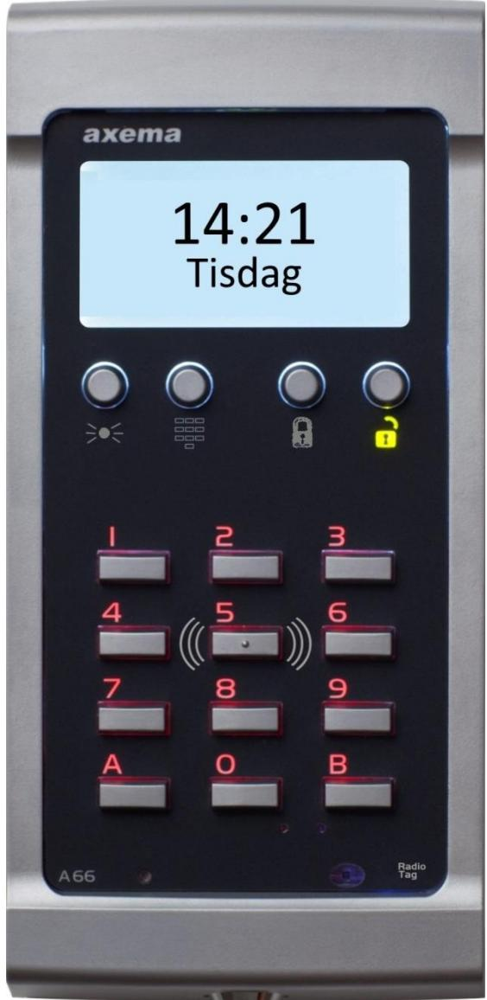
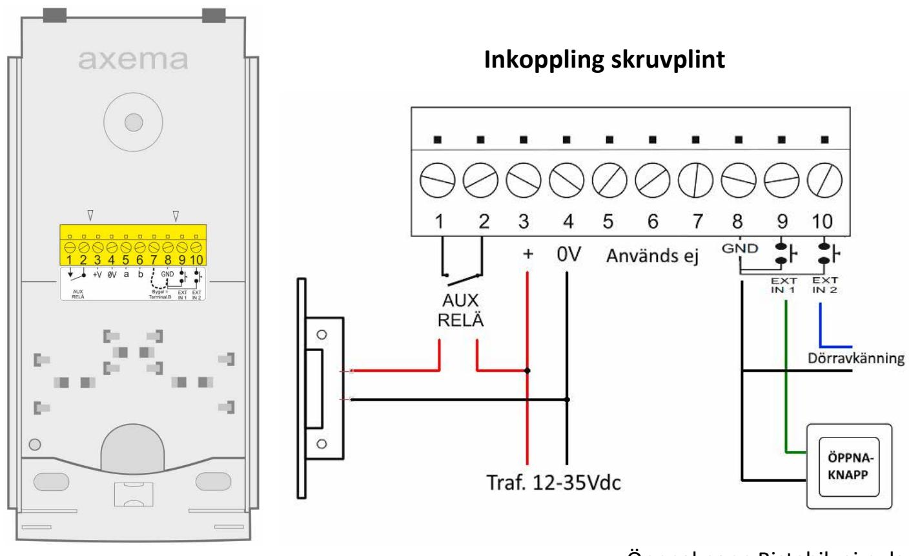
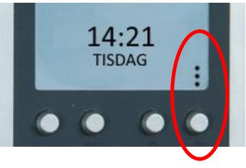

# **A66 Läsarterminal kompaktläge**

Inkopplingsanvisning & Programmering. (fr. Rev3)

*20016-12 Se www.axema.se för de senaste manualerna.* 

Öppnaknapp Bistabil, ej puls.

Dörravkänning bryter ner öppnings-reläet när dörren öppnas. Slutning när dörr är stängd. Inget varningsljud efter ställd öppentid.

# **Avläsning**

Visa brickan/kortet mitt framför knappsatsen (numeriska), mot siffran 5. Avläsning visas genom att de bakgrundsbelysta siffrorna blinkar 2 gånger. Om läsaren inte reagerar är Mifare/EM läsning avaktiverad i programvaran. Alternativt är brickan inte kompatibel. Radio: 868Mhz. Enbart Axemas sändare.

# **Driftsättning**

- Koppla in och strömsätt A66 (displayen tänds inte upp automatiskt!).
- Tryck knapparna **A+B samtidigt**, texten **ENTER PROGRAMMING CODE** visas, ange koden **112233**. Gör om steg ett om det ej fungerar.
- Välj språk (Svenska är förvalt) tryck OK.
- Du är nu i programmeringsläge, mata in aktuellt datum och tid.
- Fortsätt med att lägga till koder, brickor m.m.

## **OBS! Byt ut programmeringskoden till en egen 6-siffrig kod!**

### **Programmeringsläge**: Tryck *programmeringsknapp* (se bild) och ange koden (112233).

**Obs!** Aktuell tid och dag visas normalt alltid i displayen.

# Visas **--:--** i displayen måste tiden ställas.

OBS! Tappar tiden efter ca: 20 tim. utan spänning. *Exempel på programmering* 

- I programmeringsläge, välj **TIDER** och programmera **TID/DATUM.**
- När du angett aktuellt datum och tid återgår A66 till huvudmenyn. (Du märker att OK inte behöver väljas på alla ställen då A66 sparar automatiskt när inmatning är klar).
- Välj **KODER** och ange en 4-siffrig användarkod, samt välj ALLTID (eller tidschema om det är programmerat). Upp till 10 koder kan programmeras och 3 tidscheman finns tillgängliga.
- Välj **BRICKOR** för brickor eller handsändare. Varje ny bricka registreras på en ledig position (000- 499). Notera Position nr. och aktuell person enligt exempel på lista nedan.
- SERIEINLÄGGNING är mycket användbart om du skall registrera ett större antal brickor. Detta kräver brickor med ID i nummerföljd och dessa registreras i läsaren på bara några sekunder genom att man anger första och sedan sista numret i serien.

**OBS!** För att radera en borttappad bricka måste du ha tillgång till Position nr. eller ID nr. på brickan. Du får en bra översikt genom att gå till menyn **TA BORT BRICKA** → **FRÅN LISTA**

| Position: | ID nr.    | Namn:               |
|-----------|-----------|---------------------|
| 000       | 0055 2001 | Lägenhet A bricka 1 |
| 001       | 0055 2002 | Lägenhet A bricka 2 |
| 002       | 0055 2003 | Lägenhet A bricka 3 |
| 003       | 0055 2004 | Lägenhet B bricka 1 |

**Hämta Excel-mallen på axema.se/support** (välj "spara fil)

**Mycket användbar!**

| Fabriksinställningar:    |             | Prestanda:         |                              |
|--------------------------|-------------|--------------------|------------------------------|
| Öppningstid              | 7 sekunder  | Antal kort/brickor | 500                          |
| EM Läsare                | Aktiverad   | Antal koder        | 10                           |
| Mifare Läsare            | Aktiverad   | Tidscheman         | 3 (x 3 Till/Frånslag)        |
| Radio                    | Deaktiverad | Dagöppet           | X (på tidschema)             |
| Posten IR (kanal 1-6) | Deaktiverad | Kodlås spärras     | X (efter 3 felaktiga försök) |
| Bakgrundsbelysning       | Aktiverad   | Driftspänning      | 10-30 VDC                    |
| Ljud                     | Mellan      | Max Last (relä)    | 1 Amp.                       |
| Sommar/Vintertid aut.    | Aktiverad   |                    |                              |
| Omvänd funktion          | Deaktiverad |                    |                              |

#### **Strömförbrukning** vid 24V: **Mått:** A63/A66: 180x87x27 (HxBxD)

| A66                            | Vila |  |
|--------------------------------|------|--|
| Enbart EM                      | 45mA |  |
| Enbart Mifare                  | 50mA |  |
| EM+Mifare                      | 60mA |  |
| Lästeknik: EM 4200/4102 125khz |      |  |

Mifare: Avläsning av serienummer: Classic, Plus, Ultralight, Desfire, Desifre EV 1, Desfire EV2 Radio: 868Mhz. Enbart Axemas sändare.

#### 20016-12 A66 Kompaktläge Sida 3

## **A66 Meny-översikt**

#### **TIDER**

- **TID/DATUM** *Inställning av datum och tid*
- **TIDSCHEMA** *3 st. tidscheman med 3 intervall per dag*
- **ÖPPNINGSTID** *01 – 999 sek (16 min). (Ej bistabil funktion)*

#### **KODER**

- **NY KOD** *Programmera ny kod och välj tidsschema för koden*
- **ÄNDRA KOD** *Välj kod att ändra.* (OBS! Det går inte byta tidsschema på kod)
- **TA BORT KOD** *Raderar vald kod*

#### **BRICKOR**

- **NY BRICKA** *Visa brickan framför läsaren eller ange ID nummer. Alt. Handsändare.*
- **SERIEINLÄGGNING** *Visa första och sedan sista brickan framför läsaren, alternativt ange första och sedan sista numret i serien* 
	- **TA BORT BRICKA** *VISA BRICKA Håll upp bricka framför läsaren* 
		- *ANGE POSITION Knappa in brickans position, därefter OK*
		- *ANGE NUMMER Knappa in brickans ID nummer, därefter OK*
		- *FRÅN LISTA Stega fram till aktuell bricka, därefter OK*
	- **TIDSCHEMA BRICKA** *Välj tidschema för brickor* (gäller samtliga brickor)
	- **TIDSCHEMA BRICKA+PIN** *Välj tidschema för brickor* (gäller samtliga brickor). Med detta valt krävs pin-kod. Väljs första gången vid passage. Handsändare fungerar på bricka+pin om bricka är aktiv.

**DAGÖPPET** *Välj tidsschema för att hålla dörr öppen. Alt. Alltid eller aldrig .* 

**ÖPPNAKNAPP** *Välj tidsschema för öppnaknappen. Alt. alltid eller aldrig.* 

| ÖVRIGA TILLVAL                  | Fabriksinställning markerat med Fetstil         |  |
|---------------------------------|-------------------------------------------------|--|
|  OMVÄND LÅSFUNKTION         | Aktivera/Deaktivera. Fr. Rev.3.                 |  |
|  POSTEN IR                  | Välj kanal för att Aktivera/Deaktivera          |  |
|  RF SÄNDARE                 | Knapp A Aktiv, Knapp B aktiv, o.s.v. Fr. Rev.3. |  |
|  MIFARE                     | Aktivera/Deaktivera                             |  |
|  EM                         | Aktivera/Deaktivera                             |  |
|  BAKGRUNDSBELYSNING         | Aktivera/Deaktivera                             |  |
|  LJUD (knappljud)        | Avstängt/lågt/mellan/högt, därefter OK          |  |
|  PROGRAMMERINGSKOD          | Välj ny kod för programmering                   |  |
|  SPRÅK                      | Välj språk, därefter OK                         |  |
|  SOMMAR/VINTERTID-AUTOMATIK | Aktivera/deaktivera                             |  |
|  FABRIKSÅTERSTÄLLNING       | Bryt spänning för återstart.                    |  |

**OBS!** Vid borttappad programmeringskod, kontakta Axema support.