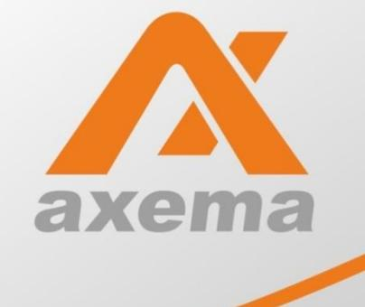
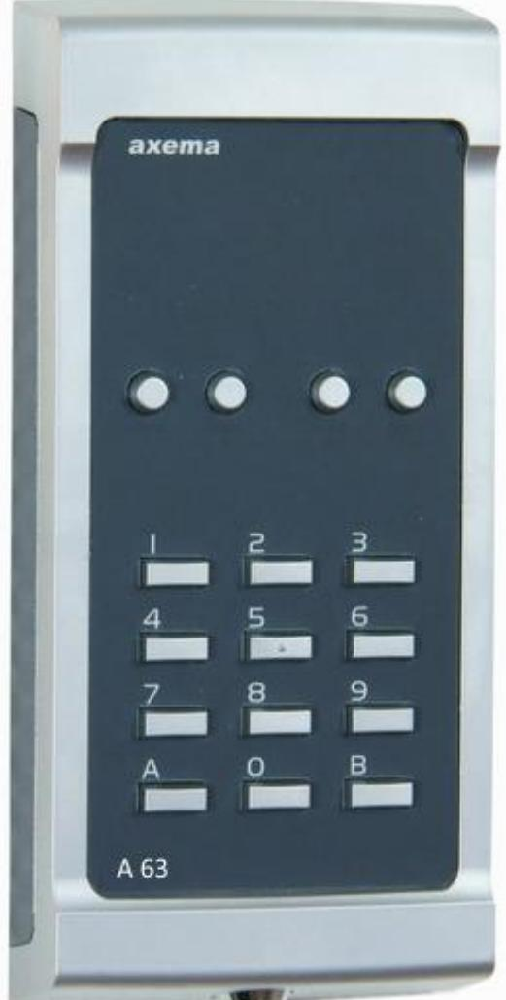
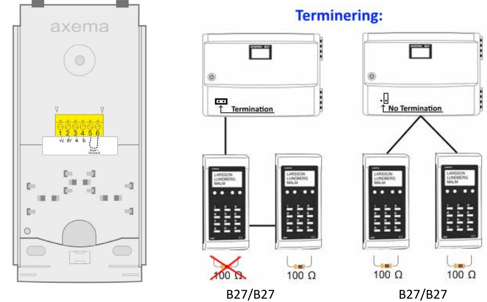
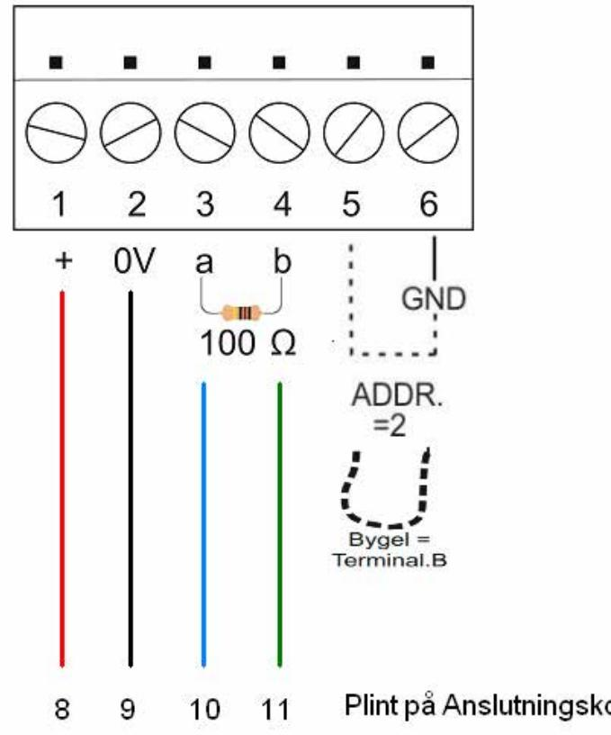
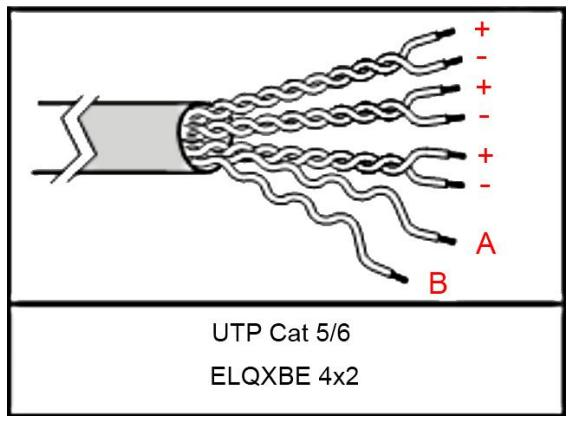

# **A63 Läsarterminal**

Inkopplingsanvisning

*20024-05 Se www.axema.se för de senaste manualerna.* 

Obs! Används endast en terminal skall den alltid termineras.

# **Inkoppling skruvplint:**

| Plint nr | Användning:                      | Plint i B17/B27 |
|-------------|----------------------------------|-----------------|
| 1-2         | Matningsspänning + på plint 1 | 8 - 9     |
| 3-4         | Kommunikation *               | 10 - 11   |
| 5-6         | Läsare för utpassering: kortslut | -               |

***** Terminering enligt illustration på sidan 2.

## **Kabel-längder:**

| Kabel       | Längd vid 24 V | Max ext. last |
|-------------|-------------------|---------------|
| 1 x 4 x 0,5 | 150 m             | 200 mA        |
| Cat 5/6     | 200 m             | 200 mA        |

Bild på hur **UTP Kat 5** skall kopplas:

**OBS!** Max kabellängd är 10 m mellan B16/26 (äldre hårdvaran) och A66 terminal. Ingen terminering skall användas.

### **Avläsning.**

Visa brickan/kortet mitt framför knappsatsen (numeriska), mot siffran 5. Avläsning visas genom att de bakgrundsbelysta siffrorna blinkar 2 gånger. Om läsaren inte reagerar är Mifare/EM läsning avaktiverad i programvaran. Alternativt är brickan inte kompatibel.

A63 kan läsa både EM & Mifare var för sig eller samtidigt. Detta programmeras i Vaka under *Inställningar - Kort/Kod – Brickor*. EM är aktiverat som standard.

#### **Tekniska Data:**

Strömförsörjning: från dörrcentral Spänningsmatning 12-35VDC Mått: (HxBxD) 180x87x27

Strömförbrukning vid 24V:

| A 66          | Vila  |
|---------------|-------|
| Enbart EM     | 45mA  |
| Enbart Mifare | 50mA  |
| EM+Mifare     | 60mA  |
| Maxlast Relä  | 1Amp. |

#### **Lästeknik:**

EM: 4200/4102 125khz. Mifare: Läser serienummer: Classic, Plus, Ultralight, Desfire, Desifre EV 1, Desfire EV2

20024-05 A63 Inkopplingsanvisning Sida 4