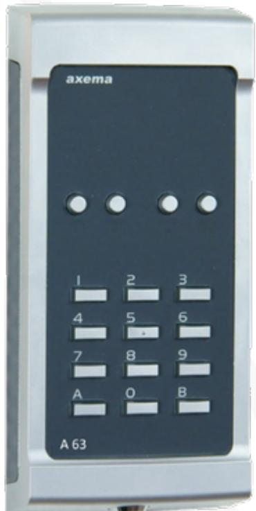

## Datablad

Uppdaterad 2021-05-05

## **Läsare VAKA A63**

A63 används i VAKA som kodlås eller beröringsfri läsare med stöd för EM- och Mifare-lästeknik

## Funktionalitet och användningsområden

- l Läsarterminal i VAKA för beröringsfria kort och brickor med stöd för både EM och MIFARE.
- l A63 är en robust och motståndskraftig med metallkapsling avsedd för utomhusbruk. Knappsatsen kan användas för personlig kod (PIN) vid t ex. larmstyrning eller för s.k. gruppkod under vissa tider.
- l Mellan dörrcentralen B28 eller B18 och A63-kombiläsaren kan befintligt kablage (4-ledare) (upp till 150 m) återanvändas.
- l Läsavståndet är ca 7 cm med EM-bricka och 3 cm för MIFARE bricka. A63 kopplas till dörrcentralerna B28 eller B18.

## Teknisk Data

| Attribut                                      | A63                                              |
|-----------------------------------------------|--------------------------------------------------|
| (HxBxD) mm Mått                         | 184x87x27                                        |
| Kapsling                                      | Metall                                           |
| Montage                                       | Väggmontage utanpåliggande/infällt            |
| Display                                       | Nej                                              |
| Knappsats                                     | Ja                                               |
| EM 4200/4102                               | Ja                                               |
| MIFARE                                        | Ja                                               |
| MIFARE DESFire EV2                      | Ja                                               |
| Radio 868 MHz                           | Nej                                              |
| Postens IR                                 | Nej                                              |
| Läsavstånd vid optimala förhållanden | 7 cm med EM 3 cm med MIFARE |
| Sabotagedetektering                           | Ja                                               |
| Inbyggd högtalare                          | Ja                                               |
| Inbyggd mikrofon                           | Nej                                              |
| Ingång för öppnaknapp                   | Nej                                              |
| Ingång för tidur                        | Nej                                              |
| Låsbar kapsling                            | Ja                                               |
| Strömförsörjning                              | Från dörrcentral                              |
| Elektrisk anslutning                       | Skruvplint                                       |
| Effekt vila (W)                         | 2                                                |
| Effekt max (W)                          | 7,5                                              |
| Strömförbrukning vila @12V (mA)      | 140                                              |
| Max strömförbrukning @12V(mA)           | 590                                              |
| Strömförbrukning vila @24V (mA)      | 70                                               |
| Max strömförbrukning @24V(mA)           | 295                                              |
| IP-klass                                      | IP55                                             |
| IK-klass                                      | IK08                                             |

| Attribut                | A63                  |
|-------------------------|----------------------|
| Temperaturområde (C) | -30° till +55° |
| Art.-nr                 | 2-1630               |
| E-nummer                | EE5870493            |