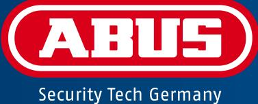

## **ABUS Industri säkerhet**

Säkra arbetsplatser för att skydda de anställda

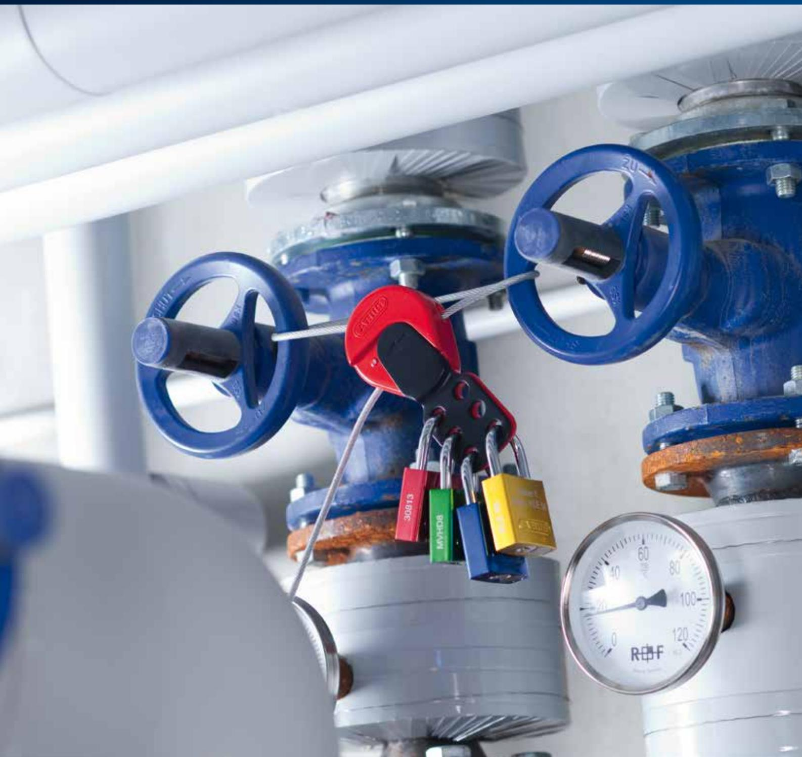

En säker arbetsplats är nog vad alla arbetstagare önskar sig. Och då avses inte bara den ekonomiska aspekten att i möjligaste mån ha ett fast jobb fram till pensioneringen, utan att arbetsplatsen även ska vara säker i ordets sanna betydelse: skyddad mot faror, fri från skade- och hälsorisker.

Syftet med ökad säkerhet på arbetsplatsen är att försöka tillgodose just denna önskan. För arbetsgivare finns det därför bindande riktlinjer och regler, som ska bidra till att skydda de anställda. Regler och anvisningar allena skyddar dock inte. Snarare behövs konkreta säkerhetsåtgärder som faktiskt förhindrar olyckor. Det är här som produkterna inom områdena lockout (processbrytning) och tagout (märkning) kommer till användning.

Produktportföljen omfattar särskilda hänglås och olika låsanordningar. Låsen kan användas till att låsa bland annat maskiner, ventiler, stickkontakter och strömbrytare på ett sådant sätt att de inte kan manövreras vid t.ex. underhållsarbeten. Därmed säkerställs säkerheten för de anställda, och olyckor förhindras effektivt.

## **INNEHÅLL**

| ABUS låsanordningar för arbetarskydd     | 4–5   |
|------------------------------------------|-------|
| Låsanordning för huvudströmbrytare       | 6–7   |
| Låsanordning för rattar och kranar       | 8–9   |
| Låsanordning för kulventiler             | 10–11 |
| Låsanordning för kulventiler             | 12–13 |
| Låsanordning för kretsbrytare            | 14–15 |
| Låsanordning för flerpoliga kretsbrytare | 16–17 |
| Låsanordning för stickkontakter          | 18–19 |
| Låsanordning för gasflaskor              | 20–21 |
| Låsanordning för tryckluftsanslutningar  | 22–23 |
| Safelex™ vajerlås för universellt bruk   | 24–25 |
| Vajerlås i standardutförande             | 26–27 |
| Safety Redbox™ processbrytningsdepå      | 28–29 |
| ABUS hänglås för arbetarskydd            | 30–31 |
| 74 SÄKERHETSLÅSET                        | 32–33 |
| 72 TITALIUM™ FÄRG                        | 34–35 |
| T84MB SÄKERHETEN FÖRST                   | 36–37 |
| T65AL myLOCK                             | 38–39 |
| ABUS                                     | 40–41 |
| Anteckningar                             | 42–43 |

### **Säkra arbetsplatser för att skydda de anställda**

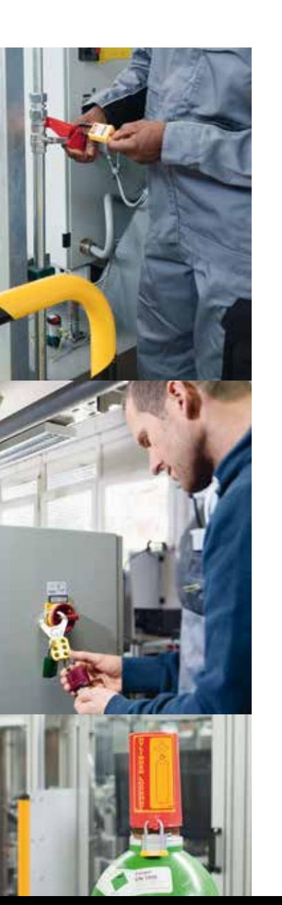

#### **Förbyggande skydd – för dina anställdas säkerhet**

Ett ögonblicks oaktsamhet, ett litet slarv – och så har det hänt. Olycksfall i arbetet sker inte avsiktligt, och i regel inträffar de utan någons förskyllan. Men följderna av dessa oaktsamma ögonblick kan vara graverande: Varje år dör omkring 50 personer i arbetsolyckor, och över 100.000 arbetstagare skadas, en del av dem svårt.

Särskilt inom industrin, där anställda hanterar giftiga kemikalier, höga temperaturer, stora maskiner eller verktyg med vassa kanter, är risken för olyckor extremt hög. Det är snabbt hänt att en eld i ugnen hamnar utom kontroll, att explosiva material fattar eld, spillror faller ner eller arbetare kläms i maskiner. Då är det ofta svårt att hjälpa – inte sällan kommer all hjälp för sent.

Därför är det inte bara nödvändigt att ställa upp tydliga riktlinjer för hur man ska agera i nödsituationer, utan viktigare är att ha ett förebyggande arbetarskydd. Redan med enkla åtgärder och säkerhetsprodukter, som utan problem kan integreras i arbetsvardagen, kan man nämligen på ett effektivt sätt förhindra olyckor – och således skydda arbetstagare.

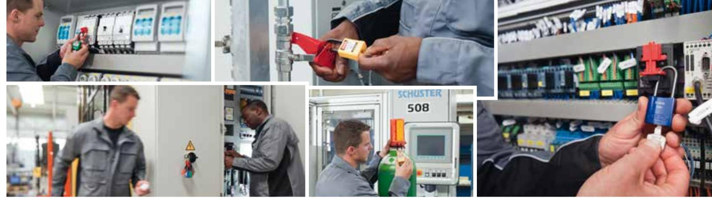

## **ABUS låsanordningar för arbetarskydd Synlig processbrytning**

#### **Ursprung i USA**

4 5 **Bred produktportfölj för processbrytning och märkning** ABUS erbjuder ett brett sortiment av produkter för arbetarskydd, som i fackjargongen även går under beteckningen lockout/tagout. Med lockout avses då den faktiska fysiska låsningen av t.ex. tekniska anläggningar eller avstängningskranar, vilket kan beskrivas som processbrytning. Med tagout däremot avses märkningen med informations- eller varningsskyltar. Till en korrekt låsningsrutin hör motsvarande märkning. Tagout kan också utföras separat om en fysisk låsning inte är möjlig. ABUS erbjuder en mängd olika låsanordningar för stora anläggningar, ventiler, kulventiler, handrattar, tryckluftsanslutningar och mycket mer. Med hänglås som är avsedda speciellt för arbetarskyddet, går det att låsa låsanordningarna. Det breda utbudet av färger, fält för påskrifter och till och med individuella gravyrmöjligheter, uppfyller alla krav på att visa varningsfunktionen och samtidigt göra synligt vem respektive hänglås tillhör. Mer information om våra produkter hittar du på sidorna som följer.

Lockout/tagout har sitt ursprung i USA. Där sätts lockout/tagout-systemet främst i samband med den delstatliga arbetsmiljömyndigheten OSHA. Enligt OSHA, som har ett betydande ansvar när det gäller arbetarskyddet, är lockout/tagout-systemet det bästa tillämpningsexemplet på hur arbetsplatsolyckor vid underhålls- eller reparationsarbeten kan förebyggas.

ABUS erbjuder olika låsanordningar för huvudströmbrytare, som används för att tillfälligt låsa ställverk. Med dessa kan man lätt stänga av huvudströmbrytare och i och med det energikällorna när underhåll ska utföras. På så sätt förhindras en oavsiktlig återinkoppling på ett enkelt och eff ektivt sätt.

#### **Användningsområde**

· Säkra huvudströmbrytare vid underhåll

- · Säkra i situationer där det krävs mer än en upphängningspunkt
#### **Information**

· För upp till sex hänglås

· Valfritt med övergripande klämmor för ytterligare skydd

- · Högkvalitativa material för olika användningsområden
#### **Ditt mervärde**

Upp till sex hänglås får plats i din låsanordning för huvudströmbrytare. Om till exempel arbeten på en maskin måste utföras av fl era personer, kan var och en av dem låsa anläggningen med sitt lås. Först när underhållsarbetet är helt avslutat, tar den sista personen bort sitt lås så att huvudströmbrytaren kan slås på igen.

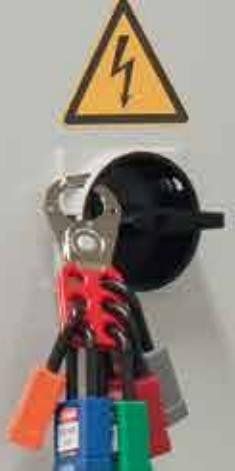

6

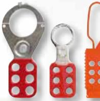

## **Låsanordning för huvudströmbrytare**

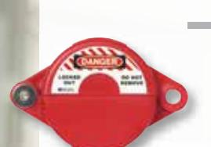

Ett regelbundet underhåll av maskiner i verksamheten är nödvändigt. För att se till att anställda som sköter underhållet inte utsätts för fara, är det viktigt att låsa vissa genomgångsventiler. För det ändamålet lämpar sig ABUS låsanordning för rattar och kranar. Den låser eff ektivt enheterna på rör, så att dessa inte kan öppnas av misstag.

**Användningsområde**

· Säkra genomgångsventiler vid underhåll

**Information**

- 
- 
- 
- 

· Högkvalitativ polypropen: långlivad, motståndskraft ig och icke-ledande · Fem storlekar: handrattar från 1 till 13 tums ventiler · Förses med ett hänglås med en bygeldiameter på upp till 9 mm · Unik möjlighet till en extra öppning för handrattar med spindel · Självhäft ande varningsskyltar på olika språk

**Ditt mervärde**

Låsanordningen för handrattar fi nns i olika storlekar och kan således användas på olika stora handrattar. Med hjälp av en perforerad del på ovansidan går det dessutom att skapa ytterligare en öppning, så att låsanordningen även kan användas på handrattar med spindel.

8

## **Låsanordning för rattar och kranar**

Låsanordningen för kulventiler lämpar sig för att låsa nästan alla vanliga kulventiler – även med fl er än två anslutna rör. Om den platta spaken står i 90 graders vinkel, kan den klämmas fast med hjälp av låsanordningen. Till slut fi xeras låsanordningen med ett hänglås så att kulventilen är låst. Då kan den inte öppnas av misstag under pågående underhållsarbete.

#### **Användningsområde**

#### **Information**

- · Stabil och säker av pulverbelagt stål
- · Två storlekar för nästan alla vanliga kulventiler
- · Många hål för exakt positionering av hänglåset för mer stabilitet
- · Särskilt lämplig för svåråtkomliga rör

#### **Ditt mervärde**

Låsanordningen för kulventiler kan användas universellt och lämpar sig också för svåråtkomliga rör. Hanteringen är praktisk och enkel, eft ersom hänglåset kan positioneras exakt tack vare många hål.

10

## **Låsanordning för kulventiler**

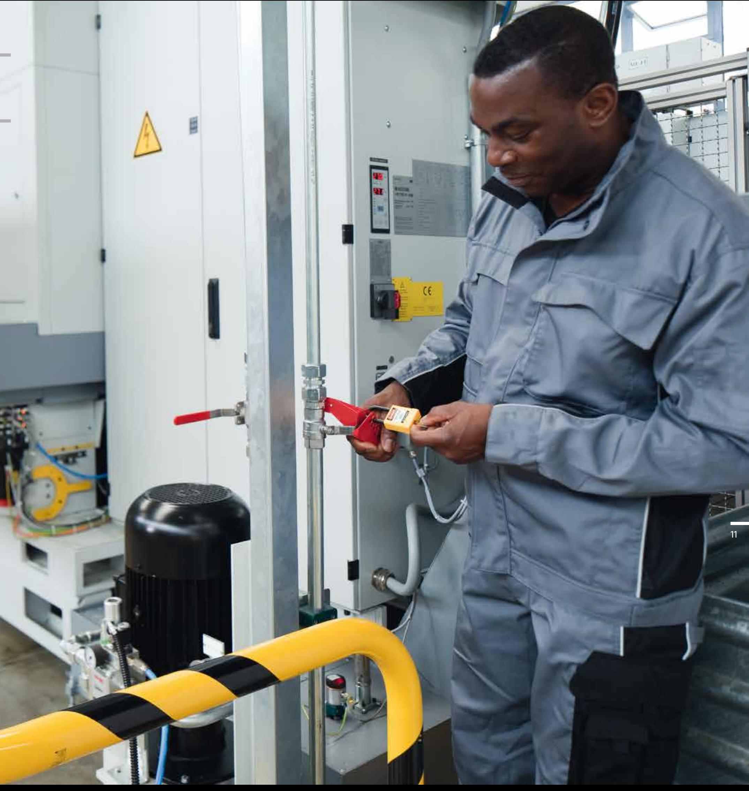

Vid underhållsarbeten måste vissa ventiler på maskiner låsas tillfälligt, för att skydda de anställda vid eller i anläggningen. Med den här låsanordningen för kulventiler låser du spaken på kulventiler i standardutförande.

#### **Användningsområde**

· Säkra kulventiler vid underhåll

#### **Information**

- · Högkvalitativ polypropen: långlivad, motståndskraft ig och icke-ledande
- · Två storlekar: handtag från 1/2 till 8 tums kulventiler
- · Noggrant anpassade hål för hänglås för exakt omslutning av ventilen

#### **Ditt mervärde**

Fördelen med låsanordningen för kulventiler är inte bara att den har låg vikt. Den övertygar framför allt med sin exakta omslutning av ventilen. Låsanordningens fyra armar ger ett optimalt stöd och klämmer även fast bredare spakar. Hänglåset kan positioneras exakt tack vare de många hålen.

## **Låsanordning för kulventiler**

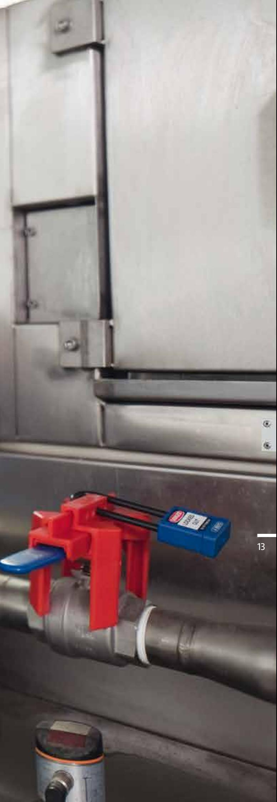

Med låsanordningen för kretsbrytare kan enskilda säkringar eff ektivt stängas av. Genom att vrida på skruven klämmer låsanordningen fast enskilda kretsbrytare och låser dem på det viset. Vid underhållsarbeten är det då säkerställt att säkringar och således maskiner inte kan kopplas in

· Säkra enpoliga kretsbrytare vid underhåll

· Högkvalitativa material: långlivade, motståndskraft iga och icke-ledande · Enkel användning med skruvmekanism för säker fastsättning · Kan användas universellt på vanliga enpoliga kretsbrytare

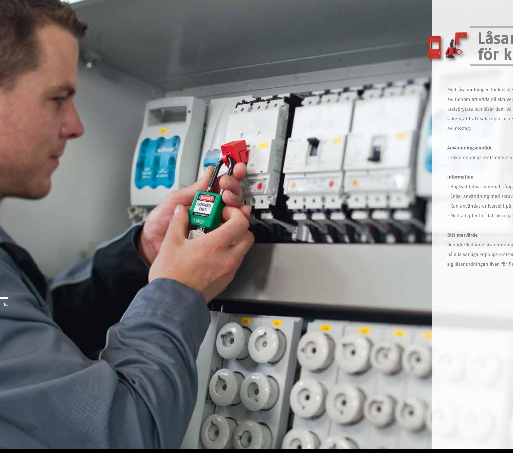

Den icke-ledande låsanordningen för kretsbrytare kan användas universellt på alla vanliga enpoliga kretsbrytare. Tack vare den extra adaptern lämpar sig låsanordningen även för fl atsäkringar.

## **Låsanordning för kretsbrytare**

Den här låsanordningen för fl erpoliga kretsbrytare lämpar sig för att tillfälligt stänga av flerpoliga kretsbrytare vid underhåll. Låsanordningen för fl erpoliga kretsbrytare kläms in i mellanrummet under förbindningsbryggan och fi xeras med justeringsratten.

#### **Användningsområde**

· Säkra fl erpoliga kretsbrytare vid underhåll

#### **Information**

- · Högkvalitativa material: långlivade, motståndskraft iga och icke-ledande
- · Enkel användning med skruvmekanism för säker fastsättning
- · För upp till två hänglås med en bygeldiameter på upp till 7 mm

#### **Ditt mervärde**

Den icke-ledande låsanordningen för kretsbrytare lämpar sig för att stänga av fl erpoliga säkringar. Det går att sätta på upp till två hänglås.

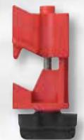

## **Låsanordning för fl erpoliga kretsbrytare**

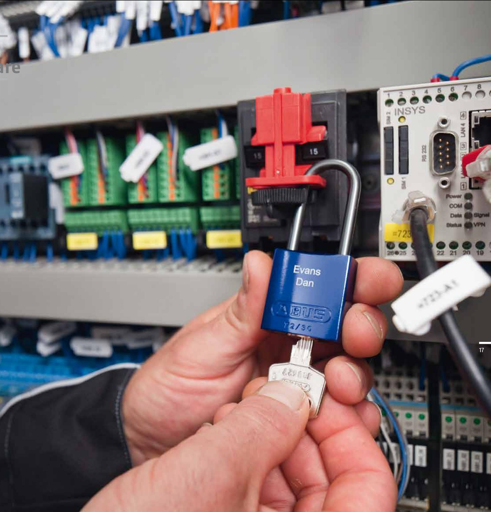

För att underhållsarbeten ska kunna utföras på maskiner, är det nödvändigt att vissa stickkontakter dras ut för att avbryta strömfl ödet. För att förhindra att dessa stickkontakter sätts in igen av misstag, kan de låsas i den här låsanordningen. Låsanordningen för stickkontakter fi nns i två storlekar.

· Säkra stickkontakter vid underhåll

- · Högkvalitativ polypropen: långlivad, motståndskraft ig och icke-ledande · Två storlekar: för vanliga stickkontakter för 110/220 V till starkströms-
- · Kabelgenomgång på båda sidor för att säkra stickkontaktsanslutningar · Självhäft ande varningsskyltar på olika språk
- · För upp till fyra hänglås med en bygeldiameter på upp till 9 mm

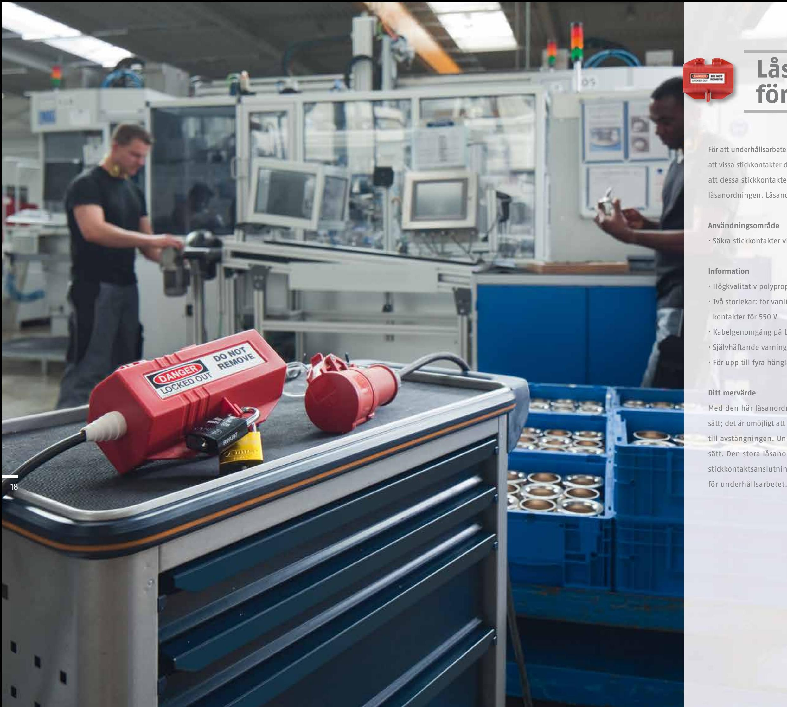

Med den här låsanordningen kan stickkontakter låsas på ett väl synligt sätt; det är omöjligt att sticka in dem. Dessutom hänvisar en varningsskylt till avstängningen. Underhållsarbeten kan således utföras på ett säkert sätt. Den stora låsanordningen kan också användas för att skydda stickkontaktsanslutningar när ett visst strömfl öde just inte får avbrytas

## **Låsanordning för stickkontakter**

Vid underhållsarbeten måste även gasfl askor och gasanslutningar säkras. För detta lämpar sig låsanordningen för gasfl askor, eft ersom den låser gasbehållare eff ektivt.

**Användningsområde**

· Säkra gasfl askor och gasanslutningar vid underhåll

#### **Information**

· Högkvalitativ polypropen: långlivad, motståndskraft ig och icke-ledande · Självhäft ande varningsskylt

· För ett hänglås med en bygeldiameter på upp till 9 mm

#### **Ditt mervärde**

Med den här låsanordningen låser du gasfl askor direkt via gasbehållaren och förhindrar därmed att gaser kan strömma ut. På så sätt är anställda skyddade under pågående underhållsarbete. En självhäft ande varningsskylt hänvisar dessutom till avstängningen.

20

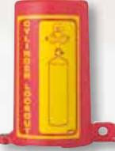

## **Låsanordning för gasfl askor**

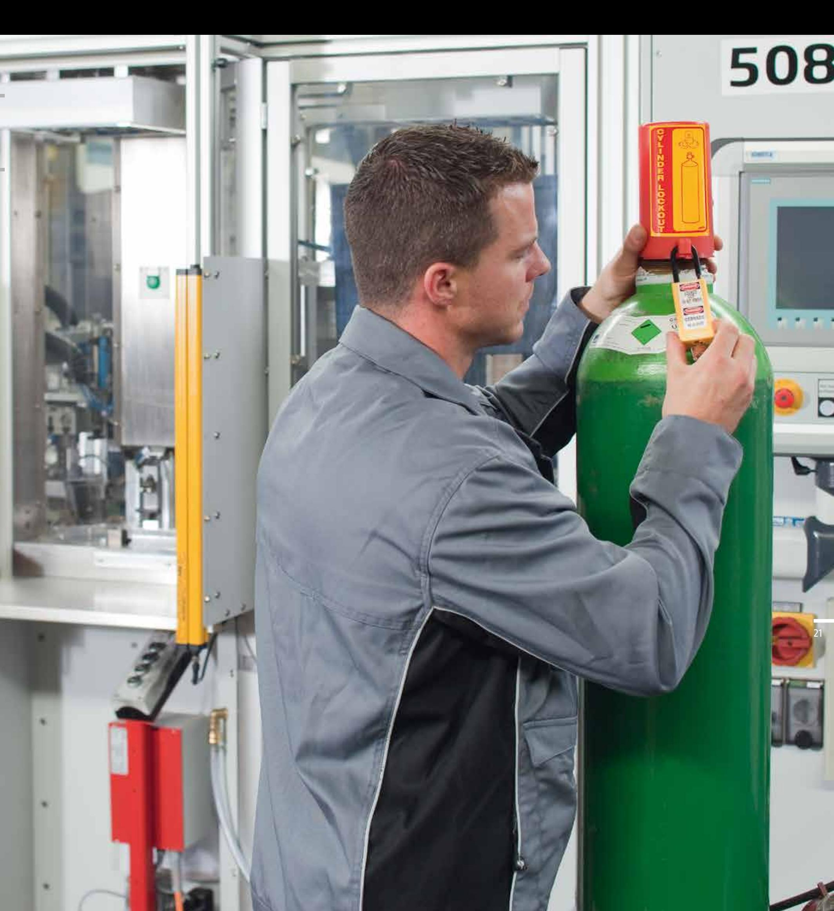

För att förhindra att tryckluft strömmar in i maskiner och sätter igång dem under pågående underhållsarbete, är det nödvändigt att vissa tryckluft sslangar dras ut och stängs av. För det ändamålet är låsanordningen för tryckluft sanslutningar idealisk.

· Säkra pneumatiska anslutningar vid underhåll

· Glasfi berarmerad nylon: långlivad, motståndskraft ig och icke-ledande · Tre olika anslutningsmöjligheter för vanliga tryckluft skopplingar med en ytterdiameter på upp till 15 mm

· Ett hål i mitten för förvaring av låsanordningen för tryckluft sanslutningar

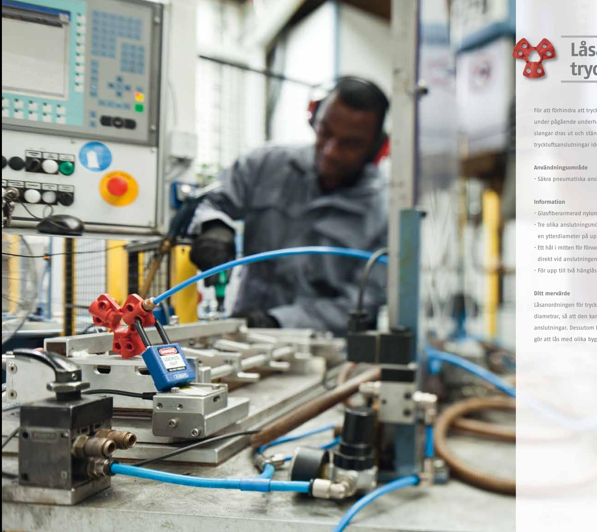

· För upp till två hänglås med en bygeldiameter på upp till 7 mm

Låsanordningen för tryckluft sanslutningar har tre anslutningar med olika diametrar, så att den kan användas universellt på alla vanliga tryckluft sanslutningar. Dessutom har varje anslutning två hål för hänglåset, vilket gör att lås med olika bygelbredder kan användas.

## **Låsanordning för tryckluft sanslutningar**

Det fi nns situationer där just den låsanordning som passar inte fi nns till hands. Men när maskiner är defekta och snabbt måste repareras, fi nns ingen tid för att leta eft er rätt låsanordning för handrattar, ställverk och annat. Det är då som det universella vajerlåset Safelex™ råder bot. Vajerlåset Safelex™ kan nämligen användas universellt, i synnerhet när större avstånd mellan två låsningspunkter måste överbryggas.

#### **Användningsområde**

- · Universell låsanordning för avstängning av diverse energikällor vid underhåll
#### **Information**

- · Enkelt utformad för smidig användning
- · Patenterad klämmekanism för säker fi xering av vajern
- · Kan eft erspännas när som helst även i låst tillstånd
- · Isolerad vajer i olika längder som kan bytas ut
- · För upp till sex hänglås

#### **Ditt mervärde**

Tack vare den fl exibla vajern – som fi nns i fyra olika längder – kan det högkvalitativa vajerlåset Safelex™ användas universellt för att stänga av diverse energikällor. Användningen är enkel och smidig, eft ersom låsanordningen kan låsas med upp till sex hänglås på samma sätt som en låsanordning för huvudströmbrytare. Vajern kläms fast direkt i Safelex™: en absolut säker och snabb metod för fi xering. 24 25

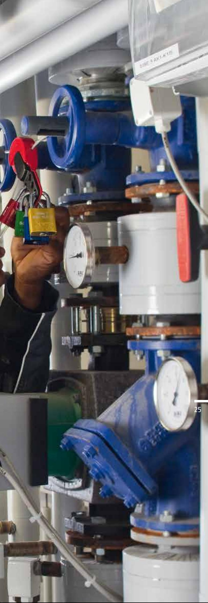

## **Safelex™ vajerlås för universellt bruk**

Vajerlåset i standardutförande används i sådana situationer där rätt låsanordning för respektive energikälla inte fi nns till hands vid just det tillfälle då underhållsarbeten ska utföras. Det kan användas på olika energikällor.

#### **Användningsområde**

- · Låsanordning för avstängning av diverse energikällor vid underhåll
#### **Information**

- · Enkelt utformad för smidig användning
- · Isolerade vajrar i olika längder som kan bytas ut
- · För upp till sex hänglås

#### **Ditt mervärde**

Användningen av det här vajerlåset i standardutförande är enkel och smidig: Vajern läggs helt enkelt som en ögla runt låsningspunkterna och fästs med vajerlåset i standardutförande. Detta kan låsas med upp till sex hänglås på samma sätt som en låsanordning för huvudströmbrytare. Den fl exibla vajern finns i olika längder och garanterar den här låsanordningens universella användningsmöjligheter.

26

## **Vajerlås i standardutförande**

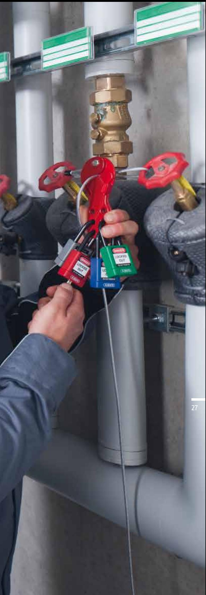

Om stora anläggningar måste underhållas krävs omfattande organisatoriska åtgärder. Ett stort antal låsningspunkter måste stängas av, många arbetslag utför arbeten och olika verksamheter pågår. Om nu alla inblandade skulle behöva låsa varje låsningspunkt, skulle det inte bara ta tid utan även medföra ett enormt antal hänglås.

Lösningen är Safety Redbox™ processbrytningsdepå. Tack vare den behöver bara förmannen stänga av samtliga låsningspunkter och sedan lägga respektive nycklar i depån. Alla andra deltagare låser sedan bara Safety Redbox™ med sina individanpassade hänglås – och alla nycklar förvaras säkert tills underhållsarbetet är klart.

#### **Användningsområde**

- · Säkra stora anläggningar där det fi nns många anslutningspunkter och underhållet utförs av många anställda
#### **Information**

- · Låg vikt samtidigt som stabiliteten är hög
- · Ergonomiskt handtag som kan fällas in och sparar plats
- · Förbättrat ljusinfall från alla håll för bättre insyn
- · Innovativ och säker låsmekanism för locket
- · Patenterat väggfäste kan även användas för förvaring av hänglåsen

#### **Ditt mervärde**

Safety Redbox™ processbrytningsdepå övertygar med sin lätthanterlighet. Den kan bäras bekvämt på grund av sin reducerade vikt. Dessutom har Safety Redbox™ ett väggfäste. Gångjärnen sitter på baksidan. På så sätt kan depån också användas stationärt, och en fast Safety Redbox™ kan tilldelas varje anläggning. Safety Redbox™ går då alltid lätt att hitta för alla anställda.

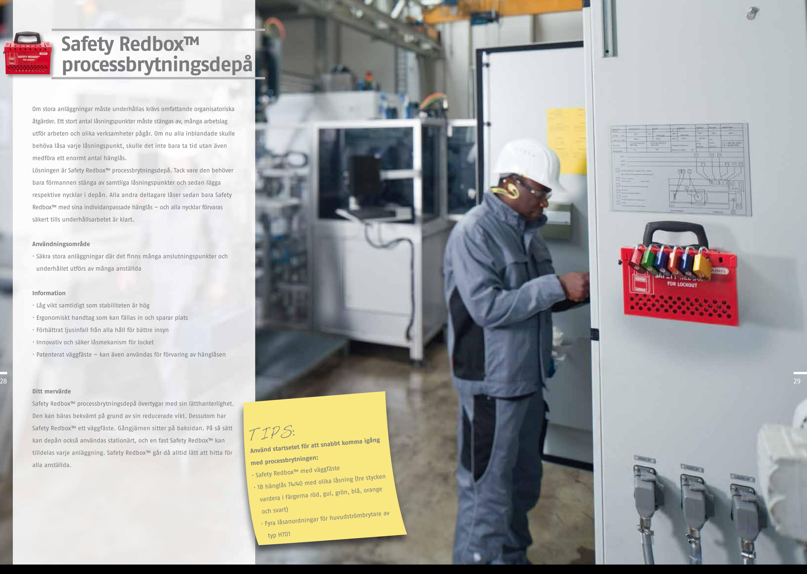

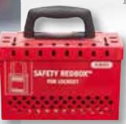

## **Safety Redbox™ processbrytningsdepå**

TIPS: **Använd startsetet för att snabbt komma igång med processbrytningen:** · Safety Redbox™ med väggfäste · 18 hänglås 74/40 med olika låsning (tre stycken vardera i färgerna röd, gul, grön, blå, orange

och svart) · Fyra låsanordningar för huvudströmbrytare av

typ H701

#### **Hänglås för arbetarskydd**

Varje företag har sina individuella förutsättningar. Därför är också villkoren för arbetarskyddet alltid olika. I en del verksamheter är korrosionsskyddet särskilt viktigt, i andra måste allt vara gnistresistent eller icke-ledande.

Förutom produkterna för industri skydd erbjuder ABUS ett brett spektrum av hänglås som inte lämnar några önskningar ouppfyllda.

Speciellt för arbetarskyddet erbjuder ABUS olikfärgade hänglås som det går att skriva, klistra eller till och med gravera på. På det viset finns alltid en snabb och enkel koppling till den anställda som använder hänglåset.

För många hänglås erbjuder ABUS också en särskilt hög servicegrad. Bland annat kan lås med lika låsning efterbeställas flera år framöver, eller så kan hänglås integreras i låssystem.

## **ABUS hänglås för arbetarskydd Märkt utrustning för processbrytning**

#### **Låssystem**

Ju mer som måste säkras, desto fler olika nycklar? Många nycklar och en oöverskådlig nyckelförvaltning är ingen nödvändighet. Här råder moderna låssystem bot. Ett låssystem är en kombination av olika hänglås som står i ett visst förhållande till varandra. Låsfunktionerna kan buntas ihop och tilldelas exakt efter behov. I ett låssystem har du nycklar som passar till enskilda lås, nycklar som passar till grupper av lås och en generalhuvudnyckel. Du tilldelar alltså tydliga åtkomstbehörigheter till dina anställda.

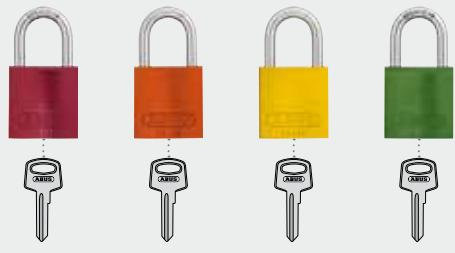

**Med olika låsning:** Varje lås har en individuell låsning. **Med lika låsning:**

Alla lås har samma låsning och kan öppnas med varje nyckel.

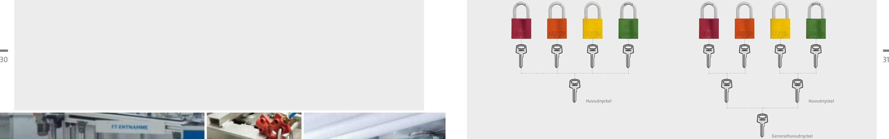

**System med generalhuvudnyckel:** Varje lås har en annan låsning. Med huvudnyckeln kan alla lås i en grupp av lås öppnas. Med generalhuvudnyckeln kan alla lås öppnas.

**Huvudnyckelsystem:**

Varje lås har en annan låsning. Med huvudnyckeln kan alla lås öppnas.

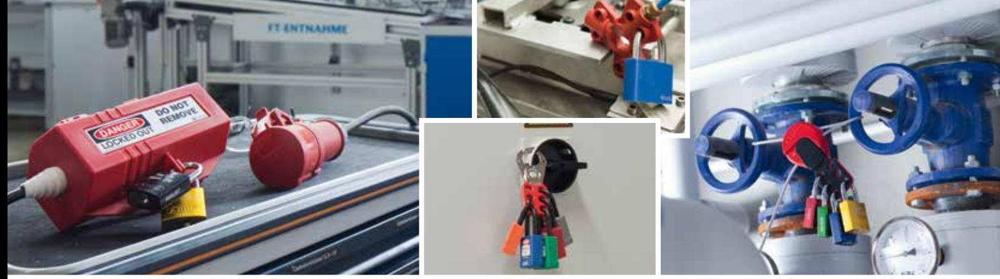

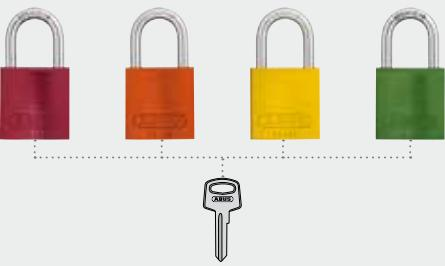

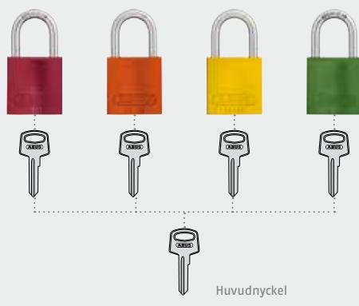

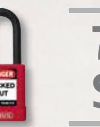

Av säkerhetsskäl får bara vissa anställda manövrera och låsa nödstoppsanordningar och maskiner. Med färgstarka hänglås är det synligt för alla vem som har den behörigheten. I elektriska och heta miljöer gäller sådana principer: Här bör du satsa på låsen i 74-serien.

**Användningsområde**

· Maskiner och anläggningar

**Information**

- · Icke-ledande och extremt värmebeständiga kan också användas i heta och elektriska miljöer
- 
- 
- för huvudströmbrytare
- 
- 
- ett låssystem
- · Aluminiumkropp mycket lättviktig och ändå massiv
- · Kroppen och bygeln är plastmantlade och fi nns i nio olika färger –
- kan tilldelas och särskiljas efter område eller användare skrapskydd för känsliga ytor
- · Idealisk bygelhöjd för användning med låsanordningar
- · Precisionscylinder med sex stift och paracentrisk profil hög skyddsnivå mot manipulering, t.ex. uppdyrkning · Låstvång – nyckeln går bara att dra ut när låset är låst.
- · Hänglås i 72- och 74-serien kan kombineras med varandra i

**Ditt mervärde**

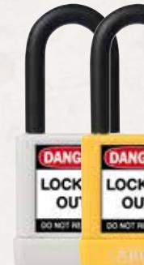

Hänglåsen i 74-serien ökar arbetarskyddet eff ektivt. De är icke-ledande och värmebeständiga, vilket gör att de utan betänkligheter även kan användas vid underhållsarbeten på maskiner och ställverk.

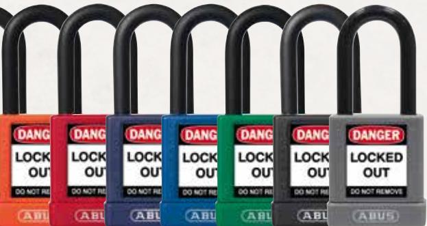

32

## **74 SÄKERHETSLÅSET**

#### TIPS:

**Självhäft ande varningsmärken varnar för** 

**risker och faror!** För hänglåsen i 74-serien erbjuder ABUS passande lockout-klistermärken på olika språk. Just när det gäller arbetarskydd är klistermärkena ändamålsenliga. Med deras hjälp syns det genast att en maskin medvetet har stängts av tillfälligt på grund av t.ex. underhållsarbeten. Arbetarskydd har högsta prioritet. Med låsen i 72-serien ökar du säkerheten för dina anställda. Du kan koppla låsen till vissa personer eller grupper baserat på färgen. På så sätt syns det vem som låser anläggningar och vem som har behörighet att låsa upp.

#### **Användningsområde**

- · Dörrar och portar
- · Förråd och källarutrymmen
- · Verktygslådor
- · Maskiner och anläggningar

#### **Information**

- · Aluminiumkropp mycket lättviktig och ändå massiv
- · Eloxerad låskropp i åtta olika färger kan tilldelas och särskiljas eft er område eller användare
- · Bygel av härdat stål som har behandlats med NANO-Protect™ som korrosionsskydd
- mycket bra skydd mot angrepp, står emot väderpåverkan
- · Idealisk bygelhöjd för användning med låsanordningar för huvudströmbrytare
- · Precisionscylinder med sex stift och paracentrisk profi l hög skyddsnivå mot manipulering, t.ex. uppdyrkning
- · Inklusive två nycklar
- · Hänglås i 72- och 74-serien kan kombineras med varandra i ett låssystem

#### **Ditt mervärde**

Ett hänglås i 72-serien är idealiskt för arbetarskyddet. Det är säkert, lättviktigt och möjliggör en entydig koppling med hjälp av färgerna.

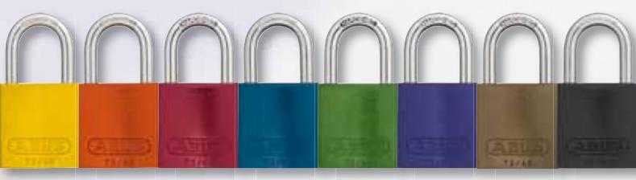

34

## **72 TITALIUM™ FÄRG**

35

#### TIPS:

**Individanpassa ditt hänglås!**En gravyr lämpar sig utmärkt för att individan- passa lås och på så sätt möjliggöra en snabb och enkel koppling. Med gravyrtjänsten erbjuder ABUS en per-

fekt möjlighet för dig att individanpassa dina hänglås eft er eget tycke.

T84MB är resistent mot gnistor och särskilt tåligt när det gäller väderpåverkan. Inom ramen för arbetarskyddet kan det användas överallt där klimatet är lite råare.

#### **Användningsområde**

- · Skåp och klädskåp
- · Väskor och resväskor
- · Schatull, kassetter osv
- · Maskiner och anläggningar

#### **Information**

- · Låskropp och bygel av massiv mässing
- · Dubbel låsning (från 30 mm)
- · Inre delar av rostfria material
- · Precisionscylinder med fyra stift och paracentrisk profi l hög skyddsnivå mot manipulering, t.ex. uppdyrkning
- · Automatisk låsning: låsning utan nyckel genom nedtryckning av bygeln

#### **Ditt mervärde**

T84MB är resistent mot gnistor och lämpar sig idealiskt för användning i explosiv miljö och extrema väderförhållanden, t.ex. i havsområden och hamnar. Här kan det till och med användas utomhus utan betänkligheter.

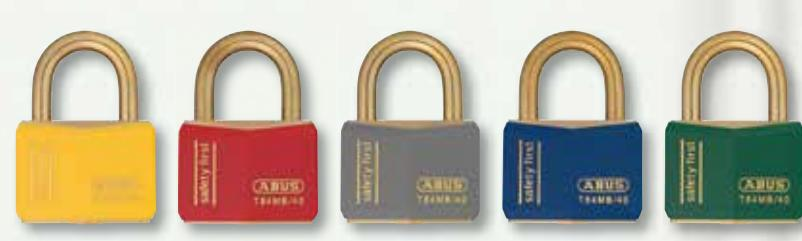

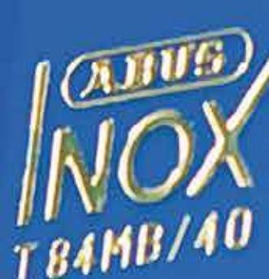

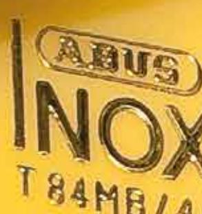

36

## **T84MB SÄKERHETEN FÖRST**

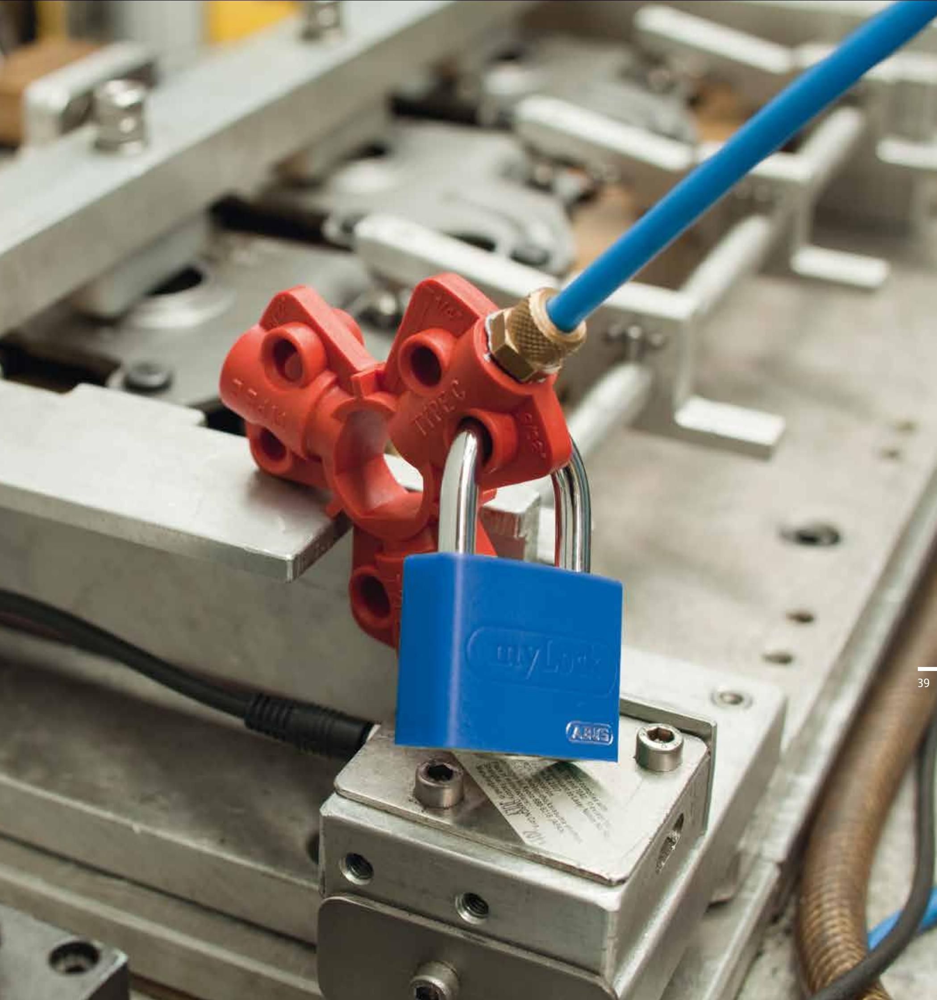

Individualitet är T65AL40:s starka sida. De färgstarka låsen kan lätt förses med text och på så sätt kopplas entydigt till sina användare. Det fi nns ingen risk för förväxling!

#### **Användningsområde**

- · Förråd
- · Klädskåp och skåp
- · Verktygslådor
- · Maskiner och anläggningar

#### **Information**

- · Aluminiumkropp stabil och särskilt lättviktig
- · Härdad dubbelreglad stålbygel hög skyddsnivå mot angrepp som klipp och dragning
- · Skrapskydd tack vare plastmantel skonar känsliga ytor
- · Det går lätt att skriva med en fi ltpenna på plastmanteln, och denna kan också förses med bilder och logon
- · Finns i sex olika färger färgmässig särskiljning eft er användare eller ansvarsområden

#### **Ditt mervärde**

Låsen i serien T65AL40 övertygar med sin låga vikt. Tack vare de olika färgerna kan låsen på ett lätt sätt kopplas till olika användare eller områden. Plastmanteln kan dessutom märkas individuellt.

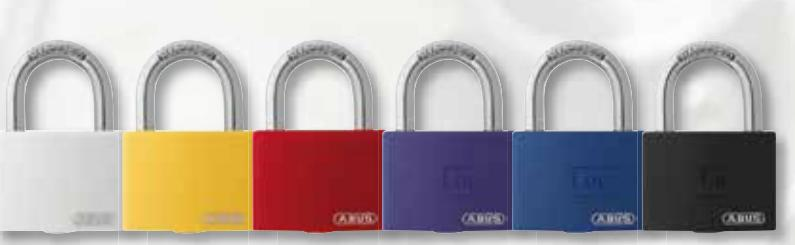

## **T65AL myLOCK**

38

"Gör det som ligger dig varmt om hjärtat. "

Det var med detta motto som August Bremicker vågade ta steget att starta eget i den lilla byn Volmarstein vid floden Ruhr 1924. Med visionen att skapa produkter som skyddar människors liv och säkrar deras egendom startades produktionen av de första låsen i källaren i huset där familjen bodde. Familjeföretaget växte till en företagsgrupp som idag driver verksamhet i hela världen.

Outtröttliga insatser, idérikedom, skicklighet och kunskap inom utveckling, produktion och försäljning utgör grundstenarna för familjeföretagets framgång, ett företag som idag ägs av den tredje och fjärde generationen.

ABUS säkerhetskompetens grundar sig på ett omfattande produktsortiment för grundläggande mekaniskt skydd från källare till tak. Det här programmet har redan utvidgats till att omfatta mobil säkerhet med produkter för cyklar, motorcyklar, båtar med mera.

Sedan 2001 ingår ABUS dotterbolag ABUS Security-Center, vars kompetensområde är elektronisk säkerhet, i ABUS-koncernen. Företaget erbjuder ett sortiment som omfattar allt från moderna larmanläggningar till högteknologiska lösningar för intelligent videoövervakningsteknik.

# **ABUS**

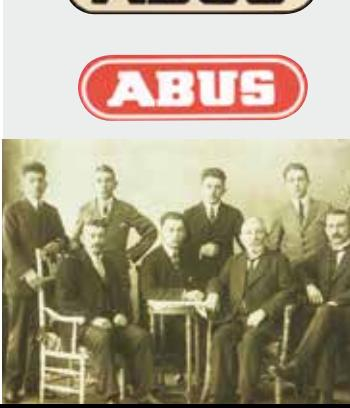

Som välrenommerad leverantör av högvärdiga låssystem inom objektområdet profilerar sig ABUS Pfaffenhain i ABUS-koncernen sedan 2003. Referensobjekt, som lyxhotellet Burj al Arab i Dubai eller Wembley Stadium i London, får beröm och uppmärksamhet

utöver gränserna.

ABUS-koncernens yngsta medlem är sedan 2010 ABUS Seccor med specialistområdet elektronisk åtkomstkontroll.

Precis som vägarna blir allt kortare och sammankopplingen i nätverk blir allt vanligare i globaliseringens och digitaliseringens tidevarv, så utvecklas också ABUS väg i den riktningen. För företagen i ABUSkoncernen innebär det att de växer ihop allt mer – precis som det brukar vara i en bra familj. Med säkerhetslösningar som är allt tätare sammankopplade, tar vi hänsyn till våra kunders växande krav. Den centrala punkten är ABUS märkeskvalitet: För ABUS betyde "Tillverkat i Tyskland" att vi som märkestillverkare arbetar i ett team och att vi håller samma normer i hela världen.

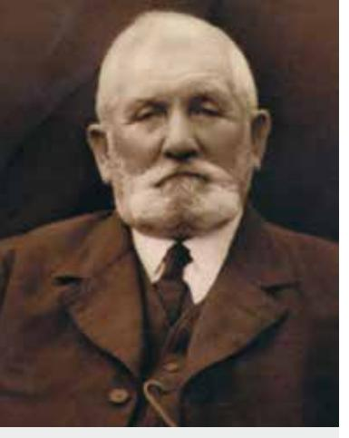

| Anteckningar |
|--------------|
|--------------|

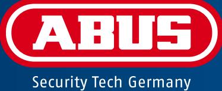

**Kontakt:**

**ABUS** | August Bremicker Söhne KG Altenhofer Weg 25 58300 Wetter, Tyskland Telefon: +49 2335 634/0 Fax: +49 2335 634/259 E-post: info@abus.de Internet: www.abus.co m

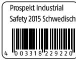