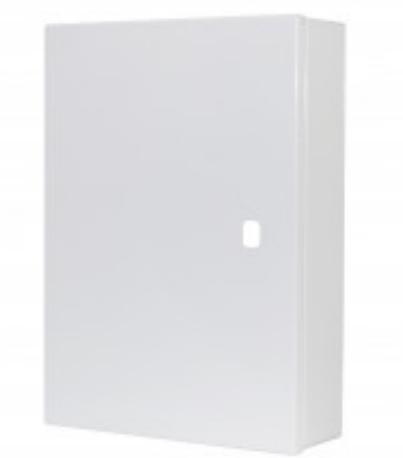

## DOCBOX-A4-I

## Dokumentskåp A4 i stålplåt för ritningar i format A4, hål för industricylinder

## **Produktdetajler:**

Powered by TCPDF (www.tcpdf.org)

| Kapsling            | Metall            |
|---------------------|-------------------|
| Färg                | Vit               |
| Mått (L x B x H) mm | 370 x 290 x 85 mm |
| Lock                | Nej               |

Dokument- och ritningsskåp för att kunna förvara serviceritningar, orienteringsritningar och annan information i närheten av manöverpanelen enligt SSF 130:8.

För ritningar samt dokumentation i format A4.

Dokumentskåpet är i vitlackad 1,5 mm stålplåt med klämma för att hålla fast ritningarna inuti skåpet. Klämman är enkel att ta bort. Baksidan på skåpet har en ram på ca 30 mm med färdigstansade borrhål på 4 mm för att kunna skruvas fast i väggen. I övrigt är baksidan öppen för att exempelvis dölja manöverpanel eller liknande.

Skåpet levereras ej med lås, hålbild passar för en industricylinder av standardtyp (t.ex. ASSA).