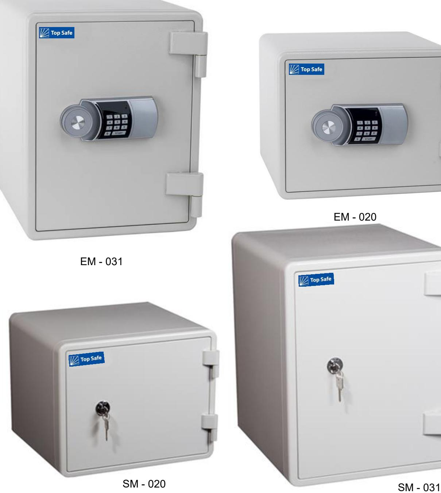

## **DOKUMENTSKÅP (EM & SM 60P)**

**Info:** När du vill skydda och förvara värdefulla handlingar, dokumentation och andra viktiga papper är det bra att kunna låsa in dem i ett av våra brandsäkra samt stöldskyddande dokumentskåp. Brandklassning 60P.

Ett stilrent skåp som gör sig utmärkt i hemmet eller på kontoret. De här skåpen kan fås med nyckel eller elkodlås, och de är förberedda för fastbultning.

**Förvara:** Bokföringsunderlag, Avtal, Foton, Arvegods, Kontrakt, Dokument, Pass m.m.

topsafe.se 17

## **DOKUMENTSKÅP (EM & SM 60P)**

| Modell: Art nr:                     | SM/EM-020 31001/30005              | SM/EM-031 31010/30004              |
|-------------------------------------------|---------------------------------------|---------------------------------------|
| Utv.mått Höjd Bredd Djup (mm) | H 345 B 424 D 388               | H 520 B 410 D 445               |
| Inv.mått Höjd Bredd Djup (mm) | H 245 B 325 D 260               | H 415 B 305 D 320               |
| Vikt (kg):                                | 35                                    | 56                                    |
| Lås:                                      | SM - Nyckellås EM - Elkodlås | SM - Nyckellås EM - Elkodlås |
| Inredning:                                | Plastlåda                             | 1 Hyllplan + Plastlåda             |
| Brandklassning:                           | NT Fire 017 P60 min                | NT Fire 017 P60 min             |