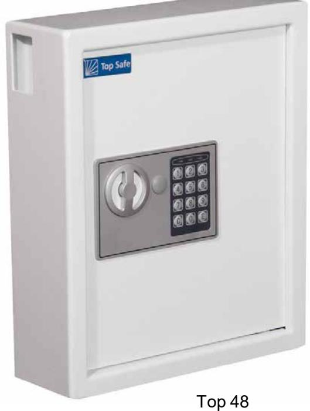
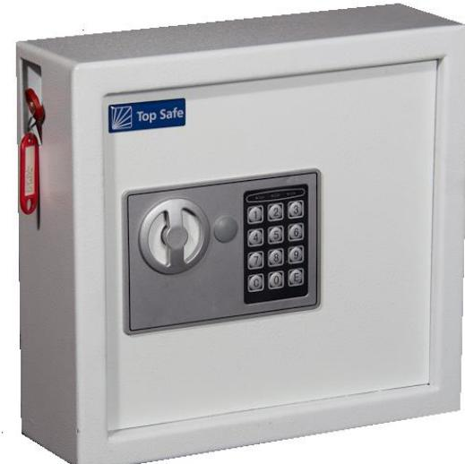
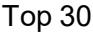
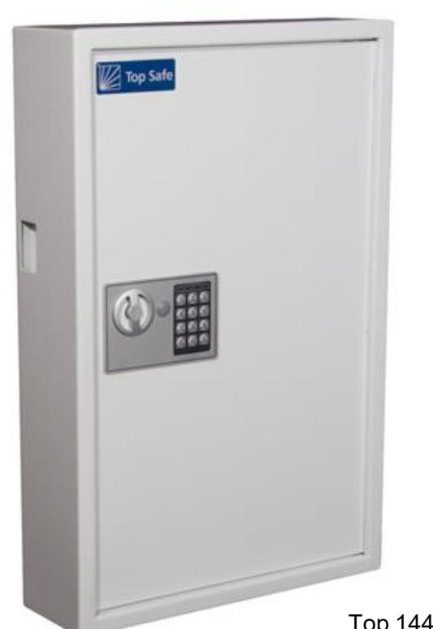
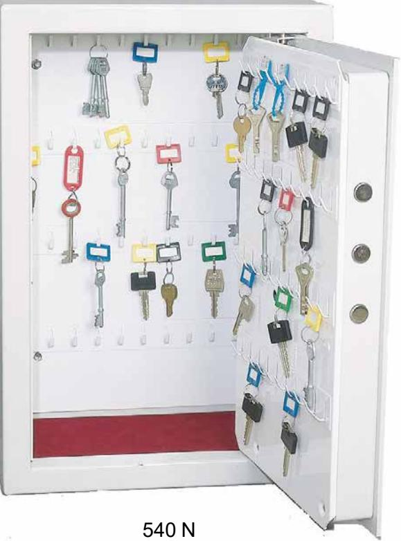
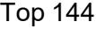

## **OKLASSADE NYCKELSKÅP**

**Info:** Våra enklare nyckelskåp är oklassade, men ger ett tidsfördröjande stöldskydd. Nycklarna blir svåråtkomliga för obehöriga och det finns gott om plats att förvara från 30 till 144st nycklar. Den här typen av skåp är populär hos företag, organisationer samt vård och omsorg.

## **Förvara:** Nycklar

topsafe.s

e

## **OKLASSADE NYCKELSKÅP**

| Modell: Art.nr:                        | Top 30 32098                        | Top 48 32099                       | Top 144 32100                        | SOS 540N SOS 540HN                                                                           |
|-------------------------------------------|-------------------------------------------|------------------------------------------|--------------------------------------------|----------------------------------------------------------------------------------------------------|
| Utv.mått Höjd Bredd Djup (mm) | H 280 B 300 D 100                   | H 365 B 300 D 100                  | H 660 B 430 D 130                    | H 540 B 360 D 190                                                                         |
| Vikt (kg):                                | 6                                         | 9                                        | 20                                         | 26                                                                                                 |
| Standard inrede:                       | 30 nyckelkrok Nyckeldep på sidan | 48nyckelkrok Nyckeldep på sidan | 144 nyckelkrok Nyckeldep på sidan | SOS540N 112st korta nyckelkrokar. SOS 540HN 2 st Hyllplan + 40st nyckelkrokar |
| Lås:                                      | Elkodlås med Nödöppnings nyckel  | Elkodlås med Nödöppnings nyckel | Elkodlås med Nödöppnings nyckel   | Elkodlås                                                                                           |