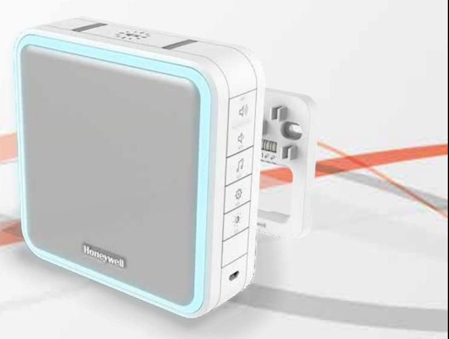

### **Series 9 DW915S**

#### Wired and wireless doorbell with range extender, sleep mode and halo light – White

Never miss a visitor again with a Honeywell DW915S wired and wireless doorbell, thanks to a market-leading 5 year battery life, 100m audible range and 200m wireless range. It comes with Sleep mode so you can relax free from disturbance, while the innovative Halo light will alert you when the doorbell can't be heard. Link two doorbells together for even greater wireless coverage and peace of mind.

# Pack Contents:

1 x Wireless/Wired Portable Doorbell,1 x Quick Start Guide, 1 x Safety & Guarantee,1 x Declaration of Conformity,

# Key Features and Benefits:

**Never miss a visitor or delivery** - Wire your existing push button to your wired doorbell, and you'll never miss a visitor again, thanks to a maximum volume of 90dB that can be heard up to 100m away. Thanks to Honeywell ActivLink™ technology, you can even link a second wireless portable doorbell to place anywhere in the home or garden.

**Disturbance Free** - With adjustable volume and innovative Sleep/Mute mode, which mutes the doorbell indefinitely, or for a prescribed period of 3, 6, 9 or 12 hours, your family can relax free from disturbances during movie nights or nap times.

**Visual Alerts** - The innovative Halo Light and LED Strobe provide discreet but effective visual alerts which complement your chosen melody in loud environments, or help to alert you when the doorbell can't be heard.

**Revolutionary design** - Compact and beautifully designed in a harmonising palette of white and grey, our doorbells are designed with your home in mind.

**Peace of mind** - For total peace of mind, let Honeywell ActivLink™ interconnect your doorbell with Honeywell security accessories and Home Alarm Kits to build your own bespoke home alert and alarm system.

**Reliability and Quality** - Honeywell ActivLink®, using the 868MHz frequency, is our innovative wireless protocol which delivers greater range capability, extended battery life of up to 5 years, and improved connection reliability, all supported by our 2 year product quality guarantee.

**Compact size with rich sound** - All Honeywell doorbells benefit from digitally enhanced, crystal clear sound that carries well throughout the home and garden, packing market-leading sound quality into some deceptively small packages!

#### **Easy To Install** -

All Honeywell doorbells come pre-linked and ready to install straight out of the box, with optional screw-free installation and an easy open battery compartment so you can be set up in minutes. All this is backed up by our 2 year product guarantee.

# Specification:

| Wireless/Wired Portable Doorbell          |                                                                                                   |
|-------------------------------------------|---------------------------------------------------------------------------------------------------|
| Colour                                    | White                                                                                             |
| Wall mounted                              | Optional                                                                                          |
| Frequency / Wireless Range*               | 868MHz / 200m                                                                                     |
| Range Extender                            | Yes                                                                                               |
| Push Fit Connectors                       | Yes                                                                                               |
| Audible Range (Volume)                    | 100m (90dB)                                                                                       |
| Melodies                                  | 8                                                                                                 |
| Sound                                     | Volume Control / Sleep Mode and Mute / Internal Siren                                             |
| Alarm Time (minutes)                      | 2 (Internal Siren Mode)                                                                           |
| Visual Alerts                             | 8 Colour Halo / LED Strobe                                                                        |
| Halo Colours                              | Red, Green, Blue, Cyan, Magenta, Yellow, White, Amber                                             |
| Power                                     | Battery: 4 x LR14 (C) 1.5V - (not included) / Optional external supply (transformer) 8V/12V AC |
| Battery Life (Years)                      | 5                                                                                                 |
| Battery Features                          | Low Battery Indicator / Easy Open Battery Compartment                                             |
| Mains Power via Micro USB                 | Optional external supply USB 5V 500mA                                                             |
| Maximum Device Capacity                   | 6 x Wireless Push Button/Wireless Motion Sensor/Wireless Door and Window Sensor                |
| Factory Reset                             | Yes                                                                                               |
| Operating Temperature/Storage Temperature | 0°C to +40°C/-20°C to +60°C                                                                       |
| Dimensions (mm) / Weight (g)              | 126 (h) x 126 (w) x 41.8 (d)                                                                      |
| Fixings                                   | Brackets / Rawl Plugs / Screws                                                                    |
|                                           |                                                                                                   |
| Pack                                      |                                                                                                   |
| EAN Code                                  | 5004100965721                                                                                     |
| Pack Dimensions (mm) / Weight (g)         | 216 (h) x 150 (w) x 55 (d)                                                                        |

* Measured in open field conditions, walls, ceilings and metal structures will reduce the maximum range.

livewell.honeywell.com | © 2015 Honeywell International Inc.

Standard Pack Quantity 4