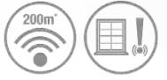

## **HS3MAG1S**

#### Wireless door and window sensor - White

Enjoy added peace of mind with the HS3MAG1S Wireless door and window sensor. Link the sensor with your existing Honeywell doorbell or home alarm kit, and get alerts whenever a door or window has been left open, or when someone enters or leaves your home.

*Both HS3MAG1S and HS3MAG1N are identical and interchangeable, the only difference are the other European languages on the packaging.,

## Pack Contents:

1 x Wireless Door and Window Sensor,1 x CR2032 (3V) Battery,1 x Quick Start Guide, 1 x Safety & Guarantee,1 x Declaration of Conformity,

## Key Features and Benefits:

**Door Entry Alerts** - For added peace of mind, get alerts whenever someone opens a door or window. The wireless door and window sensor, enabled by Honeywell ActivLink™, connects with your Honeywell doorbell or home alarm system to trigger an alert sound.

**Easy To Install** - All Honeywell push buttons and accessories are easy to install, with optional screw-free installation and an easy open battery compartment so you can be set up in minutes. All this is backed up by our 2 year product guarantee.

# Specification:

| Wireless Door and Window Sensor           |                                                       |
|-------------------------------------------|-------------------------------------------------------|
| Colour                                    | White                                                 |
| Wall mounted                              | Yes                                                   |
| Screwless mounting option (Sticky pads)   | Yes                                                   |
| Frequency / Wireless Range*               | 868MHz / 200m                                         |
| Power                                     | Battery: 1 x CR2032 (3V) - (included)                 |
| Battery Life (Years)                      | 2                                                     |
| Battery Features                          | Low Battery Indicator / Easy Open Battery Compartment |
| Test Mode                                 | Yes                                                   |
| Tamper Protection                         | Yes                                                   |
| Operating Temperature/Storage Temperature | 0°C to +40°C/-20°C to +60°C                           |
| Dimensions (mm) / Weight (g)              | 71 (h) x 40 (w) x 14 (d) / 28 (g)                     |
| Fixings                                   | Screws / Sticky Pads                                  |
|                                           |                                                       |
| Pack                                      |                                                       |
| EAN Code / Standard Pack EAN Code         | 5004100966049 / 5004100966209                         |
| Pack Dimensions (mm) / Weight (g)         | 137 (h) x 146 (w) x 30 (d) / 84 (g)                   |
| Standard Pack Quantity                    | 6                                                     |

* Measured in open field conditions, walls, ceilings and metal structures will reduce the maximum range.