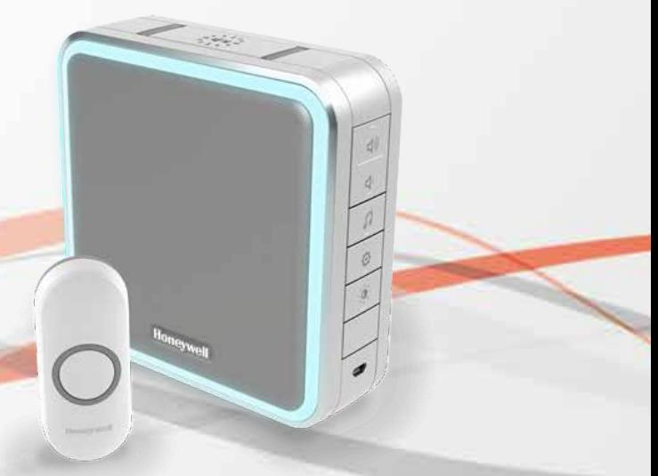
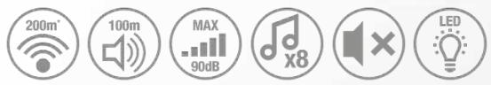

#### **9-serien DC915NG**

Trådlös portabel dörrklocka med räckviddsförlängare, viloläge och tryckknapp - Grå

Missa aldrig en besökare igen med dörrklockan Honeywell DC915NG, tack vare marknadsledande 5-årig livslängd på batteriet, 100 m räckvidd för ljudet och 200 m trådlös räckvidd. Den är utrustad med viloläge så att du kan koppla av utan att bli störd och den innovativa ljusslingan talar om för dig när någon står utanför dörren när dörrklockan inte hörs. Koppla ihop två dörrklockor för ännu längre trådlös täckning och sinnesro.

### Förpackningens innehåll:

1 x Trådlös portabel dörrklocka,1 x Trådlös tryckknapp,1 x CR2032 (3V) Batteri,1 x Snabbstartguide, 1 x Säkerhet och garanti, 1 x Konformitetsdeklaration,

## Viktiga funktioner och fördelar:

**Missa aldrig en besökare eller en leverans** - Placera din portabla dörrklocka varsomhelst i huset och tack vare Honeywell ActivLink™-teknik får du en tillförlitlig trådlös räckvidd på upp till 200 m och en högsta ljudstyrka på 90 dB som kan höras på ett avstånd upp till 100 m. Koppla ihop två dörrklockor och förstärk räckvidden upp till 400 m.

**Störningsfri** - Med justerbar volym och viloläge/tyst läge, stängs dörrklockan av på obestämd tid eller under en inställd period på 3, 6, 9 eller 12 timmar så att familjen kan koppla av utan att bli störd under filmkvällar eller vid vila.

**Visuella varningar** - De innovativa funktionerna ljusslinga och LED-blixtljus är diskreta men effektiva visuella varningar som kompletterar den melodi du valt eller varnar dig när du inte kan höra dörrklockan.

**Revolutionär design** - Våra dörrklockor är designade med tanke på ditt hem och har därför en kompakt och vacker design i en harmonisk palett av vitt och grått.

**Sinnesro** - Sinnesro för besökare, tack vare en LED-lampa som bekräftelse på tryckknappen och sinnesro för dig tack vare den hemliga knackningsfunktionen, som spelar en annan melodi så att du vet om det är en familjemedlem eller vän som står vid dörren. För total sinnesro kan du med Honeywell ActivLink™ koppla ihop din dörrklocka med Honeywells säkerhetstillbehör och hemlarmskit för att skapa ett skräddarsytt varningssystem för ditt hem.

**Tillförlitlighet och kvalitet** - Honeywell ActivLink™, som använder frekvensen 868MHz, är vårt innovativa trådlösa protokoll som har större räckviddskapacitet, utökad batteritid upp till 5 år och förbättrad tillförlitlighet för anslutning och allt detta backas upp av vår 2 åriga produktgaranti.

**Liten storlek med stort ljud** - Alla dörrklockor från Honeywell har en stor fördel i sitt digitalt förstärkta, kristallklara ljud som sprider sig genom huset och trädgården med marknadsledande ljudkvalitet förpackad i vilseledande små förpackningar!

**Enkla att installera** - Alla Honeywells dörrklockor levereras förkopplade och klara att montera direkt ur förpackningen, med möjligt skruvfritt montage och ett lättöppnat batterifack så att du är klar på några minuter. Allt detta backas upp av en 2-årig produktgaranti.

# Specifikation:

| Trådlös portabel dörrklocka                |                                                                                 |
|--------------------------------------------|---------------------------------------------------------------------------------|
| Färg                                       | Grå                                                                             |
| Väggmonterad                               | Tillval                                                                         |
| Frekvens / Trådlös räckvidd*               | 868MHz / 200m                                                                   |
| Räckviddsförlängare                        | Ja                                                                              |
| Ljudets räckvidd (volym)                   | 100m (90dB)                                                                     |
| Melodier                                   | 8                                                                               |
| Ljud                                       | Volymkontroll / Viloläge och tyst läge / Intern siren                           |
| Larmtid (minuter)                          | 2 (Internt sirenläge )                                                          |
| Visuella varningar                         | LED-indikator / Ljusslinga med 8 färger / LED-blixtljus                         |
| Färger på ljusslingan                      | Röd, grön, blå, cyan, magenta, gul, vit, amber                                  |
| Ström                                      | Batteri: 4 x LR14 (C) 1,5V - (ej inkluderad)                                    |
| Batteritid (år)                            | 5                                                                               |
| Batterifunktioner                          | Indikator för lågt batteri / Lättöppnat batterifack                             |
| Alternativ med nätanslutning via Micro USB | Tillval av extern försörjning med USB 5 V 500 mA                                |
| Enhetens maximala kapacitet                | 6 x Trådlös tryckknapp/Trådlös rörelsesensor/Trådlös dörr- och fönstersensor |
| Fabriksåterställning                       | Ja                                                                              |
| Driftstemperatur/förvaringstemperatur      | 0°C till +40°C/-20°C till +60°C                                                 |
| Mått (mm) / Vikt (g)                       | 126 (h) x 126 (b) x 41.8 (d) / 264 (g)                                          |
| Fästanordningar                            | Stöd / Väggpluggar / Skruvar                                                    |

#### **Trådlös tryckknapp**

| Färg                                         | Vit                                                 |
|----------------------------------------------|-----------------------------------------------------|
| Väggmonterad                                 | Tillval                                             |
| Monteringsalternativ utan skruvar (fästtejp) | Ja                                                  |
| Frekvens / Trådlös räckvidd*                 | 868MHz / 200m                                       |
| Visuella varningar                           | LED-blixtljus                                       |
| Ström                                        | Batteri: 1 x CR2032 (3V) - (inkluderad)             |
| Batteritid (år)                              | 2                                                   |
| Batterifunktioner                            | Indikator för lågt batteri / Lättöppnat batterifack |
| Tryckknappens design                         | Stående                                             |
| Namnskylt med pushfunktion                   | Nej                                                 |
| IP-klassning                                 | IP55                                                |
| Driftstemperatur/förvaringstemperatur        | 0°C till +40°C/-20°C till +60°C                     |
| Mått (mm) / Vikt (g)                         | 30 (h) x 70 (b) x 16 (d) / 23.5 (g)                 |
| Fästanordningar                              | Stöd / Väggpluggar / Skruvar / Fästtejp             |
|                                              |                                                     |

#### **Förpackning**

| EAN-kod                             | 5004100965622                        |
|-------------------------------------|--------------------------------------|
| Förpackningens mått (mm) / Vikt (g) | 216 (h) x 150 (b) x 70 (d) / 525 (g) |
| Standardförpackningens kvantitet    | 4                                    |

* Mätt i en öppen omgivning. Väggar, tak och metallkonstruktioner minskar den maximala räckvidden.