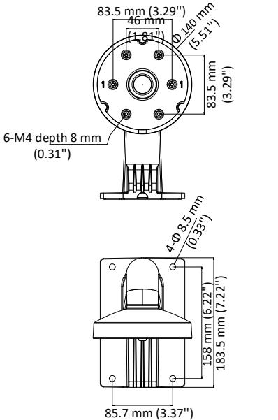
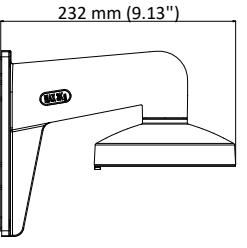
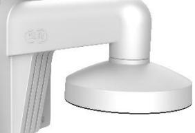

# **DS-1273ZJ-140**

#### Wall Mount

#### **Features:**

- Aluminum alloy material with surface spray treatment
- The outlet hole makes the feature looks better
- Better water proof design
- Convenient installation coordinating with lower bowl

### **Dimension:**

# **Order Model:**

DS-1273ZJ-140

## **Parameter:**

| Model      | DS-1273ZJ-140        |
|------------|----------------------|
|            | Wall Mount           |
| Parameters |                      |
| Appearance | Hikvision White      |
| Material   | Aluminum Alloy       |
| Dimension  | Φ 140 × 182 × 120 mm |
| Weight     | 777 g (1.71 lb.)     |
|            |                      |

### **Notice:**

- Pay attention to the color matching when select bracket
- The bracket should be installed on flat wall
- The wall should be capable of supporting over 3 times as much as the total weight of the camera and the mount
- The maximum load capacity of the bracket is 3 kg