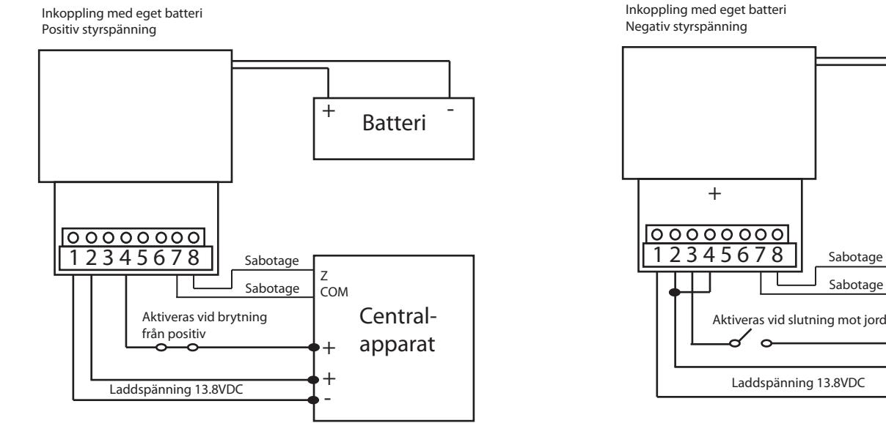
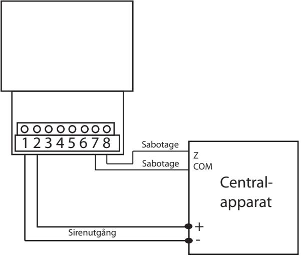
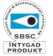

## Inkopplingsanvisning för siren TL-10

Siren i vit slagtålig metallkapsling. Aktiveras med direktdrivning eller utrustas med ett batteri för aktivering av siren även vid händelse av sabotage på matningsspänning. Vid batteridrift har TL-10 en timer som tystar sirenen efter tre minuter.

Spänning: 9-14.5VDC (direktdrivning) / 13.8 -14.5VDC (för batteriladdning) Ström: Max 950mA Ström underhållsladdning: 1mA Ljudstyrka: 126dB Färg: Vit Temperaturområde: -25° - +70° Mått: 135x220x85mm Vikt: 1 730g Batteri: Blyackumulator 1,2Ah 12VDC (ingår ej) Sabotagekontakt: Mikrobrytare, normalt sluten

Inkoppling med direktdrivning utan batteri

| OFF          | On                                        |
|--------------|-------------------------------------------|
| Sirentid 3m  | Sirentid 8m                               |
| Följer dip 1 | Följer styringång                         |
|              |                                           |
| Hög volym    | Låg volym                                 |
| Ljudtyp 1    | Ljudtyp 2                                 |
|              | Aktiveras med styrspänning Direktdrivning |

Batteri + -

Centralapparat

Z COM

-

+

-

