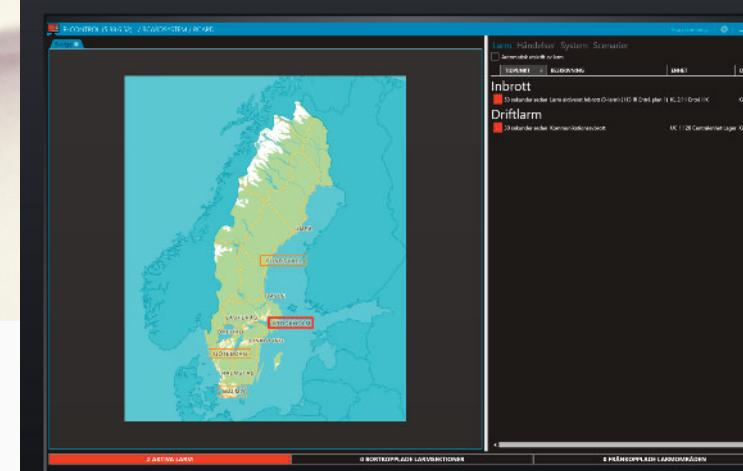
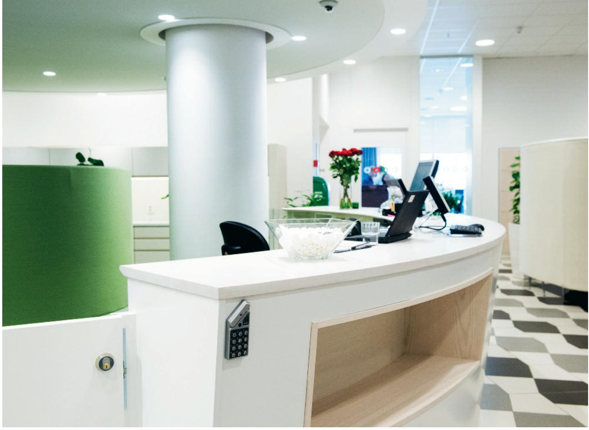
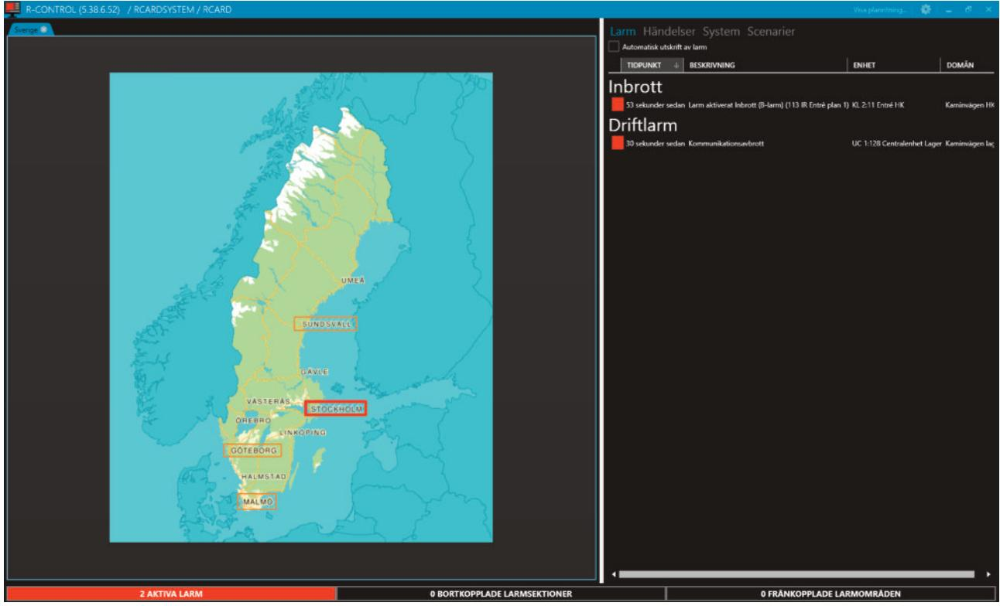
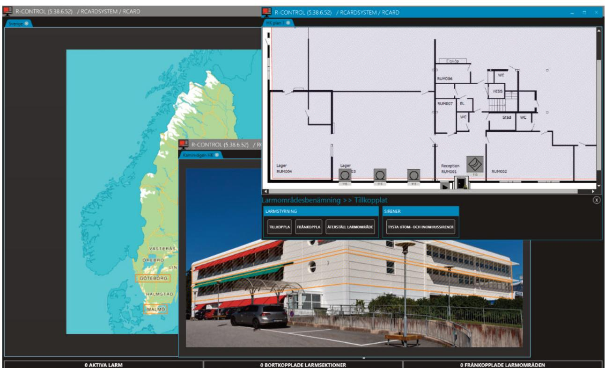
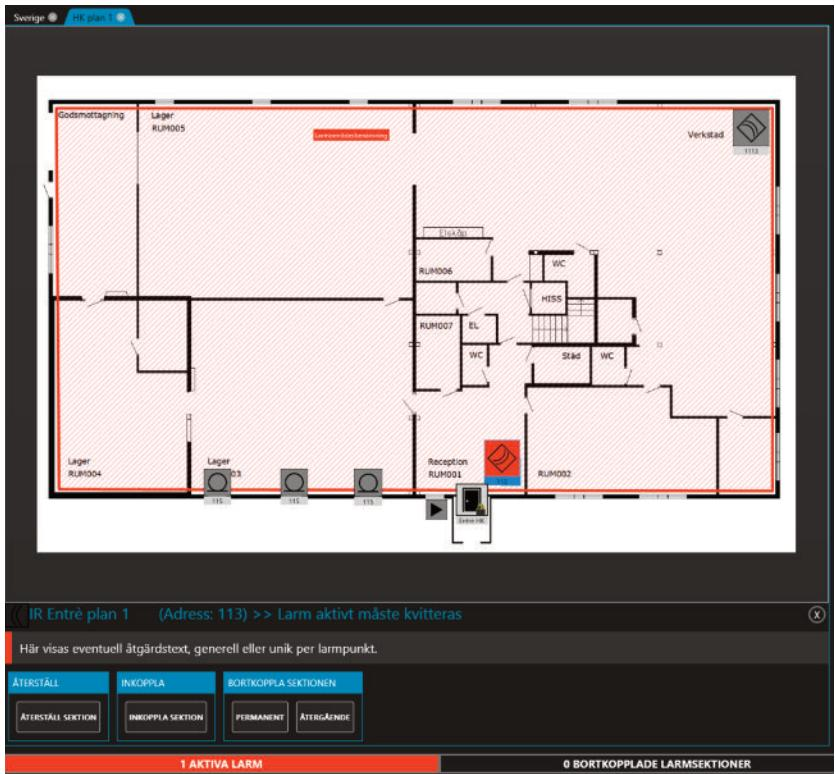
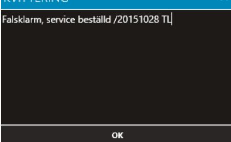
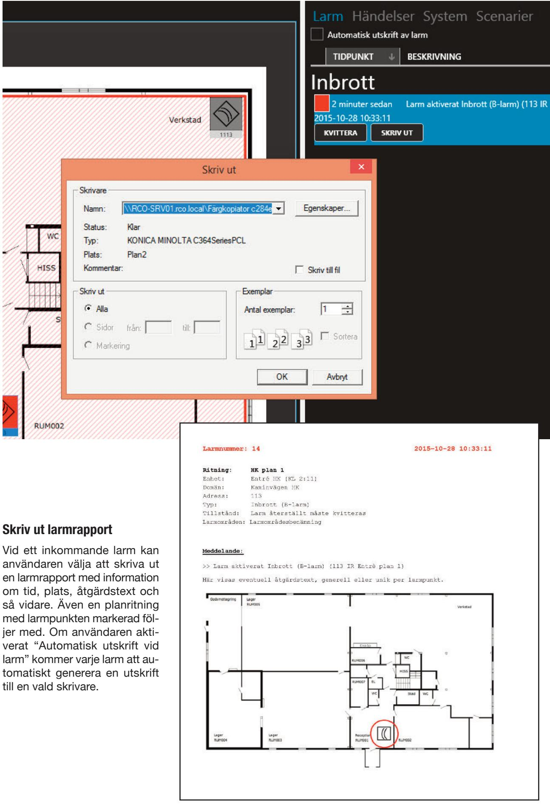
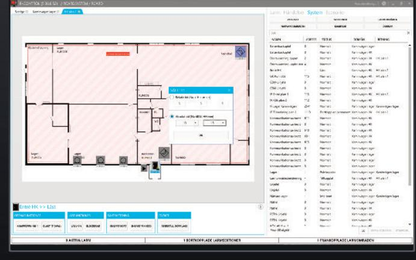

# **Total överblick för alla behov R-CONTROL**

**ELEKTRONISKA LÅS FÖR HEM OCH FÖRETAG**

# **Koll på läget i realtid med R-CONTROL**

**RCO Securitys mjukvara R-CONTROL erbjuder avancerad systemstyrning och oöverträffad anläggningskontroll – allt presenterat på ett enkelt, modernt och intuitivt sätt. R-CONTROL tillgodoser både små och stora behov där användaren ställer höga krav på smidig och säker grafisk presentation samt larm- och dörrstyrning.**

Med R-CONTROL  kan man i en och samma mjukvara styra och övervaka flera olika larmsystem oavsett var de finns rent geografiskt. Med R-CONTROL får användaren stora möjligheter att hantera och se status på utvalda objekt som exempelvis dörrar, larmpunkter och larmområden. Allt presenteras i en grafisk vy som är både lätthanterlig och intuitiv samtidigt som många avancerade funktioner finns att tillgå.

Användaren kan själv anpassa mjukvaran på flera sätt, bland annat genom att lägga in egna bilder, ritningar och ikoner samt skapa händelsescenarier, åtgärdstexter, kvitteringstexter och mycket mer. Möjligheterna är många – allt serverat i en enkel och modern förpackning i form av R-CONTROL.

#### **Full kontroll på alla objekt**

Många anläggningar spridda över hela orten eller landet? Inga problem med R-CONTROL eftersom man både kan se status på och styra samtliga från ett och samma system – ner till minsta larmpunkt eller dörr.

#### **Smidig integration i R-CARD 5000 och MEGA**

Programmeringen av R-CONTROL sker snabbt och enkelt med drag-and-drop-funktionalitet. Anläggningar som sedan tidigare använder INDIGRAF kan snabbt importeras eftersom planritningar och utplacerade ikoner följer med. Har man R-CARD M5 NAPmodulen kan R-CONTROL  även dra full nytta av den.

#### **Modernt och enkelarbetat gränssnitt**

Med R-CONTROL  sätts användaren i fokus. Anpassningsmöjligheterna är många och flexibiliteten hög.

**Få kontroll på alla anläggningar – oavsett hur många de är eller var de finns geografiskt**

Grundvyn i R-CONTROL  består av en grafisk yta som man själv bygger upp med ritningar och bilder efter eget behov. Till höger finns en informationsyta med flikarna Larm, Händelser, System och Scenarier. Aktiveras ett larm öppnas automatiskt rätt planritning med aktuell larmpunkt markerad. I  skärmens nederkant finns en statusrad som alltid visar systemets aktiva larm, bortkopplade sektioner och frånkopplade larmområden.

**Ha flera fönster och flikar öppna samtidigt för större överblick – även på olika skärmar**

Klickar användaren exempelvis på en anläggning i Stockholm får man upp en bild på objektet. Sedan kan man klicka på respektive våningsplan i bilden för att se aktuell planritning med samtliga larmpunkter och dörrar och dess status i realtid. På detta sätt går det extremt snabbt och enkelt att hitta rätt i systemet.

| Larm Händelser System Scenarier Automatisk utskrift av larm |                                                                                      |       |       |
|----------------------------------------------------------------|--------------------------------------------------------------------------------------|-------|-------|
| TIDPUNKT                                                       | BESKRIVNING                                                                          | ENHET | DOMÄN |
| Inbrott                                                        |                                                                                      |       |       |
| 3 minuter sedan 2015-11-02 16:25:45 KVITTERA SKRIV UT | Larm aktiverat Inbrott (B-larm) (113 IR Entrè plan 1) KL 2:11 Entré HK Kaminvägen HK |       |       |
|                                                                |                                                                                      |       |       |

#### **Se tydligt var och när larmet gått för snabbast möjligast åtgärd**

När ett larm aktiveras syns det direkt i larmlistan vilken tidpunkt larmet gått, vilken typ av larm det rör sig om samt exakt var larmpunkten finns i form av exempelvis adress, våningsplan, rum och så vidare. Från larmlistan har användaren möjlighet att kvittera larmet eller skriva ut en larmrapport. Larmen kan i larmlistan visas i hela fem olika prioritetsordningar. Personlarm kan exempelvis prioriteras högre än inbrottslarm, som i sin tur prioriteras högre än driftslarm. Det senast inkomna larmet visas alltid överst i respektive prioritetsgrupp.

#### **Få snabbt upp rätt planritning**

När operatören klickar på ett aktivt larm i larmlistan öppnas automatiskt rätt planritning med larmpunkten markerad (blinkar rött vid aktivt larm och lyser rött med fast sken när den återgått). Även ett fönster med tillgängliga åtgärdsval samt eventuell åtgärdstext kommer upp. Vilka åtgärder som ska vara tillgängliga programmeras unikt för varje larmpunkt och kan därför variera.

#### **Skriv in en egen kvitteringstext**

Vid kvittering av ett larm skriver användaren in en kvitteringstext, exempelvis vilken åtgärd som togs vid larmet. Flera larm kan dessutom markeras i listan och kvitteras samtidigt. Alla dessa texter sparas i en händelselogg och är sökbara i fritext i M5:s rapportverktyg.

| Alla händale |
|--------------|

| Händelsefonster: | Alla handelser                                                                                                             |                                                |                |
|------------------|----------------------------------------------------------------------------------------------------------------------------|------------------------------------------------|----------------|
| Sök              |                                                                                                                            |                                                |                |
| TIDPUNKT         | TYP AV HÄNDELSE                                                                                                            | ENHET                                          | DOMAN          |
|                  | 2015-10-26 13:43:54 Larmområdeskontroll (RCARD, Kaminvägen HK plan 1, Tillkoppla larmområde)                               | Centralenhet HK (UC 2:1)                       | Kaminvägen HK  |
|                  | 2015-10-26 13:43:54 Larmområdeskontroll (RCARD, Lager, Tillkoppla larmområde)                                              | Centralenhet Lager (UC 1:128) Kaminvägen lager |                |
|                  | 2015-10-26 13:33:33 Larmområdeskontroll (RCARD, Kaminvägen HK plan 1, Aterställ larmområde)                                | Centralenhet HK (UC 2:1)                       | Kaminvägen HK  |
|                  | 2015-10-26 13:33:25 Kommunikation upprättad/aterställd                                                                     | Centralenhet Lager (UC 1:128) Kaminvägen lager |                |
|                  | 2015-10-26 13:33:16 Larn kvitterat av: RCARD (2015-10-26 13:18:44 Larm aktiverat Inbrott (B-larm) (113 IR Entrè plan 1)) - |                                                |                |
|                  | 2015-10-26 13:33:16 Larmkaraktär Inbrott (B-larm) kvitterat 113 IR Entrè plan 1                                            | Centralenhet HK (UC 2:1)                       | Kaminvägen HK  |
|                  | 2015-10-26 13:33:07 Larm återställt Inbrott (B-larm) (113 IR Entrè plan 1)                                                 | Centralenhet HK (UC 2:1)                       | Karninvägen HK |
|                  | 2015-10-26 13:18:44 Larm aktiverat Inbrott (B-larm) (113 IR Entrè plan 1)                                                  | Centralenhet HK (UC 2:1)                       | Kaminvägen HK  |
|                  | 2015-10-26 13:18:27 Operator har loggat in: RCARD, Program: R-CARD M5 Arbetsstation                                        |                                                |                |
|                  | 2015-10-26 13:17:20 Operatör har loggat ut: RCARD                                                                          |                                                |                |
|                  | 2015-10-26 13:16:40 Larmområdeskontroll (RCARD, Kaminvägen HK plan 1, Aterställ larmområde)                                | Centralenhet HK (UC 2:1)                       | Kaminvägen HK  |
|                  | 2015-10-26 13:16:35 Larm kvitterat av: RCARD (2015-10-26 13:16:00 Kommunikationsavbrott)                                   |                                                |                |
|                  | 2015-10-26 13:16:31 Lam kvitterat av: RCARD (2015-10-26 13:15:23 Larn aktiverat Inbrott (8-larm) (113 IR Entrè plan 1)) -  |                                                |                |
|                  | 2015-10-26 13:16:31 Larmkaraktär Inbrott (B-larm) kvitterat 113 IR Entrè plan 1                                            | Centralenhet HK (UC 2:1)                       | Kaminvägen HK  |
|                  | 2015-10-26 13:16:22 Larm återställt Inbrott (B-larm) (113 IR Entrè plan 1)                                                 | Centralenhet HK (UC 2:1)                       | Kaminvägen HK  |
|                  | 2015-10-26 13:16:00 Kommunikationsavbrott                                                                                  | Centralenhet Lager (UC 1:128) Kaminvägen lager |                |
|                  | 2015-10-26 13:15:23 Larm aktiverat Inbrott (B-larm) (113 IR Entrè plan 1)                                                  | Centralenhet HK (UC 2:1)                       | Kaminvägen HK  |
|                  |                                                                                                                            |                                                |                |

#### **En detaljerad händeselogg ger användaren full kontroll över historiken**

I händelsevyn visas systemets samtliga larm- och passerhändelser. Tidpunkt, typ av händelse samt vilken enhet och domän händelsen tillhör visas i en realtidslista. Denna lista är sökbar i fritext för att operatören enkelt och snabbt ska kunna hitta en aktuell händelse. Även egenkonfigurerade händelsefönster i M5 går att visa i denna vy.

#### **Se alla ingående enheter**

Samtliga larmpunkter som finns i systemet och som är utlagda på ritningarna visas här. Man kan se dess status, vilken ritning den tillhör och så vidare. Alla rubriker kan sorteras efter begynnelsebokstav eller siffra i både stigande och fallande ordning. Rubrikernas inbördes ordning kan också ändras genom att enkelt dras till önskad position. Även i systemlistan erbjuds fritextsökning.

| VISA ALLT NARVAROOMRÅDEN |        | SEKTIONER KAMEROR                                     |                  | LARMOMRÅDEN DORRAR              |  |
|-----------------------------|--------|----------------------------------------------------------|------------------|------------------------------------|--|
|                             |        |                                                          |                  |                                    |  |
| NAMN                        | ADRESS | STATUS                                                   | DOMÄN            | RITNING                            |  |
| IR Lager Kaminvägen         | 2541   | Normalt                                                  |                  | Kaminvägen lager Kaminvägen lager  |  |
| Dörravkänning öppen         | 2      | Normalt                                                  | Kaminvägen HK    | HK plan 1                          |  |
| GK Rum 003                  | 115    | Normalt                                                  | Kaminvägen HK    | HK plan 1                          |  |
| IR Tillverkning plan 1      | 1113   | Normalt                                                  | Kaminvägen HK    | HK plan 1                          |  |
| IR Entrè plan 1             | 113    | Normalt                                                  | Kaminvägen HK    | HK plan 1                          |  |
| RÖK Lager Kaminvägen        | 2542   | Normalt                                                  |                  | Kaminvägen lager Kaminvägen lager  |  |
| Lager                       |        | Tillkopplat                                              |                  | Kaminvägen lager Kaminvägen lager  |  |
| Kaminvägen HK plan 1        |        | Tillkopplat                                              | Kaminvägen HK    | HK plan 1                          |  |
| Närvaro lager               |        | Tomt                                                     |                  | Kaminvägen lager  Kaminvägen lager |  |
| Entre Kaminvägen lager -    |        | Sabotage tamper (Låst) Kaminvägen lager Kaminvägen lager |                  |                                    |  |
| Entré HK                    |        | Låst                                                     | Kaminvägen HK    | HK plan 1                          |  |
| Kommunikationsavbrott 0     |        | Normalt                                                  | Kaminvägen lager |                                    |  |
| Sabotage tamper             | 0      | Normalt                                                  | Kaminvägen lager |                                    |  |
| Visar 38 objekt             |        |                                                          | 50               |                                    |  |

| NAMN                                  | SNABBTANGENT |
|---------------------------------------|--------------|
| Tillkoppla samtliga områden Malmö F12 |              |
| Låsöppna sektion C2                   | Manuellt     |
| Blockera sektion A03                  | F6           |

#### **Skapa händelsescenarier**

Med ett scenario kan man exempelvis med en enda knapptryckning öppna utvalda dörrar på en specifik våning. Vad som ska hända är helt upp till användaren som själv bygger scenariot.

| VALJ TID Relativ tid (Nu + H + m + s) 0 0 Absolut tid (Nu till kl. HH:mm) 00 00 4 OK | X 3 5 115     | Reception RUM001 115 TT Entré 14K | RUM002 113      |
|--------------------------------------------------------------------------------------------------------------|------------------------|-----------------------------------------------|--------------------|
| Entré HK >> Olåst                                                                                            |                        |                                               |                    |
| ÖPPNAFUNKTIONER                                                                                              | LÅSFUNKTIONER          | SĀKERHETSNIVĀ                                 | ÖVRIGT             |
| KNAPPÖPPNING 1 OLAST (TIDVAL)                                                                             | LAS (*O*) BLOCKERAD | ENBART KORT ENBART PIN-KOD                 | ATERSTALL DÖRRLAGE |
|                                                                                                              | 0 AKTIVA LARM          |                                               | 0 BORT             |

### **Tydliga ikoner ger smidig och lättarbetad dörrstyrning i realtid**

Via systemlistan eller den grafiska vyn kan användaren snabbt hitta en enskild dörrmiljö. När dörren markeras visas i nederkant ett antal åtgärdsval för att styra dörren. Här kan man bland annat ändra säkerhetsnivå, ställa en dörr olåst till ett visst klockslag eller antal timmar framåt och så vidare. Färgen på dörrikonen växlar i realtid beroende på dörrens läge. Ikonen för dörren väljs i ett ikonbibliotek och användaren kan själv lägga in egna ikoner för exempelvis en grind eller en bom. Ett hänglås på ikonen visar om dörren är låst eller olåst.

| VISA KORT     | JUSTERA ANTAL NÄRVARANDE    | NOLLSTÄLL ANTAL NÄRVARANDE                |           | PAUSA RÄKNARE  |                     | STOPPA ANTIPASSBACK |   |  |
|---------------|-----------------------------|-------------------------------------------|-----------|----------------|---------------------|---------------------|---|--|
| FUNKTIONER    |                             |                                           |           |                |                     |                     |   |  |
| Antal kort: 3 |                             | Antal passager sen 2015-11-06 16:16:27: 3 |           |                |                     | Räknare: Startad    |   |  |
|               | Närvaro lager  >> Inte tomt |                                           |           | NOLLSTALL KORT |                     |                     |   |  |
|               |                             |                                           |           |                |                     |                     |   |  |
|               | RUM004                      | Sara                                      | Larssson  | Svart          | 2015-11-02 16:46:52 |                     |   |  |
|               | Lager                       | Gullan                                    | Gulkvist  | Gul            | 2015-11-06 16:14:16 |                     |   |  |
|               |                             | Roland                                    | Rödström  | Röd            | 2015-11-06 16:14:21 |                     |   |  |
|               |                             | FÖRNAMN                                   | EFTERNAMN | KORT           | TID                 | >                   | × |  |
|               | Närvaro lager               |                                           |           |                |                     | 2542                |   |  |

#### **Se vilka som befinner sig var i en anläggning med närvaroområden**

Om närvaromodulen R-CARD  M5 NAP används i systemet kan man även få upp denna information direkt i R-CONTROL. Användaren kan enkelt se vilka personer som befinner sig i ett specifikt område och göra egna inställningar för närvarokontrollens egenskaper.

### **TEKNISK DATA R-CONTROL**

## **PROGRAMVARA**

#### **Kapacitet:** Upp till 150 000 objekt (larmpunkter,

|                                     | områden, dörrar) per databas. Exempelvis 500 ritningar med 300 objekt per ritning                                                                                                                                                                                                     |
|-------------------------------------|---------------------------------------------------------------------------------------------------------------------------------------------------------------------------------------------------------------------------------------------------------------------------------------------|
| Licenskrav:                         | R-CONTROL, R-CARD M5 Klient (per samtidigt inloggad användare)                                                                                                                                                                                                                           |
| Systemkrav:                         | Samma som för R-CARD  M5 (minst version 5.38.6)                                                                                                                                                                                                                                          |
| Systemstöd:                         | Stödjer presentation av objekt från R-CARD  M5 och MEGA                                                                                                                                                                                                                                  |
| Bildformat:                         | JPG, JPEG, PNG och BMP                                                                                                                                                                                                                                                                      |
| Valbara kontroller: Larmområden: | Tillkoppla, frånkoppla, återställa området, återställa larmpunkter, aktivera normalt driftläge, aktivera gångtest, aktivera serviceläge, tysta alla sirener, tysta inom- och utom hussirener, tysta brandvarnings siren, aktivera entrésignal, deakti vera entrésignal |
| Larmpunkter:                        | Återställa efter larm, bortkoppla permanent, bortkoppla återgående, bortkoppla till tillkoppling, bort koppla till nästa tillkoppling, inkoppla                                                                                                                                 |
| Dörrar:                             | Låsa upp (knappöppning 1 och 2), låsa upp (tidval), låsa upp (trots till kopplat larm), låsa, återställa, för ändra säkerhetsnivå (endast kort, endast kod, kort och kod, blockerad)                                                                                         |
| Närvarokontroll:                    | Visa inpasserade kort, justera antal, nollställ antal, nollställ kort, stoppa                                                                                                                                                                                                            |

antipassback, pausa räknare

#### **FUNKTIONER**

| • Överblick på alla larmanläggningar i R-CARD M5 MEGA |
|-------------------------------------------------------|
| • Till- och frånkoppla larmområden                    |
| • Se status på larmpunkter i realtid                  |
|                                                       |

- Kvittera larm med åtgärdstext
- Skriv ut larmrapporter manuellt eller automatiskt
- Lås och lås upp dörrar
- Lägg in egna ritningar och ikoner
- Se personer i närvaroområden
- Skapa egna sceanerier med gruppvis aktivering
- Välj mellan mörkt eller ljust färgschema
- Aktivera ljus- och ljudvarning vid inkommande larm
- Välj standardritning i grundvyn
- Realtidsbilder från integrerade kamerasystem

