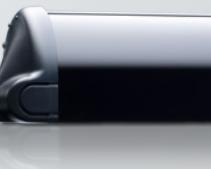
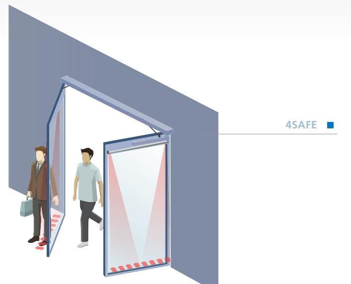
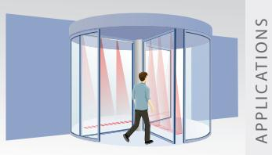
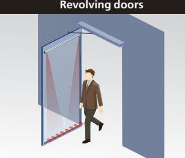
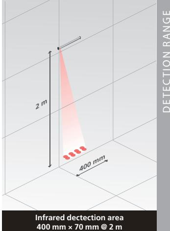
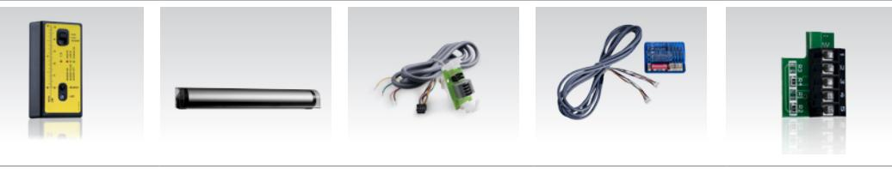
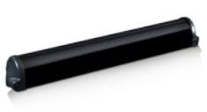

# 4SAFE

## SAFETY SENSOR FOR SWINGING AND REVOLVING DOORS

Commercial sheet

## QUIET AND STRONG

### DESCRIPTION

The **4SAFE** is a failsafe active infrared sensor which functions by distance measuring.

Onboard of swing and revolving door leaves, it brings safety to the users by avoiding contacts with the doors in motion.

The three-dimensional area of the 4SAFE makes it particularly suitable for protecting people with disabilities.

#### **FEATURES**

- High user safety thanks to a detection area of 40 cm in front of the leaf at 2 m high with 4 groups of 2 active infrared spots.
- Easy mounting with daisy-chain up to 6 modules, to cover the whole door width.
- Easy wiring for swing doors thanks to the special design of the 4SAFE : every module has two selectable outputs for safety at opening or closing, with just one cable.
- Adaptation to all floor types, even the most contrasted one (stainless steel plate, grids, water puddles, snow-covered ground...).
- Easier logistics: each module recognises its status automatically and selects it in the daisy-chain.

**Swing doors**

#### **APPLICATIONS**

- Safety of swing and revolving doors.
#### **EASE OF INSTALLATION**

- Pressing the push button once is enough to adjust the sensor for the usual installation heights.
- Fine tuning with 4 DIP-switches.

#### **ACCESSORIES**

Spotfinder Rain Accessory Fire Door Adapter Multisensor hub Retrofit interface

### **TECHNICAL SPECIFICATIONS**

| Technology Detection mode Number of beams Reflectivity Detection field Max. number of modules | Active Infrared with background suppression Presence and movement 4 Min 5% at IR-wavelenght of 850 nm 400 mm (W) × 70 mm (D) @ 2 m mounting height; 4 spots active 4 (up to 6 if 24 V DC) 12V - 24V AC ± 10 %; 12V - 30V DC -5%/+10%                                                                              |
|--------------------------------------------------------------------------------------------------------------|----------------------------------------------------------------------------------------------------------------------------------------------------------------------------------------------------------------------------------------------------------------------------------------------------------------------------------------|
|                                                                                                              |                                                                                                                                                                                                                                                                                                                                        |
|                                                                                                              |                                                                                                                                                                                                                                                                                                                                        |
|                                                                                                              |                                                                                                                                                                                                                                                                                                                                        |
|                                                                                                              |                                                                                                                                                                                                                                                                                                                                        |
|                                                                                                              |                                                                                                                                                                                                                                                                                                                                        |
|                                                                                                              |                                                                                                                                                                                                                                                                                                                                        |
| Supply voltage                                                                                               | (to be operated from SELV compatible power supplies only)                                                                                                                                                                                                                                                                              |
| Max current consumption                                                                                      | 95 mA @ 24 V AC/ 70 mA @ 24 V DC; 170 mA @ 12 V AC/ 130 mA @ 12 V DC (MASTER) 85 mA @ 24 V AC/60 mA @ 24 V DC; 180 mA @ 12 V AC/ 113 mA @ 12 V DC (other modules)                                                                                                                                                                   |
| Reaction time                                                                                                | 64 ms (typical)                                                                                                                                                                                                                                                                                                                        |
| Max. presence detection time                                                                                 | Infinite (SWING-configuration) /1 minute (REVOLVING-configuration)                                                                                                                                                                                                                                                                     |
| Output Max. contact voltage Max. contact current Max. switching power                               | 2 relays (free of potential contact) 42 V AC/DC 1A (resistive ) 30 W (DC) / 60 VA (AC)                                                                                                                                                                                                                                        |
| Input Max. contact voltage Voltage threshold                                                           | 1 optocoupler (free of potential contact) 30 V High : >10 V DC; Low : <1 V DC                                                                                                                                                                                                                                                    |
| Mounting height                                                                                              | 1.1 m to 3 m (according to floor reflectivity)                                                                                                                                                                                                                                                                                         |
| Dimensions                                                                                                   | Sensor module : 300 mm Profile : L* × 43.5 mm (H) × 47.5 mm (D) *L : length of profile according to packaging (see options)                                                                                                                                                                                                      |
| Material                                                                                                     | ABS/Aluminium/PC (colour: black)                                                                                                                                                                                                                                                                                                       |
| Protection degree                                                                                            | IP53                                                                                                                                                                                                                                                                                                                                   |
| Temperature range                                                                                            | -25°C to +55°C                                                                                                                                                                                                                                                                                                                         |
| Humidity                                                                                                     | 0-95 % relative humidity, non condensing                                                                                                                                                                                                                                                                                               |
| Norm conformity                                                                                              | EMC 2004/108/EC; MD 2006/42/EC; DIN 18650-1:2012 ch. 5.7.4; BS 7036-2:1996*; EN 16005:2012 ch. 4.6.8; EN 12978:2003 + A1:2009; EN 61508:2010; IEC 61496-2:2006; BGR 232; EN ISO 13849-1:2008 Performance Level «c» CAT. 2 (under the condition that the door control system monitors the sensor at least once per door cycle) |

*Specifications are subject to change without prior notice.*

** max. mounting height for BS 7036-conformity (UK): 3.25 m*

**DISCLAIMER** This document as well as all other enclosed documents (quotation / specification / other) are provided «as is» without warranties of any kind, either expressed or implied, including but not limited to the implied warranties of merchantability, fitness for a particular purpose, or non-infringement. / Information is supplied upon the condition that the persons receiving it will make their own determination as to its suitability for their purposes prior to use. In no event will BEA be responsible for damages of any nature whatsoever resulting from the use of or reliance upon information from this document or the products to which the information refers. / BEA has the right without liability to change descriptions and specifications at any time. / Prices, shipping and availability are subject to change without prior notice.

**www.bea-pedestrian.be**

#### **4SAFE** SAFETY SENSOR FOR SWINGING AND REVOLVING DOORS

**BEA** s.a. / LIEGE Science Park / Allée des Noisetiers 5 / 4031 Angleur • BELGIUM T +32 4 361 65 65 / F +32 4 361 28 58 / E info@bea.be

