**Manual**

**SE: Bruksanvisning för IR-mottagare Gewa Andromeda REC2**

**GB: Instructions for Use IR-receiver Gewa Andromeda REC2**

**NO: Brukerveiledning for IR-mottaker Gewa Andromeda REC2**

**FR: Notice d'utilisation du infrarouge-récepteur Gewa Andromeda REC2**

**DE: Gebrauchsanweisung für IR/Radio-Empfänger Gewa Andromeda REC2**

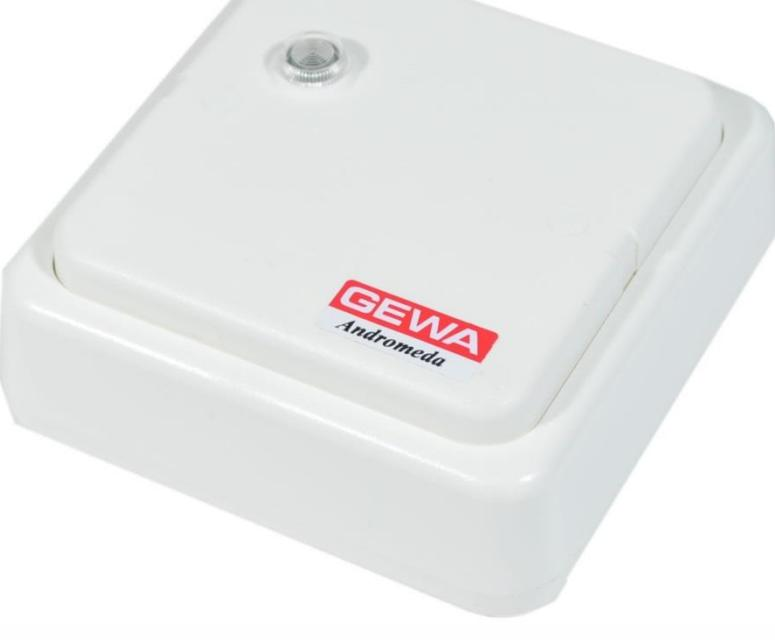

Rev C SE, GB, NO, FR, DE

| SE: Svensk bruksanvisning Gewa Andromeda REC2  | 4 |
|---------------------------------------------------|---|
| Beskrivning                                    | 4 |
| Anslutning                                        | 5 |
| Enkel programmering                               | 6 |
| Avancerad programmering                           | 7 |
| Exempel på programmering                          | 8 |
| Fabriksinställning 10                          |   |
| Återställning till fabriksinställning10           |   |
| Fastsättning av lock 10                        |   |
| Rengöring10                                       |   |
| Tekniska data 11                               |   |
| GB: English Instruction Gewa Andromeda REC2 12 |   |
| Description12                                     |   |
| Connections13                                     |   |
| Simple programming14                              |   |
| Advanced programming15                            |   |
| Examples of programming 16                     |   |
| Default setting18                                 |   |
| Resetting to default setting 18             |   |
| Attaching the lid 18                           |   |
| Cleaning 18                                    |   |
| Technical specifications 19                    |   |
| NO: Norsk brukerveiledning Gewa Andromeda REC220  |   |
| Beskrivelse 20                                 |   |
| Tilkobling 21                                  |   |
| Enkel programmering22                             |   |
| Avansert programmering 23                   |   |
| Eksempel på programmering24                       |   |
| Fabrikkinnstillinger26                            |   |
| Tilbakestill til fabrikkinnstillinger 26       |   |
| Skru Fast lokket26                                |   |
| Rengjøring 26                                  |   |
| Tekniske data 27                               |   |
| FR: Notice d'utilisation du Gewa Andromeda REC228 |   |
| Description28                                     |   |
| Connexions29                                      |   |

| Alimentation30                                       |  |
|------------------------------------------------------|--|
| Programmation simple30                               |  |
| Programmation avancée31                              |  |
| Exemples de programmations avancées 32            |  |
| Réglages par défaut 34                            |  |
| Réinitialisation d'un seul des relais 34          |  |
| Fermeture du boîtier avec des vis34                  |  |
| Nettoyage 34                                      |  |
| Spécifications techniques 35                      |  |
| DE: Gebrauchsanweisung für Gewa Andromeda REC2 36 |  |
| Beschreibung36                                       |  |
| Anschlüsse 37                                     |  |
| Einfache Programmierung 38                        |  |
| Fortgeschrittene Einstellung39                       |  |
| Programmierungsbeispiele 40                       |  |
| Fabrikeinstellung42                                  |  |
| Wiederherstellen einzelner Relais42                  |  |
| Fixierung des Deckels42                              |  |
| Reinigung 42                                      |  |
| Technische Daten43                                   |  |

# **SE: Svensk bruksanvisning Gewa Andromeda REC2**

### *Beskrivning*

Gewa Andromeda REC2 är en programmerbar IR-mottagare med 2 reläutgångar med växlande reläkontakter. Mottagaren kan programmeras med alla GewaLink-kanaler eller kodad kanal (4096). Mottagarens relä kan programmeras för att kunna arbeta bistabilt eller monostabilt. Mottagaren har en inbyggd IR-detektor.

Gewa Andromeda är utvecklad för att vara enkel att programmera, men har flera avancerade inställningsmöjligheter för att tillgodose en rad varierande användningsområden. Man kan välja mellan Monostabil-, Bistabil-, Publik funktion eller Polycode. Även inställningar för hur länge reläet ska dra kan göras, samt tidsfördröjning innan reläet ska aktiveras.

Gewa Andromeda REC2 finns i följande varianter:

| Art.nr | Benämning | Beskrivning                                           |
|--------|-----------|-------------------------------------------------------|
| 419812 | IR-REC2   | IR-mottagare för inomhusmontering. 2 reläutgångar. |

- Mottagaren får inte användas till att styra livskritiska funktioner, där människor kan ta allvarlig skada.
- Om den styrda funktionen kräver kontinuerlig strömtillförsel för att inte orsaka skada på människa, så skall batteribackup användas.

# *Anslutning*

Alla anslutningsplintar är jackbara vilket innebär att de kan tas bort innan ledningar ansluts. Se figur hur ledningar skall anslutas.

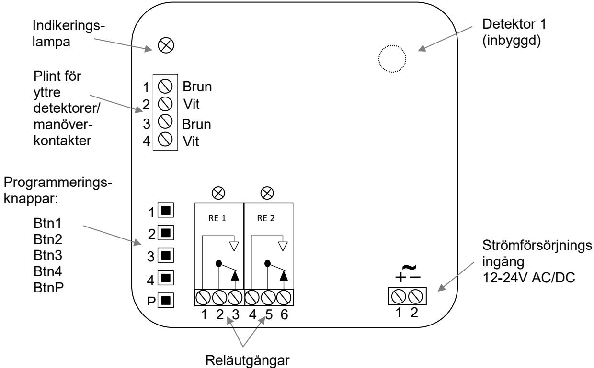

#### **Yttre detektor**

Detektorn är själva ögat som tar emot IR-signalen. På mottagarens kretskort sitter en inbyggd detektor. Vid anslutning av yttre detektor skall ledarnas färger anslutas enligt märkningen i figuren. Var noggrann vid inkoppling så att ledarna kommer rätt.

Det finns två plintar för anslutning av yttre detektorer. Man kan ansluta fler detektorer parallellt på de befintliga plintarna. Totalt kan max 5 st anslutas.

*OBS! Räckvidden minskar om detektorögat täcks eller på annat sätt skyms, t ex av gardiner eller möbler.*

#### **Inkoppling av manöverkontakt**

Det finns två separata ingångar för manöverkontakter till Gewa Andromeda. Manöverkontakt kopplas in på plinten för yttre detektor. T ex armbågskontakt kan anslutas.

*OBS! Vid aktivering av relä med manöverkontakt kvarhålls reläet ca: 0,5 sekunder efter att man släppt manöverkontakten.*

#### **Reläanslutning**

Mottagaren har 2 växlande reläkontakter. Vid anslutning av induktiva laster, t ex motorer och reläer bör dessa avstöras. Se *Tekniska data* för max reläbelastning.

#### **Strömförsörjning**

Mottagaren matas med 12-24 V AC/DC (- 10% - +20%).

# *Enkel programmering*

Gewa Andromeda är utvecklad för att vara enkel att programmera, följ instruktionerna nedan för programmering av de vanligaste användningsområdena.

IR-mottagaren kan programmeras med GewaLink-kanalerna 0-127 (kanal 62 har ingen funktion) eller kodad kanal (4096). Vid programmeringen bestäms också om IR-mottagaren skall arbeta med en monostabil eller bistabil funktion.

För att kunna programmera måste man ha en Gewa IR-sändare.

**Monostabil funktion** = Reläet aktiveras så länge knappen på IR-sändaren hålls nedtryckt.

**Bistabil funktion** = Reläet aktiveras när knappen på IR-sändaren trycks ner och släpps, andra gången som knappen på IR-sändaren trycks ner och släpps, återgår reläet till viloläget.

#### **Varning!**

Vid programmering aktiveras det aktuella reläet. Detta kan innebära att någonting kan startas igång ofrivilligt.

#### **Programmera relä för IR och Monostabil funktion**

- 1. Tryck på den knapp på IR-sändaren vars kanal önskas programmeras in och tryck samtidigt in programmeringsknappen för önskat relä på IR-mottagaren.
- 2. Vänta tills indikeringslampan blinkar och reläet drar.
- 3. Släpp programmeringsknappen (inom 2 sekunder) och knappen på IR-sändaren.
- 4. Kontrollera funktionen genom att trycka på den valda knappen på IR-sändaren.

#### **Programmera relä för IR och Bistabil funktion**

- 1. Tryck på den knapp på IR-sändaren vars kanal önskas programmeras in och tryck samtidigt in programmeringsknappen för önskat relä på IR-mottagaren.
- 2. Vänta tills indikeringslampan blinkar och reläet drar. Fortsätt hålla knapparna i 2 sekunder.
- 3. Släpp programmeringsknappen och knappen på IR-sändaren.
- 4. Kontrollera funktionen genom att trycka på den valda knappen på IR-sändaren.

Är man inte nöjd med vald kanal (knapp på IR-sändaren) eller funktion gör man bara om proceduren. Tänk på att om programmeringsknappen hålls intryckt mindre än 2 sekunder fås en monostabil funktion, hålls den intryckt 2 sek fås en bistabil funktion.

# *Avancerad programmering*

Gewa Andromeda-mottagaren har flera avancerade inställningsmöjligheter för att tillgodose en rad varierande användningsområden. Man kan välja mellan Monostabil/Bistabil/Publik funktion/Polycode. Tidsinställningar för hur länge reläet ska dra. Samt tidsfördröjning innan reläet ska aktiveras. Se figur nedan.

| Publik funktion = | Reläet aktiveras med alla GewaLink-kanaler eller alla kodade 4096- koder (inställningsbart), t.ex. för dörrautomatik i offentlig miljö.                           |
|----------------------|----------------------------------------------------------------------------------------------------------------------------------------------------------------------------|
| Polycode =        | En sekvens av 4 GewaLink-kanaler, tex. fyrsiffrig portkod.                                                                                                                 |
| Max time =        | Maximal tid som reläet drar, sedan måste man återaktivera reläet med IR-sändaren. Man kan välja olika tider för detta.                                                  |
| Min time =        | När man sänder en kort tid med sändaren så ligger reläet draget i valt antal sekunder efter att man släppt knappen på sändaren. Man kan välja olika tider för detta. |
| Delayed On time = | Tillslagsfördröjning. Man håller inne knappen på sändaren tills att reläet                                                                                                 |

### **Programmera relä med avancerade inställningar**

För att programmera Gewa Andromeda med avancerade inställningar ska man gå in i inställningsmenyn. Se figuren nedan för val av inställningar. Gör så här:

drar. Man kan välja olika tider för detta.

- 1. Tryck på programmeringsknappen *P.*
- 2. Välj vilket relä som ska programmeras (steg 2 i figuren).
- 3. Välj önskad funktion enligt steg 3.
- 4. Beroende på vald funktion kan olika val göras, se steg 4.

Andromeda meddelar med blinkningar och dragningar av relä om en inställning lyckades eller misslyckades. Vid en lyckad inställning sparas inställningen automatiskt.

Om en inställning inte blir korrekt eller att ett menyval inte görs inom ca: 10 sekunder, återgår Andromeda till normalläge och meddelar "Misslyckades".

#### **Meddelande**:

Lyckades: 3 blinkningar och samtidigt 3 dragningar av relä.

Misslyckades: 8 blinkningar.

# **Översikt av inställningar**

Figuren nedan visar mottagarens olika inställningsmöjligheter.

| STEP 1     | STEP 2            | STEP 3                    | STEP 4              |
|------------|-------------------|---------------------------|---------------------|
|            |                   |                           | Mono/Bi/Public/Poly |
|            |                   |                           | Btn1, Mono          |
|            |                   |                           | Btn2, Bi            |
|            |                   |                           | Btn3, Public On     |
|            |                   |                           | Btn4, Polycode      |
|            |                   |                           | BtnP, Exit          |
|            |                   |                           |                     |
|            |                   |                           | Max time (sec.)     |
|            |                   |                           | Btn1, Off           |
|            |                   |                           | Btn2, 2             |
|            | Select Relay      | Select Function           | Btn3, 4             |
|            | Btn1, R1          | Btn1, Mono/Bi/Public/Poly | Btn4, 6             |
|            | Btn2, R2          | Btn2, Max time            | BtnP, Exit          |
| Enter Menu | Btn3, R3          | Btn3, Min time            |                     |
| Button P   | Btn4, R4          | Btn4, Delayed On time     | Min time (sec.)     |
|            | BtnP, Exit        | BtnP, Exit                | Btn1, 0             |
|            |                   |                           | Btn2, 1             |
|            | Remove ext.switch | Set ext.switch            | Btn3, 5             |
|            |                   |                           | Btn4, 30            |
|            |                   |                           | BtnP, Exit          |
|            |                   |                           |                     |
|            |                   |                           | Delayed On time     |
|            |                   |                           | Btn1, 0             |
|            |                   |                           | Btn2, 2             |
|            |                   |                           | Btn3, 4             |
|            |                   |                           | Btn4, 6             |
|            |                   |                           | BtnP, Exit          |

# *Exempel på programmering*

#### **Programmera extern manöverkontakt**

Gör enligt följande för att lägga till extern manöverkontakt:

- 1. Tryck på programmeringsknappen *P*.
- 2. Välj vilket relä som ska aktiveras av den externa manöverkontakten, tryck på programmeringsknappen för valt relä.
- 3. Tryck sedan på den externa manöverkontakten.
- 4. Klart! Prova att reläet aktiveras av den externa manöverkontakten.

Gör enligt följande för att ta bort extern manöverkontakt:

- 1. Tryck på programmeringsknappen *P*.
- 2. Tryck på manöverkontakten vars funktion skall tas bort.
- 3. Klart! Prova om den externa manöverkontakten har tagits bort.

### **Exempel 1: Inställning av "Publik funktion" för Relä 2**

Observera att "Publik funktion" kan ställas in för alla GewaLink-kanaler **eller** alla kodade 4096-kod. Fabriksinställning är alla GewaLink-kanaler. Önskad typ för "Publik funktion" ställs in genom att spela in en valfi GewaLink-kanal eller kodad 4096-kod på valt relä.

Observera att "Publik funktion" tas bort, av säkerhetsskäl, när man spelar in IR-kanal för ett relä. Man måste alltid aktivera "Publik funktion" efter att man gjort inspelningen.

Ställ först in Relä 2 för monostabil funktion med alla GewaLink-kanaler, följ instruktionen *Programmera relä för IR och Monostabil funktion* på *sid 6*.

Fortsätt sedan med att ställa in reläets funktion (enligt tabellen):

- 1. Tryck på programmeringsknappen *P*.
- 2. Tryck på *Btn2* (Väljer Relä 2)
- 3. Tryck på *Btn1* (Väljer ../Public/..)
- 4. Tryck på *Btn3* (Väljer Publik funktion På)
- 5. Klart! (Lyckades: 3 blinkningar och samtidigt 3 dragningar av relä.)

#### **Exempel 2: Inställning av "Polycode" för Relä 1**

Polycode är en sekvens av fyra GewaLink-kanaler, tex. fyrsiffrig portkod. Sekvensen kan bestå av GewaLink-kanaler och/eller kodade 4096-koder.

Gör enligt följande för att ställa in reläets funktion (enligt tabellen):

- 1. Tryck på programmeringsknappen *P*.
- 2. Tryck på *Btn1* (Väljer Relä 1)
- 3. Tryck på *Btn1* (Väljer ../Polycode/..)
- 4. Tryck på *Btn4* (Inspelningssekvens startar)
- 5. Indikeringlampan blinkar 2 gånger, tryck på önskad knapp på IR-sändaren.
- 6. Släpp knappen på IR-sändaren när lampan blinkar 1 gång.
- 7. Upprepa punkt 5-6 för alla fyra IR-koder som ska ingå i Polycode.
- 8. Klart! (Lyckades: 3 blinkningar och samtidigt 3 dragningar av relä.)

#### **Typinstallation dörrautomatik**

Vid installation för styrning av dörrautomatik med kompletterande extern detektor utomhus och manöverkontakt (armbågskontakt) inomhus är det viktigt att extern detektor och manöverkontakt ansluts på varsin avsedd ingång för externa anslutningar (1-2/Brun-Vit och 3-4/Brun-Vit).

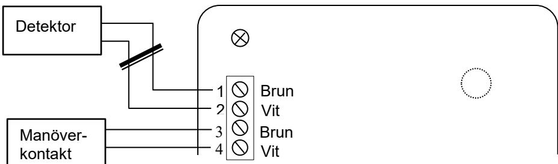

#### **Varning!**

Om extern detektor och manöverkontakt ansluts och programmeras på samma plint kommer eventuell kortslutning av detektor/detektorkabel att registreras som tryck på manöverkontakten och reläet aktiveras (dörröppning!).

# *Fabriksinställning*

Gewa Andromeda levereras förinställd med Monostabil funktion och med GewaLinkkanalerna 16-17 på relä 1-2.

# *Återställning till fabriksinställning*

För att återställa Gewa Andromeda till fabriksinställning ska man trycka på och hålla kvar programmeringsknappen *P* i 5 sekunder tills indikeringslampan börjar blinka och sedan trycka på programmeringsknappen *P* en gång till inom 2 sekunder när lampan lyser med fast sken.

# *Fastsättning av lock*

På modell IR-REC2 finns det möjlighet att skruva fast locket med medföljande skruvar.

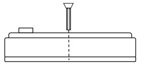

### *Rengöring*

Mottagarens ytterhölje rengörs med en hårt urvriden trasa som doppats i vatten med lite diskmedel i.

### *Tekniska data*

| Drivspänning:                | 12-24V AC/DC (- 10% - +20%)                                       |
|------------------------------|-------------------------------------------------------------------------|
| Max strömförbrukning i vila: | 10mA (relä inaktivt)                                                 |
| Max strömförbrukning i vila: | 15mA (2 detektorer, relä inaktivt)                                      |
| Max strömförbrukning:        | 55mA (2 detektorer, relä aktivt)                                        |
| Max reläbelastning:          | 3A, 24V AC/DC resistiv last                                             |
| Max antal detektorer:        | 6 inkl inbyggd detektor                                              |
| Programmeringskanaler:       | GewaLink-kanalerna 0-127 (kanal 62 har ingen funktion) och 4096-kod. |
| Omgivningstemperatur:        | -20°C - +35°C, (-4°F - +95°F)                                     |
| Användningsmiljö:            | Inomhus; IR-REC2, (IP-21)                                         |
| Fysiska mått:                | IR-REC2: 96 x 96 x 36mm                                              |

# **GB: English Instruction Gewa Andromeda REC2**

### *Description*

Gewa Andromeda REC2 is a programmable IR receiver with 2 relay outputs with alternating relay contacts. The receiver can be programmed with all GewaLink-channels or coded channel (4096). The receiver's relay can be programmed to function in a bistable or a monostable manner. The receiver has an internal IR detector.

Gewa Andromeda is designed to be easy to program, but it also provides more advanced settings to meet a range of different applications. You can choose between Monostable-, Bistable-, Public Function or Polycode. Settings can be made for how long time the relay will pull and time delay before the relay is to be activated.

The following versions of Gewa Andromeda REC2 are available:

| Art.no | Item    | Description                                 |
|--------|---------|---------------------------------------------|
| 419812 | IR-REC2 | IR receiver for indoor use. 2 relay output. |

- The receiver must not be used to control life-critical functions, where people can be seriously injured.
- If the controlled function requires continuous power supply in order not to cause injury to a person, battery backup must be used.

# *Connections*

All terminals are detachable, so that they can be removed before connecting wires.

Btn1 Btn2 Btn3 Btn4 BtnP Power supply input 12-24V AC/DC Detector 1 (Internal) 4 5 6 RE 2 Relay output Programming buttons: P 4 3 2 1 **~** 1 2 White White Brown Brown 1 3 2 4 Terminal for external detectors/ control switch Indicatorlamp 1 2 3 RE 1

The figure shows how wires are to be connected.

### **External detector**

The detector is the actual eye that receives the IR-signal. There is an internal detector on the circuit board of the receiver. The colors of the wires are to be connected as shown in the figure when connecting an external detector. Make sure that the wires are correctly connected when connecting a detector.

There are two terminals for connecting external detectors. It is possible to connect more than two external detectors by connecting them in parallel on the existing terminals. A maximum of 5 pcs can be connected.

*Note! The range will be reduced if the detector eye is covered or hidden in some way, for example by curtains or furniture.*

### **Connecting control switch**

There are two terminals for connection of control switches to Gewa Andromeda. A control switch is connected to the terminal for external detectors. For example, an elbow switch can be connected.

*Note! When the relay is activated by a control switch, the relay is held about 0.5 seconds after releasing the control switch.*

### **Relay Connection**

The receiver has two alternating relay contacts. Inductive loads, such as motors and relays, should be connected through a disturbance filter. The maximum relay loading is specified in the *Technical specifications*.

### **Power supply**

The receiver is powered with 12-24V AC/DC (-10% - +20%).

### *Simple programming*

Gewa Andromeda is designed to be easy to program. Follow the instructions below for programming the most common uses.

The IR-receiver can be programmed with GewaLink-channels 0-127 (channel 62 has no function) or one coded channel (4096). The selection is also made during programming whether a particular relay is to function in a monostable or a bistable manner.

A Gewa IR-transmitter is required to program the receiver.

**Monostable functioning** = The relay is activated as long as the button on the IR-transmitter is held down.

**Bistable functioning** = The relay is activated when the button on the IR-transmitter is held down and releases. The second time the button is held down and released, the relay will be deactivated.

#### **Warning!**

The relevant relay is activated during the programming. This may cause an inadvertent activation of some equipment.

#### **Program relay for IR and Monostable functioning**

- 1. Press the selected button on the IR-transmitter and, at the same time, press the programming button for the selected relay on the IR-receiver.
- 2. Wait until the indicator lamp flashes and the relay is activated.
- 3. Release the programming button (within 2 seconds) and the button on the IRtransmitter.
- 4. Check the function by pressing the selected button on the IR-transmitter.

#### **Program relay for IR and Bistable functioning**

- 1. Press the selected button on the IR-transmitter and, at the same time, press the programming button for the selected relay on the IR-receiver.
- 2. Wait until the indicator lamp flashes and the relay is activated. Keep the button pressed for 2 seconds.
- 3. Release the programming button and the button on the IR-transmitter.
- 4. Check the function by pressing the selected button on the IR-transmitter.

If you are not satisfied with the selected channel (button on the IR-transmitter) or function, simply repeat the procedure. Remember that if the programming button is held down for less than 2 seconds, the relay is programmed with a monostable function. If it is held down for 2 seconds, the relay is programmed with a bistable function.

# *Advanced programming*

Gewa Andromeda receiver provides more advanced settings to meet a range of different applications. You can choose between Monostable/Bistable/Public Function/Polycode, time settings for how long the relay will pull, and time delay before the relay is to be activated. See the figure below.

| Public function = | The relay is activated by all GewaLink-channels or all coded 4096- channels (setting), e.g., for automatic doors in public spaces.                                                     |
|----------------------|-------------------------------------------------------------------------------------------------------------------------------------------------------------------------------------------------------------|
| Polycode =        | A sequence of 4 GewaLink-channels, e.g. a four-digit access code.                                                                                                                                     |
| Max time =        | Maximum time that the relay is activated, then you have to re-activate the relay with the IR-transmitter. Various time can be set.                                                        |
| Min time =     | When sending a short time with the transmitter, the relay is activated for a pre-set time after you release the button on the IR-transmitter. Various times can be set. |
| Delayed On time = | Delay time. The time that the button on the IR-transmitter should be                                                                                                                                  |

pressed down before the relay is activated. Various times can be set.

#### **Programming relay with advanced options**

To program Gewa Andromeda with advanced options, go to the setup menu. See the figure below for the selection of settings. Do as follows:

- 1. Press the programming button P.
- 2. Select the relay to be programmed (step 2 in the figure).
- 3. Select the desired function according to step 3.
- 4. Depending on the selected function, different choices can be made, see step 4.

Andromeda communicates with flashes and draws of the relay if the setting was successful or failed. After a successful setting the setting is saved automatically.

If a setting is incorrect or if a choice is not made within about 10 seconds, Andromeda returns to normal mode and informs "Fail".

#### **Message**:

Success: 3 flashes and simultaneous 3 draws by the relay.

Fail: 8 flashes.

### **Advanced options overview**

| The figure below shows the receivers different advanced settings options. |  |
|---------------------------------------------------------------------------|--|
|                                                                           |  |
|                                                                           |  |
|                                                                           |  |

| STEP 1     | STEP 2            | STEP 3                    | STEP 4               |
|------------|-------------------|---------------------------|----------------------|
|            |                   |                           | Mono/Bi/ Public/Poly |
|            |                   |                           | Btn1, Mono           |
|            |                   |                           | Btn2, Bi             |
|            |                   |                           | Btn3, Public On      |
|            |                   |                           | Btn4, Polycode       |
|            |                   |                           | BtnP, Exit           |
|            |                   |                           |                      |
|            |                   |                           | Max time (sec.)      |
|            |                   |                           | Btn1, Off            |
|            |                   |                           | Btn2, 2              |
|            | Select Relay      | Select Function           | Btn3, 4              |
|            | Btn1, R1          | Btn1, Mono/Bi/Public/Poly | Btn4, 6              |
|            | Btn2, R2          | Btn2, Max time            | BtnP, Exit           |
| Enter Menu | Btn3, R3          | Btn3, Min time            |                      |
| Button P   | Btn4, R4          | Btn4, Delayed On time     | Min time (sec.)      |
|            | BtnP, Exit        | BtnP, Exit                | Btn1, 0              |
|            |                   |                           | Btn2, 1              |
|            | Remove ext.switch | Set ext.switch            | Btn3, 5              |
|            |                   |                           | Btn4, 30             |
|            |                   |                           | BtnP, Exit           |
|            |                   |                           |                      |
|            |                   |                           | Delayed On time      |
|            |                   |                           | Btn1, 0              |
|            |                   |                           | Btn2, 2              |
|            |                   |                           | Btn3, 4              |
|            |                   |                           | Btn4, 6              |
|            |                   |                           | BtnP, Exit           |

# *Examples of programming*

#### **Adding or removing an external switch**

Do as follows to add an external switch:

- 1. Press the programming button *P*.
- 2. Select the relay to be activated by the external switch and press the programming button for the selected relay.
- 3. Press the external switch.
- 4. Done! Check the function by pressing the external switch.

Do as follows to remove an external switch:

- 1. Press the programming button *P*.
- 2. Press the external switch whose function is to be removed.
- 3. Done! Check if the external switch has been removed.

### **Example 1: Setting "Public function" for Relay 2**

Note that "Public function" can be set for all GewaLink-channels **or** all coded 4096-channels. Default setting is all GewaLink-channels. Selected type for "Public function" is set by recording any GewaLink-channel or coded 4096-channel to the selected relay.

Note that "Public function" is deleted, for security reason, when an IR-channel is recorded for a relay. The "Public function" must always be reselected after the IR-recording.

First, program Relay 2 for monostable function with all GewaLink-channels, follow the instruction *Program relay for IR and Monostable functioning* on page *14*.

Continue by programming the function of the relay (according to the table):

- 1. Press the programming button *P*.
- 2. Press *Btn2* (Selects Relay 2)
- 3. Press *Btn1* (Selects ../Public/..)
- 4. Press *Btn3* (Selects Public function On)
- 5. Done! (Success: 3 flashes and simultaneously 3 draws by the relay.)

### **Example 2: Setting "Polycode" for Relay 1**

Polycode is a sequence of 4 GewaLink-channels, e.g. four-digit access code. The sequence can consist of GewaLink-channels and/or coded 4096-channels.

Do as follows to program the function for the relay (according to the table):

- 1. Press the programming button *P*.
- 2. Press *Btn1* (Selects Relay 1)
- 3. Press *Btn1* (Selects ../Polycode/..)
- 4. Press *Btn4* (Recording sequence starts)
- 5. The indicator lamp flashes 2 times, press the desired button on the IR-transmitter.
- 6. Release the button on the IR-transmitter when the indicator lamp flashes 1 time.
- 7. Repeat steps 5 and 6 for all four IR-codes of the Polycode.
- 8. Done! (Success: 3 flashes and simultaneously 3 draws by the relay.)

### **Typical Installation of Door Automatics**

When installation is made for controlling door automatics with additional external detector outdoors and control switch (e.g., elbow switch) indoors, it is important that the external detector and the control switch are connected on separate terminals for external connections (1-2/Brown-White and 3-4/Brown-White).

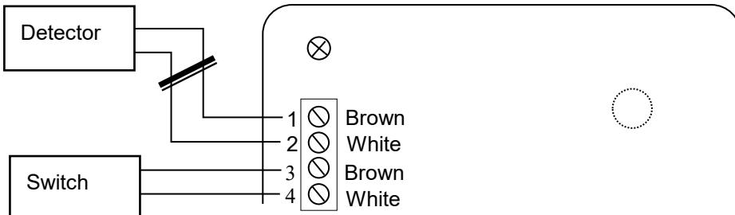

#### **Warning!**

If the external detector and the control switch is connected and programmed for the same terminal, any short circuit of the detector/detector cable will be registered as a press on the control switch, and the relay is activated (door opens!).

## *Default setting*

Gewa Andromeda comes preset with Monostable functioning and GewaLink-channel 16-17 on relay 1-2.

### *Resetting to default setting*

To restore Gewa Andromeda to the default setting, press and hold the programming button *P* for 5 seconds until the indicator lamp flashes, and then press the programming button *P* again within 2 seconds when the indicator lamp remains lit.

### *Attaching the lid*

On model IR-REC2 it is possible to attach the lid with the included screws.

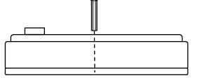

### *Cleaning*

Dip a cloth into water with a little detergent in it and wring it out well. This can then be used to clean the outer casing of the receiver.

### *Technical specifications*

| 12-24V AC/DC (-10% - +20%)                                                       |
|----------------------------------------------------------------------------------------|
| 10mA (relay inactive)                                                               |
| 15mA (2 detectors, relay inactive)                                               |
| 55mA (2 detectors, relay active)                                                 |
| 3A, 24V AC/DC resistive load                                                        |
| 6, including internal detector                                                         |
| GewaLink-channels 0-127 (channel 62 is without function), one coded channel (4096). |
| -20° - +35°C, (-4° - +95°F)                                                      |
| Indoors: IR-REC2, (IP-21)                                                        |
| IR-REC2: 96 x 96 x 36mm                                                             |
|                                                                                        |

# **NO: Norsk brukerveiledning Gewa Andromeda REC2**

### *Beskrivelse*

Gewa Andromeda REC2 er en programmerbar IR-mottaker med 2 releutganger med vekslende relekontakter. Mottakeren kan programmeres med alle GewaLink-kanaler eller kodet kanal (4096). Releene kan programmeres monostabilt eller bistabilt. Mottakeren har en innebygd IR-detektor.

Gewa Andromeda er utviklet slik at den skal være enkel å programmere, men har allikevel en rekke avanserte innstillingsmuligheter. Man kan velge mellom Monostabil-, Bistabil-, Publik funksjon eller Polycode. Du kan også stille inn hvor lenge releet skal trekke, eller legge inn en tidsforsinkelse.

Gewa Andromeda REC2 finnes i følgende varianter:

| Art.nr | Benevning | Beskrivelse                               |
|--------|-----------|-------------------------------------------|
| 419812 | IR-REC2   | IR-mottaker for innendørs bruk. 2 releer. |

- Mottakeren skal ikke brukes til å styre enheter hvor menneskers liv er avhengig av dens funksjoner.
- Hvis den skal kobles opp mot en konstant strømtilførsel skal det brukes batteribackup.

# *Tilkobling*

Alle tilkoblingspunkter er avtakbare. Det betyr at du kan løsne dem før du monterer ledningen.

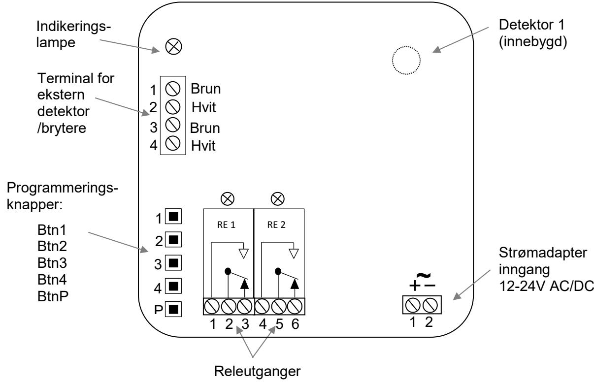

Se figur hvordan ledningene skal tilkobles.

### **Ytre detektor**

Detektoren er selve øyet til mottakeren som tar imot IR-signaler. På mottakerens kretskort sitter en innebygd detektor. Ved tilkobling av en ytre detektor skal ledningen kobles etter anvist tegning med riktig fargevalg. Sjekk når du kobler slik at fargene blir riktig.

Det er to tilkoblingspunkter for tilkobling av eksterne detektorer. Man kan koble flere detektorer i parallell med eksisterende. I alt 5 detektorer kan kobles på.

*OBS; Rekkevidden minskes hvis detektorøyet er tildekket, f.eks. med en gardin eller et møbel.*

#### **Innkobling** *av brytere*

Det finnes to steder hvor man kan koble på en ekstern bryter til Gewa Andromeda. Bryteren kobles inn på punktet hvor ekstern detektor kobles. Det kan *f.eks.* brukes en albubryter.

*OBS: Ved montering av ekstern bryter, holder releet ca 0,5 sek etter at bryter slippes.*

#### **Relee**

Mottakeren har 2 vekslende releer. Ved tilkobling av induktive laster, *f.eks.* motorer og andre releer, bør disse måles. Se *Tekniske data* for maks belastning.

#### **Strømforsyning**

Mottakeren belastes med 12-24 V AC/DC (- 10% - +20%).

# *Enkel programmering*

Gewa Andromeda er utviklet for å være enkel å programmere. Følg veiledningen nedenfor for en innføring i de vanligste programmeringene.

IR-mottakeren kan programmeres med GewaLink-kanalene 0-127 (kanal 62 har ingen funksjon), eller med en kodet kanal (4096). Det finnes en programmeringsknapp for hvert relé. Med programmeringsknappen bestemmes også om signalet skal være monostabil eller bistabil.

For å programmere må man ha en Gewa IR-sender.

**Monostabil funksjon** = Releet er aktivt så lenge knappen på IR-senderen er aktiv.

**Bistabil funksjon** = Releet blir aktivt når knappen på IR-senderen blir trykket ned og slippes igjen. Releet slipper når knappen på IR-senderen trykkes og slippes igjen.

#### **Advarsel!**

Ved programmering aktiveres releet. Dette kan bety at det kan oppstå uønsket start av en enhet.

#### **Programmere relé for IR og Monostabil funksjon**

- 1. Trykk på ønsket knapp på IR-senderen som skal læres opp. Trykk samtidig på den programmeringsknappen for det releet du ønsker signalet inn på.
- 2. Vent til indikeringslampen blinker og releet trekker.
- 3. Slipp programmeringsknappen (innen 2 sek.) og knappen på IR-senderen.
- 4. Kontroller funksjonen ved å trykke på den valgte knappen på IR-senderen.

#### **Programmere relé for IR- og Bistabil funksjon**

- 1. Trykk på ønsket knapp på IR-senderen som skal læres opp. Trykk samtidig på programmeringsknappen for det releet du ønsker signalet inn på.
- 2. Vent til indikeringslampen blinker og releet trekker. Fortsett å holde knappene inne i 2 sekunder.
- 3. Slipp programmeringsknappen og knappen på IR-senderen.
- 4. Kontroller funksjonen ved å trykke på den valgte knappen på IR-senderen.

Er man ikke fornøyd med velg av kanal (knapp på IR-senderen) eller funksjon, kan man bare gjenta prosedyren. Tenk på at, holder man programmeringsknappen inne i mindre enn 2 sek. blir det monostabil funksjon, og i mer enn 2 sek. blir den bistabil funksjon.

## *Avansert programmering*

Gewa Andromeda-mottakeren har flere avanserte innstillingsmuligheter, dette for å få løst de fleste oppgaver. Man kan velge mellom Monostabil/Bistabil/Publik funktion/Polycode. Tidsinnstillinger for hvor lang tid releet skal trekke. Og tidsforsinkelsen før relé skal aktiveres. Se figuren nedenfor.

| Public function = | Releet aktiviseres av alle GewaLink-kanaler og eller alle 4096-koder (dette kan stilles inn). f.eks. for automatiske dører i offentlige rom.                |
|-------------------------|----------------------------------------------------------------------------------------------------------------------------------------------------------------------------|
| Polycode =           | En sekvens av 4 GewaLink-kanaler, f.eks. firesifret dørkode.                                                                                                               |
| Max time =              | Maksimal tid som releet trekker. Etter dette må man aktivere releet med IR-senderen igjen. Man kan velge ulike tider for dette.                                      |
| Min time =           | Når man gir et kort trykk på senderen, ligger releet trukket et valgt antall sekunder etter at knappen er sluppet. Man kan velge forskjellige tider for dette. |
| Delayed On time =    | Tilslagsetterslep: Man må holde knappen inne på senderen en angitt tid før signalet sendes. Man kan velge forskjellige tider for dette.                           |

#### **Programmere releet med avanserte innstillinger**

For å programmere Gewa Andromeda med avanserte innstillinger må man gå inn i innstillingsmenyen. Se på figur for å velge innstilling. Gjør slik:

- 1. Trykk på programmeringsknappen *P*
- 2. Velg hvilket rele som skal velges (step 2 i figuren)
- 3. Velg ønsket funksjon i henhold til step 3
- 4. Det er flere valg under hver funksjon, se step 4.

Andomeda gir tilbakemelding med blink og aktivisering av relé om programmeringen har vært vellykket eller mislykket. Når innstillingen er vellykket lagres den automatisk.

Om innstillingen ikke er vellykket, eller et menyvalg ikke blir gjort innen 10 sek., går alt tilbake til start og gir tilbakemeldingen «mislykket».

#### **Meldinger**:

Vellykket: 3 blink + 3 trekk av releet

Mislykket: 8 blink

### **Oversikt over innstillinger**

Figuren nedenfor viser mottakerens ulike innstillingsmuligheter.

| STEP 1     | STEP 2            | STEP 3                    | STEP 4              |
|------------|-------------------|---------------------------|---------------------|
|            |                   |                           | Mono/Bi/Public/Poly |
|            |                   |                           | Btn1, Mono          |
|            |                   |                           | Btn2, Bi            |
|            |                   |                           | Btn3, Public On     |
|            |                   |                           | Btn4, Polycode      |
|            |                   |                           | BtnP, Exit          |
|            |                   |                           |                     |
|            |                   |                           | Max time (sec.)     |
|            |                   |                           | Btn1, Off           |
|            |                   |                           | Btn2, 2             |
|            | Select Relay      | Select Function           | Btn3, 4             |
|            | Btn1, R1          | Btn1, Mono/Bi/Public/Poly | Btn4, 6             |
|            | Btn2, R2          | Btn2, Max time            | BtnP, Exit          |
| Enter Menu | Btn3, R3          | Btn3, Min time            |                     |
| Button P   | Btn4, R4          | Btn4, Delayed On time     | Min time (sec.)     |
|            | BtnP, Exit        | BtnP, Exit                | Btn1, 0             |
|            |                   |                           | Btn2, 1             |
|            | Remove ext.switch | Set ext.switch            | Btn3, 5             |
|            |                   |                           | Btn4, 30            |
|            |                   |                           | BtnP, Exit          |
|            |                   |                           |                     |
|            |                   |                           | Delayed On time     |
|            |                   |                           | Btn1, 0             |
|            |                   |                           | Btn2, 2             |
|            |                   |                           | Btn3, 4             |
|            |                   |                           | Btn4, 6             |
|            |                   |                           | BtnP, Exit          |

# *Eksempel på programmering*

### **Programmere ekstern manøverkontakt:**

Gjør følgende for å legge til ekstern brytere:

- 1. Trykk på programmeringsknappen *P.*
- 2. Velg hvilken rele som skal aktiveres, trykk på programmeringsknappen for valgt rele.
- 3. Trykk så på den eksterne bryteren.
- 4. Klart! Test at releet aktiveres av den eksterne bryteren.

Gjør det på følgende måte for å fjerne ekstern brytere.

- 1. Trykk på programmeringsknappen *P.*
- 2. Trykk på bryteren hvis funksjon skal fjernes.
- 3. Klart! Test at den eksterne bryterener fjernet.

### **Eksempel 1: Innstilling av "Public function" for Relé 2**

Publik funksjonen gjør det mulig for alle GewaLink-kanaler, **eller** alle kodede 4096-kode, og åpne releet. Fabrikkinnstilling er alle GewaLink-kanaler. Ønsket type for Public-funksjon stilles ved at en GewaLink-kanal, eller kodet 4096-kode, legges inn på releet.

Vær oppmerksom på at Public-funksjonen tas bort av sikkerhetsmessige grunner når man legger inn IR-kanal. Man må alltid aktivere Public-funksjonen etter at programmering er gjort:

Still først inn Relé 2 for monostabil funksjon med alle GewaLink-kanaler, se veiledning *Programmere relé for IR- og monostabil funksjon* på side 22.

Fortsett så og stille inn releets funksjon (se tabell):

- 1. Trykk på programmeringsknappen *P*.
- 2. Trykk på *Btn2* (velger Relé 2).
- 3. Trykk på *Btn1* (velger ../Public/..)
- 4. Trykk på *Btn3* (velger Publik funksjon På)
- 5. Klar! (Vellykket: 3 blink og 3 trekk av relé)

#### **Eksempel 2: Innstilling av "Polycode" for Relé 1**

Polykode er en sekvens av fire GewaLink-kanaler, f.eks. en firesifret dørkode. Sekvensen kan bestå av GewaLink-kanaler og/eller kodede 4096-kode.

Gjør følgende for å stille inn releets funksjoner (se tabell).

- 1. Trykk på programmeringsknappen *P.*
- 2. Trykk på *Btn1* (velger Relé 1)
- 3. Trykk på *Btn1* (velger ../Polycode/..)
- 4. Trykk på *Btn4* (Innspillingssekvens starter)
- 5. Indikeringslampen blinker 2 ganger, trykk på ønsket knapp på IR-senderen.
- 6. Slipp knappen på IR-senderen når lampen blinker 1 gang.
- 7. Gjenta punkt 5 6 for alle fire IR-kodene som skal inngå i Polycode.
- 8. Klar! (Vellykket: 3 blink og 3 trekk av relé)

#### **I installasjon med dørautomatikk**

Hvis mottaker monteres sammen med dørautomatikk, detektor og albubryter, må detektor og albuebryter skilles. 1-2/brun/Hvit og 3,4/brun/hvit.

#### **Advarsel!**

Hvis ekstern detektor og albuebryter monteres på samme punkt, vil detektoren aktivere albuebryter, og releet aktiveres (dør åpnes!).

### *Fabrikkinnstillinger*

Gewa Andromeda leveres ferdig med Monostabil funksjon og GewaLink kanal 16-17 på rele 1-2.

### *Tilbakestill til fabrikkinnstillinger*

For å tilbakestille Gewa Andromeda til fabrikkinnstillinger skal programmeringsknappen *P* holdes inne i 5 sek. til indikeringslampen begynner å blinke. Trykk så på programmeringsknappen *P* igjen innen 2. sek. når indikeringslampen lyser fast.

### *Skru Fast lokket*

På modell IR-REC2 finnes det mulighet for å skru fast lokket med medfølgende skrue.

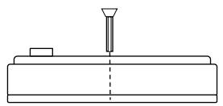

### *Rengjøring*

Mottakerens utside kan rengjøres med en fuktig klut (med et mildt oppvaskmiddel). Tørkes med en tørr klut etter rengjøring.

### *Tekniske data*

| Drivspenning:                    | 12-24V AC/DC (- 10% - +20%)                                     |
|----------------------------------|-----------------------------------------------------------------------|
| Maks strømforbruk i hvile: | 10mA (relé inaktiv)                                                   |
| Maks strømforbruk i hvile:    | 15mA (2 detektorer, relé inaktiv)                                     |
| Maks strømforbruk:            | 55mA (2 detektorer, relé inaktiv)                                     |
| Maks relebelastning:             | 3A, 24V AC/DC resistiv last                                           |
| Maks antall detektorer:       | 6 inkl innebygd detektor                                              |
| Programmeringskanaler:           | GewaLink-kanalene 0-127 (kanal 62 har ingen funksjon) og 4096-kode |
| Omgivelsestemperatur:            | -20°C - +35°C, (-4°F - +95°F)                                   |
| Bruksmiljø:                      | Innendørs: IR-REC2, (IP-21)                                        |
| Fysiske mål:                  | IR-REC2: 96 x 96 x 36mm                                               |

# **FR: Notice d'utilisation du Gewa Andromeda REC2**

### *Description*

Gewa Andromeda REC2 est un récepteur infrarouge programmable avec 2 sorties de relais équipés de contacts alternatifs. La programmation du récepteur peut être réalisée avec tous les canaux GewaLink ou les canaux à code 4096. Le relais du récepteur peut être programmé pour fonctionner de manière bistable ou monostable. Le récepteur dispose d'un détecteur IR interne.

De par sa conception, Gewa Andromeda est facile à programmer, mais il fournit également des paramètres plus avancés pour répondre à un large éventail d'applications. Vous avez le choix entre différentes options : Monostable, Bistable, Fonction publique ou Polycode. Les réglages peuvent être effectués en ajoutant des temporisations à l'activation ou à la désactivation.

Gewa Andromeda REC2 existe dans les versions suivantes :

| Art.no | Item    | Description                                                                   |
|--------|---------|-------------------------------------------------------------------------------|
| 419812 | IR-REC2 | Récepteur IR pour une utilisation en intérieur. 2 sorties de relais. |

- Le récepteur ne doit pas être utilisé pour contrôler des fonctions essentielles pouvant exposer les personnes à un risque de blessures graves.
- Lorsque la fonction contrôlée nécessite une alimentation électrique en continu pour ne pas mettre en danger les personnes, une batterie de secours doit être utilisée.

### *Connexions*

Toutes les bornes sont amovibles de sorte qu'elles peuvent être retirées avant de raccorder les fils. La figure montre comment connecter les fils.

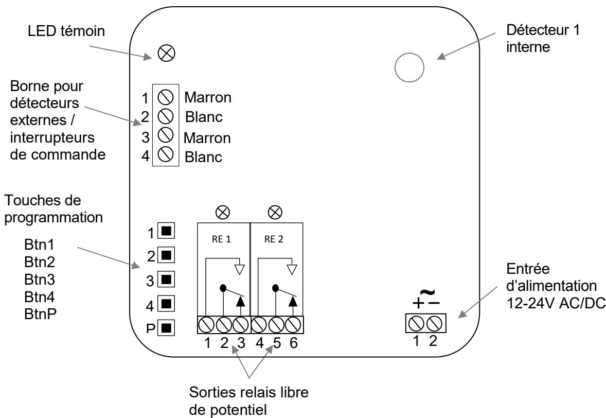

#### **Détecteurs externes**

Le détecteur est de fait l'œil qui reçoit le signal IR. Il existe un détecteur interne sur la carte de circuit imprimé du récepteur. Pour effectuer la connexion d'un détecteur externe, il faut raccorder les fils selon leur couleur comme illustré sur la figure. Assurez-vous que les câbles sont correctement connectés.

Il est prévu deux bornes pour le raccordement des détecteurs externes mais il est possible de connecter plus de deux détecteurs externes en réalisant un branchement en parallèle sur les bornes existantes. Cinq détecteurs au maximum peuvent être connectés.

*N. B. : La portée est réduite lorsque l'œil du détecteur est recouvert ou obstrué par des objets tels que des rideaux ou des meubles.*

#### **Branchement d'un interrupteur de commande**

Il est prévu deux bornes pour le raccordement d'interrupteurs de commande au Gewa Andromeda. Ces interrupteurs sont connectés au bornier destiné aux détecteurs externes. Il est possible ainsi de raccorder un interrupteur au coude.

*N. B. : Lorsque le relais est activé par un interrupteur de commande, le relais est maintenu pendant environ 0,5 seconde après que l'interrupteur ait été relâché.*

#### **Branchement des relais**

Le récepteur dispose de deux relais équipés de contacts alternatifs. Lors de la connexion d'une charge inductive (moteur, relais), un filtre antiparasite devrait être ajouté. La charge maximale des relais est indiquée dans les *Spécifications techniques*.

# *Alimentation*

Le récepteur est alimenté avec une tension de 12 à 24 V CA/CC (-10% - +20%)

### *Programmation simple*

De par sa conception, Gewa Andromeda est facile à programmer. Suivez les instructions cidessous pour la programmation des utilisations les plus courantes.

Le récepteur IR peut être programmé avec les canaux GewaLink 0-127 (le canal 62 n'a pas de fonction) ou un canal à 4096 codes. Une touche de programmation est prévue pour chaque relais. La sélection du mode de fonctionnement bistable ou monostable est également effectuée lors de la programmation.

Il est nécessaire d'utiliser un émetteur disposant de canaux GewaLink pour programmer le récepteur.

**Fonctionnement monostable** = Le relais est activé aussi longtemps que la touche de l'émetteur IR est maintenue enfoncée.

**Fonctionnement bistable** = Le relais est activé lorsque la touche de l'émetteur IR est enfoncée puis relâchée. Il est désactivé lorsque la touche est enfoncée et relâchée une deuxième fois.

#### **Attention !**

Pendant la programmation, le relais concerné est activé. Ceci peut provoquer l'activation par inadvertance de certains équipements.

#### **Programmer un relais pour l'infrarouge, en mode monostable**

- 1. Appuyez sur la touche de l'émetteur IR à programmer et enfoncez en même temps la touche de programmation pour le relais sélectionné sur le récepteur IR.
- 2. Patientez jusqu'à ce que le voyant lumineux s'allume et que le relais soit activé.
- 3. Relâchez le bouton de programmation dans un délai de moins de 2 secondes ainsi que la touche de l'émetteur IR.
- 4. Vérifiez le fonctionnement en appuyant sur la touche de l'émetteur IR que vous venez de programmer.

#### **Programmer un relais pour l'infrarouge, en mode bistable**

- 1. Appuyez sur la touche de l'émetteur IR à programmer et enfoncez en même temps la touche de programmation pour le relais sélectionné sur le récepteur IR.
- 2. Patientez jusqu'à ce que le voyant lumineux s'allume et que le relais soit activé.
- 3. Relâchez le bouton de programmation au bout de 2 secondes ainsi que la touche de l'émetteur IR.
- 4. Vérifiez le fonctionnement en appuyant sur la touche de l'émetteur IR que vous venez de programmer.

Si vous n'êtes pas satisfait du choix du canal (touche de l'émetteur IR) ou de la fonction, il suffit de répéter la procédure. N'oubliez pas que si la touche de programmation est maintenue enfoncée pendant moins de deux secondes, le relais est programmé avec une fonction monostable. Si elle est maintenue enfoncée pendant deux secondes, le relais est programmé avec une fonction bistable.

### *Programmation avancée*

Le récepteur Gewa Andromeda fournit des paramètres plus avancés pour répondre à un large éventail d'applications. Vous avez le choix entre différentes options : Monostable, Bistable, Fonction publique ou Polycode. Les réglages peuvent être effectués en ajoutant des temporisations à l'activation ou à la désactivation.

| Fonction Public =              | Le relais est activé par tous les canaux GewaLink ou tous les canaux à codes 4096. Par exemple, les portes automatiques dans les lieux publics.                                         |
|-----------------------------------|--------------------------------------------------------------------------------------------------------------------------------------------------------------------------------------------------------|
| Polycode =                     | Une séquence de 4 canaux GewaLink. Par exemple, un code d'accès à quatre chiffres.                                                                                                                  |
| Max time=                         | Durée maximale pendant laquelle le relais est activé ; vous devez ensuite réactiver le relais avec l'émetteur IR. Divers temps peuvent être réglés                                            |
| Min time =                     | Lorsque vous envoyez une impulsion avec l'émetteur, le relais est activé pendant un temps défini après que vous ayez relâché la touche de l'émetteur IR. Divers temps peuvent être réglés. |
| Delayed On time = (Retardé) | Temps de temporisation. Il s'agit du temps pendant lequel la touche de l'émetteur IR doit être enfoncée avant que le relais soit activé. Divers temps peuvent être réglés.              |

#### **Programmer les relais avec les options avancées**

Pour programmer Gewa Andromeda avec des options avancées, allez dans le menu de configuration. Voir la figure ci-dessous pour la sélection des paramètres. Procédez comme suit:

- 1. Appuyez sur la touche de programmation P.
- 2. Sélectionnez le relais à programmer (étape 2 sur la figure).
- 3. Sélectionnez la fonction souhaitée en fonction de l'étape 3.
- 4. Selon la fonction sélectionnée, différents choix vous sont proposés, voir l'étape 4.

L'Andromeda communique avec des clignotements de la LED témoin et active le relais pour vérifier si le réglage a réussi ou échoué. Si l'opération a réussi, le réglage est enregistré automatiquement.

Si un paramètre est incorrect ou si le choix n'est pas fait dans les 10 secondes, l'Andromeda revient au mode normal et informe l'opérateur en affichant « ÉCHEC ».

#### **Message**:

Réussite : 3 clignotements avec simultanément trois déclenchements du relais.

Échec: 8 clignotements.

### **Diagramme des options avancées**

La figure ci-dessous montre les différentes options de réglage avancées du récepteur.

| STEP 1     | STEP 2            | STEP 3                    | STEP 4               |
|------------|-------------------|---------------------------|----------------------|
|            |                   |                           | Mono/Bi/ Public/Poly |
|            |                   |                           | Btn1, Mono           |
|            |                   |                           | Btn2, Bi             |
|            |                   |                           | Btn3, Public On      |
|            |                   |                           | Btn4, Polycode       |
|            |                   |                           | BtnP, Exit           |
|            |                   |                           |                      |
|            |                   |                           | Max time (sec.)      |
|            |                   |                           | Btn1, Off            |
|            |                   |                           | Btn2, 2              |
|            | Select Relay      | Select Function           | Btn3, 4              |
|            | Btn1, R1          | Btn1, Mono/Bi/Public/Poly | Btn4, 6              |
|            | Btn2, R2          | Btn2, Max time            | BtnP, Exit           |
| Enter Menu | Btn3, R3          | Btn3, Min time            |                      |
| Button P   | Btn4, R4          | Btn4, Delayed On time     | Min time (sec.)      |
|            | BtnP, Exit        | BtnP, Exit                | Btn1, 0              |
|            |                   |                           | Btn2, 1              |
|            | Remove ext.switch | Set ext.switch            | Btn3, 5              |
|            |                   |                           | Btn4, 30             |
|            |                   |                           | BtnP, Exit           |
|            |                   |                           |                      |
|            |                   |                           | Delayed On time      |
|            |                   |                           | Btn1, 0              |
|            |                   |                           | Btn2, 2              |
|            |                   |                           | Btn3, 4              |
|            |                   |                           | Btn4, 6              |
|            |                   |                           | BtnP, Exit           |

### *Exemples de programmations avancées*

#### **Ajouter ou retirer un interrupteur de commande externe**

Procédez comme suit pour ajouter un interrupteur de commande externe :

- 1. Appuyez sur la touche de programmation *P*.
- 2. Sélectionnez le relais qui doit être activé par l'interrupteur de commande externe et appuyez sur la touche de programmation du relais concerné.
- 3. Appuyez sur l'interrupteur de commande externe.
- 4. Terminé ! Vérifiez le fonctionnement en appuyant sur l'interrupteur de commande externe.

Procédez comme suit pour retirer un interrupteur de commande externe :

- 1. Appuyez sur la touche de programmation P.
- 2. Appuyez sur l'interrupteur de commande externe dont la fonction doit être retirée.
- 3. Terminé ! Vérifiez si l'interrupteur de commande externe a bien été retiré.

### **Exemple 1 : Réglage de la "Fonction publique" sur le relais 2**

Veuillez noter que le réglage de la "Fonction publique" peut être effectué pour tous les canaux GewaLink **ou** tous les canaux à 4096 codes. Le réglage d'usine est "Tous les canaux GewaLink". Le réglage du type de "Fonction publique" souhaité est effectué en enregistrant un canal GewaLink ou un canal à 4096 codes de son choix sur le relais sélectionné.

Veuillez également noter que, pour des raisons de sécurité, la "Fonction publique" est supprimée lors de l'enregistrement d'un canal IR sur un relais. Il faut donc toujours réactiver la "Fonction publique", une fois l'enregistrement effectué.

Réglez d'abord le relais 2 pour la fonction monostable avec tous les canaux GewaLink. Pour ce faire, suivez les instructions *Programmer un relais pour l'infrarouge, en mode monostable* de la *page 30.*

Effectuez ensuite le réglage de la fonction du relais (selon le tableau) :

- 1. Appuyez sur la touche de programmation P.
- 2. Appuyez sur Btn2 (sélection du Relais 2)
- 3. Appuyez sur Btn1 (sélection de ../Public/..)
- 4. Appuyez sur Btn3 (sélection de Fonction publique activée)
- 5. Terminé ! (3 clignotements et simultanément trois déclenchements du relais signifient la réussite de l'opération.)

### **Exemple 2 : Réglage du "Polycode" sur le relais 1**

Le Polycode est une séquence de quatre canaux GewaLink telle qu'un code d'accès à quatre chiffres. La séquence peut être composée de canaux GewaLink et (ou) de canaux à 4096 codes.

Procédez comme suit pour effectuer le réglage de la fonction du relais (selon le tableau) :

- 1. Appuyez sur la touche de programmation P.
- 2. Appuyez sur Btn1 (sélection du Relais 1)
- 3. Appuyez sur Btn1 (sélection de ../Polycode/..)
- 4. Appuyez sur Btn4 (la séquence d'enregistrement démarre)
- 5. Le voyant clignote 2 fois ; appuyez alors sur la touche souhaitée de l'émetteur IR.
- 6. Relâchez la touche de l'émetteur IR lorsque le voyant clignote 1 fois.
- 7. Répétez les étapes 5 à 6 pour les quatre codes IR qui composent le Polycode.
- 8. Terminé ! (3 clignotements et simultanément trois déclenchements du relais signifient la réussite de l'opération.)

### **Installation type pour les portes automatiques**

Lorsque l'installation est faite pour le contrôle automatique de porte avec un détecteur externe supplémentaire et un interrupteur additionnel de commande (par exemple, un interrupteur au coude) à l'intérieur, il est important que le détecteur externe et l'interrupteur de commande soient connectés sur des bornes séparées comme illustré ci-dessous (1-2/Marron-Blanc et 3-4/Marron-Blanc).

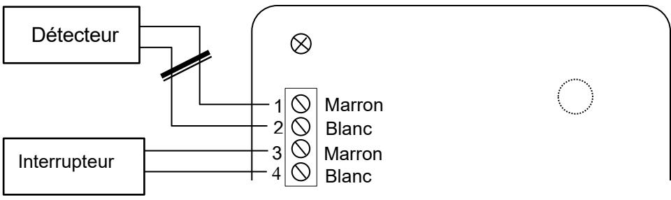

#### **Attention !**

Si le détecteur externe et l'interrupteur de commande sont raccordés et programmés sur la même borne, tout court-circuit du câble/détecteur externe sera enregistré comme une activation de l'interrupteur de commande et le relais sera alors activé (la porte s'ouvrira !).

### *Réglages par défaut*

Gewa Andromeda est préréglé par défaut avec un fonctionnement Monostable et les canaux GewaLink 16-17 sur le relais 1-2.

### *Réinitialisation d'un seul des relais*

Pour réinitialiser un relais à ses réglages par défaut, appuyez et maintenez enfoncé le bouton de programmation P pendant 5 secondes jusqu'à ce que le voyant clignote. Appuyez ensuite de nouveau sur la touche de programmation P dans les 2 secondes pendant lesquelles le voyant reste allumé.

### *Fermeture du boîtier avec des vis*

Il et possible de fixer le couvercle du modèle IR-REC2 avec les vis qui accompagnent le récepteur à sa livraison.

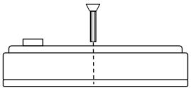

### *Nettoyage*

Trempez un chiffon dans l'eau avec un peu de détergent et essorez-le bien avant de l'utiliser pour nettoyer le boîtier externe du récepteur.

### *Spécifications techniques*

| Tension d'alimentation :          | 12-24V AC/DC (- 10% - +20%)                    |
|--------------------------------------|------------------------------------------------------|
| Courant maximal au repos :     | 10mA (relais inactif)                                |
| Courant maximal au repos :     | 15mA (2 détecteurs, relais inactifs)                 |
| Courant maximal :                 | 55mA (2 détecteurs, relais actifs)                |
| Charge maximale du relais : | 3A, 24V AC/DC charge résistive                       |
| Nombre maximum de détecteurs : | 6, y compris détecteur interne                    |
| Canaux de programmation :            | Canaux GewaLink 0-127, canaux à 4096 codes. |
| Température ambiante :            | -20°C - +35°C, (-4°F - +95°F)                  |
| Environnement :                   | En intérieur: IR-REC2 (IP-21)                  |
| Dimensions:                          | IR-REC2: 96 x 96 x 36mm                              |

# **DE: Gebrauchsanweisung für Gewa Andromeda REC2**

# *Beschreibung*

Gewa Andromeda REC2 ist ein programmierbarer IR-Empfänger mit 2 Relaisausgängen mit wechselnden Relaiskontakten. Der Empfänger kann mit allen GewaLinkSignalen programmiert werden oder verschlüsselten Signal (4096). Empfänger Relais kann bistabil oder monostabil programmiert werden. Der Empfänger verfügt über einen eingebauten IR-Detektor.

Gewa Andromeda ist einfach zu programmieren, verfügt aber über mehrere fortgeschrittene Einstellungsmöglichkeiten, um an verschiedene Anwendungsbereiche angepasst zu werden. Wählen Sie zwischen den Funktionen Monostabil, Bistabil, Publik oder Polycode. Sie können sogar die Dauer einstellen, die das Relais aktiv sein soll, sowie eine Zeitverzögerung vor Aktivieren des Relais.

Gewa Andromeda REC2 ist in den folgenden Varianten erhältlich:

| Art.-Nr. | Bezeichnung | Beschreibung                                        |
|----------|-------------|-----------------------------------------------------|
| 419812   | IR-REC2     | IR-Empfänger für Innenmontage. 2 Relaisausgänge. |

- Der Empfänger darf nicht zur Steuerung lebensgefährlicher Funktionen verwendet werden, bei denen Menschen ernsthaft zu Schaden kommen können.
- Wenn die gesteuerten Funktionen auf eine kontinuierliche Stromversorgung angewiesen sind, damit Menschen nicht ernsthaft zu Schaden kommen, muss eine Notfall-Stromversorgung durch Batterien gewährleistet werden.

# *Anschlüsse*

Alle Anschlüsse sind mit Steckern ausgerüstet. Dies ermöglicht, eine Verkabelung vorzunehmen, ohne am Netz angeschlossen zu sein.

Das Bild zeigt, wie verkabelt wird:

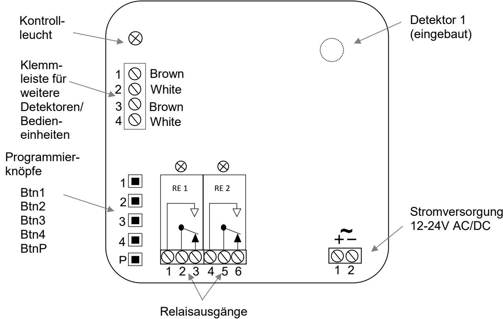

#### **Externer Detektor**

Der Detektor ist das Auge, welches das IR-Signal empfängt. In die Stromkreiskarte des Empfängers ist ein Detektor integriert. Beim Anschließen weiterer Detektoren müssen die Kabel entsprechend der Farbmarkierungen in der Abbildung angeschlossen werden. Achten Sie darauf, dass die Kabel korrekt angeschlossen sind.

Zum Anschließen weiterer Detektoren sind zwei Klemmanschlüsse vorhanden. An diesen Klemmen lassen sich bis zu fünf Detektoren parallel anschließen.

*Hinweis! Die Reichweite vermindert sich, wenn das Detektor Auge verdeckt oder anderswie beeinträchtigt wird, z.B. durch Vorhänge oder Möbel.*

#### **Anschließen von Bedieneinheiten**

Für Bedieneinheiten sind bei Gewa Andromeda zwei separate Eingänge vorgesehen. Die Bedieneinheiten werden an die Klemmleiste für weitere Detektoren angeschlossen, z. B. Ellenbogenschalter.

*ACHTUNG! Beim Aktivieren von Relais mit Bedieneinheiten entsteht eine Verzögerung von ca. 0,5 Sekunden nach Loslassen der Bedieneinheit.*

#### **Relaisanschluss**

Der Empfänger ist mit 2 wechselnden Relaiskontakten ausgestattet. Wenn induktive Lasten angeschlossen werden (Motoren, Relais...), sollte ein Entstörungsfilter angewandt werden. Siehe *Technische Daten* für die maximale Relaisbelastung.

#### **Stromversorgung**

Der Empfänger benötigt 12-24 V AC/DC (- 10% - +20%).

# *Einfache Programmierung*

Gewa Andromeda ist einfach zu programmieren. Folgen Sie den Anweisungen zum Programmieren der häufigsten Anwendungsbereiche.

Der IR-Empfänger kann mit allen GewaLink-Signalen 0-127 (ausser dem Signal 62, welches reserviert ist), sowie mit einem codierten Signal, 4096, programmiert werden. Jedem Relais ist ein Programmierknopf zugeordnet. Bei der Programmierung entscheiden Sie über das Funktionsmodus bistabil oder monostabil.

Zum Programmieren ist ein Gewa IR-Sender erforderlich.

**Monostabil-Funktion** = Das Relais ist aktiviert, so lange der Knopf am IR-Sender gedrückt gehalten wird.

**Bistabil-Funktion** = Das Relais ist aktiviert, wenn der Knopf am IR-Sender gedrückt und wieder losgelassen wird. Wenn der Knopf am IR-Sender erneut gedrückt und wieder losgelassen wird, wird das Relais wieder in den Ruhezustand versetzt.

#### **Warnung!**

Bei der Programmierung wird das jeweilige Relais aktiviert. Das kann bedeuten, dass eine Funktion unbeabsichtigterweise aktiviert wird.

#### **Relaisprogrammierung für IR und Monostabil-Funktion**

- 1. Drücken Sie auf den Taster an dem IR-Sender, dessen Kanal Sie programmieren möchten. Halten Sie gleichzeitig den Programmierknopf des gewünschten Relais am IR-Empfänger gedrückt.
- 2. Warten Sie, bis die Kontrollleuchte blinkt und das Relais aktiviert ist.
- 3. Lassen Sie den Programmierknopf (nach bis zu zwei Sekunden) und den Taster am IR-Sender los.
- 4. Prüfen Sie die Funktion durch Drücken des gewählten Tasters am IR-Sender.

#### **Relaisprogrammierung für IR und Bistabil-Funktion**

- 1. Drücken Sie auf den Taster am IR-Sender, dessen Kanal Sie programmieren möchten. Halten Sie gleichzeitig den Programmierknopf des gewünschten Relais am IR-Empfänger gedrückt.
- 2. Warten Sie, bis die Kontrollleuchte blinkt und das Relais aktiviert ist. Halten Sie den Knopf zwei Sekunden lang gedrückt.
- 3. Lassen Sie den Programmierknopf und den Taster am IR-Sender los.
- 4. Prüfen Sie die Funktion durch Drücken des gewählten Tasters am IR-Sender.

Wenn Sie den Kanal (Taster am IR-Sender) oder die Funktion ändern möchten, wiederholen Sie den Vorgang. Bitte beachten Sie, dass das Relais in Monostabil-Funktion läuft, wenn der Programmierknopf weniger als zwei Sekunden gedrückt gehalten wird, und in Bistabil-Funktion, wenn er mehr als zwei Sekunden gedrückt gehalten wird.

# *Fortgeschrittene Einstellung*

Der Gewa Andromeda-Empfänger verfügt über mehrere fortgeschrittene Einstellungsmöglichkeiten für verschiedene Anwendungsbereiche. Wählen Sie zwischen den Funktionen Monostabil, Bistabil, Publik oder Polycode. Zeiteinstellung für die Aktivierungsdauer des Relais sowie Verzögerung vor Aktivieren des Relais. Siehe Abb.

| Publik-Funktion = | Das Relais wird über alle GewaLink-Kanäle oder alle vergebenen 4096- Kanäle (einstellbar) aktiviert, z. B. für automatische Türöffnung im öffentlichen Bereich.                             |
|----------------------|---------------------------------------------------------------------------------------------------------------------------------------------------------------------------------------------------|
| Polycode =        | Vier aufeinanderfolgende GewaLink-Kanäle, z. B. ein vierziffriger Türöffnungscode.                                                                                                             |
| Max time =        | Maximale Zeit, in der das Relais aktiv ist. Anschließend muss es mit dem IR-Sender erneut aktiviert werden. Hier lassen sich verschiedene Zeiten einstellen.                                |
| Min time =        | Wenn eine Minimalzeit eingestellt ist, ist das Relais die eingestellte Anzahl an Sekunden lang aktiv nach Loslassen des Knopfes am Sender. Hier lassen sich verschiedene Zeiten einstellen. |
| Delayed On time = | Verzögerung. Das Aktivieren des Relais ist verzögert, während der Taster gedrückt gehalten wird. Hier lassen sich verschiedene Zeiten                                                       |

#### **Relaisprogrammierung mit fortgeschrittenen Einstellungen**

Zum Programmieren von Gewa Andromeda mit fortgeschrittenen Einstellungen öffnen Sie das Einstellungsmenü. Siehe Abb. unten zum Wählen der Einstellungen. Gehen Sie folgendermaßen vor:

- 1. Drücken Sie den Programmierknopf *P.*
einstellen.

- 2. Wählen Sie aus, welches Relais programmiert werden soll (Schritt 2 in der Abb.).
- 3. Wählen Sie die gewünschte Funktion entsprechend Schritt 3.
- 4. Je nach Funktion gibt es verschiedene Wahlmöglichkeiten, siehe Schritt 4.

Andromeda zeigt durch Blinken und Aktivieren des Relais an, ob die Einstellung erfolgreich war oder nicht. Bei erfolgreicher Einstellung wird die Einstellung automatisch gespeichert.

Wenn die Einstellung nicht erfolgreich war oder eine Menüwahl nicht innerhalb von ca. zehn Sekunden erfolgt ist, wird Andromeda wieder in die Ausgangslage zurück versetzt und die Nachricht "Nicht erfolgreich" erscheint.

#### **Nachrichten**:

Erfolgreich: dreimaliges Blinken und gleichzeitig dreimaliges Aktivieren des Relais.

Nicht erfolgreich: achtmaliges Blinken.

### **Übersicht über die Einstellungen**

In der Abb. unten sind die verschiedenen Einstellungsmöglichkeiten des Empfängers dargestellt.

| STEP 1     | STEP 2            | STEP 3                    | STEP 4               |
|------------|-------------------|---------------------------|----------------------|
|            |                   |                           | Mono/Bi/ Public/Poly |
|            |                   |                           | Btn1, Mono           |
|            |                   |                           | Btn2, Bi             |
|            |                   |                           | Btn3, Public On      |
|            |                   |                           | Btn4, Polycode       |
|            |                   |                           | BtnP, Exit           |
|            |                   |                           |                      |
|            |                   |                           | Max time (sec.)      |
|            |                   |                           | Btn1, Off            |
|            |                   |                           | Btn2, 2              |
|            | Select Relay      | Select Function           | Btn3, 4              |
|            | Btn1, R1          | Btn1, Mono/Bi/Public/Poly | Btn4, 6              |
|            | Btn2, R2          | Btn2, Max time            | BtnP, Exit           |
| Enter Menu | Btn3, R3          | Btn3, Min time            |                      |
| Button P   | Btn4, R4          | Btn4, Delayed On time     | Min time (sec.)      |
|            | BtnP, Exit        | BtnP, Exit                | Btn1, 0              |
|            |                   |                           | Btn2, 1              |
|            | Remove ext.switch | Set ext.switch            | Btn3, 5              |
|            |                   |                           | Btn4, 30             |
|            |                   |                           | BtnP, Exit           |
|            |                   |                           |                      |
|            |                   |                           | Delayed On time      |
|            |                   |                           | Btn1, 0              |
|            |                   |                           | Btn2, 2              |
|            |                   |                           | Btn3, 4              |
|            |                   |                           | Btn4, 6              |
|            |                   |                           | BtnP, Exit           |

### *Programmierungsbeispiele*

#### **Programmieren einer externen Bedieneinheit**

Zum Hinzufügen einer externen Bedieneinheit gehen Sie folgendermaßen vor:

- 1. Drücken Sie den Programmierknopf P.
- 2. Wählen Sie aus, welches Relais von der externen Bedieneinheit aktiviert werden soll. Drücken Sie den Programmierknopf des entsprechenden Relais.
- 3. Drücken Sie anschließend die externe Bedieneinheit.
- 4. Fertig! Prüfen Sie, ob das Relais sich von der externen Bedieneinheit aktivieren lässt.

Zum Entfernen einer externen Bedieneinheit gehen Sie folgendermaßen vor:

- 1. Drücken Sie den Programmierknopf P.
- 2. Drücken sie auf die Bedieneinheit, dessen Funktion entfernt werden soll.
- 3. Fertig! Prüfen Sie, ob die externe Bedieneinheit entfernt worden ist.

### **Beispiel 1: Einstellen der "Publik-Funktion" für Relais 2**

Bitte beachten Sie, dass die "Publik-Funktion" für alle GewaLink-Kanäle **oder** alle zugewiesenen 4096-Kanäle eingestellt werden kann. Fabrikseitig sind alle GewaLink-Kanäle eingestellt. Die gewünscht Art von "Publik-Funktion" wird eingestellt durch Zuweisen eines beliebigen GewaLink- oder vergebenen 4096-Kanals auf das gewünschte Relais.

Bitte beachten Sie, dass die "Publik-Funktion" aus Sicherheitsgründen entfernt wird, wenn dem Relais ein IR-Kanal zugewiesen wird. Aktivieren Sie immer die "Publik-Funktion" nach dem Zuweisen.

Stellen Sie Relais 2 zuerst in Monostabil-Funktion für alle GewaLink-Kanäle. Folgen Sie den Anweisungen *Relaisprogrammierung für IR und Monostabil-Funktion* auf Seite *38*.

Stellen Sie anschließend die Relaisfunktion (entsprechend der Tabelle) ein:

- 1. Drücken Sie den Programmierknopf *P*.
- 2. Drücken Sie *Btn2* (Relais 2 auswählen)
- 3. Drücken Sie *Btn1* (Auswählen ../Public/..)
- 4. Drücken Sie *Btn3* (Auswählen Publik-Funktion für)
- 5. Fertig! (Erfolgreich: dreimaliges Blinken und gleichzeitig dreimaliges Aktivieren des Relais.)

#### **Beispiel 2: Einstellen von "Polycode" für Relais 1**

Polycode beinhaltet eine Sequenz von vier GewaLink-Kanälen, z. B. ein vierziffriger Türöffnungscode. Die Sequenz kann aus GewaLink-Kanälen und/oder eingebenen 4096- Kanälen bestehen.

Gehen Sie folgendermaßen vor, um die Relaisfunktion (entsprechend der Tabelle) einzustellen:

- 1. Drücken Sie den Programmierknopf P.
- 2. Drücken Sie Btn1 (Relais 1 auswählen)
- 3. Drücken Sie Btn1 (Auswählen ../Polycode/..)
- 4. Drücken Sie Btn4 (Sequenz eingeben)
- 5. Die Leuchtdiode blinkt zwei Mal. Drücken Sie den gewünschten Taster am IR-Sender.
- 6. Lassen Sie den Taster am IR-Sender los, wenn die Leuchtdiode einmal blinkt.
- 7. Wiederholen Sie die Punkte 5-6 für alle vier IR-Ziffern des Polycodes.
- 8. Fertig! (Erfolgreich: dreimaliges Blinken und gleichzeitig dreimaliges Aktivieren des Relais.)

### **Türautomatik-Einstellung**

Bitte achten Sie beim Einstellen der Türautomatiksteuerung mit ergänzendem externen Außendetektor und Innenraum-Bedieneinheit (Ellenbogenschalter) darauf, dass externer Detektor und Bedieneinheit an ihren jeweiligen Anschlüssen angeschlossen sind (1-2/Braun-Weiß und 3-4/Braun-Weiß).

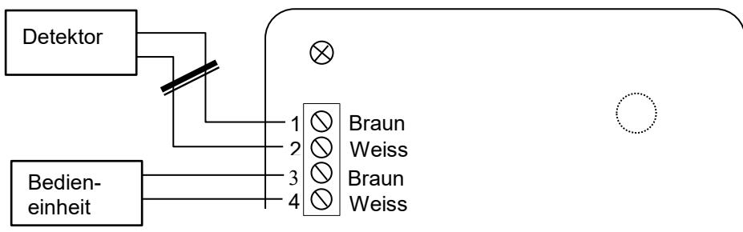

#### **Warnung!**

Wenn externer Detektor und Bedieneinheit an der selben Klemme angeschlossen und eingestellt sind, entsteht beim Aktivieren von Bedieneinheit und Relais ggf. ein Kurzschluss am Detektor/Detektorkabel (Türöffnung!).

### *Fabrikeinstellung*

Gewa Andromeda ist fabrikseitig in Monostabil-Funktion eingestellt. Die GewaLink-Kanäle 16-17 sind Relais 1-2 zugewiesen.

### *Wiederherstellen einzelner Relais*

Um ein bestimmtes Relais zur Fabrikeinstellung zurückzusetzen, drücken Sie den Programmierknopf P und halten Sie ihn fünf Sekunden lang gedrückt, bis die Diode zu blinken beginnt. Drücken Sie anschließend zwei Sekunden lang den Programmierknopf des Relais, das zurückgesetzt werden soll, bis die Diode durchgehend leuchtet.

### *Fixierung des Deckels*

Bei den Modellen IR-REC2 besteht die Möglichkeit, den Verschluss mit beiliegenden Schrauben zu verschließen.

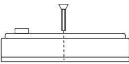

### *Reinigung*

Reinigen Sie die Außenseite des Empfängers mit einem ausgewrungenen Lappen und etwa Geschirrspülmittel.

### *Technische Daten*

| Stromversorgung:                    | 12-24V AC/DC (- 10% - +20%)                                           |
|-------------------------------------|-----------------------------------------------------------------------------|
| Max. Stromverbrauch im Ruhezustand: | 10mA (inaktive Relais)                                                      |
| Max. Stromverbrauch im Ruhezustand: | 15mA (2 Detektoren, inaktive Relais)                                        |
| Max. Stromverbrauch:                | 55mA (2 Detektoren, aktive Relais)                                          |
| Max. Belastung:                     | 3A, 24V AC/DC ohmsche Last                                                  |
| Max. Anzahl der Detektoren:         | 6 inkl. integriertem Detektor                                               |
| Programmierbare Kanäle:             | GewaLink-Signalen 0-127 (Signal 62 hat keine Funktion) ound 4096 Signal. |
| Umgebungstemperatur:                | -20°C - +35°C, (-4°F - +95°F)                                         |
| Anwendungsbereich:                  | Im Haus; IR-REC2 (IP-21)                                              |
| Dimensionen:                        | IR-REC2: 96 x 96 x 36mm                                                     |

