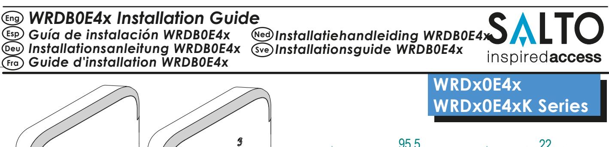
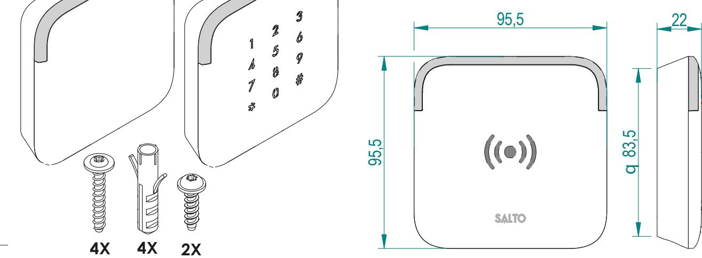
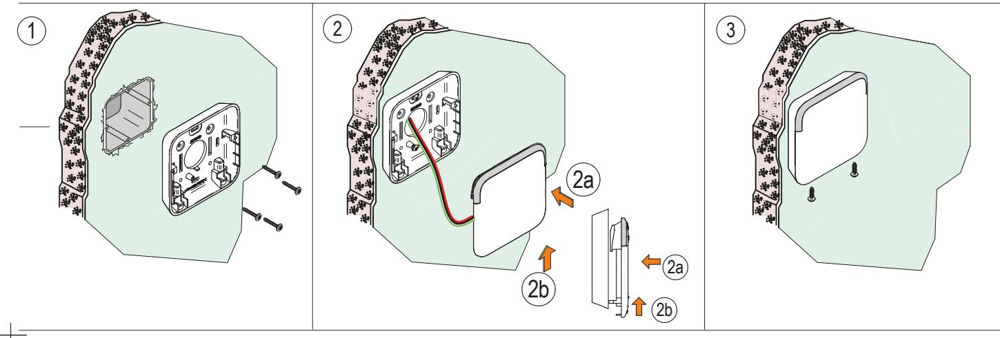
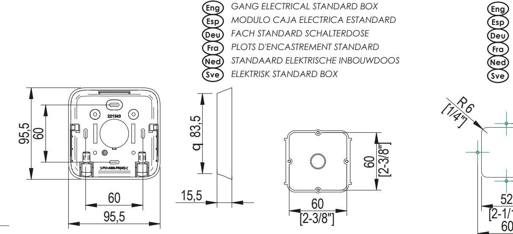
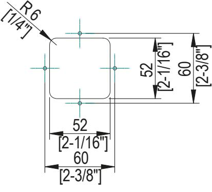
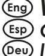
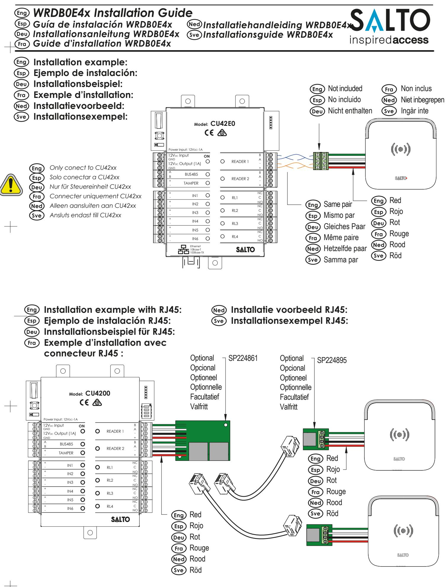

*TEMPLATE PLANTILLA SCHABLONE GABARIT DE PERÇAGE SJABLOON MALL* **Eng Esp Deu Fra Ned Sve**

## **European view**

All contents current at time of publication. SALTO Systems S.L. reserves the right to change availability of any item in this catalog, its design, construction, and/or materials.

**Fra**

### *WRDB0E4x Installation Guide Guía de instalación WRDB0E4x Installationsanleitung WRDB0E4x* **Ned Sve**

*Guide d'installation WRDB0E4x*

# *Installatiehandleiding WRDB0E4x Installationsguide WRDB0E4x*

#### **Electrical characteristics: Eng**

|                              | Min |       | Max   | Unit |                                            |     |
|------------------------------|-----|-------|-------|------|--------------------------------------------|-----|
| Temperature                  | -35 |       | 66    | ºC   | Reader                                     | 150 |
| Humidity                     | 35  |       | 85    | %    | Reader+Keyboard                            | 250 |
| RF characteristics           |     |       |       |      | Note 1: Installer must take this data into |     |
|                              | Min | Cen.  | Max   | Unit | account to dimension the                   |     |
| RFID frequency               |     | 13.56 |       | Mhz  | CU42xx power supply                        |     |
| Bluetooth Smart frequency | 2.4 | 2.445 | 2.483 | Ghz  |                                            |     |

#### **Características electricas Esp**

| Condiciones ambientales |     |       |     |      | Consumo Nota 1                                 |     |     |      |
|-------------------------|-----|-------|-----|------|------------------------------------------------|-----|-----|------|
|                         | Min |       | Max | Unit |                                                | Min | Max | Unit |
| Temperatura             | -35 |       | 66  | ºC   | Lector                                         |     | 150 | mA   |
| Humedad                 | 35  |       | 85  | %    | Lector + teclado                               |     | 250 | mA   |
| Características RF      |     |       |     |      | Nota 1: El instalador ha de tener en cuenta la |     |     |      |
|                         | Min | Cen.  | Max | Unit | dimensión del alimentador de la CU42xx         |     |     |      |
| Frecuencia RFID         |     | 13.56 |     | Mhz  |                                                |     |     |      |

2.4 2.445 2.483 Ghz

### **Operation c onditions Power Consumption Note 1**

|                 | Min | Max | Unit |  |  |
|-----------------|-----|-----|------|--|--|
| Reader          |     | 150 | mA   |  |  |
| Reader+Keyboard |     | 250 | mA   |  |  |
|                 |     |     |      |  |  |

### **Consumo Nota 1**

|                  | Min | Max | Unit |
|------------------|-----|-----|------|
| Lector           |     | 150 | mA   |
| Lector + teclado |     | 250 | mA   |

# **+Keypad**

**Cable type and max. distances**

| UTP Cat5e 2 pairs   | 100m | 60m  |  |  |  |
|---------------------|------|------|--|--|--|
| AWG24               |      |      |  |  |  |
| UTP Cat5e 4 pairs   | 250m | 150m |  |  |  |
| + SP224861/SP224895 |      |      |  |  |  |
| AWG18               | 400m | 280m |  |  |  |

**Cable type Reader Reader**

### **Tipo de cable y distancias max.**

| Tipo de cable       | Lector | Lector   |
|---------------------|--------|----------|
|                     |        | +Teclado |
| UTP Cat5e 2pares    | 100m   | 60m      |
| AWG24               |        |          |
| UTP Cat5e 4 pares   | 250m   | 150m     |
| + SP224861/SP224895 |        |          |
| AWG18               | 400m   | 280m     |

**Verkabelung and max. distances**

**Kabeltyp Leser Leser +Keypad**

100m

60m

150m

280m

250m

400m

### **Elektronische Eigenschaften: Deu**

**Frecuencia Bluetooth Smart**

### **Umgebungsbedingungen**

|               | Min | Max | Einheit |                                              | Min | Max | Einheit |
|---------------|-----|-----|---------|----------------------------------------------|-----|-----|---------|
| Temperatur    | -35 | 66  | ºC      | Leser                                        |     | 150 | mA      |
| Feuchtigkeit  | 35  | 85  | %       | Leser+Keypad                                 |     | 250 | mA      |
| RF Frequenzen |     |     |         | Note 1: Bitte beachten Sie die Stromaufnahme |     |     |         |
|               |     |     |         |                                              |     |     |         |

|                             | Min | Cen.  | Max   | Einheit |
|-----------------------------|-----|-------|-------|---------|
| RFID Frequenz               |     | 13.56 |       | Mhz     |
| Bluetooth Smart Frequenz | 2.4 | 2.445 | 2.483 | Ghz     |

### **Caractéristique électronique Fra**

 **Condition de fonctionnement Consommation Note 1**

|             | Min | Max | Unité |
|-------------|-----|-----|-------|
| Température | -35 | 66  | ºC    |
| Humidité    | 35  | 85  | %     |
|             |     |     |       |

|                              | Min | Cen.  | Max   | Unité |  |
|------------------------------|-----|-------|-------|-------|--|
| Fréquence RFID               |     | 13.56 |       | Mhz   |  |
| Fréquence Bluetooth Smart | 2.4 | 2.445 | 2.483 | Ghz   |  |

#### **Technische gegevens: Ned**

### **Omgeving**

|             | Min | Max | Unit |
|-------------|-----|-----|------|
| Temperatuur | -35 | 66  | ºC   |
| Vochtigheid | 35  | 85  | %    |
|             |     |     |      |

| RF karakteristieken          |     |       |       |      | opm 1: Installateur moet deze info meenemen voor |
|------------------------------|-----|-------|-------|------|--------------------------------------------------|
|                              | Min | Cen.  | Max   | Unit | de berekening van de voeding voor de CU42xx      |
| RFID frequency               |     | 13.56 |       | Mhz  |                                                  |
| Bluetooth Smart frequency | 2.4 | 2.445 | 2.483 | Ghz  |                                                  |

 **frequency** 

#### **Teknisk data:: Sve**

## **Arbetsområde**

|                              | Min |       | Max   | Unit |                                                   | Min | Max | Unit |
|------------------------------|-----|-------|-------|------|---------------------------------------------------|-----|-----|------|
| Temperatur                   | -35 |       | 66    | ºC   | Läsare                                            |     | 150 | mA   |
| Fukt                         | 35  |       | 85    | %    | Läsare+Knappsats                                  |     | 250 | mA   |
| RF data                      |     |       |       |      | Not 1: Installatör måste ta med denna information |     |     |      |
|                              | Min | Cen.  | Max   | Unit | för att beräkna strömåtgång                       |     |     |      |
| RFID Frekvents               |     | 13.56 |       | Mhz  |                                                   |     |     |      |
| Bluetooth Smart Frekvents | 2.4 | 2.445 | 2.483 | Ghz  |                                                   |     |     |      |

## **European view**

All contents current at time of publication.

SALTO Systems S.L. reserves the right to change availability of any item in this catalog, its design, construction, and/or materials.

**Voeding in opm 1**

**Stromaufnahme Note 1**

**Caractéristiques RF Note 1: l'installateur doit calculer l'alimentation Min Max Unité Lecteur** 150 mA **Lecteur + Clavier** 250 mA

**bei der Planung des Netzteils für die CU42XX**

**nécessaire pour alimenter la CU42xx .**

**Wandlezer** 150 mA **Wandlezer+Keyboard** 250 mA

**Min Max Unit** 

**Min Max Einheit**

| Type de câble |                 |  |
|---------------|-----------------|--|
| Type de câble | Lecteur Lecteur |  |

**AWG18**

**UTP Cat5e 2Paar AWG24 UTP Cat5e 4 Paar + SP224861/SP224895** 

|                     |      | +Clavier |  |  |  |
|---------------------|------|----------|--|--|--|
| UTP Cat5e 2 paires  | 100m | 60m      |  |  |  |
| AWG24               |      |          |  |  |  |
| UTP Cat5e 4 paires  | 250m | 150m     |  |  |  |
| + SP224861/SP224895 |      |          |  |  |  |
| AWG18               | 400m | 280m     |  |  |  |

### **Vermogen en max. afstand**

| Kable type          | Wandlezer Wandlezer |      |         |  |
|---------------------|---------------------|------|---------|--|
|                     |                     |      | +Keypad |  |
| UTP Cat5e 2 pairs   |                     | 100m | 60m     |  |
| AWG24               |                     |      |         |  |
| UTP Cat5e 4 pairs   |                     | 250m | 150m    |  |
| + SP224861/SP224895 |                     |      |         |  |
| AWG18               |                     | 400m | 280m    |  |

### **Kabeltyper och max avstånd**

| Kabel               | Läsare Läsare |      |  |  |
|---------------------|---------------|------|--|--|
|                     | +Knappsats    |      |  |  |
| UTP Cat5e 2 pairs   | 100m          | 60m  |  |  |
| AWG24               |               |      |  |  |
| UTP Cat5e 4 pairs   | 250m          | 150m |  |  |
| + SP224861/SP224895 |               |      |  |  |
| AWG18               | 400m          | 280m |  |  |

 **Consumption Not 1**

**European view**

#### *WRDB0E4x Installation Guide Guía de instalación WRDB0E4x Installationsanleitung WRDB0E4x* **Deu Ned Sve**

*Guide d'installation WRDB0E4x* **Fra**

*Installatiehandleiding WRDB0E4x Installationsguide WRDB0E4x*

#### **SIGNALLING Eng**

| Signal                      | Light                  | Time    | Buzzer                             | Time    |
|-----------------------------|------------------------|---------|------------------------------------|---------|
|                             |                        | (sec)   |                                    | (sec)   |
| Card Rejection              | Red                    | 1       | High pitched 50/50                 | 1       |
| Privacy or emergency status | Red 5x(50/50x3+off300) | 3       | High pitched 5x(50/50x3 + off 300) | 3       |
| Standard opening            | Green                  | 1       | Low pitched                        | 0,3     |
| Standard locking            | Red                    | 0,5     | Low pitched                        | 0,2     |
| Open plus office            | Green 400/200          | 2,4     | High pitched/Low pitched 400/200   | 2,4     |
| CLR Button                  | Orange                 | Cont.   | High pitched                       | Cont.   |
| Reset                       | Orange 50/100          | 450 msg | Low pitched 50/100                 | 450 msg |

### **SEÑALECTICA Esp**

| Señal                               | Luz                           | Tiempo  | Buzzer                          | Tiempo  |
|-------------------------------------|-------------------------------|---------|---------------------------------|---------|
|                                     |                               | (seg)   |                                 | (seg)   |
| Rechazo de Tarjeta                  | Rojo                          | 1       | Agudo 50/50                     | 1       |
| Rechazo por Privacidad o Emergencia | Rojo 5x(50/50x3+ apagado 300) | 3       | Agudo 5x(50/50x3 + apagado 300) | 3       |
| Apertura Normal                     | Verde                         | 1       | Medio                           | 0,3     |
| Cierre Normal                       | Rojo                          | 0,5     | Grave                           | 0,2     |
| Abrir y Paso                        | Verde 400/200                 | 2,4     | Agudo/Grave 400/200             | 2,4     |
| Botón CLR (3)                       | Rojo + Verde                  | Cont.   | Agudo                           | Cont.   |
| Reset                               | Rojo + Verde 50/100           | 450 msg | Medio 50/100                    | 450 msg |
|                                     |                               |         |                                 |         |

#### **SIGNALE Deu**

| Signal                                | LED                     | Zeit  | Buzzer                          | Zeit  |
|---------------------------------------|-------------------------|-------|---------------------------------|-------|
|                                       |                         | (Sek) |                                 | (Sek) |
| Karte abgelehnt                       | Rot                     | 1     | Hoher Ton 50/50                 | 1     |
| Bitte-nicht-stören oder Notschließung | Rot 5x(50/50x3+ aus300) | 3     | Hoher Ton 5x(50/50x3 + aus 300) | 3     |
| Normale Türöffnung                    | Grün                    | 1     | Tiefer Ton                      | 0,3   |
| Verschluss der Tür                    | Rot                     | 0,5   | Tiefer Ton                      | 0,2   |
| Office-Mode aktiviert                 | Grün 400/200            | 2,4   | Hoher Ton /Grave 400/200        | 2,4   |
| CLR Taste gedrückt                    | Rot + Grün              | Kont. | Hoher Ton                       | Kont. |
| Reset                                 | Rot + Grün 50/100       | 450   | Tiefer Ton 50/100               | 450   |

### **SIGNALISATION Fra**

| Signal                      | Voyant                    | Temps   | Buzzer                     | Temps   |
|-----------------------------|---------------------------|---------|----------------------------|---------|
|                             |                           | (sec)   |                            | (sec)   |
| Carte rejetée               | Rouge                     | 1       | Aigu 50/50                 | 1       |
| Privacité ou état d'urgence | Rouge 5x(50/50x3+ off300) | 3       | Aigu 5x(50/50x3 + off 300) | 3       |
| Ouverture Standard          | Vert                      | 1       | Grave                      | 0,3     |
| Verrouillage Standard       | Rouge                     | 0,5     | Grave                      | 0,2     |
| Ouverture passage libre     | Vert 400/200              | 2,4     | Aigu/Grave 400/200         | 2,4     |
| Bouton CLR                  | Rouge + Vert              | Cont.   | Aigu                       | Cont.   |
| Reset                       | Rouge + Vert 50/100       | 450 msg | Grave 50/100               | 450 msg |

### **SIGNALERING Ned**

| Signaal                  | LED indicatie             | Time    | Geluid                           | Time    |
|--------------------------|---------------------------|---------|----------------------------------|---------|
|                          |                           | (sec)   |                                  | (sec)   |
| Geen rechten             | Rood                      | 1       | Hoge tonen 50/50                 | 1       |
| Privacy- of noodsluiting | Rood 5x(50/50x3+ off 300) | 3       | Hoge tonen 5x(50/50x3 + off 300) | 3       |
| Standaard opening        | Groen                     | 1       | Lage tonen                       | 0,3     |
| Standaard sluiting       | Rood                      | 0,5     | Lage tonen                       | 0,2     |
| Open plus loopstand      | Groen 400/200             | 2,4     | Hoge tonen /Grave 400/200        | 2,4     |
| CLR knop                 | Rood + Groen              | Cont.   | Hoge tonen                       | Cont.   |
| Reset                    | Rood + Groen 50/100       | 450 msg | Lage tonen 50/100                | 450 msg |

#### **Händelse Sve**

| Händelse                    | Ljussignal              | Tid    | Buzzer                       | Tid    |
|-----------------------------|-------------------------|--------|------------------------------|--------|
|                             |                         | (sek)  |                              | (sek)  |
| Nekat tillträde             | Röd                     | 1      | Hög ton 50/50                | 1      |
| Stör ej eller Nödläge       | Röd 5x(50/50x3+ av 300) | 3      | Hög ton 5x(50/50x3 + av 300) | 3      |
| Standard öppning            | Grön                    | 1      | Låg ton                      | 0,3    |
| Standard stängning          | Röd                     | 0,5    | Låg ton                      | 0,2    |
| Öppning med kontorsfunktion | Grön 400/200            | 2,4    | Hög ton 400/200              | 2,4    |
| CLR Knapp                   | Röd + Grön              | Konst. | Hög ton                      | Konst. |
| Nollställning               | Röd + Grön 50/100       | 450 ms | Låg ton 50/100               | 450 ms |

**European view**