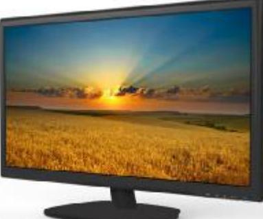
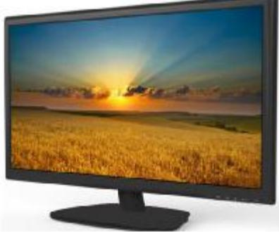

## **DS-D5022FC 21.5" LED Monitor**

### **Overview**

DS-D5022FC is a reliable surveillance display with LED backlit technology, excellent color reduction and image processing, truly display the video details. Multiply interfaces are able to meet various surveillance environments, and build-in speaker is convenient to audio play. DS-D5022FC is an ideal choice for security and surveillance application.

#### **key Features**

- LED backlit technology with full HD 1920×1080
- Wide view angle: 170°(H)/160°(V)
- Image processing: 3D comb filter, 3D De-interlace, 3D noise reduction
- Multiply inputs: HDMI, VGA, BNC, audio in
- Multiply outputs: BNC, audio output
- Build-in speaker
- External video play via USB port
- High reliable components for 7×24 working
- VESA stand bracket

#### **Model:**

DS-D5022FC

# **DS-D5022FC 21.5" LED Monitor**

### **Specification**

| Model                 | DS-D5022FC                                   |
|-----------------------|----------------------------------------------|
| Display               |                                              |
| Display Type          | LED-Backlit                                  |
| Screen Size           | 21.5"                                        |
| Pixel Pitch(H×V)      | 0.248mm ×0.248mm                             |
| Max Resolution        | 1920×1080                                    |
| Brightness            | 250cd/m2 (Typical)                           |
| Contrast              | 1000:1                                       |
| Response Time         | 5ms                                          |
| Color                 | 16.7M                                        |
| Viewing Angle         | Horizontal 170°, Vertical 160°               |
| Interface             |                                              |
| HDMI                  | 1                                            |
| VGA                   | 1                                            |
| BNC                   | In ×1, Out×1                                 |
| USB Port              | 1                                            |
| Audio                 |                                              |
| Audio Input           | 1, 3.5 mm mini-jack                          |
| Audio Output          | 1, 3.5 mm mini-jack                          |
| Speaker               | 2W ×2                                        |
| Mounting              |                                              |
| VESA                  | 100mm × 100mm                                |
| General               |                                              |
| Power Supply          | DC 12V/3.0A                                  |
| Consumption           | < 30W(on) < 0.5W(Standby)                 |
| Operation Temperature | 0°C ~ 40 °C                                  |
| Operating Humidity    | 10%~85% (No Condensation)                    |
| Storage Temperature   | -20°C ~ 60°C                                 |
| Storage Humidity      | 5%~95% (No Condensation)                     |
| Dimension (W×H×D)     | 511.4x313.0x45.4 (mm) 20.1x12.3x1.8(inch) |
| Weight                | 4.6Kg(Gross weight) , 3.2(Net weight)        |

