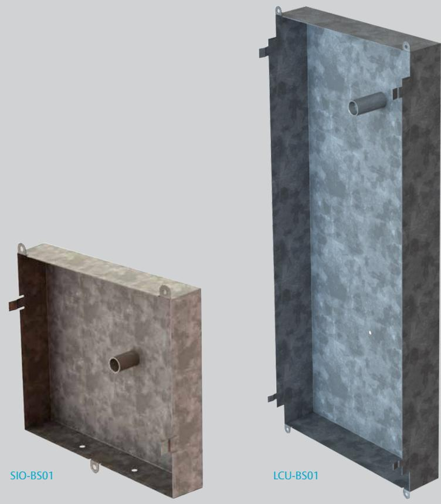
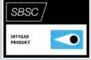
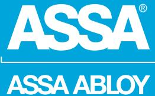

## LCUIII-BS01, SIO/DACIII-BS02

ASSA ABLOY, the global leader in door opening solutions

LCUIII-BS01 är ett borrskydd som ska monteras i LCU90116III kapsling samt kompletteras med seismisk detektor VD400 för att uppnå larmklass 3/4 i SSF 1014, utgåva 4.

SIO/DACIII-BS02 är ett borrskydd som ska monteras i SIO eller DAC530III kapsling samt kompletteras med seismisk detektor VD400 för att uppnå larmklass 3/4 i SSF 1014, utgåva 4.

LCUIII-BS01 och SIO/DACIII-BS02 ska kompletteras med seismisk detektor för att skydda mot borrning. LCUIII-BS01 och SIO/DACIII-BS02 kopplas in via valfri larmingång eller förprogrammerad ingång på 9016III MIO-Slave.

LCUIII-BS01 och SIO/DACIII-BS02 säljs utan seismisk detektor VD 400.

# LCUIII-BS01, SIO/DACIII-BS02

ASSA ABLOY, the global leader in door opening solutions

#### **Data**

- **LCUIII-BS01** • Vikt 1,01 Kg
- Dimension 500 x 225 x 85 H x B x D (mm)
- SBSC-intyg 16-130

### **SIO/DACIII-BS02**

- Vikt 0,38 Kg
- Dimension 183 x 183 x 46 H x B x D (mm)

#### **Artikelnummer**

| • LCUIII-BS01                     | S5590101131 | E58 703 88 |
|-----------------------------------|-------------|------------|
| • SIO/DACIII-BS02                 | S5590102131 | E58 703 89 |
| • Seismisk detector VD 400        | S5590103085 | E63 325 00 |
| Krävs för att uppnå larmklass 3/4 |             |            |

ASSA ABLOY is the global leader in door opening solutions, dedicated to satisfying end-user needs for security, safety and convenience

ASSA AB P.O. Box 371 SE-631 05 Eskilstuna Sweden Phone +46 (0)16 17 70 00 Fax +46 (0)16 17 70 49

Customer support: phone intl. +46 (0)16 17 71 00 Phone nat. 0771-640 640 Fax +46 (0)16 17 73 72 e-mail: helpdesk.marknad@assaabloy.com

www.assa.se