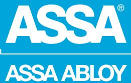
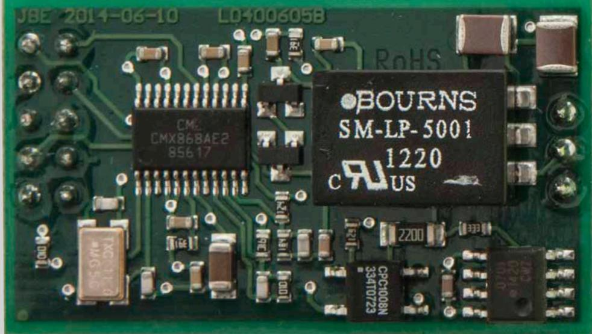
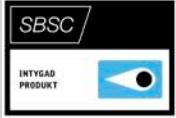
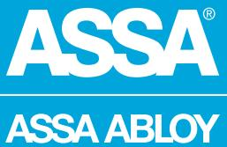

## MIO-LIF01

ASSA ABLOY, the global leader in door opening solutions

MIO-LIF01 är ett larminterface tilläggskort till 9016III MIO6-6 som används för att kunna skicka klartextmeddelande (SIA 3) via ett urval av godkända larmsändare*

MIO-LIF01 kopplas in till 9016III MIO6-6 via modularkontakt eller skruvplint vilket förenklar installationen.

* 9016III MIO6-6 stöder följande märken av larmsändare: Dualtech, Chiron, AddSecure (tidigare Multicom och Safetel).

## MIO-LIF01

ASSA ABLOY, the global leader in door opening solutions

## **Data**

- Strömförbrukning 5mA
- Vikt 0,01 Kg
- Temperaturområde -10°C till +40°C
- Luftfuktighet 75% (ej kondenserande)
- Miljöklass 2
- Dimension H x B x D (mm) 500 x 225 x 85
- Larmgodkänd: SSF 1014,utgåva 4 Larmklass 3/4*
- *För larmklass 3/4 krävs borrskydd LCUIII-BS01 (S5590101131)
- SBSC-intyg 16-130

## **Artikelnummer**

- MIO-LIF01 S5590166160 E58 703 87
CE-kontrollerad och godkänd

ASSA ABLOY is the global leader in door opening solutions, dedicated to satisfying end-user needs for security, safety and convenience

ASSA AB P.O. Box 371 SE-631 05 Eskilstuna Sweden Phone +46 (0)16 17 70 00 Fax +46 (0)16 17 70 49

Customer support: phone intl. +46 (0)16 17 71 00 Phone nat. 0771-640 640 Fax +46 (0)16 17 73 72 e-mail: helpdesk.marknad@assaabloy.com

www.assa.se