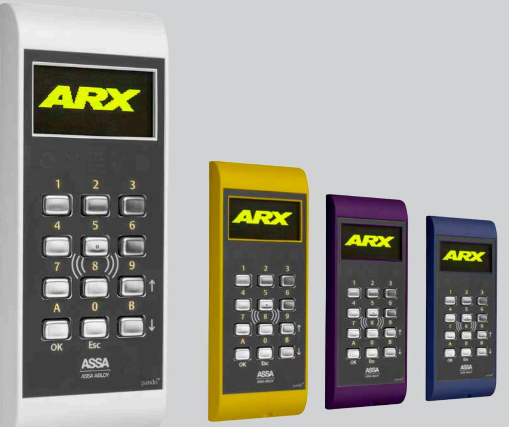
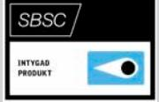
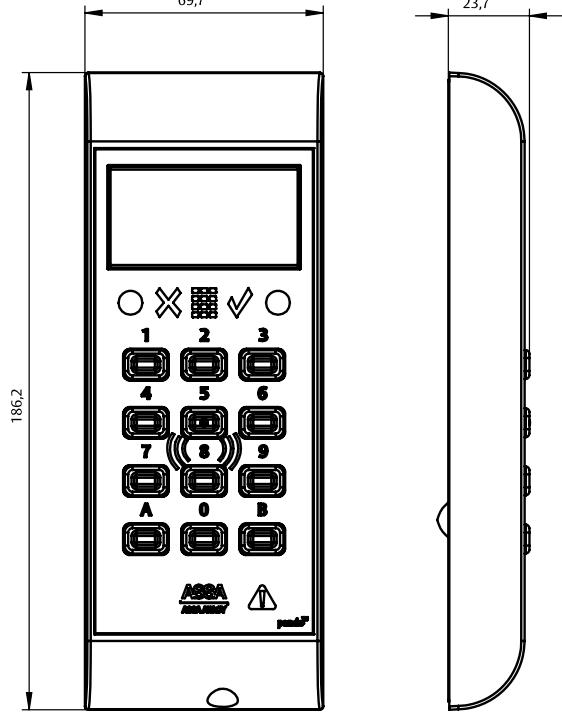

## ASSA Pando™ Display

ASSA ABLOY, the global leader in door opening solutions

ASSA Pando™ Display är en framtidssäker och generisk 13,56 MHz beröringsfri läsare och manöverpanel som ingår i ASSA:s nya generation av läsare.

Pando Display stödjer ett flertal kortteknologier vilket ger en optimal möjlighet till en anpassad säkerhet för just ditt säkerhetssystem. Dessutom kan två samtidiga kortteknologier hanteras, vilket skapar möjlighet att succesivt migrera från exempelvis MIFARE Classic till MIFARE DESFire EV1, utan att behöva dubbla passerkort. Läsaren har även stöd för att i framtiden kunna uppgraderas till kommande 13,56 MHz teknologier.

Läsaren präglas av en tidlös och ergonomisk design med utbytbara skal som medger olika färgval. Läsaren levereras med vitt skal i grundutförande. Det finns ytterligare 8 färger på skal som tillval. Läsaren har en manöverpanelsfunktion som hanterar funktioner i larm i ARX.

För enkelt handhavande har läsaren strategiskt placerade symboler samt en display för kommunikation med användaren, grön och röd indikering för larmstatus, indikering för giltigt och ogiltigt kort samt indikering för PIN-kod. Knappsatsen är bakgrundsbelyst och knapparna är slittåliga av rostfritt stål. Läsaren är anpassad för inomhus och utomhusbruk.

Pando Display stöder Hi-O™ samt SIO-kommunikation. När Pando Display ansluts till Hi-O fungerar den både som läsare och manöverpanel och vid anslutning via SIO som manöverpanel.

Hi-O används vid anslutning till DAC530III samt LCU9101. Med hjälp av Hi-O kan varje enhet (läsare, lås, och så vidare) erbjuda intelligent driftövervakning i realtid. Läsaren kan kopplas till ASSAs säkerhetsystem ASSA ARX.

# ASSA Pando™ Display

ASSA ABLOY, the global leader in door opening solutions

### **Data**

- IP klass 54
- Spänningsmatning: 12 -24V DC
- Strömförbrukning mätt vid 24V:
	- MIN 50mA utan bakgrundsbelysning och ingen dörrkod eller larmstatusindikering
	- MAX 85mA vid bakgrundsbelysning ständigt på, dörrkod aktiv samt ständig larmstatus visning
- Vikt: 0,324 kg
- Temperaturområde läsare: -25ºC till +70ºC
- Luftfuktighet 95% (ej kondenserande)
- Miljöklass 3
- Dimension HxBxD (mm) 185x70x23
- Lästeknologi: Generisk 13,56MHz (MIFARE Classic, MIFARE Plus (nivå 1 och 3), MIFARE DESFire EV1, iCLASS och SEOS)
- Kommunikation: Hi-O (läsare/manöverpanel) eller SIO (manöverpanel)
- Kompatibel med: DAC530III som läsare och manöverpanel
- Kompatibel med: LCU9101 som DESFire uppdateringsläsare
- Larmgodkänd: SSF 1014,utgåva 4 Larmklass 3/4
- SBSC-intyg 16-129

### **Artikelnummer**

- ASSA Pando Display S559686085 E58 703 45
#### **Tillbehör**

- ASSA Pando Displayskal, svart S559 686 184 E58 704 05 • ASSA Pando Displayskal, silver S559 686 186 E58 704 06
- ASSA Pando Displayskal, vitt S559 686 185 E58 704 07
- ASSA Pando Displayskal, blått S559 686 190 E58 704 08
- ASSA Pando Displayskal, grönt S559 686 191 E58 704 09
- ASSA Pando Displayskal, gult S559 686 192 E58 704 10
- ASSA Pando Displayskal, rött S559 686 193 E58 704 11
- ASSA Pando Displayskal, orange S559 686 194 E58 704 12
- ASSA Pando Displayskal, lila S559 686 195 E58 704 13

Customer support: phone intl. +46 (0)16 17 71 00 Phone nat. 0771-640 640 Fax +46 (0)16 17 73 72 e-mail: helpdesk.marknad@assaabloy.com

www.assa.se

ASSA AB P.O. Box 371 SE-631 05 Eskilstuna

Sweden

Phone +46 (0)16 17 70 00 Fax +46 (0)16 17 70 49

ASSA ABLOY is the global leader in door opening solutions, dedicated to satisfying end-user needs for security, safety and convenience