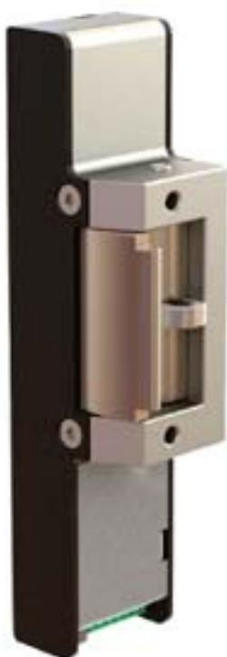
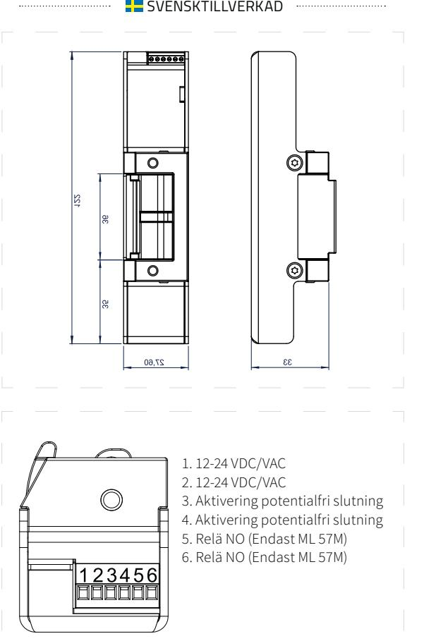

## ANVÄNDNINGSOMRÅDE

Safetron ML 59 är ett brandklassat elslutbleck med listtrycksteknik som passar till dörrar med normalt ställda krav på säkerhet. ML 59 passar bra som daglåsning i skalskydd och internlåsning inom handel, kontor och industri eller i entréer och allmänna utrymmen i flerbostadshus. Svensktillverkat.

## EGENSKAPER

- Brandgodkänt. Omvänd funktion endast brandgodkänt med dubbelfallås
- Multifunktions elslutbleck
- Klarar >20 kg listtryck
- Multispänning 12-24 VAC/VDC med inbyggd skyddsfunktion för elektroniken
- Omställbar rättvänd/omvänd/impuls funktion
- Skak- och slagsäkert
- Hög brythållfasthet (ca 1000kg, 10kN)
- Låshus i rostfri legering
- Klarar utlåsning av rakregel
- Kolvkontakt (ML 59M)
- Kompakt design
- Passar låshus enligt skandinavisk standard med enkel eller dubbelfallås.

# TEKNISKA DATA

- 12-24V AC/DC +- 10%
- 15mA vid 24VDC
- Reläslutning (SSR-relä) max last 0,3W (ex 12mA vid 24VDC)
- Inbyggd strömövervakning samt PWM-styrning av motor
- Vridomkopplare för valbar funktion

### MONTAGESTOLPAR

- Se sida 7

| BENÄMNING | ART NR      |
|-----------|-------------|
| ML 59     | 202 144 732 |
| ML 59M    | 202 144 733 |

### VALBARA FUNKTIONER

| NR | FUNKTION              | BESKRIVNING                                    |
|----|-----------------------|------------------------------------------------|
| 0  | Rättvänd              | Låst opåverkad                                 |
| 1  | Omvänd                | Olåst opåverkad                                |
| 2  | Timer 7 sek, rättvänd | Låst opåverkad                                 |
| 3  | Timer 7 sek, omvänd   | Olåst opåverkad                                |
| 4  | Sekvens               | Första aktivering öppnar, andra låser          |
| 5  | Impuls                | Aktivering öppnar, kolvkontakt låser           |
| 6  | Låsstatus, rättvänd   | Signal vid kolvkontakt samt förreglat vridfall |
| 7  | Låsstatus, omvänd     | Signal vid kolvkontakt samt förreglat vridfall |
| 8  | Reserv                |                                                |
| 9  | Reserv                |                                                |

