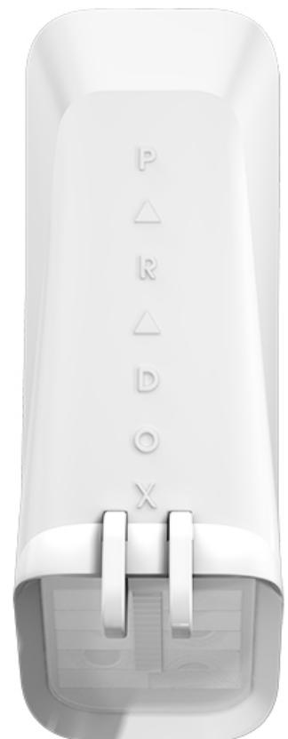

## **Trådbunden**

**NV35M. Traditionell reläutgång. Antimask, husdjursimmun** Artikel nummer 100-152

## **NV35MX. EVO Buss-utgång. Antimask, husdjursimmun** Artikel nummer 100-151

#### **Teknisk information, egenskaper**

Digital dubbeloptisk högkvalitets PIR för utomhusbruk 2 driftlägen: 7.5 x 2 m i husdjursimmunt driftläge och 10 x 2 m i normalt driftläge Bevakningsområde: 1 m vid 10 m, optiskt strålmönsterbredd Husdjursimmun: upp till 70 cm För inom och utomhusbruk Temperaturtolerans: -35 – +60°C Matningsspänning: 12 VDC, 10 V – 15 VDC, 20 mA Sabotage sensor: dubbel, skal och vägg Storlek: 6.1 x 12.3 x 4.3 cm (l x h x b) Vikt: 100 gram Intygad av SBSC i larmklass 3, NV35M: cert nr 16-279 och NV35MX: cert nr 16-278. SSF 1014, utgåva 5. Godkänd: EN50131, grade 2. CE.

# **Optimerad IR antimask ridådetektor som reducerar falsklarmen!**

IR antimask ridådetektor som skyddar fönster, - och dörrpartier. Detektorn ser över en specifik yta vid bestämda fönster, - och dörrpartier då detektorn har ett detekteringsmönster med smala strålar. I husdjursimmunt läge utomhus ignoreras små fåglar, katter och hundar. I skarpt läge (sharp mode) ger det er en förlängd räckvidd och förbättrad detektering.

Husdjursimmunt läge är baserat på dubbel optiskt detekterings systems topologi där båda sensorerna måste känna av rörelse för att en larmsignal ska genereras. Denna unika funktion hindrar husdjur upp till runt 70 cm från att detekteras, vilket ger optimal husdjursimmuniteten. En aktiv IR antimask teknologi ger förbättrad känslighet vilket medför högre pålitlighet och exakthet. Enheten/enheterna känner av objekt placerade nära linsen (upp till 30 cm), inklusive transparant lack, aluminiumfolie, genomskinlig tejp, rörelser nära linsen och störningar från damm och andra partiklar.

NV35-serien fungera i tuffa miljöer såsom kyla, vind och snö.

## **Få bästa räckvidd vid marknivå**

Ridådetektorn har en integrerad krypzon. Den hindrar att inkräktare kryper under detektorn för att nå det skyddade området.

