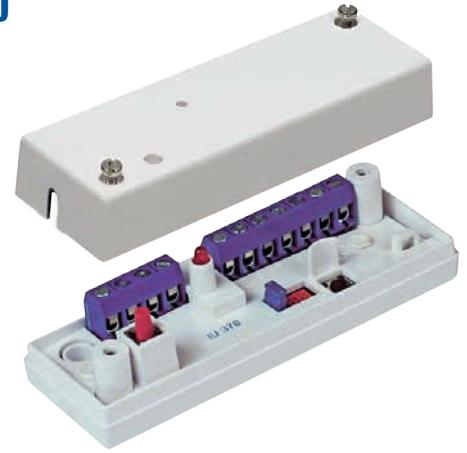

## **IU 370 INTERFACEENHET FÖR GD 330 OCH GD 370**

## **Fördelar**

- Analysator- och reläenhet med reläutgång
- Anpassad för de flesta centralapparater
- Upp till 10 detektorer kan anslutas
- Programmerbart relä för latch eller auto-reset
- 9-30 VDC

IU 370 är en analysator- och reläenhet till GD 330 och GD 370 serien glaskrossdetektorer för anslutning till en centralapparat. Upp till 10 detektorer kan anslutas till en analysatorenhet. IU 370 övervakar resistansförändringar i en balanserad larmslinga och är programmerbar för manuell återställning (Latch) eller auto-reset efter 2 sekunder. Den används främst om man vill ha en lokal indikering och återställning.

Anmärkning: Larm från en detektor aktiverar larmreläet på analysatorenheten.

| Matningsspänning  9 - 15 VDC / 15 – 30 VDC                                                |  |
|-------------------------------------------------------------------------------------------|--|
| Strömförbrukning  10 mA (16 mA vid larm)                                                  |  |
| LarmutgångRelä, NC                                                                        |  |
| Kontaktdata48 VDC / 100 mA                                                                |  |
| Larmindikering  LED                                                                       |  |
| Sabotageskydd Ja                                                                          |  |
| Larmtid 2 sek / kvarhållande                                                              |  |
|                                                                                           |  |
|                                                                                           |  |
| Larmåterställning  Brytning av spänningen / Styringång / Manuellt AnslutningSkruvplint |  |
| Kapsling, Färg  IU 300 ABS plast, Vit                                                     |  |
| Kapsling, Färg  IU 300-M Metall, Grå                                                      |  |
| Arbetstemperatur –40 – +70°C                                                              |  |
| Kapslingsklass IP 41                                                                      |  |
| Mått (L x B x H) mm 91 x 31 x 23                                                          |  |

| Lid  |  |
|------|--|
| Base |  |
|      |  |
|      |  |
|      |  |

## **Beställningsinformation Typ E-nr Beskrivning Paket IU 370 6332542** Analysatorenhet för GD 330 / GD 370, vit plastkapsling 1st **IU 370-M 6332543** Analysatorenhet för GD 330 / GD 370, vit plastkapsling 1st