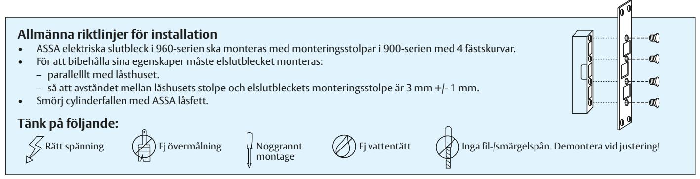
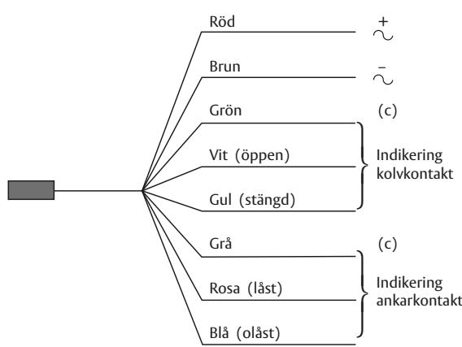
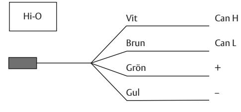
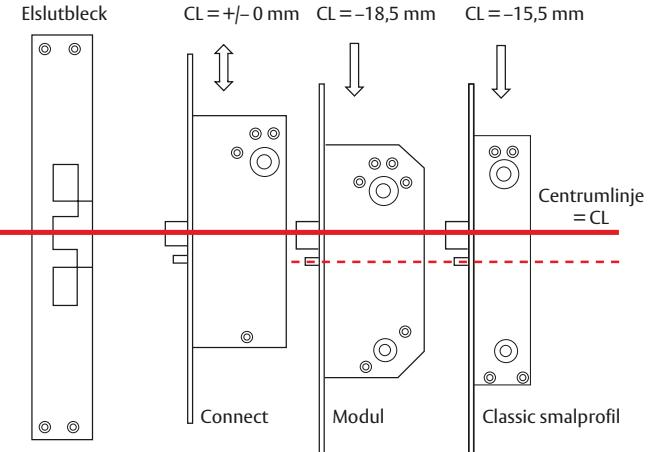
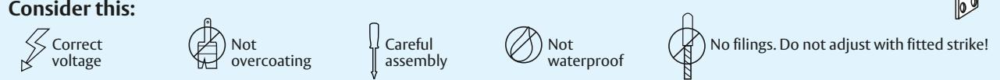
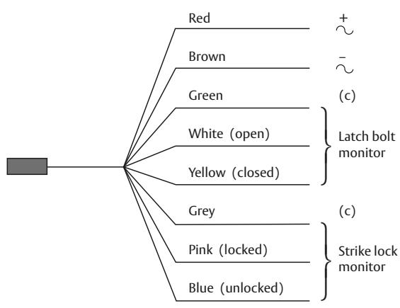
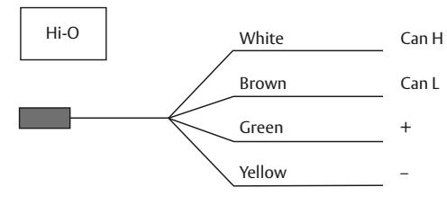
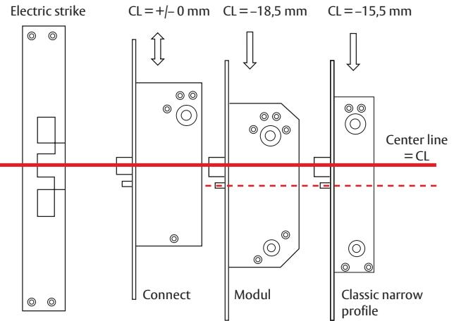

# **Monteringsanvisning ASSA elektriska slutbleck 960-serien**

## **Inkoppling**

- Elektriska slutbleck i 960-serien förutom Hi-O-varianterna spänningsmatas med 12-24V AC/DC +/-10%. Strömförbrukning 24V max 300/min 150mA, 12V max 700/min 350mA.
- Hi-O versionerna spänningsmatas med 12-24V DC, strömförbrukning max 700mA/ min 150mA.
- Samtliga modeller har inbyggd skyddsdiod.

## **Höjdförhållande för olika låstyper**

|  |      | Tekniska data |               |              |                 |                  |      |  |  |
|--|------|---------------|---------------|--------------|-----------------|------------------|------|--|--|
|  | Typ  | Hållkraft     | List tryck | Funk tion | Kolv kontakt | Ankar kontakt | Hi-O |  |  |
|  | 960  | 15000 N       | Ja            | Rättvänd     | Ja              | Ja               | –    |  |  |
|  | 961  | 15000 N       | Ja            | Omvänd       | Ja              | Ja               | –    |  |  |
|  | 960C | 15000 N       | Ja            | Rättvänd     | Ja              | Ja               | Ja   |  |  |
|  | 961C | 15000 N       | Ja            | Omvänd       | Ja              | Ja               | Ja   |  |  |

# **Brandskydd**

Modell 960 samt 960C är godkända för brandigenhållning i högst klass E/El 60 tillsammans med cylinderfallås utan uppställningsfunktion (Connect 232 alt. modul 6585). Samtliga modeller 960/961/960C/961C kan användas för brandigenhållning tillsammans med dubbelfallås (med tryckesfunktion) samt därtill passande monteringsstolpe (t.ex. 930).

# **Fitting instruction ASSA electric strikes 960-series**

# **Fitting guidelines**

- ASSA electric strikes in the 960-series should be fitted with faceplates in the 900-series with four screws. • To retain the characteristics of the strike, the strike should be;
- aligned with the faceplate of the lock case.
- fitted with a 3 mm +/- 1 mm gap between the face of the strike and the faceplate of the lock case.
- Lubricate the cylinder latch with ASSA lock grease.

#### **Wiring**

- All electric strikes in 960-series, not Hi-O, can be supplied with 12-24V AC/DC +/-10%. Power consumption 24V max 300/min 150mA, 12V max 700/min 350mA.
- Hi-O versions shall be supplied with 12-24V DC, current max 700mA/ min 150mA.
- Protected diode is not required.

## **Height ratios for various lock**

|  | Type | Technical data |             |                  |                          |                           |      |  |  |  |
|--|------|----------------|-------------|------------------|--------------------------|---------------------------|------|--|--|--|
|  |      | Holding        | Pre load | Function         | Latch bolt monitoring | Strike lock monitoring | Hi-O |  |  |  |
|  | 960  | 15000 N        | Yes         | Fail locked      | Yes                      | Yes                       | –    |  |  |  |
|  | 961  | 15000 N        | Yes         | Fail unlocked | Yes                      | Yes                       | –    |  |  |  |
|  | 960C | 15000 N        | Yes         | Fail locked      | Yes                      | Yes                       | Yes  |  |  |  |
|  | 961C | 15000 N        | Yes         | Fail unlocked | Yes                      | Yes                       | Yes  |  |  |  |

#### **Fire protection**

Model 960 and 960C are certified according to Swedish regulation for use in fire protective doors up to grade E/El 60 together with lock case (e.g. Connect 232, modular 6585). All models 960/961/960C/961C can be used in fire protective doors together with double latch locks (locks with handle latch) together with designated faceplate (e.g. 930).