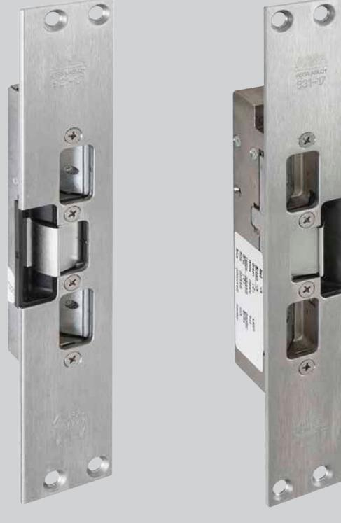
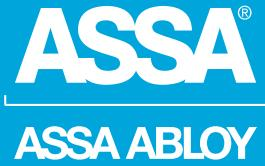
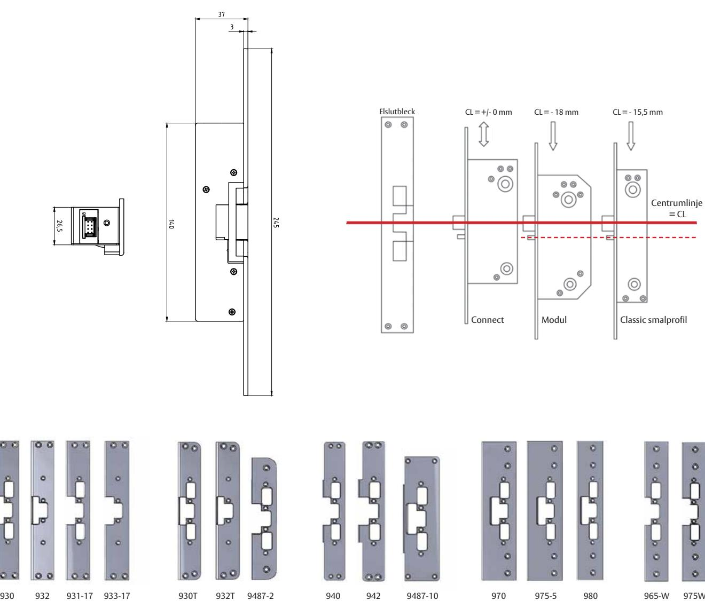
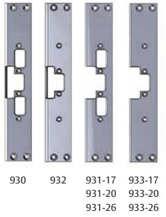

## ASSA Elslutbleck 960-serien

ASSA ABLOY, the global leader in door opening solutions

### Extrakraftiga elslutbleck 960, 961, 960C, 961C

#### **Användningsområde**

ASSA Elslutbleck i 900-serien passar till dörrar med högt ställda krav på listtryck samt normalt ställda krav på säkerhet. Passar bra som daglåsning i skalskydd och intern låsning inom handel, kontor och industri eller i entréer och allmänna utrymmen i flerfamiljshus.

#### **Funktion**

ASSA Elslutbleck i 960-serien finns i två huvudtyper Rättvänd funktion 960, 960C

- Låst vid spänningsbortfall
- 960C för Hi-O™ Can bus

Omvänd funktion 961, 961C

- Olåst vid spänningsbortfall
- 961C för Hi-O™ Can bus

#### **Egenskaper**

Konstruerade för användning i dörrar i kombination med förreglade enkel- eller dubbelfallås. Passar alla monteringsstolpar i 900-serien.

#### **Rättvänd funktion Brandklassade**

- Brythållfasthet 15KN
- Hög skak- och slagsäkerhet
- Elbleckshus av stål
- Vridfall av stål
- Öppnar även vid höga listtryck
- Låskolvskontakt
- Ankarkontakt
- Brandklass upp till E/EI 60

#### **Omvänd funktion**

- Brythållfasthet 15KN
- Hög skak- och slagsäkerhet
- Elbleckshus av stål
- Vridfall av stål
- Öppnar även vid höga listtryck
- Låskolvskontakt
- Ankarkontakt

# ASSA Elslutbleck 960-serien

Extrakraftiga elslutbleck 960, 961, 960C, 961C

ASSA ABLOY, the global leader in door opening solutions

ASSA ABLOY is the global leader in door opening solutions, dedicated to satisfying end-user needs for security, safety and convenience

ASSA AB P.O. Box 371 SE-631 05 Eskilstuna Sweden Phone +46 (0)16 17 70 00

www.assa.se

Fax +46 (0)16 17 70 49 Customer support: phone intl. +46 (0)16 17 71 00 Phone nat. 0771-640 640 Fax +46 (0)16 17 73 72 e-mail: helpdesk.marknad@assaabloy.com

#### **Tekniska data**

ASSA Elslutbleck i 960-serien har

- Inbyggt transientskydd
- Spänningsmatning 12-24VAC/DC -10% +15%
- Spänningsmatning (960C, 961C) 12-24V DC -10% + 15%

9487-3 9487-4

- Startström vid 24V 240mA drift 145mA
- Startström vid 12V 620mA drift 310mA

#### **Tillbehör**

Till ASSA Elslutbleck i 960-serien finns ett flertal monteringsstopar avsedda för olika dörrmiljöer i stål/trä och aluminium.

Ovanstående monteringsstolpar visar endast ett urval ur sortimentet.