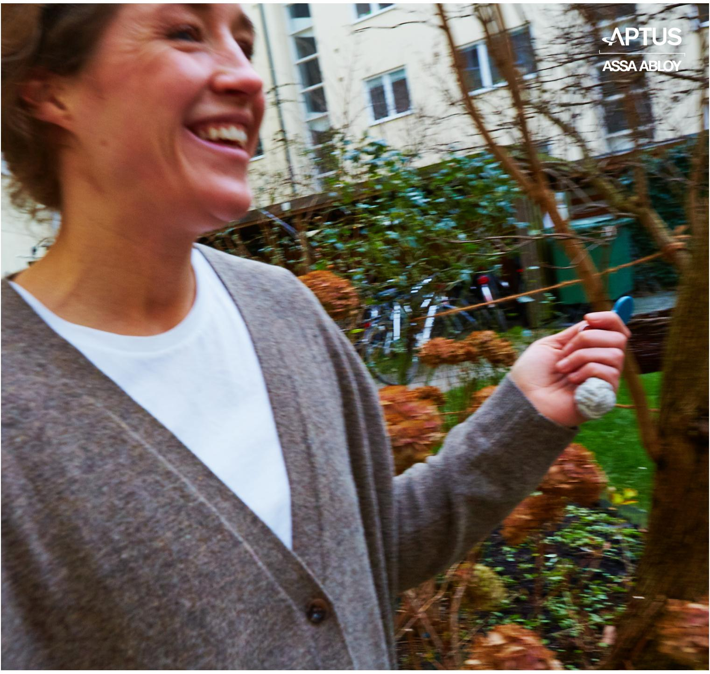
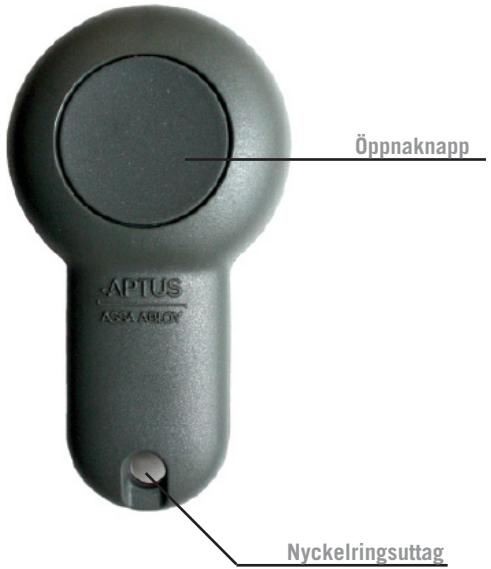
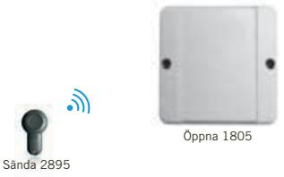
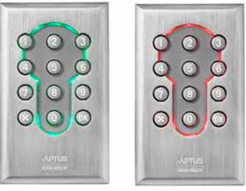
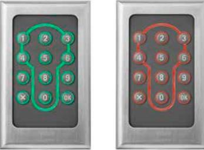
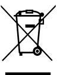

Aptus Elektronik AB • Ekonomivägen 3-5, 463 33 Askim • www.aptus.se telefon **växel:** 031 68 97 00 • **fax:** +46 31 68 97 99 **support:** support@aptus.se

# **Sända 2895**

**Revision 1**

## **2 Sända 2895**

Denna användarmanual beskriver hur radionyckeln Sända 2895 skall användas och handhas.

- 1. Lås upp via en Aptus radioläsare.
- 2. Lås upp via en vanlig Aptusläsare.
- 3. Lås upp via en Aptus mifareläsare.
- 4. Tekniska uppgifter.

### **Om Sända 2895**

Sända 2895 kan användas för alla typer av beröringsfria läsare som finns i Aptus sortiment1 , d.v.s. läsare med lästeknik enligt EM, Mifare respektive Radio. Du kan enkelt fästa nyckeln på din nyckelknippa.

#### . **Lås upp dörren via en Aptus radioläsare**

Tryck på nyckelns öppnaknapp. Om du befinner dig inom radioläsarens täckningsområde, och är behörig, kommer passersystemet att låsa upp.

## **3 Sända 2895**

## **Lås upp dörren via en vanlig Aptusläsare**

#### **Säkerhetsnivå: Kort eller Kort & PIN-kod**

Håll upp Sända 2895 framför läsarens nyckelhålssymbol:

 Grönt: Tillträde accepterat, öppna dörren. Grönblink: Slå din Pinkod avsluta med *. Rödblink: Tillträde nekas.

## **Lås upp dörren via en Aptus mifareläsare**

#### **Säkerhetsnivå: Kort eller Kort & PIN-kod**

Håll upp Sända 2895 framför läsarens nyckelhålssymbol:

 Grönt: Tillträde accepterat, öppna dörren. Grönblink: Slå din Pinkod avsluta med *. Rödblink: Tillträde nekas.

### **Tekniska uppgifter**

#### **Läsavstånd**

Det maximala avståndet från Sända 2895 till dörr som skall låsas upp är 40 meter. Avståndet blir i praktiken kortare beroende på var läsaren placerats.

#### **Batterilivslängd**

Vid normal användning behöver batterierna bytas tidigast efter 2 år.

#### **Batterityp**

Sända 2895 är försedd med 1 st. Litium knappcellsbatteri avtypen CR2032 3V. **Batteribyte**

Om du inte längre kan låsa upp dörren eller måste vara närmare dörren för att låsa upp så är det antagligen dags att byta batterier.

Skruva bort stjärnskruvarna på baksidan. Lyft av bakstycket. Ta ur kretskortet och vänd på detta. Tryck försiktigt ut batteriet ur batterihållaren och tryck i det nya.

Montera sedan ihop enheten igen.

#### **Återvinning av batteri**

Då produkten är märkt med en överkorsad soptunna kan batterierna ej läggas i hushållssoporna. De skall istället sorteras ut och lämnas till något av de insamlingssystem som finns, t.ex. elkretsen.

Genom att lämna in batterierna bidrar du till återvinning.

#### **Hantering och skötsel**

Sända 2895 skall tåla ungefär samma hantering som övriga nycklar på din nyckelknippa. Undvik dock att utsätta nyckeln för mekanisk åverkan eller nedsänkning i vatten. Den tål t.ex. att bli tappad i golvet och även en regnskur.