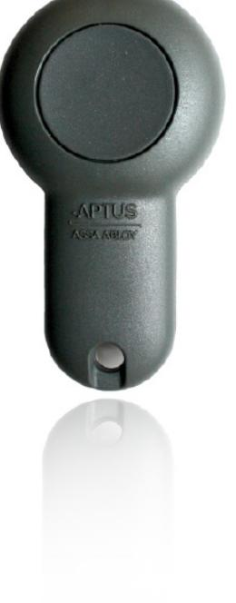

| SPECIFIKATIONER  | Sända 2895                                   |
|------------------|----------------------------------------------|
| Läsavstånd       | Upp till 40 m beroende på läsarens placering |
| Mått (hxbxd)     | 71,5x40x15                                   |
| Strömförsörjning | Inbyggt litiumbatteri                        |
| Nettovikt i kg   | 0,018                                        |
|                  |                                              |

## **Sända 2895 Radionyckel**

**EGENSKAPER OCH FÖRDELAR**

- Unik niosiffrig kod.
- Radio, EM och Mifare i samma nyckel.
- Stryktåligt utförande som passar på din nyckelknippa.
- Används ihop med beröringsfria läsare i Aptussortimentet, t.ex. radioläsare Öppna 1805, EM-läsare Öppna 1500 eller mifareläsare Öppna 2500.
- Programmering i Hantera eller Multiaccess via bordsläsare Registrera 2905.
- Samma identifiering, kortnummer, oavsett om nyckeln läses i en EM-läsare, en mifareläsare eller en radioläsare.

| TEKNISKA DATA         | Sända 2895                        |
|-----------------------|-----------------------------------|
| Strömförsörjning V DC | 3, levereras av inbyggt batteri   |
| Förbrukning Watt      | max 0,027                         |
| Amp                   | max 0,009                         |
| Batterilivslängd År   | min 2                             |
| OMGIVNING             |                                   |
| Temperatur OC         | -30 till +60                      |
| Luftfuktighet %       | 10 till 100                       |
|                       |                                   |
| KORTDATA              |                                   |
| EM                    | 4102 & 4200                       |
|                       | 125 kHz                           |
| Mifare                | Classic 1K                        |
|                       | 4 bytes UID                       |
|                       | 13,56 MHz                         |
|                       | Sektor 1 innehåller samma kortnum |
|                       | mer som EM                        |
| Radio                 | 433,92 MHz                        |
|                       | Samma kortnummer som på EM        |
|                       | Räckvidd: Upp till 40 meter       |
|                       |                                   |
| MÅTT I MM             |                                   |
| Höjd                  | 71,5                              |
| Bredd                 | 40                                |
| Djup                  | 15                                |
| Nettovikt i kg        | 0,018                             |

**TILLBEHÖR**

2014-10-113 Vi reserverrar oss för tryckfel och eventuella ändringar.

## **www.aptus.se**

Aptus Elektronik AB . Ekonomivägen 3-5, 436 33 Askim . telefon **växel:** 031 68 97 00 **försäljning:** 031 68 97 10 **fax:** 031 68 97 99 aptus@aptus.se . www.aptus.se