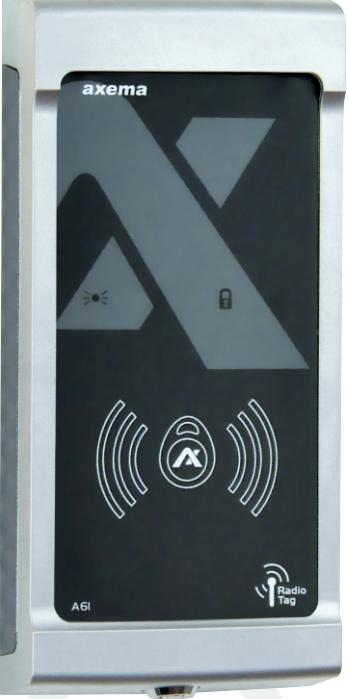

## **A61 KOMBILÄSARE (EM, MIFARE & RADIO)**

## **TEKNISK DATA**

- Robust låsbar metallkapsling
- Läser:
- EM4200/4102 •
- MIFARE (enbart serienummer)
- MIFARE DESFire
- Axemas radionycklar (868 Mhz)
- Integrerad högtalare
- Grön diod = lås olåst

**Art. Nr: 2-1610 E-nummer: E5870552** 

- Röd diod för larmindikering
- Temperatur: -30° till + 55°C
- Spänning: från dörrcentral eller 10 – 30 VDC
- Strömförbrukning:
- 45 mA-60 mA i vila
- Mått: 184x87x27 (HxBxD)

## **FUNKTIONALITET OCH ANVÄNDNINGSOMRÅDEN**

- A61 har tre olika lästekniker. Dessa kan väljas var för sig alternativt tillsammans, detta gör att läsaren blir väldigt flexibel då den kan läsa **EM, MIFARE** samt **Axemas Radionycklar** (RN-18)
- Läsavståndet är ca 7 cm med PR-4A bricka (EM), ca 3 cm för MIFARE bricka och ca 100 m med radionycklar.
- A61 är byggd i en robust och motståndskraftig metallkapsling avsedd för utomhusbruk.
- Den inbyggda högtalaren ger ljudindikeringar vid varningar, larm samt talmeddelanden.
- A61 ansluts mot dörrcentralerna **B27 och B17** som en RFID/Radio- läsare i VAKA passersystem. Programmering av A61:an görs via webbgränssnitt i valfri dator.

Byängsgränd 22 120 40 Årsta Tel: 08-722 34 40

www.axema.se order@axema.se