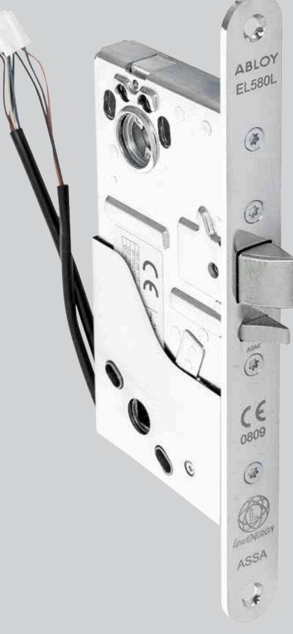
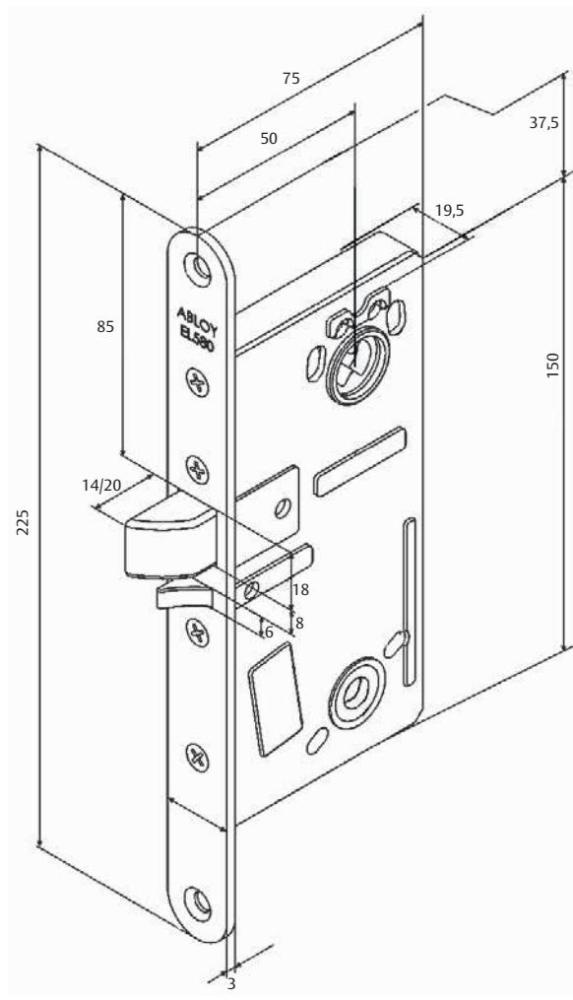

## ABLOY Eltryckeslås EL580L

ASSA ABLOY, the global leader in door opening solutions

### Elektromekanisk låsning

### **Användningsområde**

ABLOY multifunktionella eltryckeslås EL580L är anpassade för högfrekventa dörrar med ASSA modulurtag. Passar bra som daglåsning och intern låsning inom handel, kontor och industri eller i entréer och allmänna utrymmen i flerfamiljshus. ABLOY EL580L kan användas i brandcellsgräns.

#### **Funktion**

ABLOY multifunktionella eltryckeslås EL580L med split funktion

- Utsidans trycke elektriskt manövrerat
- Insidans trycke öppnar alltid låset mekaniskt

#### **Egenskaper**

- Lågenergi lås
- Förreglad tryckesfall
- Låset kan alltid manövreras med cylinder/vred
- Multifunktionell
	- 3,6VDC (-0%)-24VDC (+15%) Stab
	- Rättvänd funktion
	- Enkelt omställbar elektriskt/mekanisk manövrerad sida
	- Variabelt fallutsprång 20 mm eller 14 mm
- 2 mikrobrytare
- Förregling (dörrläge)
- Tryckesrörelse
- 50 mm dorndjup
- Alla kablar försedda med kontakter för enkel installation med anslutningskabel EA220
- Fullständigt anpassat för ASSA urtagsstandard

# ABLOY Eltryckeslås EL580L

ASSA ABLOY, the global leader in door opening solutions

## Elektromekanisk låsning

- Skandinaviska ovala eller runda cylindrar
- Trycken med returfjäder
- Abloy tryckespinnar för split funktions lås*
- Slutbleck Abloy LP712, ASSA 1887 eller likvärdigt
- Anslutningskabel EA 220, 10 m*
- Kabelöverföring EA280/281*
- Osymmetrisk stolpe

*Ingår i satsförpackning EL580L

#### **Tekniska data**

**3,6VDC (-0%) -24VDC (+15%)**

**- O**

- Strömförbrukning Max. 350mA RMS/100ms (vid motordrift), Vila 0,08mA
- Enpoligt växlande Max. 30VDC, 400mA

| Lås          | Förreglat fall | Split funktion |
|--------------|----------------|----------------|
| ABLOY EL580L | X              | X              |

e-mail: helpdesk.marknad@assaabloy.com

Phone +46 (0)16 17 70 00 Fax +46 (0)16 17 70 49 Customer support: phone intl. +46 (0)16 17 71 00 Phone nat. 0771-640 640 Fax +46 (0)16 17 73 72

ASSA ABLOY is the global leader in door opening solutions, dedicated to satisfying end-user needs for security, safety and convenience

ASSA AB P.O. Box 371 SE-631 05 Eskilstuna

Sweden

**röd svart gul blå grön vit**