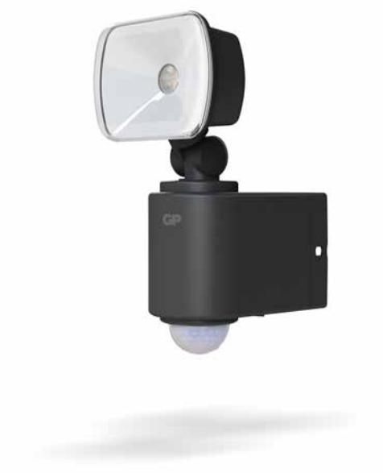
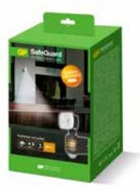

## GP Safeguard RF3.1, trådlös utomhusbelysning, LED

GP Safeguard är en batteridriven säkerhetslampa som du enkelt monterar själv, utan att behöva ta hjälp av en elektriker. Den uppgraderade versionen av GP Safeguard har en attraktiv design med förbättrad drifttid på färre antal batterier och förenklad funktion för byte av batterier. 

- 130 lumen
- Drivs av 3 C-batterier
- Driftstid 600 dagar (om lampan tänds 5 ggr/dag, eller totalt ca 6 h i ON-läge)
- Enkel installation på mindre än 5 minuter
- Vattentät, IP55

#### **ARTICLE INFORMATION:** Art.no: 473066 EAN: 4895149079187 E-nummer: 7702951

**Page 1/2**

# GP Safeguard RF3.1, trådlös utomhusbelysning, LED

### **Technical specifikation**

| Ljusflöde (Lumen)  | 130        |  |  |
|--------------------|------------|--|--|
| Strömkälla         | 3 X C      |  |  |
| Batteri medföljer  | 3 X C      |  |  |
| Färg               | anthracite |  |  |
| Tillverkningsland  | Kina       |  |  |
| Statistiskt nummer | 9405500090 |  |  |
| E-nummer           | 7702951    |  |  |
| EL-nr              | 3200543    |  |  |
| Nobb number        | 51557781   |  |  |
|                    |            |  |  |

### **Packaging information**

|                 | 1-P           | EXKRT         | ST      |
|-----------------|---------------|---------------|---------|
| EAN kod         | 4895149079187 | 4895149079323 |         |
| Längd (mm)      | 85.000        | 535.000       | 0.000   |
| Höjd (mm)       | 245.000       | 230.000       | 0.000   |
| Bredd (mm)      | 140.000       | 292.000       | 0.000   |
| Bruttovikt (kg) | 0.90000       | 10.52000      | 0.87600 |
| Net Weight (kg) | 0.63000       | 9.92000       | 0.63000 |
| Gross Volume    | 0.00000       | 0.03593       | 0.00290 |
| Net Volume      | 0.00000       | 0.00000       | 0.00000 |
| Antal ST        | 1             | 12            | 1       |

**Page 2/2**