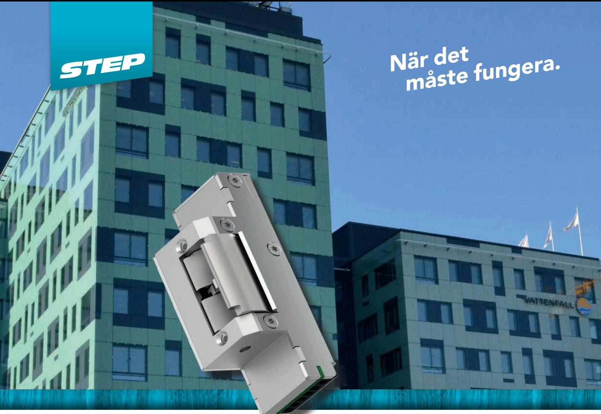
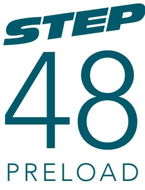
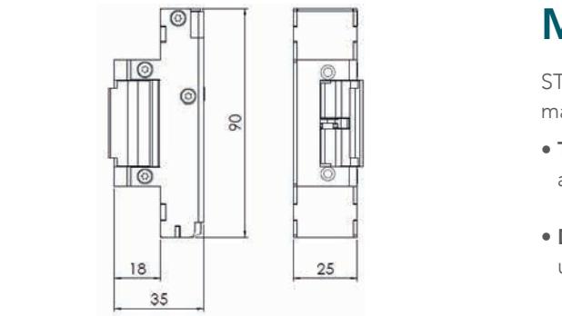
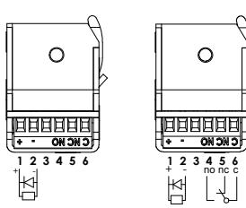
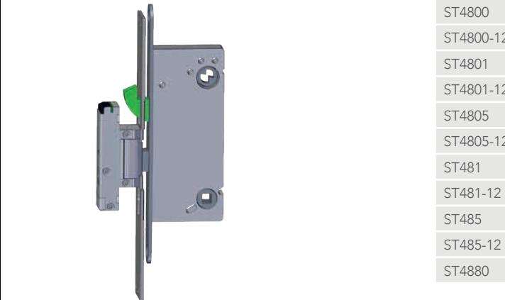

# Elslutbleck med fast urtag för utlåsning av hakregel

STEP 48 Preload har ett fast urtag där ett dörrlås med hakregel eller rak regel kan låsa ut, och på så sätt spärra dörrens passersystem/ kodlås eller dörrautomatik.

### Extra tillåsning med regellås

STEP 48 Preload har möjlighet att låta dörrlåsets hakregel eller raka regel gå in i elslutbleckets fasta urtag. Detta är önskvärt i utrymmen som ska låsas till med vred eller nyckel för att spärra dörren.

### Driftsäkerhet och enkel installation med minimala mått

Kombinationen av STEPs unika listtrycksteknik och små inbyggnadsmått ger elslutblecket en hög driftsäkerhet och enkel installation i så gott som alla dörrmiljöer.

### Stort utval av montagestolpar och regelindikering som tillbehör

STEP 48 Preload delar stolpsortiment med STEP 40/90/98 Preload och STEP 90 Release. Det finns även möjlighet att installera en regelidikering som kan användas för att automatisk blockera dörrens passersystem/kodlås eller dörrautomatik.

Måttskiss STEP 48 Preload. F

4 3 2 1

Kopplingsschema utan och med kolvkontakt.

This document shall not be copied without owners written allowance and its content shall not be expo

sed for third part nor be used for unauthorized purpose.

C

C

B

sed for third part nor be used for unauthorized purpose.

B

A

Owner

This document shall not be copied without owners written allowance and its content shall not be expo

Stendals El AB

A

Owner

F

E

F

D

E

D

Här har en hakregel låsts ut i elslutbleckets fasta urtag och på så sätt spärrat dörrens passersystem/kodlås eller dörrautomatik.

Surface finish

En separat regelindikering kan monteras på STEP 48 Preload.

## Med STEPs unika listtrycksteknik

STEP 48 Preload är utrustad med STEPs patenterade listtrycksteknik som ger många fördelar: F

- Tätningslister och tryckskillnader listtrycksfunktionen gör att dörren alltid kan låsas upp, trots att dörrlåset spänner mot elslutblecket.
- Dörrautomatik listtrycksfunktionen i kombination med en snabb upplåsning gör att dörren öppnas snabbt och utan risk för att fastna. E
- Utrymningsdörr listtrycksfunktionen säkerställer att brandlarmet kan frilägga låsningen, trots tryck mot dörren av folkmassa, tätningslister, tryckskillnader eller sneda dörrar.

#### Tekniska data D

C

| Strömförbrukning i rättvänd och omvänd funktion |                       |  |
|-------------------------------------------------|-----------------------|--|
| 24 V DC + 15 % - 10 %                           | 12 V DC + 15 % - 10 % |  |
| 110 mAh / max 300 mA                            | 220 mAh / max 600 mA  |  |
|                                                 |                       |  |

| Strömförbrukning 0 mA för vridfall i vila (rättvänd = låst, omvänd = olåst) |  |
|-----------------------------------------------------------------------------|--|
|-----------------------------------------------------------------------------|--|

| B A                            | Artikelnummer                 | Benämning                                          |
|-----------------------------------|-------------------------------|----------------------------------------------------|
|                                   | ST480                         | Rättvänd funktion 24 V DC.                         |
|                                   | ST480-12                      | Rättvänd funktion 12 V DC.                         |
|                                   | ST4800                        | Rättvänd funktion 24 V DC inklusive kolvkontakt.   |
|                                   | ST4800-12                     | Rättvänd funktion 12 V DC inklusive kolvkontakt.   |
|                                   | B ST4801                   | Omvänd funktion 24 V DC inklusive kolvkontakt.     |
|                                   | ST4801-12                     | Omvänd funktion 12 V DC inklusive kolvkontakt.     |
|                                   | ST4805                        | Omställbar funktion 24 V DC inklusive kolvkontakt. |
|                                   | ST4805-12                     | Omställbar funktion 12 V DC inklusive kolvkontakt. |
|                                   | ST481                         | Omvänd funktion 24 V DC.                           |
| Surface finish SS-ISO2768-1m   | ST481-12 A                 | Omvänd funktion 12 V DC.                           |
|                                   | ST485                         | Omställbar funktion 24 V DC.                       |
| STEP 48 omställbar med indikering | ST485-12 Revision Sheet | Omställbar funktion 12 V DC.                       |
| ST4805                            | 0 ST4880                   | Regelindikering för STEP 48/98 Preload.            |
|                                   |                               |                                                    |

- Durability: Grade X enligt SS-EN 14846.
- Corrosion: Grade M enligt SS-EN 14846.
- Security: Grade 3 enligt SS-EN 14846.
- Security electrical manipulation: Grade 1 enligt SS-EN 14846.
- Mikrobrytare enpoligt växlande, max. 30 V DC, 1A.
- Skyddsdiod finns inbyggd.
- Indikering för avkänning att dörren är stängd/öppen (gäller produkter med kolvkontakt).
- Brythållfasthet 9 kN (≈ 900 kg).
- Garanterar öppning trots listtryck upp till 0,4 kN (≈ 40 kg) i rättvänd och omvänd funktion.
- Knacksäkrad.
- Vändbar för att passa höger- och vänsterhängda dörrar.
- Klarar utlåsning av hakregel eller rak regel.

### Passande låshus

- Fallhakregellås, enkel- och dubbelfallås i Kaba 1400-serien
- Fallhakregellås, enkel- och dubbelfallås i Connect-serien
- Fallregellås, enkel- och dubbelfallås i Modul-serien
- Enkel- och dubbelfallås i Smalprofil-serien

