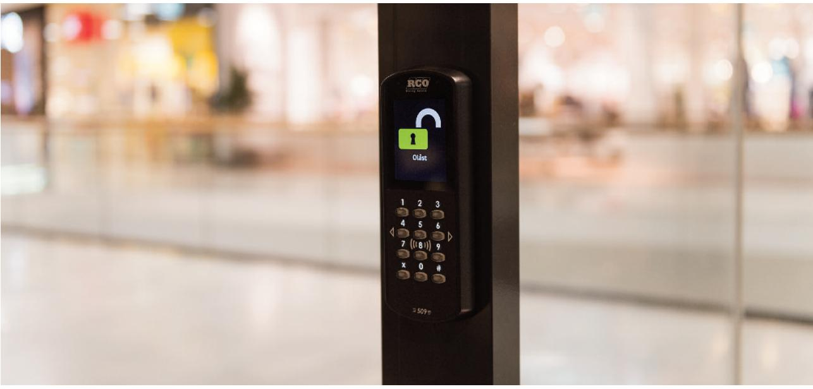
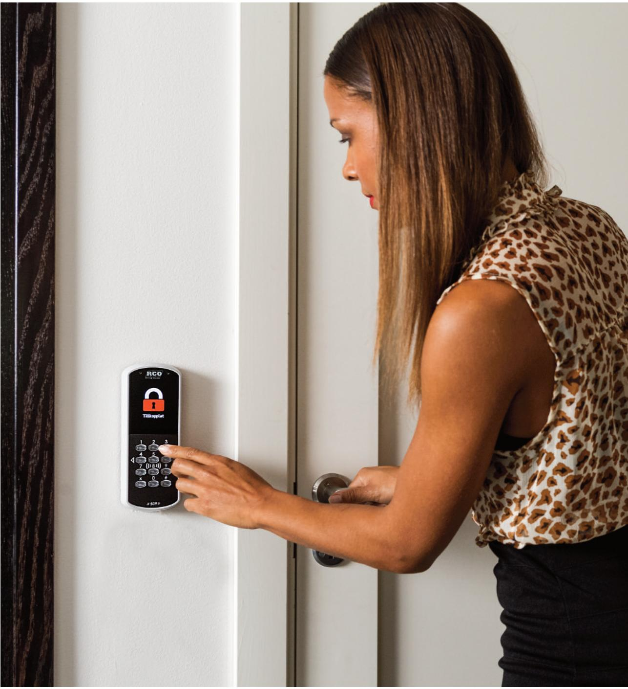
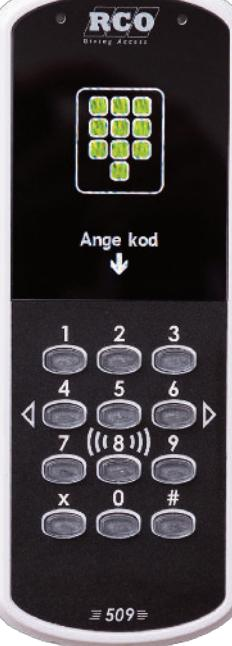

### En läsarrevolution = 509 MIF-509 - MIF/PROX-509

ELEKTRONISKA LÅS FÖR HEM OCH FÖRETAG

# **En dörrpassage har aldrig varit enklare**

**Vår nya 509-läsare sätter en helt ny standard när det gäller enkelhet och intuitivitet. Den har en stor färgdisplay som med hjälp av både bild och text förenklar vardagen för användaren – allt paketerat i en mycket elegant och modern design.**

Den beröringsfria 509-läsaren är fullt integrerad i R-CARD 5000-systemet och passar lika bra ute som inne. Läsaren erbjuder en belyst knappsats och en stor färgdisplay på 2,8 tum för visning av grafiska symboler och text. I displayen visas de vanligaste passeruppmaningarna med stora tydliga ikoner, exempelvis "Visa kort" eller "Ange kod". På samma sätt får användaren snabb återkoppling på dörrens status, till exempel om den är olåst eller om larmet är tillkopplat. Läsarens standardbild kan dessutom ersättas med egen logotype och valfri informations- eller välkomsttext.

Läsaren har även ett inbyggt behörighetsstyrt menysystem för de dörrstyrningar som utförs mer sällan. Användaren kan bland annat enkelt byta pin-kod direkt i läsaren, till- och frånkoppla larmområden eller "köpa tid" – allt med en unikt tydlig hantering tack vare den stora skärmen och menysystemet.

Unikt för vår 509-läsare är dessutom att det i menyerna erbjuds en "snabbhjälp" direkt i displayen. Om användaren är osäker på vad exempelvis ett menyval innebär eller vad en manöver ger för resultat så ger ett tryck på 1 en förklarande och lättförståelig text. Det innebär att den osäkerhet som historiskt kunnat uppstå för användaren vid exempelvis larmmanövrar nu är borta. Tack vare mjukvarans uppbyggnad så behöver man heller aldrig knappa in långa kodkombinationer eller tolka olika ljud- och ljussignaler – allt detta tillhör i och med vår 509-läsare det förgångna.

Men det är inte bara användningen av vår läsare som är en revolution. Den är även utvecklad för att göra livet enkelt för installatören. Installationen kan förberedas genom att kabel för kommunikation och strömförsörjning ansluts till den monterade bottenplattan innan läsardelen sätts på plats. Detta gör att den elektriska installationen kan göras klar i god tid innan driftsättning och utan att man riskerar att skada läsarna under byggprocessen. När det är dags för driftsättning hakas läsaren enkelt upp på bottenplattan och skruvas fast.

För att ytterligare förenkla installationen är bottenplattan även förberedd för att kunna monteras på en infälld apparatdosa. Önskar man detta alternativ kompletteras bottenplattan med ett extra doslock.

509-läsarna finns i svart eller grått utförande och erbjuds antingen med lästekniken Mifare Classic eller som en kombination med både Mifare Classic och Prox.

### **TEKNISK DATA MIF-509 - MIF/PROX-509**

## **LÄSARE**

| Utförande:                                | Slagtålig PC/ABS-plast och härdat glas. Svart eller grå                                                                  |
|-------------------------------------------|-----------------------------------------------------------------------------------------------------------------------------|
| Display:                                  | 2,8-tumsdisplay i färg med QVGA-upplösning                                                                               |
| Systemkrav:                               | M5-version 5.40.2 eller senare UC-50-version 2.90 eller senare                                                           |
| Anslutningar:                             | Terminalbuss via TB-485 eller lokalbuss RS-485                                                                           |
| Kommunikation:                            | Lokalbuss RS-485                                                                                                            |
| Matningsspänning:                         | 12–30 V DC SELV                                                                                                             |
| Strömförbrukning:                         | Max 65 mA @ 24 V DC                                                                                                         |
| Vikt:                                     | 0,2 kilo                                                                                                                    |
| Temperaturområde:                         | -30 till +60 grader C                                                                                                       |
| Mått (mm, BxHxD):                         | 71,3x186,4x21,4 millimeter                                                                                                  |
| Lästekniker: MIF-509: MIF/PROX-509: | Mifare Classic Mifare Classic och EM4102/4200 Båda förberedda för Desfire                                             |
| Sändarfrekvens: Mifare: Prox:       | 13,56 MHz 125 KHz                                                                                                        |
| Läsavstånd:                               | Cirka 3 centimeter beroende på transponder                                                                               |
| Inläsning som stöds:                      | Serienummer med 4-byte-UID (förberedd för 7-byte-UID). Sektorläsning MAD1, MAD2. Max 16 byte. ISO/IEC 14443 Type A |

#### **FUNKTIONER**

| • Kapslingsklassning IP-43                                            |
|-----------------------------------------------------------------------|
| • Kan användas som initieringsläsare för NoKey offline                |
| • Två samtidiga lästekniker i MIF/PROX-509 (gäller ej vid initiering) |
| • Enkelt handhavande med hjälp av bild och text                       |
| • Snabbmeny för hjälp direkt i läsaren                                |
| • Enkel och snabb installation                                        |
|                                                                       |
|                                                                       |

#### **TILLBEHÖR**

| • Doslock – extra bottenplatta vid montering på apparatdosa             |
|-------------------------------------------------------------------------|
| • Montagedistans – för kabelgenomföring vid utanpåliggande montage      |
| • Vinkelfäste – vid installationer som ska uppfylla tillgänglighetskrav |
| • TB-485 – anslutningskort för inkoppling till terminalbuss på DB/DIO   |

