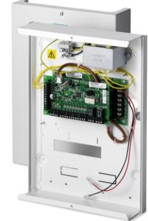
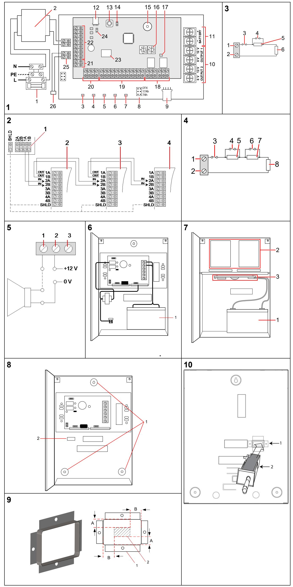
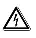
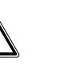
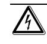

**SPCP332**

**SPCP333**

**Smart PSU (Power Supply Unit) with 8-In/2-Out -Expander (en) Fuente de alimentación (PSU) con módulo de expansión (es) PSU (voedingseenheid) met uitbreiding (nl) PSU (alimentatore) con espansione (it) Nätenhet (PSU) med expansionsenhet (sv) PSU (strom versorgungseinheit) mit erweiterungsmodul (de) Module d'alimentation électrique avec transpondeur (fr)**

STEP: A6V10216041, Edition: 08.02.2013

# English – Installation Instructions

**WARNING** - Before starting to install and work with this device, please read the Safety Instructions.

When changing or installing the SPCP332/333 on the SPC system, always ensure that the mains supply and the battery are disconnected. Ensure that all anti-static precautions are adhered to when handling connectors, wires, terminals and PCBs.

### **EC Declaration of Conformity**

Siemens Security Products hereby declares that this product is in compliance with the essential requirements and other relevant provisions of Directive 2004/108/EC on Electromagnetic Compatibility (EMC).

The EC Declaration of Conformity is available from your Siemens sales office or:

Siemens AB, Security Products Englundavägen 7 SE-171 24 Solna Sweden

### **Introduction to the SPCP332/333**

The SPCP332/333 is a Power Supply Unit (PSU) combined with an 8 Input / 2 Output Expander which can be placed anywhere on the SPC X-BUS. The expander monitors the PSU for over-current, failures with the fuse, mains/AC, communications and also battery problems. The expander receives power and data directly from the PSU via a connector cable and interfaces with the SPC controller via the SPC X-BUS.

Fig. 1 shows the expander (highlighted in grey) mounted on the PSU.

#### **See Fig. 1: SPCP330 (Expander mounted on PSU)**

- 1. Mains Input Block
- 2. Input Transformer
- 3. Mains Power LED (see *Appendix A: LED Status*)
- 4. Battery Charge State LED (see *Appendix A: LED Status*)
- 5. Fuse Fail LED (see *Appendix A: LED Status*)
- 6. Current Limit LED (see *Appendix A: LED Status*)
- 7. Status LED (see *Appendix A: LED Status*)
- 8. Battery Selector (see *Appendix B: Link Position*): If the battery type selected does not match the battery, it will cause the battery to charge either too slowly and not reach the 80 % capacity in the required time, or too quickly, reducing the life of the battery. The PSU shows a fault if the jumper is not fitted.
- 9. PSU 4-pin Interface: Connects to item 12, Power and Data Connector, with a straight through cable.
- 10. PSU Outputs (output 1, output 2): Each output is fused separately with electronic 1.25 A fuses.

**WARNING:** The total load current drawn from outputs 1 and 2 combined should not exceed 1.5 A (750 mA per output). This is to ensure that enough power is available to charge the battery to 80% of its normal capacity within 24 hours. If more power is required on the system, consider connecting an additional or higher rated PSU.

- 11. Battery connectors (BAT+, BAT-): 2 A fuses
- 12. PSU 4-pin Interface: Connects to item 9, Power and Data Connector, with a straight through cable.
- 13. Front tamper switch: The expander has a front tamper switch with spring. When the lid is closed, the spring closes the switch.
- 14. Tamper by-pass [J1]: The jumper setting determines the operation of the tamper. The tamper operation can be overridden by fitting J1. The engineer must ensure that J1 is removed before leaving site for the system to comply with standards.
- 15. Buzzer: The buzzer is activated in order to locate the expander (see *SPC Configuration Manual*).
- 16. Manual addressing switches: The switches allow manual setting of the ID of each expander in the system.
- 17. X-BUS status LED: The LED indicates the status of the X-BUS when the system is in FULL ENGINEER mode as follows:

| LED status                                            | Description                                                                         |
|-------------------------------------------------------|-------------------------------------------------------------------------------------|
| Flashes regularly (once every 1.5 seconds approx.) | The X-BUS communications status is OK.                                              |
| Flashes quickly (once every 0.2 seconds approx.)   | Indicates the last in line expander (excludes star and multi-drop configuration) |

- 18. Outputs: The expander provides two programmable outputs for use on the SPC system.
- 19. Inputs: The expander has 8 on-board zone inputs that can be configured as intruder alarm zones on the SPC system (see section *Wiring the inputs*).
- 20. Auxiliary power supply (12 V): Do not use.
- 21. Input Power:
- 0V must be connected to SPC controller 0V (System GND). Do not use 12 V input.
- 22. X-BUS Interface: The communications bus connects expanders on the SPC system.
- 23. PSU Tamper Switch and Bypass: Bypass must be fitted if expander is mounted on top and if in a small enclosure.
- 24. Termination Jumper: This jumper, as a default, is always fitted. However, when wiring for star configuration, this fitting should be removed. For more information, see section *Wiring the X-BUS Interface*.
- 25. Back tamper terminal block: Fit a link across this block if tamper switch is not used.
- 26. Back tamper switch See section on *Back tamper switch installation*.

When connecting a battery to the PSU, ensure that the positive and negative leads are connected to their respective terminals on the PSU. Ensure that all safety precautions are adhered to when handling connectors, wires, terminals and PCBs.

# **Charging the battery via PSU**

During normal operation, the PSU continuously trickle charges the battery. If the mains power fails, the battery supplies power to the PSU outputs until such time as the battery output voltage drops to 10.5 V DC (see section *Deep discharge protection*) and the PSU turns itself off.

# **Testing Battery Voltage**

The PSU performs a load test on the battery by placing a load resistor across the battery terminals and measuring the resulting voltage, ensuring that the battery voltage does not drop significantly under load conditions. The battery test is carried out every 5 seconds.

### **Deep discharge protection**

If mains power fails to the SPCP332/333, the battery backup is switched on to provide power. A battery can only maintain a supply for a finite duration when mains/AC power is cut off for a prolonged period. The battery eventually discharges itself.

To prevent a battery discharging beyond recovery, the PSU disconnects the battery when the battery output voltage reaches 10.5 V DC. When the mains/AC is restored, the battery is recharged.

### **Wiring the X-BUS interface**

The X-BUS interface provides connection of expanders and keypads to the SPC controller. The X-BUS can be wired in a number of different configurations depending on the installation requirements.

**Note:** Maximum system cable length = number of expanders and keypads in the system x maximum distance for cable type.

| Cable type                   | Distance |
|------------------------------|----------|
| CQR standard alarm cable     | 200 m    |
| UTP category: 5 (solid core) | 400 m    |
| Belden 9829                  | 400 m    |
| IYSTY 2 x 2 x 0.6 (min)      | 400 m    |

Fig. 2 shows the wiring of the X-BUS to an expander/controller and a following expander/controller in Spur Configuration. Terminals 3A/3B and 4A/4B are only used if using a branch wiring technique. If using a Spur configuration, the last expander is not wired back to the controller.

#### **See Fig. 2: Wiring of Expanders**

- 1 SPC controller
- 2 Previous expander
- 3 SPCP332/333

4 Next expander

Please refer to *SPC Configuration Manual* of the connected controller for further details of wiring, shielding, specifications and limitations.

### **Wiring the inputs**

The expander has 8 on-board zone inputs that can be configured as one of the following:

- No End of Line (NEOL)
- Single End of Line (SEOL)
- Dual End of Line (DEOL) (Fig. 3)
- Anti-Masking PIR (Fig. 4)

### **See Fig. 3: Default configuration (DEOL 4K7)**

| 1 | Input 1                                    |  |  |
|---|--------------------------------------------|--|--|
| 2 | COM                                        |  |  |
| 3 | Tamper                                     |  |  |
| 4 | 4K7                                        |  |  |
| 5 | Alarm                                      |  |  |
| 6 | 4K7                                        |  |  |
| 7 | EOL                                        |  |  |
|   | See Fig. 4: Anti-Masking PIR configuration |  |  |
|   |                                            |  |  |

| 1 | Input 2      |
|---|--------------|
| 2 | COM          |
| 3 | Tamper       |
| 4 | 1K           |
| 5 | Alarm        |
| 6 | 2K2          |
| 7 | Anti-masking |
| 8 | EOL 1K       |

Please refer to SPC Installation & Configuration Manual for all possible resistor values and combinations.

- Anti-Masking is only reported as "Alarm" type to ARC if area or system is set.
### **Wiring the outputs**

The expander has 2 on-board, 1A, single-pole changeover relays that can be assigned to any of the SPC system outputs. These relay outputs can switch a rated voltage of 30 V DC at 1A (non-inductive load). Fig. 5 shows the wiring of an active high output.

When the relay is activated, the 'Common' terminal connection (COM) is switched from the 'Normally Closed' terminal (NC) to the 'Normally Open' terminal (NO).

| See Fig. 5: Output Wiring (Active High) |                               |  |
|-----------------------------------------|-------------------------------|--|
|                                         | 1 Normally Open terminal (NO) |  |

- 2 Common terminal connection (COM)
3 Normally Closed terminal (NC)

### **X-BUS addressing**

For addressing, reconfiguration, device location, monitoring, editing of names, X-BUS communication types and failure timer, please refer to *SPC Configuration Manual*.

### **Back tamper switch installation**

The back tamper switch (Fig.1 item 26) is required for SSF Larmklass 2 and EN Alarm Grade 3.

The back tamper switch is delivered with SPCP333 or is available as an optional extra (SPCY130).

#### **Mounting the wall fixing plate**:

- 1. Mount the SPC enclosure in the appropriate position on the wall using all three fixings (see Fig. 8 item 1).
- 2. Draw a line around the inside of the back tamper cutout (see Fig. 8 item 2) to provide a guide for the wall plate on the fixing wall.
- 3. Remove the enclosure from the wall.
- 4. Place the wall plate (Fig 9, item 1) on the wall centring it precisely around the rectangle previously drawn (Fig. 9, item 2).
- 5. Ensure all four flanges on the wall plate are flush with the wall.
- 6. Mark the four fixings on the wall plate.
- 7. Drill and use suitable screws (max. 4 mm) for the wall substrate.
- 8. Fit the wall plate to the wall.

#### **Fitting the back tamper switch:**

- 9. Insert the tamper switch (Fig. 10 item 2) into the back of the enclosure so that the plunger faces outwards. (Fig. 10 item 1)
- 10. Fit the enclosure back onto the wall using the three fixings previously removed.
- 11. Visually check to ensure there is a flush finish between the wall plate and the enclosure metalwork.
- **WARNING:** If the wall fixing plate is not accurately aligned, the enclosure will not sit properly on its fixings.

#### **Wiring the back tamper switch:**

- 12. Connect one end of the tamper leads to terminal block CN4 (Fig.1 item 25).
- 13. Plug the two connectors at the other ends of the leads onto the COM (common) and NO (normally open) spade connectors on the back tamper switch.

### **Appendix A: LED Status**

| Condition                                                             |                                                                                              | Mains green          | Battery green | Fuse red        | Limit* red | Status green |  |
|-----------------------------------------------------------------------|----------------------------------------------------------------------------------------------|-------------------------|------------------|-----------------|---------------|--------------|--|
| Normal                                                                |                                                                                              | On                      | On               | Off             | Off           | On           |  |
| charging                                                              | Mains OK, battery                                                                            | On                      | Flash            |                 |               | On           |  |
|                                                                       | Mains fail, battery OK                                                                       | Off                     | On               |                 |               | On           |  |
|                                                                       | Mains OK, and battery not installed or faulty.                                            | On                      | Off              |                 |               | On           |  |
|                                                                       | Mains fail, and battery not installed, faulty or in deep discharge protection mode. |                         | All LEDs off     |                 |               |              |  |
|                                                                       | Output 1 fuse open                                                                           |                         |                  | Single Flash |               | On           |  |
|                                                                       | Output 2 fuse open                                                                           |                         |                  | Double Flash |               | On           |  |
|                                                                       | Expander fuse open                                                                           |                         |                  | Triple Flash |               | On           |  |
| open                                                                  | More than one fuse                                                                           |                         |                  | On              |               | On           |  |
| any output                                                            | Current exceeded on                                                                          |                         |                  |                 | On            | On           |  |
| failure                                                               | PSU switcher                                                                                 |                         | Off              |                 | Flash         |              |  |
|                                                                       | Battery link missing                                                                         | All LEDs flash together |                  |                 |               |              |  |
| * Current limit Appendix B: Battery link position (Fig. 1, item 8) |                                                                                              |                         |                  |                 |               |              |  |
| Link                                                                  | Description                                                                                  |                         |                  |                 |               |              |  |
| DTX                                                                   | Do not use.                                                                                  |                         |                  |                 |               |              |  |
| 17 Ah                                                                 | Select this option if a 17Ah battery is fitted to the PSU                                    |                         |                  |                 |               |              |  |

7 Ah Select this option if a 7Ah battery is fitted to the PSU.

**Note:** Only one of the above links can be fitted to this header.

### **Appendix C: Choosing the stand-by battery**

The table below shows the maximum total current (in mA) that can be drawn from all outputs for EN compliance. Note that other limits apply, for example, the maximum current that can be drawn from each of outputs 1 and 2 is 750 mA. Available current in mA = 1000 * (0.85 * battery capacity in Ah) / (standby time in hours) - 77 mA

|         |    | Battery Capacity  |                    |
|---------|----|-------------------|--------------------|
|         |    | 7 Ah (Grade 2) | 17 Ah (Grade 3) |
|         | 12 | 419               | 1127               |
| Standby | 24 | 171               | 525                |
| Time    | 30 | 121               | 405                |
| (hours) | 60 | Not to be used    | 164                |

# **Appendix D: Fitting additional expanders in the SPC hinged enclosure**

The enclosure can accommodate:

- 1 x Battery (17 Ah max.)
- 1 x PSU Expander (SPCP330)
- 3 x I/O Expanders (optional)

To access the expanders and the PSU, open the front lid to view the hinged mounting bracket. The boards are secured to the hinged mounting bracket by four mounting pillars.

#### **To access or install a PSU in this enclosure:**

- 1. With an appropriate screwdriver, loosen (but do not remove) the top two securing screws on the mounting bracket.
- 2. Gently push the mounting bracket in an upward direction until the screws are free from contact with the bracket.
- 3. Slowly but firmly pull the mounting bracket out until it rotates down and is secured by the resting pins
- 4. The underside of the mounting bracket and the enclosure provides space for additional expanders to be installed (secured by four mounting pillars).

The PSU is secured to the front of the enclosure by mounting pillars.

|  | See Fig. 6: Mounted PSU                                              |
|--|----------------------------------------------------------------------|
|  | 1 Battery                                                            |
|  |                                                                      |
|  | Ensure that battery flaps are used to hold the battery securely when |
|  | mounted in the cabinet.                                              |

#### **See Fig. 7: Rotated views**

| 1 Battery |  |
|-----------|--|
|           |  |

**2** Expanders

**3** SPC controller or PSU

When installing the SPCP330 (PSU and Expander), ensure that the 4 pin cable is securely attached to the connector on the expander and to the PSU beneath.

### **Technical data**

| Power supply                 | Type A (EN50131-1)                                                                                                                                                                                |  |
|------------------------------|---------------------------------------------------------------------------------------------------------------------------------------------------------------------------------------------------|--|
| Mains voltage                | 230 V AC, +10 to -15 %, 50 Hz                                                                                                                                                                     |  |
| Mains fuse                   | 500 mA T (replacable part on mains terminal block)                                                                                                                                                |  |
|                              | Power consumption Max. 220 mA at 230 V AC                                                                                                                                                         |  |
| Operating Current            | Max. 117 mA at 12 V DC (all relays activated)                                                                                                                                                     |  |
| Quiescent Current            | Max. 77 mA at 12 V DC                                                                                                                                                                             |  |
| Output Voltage               | 11-14 V DC in normal conditions (mains powered and fully charged battery), min. 9.5 V DC when powered by secondary device (before system shut down to battery deep discharge protection) |  |
| Low voltage trigger          | 11 V DC                                                                                                                                                                                           |  |
| Over voltage protection   | 15 V DC                                                                                                                                                                                           |  |
| Peak to Peak ripple          | Max. 5% of output voltage                                                                                                                                                                         |  |
| Auxiliary power (nominal) | Max. 1500 mA at 12 V DC (750 mA per output)                                                                                                                                                       |  |
| Battery type                 |  SPCP332: YUASA NP7-12FR (7 Ah)  SPCP333: YUASA NP17-12FR (17 Ah) (battery not supplied with product)                                                                               |  |
| Battery charger              |  SPCP332: 72h for 80 % of battery capacity  SPCP333: 24h for 80 % of battery capacity                                                                                                  |  |
| Battery protection           | Current limited to 2 A (fuse protected), deep discharge protection at 10.5 V DC +/- 3 % (fault at deep discharge voltage + 0.5 V DC)                                                        |  |
| Number of on-board zones  | 8                                                                                                                                                                                                 |  |
| EOL resistor                 | Dual 4K7 (default), other resistor combinations configurable                                                                                                                                   |  |
| Number of on-board relays | 2 (single-pole changeover, 30 V DC / max. 1 A resistive switching current)                                                                                                                     |  |
| Field bus                    | X-BUS on RS-485 (307 kb/s)                                                                                                                                                                        |  |
| Calibration                  | No calibration checks required (calibrated at manufacturing)                                                                                                                                   |  |
| Serviceable parts            | No serviceable parts available                                                                                                                                                                    |  |
| Tamper contact               |  SPCP332: Front spring tamper, back tamper  SPCP333: Front spring tamper                                                                                                               |  |
| Operating temperature     | 0 to +40 °C                                                                                                                                                                                       |  |
| Relative humidity            | Max. 90 % (non-condensing)                                                                                                                                                                        |  |
| Colour                       | RAL 9003 (signal white)                                                                                                                                                                           |  |

| Dimensions                      |  SPCP332: 264 x 357 x 81 mm                       |  |
|---------------------------------|-------------------------------------------------------|--|
| (W x H x D)                     |  SPCP333: 326 x 415 x 114 mm                      |  |
|                                 |  SPCP332: 4.7 kg                                  |  |
| Weight                          |  SPCP333: 6.3 kg                                  |  |
|                                 |  SPCP332: Small metal housing (>1.2 mm mild       |  |
| Housing                         | steel)                                                |  |
|                                 |  SPCP333: Hinged metal housing (>1.2 mm mild      |  |
|                                 | steel)                                                |  |
| Housing can contain up to    | SPCP333: 3 additional expanders (size 150 x 82 mm) |  |
|                                 |                                                       |  |
| Housing protection/IP rating | IP30                                                  |  |
|                                 | Environmental Class Class II Indoor General           |  |
| Standards                       | SPCP332 - Certified according:                        |  |
|                                 |  EN50131-1:2006 (Grade 2, Class II Indoor         |  |
|                                 |                                                       |  |
|                                 | General),                                             |  |
|                                 |  TS50131-3:2003 (Grade 2),                        |  |
|                                 |  EN50131-6:2008 (Grade 2),                        |  |
|                                 |  SSF 1014 ed.3:2005 (Larmklass 1)                 |  |
|                                 | SPCP333 - Certified according:                        |  |
|                                 |  EN50131-1:2006 (Grade 3, Class II Indoor         |  |
|                                 | General),                                             |  |
|                                 |  TS50131-3:2003 (Grade 3),                        |  |
|                                 |  EN50131-6:2008 (Grade 3),                        |  |
|                                 |  SSF 1014 ed.3:2005 (Larmklass 2)                 |  |

# **Deutsch Installationsanleitung**

**WARNUNG:** Lesen Sie vor der Installation und Verwendung dieses Geräts die Sicherheitshinweise.

Stellen Sie sicher, dass beim Auswechseln oder Installieren des SPCP332/333 im SPC die Anschlüsse von Wechselstromversorgung und Akku getrennt sind. Stellen Sie sicher, dass während der Handhabung von Anschlüssen, Drähten, Klemmen und Platinen alle erforderlichen Antistatikmaßnahmen getroffen werden.

### **EG-Konformitätserklärung**

Siemens Security Products erklärt hiermit, dass dieses Produkt die wesentlichen Anforderungen sowie weitere relevante Bestimmungen der Richtlinie 2004/108/EC über Elektromagnetische Verträglichkeit (EMV) erfüllt. Die EG-Konformitätserklärung erhalten Sie in Ihrem Siemens-Verkaufsbüro oder bei:

Siemens AB, Security Products Englundavägen 7 SE-171 24 Solna Schweden

### **SPCP332/333 – Einführung**

Das SPCP332/333 ist eine Stromversorgungseinheit (PSU) kombiniert mit einem Erweiterungsmodul mit 8 Eingängen und 2 Ausgängen, das an beliebiger Stelle im SPC X-BUS angebracht werden kann. Das Erweiterungsmodul überwacht die PSU im Hinblick auf Überstrom, Sicherungsausfall, Netzstrom (Wechselstrom), Ausfall der PSU, Unterbrechung der Kommunikation und Probleme mit der Batterie. Das Erweiterungsmodul wird über ein Anschlusskabel und Schnittstellen zum SPC-Controller über den SPC X-BUS direkt von der PSU mit Strom und Daten versorgt.

Abb. 1 zeigt das Erweiterungsmodul (grau hervorgehoben) auf der PSU installiert.

#### **Siehe Abb. 1: SPCP330 (Erweiterungsmodul auf PSU installiert)**

- 1. Netzanschlussklemmen
- 2. Eingangstransformator
- 3. Netz-LED *(siehe Anhang A: LED-Status)*
- 4. Batterieladestands-LED *(siehe Anhang A: LED-Status)*
- 5. Sicherungs-LED *(siehe Anhang A: LED-Status)*
- 6. Strombegrenzungs-LED *(siehe Anhang A: LED-Status)*
- 7. Status-LED (*siehe Anhang A: LED-Status*)
- 8. Batterieauswahl *(siehe Anhang B: Jumper- Position)*:
- 9. Wenn der gewählte Batterietyp nicht der Batterie entspricht, wird die Batterie entweder zu langsam geladen und in der erforderlichen Zeit nicht bis auf 80 % ihre Kapazität aufgeladen oder zu schnell aufgeladen, wodurch die Batterielebensdauer verkürzt wird. Die PSU zeigt einen Fehler an, wenn der Jumper nicht gesetzt ist.

- 10. 4-poliger PSU-Stecker: Wird mit einem geraden Kabel an Element 12, Stromund Datenanschluss, angeschlossen.
- 11. PSU-Ausgänge (Ausgang 1, Ausgang 2): Jeder Ausgang ist separat mit einer elektronischen 1,25-A-Sicherung abgesichert.

**WARNUNG:** Der gesamte über die Ausgänge 1 und 2 geführte Laststrom darf insgesamt nicht mehr als 1,5 A betragen (750 mA je Ausgang). Hierdurch soll sichergestellt werden, dass ausreichend Strom zur Verfügung steht, um die Batterie innerhalb von 24 Stunden auf 80% ihrer normalen Kapazität zu laden. Wenn das System mehr Strom benötigt, sollte in Erwägung gezogen werden, eine zusätzliche Stromversorgungseinheit oder eine PSU mit höherer Leistung anzuschließen.

- 12. Akkuanschlüsse (BAT+, BAT-): 2-A-Sicherungen
- 13. 4-poliger PSU-Stecker: Wird mit einem geraden Kabel an Element 9, Stromund Datenanschluss, angeschlossen.
- 14. Sabotageschalter auf der Frontplatte
- 15. Das Erweiterungsmodul hat einen Sabotageschalter mit Feder. Beim Schließen des Deckels schließt die Feder den Schalter.
- 16. Tamper Bypass [J1]

Die Jumper-Einstellung legt den Betrieb des Sabotagealarms fest. Der Sabotagebetrieb kann durch Stecken von Jumper J1 umgangen werden. Der Techniker muss vor Verlassen des Standorts sicherstellen, dass J1 entfernt wird, damit das System den Normen entspricht.

- 17. Summer
Der Summer wird aktiviert, um das Erweiterungsmodul zu lokalisieren *(siehe Konfigurationshandbuch).*

- 18. Schalter für manuelle Adressierung
Mit den Schaltern kann die ID des jeweiligen Erweiterungsmoduls im System eingestellt werden.

- 19. X-BUS-Status-LED
Die LED zeigt den Status des X-Bus an, wenn sich das System wie unten dargestellt im Konfigurationsmodus befindet:

| LED-Status                                   | Beschreibung                                                                                                       |
|----------------------------------------------|--------------------------------------------------------------------------------------------------------------------|
| Blinkt regelmäßig (ca. alle 1,5 Sekunden) | Status der X-BUS-Kommunikation ist OK.                                                                             |
| Blinkt schnell (ca. alle 0,2 Sekunden)    | Zeigt letztes Erweiterungsmodul in der Reihe an (be rücksichtigt keine Stern- und Multidrop Konfigurationen) |

- 20. Ausgänge: Das Erweiterungsmodul stellt 2 programmierbare Ausgänge für die Verwendung mit dem SPC System zur Verfügung.
- 21. Eingänge: Das Erweiterungsmodul verfügt über 8 Linieneingänge, die im SPC-System als Einbruchalarmlinien konfiguriert werden können (siehe Abschnitt *Verdrahtung der Eingänge*).
- 22. Hilfsspannungsversorgung (12 V): Nicht verwenden.
- 23. Versorgungsspannung:
- An die SPC-Zentrale müssen 0V angeschlossen werden (Systemmasse). Den 12-V-Eingang nicht verwenden.
- 24. X-BUS-Schnittstelle: Der Kommunikationsbus verbindet die Erweiterungsmodule mit dem SPC-System.
- 25. PSU-Sabotageschalter und Bypass: Der Bypass muss installiert werden, wenn das Erweiterungsmodul oben montiert wird und das Gehäuse klein ist.
- 26. Abschluss-Jumper: Dieser Jumper ist standardmäßig immer gesteckt, muss jedoch bei einer Sternkonfiguration entfernt werden. Weitere Informationen enthält der Abschnitt *Verdrahtung der X-BUS-Schnittstelle*.
- 27. Klemmenblock des rückwärtigen Sabotageschutzes. (Jumper über den Block setzen, wenn der Sabotagekontakt nicht verwendet wird.)
- 28. Rückwärtiger Sabotagekontakt. Siehe Abschnitt *Installation des rückwärtigen Sabotagekontakts*.

Beim Anschließen einer Batterie an die Stromversorgungseinheit darauf achten, dass der positive und negative Pol an die entsprechenden Pole der

- PSU angeklemmt werden. Darauf achten, dass während der Handhabung von Anschlüssen, Drähten, Klemmen und Platinen alle Antistatikmaßnahmen getroffen werden.
# **Aufladen der Batterie über die PSU**

Beim normalen Betrieb führt die PSU kontinuierlich ein Erhaltungsladen der Batterie durch. Wenn die Netzversorgung ausfällt, liefert die Batterie Strom an die Ausgänge der PSU, bis die Ausgangsspannung der Batterie unter 10,5 V DC fällt (siehe Abschnitt *Tiefentladungsschutz*) und PSU sich selbst abschaltet.

### **Testen der Batteriespannung**

Die PSU fährt einen Ladestandstest der Batterie durch, indem es einen Lastwiderstand an die Batterieklemmen anlegt und die sich ergebende Spannung misst, so dass sichergestellt ist, dass die Batteriespannung nicht deutlich unter die Lastbedingungen fällt. Der Batterietest wird alle 5 Sekunden ausgeführt.

### **Tiefentladungsschutz**

Wenn die Stromversorgung einer SPCP332/333 ausfällt, wird die Backup-Stromversorgung über Batterie eingeschaltet. Eine Batterie kann die Stromversorgung bei einem längeren Ausfall der Netzversorgung nur über einen begrenzten Zeitraum aufrechterhalten und wird sich letztendlich vollständig entladen.

Um das Entladen einer Batterie unter diesen Punkt zu verhindern, trennt die PSU die Batterie, wenn deren Ausgangsspannung 10,5 V DC erreicht. Nach dem

Wiedereinschalten der Netzversorgung wird die Batterie wieder aufgeladen.

# **Verdrahtung der X-BUS-Schnittstelle**

Die X-BUS-Schnittstelle stellt die Verbindungen von Erweiterungsmodulen und Bedienteilen zum SPC-Controller bereit. Der X-BUS kann je nach Anforderungen an die Anlage auf unterschiedliche Weise verdrahtet werden.

**Hinweis:** Maximale Systemkabellänge = Anzahl von Erweiterungsmodulen und Bedienteilen im System mal maximale Länge für den jeweiligen Kabeltyp.

| Kabeltyp                             | Länge |
|--------------------------------------|-------|
| CQR-Standardalarmkabel               | 200 m |
| UTP-Kategorie: 5 (Massivdrahtleiter) | 400 m |
| Belden 9829                          | 400 m |
| IYSTY 2 × 2 × 0,6 (min.)             | 400 m |

Abb. 2 zeigt die Verdrahtung des X-BUS mit einem Erweiterungsmodul/Controller und ein/einen weiteres/n Erweiterungsmodul/Controller in Stichleitungskonfiguration. Die Klemmen 3A/3B und 4A/4B werden nur für Abzweigverdrahtungen verwendet. Bei einer Stichleitungskonfiguration hat das letzte Erweiterungsmodul keine Rückleitung zum Controller.

#### **Siehe Abb. 2: Verdrahtung von Erweiterungsmodulen**

**1** SPC-Zentrale

**2** Vorangegangene Erweiterung

#### **3** SPCP332/333

#### **4** Nächste Erweiterung

Weitere Einzelheiten zur Verdrahtung und Abschirmung sowie Spezifikationen und Einschränkungen enthält das SPC Konfigurationshandbuch der angeschlossenen Zentrale.

# **Verdrahtung der Eingänge**

Das Erweiterungsmodul hat 8 Linieneingänge onboard, die folgendermaßen konfiguriert werden können:

- Kein Endwiderstand (NEOL No End of Line)
- Einzelner Endwiderstand (NEOL No End of Line)
- Dualer Endwiderstand (DEOL Dual End of Line) (Abb. 3)
- Anti-Masking-PIR (Abb. 4)

| Siehe Abb. 3: Standardkonfiguration (DEOL 4K7) |           |  |
|------------------------------------------------|-----------|--|
| 1                                              | Eingang 1 |  |
| 2                                              | COM       |  |
| 3                                              | Sabotage  |  |
| 4                                              | 4K7       |  |
| 5                                              | Einbruch  |  |
| 6                                              | 4K7       |  |
| 7                                              | EOL       |  |
| Siehe Abb. 4: Anti-Masking-PIR-Konfiguration   |           |  |

| 1                                                                    | Eingang 2    |  |
|----------------------------------------------------------------------|--------------|--|
| 2                                                                    | COM          |  |
| 3                                                                    | Sabotage     |  |
| 4                                                                    | 1K           |  |
| 5                                                                    | Einbruch     |  |
| 6                                                                    | 2K2          |  |
| 7                                                                    | Anti-masking |  |
| 8                                                                    | EOL 1K       |  |
| Alle möglichen Widerstandswerte und -kombinationen finden Sie im SPC |              |  |

Konfigurationshandbuch.

|  | Anti-Masking wird nur als "Einbruch"-Typ an die ARC gemeldet, wenn der |
|--|------------------------------------------------------------------------|
|  | Bereich oder das System scharfgeschaltet sind.                         |

# **Verdrahtung der Ausgänge**

Das Erweiterungsmodul verfügt on-board über 2 einpolige 1-A-Umschaltrelais, die jedem beliebigen Ausgang des SPC-Systems zugewiesen werden können. Diese Relaisausgänge können bei 1A eine Nennspannung von 30 V DC schalten (nicht induktive Last). Abb. 5 zeigt die Verdrahtung eines Active-high-Ausgangs.

Wenn das Relais aktiviert wird, wird die gemeinsame Klemme (COM) von einem Ruhekontakt (NC) auf einen Schließkontakt (NO) umgeschaltet.

| Siehe Abb. 5: Ausgangsverdrahtung (Active-high) |                                    |  |
|-------------------------------------------------|------------------------------------|--|
|                                                 | 1 Schließkontakt (NO)              |  |
|                                                 | 2 Gemeinsame Anschlussklemme (COM) |  |
|                                                 | 3 Ruhekontakt (NC)                 |  |
|                                                 |                                    |  |

### **X-BUS-Adressierung**

Einzelheiten zu Adressierung, Neukonfiguration, Geräteanordnung, Überwachung, Namensbearbeitung, X-BUS-Kommunikationstypen, Ausfall-Timer finden Sie im *SPC-Konfigurationshandbuch*.

### **Installation des rückwärtigen Sabotagekontakts**

Der rückwärtige Sabotagekontakt (Abb. 1, Element 26) wird bei SSF Alarm-Klasse 3 und EN Grad 2 benötigt.

Der rückwärtige Sabotagekontakt ist im Lieferumfang der SPCP333 enthalten oder als optionales Zubehör erhältlich (SPCY130).

#### **Montage der Wandplatte:**

- 1. Befestigen Sie das SPC-Gehäuse mit 3 Halterungen an geeigneter Stelle an der Wand (siehe Abb. 8, Element 1).
- 2. Ziehen Sie eine Linie um das Innere des hinteren Sabotageausschnitts (siehe Abb. 8, Element 2), um einen Bezugspunkt für die Anbringung der Wandplatte zu erhalten.
- 3. Entfernen Sie das Gehäuse von der Wand.
- 4. Halten Sie die Wandplatte (Abb. 9, Element 1) an die Wand und zentrieren Sie die Platte exakt um das zuvor angezeichnete Rechteck (Abb. 9, Element 2).
- 5. Stellen Sie sicher, dass alle 4 Haltebleche flach auf der Wand aufliegen.

#### **Anbringen des rückwärtigen Sabotagekontakts**:

- 9. Setzen Sie den Sabotagekontakt (Abb. 10, Element 2) in die Rückseite des Gehäuses ein, so dass der Stift nach außen zeigt (Abb. 10, Element 1).
- 10. Setzen sie das Gehäuse wieder auf die Wand; verwenden Sie hierzu die drei zuvor entfernten Halterungen.
- 11. Stellen Sie sicher, dass das Gehäuse rundum bündig auf der Wandplatte aufliegt.

# **WARNUNG:**

Falls die Wandplatte nicht korrekt ausgerichtet ist, sitzt das Gehäuse nicht richtig auf seinen Halterungen.

#### **Verdrahtung des rückwärtigen Sabotagekontakts:**

- 12. Verbinden Sie ein Ende der Sabotagekontaktkabel mit Klemmenblock CN4 (Abb.1, Element 25).
- 13. Die beiden Stecker am anderen Ende der Kabel an die offenen Kabelschuhe für COM (gemeinsam) und NO (Arbeitskontakt) am Schalter für den

rückwärtigen Sabotagekontakt einstecken.

### **Anhang A: Batterie-Jumper (Abb. 1, Element 8)**

| Jumper | Beschreibung                                                             |
|--------|--------------------------------------------------------------------------|
| DTX    | Nicht verwenden.                                                         |
| 17 Ah  | Diese Option wählen, wenn in die PSU eine 17-Ah-Batterie eingesetzt ist. |
| 7 Ah   | Diese Option wählen, wenn in die PSU eine 7 Ah-Batterie eingesetzt ist.  |
|        |                                                                          |

**Hinweis:** Es kann nur einer der vorstehenden Jumper gesetzt werden.

# **Anhang B: LED-Status**

- Lösen Sie mit einem geeigneten Schraubendreher die beiden oberen Schrauben an der Halterung (ohne sie zu entfernen).
- Schieben Sie die Halterung sanft nach oben, bis sie keinen Kontakt mehr mit den
- 6. Markieren Sie die 4 Befestigungsbohrungen der Wandplatte an der Wand.
- 7. Bohren Sie Löcher, und verwenden Sie für die Wand geeignete Befestigungschrauben (max. 4 mm).
- 8. Befestigen Sie die Wandplatte an der Wand.

| Bedingung                                                                                      | Netz grün | Batterie grün | Sicherung rot           | Grenze* rot | Status grün |
|------------------------------------------------------------------------------------------------|--------------|------------------|----------------------------|----------------|-------------|
| Normal                                                                                         | An           | An               | Aus                        | Aus            | An          |
| Netz OK, Batterie wird geladen                                                              | An           | Blinkt           |                            |                | An          |
| Netz ausgefallen, Batterie OK                                                               | Aus          | An               |                            |                | An          |
| Netz OK, Batterie nicht eingesetzt oder defekt                                              | An           | Aus              |                            |                | An          |
| Netz ausgefallen, Batterie nicht eingesetzt, defekt oder im Tiefentladungsschutzmodus |              |                  | Alle LEDs aus              |                |             |
| Sicherung Ausgang 1 offen                                                                   |              |                  | Blinkt einmal              |                | An          |
| Sicherung Ausgang 2 offen                                                                   |              |                  | Blinkt zweimal          |                | An          |
| Erweiterungssicherung offen                                                                 |              |                  | Blinkt dreimal          |                | An          |
| Mehrere Sicherungen offen                                                                   |              |                  | An                         |                | An          |
| Strom an beliebigem Ausgang überschritten                                                   |              |                  |                            | An             | An          |
| Störung an PSU Umschalter                                                                   |              |                  | Aus                        |                | Blitz       |
| Keine Verbindung zur Batterie                                                               |              |                  | Alle LEDs blinken zusammen |                |             |

* Strombegrenzung

### **Anhang C: Auswahl der Standby-Batterie**

Die folgende Tabelle enthält den zulässigen Gesamt-Höchststromverbrauch (in mA) an allen Ausgängen zur Einhaltung der EN-Anforderungen. Es ist zu beachten, dass weitzere Genzewerte gelten; z. B.: der Höchststromverbrauch an den Ausgängen 1 und 2 beträgt jeweils 750 mA.

Verfügbarer Strom in mA = 1000 * (0,85 * Batteriekapazität in Ah) / (Standby-Zeit in Stunden) - 77 mA

|           |    | Batteriekapazität  |                    |  |
|-----------|----|--------------------|--------------------|--|
|           |    | 7 Ah (für Grad 2)  | 17 Ah (für Grad 3) |  |
|           | 12 | 419                | 1127               |  |
| Standby   | 24 | 171                | 525                |  |
| Zeit      | 30 | 121                | 405                |  |
| (Stunden) | 60 | Nicht zu verwenden | 164                |  |

### **Anhang D: Anbringen von zusätzlichen Erweiterungsmodulen im SPC-Gehäuse mit klappbarer Frontplatte**

In diesem Gehäuse kann Folgendes untergebracht werden:

- 1 x Batterie (max. 17 Ah)
- 1 x PSU-Erweiterungsmodul (SPCP330)
- 3 x E/A-Erweiterungsmodul (optional)

Um Zugang zu den Erweiterungsmodulen und der PSU zu erhalten, öffnen Sie die Frontklappe, so dass Sie die Montagehalterung sehen. Die Karten sind mit vier Montagezapfen auf der Montageplatte befestigt.

### **Installation oder Zugriff auf eine PSU in diesem Gehäuse:**

- Schrauben hat.
- Ziehen Sie die Halterung langsam aber fest heraus, bis sie sich nach unten dreht und von den Haltestiften gesichert wird.
- Die Unterseite der Halterung und das Gehäuse bieten Platz für die Installation zusätzlicher Erweiterungsmodule (die mit 4 Montagezapfen befestigt werden). Die PSU wird auf der Frontplatte des Gehäuses mit Montagezapfen befestigt**.**

#### **Siehe Abb. 6: Installierte PSU**

**1** Batterie

- Bitte achten Sie darauf, dass die Batterie im Batteriefach sicher mit den Batteriehaltelaschen befestigt ist.
#### **Siehe Abb. 7: Gedrehte Ansichten**

**1** Batterie

**2** Erweiterungen

**3** SPC-Controller oder PSU

Achten Sie beim Installieren des SPCP330 (PSU und Erweiterung) darauf, dass das vierpolige Kabel fest im Stecker am Erweiterungsmodul und der darunter liegenden PSU sitzt.

# **Technische Daten**

| Versorungsspannung                 | Typ A (EN50131-1)                                                                                                                                                                                                                                                                                                                         |  |  |
|------------------------------------|-------------------------------------------------------------------------------------------------------------------------------------------------------------------------------------------------------------------------------------------------------------------------------------------------------------------------------------------|--|--|
| Netzspannung                       | 230 V AC, +10 to -15 %, 50 Hz                                                                                                                                                                                                                                                                                                             |  |  |
| Hauptsicherung                     | 500 mA T (austauschbares Teil am Netzanschlussblock)                                                                                                                                                                                                                                                                                   |  |  |
| Stromaufnahme                      | max. 220 mA bei 230 V AC                                                                                                                                                                                                                                                                                                                  |  |  |
| Betriebsstrom                      | max. 117 mA bei 12 V DC (alle Relais aktiviert)                                                                                                                                                                                                                                                                                           |  |  |
| Ruhestrom                          | max. 77 mA bei 12 V DC                                                                                                                                                                                                                                                                                                                    |  |  |
| Ausgangsspannung                   | 11 - 14 V DC unter Normalbedingungen (Netzspannung vorhanden und Batterie voll aufgeladen), min. 9,5 V DC bei Betrieb über Sekundärgerät (bevor das System zum Tiefentladungsschutz abschaltet)                                                                                                                                  |  |  |
| Unterspannungsauslösung 11 V DC    |                                                                                                                                                                                                                                                                                                                                           |  |  |
| Überspannungsschutz                | 15 V DC                                                                                                                                                                                                                                                                                                                                   |  |  |
| Spitze-Spitze-Welligkeit           | max. 5% der Ausgangsspannung                                                                                                                                                                                                                                                                                                              |  |  |
| Hilfsstromversorgung (Nennwert) | max. 1500 mA bei 12 V DC (750 mA pro Ausgang)                                                                                                                                                                                                                                                                                             |  |  |
| Batterietyp                        |  SPCP332: YUASA NP7-12FR (7 Ah)  SPCP333: YUASA NP17-12FR (17 Ah) (Batterie nicht im Lieferumfang enthalten)                                                                                                                                                                                                                |  |  |
| Batterieladung                     |  SPCP332: 72 h für 80 % der Batteriekapazität  SPCP333: 24 h für 80 % der Batteriekapazität                                                                                                                                                                                                                                    |  |  |
| Batterieschutz                     | Intensität auf 2 A begrenzt (geschützt durch Sicherung), Tiefentladungsschutz bei 10,5 V DC +/- 3 % (Fehler bei Tiefentladungsspannung +0,5 V DC)                                                                                                                                                                                   |  |  |
| Anzahl Zonen onboard               | 8                                                                                                                                                                                                                                                                                                                                         |  |  |
| EOL-Widerstand                     | zwei 4K7 (Standard), andere Widerstandskombinationen sind konfigurierbar                                                                                                                                                                                                                                                               |  |  |
| Anzahl Relais onboard              | 2 (einpolige Umschaltung, 30 V DC / max. 1 A ohmscher Schaltstrom)                                                                                                                                                                                                                                                                     |  |  |
| Feldbus                            | X-BUS über RS485 (307 kBit/s)                                                                                                                                                                                                                                                                                                             |  |  |
| Kalibrierung                       | keine Kalibrierungsprüfungen erforderlich (werkseitig kalibriert)                                                                                                                                                                                                                                                                      |  |  |
| Zu wartende Teile                  | enthält keine zu wartenden Teile                                                                                                                                                                                                                                                                                                          |  |  |
| Sabotagekontakt                    |  SPCP332: Sabotagekontakt mit Feder an Frontplatte,rückwärtiger Sabotagekontakt  SPCP333: Feder-Sabotageschalter vorn                                                                                                                                                                                                       |  |  |
| Betriebstemperatur                 | 0 bis +40 °C                                                                                                                                                                                                                                                                                                                              |  |  |
| rel. Luftfeuchtigkeit              | max. 90 % (nicht kondensierend)                                                                                                                                                                                                                                                                                                           |  |  |
| Farbe                              | RAL 9003 (Signalweiß)                                                                                                                                                                                                                                                                                                                     |  |  |
| Abmessungen (B x H x T)            |  SPCP332: 264 × 357 × 81 mm  SPCP333: 326 × 415 × 114 mm                                                                                                                                                                                                                                                                       |  |  |
| Gewicht                            |  SPCP332: 4,7 kg  SPCP333: 6,3 kg                                                                                                                                                                                                                                                                                              |  |  |
| Gehäuse                            |  SPCP332: kleines Metallgehäuse (>1,2 mm, Baustahl)  SPCP333: aufklappbares Metallgehäuse (>1,2 mm, Baustahl)                                                                                                                                                                                                            |  |  |
| Aufnahmekapazität des Gehäuses  | SPCP333: 3 zusätzliche Erweiterungsmodule (Größe: 150 mm x 82 mm)                                                                                                                                                                                                                                                                      |  |  |
| Schutzklasse                       | IP30                                                                                                                                                                                                                                                                                                                                      |  |  |
| Umgebungsklasse                    | Klasse II, Innenräume allgemein                                                                                                                                                                                                                                                                                                           |  |  |
| Standards / Normen                 | SPCP332 Zertifiziert nach:                                                                                                                                                                                                                                                                                                                |  |  |
|                                    |  EN50131-1:2006 (Grad 2, Klasse II Innenräume allgemein)  TS50131-3:2003 (Grad 2)  EN50131-6:2008 (Grad 2)  SSF 1014 ed.3:2005 (Larmklass 1) SPCP333 Zertifiziert nach:  EN50131-1:2006 (Grad 3, Klasse II Innenräume allgemein)  TS50131-3:2003 (Grad 3)  EN50131-6:2008 (Grad 3) |  |  |
|                                    |  SSF 1014 ed.3:2005 (Larmklass 2)                                                                                                                                                                                                                                                                                                     |  |  |

# **Français - Instructions d'installation**

**AVERTISSEMENT:** Avant de commencer l'installation de ce produit, merci de prendre connaissance des consignes de sécurité.

Lors du remplacement ou de l'installation duSPCP332/333 sur le système SPC, assurez toujours que l'alimentation électrique et la batterie sont déconnectées. Assurez-vous que toutes les précautions antistatiques sont respectées lors de la manipulation des connecteurs, fils, bornes et cartes de circuit imprimé.

# **Déclaration de conformité CE**

Siemens Security Products déclare par la présente que ce produit est conforme aux principales exigences et autres dispositions pertinentes de la directive 2004/108/EC relative à la compatibilité électromagnétique (CEM). La déclaration de conformité CE est disponible auprès de votre bureau de vente Siemens ou de :

Siemens AB, Security Products Englundavägen 7 SE-171 24 Solna

#### Sweden

### **Introduction au SPCP332/333**

Le SPCP332/333 est un module d'alimentation électrique combiné à un transpondeur à 8 entrées / 2 sorties, pouvant être placé n'importe où sur le BUS SPC X-BUS. Le transpondeur surveille le module et détecte toute surcharge électrique, dysfonctionnement des fusibles, panne de courant alternatif, panne du module d'alimentation, erreur de communication et problèmes de batterie. Le transpondeur reçoit l'électricité et les données directement du module, via un câble avec connecteur et entre en contact avec le contrôleur SPC via le X-BUS du SPC. La Fig. 1 illustre le transpondeur (souligné en gris) monté sur le module.

Voir fig. 1 : SPCP330 (transpondeur monté sur un module)

- 1. Bloc d'entrée d'alimentation
- 2. Transformateur d'entrée
- 3. Témoin d'alimentation principale (voir *Annexe A : état du témoin*)
- 4. Témoin d'état de charge de la batterie (voir *Annexe A : état du témoin*)
- 5. Témoin de panne du fusible (voir *Annexe A : état du témoin*)
- 6. Témoin limite du courant (voir *Annexe A : état du témoin*)
- 7. Témoin d'état (voir *Annexe A : état du témoin*)
- 8. Sélecteur de batterie (voir *Annexe B :* position de la connexion) : Si le type de batterie sélectionné ne correspond pas à celui de la batterie, ceci aura pour effet que la charge de la batterie se fera trop lentement et n'atteindra pas les 80 % de capacité dans le délai requis, ou se rechargera trop rapidement, ce qui réduit sa durée de vie. Le module d'alimentation signale un défaut si le cavalier n'est pas en place.
- 9. Interface à 4 broches du module d'alimentation : se connecte à l'élément 12, le connecteur d'alimentation et de données, avec un câble traversant droit.
- 10. Sorties du module d'alimentation (sortie 1, sortie 2) : chacune des sorties est équipée d'un fusible séparé (fusibles électroniques de 1.25 A).
	- **AVERTISSEMENT :** le courant de charge total soutiré par les sorties 1 et 2 combinées ne doit pas dépasser 1,5 A (750 mA par sortie). Ceci a pour but d'assurer qu'une quantité suffisante de courant est disponible pour charger la batterie à 80% de sa capacité normale en moins de 24 heures. Si le système a besoin de plus de courant, il est recommandé de connecter un module d'alimentation supplémentaire ou plus puissant.
- 11. Connecteurs de batterie (BAT+, BAT-): fusibles 2 A
- 12. Interface à 4 broches du module d'alimentation : se connecte à l'élément 9, le connecteur d'alimentation et de données, avec un câble traversant droit.
- 13. Commutateur antisabotage avant Le transpondeur est équipé d'un commutateur antisabotage avant avec ressort. Lorsque le couvercle est fermé, le ressort ferme le commutateur. 14. Tamper by-pass [J1] - Le réglage de ce cavalier détermine comment opère
- l'antisabotage. Le fonctionnement de l'antisabotage peut être annulé en mettant un cavalier J1 en place. L'ingénieur doit s'assurer que le cavalier J1 est retiré avant de quitter le site, pour que le système soit conforme aux normes.
- 15. Buzzer: Le buzzer est activé pour localiser le transpondeur (voir le *Manuel de configuration du SPC*).
- 16. Commutateurs d'adressage manuel: Les commutateurs permettent un réglage manuel de l'ID de chacun des transpondeurs du système.
- 17. Témoin d'état X-BUS Le témoin indique l'état de l'X-BUS lorsque le système est en Mode Paramétrage, comme illustré ci-dessous :

| État du témoin                                                                                                                                                                                                  | Description                                                                                                    |  |
|-----------------------------------------------------------------------------------------------------------------------------------------------------------------------------------------------------------------|----------------------------------------------------------------------------------------------------------------|--|
| Clignotement régulier (une fois toutes les 1,5 secondes environ)                                                                                                                                             | L'état des communications X-BUS est OK.                                                                        |  |
| Clignotement rapide (une fois toutes les 0,2 secondes environ)                                                                                                                                               | Indique le dernier transpondeur en ligne (ne s'applique pas aux configurations en étoile et multipoints) |  |
| système de la série SPC.                                                                                                                                                                                        | 18. Sorties : le transpondeur fournit 2 sorties programmables pour utilisation sur le                          |  |
| 19. Entrées : le transpondeur possède 8 entrées de zone intégrées à la carte pouvant être configurées comme des zones d'alarme anti-intrusion sur le système SPC (voir la section - Câblage des entrées). |                                                                                                                |  |
| 20. Alimentation auxiliaire (12 V) : Ne pas utiliser.                                                                                                                                                           |                                                                                                                |  |
| 21. Puissance d'entrée :                                                                                                                                                                                        |                                                                                                                |  |
| l'entrée 12 V.                                                                                                                                                                                                  | 0V doit être connecté au contrôleur SPC 0V (système GND). Ne pas utiliser                                      |  |
| système SPC.                                                                                                                                                                                                    | 22. Interface X-BUS : le bus de communication connecte les transpondeurs sur le                                |  |

- 23. commutateur antisabotage et de contournement : le contournement doit être
- mis en place si le transpondeur est monté au-dessus et si le boîtier est de petite taille.
- 24. Cavalier de terminaison : ce cavalier, par défaut, est toujours en place. Toutefois, en cas de câblage pour configuration en étoile, il faut le retirer. Pour plus d'informations, voir la section *Câblage de l'interface X-BUS*.
- 25. Bornier du commutateur antisabotage arrière

(Placez un lien sur ce bornier si le commutateur antisabotage n'est pas utilisé)

- 26. commutateur antisabotage.
Voir la section sur *l'installation du commutateur antisabotage arrière*.

Lorsque vous connectez une batterie au module d'alimentation, assurez-vous que les câbles positifs et négatifs sont connectés à leurs terminaux respectifs sur le module. Assurez-vous que toutes les précautions de sécurité sont respectées lors de la manipulation des connecteurs, fils, bornes et cartes de circuit imprimé.

# **Charge de la batterie via le module d'alimentation**

En fonctionnement normal, le module d'alimentation envoie régulièrement une faible charge à la batterie. Si l'alimentation principale vient à manquer, la batterie fournit du courant aux sorties du module d'alimentation jusqu'au moment où la tension de sortie de la batterie diminue jusqu'à 10,5 V CC (voir la section *Protection contre la décharge profonde*). Le module d'alimentation se met alors automatiquement hors service.

# **Test de la tension de la batterie**

Le module d'alimentation effectue un test de charge sur la batterie en plaçant un résistor de charge en travers des bornes de la batterie et en mesurant la tension qui en résulte. Il s'assure ainsi que la tension de la batterie ne descend pas de manière significative au-dessous des conditions de charge. Le test de la batterie est effectué toutes les 5 secondes.

### **Protection contre la décharge profonde**

Si l'alimentation générale du SPCP332/333 cesse de fonctionner, la batterie de secours est mise en marche pour fournir du courant. Une batterie ne peut maintenir l'alimentation que pour une certaine durée, si l'alimentation générale en CA est interrompue pendant une période prolongée. La batterie finit par se décharger. Pour éviter que la batterie ne se décharge trop, le module d'alimentation la déconnecte lorsque la tension en sortie atteint le seuil de 10,5 V CC. Lorsque l'alimentation générale/le CA est rétabli(e), la batterie peut alors être rechargée

# **Câblage de l'interface X-BUS**

L'interface X-BUS permet la connexion des transpondeurs et des claviers à la centrale SPC. Le X-BUS peut être câblé selon plusieurs configurations différentes en fonction des besoins d'installation.

Remarque: longueur maximale du câble système = nombre de transpondeurs et de claviers dans le système x distance maximale pour le type de câble.

| Type de câble                  | Distance |
|--------------------------------|----------|
| Câble d'alarme CQR standard    | 200 m    |
| Catégorie UTP : 5 (âme pleine) | 400 m    |
| Belden 9829                    | 400 m    |
| IYSTY 2 x 2 x 0,6 (min)        | 400 m    |

La fig. 2 montre le câblage du X-BUS sur un transpondeur/une centrale et le transpondeur/la centrale suivante dans une configuration en boucle ouverte. Les bornes 3A/3B et 4A/4B ne sont utilisées que dans le cadre d'un câblage en branche. Si vous utilisez une configuration en boucle ouverte, le dernier transpondeur n'est pas câblé en retour sur la centrale.

| Voir fig. 2 : câblage de transpondeurs |
|----------------------------------------|
| 1 Centrale SPC                         |
| 2 Transpondeur précédent               |
| 3 SPCP332/333                          |
| 4 Transpondeur suivant                 |

Veuillez vous référez au *Manuel de configuration de la SPC* de la centrale connectée pour obtenir des instructions de câblage, de blindage, des spécifications et des limitations supplémentaires.

### **Câblage des entrées**

Le transpondeur comprend 8 entrées de zone intégrées pouvant être configurées de la manière suivante :

- Sans fin de ligne (NEOL)
- Fin de ligne simple (SEOL)
- Fin de ligne double (DEOL) (fig. 3)
- Infrarouge anti-masquage (fig. 4)

#### **Voir fig. 3 : configuration par défaut (DEOL 4K7)**

| 1                                                    | Entrée 1         |  |
|------------------------------------------------------|------------------|--|
| 2                                                    | COM              |  |
| 3                                                    | Autosurveillance |  |
| 4                                                    | 4K7              |  |
| 5                                                    | Alarme           |  |
| 6                                                    | 4K7              |  |
| 7                                                    | EOL              |  |
| Voir fig. 4 : configuration infrarouge anti-masquage |                  |  |

| 1 | Entrée 2         |  |
|---|------------------|--|
| 2 | COM              |  |
| 3 | Autosurveillance |  |
| 4 | 1K               |  |
| 5 | Alarme           |  |
| 6 | 2K2              |  |
| 7 | Anti-masquage    |  |
| 8 | EOL 1K           |  |
|   |                  |  |

Veuillez vous reporter au *manuel de configuration du SPC* pour prendre connaissance de toutes les valeurs et combinaisons des résistances.

- L'anti-masquage est transmis aà l'ARC uniquement en tant que type « Alarme » si le secteur ou le système est actif.
# **Câblage des sorties**

Le transpondeur possède 2 relais de commutation unipolaire 1A intégrés pouvant être attribués à chacune des sorties du système SPC. Les sorties du relais prennent en charge une tension nominale de 30 V CC à 1A (charge non inductive). La fig. 5 montre le câblage d'une sortie haute active.

Lorsque le relais est activé, la connexion de borne « commune » (COM) passe du mode « Normalement fermé » (NF) au mode « Normalement ouvert » (NO).

#### **Voir fig. 5 : câblage de la sortie (Actif élevé)**

1 Contact Normalement ouvert (NO)

- 2 Contact Commun (COM)
- 3 Contact Normalement fermé (NF)

# **Adressage du X-BUS**

Pour l'adressage, la reconfiguration, la localisation du périphérique, la surveillance, l'édition des noms, les types de communication X-BUS, le minuteur de panne, veuillez vous référez au *Manuel de configuration de la SPC*.

# **Installation du commutateur antisabotage arrière**

Le commutateur antisabotage arrière (fig.1, réf. 26) est nécessaire pour les classes d'alarme SSF 2 et les alarmes EN de niveau 3.Le commutateur antisabotage arrière est livré avec le SPCP333 ou est disponible comme option supplémentaire (SPCY130).

### **Montage du support mural:**

- 1. Montez le boîtier du SPC en position adéquate sur le mur, à l'aide des trois éléments de fixation (voir fig. 8, réf. 1).
- 2. Tracez une ligne autour de l'intérieur de la découpe du dispositif d'antisabotage arrière (voir fig. 8, réf. 2). Ceci vous guidera pour fixer la plaque murale sur le mur.
- 3. Retirez le boîtier du mur.
- 4. Placez la plaque murale (Fig 9, réf. 1) sur le mure en la centrant précisément autour du rectangle que vous avez préalablement tracé (Fig. 9, réf. 2).
- 5. Vérifiez que les quatre brides de la plaque murale affleurent avec le mur.
- 6. Marquez les quatre fixations sur la plaque murale.
- 7. Percez les trous et utilisez des vis (max. 4 mm) adaptées au matériau du mur.

#### 8. Montez la plaque murale sur le mur. **Mise en place du commutateur antisabotage arrière** :

- 9. Insérez le commutateur antisabotage (voir fig. 10, réf. 2) à l'arrière du boîtier de façon que le bouton-poussoir soit tourné vers l'extérieur. (Voir fig. 10, réf. 1)
- 10. Replacez le boîtier sur le mur à l'aide des trois fixations que vous avez précédemment retirées.
- 11. Vérifiez visuellement que la plaque murale et la partie métallique du boîtier affleurent.

**AVERTISSEMENT:** Si cet alignement est incorrect, le boîtier ne s'enclenchera pas sur ses fixations.

**Câblage du commutateur antisabotage arrière:**

- 12. Connectez les câbles d'antisabotage au bornier CN4 (fig.1, réf. 25).
- 13. Branchez les deux bornes situées sur les autres extrémités des câbles sur les cosses COM (commun) et NO (normalement ouvert) du commutateur antisabotage arrière.

### **Annexe A : position de la connexion de la batterie (voir fig. 1, réf. 8)**

| Barrette                                                             | Description                                                                                   |  |  |  |
|----------------------------------------------------------------------|-----------------------------------------------------------------------------------------------|--|--|--|
| DTX                                                                  | Ne pas utiliser.                                                                              |  |  |  |
| 17 Ah                                                                | Sélectionnez cette option si une batterie de 17 Ah est montée sur le module d'alimentation |  |  |  |
| 7 Ah                                                                 | Sélectionnez cette option si une batterie de 7 Ah est montée sur le module d'alimentation. |  |  |  |
| Remarque: seule une des connexions ci-dessus peut être montée sur ce |                                                                                               |  |  |  |

connecteur.

# **Annexe B : État du témoin**

| Condition                                                                                                                        | Alimentation principale vert | Batterie vert | Fusible rouge | Limite* rouge | État vert |
|----------------------------------------------------------------------------------------------------------------------------------|------------------------------------|------------------|------------------|------------------|-----------|
| Normal                                                                                                                           | Actif                              | Actif            | Inactif          | Inactif          | Actif     |
| Alimentation principale                                                                                                          |                                    |                  |                  |                  |           |
| OK, batterie en cours de charge                                                                                               | Actif                              | Flash            |                  |                  | Actif     |
| Alimentation principale en panne, batterie OK                                                                                 | Inactif                            | Actif            |                  |                  | Actif     |
| Alimentation principale OK et la batterie n'est pas installée ou ne fonctionne pas correctement.                     | Actif                              | Inactif          |                  |                  | Actif     |
| Panne de l'alimentation et batterie non installée, en panne ou en mode de protection contre la décharge profonde. | Tous les témoins sont éteints      |                  |                  |                  |           |
| Fusible de la sortie 1 ouvert                                                                                                 |                                    | Flash unique  |                  |                  | Actif     |
| Fusible de la sortie 2 ouvert                                                                                                 |                                    | Double flash  |                  |                  | Actif     |
| Fusible du transpondeur ouvert                                                                                                |                                    | Flash triple  |                  |                  | Actif     |
| Plus d'un fusible est ouvert                                                                                                  |                                    | Actif            |                  |                  | Actif     |
| Courant dépassé sur une sortie                                                                                                |                                    |                  | Actif            |                  | Actif     |
| Panne du commutateur du module d'alimentation                                                                              |                                    | Inactif          |                  |                  | Flash     |

manquant Tous les témoins clignotent ensemble

*** Limite de courant**

### **Annexe C : sélection de la batterie de réserve**

Le tableau ci-dessous montre le courant maximal total (en mA) pouvant être soutiré de toutes les sorties pour le respecte des normes EN. Veuillez remarquer que d'autres limites s'appliquent : par exemple le courant maximal pouvant être soutiré de chacun des sorties 1 et 2 est 750 mA.

Courant disponible en mA =

1 000 * (0,85 * capacité de la batterie en Ah) / (durée de veille en heure) - 77 mA

|                |    | Capacité de la batterie |                          |  |  |  |
|----------------|----|-------------------------|--------------------------|--|--|--|
|                |    | 7 Ah (pour le niveau 2) | 17 Ah (pour le niveau 3) |  |  |  |
|                | 12 | 419                     | 1127                     |  |  |  |
| Durée de la    | 24 | 171                     | 525                      |  |  |  |
| mise en veille | 30 | 121                     | 405                      |  |  |  |
| (heures)       | 60 | Ne pas utiliser         | 164                      |  |  |  |

### **Annexe D : montage de transpondeurs supplémentaires dans le boîtier sur gond SPC**

Cette enceinte peut accueillir:

- 1 x batterie (17 Ah max.)
- 1 x module d'alimentation pour transpondeur (SPCP330)
- 3 x transpondeurs E/S (en option)

Pour accéder aux transpondeurs et au module d'alimentation, ouvrez le couvercle frontal pour voir l'équerre de montage sur gond. Les cartes sont fixés à l'équerre de montage sur gond par quatre piliers de montage.

Pour accéder à un module d'alimentation ou pour l'installer dans ce boîtier :

- 1. Avec un tournevis adéquat, desserrez (mais ne retirez pas) les deux vis supérieurs de fixation du support de fixation.
- 2. Poussez en douceur le support de fixation vers le haut jusqu'à ce que les vis ne soient plus en contact avec le support.
- 3. Doucement mais fermement, dégagez le support de fixation jusqu'à ce qu'il tourne vers le bas et qu'il soit serré par les chevilles de repos.
- 4. Le côté inférieur du support de fixation et l'enceinte fournissent un espace suffisant pour l'installation de transpondeurs supplémentaires (fixés par quatre piliers de montage).

Le module d'alimentation est fixé sur le devant du boîtier par des piliers de montage.

- **Voir fig. 6 : module d'alimentation monté**
- **1** Batterie
- Veuillez vous assurer que des pattes sont utilisées pour maintenir la batterie de manière sûre lorsqu'elle est montée dans le boîtier.

#### **Voir fig. 7 : vues après rotation**

**1** Batterie

- **2** Transpondeurs
- **3** Centrale SPC ou module d'alimentation

Lors de l'installation de la SPCP330 (module d'alimentation et transpondeur), assurez-vous que le câble à 4 broches est bien fixé au connecteur du transpondeur et au module d'alimentation situé au-dessous.

### **Caractéristiques techniques**

| Alimentation                          | Type A (EN50131-1)                                                                                                                                                                                                                                                              |
|---------------------------------------|---------------------------------------------------------------------------------------------------------------------------------------------------------------------------------------------------------------------------------------------------------------------------------|
| Tension secteur                       | 230 V CA, +10 à -15 %, 50 Hz                                                                                                                                                                                                                                                    |
| Fusible d'alimentation secteur     | 500 mA T (pièce remplaçable sur le bornier d'alimentation)                                                                                                                                                                                                                   |
| Consommation électrique            | Max. 220 mA à 230 V CA                                                                                                                                                                                                                                                          |
| Courant de service                    | Max. 117 mA à12 V CC (tous les relais activés)                                                                                                                                                                                                                                  |
| Courant de repos                      | max. 77 mA à 12 V CC                                                                                                                                                                                                                                                            |
| Tension en sortie                     | De 11 à 14 V CC en conditions normales (alimentation sur secteur et batterie entièrement chargée) , min. 9,5 V CC en cas d'alimentation par un dispositif secondaire (avant désactivation du système pour la protection de la batterie contre la décharge profonde) |
| Déclencheur basse tension          | 11 V CC                                                                                                                                                                                                                                                                         |
| Protection contre les surtensions  | 15 V CC                                                                                                                                                                                                                                                                         |
| Ondulation crête à crête max.      | Max. 5% de la tension de sortie                                                                                                                                                                                                                                                 |
| Alimentation auxiliaire (nominale) | Max. 1500 mA à 12 V CC (750 mA par sortie)                                                                                                                                                                                                                                      |
| Type de batterie                      |  SPCP332 : YUASA de type NP7-12FR (7 Ah)  SPCP333 : YUASA de type NP17-12FR (17 Ah) (batterie non fournie avec le produit)                                                                                                                                        |
| Chargement de la batterie          |  SPCP332 : 72h pour 80 % de la capacité de la batterie  SPCP333 : 24h pour 80 % de la capacité de la batterie                                                                                                                                                  |
| Protection de la batterie             | Courant limité à 2 A (protection par fusible), protection contre la décharge profonde à 10,5 V CC +/- 3 % (défaut à la tension de décharge profonde + 0,5 V CC)                                                                                                           |
| Nombre de zones intégrées          | 8                                                                                                                                                                                                                                                                               |

| Résistance EOL                         | Deux 4K7 (par défaut), autres combinaisons de résistances configurables                                                                                                                                                                                                                                                                                                                |  |
|----------------------------------------|-------------------------------------------------------------------------------------------------------------------------------------------------------------------------------------------------------------------------------------------------------------------------------------------------------------------------------------------------------------------------------------------|--|
| Nombre de relais intégrés           | 2 (relais de commutation unipolaire, courant non inductif 30 V CC / 1 A max.)                                                                                                                                                                                                                                                                                                          |  |
| Bus de terrain                         | X-BUS sur RS-485 (307 ko/s)                                                                                                                                                                                                                                                                                                                                                               |  |
| Étalonnage                             | Aucun contrôle de calibration nécessaire (calibrage en usine)                                                                                                                                                                                                                                                                                                                          |  |
| Pièces réparables par l'utilisateur | Aucune pièce remplaçable par l'utilisateur                                                                                                                                                                                                                                                                                                                                                |  |
| Contact d'antisabotage                 |  SPCP332 : dispositif avant d'antisabotage à ressort / dispositif arrière d'antisabotage  SPCP333 : ressort frontal d'antisabotage                                                                                                                                                                                                                                          |  |
| Température de fonctionnement       | 0 à +40 °C                                                                                                                                                                                                                                                                                                                                                                                |  |
| Humidité relative                      | 90 % max. (sans condensation)                                                                                                                                                                                                                                                                                                                                                             |  |
| Couleur                                | RAL 9003 (blanc signal)                                                                                                                                                                                                                                                                                                                                                                   |  |
| Dimensions (L x H x P)              |  SPCP332 : 264 x 357 x 81 mm  SPCP333 : 326 x 415 x 114 mm                                                                                                                                                                                                                                                                                                                     |  |
| Poids                                  |  SPCP332 : 4,7 kg  SPCP333 : 6,3 kg                                                                                                                                                                                                                                                                                                                                            |  |
| Boîtier                                |  SPCP332 : petit boîtier en métal (>acier doux 1,2 mm)  SPCP333 : boîtier métal articulé (>acier doux 1,2 mm)                                                                                                                                                                                                                                                            |  |
| Le boîtier peut recevoir               | SPCP333 : 3 transpondeurs supplémentaires (taille 150 x 82 mm)                                                                                                                                                                                                                                                                                                                         |  |
| Protection du boîtier                  | IP30                                                                                                                                                                                                                                                                                                                                                                                      |  |
| Classe environn ementale            | Classe II Intérieur, général                                                                                                                                                                                                                                                                                                                                                              |  |
| Normes                                 | SPCP332 certifié selon:  EN50131-1:2006 (niveau 2, Classe II Intérieur en général),  TS50131-3:2003 (Niveau 2),  EN50131-6:2008 (Niveau 2),  SSF 1014 ed.3:2005 (Classe d'alarme 1) SPCP333 certifié selon:  EN50131-1:2006 (Niveau 3, Classe II Intérieur en général),  TS50131-3:2003 (Niveau 3),  EN50131-6:2008 (Niveau 3), |  |

- SSF 1014 ed.3:2005 (Classe d'alarme 2)
# **Español - Instrucciones de instalación**

**ADVERTENCIA:** Antes de instalar y usar este dispositivo, lea las Instrucciones de seguridad

Al cambiar o instalar el SPCP332/333 en el sistema SPC, asegúrese siempre de que el equipo esté desconectado de la red de alimentación y de la batería. Debe adoptar todas las precauciones antiestáticas al manipular conectores, cables, terminales y placas.

# **Declaración de conformidad CE**

Siemens Security Products declara por la presente que este producto cumple con los requisitos fundamentales y otras disposiciones relevantes de la Directiva 2004/108/EC de Compatibilidad Electromagnética (EMC).

La Declaración de conformidad CE se encuentra disponible en su oficina de ventas de Siemens o:

Siemens AB, Security Products Englundavägen 7 SE-171 24 Solna Sweden

# **Introducción al SPCP332/333**

El SPCP332/333 es una fuente de alimentación (PSU) combinada con un módulo de expansión de 8 entradas / 2 salidas que se puede colocar en cualquier lugar del X-BUS del SPC. El módulo de expansión supervisa la fuente de alimentación para detectar posibles sobrecorrientes, fallos en el fusible, en la red eléctrica / CA o en la fuente de alimentación, y también problemas en la batería. El módulo de expansión recibe la energía y los datos directamente de la fuente de alimentación a través de un cable conector y se conecta con el controlador SPC a través del X-BUS del SPC.

La fig. 1 muestra el módulo de expansión (resaltado en gris) montado en la fuente de alimentación.

Véase fig. 1: SPCP330 (módulo de expansión montado en la fuente de alimentación)

- 1. Bloque de entrada de alimentación
2. Transformador de entrada

3. LED de alimentación de red (véase *apéndice A: Estado de los LED*)

- 4. LED de estado de carga de la batería (véase *apéndice A: Estado de los LED*)
- 5. LED de fallo de fusible (véase *Apéndice A: Estado de los LED*)

6. LED de límite de corriente (véase *apéndice A: Estado de los LED*)

- 7. LED de estado (véase *apéndice A: Estado de los LED*)
- 8. Selector de batería (véase *apéndice B: Posición de enlaces*):

Si el tipo de batería seleccionado no coincide con la batería, ésta se cargará demasiado lentamente y no alcanzará el 80% de capacidad en el tiempo requerido, o bien demasiado rápidamente, reduciéndose su tiempo de vida.

La fuente de alimentación muestra un fallo si el Jumper no está fijado.

- 9. Interfaz de fuente de alimentación de 4 pines: conecta con el elemento 12, conector de alimentación y datos, con un cable directo.
- 10. Salidas de fuente de alimentación (salida 1, salida 2): cada salida está equipada, por separado, con fusibles electrónicos de 1,25 A.

**ADVERTENCIA:** La corriente de carga total absorbida de las salidas 1 y 2 combinadas no debe sobrepasar los 1,5 A (750 mA por salida). De este modo, se garantiza que se dispone de la suficiente alimentación para cargar la batería hasta el 80% de su capacidad normal en 24 horas. Si se necesita más potencia en el sistema, puede conectar una fuente de alimentación adicional o de mayor potencia.

- 11. Conectores de batería (BAT+, BAT-): fusibles de 2 A
- 12. Interfaz de fuente de alimentación de 4 pines: conecta con el elemento 9, conector de alimentación y datos, con un cable directo.
- 13. Interruptor de tamper frontal El módulo de expansión posee, en la parte frontal, un interruptor de tamper con resorte. Cuando la tapa está cerrada, el resorte cierra el interruptor.
- 14. Anulación tamper [J1]

La configuración del jumper determina el funcionamiento del tamper. El funcionamiento del tamper se puede anular colocando el jumper J1. El técnico debe asegurarse de retirar J1 antes de abandonar el lugar de instalación para que el sistema cumpla con las normas.

- 15. Zumbador
El zumbador se activa para localizar el módulo de expansión (véase el *Manual de configuración de SPC*).

- 16. Interruptores de direccionamiento manual
- Los interruptores permiten la configuración manual del ID de cada módulo de expansión existente en el sistema.

17. LED de estado de X-BUS

- El LED indica el estado del X-BUS cuando el sistema está en modo TÉCNICO COMPLETO, como se muestra a continuación:

| Estado del LED                                             | Descripción                                                                                                      |
|------------------------------------------------------------|------------------------------------------------------------------------------------------------------------------|
| Parpadea regularmente                                      | El estado de las comunicaciones de X-BUS                                                                         |
| (aprox. una vez cada 1,5 segundos)                         | es correcto                                                                                                      |
| Parpadea rápidamente (aprox. una vez cada 0,2 segundos) | Indica el último módulo de expansión de la línea (excepto en las configuraciones en estrella y multipunto) |
|                                                            |                                                                                                                  |

18. Salidas: el módulo de expansión proporciona dos salidas programables para utilizar en el sistema SPC.

- 19. Entradas: el módulo de expansión cuenta con 8 entradas de zona incorporadas que se pueden configurar como zonas de alarma de intrusión en el sistema SPC (consulte el apartado *Cableado de las entradas*).
- 20. Fuente de alimentación auxiliar (12 V): no utilizar.
- 21. Potencia de entrada:
- 0 V debe estar conectado al controlador SPC 0 V (masa sistema).
- No utilice entrada de 12 V.
- 22. Interfaz X-BUS: El bus de comunicaciones conecta módulos de expansión en el sistema SPC.
- 23. Interruptor de tamper de fuente de alimentación y anulación: se debe colocar la anulación si el módulo de expansión está montado en la parte superior y si está en una caja pequeña.
- 24. Jumper de terminación: este jumper siempre está colocado por defecto. Sin embargo, cuando se realiza el cableado para la configuración en estrella, se debe retirar dicho jumper. Para más información, consulte el apartado *Cableado de la interfaz X-BUS*.
- 25. Bloque de terminales de tamper trasero.

(Fije un vínculo en este bloque si no se utiliza el interruptor de tamper) 26. Interruptor de tamper trasero.

- Consulte la sección en *Instalación de interruptor de tamper trasero*. Al conectar una batería a la fuente de alimentación, asegúrese de que los conductores positivo y negativo estén conectados a sus respectivos
- terminales en la fuente de alimentación. Debe adoptar todas las precauciones de seguridad al manipular conectores, cables, terminales y placas.

### **Carga de la batería a través de la fuente de alimentación**

Durante el funcionamiento normal, la fuente de alimentación va cargando poco a poco la batería de forma continuada. Si falla el suministro eléctrico, la batería proporciona alimentación a las salidas de la fuente de alimentación hasta que la tensión de salida de dicha batería cae hasta los 10,5 V CC (consulte el apartado *Protección contra descarga mínima*) y la fuente de alimentación se apaga

### **Comprobación de voltaje de la batería**

La fuente de alimentación realiza una prueba de carga en la batería colocando una resistencia de carga entre los terminales de la batería y midiendo el voltaje resultante, comprobando que el voltaje de la batería no caiga de manera significativa en condiciones de carga. La prueba de la batería se realiza cada 5 segundos.

### **Protección contra descarga mínima**

Si el SPCP332/333 sufre un corte en el suministro eléctrico, se enciende la batería de reserva para proporcionarle alimentación. Una batería sólo puede mantener el suministro durante un tiempo limitado cuando el corte de suministro es prolongado. Al final, la batería acaba por descargarse. Para evitar la descarga irrecuperable de la batería, la fuente de alimentación desconecta la batería cuando la tensión de salida de ésta alcanza los 10,5 V CC. Cuando vuelve el fluido eléctrico, la batería se recarga.

### **Cableado de la interfaz X-BUS**

La interfaz X-BUS permite conectar módulos de expansión y teclados al controlador SPC. El X-BUS se puede cablear con un gran número de

configuraciones diferentes según los requisitos de la instalación.

**Nota:** longitud máxima de cables del sistema = número de módulos de expansión y teclados en el sistema × distancia máxima del tipo de cable.

| Tipo de cable                    | Distancia |
|----------------------------------|-----------|
| Cable de alarma estándar CQR     | 200 m     |
| Categoría UTP: 5 (núcleo sólido) | 400 m     |
| Belden 9829                      | 400 m     |
| IYSTY 2 x 2 x 0,6 (mín.)         | 400 m     |

La fig. 2 muestra el cableado del X-BUS a un módulo de expansión/controlador y al siguiente módulo de expansión/controlador en configuración en punta. Los terminales 3A/3B y 4A/4B sólo se utilizan si se emplea una técnica de cableado de bifurcación. Si emplea una configuración en punta, el último módulo de expansión no se conecta al controlador.

- **Véase fig. 2: Cableado de módulos de expansión**
**1** Controlador SPC

- **2** Módulo de expansión anterior **3** SPCP332/333
**4** Módulo de expansión siguiente

Consulte en el *Manual de configuración de SPC* del controlador conectado más información sobre cableado, apantallamiento, especificaciones y limitaciones.

# **Cableado de las entradas**

El módulo de expansión tiene 8 entradas de zona incorporadas que se pueden configurar como una de las siguientes:

- Sin resistencia final de línea (SRFL)
- Una resistencia final de línea (1 RFL)
- Dos resistencias finales de línea (2 RFL) (Fig. 3)
- PIR antienmascaramiento (Fig. 4)

#### **Véase fig. 3: Configuración predeterminada (2 RFL 4K7)**

| 1 | Entrada 1 |
|---|-----------|
| 2 | COM       |
| 3 | Tamper    |
| 4 | 4K7       |
| 5 | Alarma    |
| 6 | 4K7       |
| 7 | RFL       |
|   |           |

#### **Véase fig. 4: Configuración de PIR antienmascaramiento**

| 1 | Entrada 2           |
|---|---------------------|
| 2 | COM                 |
| 3 | Tamper              |
| 4 | 1K                  |
| 5 | Alarma              |
| 6 | 2K2                 |
| 7 | Antienmascaramiento |
| 8 | RFL 1K              |

Consulte en *el Manual de instalación y configuración de SPC* todos los valores y combinaciones posibles de resistencias.

- El antienmascaramiento se notifica sólo como "Alarma" a la CRA si la
- partición o el sistema están armados.

### **Cableado de las salidas**

El módulo de expansión incorpora dos relés intercambiables monopolares de 1A que se pueden asignar a cualquiera de las salidas del sistema SPC. Estas salidas de relés pueden conmutar un voltaje nominal de 30 V CC a 1A (carga no inductiva). La fig. 5 muestra el cableado de una salida alta activa. Cuando se activa

el relé, la conexión de terminal "común" (COM) conmuta del terminal "Normalmente Cerrado" (NC) al terminal "Normalmente Abierto" (NA).

Véase fig. 5: Cableado de salida (Activa Alta)

- 1 Terminal Normalmente Abierto (NA)
- 2 Conexión de terminal común (COM)
- 3 Terminal Normalmente Cerrado (NC)

### **Direccionamiento X-BUS**

Para más información sobre direccionamiento, reconfiguración, ubicación de

dispositivos, supervisión, edición de nombres, tipo de comunicación X-BUS o fallo del temporizador, consulte el Manual de configuración de SPC.

### **Instalación de interruptor de tamper trasero**

El interruptor de tamper trasero (fig. 1 elemento 26) es necesario para funcionar según SSF clase de alarma 2 y EN grado de alarma 3. El interruptor de tamper trasero se suministra con el SPCP333 o está disponible como accesorio opcional (SPCY130).

#### **Montaje de la placa de fijación a la pared:**

- 1. Monte la carcasa del SPC en la pared en la posición adecuada mediante las tres fijaciones (véase Fig. 8 elemento 1).
- 2. Dibuje una línea alrededor del interior de la sección prevista para el tamper trasero (véase Fig. 8 elemento 2). Esta línea servirá de guía para colocar la placa de pared.
- 3. Retire la carcasa de la pared.
- 4. Coloque la placa de pared (Fig. 9 elemento 1) en la pared, centrándola exactamente alrededor del rectángulo previamente dibujado (Fig. 9 elemento 2
- 5. Asegúrese de que los cuatro apoyos en la placa de la pared queden a ras con la pared.
- 6. Marque las cuatro fijaciones sobre la placa de la pared.
- 7. Taladre y utilice tornillos adecuados (máx. 4 mm) para la superficie de la

pared.

#### 8. Fije la placa a la pared.

#### **Fijación del interruptor de tamper trasero :**

- 9. Inserte el interruptor de tamper (Fig. 10 elemento 2) en la parte trasera de la carcasa de modo que el émbolo quede mirando hacia fuera. (Fig. 10 elemento 1)
- 10. Fije la parte trasera de la carcasa sobre la pared utilizando las tres fijaciones retiradas anteriormente.
- 11. Compruebe visualmente que la placa de la pared y la estructura metálica de la carcasa quedan a ras.
- **ADVERTENCIA:** Si la placa de fijación a la pared no está alineada exactamente, la carcasa no quedará asentada correctamente en sus fijaciones.

#### **Cableado del interruptor de tamper trasero :**

- 12. Conecte un extremo de los conductores de tamper al bloque de terminales CN4 (fig. 1 elemento 25).
- 13. Enchufe los dos conectores en los otros extremos de los conductores a los conectores de horquilla COM (común) y NA (normalmente abierto) en el interruptor de tamper trasero.

### **Apéndice A: Posición de enlace de batería (Fig. 1, elemento 8)**

| Enlace | Descripción                                                      |
|--------|------------------------------------------------------------------|
| DTX    | No utilizar.                                                     |
| 17 Ah  | Seleccione esta opción si ha dispuesto una batería de 17 Ah para |
|        | la fuente de alimentación                                        |
|        | Seleccione esta opción si se ha dispuesto una batería de 7 Ah    |
| 7 Ah   | para la fuente de alimentación.                                  |

**Nota:** Sólo se puede fijar uno de los enlaces anteriores a este encabezamiento.

### **Apéndice B: Estado de los LED**

| Condición                                                                                                    | Red verde                                  | Batería verde | rojo               | Fusible     | Límite* rojo | Estado verde |
|--------------------------------------------------------------------------------------------------------------|--------------------------------------------|------------------|--------------------|-------------|-----------------|-----------------|
| Normal                                                                                                       | On                                         | On               | Off                |             | Off             | On              |
| Red OK, batería cargando                                                                                  | On                                         | Parpadeante      |                    |             |                 | On              |
| Fallo red, batería OK                                                                                     | Off                                        | On               |                    |             |                 | On              |
| Red OK, y batería no instalada o defectuosa.                                                           | On                                         | Off              |                    |             |                 | On              |
| Fallo red, y batería no instalada, defectuosa o en modo de protección contra descarga mínima. | Todos los indicadores LED apagados         |                  |                    |             |                 |                 |
| Salida 1 fusible abierto                                                                                  |                                            |                  | Parpadeo único  |             | On              |                 |
| Salida 2 fusible abierto                                                                                  |                                            |                  | Parpadeo doble  |             | On              |                 |
| Mód.exp. fusible abierto                                                                                  |                                            |                  | Parpadeo triple |             | On              |                 |
| Más de un fusible abierto                                                                                 |                                            |                  | On                 |             |                 | On              |
| Corriente excedida en cualquier salida                                                                    |                                            |                  |                    |             | On              | On              |
| Fallo interruptor fuente alim.                                                                            |                                            | Off              |                    | Parpadeante |                 |                 |
| Falta enlace batería                                                                                         | Todos los indicadores LED parpadean juntos |                  |                    |             |                 |                 |

** Límite de corriente*

### **Apéndice C: Elección de batería en espera**

La tabla que figura a continuación muestra la corriente total máxima (en mA) que se puede dibujar desde todas las salidas para cumplir con las normas EN. Tenga en cuenta que en otros límites se aplica, por ejemplo, que la corriente máxima que se puede dibujar desde cada una de las salidas 1 y 2 es de 750 mA. Corriente disponible en mA =

### 1000 × (0,85 × capacidad de batería en Ah) / (tiempo de espera en horas) - 77 mA

|           |    | Capacidad de la batería |                 |  |
|-----------|----|-------------------------|-----------------|--|
|           |    | 7 Ah (grado 2)          | 17 Ah (grado 3) |  |
|           | 12 | 419                     | 1127            |  |
| Tiempo    | 24 | 171                     | 525             |  |
| en espera | 30 | 121                     | 405             |  |
| (horas)   | 60 | No se utiliza           | 164             |  |

### **Apéndice D: Montaje de módulos de expansión adicionales en la carcasa con bisagras del SPC**

La carcasa dispone de espacio para:

- 1 x batería (17 Ah máx.)
- 1 x módulo de expansión de fuente de alimentación (SPCP330)
- 3 x módulos de expansión de E/S (opcional)

Para acceder a los módulos de expansión y a la fuente de alimentación, abra la tapa frontal para ver el soporte de montaje con bisagras. Las tarjetas están fijadas al soporte de montaje con bisagras mediante cuatro columnas de montaje. **Para instalar o acceder a una fuente de alimentación en esta carcasa:**

- Con un destornillador apropiado, afloje (sin quitar) los dos tornillos de fijación del soporte de montaje.
- Empuje suavemente hacia arriba el soporte de montaje hasta que los tornillos dejen de estar en contacto con el soporte.
- Lenta pero firmemente, tire del soporte de montaje hacia fuera hasta que gire hacia abajo y quede sujeto con los pasadores de apoyo.
- La parte inferior del soporte de montaje y de la caja dispone de espacio para instalar más módulos de expansión (sujetos mediante cuatro columnas de montaje).

**La fuente de alimentación está fijada a la parte frontal de la carcasa mediante columnas de montaje**

**Véase fig. 6: Fuente de alimentación montada**

**1** Batería

- Asegúrese de que se utilizan las aletas de la batería para sujetarla con seguridad cuando se monte en la caja.
#### **Véase fig. 7: Vistas giradas**

- **1** Batería
- **2** Módulos de expansión
- **3** Controlador SPC o fuente de alimentación

Al instalar el SPCP330 (fuente de alimentación y módulo de expansión),

- asegúrese de que el cable de 4 clavijas esté unido de forma segura al conector del módulo de expansión y a la fuente de alimentación situada debajo de él.
### **Datos técnicos**

| Suministro eléctrico               | Tipo A (EN50131-1)                                                                                                                                                                                                                              |
|------------------------------------|-------------------------------------------------------------------------------------------------------------------------------------------------------------------------------------------------------------------------------------------------|
| Voltaje de red                     | 230 V CA, de +10 a -15 %, 50 Hz                                                                                                                                                                                                                 |
| Fusible de red                     | 500 mA T (pieza reemplazable en bloque de terminales de red)                                                                                                                                                                                 |
| Consumo de energía                 | Máx. 220 mA a 230 V CA                                                                                                                                                                                                                          |
| Corriente de funcionamiento     | Máx. 117 mA a 12 V CC (todos los relés activados)                                                                                                                                                                                               |
| Corriente de reposo                | Máx. 77 mA a 12 V CC                                                                                                                                                                                                                            |
| Voltaje de salida                  | 11-14 V CC en condiciones normales (red conectada y batería totalmente cargada), mín. 9,5 V CC cuando ha sido encendida por dispositivo secundario (antes de cerrarse el sistema como protección contra descarga mínima de batería) |
| Activador de bajo voltaje          | 11 V CC                                                                                                                                                                                                                                         |
| Protección contra sobretensión  | 15 V CC                                                                                                                                                                                                                                         |
|                                    | Ondulación de pico a pico Máx. 5% del voltaje de salida                                                                                                                                                                                         |
| Alim. auxiliar (nominal)           | Máx. 1500 mA a 12 V CC (750 mA por salida)                                                                                                                                                                                                      |
| Tipo de batería                    |  SPCP332: YUASA NP7-12FR (7 Ah)  SPCP333: YUASA NP17-12FR (17 Ah) (batería no incluida con el producto)                                                                                                                           |
| Cargador de batería                |  SPCP332: 72 h para el 80% de capacidad de la batería  SPCP333: 24 h para el 80% de capacidad de la batería                                                                                                                    |
| Protección de la batería           | Corriente limitada a 2 A (protegida por fusible), protección contra descarga mínima a 10,5 V CC +/- 3 % (fallo en voltaje de descarga mínima + 0,5 V CC)                                                                                  |
| Número de zonas incorporadas    | 8                                                                                                                                                                                                                                               |
| Resistencia RFL                    | Doble 4K7 (predeterminado), se pueden configurar otras combinaciones de resistencias                                                                                                                                                         |
| Número de relés                    | 2 (intercambiables de polo único, 30 V CC / máx. 1 A                                                                                                                                                                                            |
| incorporados Bus de campo       | corriente de conmutación de resistencia) X-BUS sobre RS-485 (307 kb/s)                                                                                                                                                                       |
|                                    | No se requieren comprobaciones de calibración                                                                                                                                                                                                   |
| Calibración                        | (calibrada en fabricación)                                                                                                                                                                                                                      |
| Piezas reparables                  | No hay piezas reparables disponibles                                                                                                                                                                                                            |
| Contacto de tamper                 |  SPCP332: Tamper de muelle frontal, tamper trasero  SPCP333: Tamper de muelle frontal                                                                                                                                             |
| Temperatura de                     | de 0 a +40 °C                                                                                                                                                                                                                                   |
| funcionamiento                     |                                                                                                                                                                                                                                                 |
| Humedad relativa                   | Máx. 90% (sin condensación)                                                                                                                                                                                                                     |
| Color                              | RAL 9003 (blanco señal)                                                                                                                                                                                                                         |
| Dimensiones (An. × Al. × Pr.)   |  SPCP332: 264 x 357 x 81 mm  SPCP333: 326 x 415 x 114 mm                                                                                                                                                                             |
|                                    |  SPCP332: 4,7 kg                                                                                                                                                                                                                            |
| Peso                               |  SPCP333: 6,3 kg                                                                                                                                                                                                                            |
| Carcasa                            |  SPCP332: Pequeña carcasa de metal (acero dulce de >1,2 mm)  SPCP333: Carcasa de metal con bisagras (acero dulce de >1,2 mm)                                                                                                   |
| La carcasa puede contener hasta | SPCP333: 3 módulos de expansión adicionales (tamaño 150 x 82 mm)                                                                                                                                                                             |
| Protección de la carcasa           | IP30                                                                                                                                                                                                                                            |
| Clase medioambiental               | Clase II Interior general                                                                                                                                                                                                                       |
| Estándares                         | SPCP332 - Certificado según:                                                                                                                                                                                                                    |
|                                    |  EN50131-1:2006 (grado 2, Clase II Interior General),  TS50131-3:2003 (Grado 2),  EN50131-6:2008 (Grado 2),                                                                                                                   |

#### SSF 1014 ed.3:2005 (clase de alarma 1)

#### **SPCP333 - Certificado según:**

- EN50131-1:2006 (grado 3, Clase II Interior General),
- TS50131-3:2003 (Grado 3),
- EN50131-6:2008 (Grado 3),
- SSF 1014 ed.3:2005 (clase de alarma 2)

# **Italiano - Istruzioni per l'installazione**

**AVVERTENZA:** Prima di procedere con l'installazione e l'utilizzo di questo dispositivo, leggete le Istruzioni di sicurezza.

Quando sostituite o installate l'SPCP332/333 sul sistema SPC, verificate sempre che l'alimentazione e la batteria siano scollegate. Verificate che siano state rispettate tutte le precauzioni antistatiche durante il maneggiamento di connettori, cavi, terminali e PCB.

# **Dichiarazione di conformità CE**

Siemens Security Products dichiara che questo prodotto è conforme ai requisiti essenziali e alle disposizioni relative della direttiva 2004/108/CE relativa alla compatibilità elettromagnetica (EMC).

La dichiarazione di conformità CE è disponibile presso gli uffici commerciali Siemens, o presso:

Siemens AB, Security Products Englundavägen 7 SE-171 24 Solna Svezia

### **Introduzione a SPCP332/333**

L'SPCP332/333 è un alimentatore (PSU) combinato con un'espansione a 8 uscite/ 2 ingressi, posizionabile in qualsiasi punto dell'X-BUS SPC. L'espansione riceve alimentazione e dati direttamente dalla PSU tramite un cavo connettore e si collega al controllore SPC tramite l'X-BUS SPC.

La fig. 1 mostra l'espansione (evidenziata in grigio) montata sulla PSU.

#### **Vedi Fig. 1: SPCP330 (espansione montata sulla PSU):**

- 1. Blocco di ingresso alimentazione
- 2. Trasformatore d'ingresso
- 3. LED alimentazione generale (vedi *Appendice A Stato del LED*)
- 4. LED stato carica batteria (vedi *Appendice A Stato del LED*)
- 5. LED guasto fusibile (vedi *Appendice A Stato del LED*)
- 6. LED limite di corrente (vedi *Appendice A Stato del LED*)
- 7. LED di stato (vedi *Appendice A Stato del LED*)
- 8. Selettore della batteria (vedi *Appendice B. Posizione collegamento*).
- 9. Se il tipo di batteria selezionato non corrisponde alla batteria, quest'ultima si caricherà lentamente non raggiungendo l'80% della capacità nel tempo richiesto, o troppo velocemente riducendo la durata della batteria. La PSU mostra un guasto se il jumper non è montato.
- 10. Interfaccia a 4-pin PSU: si connette all'elemento 12, connettore di alimentazione e dati, con un cavo diritto.
- 11. Uscite PSU (uscita 1, uscita 2): ogni uscita è saldata separatamente con fusibili elettronici 1,25 A.

**AVVERTENZA:** La corrente di carico totale proveniente dalle uscite 1 e 2 combinate non deve superare 1,5 A. (750 mA per uscita). In tal modo si assicura che ci sia alimentazione sufficiente per caricare la batteria all'80% della sua capacità normale entro 24 ore. Se il sistema necessita di maggiore alimentazione, collegate una PSU supplementare di potenza maggiore.

- 12. Connettori batteria (BAT+, BAT-): fusibili 2 A
- 13. Interfaccia a 4-pin PSU: si connette all'elemento 9, connettore di alimentazione e dati, con un cavo diritto.
- 14. Interruttore tamper frontale L'espansione è dotata di un interruttore tamper frontale con molla. Quando il coperchio è chiuso, la molla chiude l'interruttore.

15. Bypass tamper [J1] La regolazione del jumper determina il funzionamento del tamper. Il funzionamento del tamper può essere prevaricato inserendo il J1. L'installatore deve accertarsi che il J1 sia rimosso prima di lasciare l'impianto in modo che il sistema sia conforme agli standard.

- 16. Cicalino: Il cicalino è attivato per individuare l'espansione (vedi il Manuale di configurazione SPC). 17. Interruttore di indirizzamento manuale: Gli interruttori consentono l'impostazione manuale dell'ID di tutte le espansioni del sistema.
- 18. LED di stato X-BUS: Il LED indica lo stato dell'X-BUS quando il sistema è in modo INSTALLATORE COMPLETO, come mostrato di seguito:

| Stato del LED                      | Descrizione                                     |
|------------------------------------|-------------------------------------------------|
| Lampeggia regolarmente             | Lo stato delle comunicazioni X-BUS non          |
| (una volta ogni 1,5 secondi circa) | presenta problemi.                              |
| Lampeggia rapidamente              | Indica l'ultima espansione in linea (esclude la |
| (una volta ogni 0,2 secondi circa) | configurazione a stella e multidrop)            |

- 19. Uscite: l'espansione mette a disposizione due uscite programmabili sul sistema SPC.
- 20. Ingressi: l'espansione dispone di 8 ingressi zona on-board che possono essere configurati come zone di allarme intruso sul sistema SPC (vedi sezione Cablaggio degli ingressi).
- 21. Alimentazione ausiliaria (12 V): Non utilizzare.
- 22. Alimentazione d'ingresso:
- 0V deve essere connessa al controllore SPC 0V (sistema GND). Non utilizzare l'ingresso a 12 V.
- 23. Interfaccia X-BUS: il bus di comunicazione collega le espansioni sul sistema SPC.
- 24. Interruttore Tamper e Tamper Bypass PSU: il bypass deve essere installato se l'espansione è montata sul lato superiore e se in un'alloggiamento piccolo.
- 25. Jumper di terminazione: Questo jumper, di fabbrica, è sempre installato. Tuttavia, quando viene effettuato il cablaggio per la configurazione a stella, esso deve essere rimosso. Per ulteriori informazioni, vedi sezione Cablaggio dell'interfaccia X-BUS..
- 26. Blocco interruttore tamper posteriore. (fissate un collegamento a questo blocco se l'interruttore tamper non è in uso)
- 27. Interruttore tamper posteriore. Vedi sezione In*stallazione interruttore tamper posteriore*.

Quando collegate una batteria alla PSU, accertatevi che i cavi positivo e negativo siano connessi ai rispettivi terminali della PSU. Verificate che siano

- state rispettate tutte le precauzioni di sicurezza durante il maneggiamento di connettori, cavi, terminali e PCB.
# **Caricamento della batteria tramite PSU**

Durante il funzionamento normale, la PSU carica di continuo la batteria. Se si presenta un guasto all'alimentazione, la batteria fornisce alimentazione alle uscite PSU finché il voltaggio di uscita della batteria diminuisce a 10,5 V DC (vedi sezione *Protezione da scarica totale*) e la PSU si spegne da sola.

### **Prova della tensione della batteria**

La PSU esegue una prova di carico sulla batteria posizionando un resistore di carico sui terminali della batteria e misurando la tensione, assicurando che la tensione della batteria non diminuisca significativamente in condizioni di carico. La prova della batteria viene eseguita ogni 5 secondi.

### **Protezione da scarica totale**

Se l'alimentazione dovesse presentare problemi sul SPCP332/333, la batteria di backup si accende per fornire alimentazione. Quando l'alimentazione AC è scollegata per un periodo prolungato, una batteria può fornire alimentazione solo per una durata limitata. La batteria si scarica eventualmente da sola. Per evitare che una batteria si scarichi dopo la ripresa, la PSU scollega la batteria quando il voltaggio di uscita di quest'ultima raggiunge 10.5 V DC. Quando l'alimentazione AC viene ripristinata, la batteria viene ricaricata

# **Collegamento dell'interfaccia X-BUS**

L'interfaccia X-BUS consente la connessione di espansioni e tastiere al controllore SPC. L'X-BUS può essere collegato in un vasto numero di configurazioni diverse in base ai requisiti d'installazione.

**Nota:** lunghezza cavo massima del sistema = numero di espansioni e tastiere nel sistema x distanza massima per tipo di cavo.

| Tipo di cavo                   | Distanza |
|--------------------------------|----------|
| Cavo allarme standard CQR      | 200 m    |
| Categoria UTP: 5 (anima piena) | 400 m    |
| Belden 9829                    | 400 m    |
| IYSTY 2 x 2 x 0,6 (min)        | 400 m    |
|                                |          |

La figura 2 mostra il collegamento dello X-BUS ad un'espansione/controllore e una espansione/controllore seguente nella configurazione a catena. I terminali 3A/3B e 4A/4B sono utilizzati solo se si impiega una tecnica di cablaggio ramificata. Se usate una configurazione spur, l'ultima espansione non è collegata al controllore.

### **Vedi Fig. 2: Cablaggio di espansioni**

- **1** Controllore SPC
- **2** Espansione anteriore
- **3** SPCP332/333
- **4** Espansione successiva

Per ulteriori istruzioni relative al cablaggio, schermatura, specifiche tecniche e limitazioni, fate riferimento al *Manuale di configurazione SPC* del controllore collegato.

# **Cablaggio degli ingressi**

L'espansione dispone di 8 ingressi zona on-board che possono essere configurati come di seguito:

- No fine linea (NEOL)
- Fine linea singola (SEOL)
- Fine linea doppia (DEOL) (Fig. 3)
- PIR antimask (Fig. 4)

**Vedi Fig. 3: Configurazione predefinita (DEOL 4K7)**

**1** Ingresso 1

| 2                                        | COM        |  |  |
|------------------------------------------|------------|--|--|
| 3                                        | Tamper     |  |  |
| 4                                        | 4K7        |  |  |
| 5                                        | Allarme    |  |  |
| 6                                        | 4K7        |  |  |
| 7                                        | EOL        |  |  |
|                                          |            |  |  |
| Vedi Fig. 4: Configurazione PIR antimask |            |  |  |
| 1                                        | Ingresso 2 |  |  |
|                                          |            |  |  |

| 1 | Ingresso 2 |  |
|---|------------|--|
| 2 | COM        |  |
| 3 | Tamper     |  |
| 4 | 1K         |  |
| 5 | Allarme    |  |
| 6 | 2K2        |  |
| 7 | Antimask   |  |
| 8 | EOL 1K     |  |
|   |            |  |

Per maggiori informazioni, fate riferimento al *Manuale di installazione e* 

*configurazione SPC* per tutti i possibili valori del resistore e le possibili combinazioni.

L'antimask viene riportato come tipo "Allarme" al Centro Ricezione Allarme (ARC) solo se l'area o sistema sono impostati.

# **Cablaggio delle uscite**

L'espansione dispone di 2 relè scambiatori a singolo polo, on-board 1A, che possono essere assegnati a qualsiasi uscita del sistema SPC. Queste uscite relè possono commutare una tensione nominale di 30 V DC a 1A (carico non induttivo). La figura 5 mostra il cablaggio di un'uscita attiva alta.

Quando il relè viene attivato, la connessione terminale 'Comune' (COM) passa dal terminale 'Normalmente chiuso' (NC) al terminale 'Normalmente aperto' (NA).

- **Vedi Fig. 5: Cablaggio uscite (Attivo alto)**
- **1** Terminale normalmente aperto (NA)
- **2** Connessione terminale (COM)
- **3** Terminale normalmente chiuso (NC)

# **Indirizzamento X-BUS**

Per ulteriori informazioni su indirizzamento, riconfigurazione, posizione del dispositivo, monitoraggio, modifica dei nomi, tipo di comunicazione X-BUS, temporizzatore di guasto, fate riferimento al *Manuale di configurazione SPC*.

### **Installazione dell'interruttore tamper posteriore**

L'interruttore tamper posteriore (Fig.1, elemento 26) è necessario per la classe allarme 2 SSF e grado allarme 3 EN.

L'interruttore tamper posteriore è fornito insieme alla SPCP333 o è disponibile separatamente come optional (SPCY130).

#### **Montaggio della piastra a parete**

- 1. Installate l'alloggiamento SPC nella posizione appropriata sulla parete tramite i tre fissaggi (vedi Fig. 8, elemento 1).
- 2. Disegnate una linea lungo l'interno del taglio del tamper posteriore (vedi Fig. 8, elemento 2) per avere una guida per la piastra sulla parete di fissaggio.
- 3. Rimuovete l'alloggiamento dalla parete.
- 4. Posizionate la piastra (Fig. 9, elemento 1) sul muro esattamente sul rettangolo precedentemente disegnato (Fig. 9, elemento 2).
- 5. Assicuratevi che le quattro flange sulla piastra a parete siano a livello della parete.
- 6. Segnate i 4 fissaggi sulla piastra a parete.
- 7. Perforate e utilizzate viti adatte (max. 4 mm) alla superficie della parete.
- 8. Fissate la piastra sulla parete.

#### **Installazione dell'interruttore tamper posteriore.**

- 9. Inserite l'interruttore tamper (vedi Fig 10, elemento 2) nel lato posteriore dell'alloggiamento in modo che la spina sia rivolta verso l'esterno (Fig. 10, elemento 1)
- 10. Fissate la parte posteriore dell'alloggiamento utilizzando i tre fissaggi precedentemente rimossi
- 11. Controllate visivamente che la piastra e le pareti in metallo dell'alloggiamento siano allineate.

**AVVERTENZA:** Se la piastra di fissaggio non è correttamente allineata,

### l'alloggiamento non corrisponderà ai relativi fissaggi.

#### **Cablaggio dell'interruttore tamper posteriore**.

- 12. Collegate una delle estremità dei cavi del tamper al blocco terminale CN4 (Fig. 1, elemento 25).
- 13. Collegate i due connettori all'altra estremità dei cavi ai connettori a forcella COM (comune) e NA (normalmente aperta) sull'interruttore tamper posteriore.

# **Appendice A: Stato del LED**

| Condizione                                                                                                                 | Principal e (verde)              | Batteria verde | Fusibile (rosso)      | Limite* rosso | X-BUS verde |
|----------------------------------------------------------------------------------------------------------------------------|-------------------------------------|-------------------|--------------------------|------------------|-------------|
| Condizione normale                                                                                                      | Acceso                              | Acceso            | Spento                   | Spento           | Acceso      |
| Principale OK, carica batteria                                                                                       | Acceso                              | Lampeggiante      |                          |                  | Acceso      |
| Guasto principale, batteria OK                                                                                       | Spento                              | Acceso            |                          |                  | Acceso      |
| Principale OK, e batteria non installata o guasta.                                                          | Acceso                              | Spento            |                          |                  | Acceso      |
| Guasto principale e batteria non installata, guasta o in modalità di protezione scarica totale. | Tutti i LED spenti                  |                   |                          |                  |             |
| Uscita 1 fusibili aperta                                                                                             | Lampeggiamento Acceso singolo |                   |                          |                  |             |
| Uscita 2 fusibili aperta                                                                                             |                                     |                   | Lampeggiamento doppio |                  | Acceso      |
| Fusibile espansione aperto                                                                                           |                                     |                   | Lampeggiamento triplo |                  | Acceso      |
| Più di un fusibile                                                                                                      |                                     |                   | Acceso                   |                  | Acceso      |

| aperto                                           |        |                                             |              |        |
|--------------------------------------------------|--------|---------------------------------------------|--------------|--------|
| Corrente in eccesso su qualsiasi uscita |        |                                             | Acceso       | Acceso |
| Guasto all'interrutt ore PSU               | Spento |                                             | Lampeggiante |        |
| Collegame nto batteria mancante            |        | Tutti i LED lampeggianti contemporaneamente |              |        |

* **Limite corrente**

### **Appendice B: Posizione collegamento batteria (Fig. 1, elemento 8)**

| Collegamento | Descrizione                                                               |
|--------------|---------------------------------------------------------------------------|
| DTX          | NON utilizzare.                                                           |
| 17 Ah        | Selezionate questa opzione se è installata sulla PSU una batteria 17Ah |
| 7 Ah         | Selezionate questa opzione se è installata sulla PSU una batteria 7Ah  |

**Nota:** È possibile fissare su questo connettore solo uno dei collegamenti indicati sopra.

# **Appendice C: Scelta della batteria di standby**

La tabella qui sotto mostra la corrente totale massima (in mA) che può provenire da tutte le uscite per conformità EN. Tenere presente che valgono altri limiti, per esempio la corrente massima che può provenire da ogni uscita 1 e 2 è di 750 mA. Corrente disponibile in mA =

1000 * (0,85 * capacità della batteria in Ah) / (periodo di standby in ore) - 77 mA

|            |    | Capacità della batteria |                    |  |
|------------|----|-------------------------|--------------------|--|
|            |    | 7 Ah (grado 2)       | 17 Ah (grado 3) |  |
|            | 12 | 419                     | 1127               |  |
| Periodo di | 24 | 171                     | 525                |  |
| standby    | 30 | 121                     | 405                |  |
| (ore)      | 60 | Da non usare            | 164                |  |

### **Appendice D: Montaggio di espansioni supplementari nell'alloggiamento SPC con cardini**

Questo alloggiamento può contenere:

- 1 x batteria (max. 17Ah)
- 1 x espansione PSU (SPCP330)
- 3 x espansioni I/O (opzionale)

Per accedere alle espansioni e alla PSU, aprire il coperchio frontale per visualizzare il supporto di montaggio con cardini. I pannelli sono fissati al supporto di montaggio con cardini per mezzo di quattro pilastri di montaggio.

Per accedere o installare una PSU in questo alloggiamento:

- 1. Con un cacciavite idoneo svitate (ma non rimuovete) le due viti di fissaggio superiori sul supporto di montaggio.
- 2. Spingete delicatamente il supporto di montaggio verso l'alto finché le viti non toccano più il supporto.
- 3. Estraete lentamente ma saldamente il supporto di montaggio finché non ruota verso il basso ed è protetto dai pin.
- 4. Il lato inferiore del supporto di montaggio e l'alloggiamento forniscono spazio per l'installazione di altre espansioni (fissate da quattro pilastri di montaggio).

La PSU è fissata al lato frontale dell'alloggiamento per mezzo di pilastri di montaggio.

| Vedi Fig. 6: PSU montata     |                                                                                                                       |  |  |  |  |
|------------------------------|-----------------------------------------------------------------------------------------------------------------------|--|--|--|--|
| 1                            | Batteria                                                                                                              |  |  |  |  |
|                              | Accertatevi che i flap della batteria siano utilizzati per tenere la batteria ferma quando montata nell'involucro. |  |  |  |  |
| Vedi Fig. 7: Viste capovolte |                                                                                                                       |  |  |  |  |
|                              | 1 Batteria                                                                                                            |  |  |  |  |
|                              | 2 Espansioni                                                                                                          |  |  |  |  |
|                              | 3 Controllore SPC o PSU                                                                                               |  |  |  |  |

Quando installate l'SPCP330 (PSU o espansione), assicuratevi che il cavo a 4-pin sia montato correttamente al connettore dell'espansione e sotto la PSU.

- 
### **Specifiche tecniche**

| Alimentazione                          | Tipo A (EN50131-1)                                                                                                                                                                                                |
|----------------------------------------|-------------------------------------------------------------------------------------------------------------------------------------------------------------------------------------------------------------------|
| Tensione alimentazione di rete   | 230 V AC, da +10 a -15 %, 50 Hz                                                                                                                                                                                   |
| Fusibile alimentazione elettrica | 500 mA T (parte sostituibile su blocco terminale di alimentazione)                                                                                                                                             |
| Consumo                                | Max. 220 mA a 230 V AC                                                                                                                                                                                            |
| Corrente di esercizio               | Max. 117 mA a 12 V DC (tutti i relè attivati)                                                                                                                                                                     |
| Corrente di riposo                  | Max. 77 mA a 12 V DC                                                                                                                                                                                              |
| Tensione uscita                        | Da 11 a 14 V DC in condizioni normali (batteria alimentata e completamente carica), min. 9,5 V DC se alimentata da dispositivo secondario (prima che il sistema si spenga per protezione scarica totale) |
| Interruttore                           | 11 V CC                                                                                                                                                                                                           |

| basso voltaggio Protezione 15 V CC sovratensione Ripple Peak-to Max. 5% di tensione in uscita Peak Alimentazione ausiliaria Max. 1500 mA a 12 V DC (750 mA per uscita) |
|---------------------------------------------------------------------------------------------------------------------------------------------------------------------------------------------------|
|                                                                                                                                                                                                   |
|                                                                                                                                                                                                   |
|                                                                                                                                                                                                   |
|                                                                                                                                                                                                   |
|                                                                                                                                                                                                   |
|                                                                                                                                                                                                   |
|                                                                                                                                                                                                   |
| (nominale)                                                                                                                                                                                        |
|  SPCP332: YUASA NP7-12FR (7 Ah)                                                                                                                                                               |
| Tipo di batteria  SPCP333: YUASA NP17-12FR (17 Ah)                                                                                                                                         |
| (batteria non fornita con il prodotto)                                                                                                                                                            |
|  SPCP332: 72h per 80 % della capacità della batteria Caricatore                                                                                                                            |
|  SPCP333: 24h per 80 % della capacità della batteria                                                                                                                                          |
| Corrente limitata a 2 A (fusibile protetto), modalità di protezione                                                                                                                               |
| Protezione scarica totale a 10,5 V DC +/- 3 % (errore a voltaggio di scarica                                                                                                                   |
| batteria totale +0,5 V DC)                                                                                                                                                                     |
| Numero di zone                                                                                                                                                                                    |
| 8 sul pannello                                                                                                                                                                                 |
| Resistenza EOL Doppia 4K7 (default), altre combinazioni di resistenze                                                                                                                          |
| (fine linea) configurabili                                                                                                                                                                     |
| Numero uscite                                                                                                                                                                                     |
| 2 (contatto di scambio, 30 V DC / max. 1 A corrente relè sul                                                                                                                                   |
| commutabile resistiva) pannello                                                                                                                                                                |
|                                                                                                                                                                                                   |
| Bus di campo X-BUS su RAS-485 (307 kb/s)                                                                                                                                                       |
| Non sono necessari controlli della calibrazione (calibrato in Calibrazione                                                                                                                     |
| produzione)                                                                                                                                                                                       |
| Pezzi non sono disponibili pezzi sostituibili                                                                                                                                                  |
| sostituibili                                                                                                                                                                                      |
| Contatto  SPCP332: Tamper a molla frontale, tamper posteriore                                                                                                                              |
| sabotaggio  SPCP333: Tamper a molla frontale                                                                                                                                               |
| Temperatura di da 0 a +40 ºC                                                                                                                                                                   |
| esercizio                                                                                                                                                                                         |
| Umidità relativa Max. 90 % (senza condensa)                                                                                                                                                    |
| Colore RAL 9003 (bianco segnale)                                                                                                                                                               |
| Dimensioni  SPCP332: 264 x 357 x 81 mm                                                                                                                                                     |
| (L x A x P)  SPCP333: 326 x 415 x 114 mm                                                                                                                                                   |
|  SPCP332: 4,7 kg                                                                                                                                                                              |
| Peso  SPCP333: 6,3 kg                                                                                                                                                                      |
|  SPCP332: Alloggiamento piccolo in metallo (>1,2 mm                                                                                                                                           |
| acciaio dolce)                                                                                                                                                                                    |
| Alloggiamento                                                                                                                                                                                     |
|  SPCP333: Alloggiamento con cardini metallo (>1,2 mm                                                                                                                                          |
| acciaio dolce)                                                                                                                                                                                    |
| L'alloggiamento SPCP333: 3 espansioni supplementari                                                                                                                                            |
| può contenere (dimensioni 150 x 82 mm)                                                                                                                                                         |
| massimo                                                                                                                                                                                           |
| Protezione IP30                                                                                                                                                                                |
| alloggiamento                                                                                                                                                                                     |
| Classe Classe II interno generale                                                                                                                                                              |
| ambientale                                                                                                                                                                                        |
| Standard SPCP332 - Certificato secondo:                                                                                                                                                        |
|  EN50131-1:2006 (grado2, classe II iterno generale),                                                                                                                                          |
|  TS50131-3:2003 (grado 2),                                                                                                                                                                    |
|  EN50131-6:2008 (grado 2)                                                                                                                                                                     |
|  SSF 1014 ed.3:2005 (Larmklass 1)                                                                                                                                                             |
| SPCP333 - Certificato secondo:                                                                                                                                                                    |
|  EN50131-1:2006 (grade 3, classe II interno generale),                                                                                                                                        |
|  TS50131-3:2003 (grado 3),                                                                                                                                                                    |
|                                                                                                                                                                                                   |
|                                                                                                                                                                                                   |
|  EN50131-6:2008 (grado 3)  SSF 1014 ed.3:2005 (Larmklass 2)                                                                                                                            |

# **Svenska - Installationsinstruktion**

**VARNING:** Innan du börjar installera och arbeta med denna enhet, var god läs Säkerhetsinstruktionerna.

Var noga med att alltid koppla ur nätenhetens eluttag och batteriet när du byter ut eller installerar SPCP332/333 i SPC-systemet. Var noga med att följa alla antistatiska försiktighetsåtgärder vid hantering av kontakter, ledningar, poler och kretskort

# **EC Konformitetsdeklaration**

Siemens Security Products deklarerar härmed att denna produkt är i överensstämmelse med relevanta krav i direktiv 2004/108/EG om elektromagnetisk kompatibilitet (EMC).

En konformitetsdeklaration (EC Declaration of Conformity) kan erhållas från er Siemensrepresentant eller från:

Siemens AB, Security Products Englundavägen 7 SE-171 24 Solna Sverige

### **Introduktion till SPCP332/333**

SPCP332/333 är en nätenhet (PSU) kombinerad med en expansionsenhet med åtta ingångar/två utgångar som kan placeras var som helst på SPC X-BUS. Expansionsenheten kontrollerar att det inte uppstår överström, säkringsfel, strömavbrott, fel på strömförsörjningen, kommunikationsfel och batteriproblem. Expansionsenheten får kraft och data direkt från nätenheten via en kontaktkabel och kommunicerar med SPC-kontrollenheten via SPC X-BUS.

Fig. 1 visar expansionsenheten (markerad i grått) monterad på nätenheten.

#### **Se fig. 1: SPCP330 (Expansionsenhet monterad på nätenhet)**

- 1. Plint för inkommande nätspänning
- 2. Ingångstransformator
- 3. Strömindikator (se *Bilaga A: Lysdiodstatus*)
- 4. Batteriladdningsindikator (se *Bilaga A: Lysdiodstatus*)
- 5. Säkringsfelsindikator (se *Bilaga A: Lysdiodstatus*)
- 6. Strömgränsindikator (se *Bilaga A: Lysdiodstatus*)
- 7. Statusindikator (se *Bilaga A: Lysdiodstatus*)
- 8. Batteriväljare (se *Bilaga B: Länkposition*): Om den valda batteritypen inte stämmer överens med batteriet, får det till följd att batteriet antingen laddas för långsamt och inte uppnår 80 % kapacitet inom den erfordrade tiden, eller för snabbt, vilket minskar batteriets livslängd. Nätenheten visar ett fel om bygeln inte är ditsatt.
- 9. 4-stiftsgränssnitt för nätenhet: Ansluter till objekt 12, kraft- och datakontakt, med en rak kabel.
- 10. Utgångar för nätenhet (utgång 1, utgång 2): Varje utgång har en egen elektronisk säkring på 1,25 A.

#### VARNING:

Den totala belastningsströmmen från uttag 1 och 2 tillsammans bör inte överstiga 1,5 A (750 mA per utgång). På det viset finns det tillräckligt med kraft kvar att ladda batteriet till 80% av dess normala kapacitet inom 24 timmar. Om det behövs mer kraft i systemet, kan du ansluta ytterligare en nätenhet, eventuellt med högre spänning.

- 11. Batterianslutningar (BAT+, BAT-): 2 A-säkringar
- 12. 4-stiftsgränssnitt för nätenhet: Ansluter till objekt 9, kraft- och datakontakt, med en rak kabel.
- 13. Främre sabotagekontakt

Expansionsenheten har en främre sabotagekontakt med fjäder. När locket stängs, stänger fjädern brytaren.

- 14. Förbikoppling av sabotagelarm [J1] Sabotagelarmets funktion bestäms av bygelinställningen. Ingreppslarmet kan åsidosättas genom att sätta i J1. Installatören måste se till att J1 tas bort innan han lämnar platsen för att systemet ska uppfylla standarderna.
- 15. Summer

Summern aktiveras för att lokalisera expansionsenheten (se SPCkonfigureringsmanual).

- 16. Manuell adressomkopplare Med hjälp av omkopplarna kan man ställa in ID-nummer för varje expansionsenhet i systemet manuellt.
- 17. X-BUS-statusindikator Indikatorn anger X-BUS-status när systemet befinner sig i FULLT INSTALLATÖRSLÄGE, enligt följande:

| Lysdiodstatus                                                       | Beskrivning                                                                                                                                                                                                                                                                                           |
|---------------------------------------------------------------------|-------------------------------------------------------------------------------------------------------------------------------------------------------------------------------------------------------------------------------------------------------------------------------------------------------|
| Blinkar regelbundet (ungefär var 1,5 sek)                        | X-BUS-kommunikationsstatus är OK.                                                                                                                                                                                                                                                                     |
| Blinkar snabbt (ungefär var 0,2 sek)                             | Indikerar den sista expansionsenheten (gäller inte stjärn och multi-drop-konfiguration)                                                                                                                                                                                                            |
| användning i SPC-systemet. ingångarna). 21. Strömförsörjning: | 18. Utgångar: Expansionsenheten har två programmerbara utgångar för 19. Ingångar: Expansionsenheten har åtta zoningångar på kortet som kan konfigureras som inkräktarlarmzoner i SPC-systemet (se avsnittet Koppling av 20. Strömförsörjning till extrautrustning (12 V): Bör inte användas. |

0V måste anslutas till SPC-kontrollenheten 0V (Systemjord). Använd inte 12 V.

- 22. X-BUS-gränssnitt: Kommunikationsbussen ansluter expansionsenheter i SPCsystemet.
- 23. Ingreppsomkoppling och förbikoppling av nätenheten: Förbikopplingen måste sättas i om expansionsenheten är monterad ovanpå och om den är placerad i ett litet utrymme.
- 
- 24. Termineringsbygling: Denna bygling är alltid inkopplad som standard. Den ska tas bort då man drar ledningar för stjärnkonfiguration. För mer information, se avsnitt Koppling av X-BUS-gränssnittet.
- 25. Kopplingsplint för det bakre ingreppslarmet.

(Montera en länk mellan dessa plintar om den bakre sabotagebrytaren inte används)

- 26. Bakre sabotagebrytare.
Se avsnittet *Installation av den bakre sabotagebrytaren*.

När du ansluter ett batteri till nätenheten, se till att de positiva och negativa kablarna är anslutna till sina respektive anslutningar på nätenheten. Var noga med att vidta nödvändiga säkerhetsåtgärder när du hanterar kontakter, ledningar, poler och kretskort.

# **Ladda batteriet via nätenheten**

Vid normal användning laddas batteriet hela tiden långsamt av nätenheten. Om det blir strömavbrott, förser batteriet nätenheten med ström fram till dess att batteriets utgångsspänning går ned till 10,5 V DC (se avsnitt *Djupurladdningsskydd*) och nätenheten stänger av sig själv.

# **Testa batterispänningen**

Nätenheten utför ett belastningstest på batteriet genom att placera ett belastningsmotstånd över batteripolerna och mäta den resulterande spänningen för att tillförsäkra att spänningen inte sjunker signifikant under hög belastning. Batteritestet utförs var femte sekund.

### **Djupurladdningsskydd**

Om det blir strömavbrott till SPCP332/333, sätts dess batteribackup igång för att ge ström. Ett batteri kan bara upprätthålla kraftförsörjningen en begränsad tid och vid längre elavbrott självurladdas batteriet så småningom. Batteriet laddar till slut ur sig självt.

I syfte att undvika att batteriet urladdas kopplar nätenheten ur batteriet när batteriets utgångsspänning når 10,5 V DC. När strömmen återkommer laddas batteriet på nytt

# **Koppling av X-BUS-gränssnittet**

X-BUS-gränssnittet ansluter expansionsenheter och knappsatser till SPCkontrollenheten. Kopplingen av X-BUS kan göras på många olika sätt beroende på installationskrav.

Obs! Maximal längd för systemkabel = antal expansionsenheter och knappsatser i systemet x max avstånd för kabeltypen.

| Kabeltyp                       | Avstånd |
|--------------------------------|---------|
| CQR standard larmkabel         | 200 m   |
| UTP-kategori: 5 (solid ledare) | 400 m   |
| Belden 9829                    | 400 m   |
| IYSTY 2 x 2 x 0,6 (min)        | 400 m   |

Fig. 2 visar kabeldragningen i X-BUS till en expansionsenhet/kontrollenhet och nästa expansionsenhet/kontrollenhet i kedjekonfiguration. Anslutningarna 3A/3B och 4A/4B används bara när man använder kabelförgrening. Vid användning av kedjekonfiguration kopplas den sista expansionsenheten inte tillbaka till kontrollenheten.

**Se fig. 2: Koppling av expansionsenheter**

- **1** SPC-kontrollenhet
- **2** Förra expansionsenheten
- **3** SPCP332/333

**4** Nästa expansionsenhet

Se *SPC-konfigurationsmanual* för den anslutna kontrollenheten för att få ytterligare information om kablage, skärmning, specifikationer och begränsningar.

# **Koppling av ingångarna**

Expansionsenheten har åtta zoningångar på kortet som kan konfigureras till något av följande:

- No End of Line (NEOL)
- Single End of Line (SEOL)
- Dubbel slutlinje (DEOL) (fig. 3)
- Antimaskerings-PIR (fig. 4)

#### Se fig. 3: **Standardkonfiguration (DEOL 4K7)**

| 1 | Ingång 1 |
|---|----------|
| 2 | COM      |
| 3 | Sabotage |
| 4 | 4K7      |
| 5 | Larm     |
| 6 | 4K7      |
| 7 | EOL      |

|   | Se fig. 4: Konfiguration av antimaskerings-PIR |  |  |
|---|------------------------------------------------|--|--|
| 1 | Ingång 2                                       |  |  |
| 2 | COM                                            |  |  |
| 3 | Sabotage                                       |  |  |
| 4 | 1K                                             |  |  |
| 5 | Larm                                           |  |  |
| 6 | 2K2                                            |  |  |
| 7 | Antimaskering                                  |  |  |
| 8 | EOL 1K                                         |  |  |
|   |                                                |  |  |

Se *SPC installations- och konfigurationsmanual* för alla motståndsvärden och

kombinationer.

Antimaskering rapporteras endast som "larm"-typ till LC om område eller system har ställts in.

# **Koppling av utgångarna**

Expansionsenheten har två 1A, enpoliga omkopplingsreläer på kortet som kan tilldelas vilken som helst av utgångarna i SPC-systemet. Dessa reläutgångar kan koppla om en märkspänning på 30 V DC vid 1A (icke-induktiv belastning). I fig. 5 visas kopplingen av en aktiv hög utgång.

När reläet aktiveras, 'växlar den gemensamma kabelanslutningen (COM) från 'normalt stängd (NC) till 'normalt öppen (NO).

#### **Se fig. 5: Koppling av utgång (aktiv hög)**

**1** Normalt öppen terminal (NO)

- **2** Gemensam terminalanslutning (COM)
- **3** Normalt stängd terminal (NC)

# **X-BUS-adressering**

Se *SPC-konfigureringsmanual* för mer information om adressering, omkonfigurering, enhetsplacering, övervakning, redigering av namn, X-BUS-kommunikationstyp och timerfunktion vid fel.

### **Installation av den bakre sabotagebrytaren**

Den bakre sabotagebrytaren (fig. 1 objekt 26) krävs för SSF Larmklass 2 och EN Larmgrad 3.

Den bakre sabotagebrytaren medföljer SPCP333 eller finns tillgänglig som ett extra tillval (SPCY130).

#### **Montera väggens fästplatta:**

- 1. Montera SPC-höljet på lämplig position på väggen med hjälp av de tre fästena (se fig. 8 objekt 1).
- 2. Rita en linje runt insidan av det bakre sabotagehålet (se fig. 8 objekt 2) för att tillhandahålla en vägledning för att fästa väggplattan på väggen.
- 3. Avlägsna höljet från väggen.
- 4. Placera väggplattan (fig. 9, objekt 1) på väggen och centrera den noga runt den rektangel som ritades tidigare (fig. 9, objekt 2).
- 5. Se till att alla fyra flänsar på väggplattan ligger an mot väggen.
- 6. Markera de fyra fästena på väggplattan.
- 7. Borra och använd lämpliga skruvar (max. 4 mm) för väggunderlaget.
- 8. Montera väggplattan på väggen.

#### **Montera den bakre sabotagebrytaren**:

- 9. För in sabotagebrytaren (fig. 10, objekt 2) i höljets baksida så att kolven är riktad utåt. (fig. 10, objekt 1)
- 10. Sätt fast höljet på väggen med hjälp av de tre fästen som togs bort tidigare.
- 11. Kontrollera visuellt för att säkerställa att väggplattan och höljets metalldel sitter tätt.

#### VARNING:

Om väggens fästplatta inte är korrekt inriktad, kommer höljet inte att sitta ordentligt på fästena.

#### **Koppla den bakre sabotagebrytaren:**

- 12. Koppla sabotagebrytarens ena ände till kopplingsplint CN4 (fig. 1 objekt 25).
- 13. Koppla in de två anslutningsdonen på kablarnas ände i spadkontakterna COM (common) och NO (normally open) på den bakre sabotagebrytaren

### **Bilaga A: LED Status**

| Tillstånd                                                                                             | Nätström grön  | Batteri grön      | Säkring röd | Gräns * röd | Status grön |
|-------------------------------------------------------------------------------------------------------|-------------------|----------------------|----------------|-------------------|----------------|
| Normal                                                                                                | På                | På                   | Av             | Av                | På             |
| Nätström OK, batteriet laddas                                                                      | På                | Blinkar              |                |                   | På             |
| Fel på nätström, batteri OK                                                                        | Av                | På                   |                |                   | På             |
| Nätström OK och batteri ej installerat eller defekt                                             | På                | Av                   |                |                   | På             |
| Fel på nätström och batteri ej installerat, defekt eller i skyddsläge mot djupurladdning. | Alla lysdioder av |                      |                |                   |                |
| Uttag 1 säkring öppen                                                                              |                   | Enkel blinkning   |                |                   | På             |
| Uttag 2 säkring öppen                                                                              |                   | Dubbel blinkning  |                |                   | På             |
| Expansionsenhet säkring öppen                                                                      |                   | Trippel blinkning |                |                   | På             |
| Mer än en säkring öppen                                                                            |                   | På                   |                |                   | På             |
| Strömmen har överskridits för någon utgång                                                      |                   |                      |                | På                | På             |
| Nätenhetsbrytarfel                                                                                    | Av Blinkar     |                      |                |                   |                |

**Batterilänk saknas** Alla lysdioder blinkar tillsammans

* **Strömgräns**

### **Bilaga B: Batterilänkposition (fig. 1 objekt 8)**

| Länk  | Beskrivning                                                       |
|-------|-------------------------------------------------------------------|
| DTX   | Bör inte användas.                                                |
| 17 Ah | Välj detta alternativ om det sitter ett 17Ah-batteri i nätenheten |
| 7 Ah  | Välj detta alternativ om ett 7Ah-batteri sitter i nätenheten.     |
|       |                                                                   |

Obs! Endast en av ovanstående länkar kan monteras på denna anslutning.

# **Bilaga C: Val av standby-batteri**

Tabellen nedan visar den maximala totala ström (i mA) som kan tas ut från alla utgångar för EN-krav. Observera att andra gränser gäller, den maximala ström som kan tas ut från var och en av utgång 1 och 2 är exempelvis 750 mA. Tillgänglig ström i mA =

1000 * (0,85 * batterikapacitet i Ah) / (standby-tid i timmar) - 77 mA

|                            |    | Batterikapacitet |                   |  |
|----------------------------|----|------------------|-------------------|--|
|                            |    | 7 Ah (grad 2) | 17 Ah (grad 3) |  |
| Standby tid (timmar) | 12 | 419              | 1127              |  |
|                            | 24 | 171              | 525               |  |
|                            | 30 | 121              | 405               |  |
|                            | 60 | Bör ej användas  | 164               |  |

### **Bilaga D: Montera ytterligare expansionsenheter i ledat utrymme i SPC**

Detta utrymme har plats för:

- 1 x batteri (17 Ah max.)
	- 1 x nätexpansionsenhet (SPCP330)
	- 3 x I/O-expansionsenheter (tillval)

Nå expansionsenheterna och nätenheten genom att öppna framluckan för att se det ledade monteringsfästet. Korten sätts fast i det ledade monteringsfästet med fyra monteringspelare.

För att komma åt eller installera en nätenhet i detta utrymme:

- Lossa (men ta inte bort) de två översta fastsättningsskruvarna på monteringsfästet med en lämplig skruvmejsel.
- Tryck försiktigt monteringsfästet uppåt tills skruvarna inte längre har kontakt med fästet.
- Dra långsamt men bestämt ut monteringsfästet tills det vrids ned och hålls fast av stödsprintarna
- På undersidan av monteringsfästet och höljet finns det plats att installera ytterligare expansionsenheter (fastsatta med fyra monteringspelare).

Nätenheten är fastsatt på framsidan av utrymmet med monteringspelare.

#### **Se fig. 6: Monterad nätenhet**

| 1 Batteri |
|--------------|
|--------------|

Säkerställ att batterihållarna används för att hålla batteriet på plats när det monteras i skåpet.

#### **Se fig. 7: Roterade vyer**

- **1** Batteri
- **2** Expansionsenheter
- **3** SPC-kontrollenhet eller nätenhet

När du installerar SPCP330 (nätenhet och expansionsenhet), se till att 4-stiftskabeln är säkert fastsatt i anslutningen på expansionsenheten och i nätenheten under.

### **Teknisk information**

| Strömkälla                        | Typ A (EN50131-1)                                                                                                                                                                   |  |  |
|-----------------------------------|-------------------------------------------------------------------------------------------------------------------------------------------------------------------------------------|--|--|
| Nätspänning                       | 230 V AC, +10 till -15 %, 50 Hz                                                                                                                                                     |  |  |
| Huvudsäkring                      | 500 mA T (reservdel på kopplingsplint för nätström)                                                                                                                                 |  |  |
| Effektförbrukning                 | Max. 220 mA vid 230 V AC                                                                                                                                                            |  |  |
| Driftsström                       | Max. 117 mA vid 12 V DC (alla reläer aktiverade)                                                                                                                                    |  |  |
| Viloström                         | Max. 77 mA vid 12 V DC                                                                                                                                                              |  |  |
| Utgångsspänning                   | 11-14 V DC i normala fall (nätström och helt laddat batteri), min. 9,5 V DC vid ström från annan enhet (innan systemet stänger ner för djupurladdningsskydd för batteriet) |  |  |
| Lågspänningshändelse              | 11 V DC                                                                                                                                                                             |  |  |
| Överspänningsskydd                | 15 V DC                                                                                                                                                                             |  |  |
| Topp till topp rippelström     | Max 5 % av utgångsspänning                                                                                                                                                          |  |  |
| Hjälpkraft (nominell)             | Max. 1500 mA vid 12 V DC (750 mA per utgång)                                                                                                                                        |  |  |
| Batterityp                        |  SPCP332: YUASA NP7-12FR (7 Ah)  SPCP333: YUASA NP17-12FR (17 Ah) (batteri medföljer inte produkten)                                                                  |  |  |
| Batteriladdare                    |  SPCP332: 72 timmar för 80 % av batterikapacitet  SPCP333: 24 timmar för 80 % av batterikapacitet                                                                  |  |  |
| Batteriskydd                      | Ström begränsad till 2 A (säkringsskyddat), djupurladdningsskydd vid 10,5 V DC +/- 3 % (fel vid djupurladdningsspänning + 0,5 V DC)                                           |  |  |
| Antal sektioner på moderkortet | 8                                                                                                                                                                                   |  |  |
| Slutmotstånd                      | Dubbla 4K7 (standard), andra motståndskombinationer kan konfigureras                                                                                                             |  |  |
| Antal reläer på kortet            | 2 (enpolsomkoppling, 30 V DC/max. 1 A resistiv omkopplingsström)                                                                                                                 |  |  |
| Fältbuss                          | X-BUS på RS-485 (307 kb/s)                                                                                                                                                          |  |  |
| Kalibrering                       | Ingen kalibreringskontroll krävs (kalibreras vid tillverkning)                                                                                                                   |  |  |
| Servicebara delar                 | Det finns inga delar som det går att utföra service på                                                                                                                              |  |  |

|                       | SPCP332: Främre sabotagekontakt med fjäder,            |  |  |  |
|-----------------------|--------------------------------------------------------|--|--|--|
| Sabotagekontakt       | bakre sabotagekontakt                                  |  |  |  |
|                       | SPCP333: Främre sabotagekontakt med fjäder             |  |  |  |
| Drifttemperatur       | 0 till +40 ºC                                          |  |  |  |
| Relativ luftfuktighet | Max. 90 % (ingen kondens)                              |  |  |  |
| Färg                  | RAL 9003 (vit signal)                                  |  |  |  |
| Mått                  |  SPCP332: 264 x 357 x 81 mm                        |  |  |  |
| (B x H x D)           |  SPCP333: 326 x 415 x 114 mm                       |  |  |  |
|                       |  SPCP332: 4,7 kg                                   |  |  |  |
| Vikt                  |  SPCP333: 6,3 kg                                   |  |  |  |
|                       |  SPCP332: Litet metallhölje (>1,2 mm böjligt stål) |  |  |  |
| Hölje                 |  SPCP333: Ledat metallhölje (>1,2 mm böjligt       |  |  |  |
|                       | stål)                                                  |  |  |  |
| Höljet kan innehålla  | SPCP333: 3 ytterligare expansionsenheter               |  |  |  |
| upp till              | (storlek 150 mm x 82 mm)                               |  |  |  |
| Kapslingsskydd        | IP30                                                   |  |  |  |
| Miljöklass            | Klass II Inomhus allmänt                               |  |  |  |
| Standarder            | SPCP332 - Certifierad enligt:                          |  |  |  |
|                       |  EN50131-1:2006 (grad 2, klass II Inomhus          |  |  |  |
|                       | allmänt),                                              |  |  |  |
|                       |  TS50131-3:2003 (grad 2),                          |  |  |  |
|                       |  EN50131-6:2008 (grad 2),                          |  |  |  |
|                       |  SSF 1014 ed.3:2005 (Larmklass 1)                  |  |  |  |
|                       | SPCP333- Certifierad enligt:                           |  |  |  |
|                       |  EN50131-1:2006 (grad 3, klass II Inomhus          |  |  |  |
|                       | allmänt),                                              |  |  |  |
|                       |  TS50131-3:2003 (grad 3),                          |  |  |  |
|                       |  EN50131-6:2008 (grad 3),                          |  |  |  |

- SSF 1014 ed.3:2005 (Larmklass 2)
# **Nederlands – Installatie Instructies**

**WAARSCHUWING -** Lees de Veiligheidshandleiding voordat u dit apparaat installeert en in gebruik neemt.

Var noga med att alltid koppla ur nätenhetens eluttag och batteriet när du byter ut eller installerar SPCP332/333 i SPC-systemet. Var noga med att följa alla antistatiska försiktighetsåtgärder vid hantering av kontakter, ledningar, poler och kretskort

### **EU-compatibiliteitsverklaring**

Siemens Security Products verklaart hierbij dat dit product voldoet aan de essentiële voorschriften en andere relevante voorwaarden in richtlijn 2004/108/EC over elektromagnetische compatibiliteit (EMC).

De EU-compatibiliteitsverklaring is verkrijgbaar via uw Siemens sales office of: Siemens AB, Security Products

Englundavägen 7 SE-171 24 Solna Zweden

# **Kennismaking met de SPCP332/333**

De SPCP332/333 is een voedingseenheid (PSU) gecombineerd met een 8 ingang / 2 uitgang uitbreiding die overal op de SPC X-BUS kan worden geplaatst. De uitbreiding bewaakt de PSU op overstroom, zekeringfouten, stroomstoring, PSUstoring, communicatiefouten en accuproblemen. De uitbreiding ontvangt voeding en gegevens direct van de PSU via een connectorkabel en communiceert via de SPC X-BUS met de SPC-controller.

In Afb. 1 ziet u de uitbreiding (grijs gemarkeerd) gemonteerd op de PSU.

- 1. Ingangblok netstroom
- 2. Ingangstransformator
- 3. Led netvoeding (zie *Appendix A: Led-status*)
- 4. Led laadniveau accu (zie *Appendix A: Led-status*)
- 5. Led zekeringfout (zie *Appendix A: Led-status*)
- 6. Led stroombegrenzing (zie *Appendix A: Led-status*)
- 7. Status-led (zie *Appendix A: Led-status*)
- 8. Accuselectie (zie *Appendix B: Accu-aansluiting*):
	- Als het geselecteerde accutype niet overeenkomt met de accu, kan de accu te langzaam worden opgeladen waardoor 80% van de capaciteit niet binnen de vereiste tijd wordt bereikt, of de accu wordt te snel opgeladen waardoor de levensduur afneemt. De PSU geeft een fout aan als de jumper niet is aangebracht.
	- 9. PSU 4-pins interface: aansluiting met item 12, voedings- en gegevensconnector, met een directe kabel.
	- 10. PSU-uitgangen (uitgang 1, uitgang 2): elke uitgang is afzonderlijk beveiligd met elektronische 1,25 A zekeringen.
	-

**WAARSCHUWING:** De totale bedrijfsstroom die wordt gebruikt door uitgang 1 en 2 samen, mag niet meer zijn dan 1,5 Amp (750 mA per uitgang). Zodoende wordt gegarandeerd dat er voldoende stroom beschikbaar is om de accu binnen 24 uur op te laden tot 80% van de normale capaciteit. Als het systeem meer stroom nodig heeft, kunt u overwegen een extra PSU of een PSU met meer vermogen aan te sluiten.

- 11. Accuconnectoren (BAT+, BAT-): 2 A zekeringen
- 12. PSU 4-pins interface: aansluiting met item 9, voedings- en gegevensconnector, met een directe kabel.
- 13. Sabotageschakelaar voorzijde

De uitbreiding heeft aan de voorzijde een sabotageschakelaar met veer. Wanneer het paneel wordt gesloten, wordt de schakelaar afgesloten door de veer.

14. Sabotage negeren [J1] De jumperinstelling bepaalt de werking van de sabotagefunctie. De sabotagefunctie kan worden gedeactiveerd door J1 aan te brengen. De engineer moet J1 verwijderen voordat deze de locatie verlaat anders voldoet het systeem niet aan de normen.

- 15. Zoemer
De zoemer wordt geactiveerd om de uitbreiding te lokaliseren (zie *SPC Configuratiehandleiding*).

- 16. Schakelaars voor handmatige adressering Met de schakelaars kan de id van elke uitbreiding in het systeem handmatig
- worden ingesteld. 17. X-BUS status-led

De led geeft de status van de X-BUS aan als het systeem in de volledige engineermodus is, zoals hieronder aangegeven:

| LED-status                                       | Omschrijving                                                                                    |
|--------------------------------------------------|-------------------------------------------------------------------------------------------------|
| Knippert langzaam (ongeveer elke 1,5 seconde) | De X-BUS-communicatiestatus is OK.                                                              |
| Knippert snel (ongeveer elke 0,2 seconde)     | Geeft de laatste uitbreiding op de lijn aan (geldt niet voor ster- en multipuntconfiguratie) |

- 18. Uitgangen: de uitbreiding is voorzien van 2 programmeerbare uitgangen voor gebruik in het SPC-systeem.
- 19. Ingangen: de uitbreiding heeft 8 geïntegreerde zone-ingangen die kunnen worden geconfigureerd als zones voor inbraakalarm op het SPC-systeem (zie sectie *Bedrading van ingangen*).
- 20. Hulpvoeding (12V): niet gebruiken.
- 21. . Ingangsvermogen:
- 0V moet zijn aangesloten op de SPC-controller 0V (systeem GND). Gebruik geen 12 V ingang.
- 22. X-BUS-interface: de communicatiebus verbindt uitbreidingen op het SPCsysteem.
- 23. PSU sabotageschakelaar en overbrugging: de overbrugging moet worden aangebracht als de uitbreiding boven op of in een kleine behuizing wordt gemonteerd.
- 24. Afsluitjumper: deze jumper is standaard altijd aangebracht. Maar bij de bedrading voor een sterconfiguratie moet de jumper worden verwijderd. Zie voor meer informatie de sectie *Bedrading van X-BUS-interface*.
- 25. Klemmenstrook achterste sabotageschakelaar. (Sluit een koppeling aan over deze strook als de sabotageschakelaar niet wordt gebruikt)
- 26. Achterste sabotageschakelaar. Zie sectie In*stallatie van achterste sabotageschakelaar*.

Zorg bij aansluiting van een accu op de voedingseenheid dat de positieve en

- negatieve kabels worden verbonden op de bijbehorende klemmen op de PSU. Houdt u aan alle veiligheidsmaatregelen als u werkt met connectoren, draden, klemmen en printplaten.
# **Accu laden via de voedingseenheid**

Tijdens normaal gebruik laadt de PSU de accu constant (druppel laden). Bij een stroomstoring voorziet de accu de PSU-uitgangen van stroom totdat de uitgangsspanning van de accu lager is dan 10,5V DC (zie sectie *Bescherming tegen diepontlading*) en de PSU zichzelf uitschakelt.

# **Accuspanning testen**

De PSU controleert het laadniveau van de accu door een belastingsweerstand over de accuklemmen te plaatsen en de resulterende spanning te meten en garandeert zo dat de accuspanning in lasttoestand niet significant daalt. De accutest wordt om de 5 seconden uitgevoerd.

# **Bescherming tegen diepontlading**

Als zich bij de SPCP332/333 een stroomstoring voordoet, wordt de reserveaccu ingeschakeld om stroom te leveren. Een accu kan de voeding slechts voor een beperkte tijd verzorgen als de stroomstoring lang aanhoudt. De accu ontlaadt zichzelf geleidelijk.

Om te voorkomen dat een accu onherstelbaar wordt beschadigd, gebruikt de PSU geen stroom meer van de accu als de uitgangsspanning van de accu 10,5V DC bereikt. Als de netspanning is hersteld, wordt de accu weer opgeladen

# **Bedrading van X-BUS-interface**

De X-BUS-interface verzorgt de verbinding van uitbreidingen en bediendelen met de SPC-controller. Er zijn verschillende typologieën mogelijk voor de X-BUS. Welke wordt gekozen, is afhankelijk van de vereisten van de installatie.

**Opmerking:** maximale kabellengte van het systeem = aantal uitbreidingen en bediendelen in het systeem x maximumafstand voor kabeltype.

| Kabeltype                        | Afstand |
|----------------------------------|---------|
| CQR-standaardalarmkabel          | 200 m   |
| UTP categorie: 5 (massieve kern) | 400 m   |
| Belden 9829                      | 400 m   |
| IYSTY 2 x 2 x 0,6 (min)          | 400 m   |

In Afb. 2 ziet u de bedrading van de X-Bus naar een uitbreiding/controller en een volgende uitbreiding/controller in kanaalconfiguratie. De aansluitingen 3A/3B en 4A/4B worden alleen gebruikt voor de bedrading van een aftakking. Bij een kanaalconfiguratie wordt de laatste uitbreiding niet terug aangesloten op de controller.

#### **Zie Afb. 2: Bedrading van uitbreidingen**

**1** SPC-controller

**2** Vorige uitbreiding

**3** SPCP332/333

**4** Volgende uitbreiding

Zie de SPC Configuratiehandleiding van de aangesloten controller voor meer

instructies voor de bedrading, afscherming, specificaties en beperkingen..

# **Bedrading van ingangen**

De uitbreiding heeft 8 geïntegreerde zone-ingangen die als volgt kunnen worden geconfigureerd:

- Geen End of Line (NEOL)
- Enkele End of Line (SEOL)
- Dubbele End of Line (DEOL) (Afb. 3)
- Antimaskeer-PIR (Afb. 4)

### **Zie Afb. 3: Standaardconfiguratie (DEOL 4K7)**

| 1 | Ingang 1 |
|---|----------|
| 2 | COM      |
| 3 | Sabotage |
| 4 | 4K7      |
| 5 | Alarm    |
| 6 | 4K7      |
| 7 | EOL      |
|   |          |

### **Zie Afb. 4: Configuratie van antimaskeer-PIR**

| 1 | Ingang 2     |
|---|--------------|
| 2 | COM          |
| 3 | Sabotage     |
| 4 | 1K           |
| 5 | Alarm        |
| 6 | 2K2          |
| 7 | Anti-Masking |
| 8 | EOL 1K       |
|   |              |

Zie de SPC Installatie- en configuratiehandleiding voor alle mogelijke weerstandswaarden en combinaties.

- Antimasking wordt alleen gerapporteerd als type 'Alarm' aan ARC als het gebied of systeem is ingeschakeld.
# **Bedrading van uitgangen**

De uitbreiding heeft 2 geïntegreerde 1A, enkelpolige wisselrelais die kunnen worden toegewezen aan een van de uitgangen van het SPC-systeem. Deze relaisuitgangen kunnen een nominale spanning van 30V DC bij 1A schakelen (inductievrije belasting). In Afb. 5 ziet u de bedrading van een actief hoge uitgang. Wanneer het relais wordt geactiveerd, schakelt het 'gemeenschappelijke contact' (COM) van het 'rustcontact' (NC) naar het 'arbeidscontact' (NO).

### **Zie Afb. 5: Bedrading van uitgangen (actief hoog)**

- **1** Arbeidscontact (NO)
- **2** Gemeenschappelijk contact (COM)
- **3** Rustcontact (NC)

# **Adressering van X-BUS**

Voor informatie over adressering, reconfiguratie, plaats van apparaten, bewaking, bewerken van namen, communicatietypen van X-BUS en storingtimer zie de *SPC Configuratiehandleiding*.

# **Installatie van achterste sabotageschakelaar**

De achterste sabotageschakelaar (Afb.1, nr. 26) is vereist voor SSF Alarmklasse 2 en EN Alarmklasse 3.

De achterste sabotageschakelaar wordt geleverd bij de SPCP333 en is beschikbaar als optie (SPCY130).

**De wandplaat monteren:**

- 1. Bevestig de SPC-behuizing op de gewenste positie aan de wand met alle drie de bevestigingen (zie Afb. 8, nr. 1).
- 2. Trek een streep rond de binnenzijde van de uitsparing voor het achterste sabotagecontact (zie Afb. 8, nr. 2) als oriëntatie voor de plaat op de wand.
- 3. Verwijder de behuizing van de wand.
- 4. Houd de plaat (Afb. 9, nr. 1) tegen de wand en zorg dat de plaats precies is gecentreerd rond de eerder getekende rechthoek (Afb. 9, nr. 2).
- 5. Zorg dat alle vier de flenzen op de wandplaat vlak op de wand liggen.
- 6. Markeer de vier bevestigingen op de wandplaat.
- 7. Boor gaten en gebruik geschikte schroeven (max. 4 mm) voor de wand.
- 8. Bevestig de wandplaat aan de wand. De achterste sabotageschakelaar monteren
	- 9. Plaats de sabotageschakelaar (Afb. 10, nr. 2) in de achterzijde van de behuizing zodat de taster naar buiten wijst. (Afb. 10, nr. 1) 10. Bevestig de behuizing weer aan de wand met de drie eerder verwijderde bevestigingen.
- 11. Controleer visueel of de wandplaat en het metaalwerk van de behuizing goed aansluiten.
	- WAARSCHUWING:
- Als de wandplaat niet nauwkeurig is uitgelijnd, past de behuizing niet goed op de bevestigingen.

#### **Bedrading van de achterste sabotageschakelaar**

- 12. Sluit een einde van de sabotagedraden aan op klemmenstrook CN4 (Afb.1, nr. 25).
- 13. Steek de witte connectoren aan de andere einden van de sabotagedraden naar de gemeenschappelijke (COM) en normaal geopende (NO) vorkconnectoren op de achterste sabotageschakelaar.

# **Appendix A: LED-status**

| Situatie                   | Netspanning groen | Accu groen | Zekeringrood | Limiet* rood | Status groen |
|----------------------------|----------------------|---------------|--------------|-----------------|-----------------|
| Normaal                    | Aan                  | Aan           | Uit          | Uit             | Aan             |
| Lichtnet OK, accu wordt | Aan                  | Knipperen     |              |                 | Aan             |

| geladen                                                                                                 |                                     |     |                |                        |           |     |
|---------------------------------------------------------------------------------------------------------|-------------------------------------|-----|----------------|------------------------|-----------|-----|
| Stroomstoring, accu OK                                                                               | Uit                                 | Aan |                |                        |           | Aan |
| Lichtnet OK, accu niet geïnstalleerd of defect                                                 | Aan                                 | Uit |                |                        |           | Aan |
| Stroomstoring, accu niet geïnstalleerd, defect of wordt beschermd tegen diepontlading |                                     |     | Alle led's uit |                        |           |     |
| Uitgang 1 zekering open                                                                              |                                     |     |                | Eén keer knipperen  |           | Aan |
| Uitgang 2 zekering open                                                                              |                                     |     |                | Twee keer knipperen |           | Aan |
| Uitbreiding zekering open                                                                            |                                     |     |                | Drie keer knipperen |           | Aan |
| Meer dan één zekering open                                                                           |                                     |     |                | Aan                    |           | Aan |
| Overbelasting op uitgang                                                                             |                                     |     |                |                        | Aan       | Aan |
| Storing PSU switcher                                                                                 |                                     | Uit |                |                        | Knipperen |     |
| Geen Accu aansluiting                                                                                | Alle led's knipperen tegelijkertijd |     |                |                        |           |     |
| * Stroombegrenzing                                                                                      |                                     |     |                |                        |           |     |

# **Appendix B: Accu-aansluiting (Afb. 1 nr. 8)**

| Aansluiting | Omschrijving                                                  |  |
|-------------|---------------------------------------------------------------|--|
| DTX         | Niet gebruiken.                                               |  |
| 17 Ah       | Selecteer deze optie als een 17Ah accu is geplaatst in de PSU |  |
| 7 Ah        | Selecteer deze optie als een 7Ah accu is geplaatst in de PSU. |  |
|             |                                                               |  |

**Opmerking:** alleen een van de koppelingen hierboven kan worden aangesloten op deze aansluiting.

### **Appendix C: Stand-by-accu kiezen**

In de tabel hieronder wordt de maximale totale stroom (in mA) aangegeven die kan worden gebruikt door alle uitgangen voor EN-compatibiliteit. Er zijn ook andere limieten van toepassing. De maximale stroom die uitgang 1 en 2 elk mogen gebruiken is bijvoorbeeld 750 mA.

Beschikbare stroom in mA =

1000 * (0,85 * accucapaciteit in Ah) / (stand-bytijd in uren) - 77 mA

|                       |    | Accucapaciteit  |                  |  |
|-----------------------|----|-----------------|------------------|--|
|                       |    | 7 Ah (Klasse 2) | 17 Ah (Klasse 3) |  |
| Standbytijd (uren) | 12 | 419             | 1127             |  |
|                       | 24 | 171             | 525              |  |
|                       | 30 | 121             | 405              |  |
|                       | 60 | Niet gebruiken  | 164              |  |

### **Appendix D: Extra uitbreidingen monteren in SPCbehuizing met scharniermechanisme**

De behuizing biedt plaats aan:

- 1 x accu (17 Ah max.)
- 1 x PSU-uitbreiding (SPCP330)
- 3 x I/O-uitbreiding (optioneel)

Als u het voorpaneel opent, ziet u de montagebeugel met scharniermechanisme en hebt u toegang tot de uitbreidingen en de PSU. De printplaten zijn met vier montagevoetjes bevestigd aan de montagebeugel.

**Toegang tot een PSU of een PSU installeren in de behuizing:**

- 1. Draai met een passende schroevendraaier de twee bovenste borgschroeven los (maar verwijder ze niet) op de montagebeugel.
- 2. Duw de montagebeugel voorzichtig omhoog totdat de schroeven geen contact meer maken met de beugel.
- 3. Trek de montagebeugel voorzichtig maar met enige kracht uit totdat deze naar beneden draait en wordt ondersteund door de rustende pennen.

- 4. De onderzijde van de montagebeugel en de behuizing bieden ruimte voor de installatie van aanvullende uitbreidingen (worden bevestigd op vier montagevoetjes).
**De PSU is aan de voorzijde van de behuizing bevestigd met montagevoetjes.**

**Zie Afb. 6: Gemonteerde PSU**

**1** Accu

Zet de accu bij montage in de kast goed vast met de flappen.

#### **Zie Afb. 7: Gedraaide weergaven**

**1** Accu

**2** Uitbreidingen

**3** SPC-controller of PSU

Zorg bij installatie van de SPCP330 (PSU en uitbreiding) dat de 4-pins kabel goed is bevestigd op de connector op de uitbreiding en de PSU eronder.

### **Technische gegevens**

| Voeding     | Type A (EN50131-1)            |
|-------------|-------------------------------|
| Netspanning | 230V AC, +10 tot -15 %, 50 Hz |

|                              | 500 mA T (vervangbaar onderdeel op                                                                         |  |  |  |
|------------------------------|------------------------------------------------------------------------------------------------------------|--|--|--|
| Netzekering                  | netklemmenstrook)                                                                                          |  |  |  |
| Energie-verbruik             | Max. 220 mA bij 230 V AC                                                                                   |  |  |  |
| Bedrijfsstroom               | Max. 117 mA bij 12V DC (alle relais geactiveerd)                                                           |  |  |  |
| Ruststroom                   | Max. 77 mA bij 12V DC                                                                                      |  |  |  |
|                              | 11-14 V DC in normale condities (bij netspanning en volledig geladen accu), min. 9,5 V DC indien gevoed |  |  |  |
| Uitgangsspanning             | door secundair apparaat (voordat het systeem                                                               |  |  |  |
|                              | uitschakelt naar bescherming tegen diepontlading)                                                          |  |  |  |
| Trigger laagspanning         | 11 V DC                                                                                                    |  |  |  |
| Overspanningbeveiliging      | 15 V DC                                                                                                    |  |  |  |
| Piek-piekrimpel              | Max. 5% van uitgangsspanning                                                                               |  |  |  |
| Hulpvoeding (nominaal)       | Max. 1500 mA bij 12V DC (750 mA per uitgang)                                                               |  |  |  |
|                              |  SPCP332: YUASA NP7-12FR (7 Ah)                                                                        |  |  |  |
| Accutype                     |  SPCP333: YUASA NP17-12FR (17 Ah)                                                                      |  |  |  |
|                              | (accu niet meegeleverd bij product)                                                                        |  |  |  |
| Acculader                    |  SPCP332: 72 uur voor 80% van accucapaciteit                                                           |  |  |  |
|                              |  SPCP333: 24 uur voor 80% van accucapaciteit                                                           |  |  |  |
| Accubeveiliging              | Stroom beperkt tot 2 A (beveiligd met zekering), bescherming tegen diepontlading bij 10,5 V DC +/- 3 %  |  |  |  |
|                              | (fout bij spanning diepontlading + 0,5 V DC)                                                               |  |  |  |
| Aantal geïntegreerde         |                                                                                                            |  |  |  |
| zones                        | 8                                                                                                          |  |  |  |
| EOL-weerstand                | Dubbel 4K7 (standaard), andere weerstandcombinaties                                                        |  |  |  |
|                              | configureerbaar                                                                                            |  |  |  |
| Aantal geïntegreerde         | 2 (enkelpolige wissel, 30V DC / 1 A resistieve                                                             |  |  |  |
| relais                       | schakelstroom)                                                                                             |  |  |  |
| Veldbus                      | X-BUS op RS-485 (307 kb/s)                                                                                 |  |  |  |
| Kalibratie                   | Geen kalibratiechecks vereist (gekalibreerd af fabriek)                                                    |  |  |  |
| Te onderhouden onderdelen | In het apparaat bevinden zich geen onderdelen die u zelf kunt repareren.                                |  |  |  |
|                              |  SPCP332: Sabotagecontact voor, achter                                                                 |  |  |  |
| Sabotage-contact             |  SPCP333: sabotagecontact voor                                                                         |  |  |  |
| Arbeidstemperatuur           | 0 tot +40 °C                                                                                               |  |  |  |
| Relatieve vochtigheid        | Max. 90 % (niet-condenserend)                                                                              |  |  |  |
| Kleur                        | RAL 9003 (signaalwit)                                                                                      |  |  |  |
| Afmetingen                   |  SPCP332: 264 x 357 x 81 mm                                                                            |  |  |  |
| (B x H x D)                  |  SPCP333: 326 x 415 x 114 mm                                                                           |  |  |  |
|                              |                                                                                                            |  |  |  |
| Gewicht                      |  SPCP332: 4,7 kg                                                                                       |  |  |  |
|                              |  SPCP333: 6,3 kg                                                                                       |  |  |  |
|                              |  SPCP332: kleine metalen behuizing (>1,2 mm zacht                                                      |  |  |  |
|                              | staal)                                                                                                     |  |  |  |
| Behuizing                    |  SPCP333: metalen behuizing met                                                                        |  |  |  |
|                              | scharniermechanisme (>1,2 mm zacht staal)                                                                  |  |  |  |
| Behuizing biedt plaats       | SPCP333: 3 aanvullende uitbreidingen                                                                       |  |  |  |
| aan maximaal                 | (afm. 150 x 82 mm)                                                                                         |  |  |  |
|                              |                                                                                                            |  |  |  |
| Beveiliging van behuizing | IP30                                                                                                       |  |  |  |
|                              |                                                                                                            |  |  |  |
| Milieuklasse                 | Klasse II binnenshuis algemeen                                                                             |  |  |  |
| Normen                       | SPCP332 - Gecertificeerd conform:                                                                          |  |  |  |
|                              |  N50131-1:2006 (Klasse 2, Klasse II binnenshuis algemeen),                                          |  |  |  |
|                              |  TS50131-3:2003 (Klasse 2),                                                                            |  |  |  |
|                              |  EN50131-6:2008 (Klasse 2)                                                                             |  |  |  |
|                              |  SSF 1014 ed.3:2005 (Alarmklass 1)                                                                     |  |  |  |
|                              |                                                                                                            |  |  |  |
|                              | SPCP333 - Gecertificeerd conform:                                                                          |  |  |  |
|                              |  EN50131-1:2006 (Klasse 3, Klasse II                                                                   |  |  |  |
|                              | binnenshuis algemeen),                                                                                     |  |  |  |
|                              |  TS50131-3:2003 (Klasse 3),                                                                            |  |  |  |
|                              |  EN50131-6:2008 (Klasse 3)                                                                             |  |  |  |
|                              |  SSF 1014 ed.3:2005 (Alarmklass 2)                                                                     |  |  |  |
|                              |                                                                                                            |  |  |  |