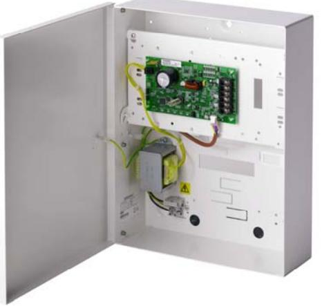
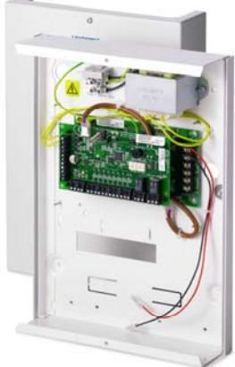
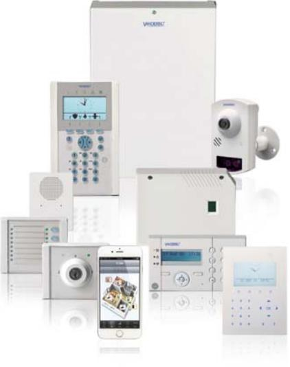

# SPCP333/SPCP332

SPC Smart PSU-aggregat G3 /G2

## SPC Smart PSU-aggregat med 8 sektioner och 2 utgångar

Vanderbilt`s SPCP333 /332 PSU-expander kombinerar en 1.5A strömkapacitet med ett SPCE652 för att tillhandahålla en övervakad kraftenhet med programmerbara sektioner och utgångar. PSU-enheten finns i två varianter SPCP333 – grade 3 (17Ah) och SPCP332 – Grade 2 (7Ah) kapslingsstorlek. Kapslingen har plats för ett batteri.

**Fakta i punktform:** 

- Enkel programmering
- Integration med logiska villkor
- Programmerbara sektionstyper (22+ varianter)
- Programmerbara motståndsvärden (24+ varianter)
- Individuella sektionstexter
- Individuell händelselogg per sektion
- Fritt programmerbara utgångar
- Individuell testfunktion för varje utgång
- 3 Valbara lägen för varje utgång
	- o Kontinuerlig
	- o Puls
	- o Momentan
- Logg option per utgång
- Varje utgång kan styras/låsas via kalender

#### **Key Numbers:**

- 12 V DC PSU
- 1.5 A Aux strömmatning
- Grade 2/3 kapsling
- 8 sektioner
- 2 utgångar
- Frontsabotage Bortbrytningsskydd

# **Funktion:**

- **Sektionstyper**
- Larm
- Inpassering
- Hotlarm
- Överfall
- Sabotage
- Nyckeltillkoppling
- Fel
- Glaskrossdetektor
- Etc.

#### **Funktion:**

- **Utgångstyper** 
	- Följer sektion
	- Dörrstatus
	- Användarstyrd Extern siren
	- Blixtljus
	- Intern siren
	- Larm
	- Verifierat larm
	- Etc.

# SPCP333/SPCP332

## SPC Smart PSU-aggregat G3 /G2

Tekniska data

### Funktioner

| Antal trådbundna sektioner | 8                                                                    |
|----------------------------|----------------------------------------------------------------------|
| Balanseringsmotstånd       | 4K7/4k7 (default), 25 valbara andra kombinationer, Anti-mask support |
| Antal utgångar             | 2 (enpoligt växlande relä, 30 V DC / max. 1 A resistiv last)         |
| Interface                  | X-BUS (in, ut)                                                       |

| Ström                        |                                                                                                              |
|------------------------------|--------------------------------------------------------------------------------------------------------------|
| Matningsspänning             | 230 V AC, +10 to -15 %, 50 Hz                                                                                |
| Strömförbrukning             | Max. 95 mA vid 12 V DC (alla reläer aktiva)                                                                  |
| Viloströmförbrukning         | Max. 77 mA vid 12 VDC                                                                                        |
| Utspänning                   | 13-14 V DC i normal förhållanden (230VAC och full laddade batterier)                                         |
| Aux strömmatning (nominellt) | Max. 1500 mA vid 12 V (750 mA per utgång)                                                                    |
| Batterityp                   | SPCP333: YUASA NP17-12 FR (12 V 17 Ah (inkluderas ej) SPCP332: YUASA NP7-12 FR (12 V 7 Ah (inkluderas ej) |

# Mekanik

| Sabotagekontakt  | SPCP333: Front- och bortbrytningsskydd |  |
|------------------|----------------------------------------|--|
|                  | SPCP332: Frontskydd                    |  |
| Arbetstemperatur | 0 till +40 °C                          |  |
| Kapsling         | Metallkapsling (1.5 mm stål)           |  |
| Färg             | RAL 9003 (signalvit)                   |  |
| Mått             | SPCP333: 326 x 415 x 114 mm            |  |
|                  | SPCP332: 264 x 357 x 81 mm             |  |
| Vikt             | SPCP333: 6.300 kg                      |  |
|                  | SPCP332: 4.700 kg                      |  |

## SPC Smart PSU-aggregat G3 /G2

### Beställningsdata

| Typ       | Artikelnummer    | Beskrivning | Vikt*    |
|-----------|------------------|-------------|----------|
| Smart PSU | V54545-C101-A100 | SPCP333     | 6.300 kg |
| Smart PSU | V54545-C102-A100 | SPCP332     | 4.700 kg |

* Total produktvikt inklusive tillbehör och förpackning.

### Beställningsdata centralapparater & utökningsenheter

| Typ            | Artikelnummer    | Beskrivning                                                                           |
|----------------|------------------|---------------------------------------------------------------------------------------|
| SPC centraler  |                  |                                                                                       |
| SPC6350.320-L1 | V54541-C118-A100 | SPC centralapparat, 16-512 sektioner, Ethernet, G5 kapsling                           |
| SPC6330.320-L1 | V54541-C105-C100 | SPC centralapparat, 8-512 sektioner, Ethernet, G3 kapsling                            |
| SPC5350.320-L1 | V54541-C117-A100 | SPC centralapparat, 16-128 sektioner, Ethernet, G5 kapsling                           |
| SPC5330.320-L1 | V54541-C107-B100 | SPC centralapparat, 8-128 sektioner, Ethernet, kapsling                               |
| SPC5320.320-L1 | V54541-C106-B100 | SPC centralapparat, 8-128 sektioner, Ethernet, G2 kapsling                            |
| SPC4320.320-L1 | V54541-C109-B100 | SPC centralapparat, 8-32 sektioner, Ethernet, G2 kapsling                             |
| SPC4320.220-L1 | V54541-C114-A100 | SPC centralapparat, 8-32 sektioner, Ethernet, G2 kapsling med plastlock               |
| Manöverpaneler |                  |                                                                                       |
| SPCK520.100-N  | V54543-F115-A100 | Kompakt manöverpanel med grafisk display och talfunktion                              |
| SPCK521.100-N  | V54543-F116-A100 | Kompakt manöverpanel med grafisk display, kortläsare och talfunktion                  |
| SPCK620.100    | V54543-F110-A100 | LCD manöverpanel med grafisk display                                                  |
| SPCK623.100    | V54543-F111-A100 | LCD manöverpanel med grafisk display, kortläsare och talfunktion                      |
| SPCK420.100    | V54543-F101-A100 | LCD manöverpanel med 2 x 16 tecken                                                    |
| SPCK421.100    | V54543-F102-A100 | LCD manöverpanel med 2 x 16 tecken och kortläsare                                     |
| Expanders      |                  |                                                                                       |
| SPCE452.100    | V54542-F107-A100 | Expander med 8 utgångar, sabotageskydd                                                |
| SPCE652.100    | V54542-F106-A100 | Sektionsexpander 8 in- och 2 utgångar                                                 |
| SPCA210.100    | V54547-A101-A100 | Dörrcentral för 2 dörrar                                                              |
| SPCP432.300    | V54545-C103-A100 | Smart PSU med dörrcentral, G2-kapsling för 7Ah ackumulator                            |
| SPCP433.300    | V54545-C104-A100 | Smart PSU med dörrcentral, G3-kapsling för 17Ah ackumulator                           |
| SPCE110.100    | V54542-F104-A100 | Nyckelomkopplare med 2 LED och 3-positions nyckelbrytare                              |
| SPCE120.100    | V54542-F105-A100 | Indikeringsenhet med 16 LED, 4 funktionsknappar och kortläsare                        |
| SPCW130.100    | V54554-F101-B100 | SiWay trådlös mottagarexpander                                                        |
| SPCP332.300    | V54545-C102-A100 | Smart PSU med sektionsexpander 8 in- och 2 utgångar, G2-kapsling för 7Ah ackumulator  |
| SPCP333.300    | S54545-C101-A100 | Smart PSU med sektionsexpander 8 in- och 2 utgångar, G3-kapsling för 17Ah ackumulator |

| Tillbehör |                  |                                                  |
|-----------|------------------|--------------------------------------------------|
| IPAW8-10  | V54538-F107-A100 | Trådlös överfallskontakt, bältesmodell           |
| IRCW6-11  | V54543-F109-A100 | Trådlös fjärrkontroll, vit med utbytbart batteri |
| IPAW6-10  | V54538-F108-A100 | Trådlös överfallskontakt                         |

# SPCP333/SPCP332

## SPC Smart PSU-aggregat G3 /G2

| Verifiering |                  |                                                                                  |
|-------------|------------------|----------------------------------------------------------------------------------|
| SPCV340.000 | V54542-F108-B100 | Audioexpander med 4 sektionsingångar och 1 utgång                                |
| SPCV341.000 | V54542-F109-B100 | Audioexpander med 4 sektionsingångar och 1 line-utgång                           |
| SPCV310.000 | V54542-F120-A100 | Audiosatellit                                                                    |
| SPCV440.000 | V54542-F118-A100 | Kombiaudioexpander för MAGIC rörelsedetektor med 4 sektionsingångar och 1 utgång |
| SPCV410.000 | V54542-F119-A100 | Kombiaudiosatellit för MAGIC rörelsedetektor                                     |
| CCMS2010-IR | S54561-C112-A100 | 1/2.7" 2MP Kompakt IP Kamera PoE(LAN)                                            |
|             |                  |                                                                                  |
| Kortläsare  |                  |                                                                                  |
| PP500-EM    | V54501-F1-A1     | Beröringsfri läsare för EM-kort och kod                                          |
| PR500-EM    | V24246-F3913-A1  | Beröringsfri läsare för EM-kort                                                  |
| HD500-EM    | V24246-F3901-A1  | Beröringsfri läsare för EM-kort, vandalsäker                                     |

P6350 Intrusion System

# Learn more at www.vanderbiltindustries.com

Issued by Vanderbilt Clonshaugh Business and Technology Park Clonshaugh Dublin 17 Ireland www.vanderbiltindustries.com

© Vanderbilt 2016 Data and design subject to change without notice. Supply subject to availability. Document version: b Edition: 01.01.2016

A6V10395194_b page 4

Vanderbilt © Vanderbilt 2016