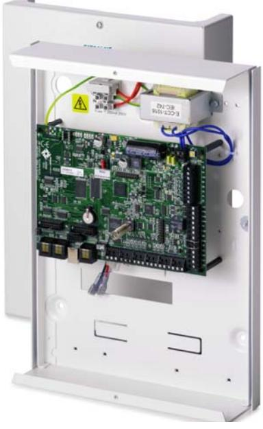

# SPC4320

## SPC G2 Centralapparat för inbrottslarm

## IP baserat inbrottslarmsystem med inbyggd web server

Vanderbilts SPC4320 centralapparat kombinerar på ett optimalt sätt inbrottslarm med passagefunktionalitet i ett system. Systemet kan expanderas beroende på objektets och kunden specifikationer upp till 32 sektioner (8 på moderkort), 30 utgångar (6 på moderkort), 4 manöverpaneler, 4 dörrar och 8 verifikationszoner. Centralen har 1 X-BUSingång (1 slinga), 4 områden, 100 användare med olika tillträdesnivåer, 1000 händelser i vardera inbrotts- och passagelogg, integrerad web server, 2 platser för larmsändare PSTN och/eller GSM/GPRS samt Ethernet interface på moderkortet.

Systemet kan expanderas med trådlösa mottagare som stöder upp till 32 trådlösa detektorer (mixat med trådbundna sektioner).

Centralapparaten levereras i en sabotageskyddad plåtkapsling med plats för en 7Ah ackumulator för reservdrift .

### **Fakta i punktform:**

- Inbyggt Ethernet
- Flerspråksstöd
- Uppfyller EN50131
- EN50136 kommunikation
- Lång batterikapacitet
- Sabotageskyddad
- Kalenderfunktion
- Logiska villkor
- Dörrkontrollfunktioner
- Audio- och videoverifiering

- 100 Användare
- 32 Sektioner
- 30 Utgångar
- 4 Manöverpaneler
- 4 Dörrar
- 4 Områden

### **Applikationer:**

- Hus och hem
- Små företag

### **Språk:**

- Svenska
- Danska
- Norska
- Finska
- Engelska
- Tyska
- Franska
- Spanska
- Portugisiska
- Tjeckiska Italienska

# Funktioner & Fördelar

SPC systemet har ett kraftfullt utbud av kommunikationsval. Systemet erbjuder IP-baserad kommunikation baserad på EN50136 standarden. Samtidigt kan analog larmkommunikation användas som backup.

## Företagsinställningar Logiska villkor Användarhantering

Den integrerade företagsfunktionaliteten ger möjligheten att enkelt anpassa centralapparaten till kommersiellt vanligt förekommande krav som exempelvis intelligent styrning av gemensamma områden och extra funktioner för systemövervakning.

# Avancerade funktioner

### Användardefinierade funktioner Fjärråtkomst överallt

Funktionaliteten i ett SPC-system kan anpassas för att passa specifika kund- och marknadskrav.

## Kommunikation Programmering Godkännanden

SPC-familjen programmeras på samma sätt oavsett storlek på central. Systemet programmeras på plats via manöverpanelen eller genom att ansluta direkt till moderkortet och dess web server. Fjärrledes används web servern för att styra systemet eller fjärrprogrammeras och ändra funktionaliteten i systemet.

Funktionaliteten hos ett SPCsystem kan utökas för att anpassas mot kunders eller marknadens mer specifika krav. Olika händelser i systemet (sektioner, områden, användare, kalendrar) kan logiskt knytas samman för att aktivera andra specifika händelser.

Uppfyller internationella standarder såsom:

- EN
- F&P
- FG
- SSF

Det är av största vikt att säkerhetssystem installeras professionellt och fungerar pålitligt.

SPC ger systemadministratören tillgång att hantera användarnas larm- och passagerättigheter. Användarrättigheter kan styras av tid, dag och område.

Med SPC Connect kan alla SPC centraler med IP fjärråtkommas. SPC Connect ger kunder tillgång till web interfacet och mobilappar.

I-2000019-2 page 2

Vanderbilt © Vanderbilt 2016

# SPC4320

## Grade 2 Inbrottslarmsystem

## Tekniska data

## Inbrott

| Max. antal trådbundna sektioner      | 32                                                                                                                                       |
|--------------------------------------|------------------------------------------------------------------------------------------------------------------------------------------|
| Trådbunda sektioner på moderkort     | 8                                                                                                                                        |
| Max. antal utgångar                  | 30                                                                                                                                       |
| Programmerbara områden               | 4                                                                                                                                        |
| Max. antal användare                 | 100                                                                                                                                      |
| SMS Max, TAG Max                     | 32, 32                                                                                                                                   |
| Händelselogg                         | 1,000 inbrottshändelser                                                                                                                  |
| Balanseringsmotstånd                 | 4K7/4k7 (default), 25 valbara andra kombinationer, Anti-mask support                                                                     |
| Interface                            | 1 X-BUS (1 slinga) 2 RS232 1 USB 1 Fastprogrammer 1 Ethernet (RJ45)                                                          |
| Passage                              |                                                                                                                                          |
| Händelselogg                         | 1,000 passagehändelser                                                                                                                   |
| Max. antal dörrar (entry/entry-exit) | 4/2                                                                                                                                      |
| Max. antal dörrgrupper               | 2                                                                                                                                        |
| Stödda korttyper                     |  Mifare  EM4102 Classic 1K  HID Corporate 1000  Wiegand (26-  Cotag bits, 37 bits)  DESfire |

Till- och frånkopplingsfunktioner

Specialfunktioner Anti pass-back skydd (mjuk / hård), Väktare, Eskort

Vanderbilt © Vanderbilt 2016

I-2000019-2 page 3

| Trådlöst                                                                                  |    |  |
|-------------------------------------------------------------------------------------------|----|--|
| Max antal trådlösa sektioner                                                              | 32 |  |
| Max antal trådlösa fjärrkontroller                                                        | 32 |  |
| Max. antal trådlösa detektorer som en trådlös mottagare kan hantera (rekommenderat) | 20 |  |

Kompatibla trådlösa mottagare SPCW110, SPCW112, SPCW114 och SPCW130

## Kommunikation

| Web Server                             | HTTPS (inbyggd) TLS krypterad                                                                    |  |
|----------------------------------------|--------------------------------------------------------------------------------------------------|--|
| IP                                     | Inbyggd på moderkort                                                                             |  |
| Anslutbara kommunikations interface | PSTN eller GSM/GPRS modem (max. 2 extra modem)                                                |  |
| Standard kommunikationsprotokoll       | SIA, Contact ID, SMS meddelande                                                                  |  |
| Fastprogrammer stöd                    | Ja                                                                                               |  |
| Firmware uppgradering                  | Lokalt/fjärrledes uppgradering av centralapparat, expansionsenheter och kommunikationsmoduler |  |
| Larmöverföringsvägar                   | IP via Ethernet, IP via GPRS, PSTN GSM                                                     |  |
| Larmöverföringsprotokoll IP            | FlexC – Flervägskommunikation EDP                                                             |  |
| Larmöverföringsprotokoll analogt       | SIA, SIA Extended 1, SIA extended 2, Fast format, Contact ID, SMS meddelande                     |  |

## Ström och mekanik

| Matningsspänning     | 230 V AC, +10 till -15 %, 50 Hz |
|----------------------|---------------------------------|
| Strömförbrukning     | Max. 160 mA vid 12 V DC         |
| Viloströmförbrukning | Max. 140 mA vid 12 V DC         |

| Utspänning               | 13-14 VDC vid normalt läge (230VAC och fulladdat batteri)                                                              |  |  |
|--------------------------|------------------------------------------------------------------------------------------------------------------------|--|--|
| Aux-spänning (nominellt) | Max. 750 mA vid 12 V DC                                                                                                |  |  |
| Batterityp               | 12 V 7 Ah, (batteri ingår ej vid leverans)                                                                             |  |  |
| Sabotagekontakt          | Frontkontakt                                                                                                           |  |  |
| Arbetstemperatur         | 0 till +40 °C                                                                                                          |  |  |
| Kapsling                 | SPC4320.320: Metallkapsling (1.2 mm stålplåt) SPC4320.220: Metallbotten (1.2 mm stålplåt), plastlock (Polykarbonat) |  |  |
| Mått                     | SPC4320.320: 264 x 357 x 81 mm SPC4320.220: 270 x 365 x 91 mm                                                       |  |  |
| Vikt (utan batterier)    | SPC4320.320: 4.500 kg SPC4320.220: 3.700 kg                                                                         |  |  |

Vanderbilt © Vanderbilt 2016

I-2000019-2 page 4

## Beställningsdata

| Typ            | Artikelnummer    | Beskrivning                                                          | Vikt*    |
|----------------|------------------|----------------------------------------------------------------------|----------|
| SPC4320.320-L1 | V54541-C109-B100 | Centralapparat 8-32 sektioner, 4 områden, 4 dörrar, IP               | 4.500 kg |
| SPC4320.220-L1 | V54541-C114-A100 | Centralapparat 8-32 sektioner, 4 områden, 4 dörrar, IP, plastlock | 3.700 kg |

* Total produktvikt inklusive tillbehör och förpackning.

## Beställningsdata utökningsenheter

| Typ            | Artikelnummer    | Beskrivning                                                                           |
|----------------|------------------|---------------------------------------------------------------------------------------|
| Manöverpaneler |                  |                                                                                       |
| SPCK520.100-N  | V54543-F115-A100 | Kompakt manöverpanel med grafisk display och talfunktion                              |
| SPCK521.100-N  | V54543-F116-A100 | Kompakt manöverpanel med grafisk display, kortläsare och talfunktion                  |
| SPCK620.100    | V54543-F110-A100 | LCD manöverpanel med grafisk display                                                  |
| SPCK623.100    | V54543-F111-A100 | LCD manöverpanel med grafisk display, kortläsare och talfunktion                      |
| SPCK420.100    | V54543-F101-A100 | LCD manöverpanel med 2 x 16 tecken                                                    |
| SPCK421.100    | V54543-F102-A100 | LCD manöverpanel med 2 x 16 tecken och kortläsare                                     |
| Expanders      |                  |                                                                                       |
| SPCE452.100    | V54542-F107-A100 | Expander med 8 utgångar, sabotageskydd                                                |
| SPCE652.100    | V54542-F106-A100 | Expander md 8 sektionsingångar och 2 utgångar, sabotageskydd                          |
| SPCW130.100    | V54554-F101-B100 | SiWay trådlös mottagarexpander                                                        |
| SPCA210.100    | V54547-A101-A100 | Dörrcentral för 2 dörrar                                                              |
| SPCP432.300    | V54545-C103-A100 | Smart PSU med dörrcentral, G2-kapsling för 7Ah ackumulator                            |
| SPCP433.300    | V54545-C104-A100 | Smart PSU med dörrcentral, G3-kapsling för 17Ah ackumulator                           |
| SPCE110.100    | V54542-F104-A100 | Nyckelomkopplare med 2 LED och 3-positions nyckelbrytare                              |
| SPCE120.100    | V54542-F105-A100 | Indikeringsenhet med 16 LED, 4 funktionsknappar och kortläsare                        |
| SPCP332.300    | V54545-C102-A100 | Smart PSU med sektionsexpander 8 in- och 2 utgångar, G2-kapsling för 7Ah ackumulator  |
| SPCP333.300    | S54545-C101-A100 | Smart PSU med sektionsexpander 8 in- och 2 utgångar, G3-kapsling för 17Ah ackumulator |
| SPCP355.300    | S54545-C105-A100 | Smart PSU med 8 sektionsingångar och 6 utgångar, G5-kapsling för 2x27Ah ackumulator   |
| Tillbehör      |                  |                                                                                       |
| IPAW8-10       | V54538-F107-A100 | Trådlös överfallskontakt, bältesmodell                                                |
| IRCW6-11       | V54543-F109-A100 | Trådlös fjärrkontroll, vit med utbytbart batteri                                      |
| IPAW6-10       | V54538-F108-A100 | Trådlös överfallskontakt                                                              |
|                |                  |                                                                                       |

| Verifiering |                  |                                                                                  |
|-------------|------------------|----------------------------------------------------------------------------------|
| SPCV340.000 | V54542-F108-B100 | Audioexpander med 4 sektionsingångar och 1 utgång                                |
| SPCV341.000 | V54542-F109-B100 | Audioexpander med 4 sektionsingångar och 1 line-utgång                           |
| SPCV310.000 | V54542-F120-A100 | Audiosatellit                                                                    |
| SPCV440.000 | V54542-F118-A100 | Kombiaudioexpander för MAGIC rörelsedetektor med 4 sektionsingångar och 1 utgång |
| SPCV410.000 | V54542-F119-A100 | Kombiaudiosatellit för MAGIC rörelsedetektor                                     |
| CCMS2010-IR | S54561-C112-A100 | 1/2.7" 2MP Kompakt IP Kamera PoE(LAN)                                            |

Vanderbilt © Vanderbilt 2016

| Kortläsare |                  |                                                    |  |
|------------|------------------|----------------------------------------------------|--|
| PP500-EM   | V54501-F1-A1     | Beröringsfri läsare för EM-kort och kod            |  |
| PR500-EM   | V24246-F3913-A1  | Beröringsfri läsare för EM-kort                    |  |
| HD500-EM   | V24246-F3901-A1  | Beröringsfri läsare för EM-kort, vandalsäker       |  |
| P          |                  |                                                    |  |
| Detektorer |                  |                                                    |  |
| PDM-I12    | V54530-F114-A100 | MAGIC PIR detektor, 12m vidvinkel                  |  |
| PDM-I12T   | V54530-F105-A100 | MAGIC PIR detektor, 12m vidvinkel med Anti-mask    |  |
| PDM-I18    | V54530-F106-A100 | MAGIC PIR detektor, 18m vidvinkel                  |  |
| PDM-I18T   | V54530-F107-A100 | MAGIC PIR detektor, 18m vidvinkel med Anti-mask    |  |
| PDM-IXA12  | V54531-F113-A100 | MAGIC PIR/MW detektor, 12m vidvinkel               |  |
| PDM-IXA12T | V54531-F116-A100 | MAGIC PIR/MW detektor, 12m vidvinkel med Anti-mask |  |
| PDM-IXA18  | V54531-F119-A100 | MAGIC PIR/MW detektor, 18m vidvinkel               |  |
| PDM-IXA18T | V54531-F122-A100 | MAGIC PIR/MW detektor, 18m vidvinkel med Anti-mask |  |

# Learn more at www.vanderbiltindustries.com

Issued by Vanderbilt Clonshaugh Business and Technology Park Clonshaugh Dublin 17 Ireland www.vanderbiltindustries.com

-

© Vanderbilt 2016 Data and design subject to change without notice. Supply subject to availability. Document version: b Edition: 01.01.2016

I-2000019-2 page 6

Vanderbilt © Vanderbilt 2016