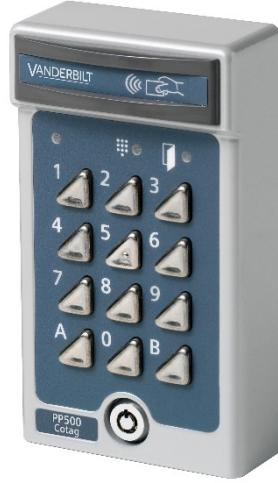

**PP500-Cotag** Access Control

## **Heavy duty card and PIN reader**

- **Cotag reader**
- **Cotag cards**
- **Card read distance up to 10 cm with active card or up to 5 cm with passive card**

The PP500-Cotag reads unique Cotag cards and tags (both active and passive) which offers ultimate convenience and cost-efficiency. It has a reading range of up to 12 cm with an active card and up to 3 cm with a passive card. It has a position indicator light and an illuminated keypad which makes it easy to use in dark places. It also includes a tamper switch for enhanced security.

When BC-Link is used, two of theses readers can be installed to control entries and exits using only one door controller. An additional benefit of BC-Link is that it supports online status monitoring.

## **Vanderbilt International (IRL) Ltd.**

|                         | PP500-Cotag                                       |  |  |
|-------------------------|---------------------------------------------------|--|--|
| System compatibility    | DC800, Vanderbilt Entro, SiPass integrated        |  |  |
| Interface to controller | BC-Link, Clock&Data or Wiegand                    |  |  |
| Operating voltage       | 12 to 24 VDC                                      |  |  |
| Current consumption     | 39 mA @ 12 VDC                                    |  |  |
|                         | 23 mA @ 24 VDC                                    |  |  |
| Tamper switch           | Yes                                               |  |  |
| Card technology         | Cotag                                             |  |  |
| Card compatibility      | IB928, IB911, IB968, IB961, IB958M                |  |  |
| Card read distance      | Up to 12 cm with active card or 3 cm with passive |  |  |
|                         | card                                              |  |  |
| Indicators              | 3 x LED (red/yellow/green)                        |  |  |
|                         | 1 x Buzzer                                        |  |  |
| Keypad                  | Stainless steel keys 0-9, A, B                    |  |  |
| Operating temperature   | -35 to +50 °C                                     |  |  |
| Environment             | Indoor or outdoor use.                            |  |  |
| IP rating               | IP54                                              |  |  |
| Housing                 | Cast metal with stainless steel keys and security |  |  |
|                         | lock                                              |  |  |
| Colour                  | Grey                                              |  |  |
| Dimensions (W x H x D)  | 80 x 140 x 40 mm                                  |  |  |
| Approval                | CE                                                |  |  |
| Accessories             | SH2 rain cover                                    |  |  |
|                         | IS391 spy-proof cover                             |  |  |
|                         | BB3 flush-mounting kit                            |  |  |
|                         |                                                   |  |  |

## **Details for ordering**

| Type        | Part no      | Designation                    | Weight  |
|-------------|--------------|--------------------------------|---------|
| PP500-Cotag | V54501-F1-A2 | Heavy duty card and PIN reader | 1.35 kg |

Vanderbilt International (IRL) Ltd. Clonshaugh Business and Technology Park Clonshaugh Dublin 17 Ireland

© 2015 Copyright Vanderbilt International (IRL) Ltd Data and design subject to change without notice. Supply subject to availability.

www.vanderbiltindustries.com

Document no. **A6V10225458** Edition 11.2015