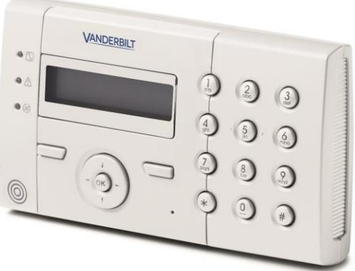
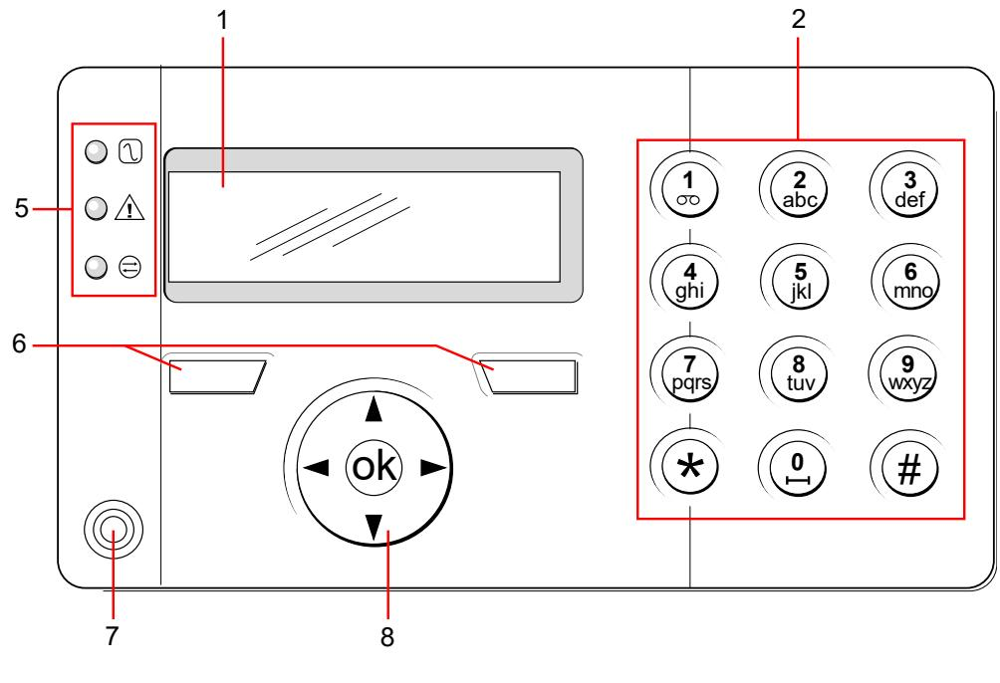
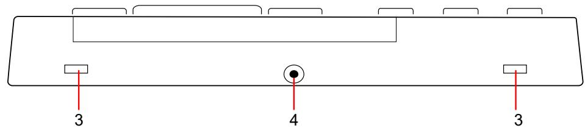
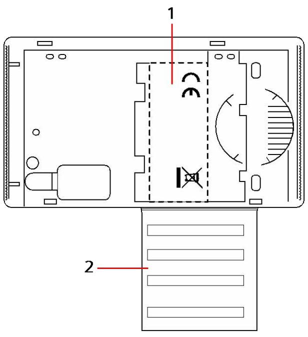
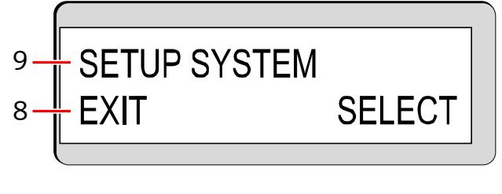
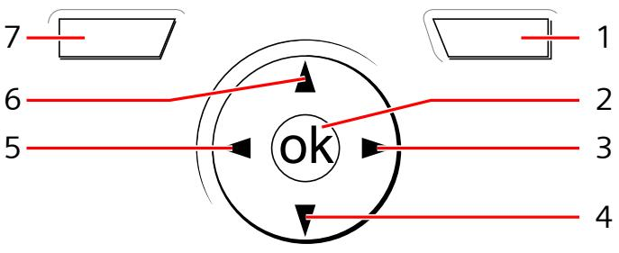

# SPCK 420/421

# LCD-Manöverpanel

Användarguide

3.6

A6V10223041 Vanderbilt

# Copyright

Tekniska specifikationer och tillgänglighet är föremål för ändringar utan föregående varning.

© Copyright Vanderbilt

Alla rättigheter till detta dokument och till föremålet för det förbehålles. Genom att acceptera dokumentet erkänner mottagaren dessa rättigheter och förbinder sig att inte publicera dokumentet, eller föremålet därför, helt eller delvis, att inte göra dem tillgängliga för tredje part utan skriftligt tillstånd från oss, samt att inte använda dem för något annat syfte än det för vilket de levererats.

Edition: 01.10.2015

Dokument ID: A6V10223041

| 1   |         | Säkerhet 5                                  |  |
|-----|---------|---------------------------------------------|--|
| 1.1 |         | Målgrupp5                                   |  |
| 1.2 |         | Allmänna säkerhetsföreskrifter5             |  |
|     | 1.2.1   | Allmän information 5                        |  |
|     | 1.2.2   | Drift5                                      |  |
|     | 1.2.3   | Service och underhåll 5                     |  |
| 1.3 |         | Varningsmarkeringarnas innebörd 5           |  |
| 1.4 |         | Varningssymbolernas betydelse 6             |  |
| 2   |         | Direktiv och standarder 7                   |  |
| 2.1 |         | EU-direktiv7                                |  |
|     | 2.1.1   | Säkerhetsstandarder7                        |  |
| 3   |         | Inledning8                                  |  |
| 4   |         | Översikt över manöverpaneltyper10           |  |
| 5   |         | Använda LCD-manöverpanelens gränssnitt 11   |  |
| 6   |         | Användarprogrammering via manöverpanelen 14 |  |
| 6.1 |         | Tillkoppla och frånkoppla systemet 14       |  |
|     | 6.1.1   | FRÅNKOPPLING14                              |  |
|     | 6.1.2   | TILLKOPPLING 15                             |  |
|     | 6.1.3   | DELTILLKOPPLING 15                          |  |
|     | 6.1.4   | TVÅNGSTILLKOPPL16                           |  |
|     | 6.1.5   | VISA och ÅTERSTÄLL VARNINGAR16              |  |
|     | 6.1.6   | KODAD ÅTERSTÄLLNING18                       |  |
| 6.2 |         | Användarmenyer18                            |  |
|     | 6.2.1   | SYSTEMSTATUS19                              |  |
|     | 6.2.2   | ISOLERA20                                   |  |
|     | 6.2.3   | SPÄRRA 20                                   |  |
|     | 6.2.4   | ANGE DATUM/TID 21                           |  |
|     | 6.2.5   | TEST21                                      |  |
|     | 6.2.5.1 | SIRENTEST21                                 |  |
|     | 6.2.5.2 | GÅNGTEST 22                                 |  |
|     | 6.2.5.3 | WPA-TEST 22                                 |  |
|     | 6.2.5.4 | LJUDALTERNATIV22                            |  |
|     | 6.2.5.5 | SEISMISKT TEST23                            |  |
|     | 6.2.5.6 | VISUELLA INDIKATORER 23                     |  |
|     | 6.2.6   | HÄNDELSELOGG 23                             |  |
|     | 6.2.7   | PASSAGELOGG 23                              |  |
|     | 6.2.8   | DING-DONG 24                                |  |
|     | 6.2.9   | ANVÄNDARE24                                 |  |
|     | 6.2.9.1 | LÄGGA TILL 24                               |  |
|     | 6.2.9.2 | REDIGERA 24                                 |  |
|     | 6.2.9.3 | PASSAGEKONTROLL 25                          |  |

|     | 6.2.9.4  | TA BORT27             |  |
|-----|----------|-----------------------|--|
|     | 6.2.10   | ANVÄNDARPROFILER 27   |  |
|     | 6.2.10.1 | LÄGGA TILL27          |  |
|     | 6.2.10.2 | REDIGERA 27           |  |
|     | 6.2.10.3 | TA BORT28             |  |
|     | 6.2.11   | SMS 28                |  |
|     | 6.2.11.1 | LÄGGA TILL29          |  |
|     | 6.2.11.2 | REDIGERA 29           |  |
|     | 6.2.11.3 | TA BORT30             |  |
|     | 6.2.11.4 | SMS-kommandon 30      |  |
|     | 6.2.12   | ÄNDRA KOD32           |  |
|     | 6.2.13   | DÖRRCENTRAL32         |  |
|     | 6.2.14   | BEVILJA ÅTKOMST 33    |  |
|     | 6.2.15   | RAPPORT T. INST. 33   |  |
|     | 6.2.16   | LARMLOGG33            |  |
|     |          | Bilaga35              |  |
| 7.1 |          | Användarrättigheter35 |  |
| 7.2 |          | Användarkoder 37      |  |
| 7.3 |          | Sektionsdiagram37     |  |

# 1 Säkerhet

# 1.1 Målgrupp

Instruktionerna i denna dokumentation är avsedda för följande målgrupp:

| Målgrupp      | Kvalifikationer                                       | Arbetsuppgift                                                      | Produktstatus                                          |
|---------------|-------------------------------------------------------|--------------------------------------------------------------------|--------------------------------------------------------|
| Slutanvändare | Instruktion av tekniska specialister erfordras. | Utför endast procedurerna för korrekt drift av produkten. | Produkten är redan installerad och konfigurerad. |

# 1.2 Allmänna säkerhetsföreskrifter

#### 1.2.1 Allmän information

- Spara detta dokument som referens.
- Detta dokument ska alltid följa med produkten.
- Ta också hänsyn till eventuella landsspecifika, lokala säkerhetsstandarder och föreskrifter beträffande projektplanering, drift och kassering av produkten.

#### Ansvarsfriskrivning

- Gör inga ändringar eller modifieringar av utrustningen om de inte uttryckligen nämns i denna handbok och är godkända av tillverkaren.
#### 1.2.2 Drift

#### Farlig situation på grund av falsklarm

- Meddela alla berörda parter och assistansgivande myndigheter innan du testar systemet.
- För att undvika panik bör du informera alla som befinner sig på platsen innan du testar larmutrustning.

#### 1.2.3 Service och underhåll

#### Risk för elektrisk stöt vid underhållsarbete

- Underhållsarbete får endast utföras av utbildade servicetekniker.
#### Risk för elektrisk stöt vid rengöring

- Använd inga rengöringsvätskor eller -sprejer som innehåller alkohol eller ammoniak.
# 1.3 Varningsmarkeringarnas innebörd

| Signalord    | Typ av risk                               |
|--------------|-------------------------------------------|
| FARA         | Risk för dödsfall eller svår kroppsskada. |
| VARNING      | Risk för dödsfall eller svår kroppsskada. |
| FÖRSIKTIGHET | Risk för utrustningsskada eller mindre    |

| Signalord | Typ av risk            |
|-----------|------------------------|
|           | allvarlig kroppsskada. |
| VIKTIGT   | Risk för funktionsfel. |

# 1.4 Varningssymbolernas betydelse

| VARNING                    |
|----------------------------|
| Varning för farligt område |
|                            |
|                            |

# 2 Direktiv och standarder

## 2.1 EU-direktiv

Denna produkt uppfyller kraven enligt EU-direktiven 2004/108/EEG "Direktivet om elektromagnetisk kompatibilitet", 2006/95/EC "Lågspänningsdirektivet", och 1999/5/EC Direktivet för radio och teleterminalutrustning (R&TTE). EUdeklarationen om överensstämmelse finns tillgänglig för ansvarig myndighet på: http://pcd.vanderbiltindustries.com/doc/SPC

#### EU-direktiv 2004/108/EEG om elektromagnetisk kompatibilitet

Att produkten uppfyller EU-direktiv 2004/108/EEG har kontrollerats genom test enligt följande standarder:

| EMC-utstrålning | EN 55022 klass B |
|-----------------|------------------|
| EMC-immunitet   | EN 50130-4       |

#### EU-direktiv 2006/95/EEG Lågspänningsdirektiv

Att produkten uppfyller EU-direktiv 2006/95/EG har kontrollerats genom test enligt följande standard:

| Säkerhet EN 60950-1 |
|------------------------|
|------------------------|

#### 2.1.1 Säkerhetsstandarder

SPCK420.100 och SPCK421.100 är godkända enligt följande standarder:

| Produkt     | Standard                                |
|-------------|-----------------------------------------|
| SPCK420.100 | EN50131-3:2009, grad 3, klass II, typ B |
| SPCK421.100 |                                         |

# 3 Inledning

LCD-manöverpanel är ett väggmonterat gränssnitt som gör att:

- Installatörer kan programmera systemet via installatörprogrammeringsmenyerna (lösenordsskyddade) och tillkoppla/frånkoppla systemet. Användaren kan kontrollera systemet dagligen.
- Användare kan gå till användarprogrammeringsmenyerna (lösenordsskyddade) och utföra driftmanövrer (tillkoppla/frånkoppla) systemet. Se användarmanualen för SPCK420/421 för ytterligare information om användarprogrammering.)

LCD-manöverpanel har en inbyggd främre sabotagebrytare och en display på 2 rader x 16 tecken. Den har en lättanvänd navigeringstangent för att hitta programmeringsalternativ och 2 sammanhangsberoende programstyrda knappar (vänster och höger) för att välja inställning i menyer och program. 3 lysdioder på manöverpanelen indikerar ström, systemlarm och kommunikationsstatus.

LCD-manöverpanelen kan fabriksutrustas med en Portable ACE (PACE) tag-läsare (se sidan [➙ 10]).

LCD-manöverpanel

| 1 | LCD display                | Manöverpanelens display (2 rader x 16 tecken) visar alla larm- och varningsmeddelanden och ger ett synligt gränssnitt för programmering av systemet (endast installatörsprogrammering). Man kan ställa in displayens kontrast och när bakgrundsbelysningen ska sättas på.                                 |
|---|----------------------------|--------------------------------------------------------------------------------------------------------------------------------------------------------------------------------------------------------------------------------------------------------------------------------------------------------------------|
| 2 | Alfanumeriska tangenter | Den alfanumeriska manöverpanelen möjliggör inmatning av både text och numeriska data vid programmeringen. Alfabetiska tecken väljs genom att trycka ned tangenterna ett visst antal gånger. För att växla skiftläge trycker du ned staket (#)-tangenten. För att mata in en siffra, håll ned den aktuella |

8

|   |                                            | tangenten i 2 sekunder.                                                                                                                                                                                   |
|---|--------------------------------------------|-----------------------------------------------------------------------------------------------------------------------------------------------------------------------------------------------------------|
| 3 | Åtkomstflikar                              | Åtkomstflikarna ger tillgång till klämmorna på baksidan av manöverpanelen. Användaren kan lyfta av klämmorna från framsidan genom att sätta in en 5 mm skruvmejsel i infasningarna och trycka lätt. |
| 4 | Fastsättningsskru v för baksidan        | Denna skruv används för att sätta fast fram- och baksidorna på manöverpanelen. Skruven måste tas bort för att man ska kunna öppna manöverpanelen.                                                   |
| 5 | Lysdioder för statusindikering          | Statuslysdioderna ger information om systemets aktuella status enligt nedanstående beskrivning.                                                                                                        |
| 6 | Programstyrda funktionstangente r    | Vänster och höger funktionsknapp är sammanhangsberoende tangenter som används för att navigera i menyerna och för programmering.                                                                       |
| 7 | Område för tagläsare                    | Om manöverpanelen utrustats med tagläsare (se sid. [➙ 10]), bör användarna visa sin tag inom 1 cm från detta område för att TILLKOPPLA/FRÅNKOPPLA systemet.                                         |
| 8 | Multifunktionell navigeringstange nt | Den multifunktionella navigeringstangenten tillsammans med manöverpanelen utgör ett gränssnitt för att programmera systemet.                                                                           |

| LYSDIOD                     |  | Status                                                                                                                                                                                  |
|-----------------------------|--|-----------------------------------------------------------------------------------------------------------------------------------------------------------------------------------------|
| AC nätspänning (Grön) |  | Visar om strömförsörjningen fungerar eller är bruten. BLINKANDE: 230 VAC fel detekterat FAST: Nätspänning OK                                                                      |
| Systemvarnin g (Gul)  |  | Indikerar en systemvarning BLINKANDE: Systemvarning detekterad. Displayen visar plats och typ av varning. Om systemet är TILLKOPPLAT, ges INGEN indikation på systemvarningar. |
|                             |  | AV: Ingen varning detekterad; Om en manöverpanel tilldelas mer än ett område, indikerar lysdioden inget larmtillstånd om något av dessa områden är TILLKOPPLADE.                  |
| X-BUS Status (Röd)       |  | Visar status för X-BUS-kommunikation vid programmering i FULLT INST LÄGE. Blinkar regelbundet: (ungefär var 1,5 sek) indikerar att kommunikationsstatus är OK                  |
|                             |  | Blinkar snabbt: (ungefär var 0,25 sek) indikerar att manöverpanelen är sista expansionsenheten X-BUS                                                                                 |
|                             |  | Om manöverpanelen installeras för första gången och den får ström innan anslutningen till centralapparatens X-BUS-gränssnitt har gjorts, är lysdioden kvar i PÅ-läge.             |

# 4 Översikt över manöverpaneltyper

| Manöverpanel typ                    | Modell nr. | Basfunktioner | Kortläsare | Ljud |
|-------------------------------------|------------|---------------|------------|------|
| Standard manöverpanel               | SPCK420    | ✓             | -          | -    |
| Manöverpanel med TAG                | SPCK421    | ✓             | ✓          | -    |
| Comfort manöverpanel                | SPCK620    | ✓             |            | -    |
| Comfort manöverpanel med ljud/CR | SPCK623    | ✓             | ✓          | ✓    |

Manöverpaneletikett SPCK420/421

| 1 Etikett på insidan av manöverpanelen                                                                                   |
|--------------------------------------------------------------------------------------------------------------------------|
| 2 Etikett för att lämna information om installatören. Fyll i all relevant information när installationen är slutförd. |

## 5 Använda LCD-manöverpanelens gränssnitt

Manöverpanelens display 

|   | 1 HÖGER FUNKTIONSKN APP   | Denna knapp används för att välja det högra alternativet på displayens nedre rad. Möjliga värden är:                                                                                                                                                                                                                                       |
|---|---------------------------------|--------------------------------------------------------------------------------------------------------------------------------------------------------------------------------------------------------------------------------------------------------------------------------------------------------------------------------------------------|
|   |                                 | → VÄLJ för att välja alternativet som visas på den översta raden → ENTER för att mata in data som visas på den översta raden → NÄSTA för att visa nästa larm efter det som visas på den översta raden → RADERA för att radera larmet som visas på den översta raden → SPARA för att spara en inställning                             |
|   | 2 OK                            | OK-knappen fungerar som VÄLJ-knapp för för menyalternativet på övre raden i displayen och även som ENTER/SPARA-knapp för data som visas på övre raden.                                                                                                                                                                                     |
| 3 |                                 | I programmeringsläge tar höger pilknapp användaren genom menyerna på samma sätt som när man trycker på alternativet VÄLJ (höger funktionsknapp). I datainmatningsläge trycker du på höger pilknapp för att flytta markören ett steg åt höger.                                                                                           |
| 4 |                                 | I programmeringsläge flyttar nedåtpilen användaren till nästa programmeringsalternativ på samma menynivå. Fortsätt trycka på knappen för att skrolla igenom alla programmeringsalternativ på den aktuella menynivån. I alfanumeriskt läge trycker du ner denna knapp över en stor bokstav för att ändra den till liten bokstav.      |
|   |                                 | När larm visas, förflyttar nedåtpiltangenten användaren till nästa larmmeddelande i prioritetsordning. (Se avsnitt om Prioritering av visningsmeddelanden)                                                                                                                                                                                 |
| 5 |                                 | I programmeringsläge tar vänster piltangent användaren tillbaka till föregående menynivå. När man trycker ner tangenten när man är på den högsta menynivån, avslutas programmeringen. I datainmatningsläge trycker du på höger pilknapp för att flytta markören ett steg åt vänster.                                                 |
| 6 |                                 | I programmeringsläge flyttar uppåtpilen användaren till föregående programmeringsalternativ på samma menynivå. Fortsätt trycka på knappen för att skrolla igenom alla programmeringsalternativ på den aktuella menynivån. I alfanumeriskt läge trycker du ner denna knapp över en liten bokstav för att ändra den till stor bokstav. |
|   | 7 VÄNSTER FUNKTIONSKN APP | Denna knapp används för att välja det vänstra alternativet på displayens nedre rad. Möjliga värden är: → SLUTA för att sluta programmera                                                                                                                                                                                                |

|                           | → BAKÅT för att återgå till föregående meny                                                                                                                                                                               |
|---------------------------|---------------------------------------------------------------------------------------------------------------------------------------------------------------------------------------------------------------------------|
| 8 DISPLAYENS NEDRE RAD | I OLARMAT läge är raden tom. I programmeringsläge visar raden de alternativ som är tillgängliga för användaren. Dessa alternativ ligger ordnade över vänster och höger funktionskapp för att väljas efter behov. |
| 9 DISPLAYENS ÖVRE RAD  | I OLARMAT läge visas aktuellt datum och tid. I programmeringsläge visar raden ett av följande:                                                                                                                         |
|                           | → Programmeringsfunktionen som ska väljas → Aktuell inställning för vald funktion → Typ av aktuellt larm under ett larmtillstånd. (Se prioritering av visningsmeddelanden nedan)                                 |

#### Prioritering av visningsmeddelanden

Felmeddelanden och larm visas på manöverpanelen i följande ordning:

- Sektion
	- Larm
	- Sabotage
		- Fel
- Sektionslarm
	- Tillkopplingsfel
	- Timeout för inpasseringstid
	- Kodsabotage
- Systemvarningar
	- Nätspänning
	- Batteri
	- PSU-fel
	- Aux-fel
	- Extern sirensäkring
	- Intern sirensäkring
	- Sirensabotage
	- Kapslingssabotage
	- AUX-utgång, sabotage 1
	- AUX-utgång, sabotage 2
	- Trådlös störning
	- Modem 1, fel
	- Modem 1, linje
	- Modem 2, fel
	- Modem 2, linje
	- Kommunikationsfel
	- Överfall anv.
	- X-BUS, kabelfel
	- X-BUS, kommunikationsfel
	- X-BUS, nätfel
	- X-BUS, batterifel
	- X-BUS, strömförsörjningsfel
	- X-BUS, säkringsfel
	- X-BUS, sabotagefel
	- X-BUS, antennfel
	- X-BUS, trådlös störning
	- X-BUS, överfall

5

- X-BUS, brand
- X-BUS, medicin
- X-BUS, strömförsörjningslänk
- X-BUS utgångssabotage
- X-BUS låg spänning
- Installatöråterställning krävs
- Auto. Tillkoppling
- Systeminformation
	- Registrerade sektioner
	- Öppna sektioner
	- Områdesläge
	- Lågt batteri (detektor)
	- Detektor förlorad
	- WPA, lågt batteri
	- WPA förlorad
	- Testtiden har gått ut för WPA
	- Kamera offline
	- Fjärrkontroll lågt batteri
	- X-bus överström
	- Installatörens namn
	- Installatörens telefonnummer
	- Aktivera installatör
	- Aktivera tillverkare
	- Starta om
	- Hårdvarufel
	- Aux överström
	- Batteri lågt
	- Ethernetlänk
	- Systemnamn

# 6 Användarprogrammering via manöverpanelen

Alternativ för användarprogrammering är tillgängliga via LCD- och Komfortmanöverpaneler. Menyer och alternativ som är tillgängliga på intrångskontrollpanelen programmeras av installationsteknikern. Om användare inte kan se ett alternativ som beskrivs i denna manual, har de inte behörighet att använda den funktionen.

Åtkomst till användarprogrammering:

- 1. Mata in en giltig användarkod.
- 2. Använd uppåt/nedåtpiltangenterna och skrolla till önskat programmeringsalternativ.
- 3. I ett menyalternativ, tryck på # för att välja eller aktivera/inaktivera en parameter (till exempel en användarbehörighet). Den valda parametern visas med en * (t.ex. *Spärra).
- Manöverpanelen visar UPPDATERAD ett kort ögonblick för att ange en parameterändring.

## 6.1 Tillkoppla och frånkoppla systemet

För varje menyalternativ måste manöverpanelen vara i inställd i användarprogrammering:

- 1. Mata in giltig användarkod.
- 2. För att välja ett programmeringsalternativ, använd uppåt/nedåtpil för att mata in den siffra som finns i nedanstående tabell.

| 1 | FRÅNKOPPLI NG      | Utför en frånkoppling i systemet. Om flera områden är definierade har varje område en undermeny. För ett system med bara ett område visas alternativet bara när systemet tillkopplas.  |
|---|-----------------------|----------------------------------------------------------------------------------------------------------------------------------------------------------------------------------------------|
| 2 | TILLKOPPLIN G      | Utför en tillkoppling i systemet. Om flera områden är definierade har varje område en undermeny. För ett system med bara ett område visas alternativet först när systemet frånkopplas. |
| 3 | DELTILLKOP PLING A | Utför en deltillkoppling A i systemet. Om flera områden är definierade har varje område en undermeny.                                                                                     |
| 4 | DELTILLKOP PLING B | Utför en deltillkoppling B i systemet. Om flera områden är definierade har varje område en undermeny.                                                                                     |

## 6.1.1 FRÅNKOPPLING

För att FRÅNKOPPLA systemet:

- 1. Mata in giltig användarkod.
	- Manöverpanelen visar en uppmaning att frånkoppla systemet.
- 2. Tryck på VÄLJ.
	- Manöverpanelens indikerar att systemet är frånkopplat på displayens nedre rad under cirka 5 sekunder. Efter denna tid rensas raden.
- 3. Om larmet har aktiverats, mata in användarkoden.
	- Alla sirener och blixtljus tystnar.
	- Meddelandet CENTRAL AVSTÄNGD visas på manöverpanelen i ungefär 5 sekunder.
	- Källan till larmtillståndet visas på manöverpanelen och varningslampan blinkar.

- Manöverpanelen fortsätter att visa varningen tills varningen återställts.
## 6.1.2 TILLKOPPLING

Alternativet TILLKOPPLING ger följande funktionalitet:

- Fullständigt skydd för en byggnad (öppning av larmsektioner aktiverar larm)
- Öppning av in-/utpasseringssektioner sätter igång inpasseringstimern.

Om larmet inte frånkopplas innan inpasseringstimern går ut, aktiveras larmet. För att välja alternativet TILLKOPPLING:

- 1. Skrolla till TILLKOPPLING.
- 2. Tryck på VÄLJ.
	- Nedre raden visar utpasseringstiden och summern låter för att indikera att användaren bör gå ut ur byggnaden.
	- När systemet är fullt tillkopplat, visar displayen SYSTEM TILLKOPPLAT på nedre raden i ungefär 10 sekunder.

Systemet kan inte tillkopplas om ett öppet eller feltillstånd har detekterats på en larmsektion när TILLKOPPLING eller DELTILLKOPPLING A/B är valda. Manöverpanelen visar sektionsnummer och beskrivning.

För att tillkoppla systemet, lokalisera sektionen och stäng eller åtgärda felet. Upprepa TILLKOPPLING eller DELTILLKOPPLING A/B.

Sektioner som är isolerade eller befinner sig i soak-test visas när systemet armeras. Välj antingen alternativet Isolerad eller Soak och använd upp/ner-pilarna för att bläddra genom sektionslistan.

| OBSERVERA                                                                                                                                                                                                                                                                                                                |
|--------------------------------------------------------------------------------------------------------------------------------------------------------------------------------------------------------------------------------------------------------------------------------------------------------------------------|
| Systemet kan inte TILLKOPPLAS när det finns ett aktivt sabotagelarm                                                                                                                                                                                                                                                      |
| Följande Fel kommer också att förhindra tillkoppling av systemet: - Extern sirensäkring - Intern sirensäkring - Sirensabotage                                                                                                                                                                                   |
| För ett grad 3-system, krävs en installatörskod för att förbigå förhindrandet av tillkopplingen. Om tillkopplingen har förhindrats vid slutet av en period för Förlängd utpassering, kommer detta att indikeras via ett ljudlarm på manöverpanelen. Ett meddelande kommer också att visas på manöverpanelen. |

#### 6.1.3 DELTILLKOPPLING

Alternativet DELTILLKOPPLING ger följande funktionalitet:

- Perimeterskydd till en byggnad samtidigt som det tillåter fri rörlighet genom utpasserings- och tillträdesområdena
- Uteslutning av UTESLUT A/B-sektioner från skydd
- Omedelbar aktivering av larm vid val av läge; som standard är inga utpasseringstider associerade med DELTILLKOPPLING A/B.

För att välja DELTILLKOPPLING A/B:

- 1. Skrolla till DELTILLKOPPLING A eller DELTILLKOPPLING.
Tillkoppla och frånkoppla systemet

- 2. Tryck på VÄLJ.
- Displayen visar DELTILLKOPPLING A/B TILLKOPPLAD på nedre raden i cirka 10 sekunder.

Systemet kan inte tillkopplas om ett öppet eller feltillstånd har detekterats på en larmsektion när TILLKOPPLING eller DELTILLKOPPLING A/B är valda. Manöverpanelen visar sektionsnummer och beskrivning. För att tillkoppla systemet, lokalisera sektionen och stäng eller åtgärda felet. Upprepa TILLKOPPLING eller DELTILLKOPPLING A/B.

Sektioner som är isolerade eller befinner sig i soak-test visas när systemet armeras. Välj antingen alternativet Isolerad eller Soak och använd upp/ner-pilarna för att bläddra genom sektionslistan.

| OBSERVERA                                                                                                                                                                                                                                                                                                                |
|--------------------------------------------------------------------------------------------------------------------------------------------------------------------------------------------------------------------------------------------------------------------------------------------------------------------------|
| Systemet kan inte TILLKOPPLAS när det finns ett aktivt sabotagelarm Följande Fel kommer också att förhindra tillkoppling av systemet: - Extern sirensäkring - Intern sirensäkring - Sirensabotage                                                                                                            |
| För ett grad 3-system, krävs en installatörskod för att förbigå förhindrandet av tillkopplingen. Om tillkopplingen har förhindrats vid slutet av en period för Förlängd utpassering, kommer detta att indikeras via ett ljudlarm på manöverpanelen. Ett meddelande kommer också att visas på manöverpanelen. |

## 6.1.4 TVÅNGSTILLKOPPL.

Systemet kan tvingas att tillkoppla medan en larmsektion fortfarande är öppen. Åtgärden 'Tvångstillkoppling' spärrar dessa sektioner och tillkopplar systemet på normalt sätt.

För att tvångstillkoppla systemet:

- 1. Skrolla till TILLKOPPLING eller DELTILLKOPPLING A/B.
- 2. Tryck på VÄLJ.
	- Den första raden på displayen anger sektionerna som är öppna.
- 3. Välj TVÅNG med hjälp av den högra funktionstangenten.
- 4. Välj TVÅNGSTILLKOPPLING.
	- Systemet tillkopplas.

## 6.1.5 VISA och ÅTERSTÄLL VARNINGAR

Varningstillstånd på SPCsystemet indikeras på manöverpanelen med en blinkande gul varningslysdiod och genom aktivering av summern.

Alternativet VISA VARNING på manöverpanelen indikerar varningstillståndets plats och karaktär.

Möjligheten för en användare att återställa varningar beror på hur säkerhetsgraden ställts in i systemet (enligt regler). Ett varningstillstånd kan bara återställas när felet

eller sektionen som orsakade varningen har återställts fysiskt till sitt normala drifttillstånd, t.ex. en öppen sektion har åter stängts eller en krånglande X-BUS anslutning återställts. SPCSystemet ger INTE alternativet ÅTERSTÄLL VARNING om inte det återställda felet detekterats.

Användare kan begränsas från att använda funktionen ÅTERSTÄLL VARNING om en installatör väljer att inte välja Återställ i menyn för användarbehörighet för vissa användare. Användare som inte kan återställa en varning får felmeddelanden på manöverpanelen tills sektionen eller feltillståndet antingen spärras eller isoleras.

Ett varningstillstånd visas på displayen bara när systemet är FRÅNKOPPLAT. Om systemet är TILLKOPPLAT när ett varningstillstånd inträffar, ger manöverpanelen ingen indikation på detta varningstillstånd förrän när systemet FRÅNKOPPLAS.

#### För att VISA ett varningstillstånd som utlösts av en sektionsöppning:

- 1. Ange en giltig användarkod på manöverpanelen.
- 2. Välj alternativet VISA VARNINGAR.
- 3. Bläddra igenom varningarna.
- 4. Tryck på (*) för att visa larmtillståndet för respektive område.
	- Manöverpanelen visar sektionen med varningstypen i formatet 'Sektion 1 <XX>' där XX definierar varningstypen enligt följande:
		- A Larm
		- T Sabotage
		- TR Bråk
		- M Maskerat
		- PA Efterlarm
- 5. Gå ur systemet.

#### För att ÅTERSTÄLLA ett varningstillstånd som utlösts av en sektionsöppning:

- 1. Återställ larmdetektorn till normaltillståndet genom att stänga dörren eller fönstret.
- 2. Ange en giltig användarkod och välj alternativet ÅTERSTÄLL VARNINGAR.
- 3. Tryck på höger menytangent för att ÅTERSTÄLLA varningen.
- Meddelandet ALLA FEL ÅTERSTÄLLDA visas.
- Den blinkande varningslampan släcks.

#### För system- eller kommunikationsfel (strömavbrott eller X-BUSbrott):

- 1. Lokalisera källan till felet.
- 2. Kontrollera att alla ledningar och kablar är ordentligt anslutna.

#### För sabotagevarning:

- 1. Se till att locken på alla kapslingar och enheter är stängda ordentligt.
Om det fysiska felet inte kan återställas till sitt normala drifttillstånd, kontakta installatören.

- 2. Larmsystemet fungerar fortfarande genom att antingen spärra eller isolera feltillståndet.

| OBSERVERA                                                                                                                                                                    |
|------------------------------------------------------------------------------------------------------------------------------------------------------------------------------|
| Ett 'Återställ varningar'-meddelande kommer inte att visas om en tvångskod matas in via manöverpanelen. Det kommer endast att visas efter att tvånget har återställts. |

## 6.1.6 KODAD ÅTERSTÄLLNING

Denna funktion ger användaren möjlighet att återställa feltillstånd som normalt bara är tillgängliga för installatören. För att ge användaren denna möjlighet måste funktionen skyddas med en kod.

För att utföra en kodad återställning i systemet:

- Systemets säkerhetsgrad måste ställas in på grad 3 eller obegränsad.
- Se till att sektionen eller felet som orsakade feltillståndet har återställts fysiskt till sitt normala drifttillstånd.
- Kontakta installatören innan du går till användarprogrammering och väljer funktionen kodad återställning. Installatörens kontaktinformation bör finnas tillgänglig i etiketten under manöverpanelen.
- 1. Tryck på VÄLJ för alternativet Kodad återställning
	- En 6-siffrig ÅTERSTÄLLNINGSKOD visas på övre raden.
- 2. Ge den 6-siffriga koden till installatören.
- 3. Ta emot en nygenererad kod från installatören.
- 4. Mata in den nya koden vid meddelandet VERIF KOD.
- 5. Tryck på VÄLJ.
- Meddelandet SYSTEM ÅTERST. visas på övre raden i displayen.

## 6.2 Användarmenyer

- 1. Mata in en giltig användarkod.
- 2. Skrolla till MENYER och tryck på VÄLJ.
- 3. För att välja ett programmeringsalternativ, använd uppåt/nedåtpil för att mata in den siffra som finns i nedanstående tabell.

| SYSTEMSTATUS   | Gör det möjligt för användaren att visa status för följande: |
|----------------|--------------------------------------------------------------|
|                |  ÖPPNA SEKTIONER                                         |
|                |  LARM                                                    |
|                |  SOAK                                                    |
|                |  ISOLERINGAR                                             |
|                |  BATTERI                                                 |
|                |  AUX                                                     |
| SPÄRRA         | Tillåter användare att spärra en sektion.                    |
| ISOLERA        | Tillåter användare att isolera en sektion.                   |
| ANGE DATUM/TID | Tillåter användare att ställa in tid och datum.              |

| TEST             | Gör det möjligt för användare att utföra ett SIRENTEST, GÅNGTEST, WPA-TEST eller ändra TALALTERNATIV.                                                                                                                                                                                                                                                  |
|------------------|-----------------------------------------------------------------------------------------------------------------------------------------------------------------------------------------------------------------------------------------------------------------------------------------------------------------------------------------------------------|
| HÄNDELSELOGG     | Tillåter användare att visa en logg med de senaste händelserna i systemet.                                                                                                                                                                                                                                                                             |
| PASSAGELOGG      | Tillåter användare att visa en logg med de senaste händelserna i systemet.                                                                                                                                                                                                                                                                             |
| LARMLOGG         | Tillåter användare att visa en logg med de senaste varningar som genererats av områden konfigurerade i systemet.                                                                                                                                                                                                                                       |
| DING-DONG        | Tillåter användare att aktivera eller inaktivera ding-dong funktionen för alla sektioner där ding-dong har programmerats som en ljudlarmsfunktion.                                                                                                                                                                                                  |
| ANVÄNDARE        | Tillåter användare lägga till, redigera och radera användare om tillstånd har givits genom lämplig användarprofil.                                                                                                                                                                                                                                     |
| ANVÄNDARPROFILER | Tillåter användare lägga till, redigera och radera användarprofiler om tillstånd har givits genom lämplig användarprofil.                                                                                                                                                                                                                           |
| SMS              | Tillåter användare lägga till, redigera och radera SMS-tjänster för sändning av korta textmeddelanden till mobiltelefoner via PSTN-linjen. SMS-ID konfigureras med ett mobiltelefonnummer, PIN och olika SMS-styrfunktioner som de kan genomföra fjärrstyrt och olika SMS-händelser som de kan ta emot. Ett SMS-ID tilldelas en användare. |
| ÄNDRA KOD        | Tillåter användare att ändra sin användarkod.                                                                                                                                                                                                                                                                                                             |
| DÖRRCENTRAL      | Tillåter användaren att kontrollera dörrar. Han kan låsa/låsa upp och återställa dörren till normalt driftläge.                                                                                                                                                                                                                                        |
| BEVILJA ÅTKOMST  | Tillåter användare att bevilja installatör- eller tillverkaråtkomst till systemet.                                                                                                                                                                                                                                                                     |
| RAPPORT T. INST. | Tillåter användaren att begära att de senaste 10 händelserna i loggen skickas till installatören via SMS. De 10 händelserna kan kräva mer än ett SMS, beroende på den tillhörande strängens storlek.                                                                                                                                             |

Om systemets säkerhetsgrad är inställd på "Obegränsad" kan det hända att funktionerna SPÄRRA, ISOLERA och BEVILJA ÅTKOMST inte visas i användarmenyn. Endast specifika användarprofilertyper kan ge tillgång till programmeringsmenyer för användare.

## 6.2.1 SYSTEMSTATUS

Funktionen Systemstatus visar alla fel i systemet. För att visa felen:

- 1. Skrolla till SYSTEM STATUS
- 2. Tryck på VÄLJ.
- Statusen för följande objekt visas.
- Klicka på respektive objekt för att visa ytterligare information.

| Menyalternativ  | Beskrivning                                        |
|-----------------|----------------------------------------------------|
| ÖPPNA SEKTIONER | Visar alla öppna sektioner.                        |
| LARM            | Visar alla rådande larm för systemet.              |
| SOAK            | Visar alla sektioner som befinner sig i soak-test. |

| Menyalternativ   | Beskrivning                                                                                                                                  |
|------------------|----------------------------------------------------------------------------------------------------------------------------------------------|
| ISOLERINGAR      | Visar områden som är isolerade.                                                                                                              |
| TILLKOPPLINGSFEL | Visar alla områden som inte har tillkopplats. Välj respektive område för att visa information om varför området inte har tillkopplats. |
| BATTERI          | Visar batteriets spänning och ström.                                                                                                         |
| AUX              | Visar spänning och ström för aux-ström.                                                                                                      |

#### 6.2.2 ISOLERA

Sektioner, systemvarningar eller varningar från X-BUS-enheter kan isoleras manuellt från manöverpanelen. Isolering av en sektion tar bort sektionen från systemet tills användaren avisolerar den.

För att isolera sektioner, systemvarningar eller varningar från X-BUS-enheter:

- 1. Skrolla till ISOLERA och tryck på VÄLJ.
- 2. Skrolla till önskat alternativ i tabellen nedan och tryck på VÄLJ.

| SEKTION        | Välj önskad sektion och växla mellan inställningarna INTE ISOLERAD och ISOLERAD.                                                                                         |
|----------------|-----------------------------------------------------------------------------------------------------------------------------------------------------------------------------|
| SYSTEM         | Isolera önskad systemvarning.                                                                                                                                               |
| XBUS           | Isolera önskad varning från EXPANSIONSENHETER eller MANÖVERPANELER:  XBUS KOMM, FÖRL  X-BUS-SÄKRINGSFEL (endast expansionsenheter) X-BUS, SABOTAGE  |
| VISA ISOLERADE | För att visa en lista över spärrade sektioner, systemvarningar och varningar från X-BUS-enheter.                                                                         |

## 6.2.3 SPÄRRA

Sektioner och varningar från X-BUS-enheter kan spärras manuellt via manöverpanelen. När man spärrar en sektion tas sektionen bort ur systemet endast under en larmtillkopplingsperiod.

För att spärra sektioner eller varningar i X-BUS-enheter:

- 1. Skrolla till SPÄRRA och tryck på VÄLJ.
- 2. Skrolla till önskat alternativ i tabellen nedan och tryck på VÄLJ:

| SEKTIONER | Välj önskad sektion och växla mellan inställningarna EJ SPÄRRAD och SPÄRRAD.                          |
|-----------|-------------------------------------------------------------------------------------------------------|
| SYSTEM    | Välj önskat systemlarm och ändra inställningen från INAKTIVERAT till AKTIVERAT för att spärra det. |
|           |  FEL 230V AC                                                                                      |
|           |  BATTERIFEL                                                                                       |
|           |  AUX-UTG, SÄK. FEL                                                                                |
|           |  EXT. SÄKR. FEL INT SÄKR. FEL                                                                     |
|           |  SIRENSABOTAGE                                                                                    |
|           |  AUX-UTG 1, SAB                                                                                   |
|           |  AUX-UTG 2, SAB                                                                                   |
|           |  ANTENNSABOTAGE                                                                                   |
|           |  MODEM 1 L-FEL                                                                                    |

|                  |  MODEM 2 L-FEL                                                                                  |
|------------------|-----------------------------------------------------------------------------------------------------|
|                  |  XBUS KABEL, FEL                                                                                |
|                  |  FEL V.LARMÖVERF.                                                                               |
|                  |  PSU-FEL                                                                                        |
| XBUS             | Isolera önskad varning från EXPANSIONSENHETER eller MANÖVERPANELER:                                 |
|                  |  XBUS KOMM BORTFALL                                                                             |
|                  |  XBUS SÄKRINGSFEL (endast expansionsenheter)                                                    |
|                  |  X-BUS SABOTAGE                                                                                 |
| VISA SPÄRRADE | För att visa en lista över spärrade sektioner, systemvarningar och varningar från X BUS-enheter. |

Bara sektionstyperna LARM, UT-/INPASSERING, BRANDUTGÅNG och LINJE kan spärras i SPC-systemet. Inga andra sektionstyper visas i spärrningsmenyerna.

## 6.2.4 ANGE DATUM/TID

Datum och tid kan matas in manuellt i systemet. Tid och datum visas på manöverpanelen och i webbläsaren och används i tidsrelaterade programfunktioner.

- 1. Skrolla för att ANGE DATUM/TID och tryck på VÄLJ.
	- Datumet visas på övre raden i displayen.
- 2. Använd siffertangenterna för att mata in ett nytt datum. Använd vänster och höger piltangent för att flytta markören åt vänster och höger.
- 3. Tryck på ENTER för spara det nya datumet.
	- Om man försöker spara ett ogiltigt datumvärde visas texten OGILITIGT VÄRDE i 1 sekund och användaren uppmanas skriva in ett giltigt datum.
- 4. Använd siffertangenterna för att mata in en ny tid. Använd vänster och höger piltangent för att flytta markören åt vänster och höger.
- 5. Tryck på ENTER för spara den nya tiden.
	- Om man försöker spara ett ogiltigt tidsvärde visas texten OGILITIGT VÄRDE i 1 sekund och användaren uppmanas skriva in en giltig tid.

#### 6.2.5 TEST

- 1. Skrolla till TEST och tryck på VÄLJ.
- 2. Skrolla till önskat programmeringsalternativ.

#### 6.2.5.1 SIRENTEST

För att utföra ett sirentest:

- Skrolla till TEST > SIRENTEST och tryck på VÄLJ.
- När SIRENTEST väljs, har du följande alternativ: EXTERNA SIRENER, BLIXTLJUS, INTERNA SIRENER OCH SUMMER. När du väljer ett alternativ avger enheten ett ljud för att bekräfta att den fungerar korrekt.

## 6.2.5.2 GÅNGTEST

Ett gångtest bekräftar att detektorerna på SPC-systemet fungerar korrekt. För att utföra ett gångtest:

- 1. Skrolla till TEST > GÅNGTEST.
- 2. Tryck på VÄLJ.
- 3. Displayen visar antal sektioner som ska testas i systemet med texten ATT TESTA XX (där XX är antalet giltiga gångtestsektioner). Lokalisera detektorn på den första sektionen och aktivera den (öppna dörren eller fönstret).
	- Manöverpanelens summer låter kontinuerligt i ungefär 2 sekunder för att indikera att sektionsaktiveringen detekterats, och antalet sektioner kvar att testa (visas på manöverpanelen) minskar.
- 4. Fortsätt med återstående sektioner i systemet tills alla sektioner testats. Om en sektionsaktivering inte bekräftas av systemet, kontrollera kopplingen till detektorn och/eller byt ut detektorn vid behov.

| OBSERVERA                                                                                                           |
|---------------------------------------------------------------------------------------------------------------------|
| Endast LARM, IN-/UTPASSERING och NÖDUTGÅNG är giltiga sektionstyper som inkluderas i ett gångtest för användare. |

## 6.2.5.3 WPA-TEST

För att utföra ett WPA-test, måste installatören ha registrerat WPA:n.

- 1. Skrolla till TEST > WPA-TEST.
- 2. Tryck på VÄLJ.
	- Manöverpanelskärmen blinkar AKTIVERA WPA.
- 3. Tryck och håll ned samtliga 3 knappar på WPA:n.
	- Lysdioden på WPA:n tänds.
- Sändar-ID, status och signalstyrka för WPA visas på manöverpanelen.

#### 6.2.5.4 LJUDALTERNATIV

Ljudalternativ används som indikatorer i gångtest. För att ställa in ljudalternativ:

- 1. Skrolla till LJUDALTERNATIV:
- 2. Tryck på VÄLJ.
- 3. Skrolla till något av följande alternativ: ALLA, INT SIREN, EXT SIREN, MANÖVERPANEL
- 4. Tryck på SPARA
- 5. Tryck på BAKÅT för att avsluta.

#### 6.2.5.5 SEISMISKT TEST

För att utföra ett seismiskt test:

- 1. Skrolla till TEST > SEISMISKT TEST.
- 2. Tryck på VÄLJ.
- 3. Välj TESTA ALLA OMRÅDEN, eller välj ett individuellt område som ska testas.
- 4. Om du väljer ett individuellt område att testa, kan du välja antingen TESTA ALLA SEKTIONER eller välja en specifik seismisk sektion som ska testas.
	- Meddelandet 'SEISMISKT TEST' visas på manöverpanelen medan testet genomförs.
	- Om testet misslyckas, visas meddelandet 'SEISMISK FEL'. Om knappen "i" eller VISA trycks ned, visas en lista över felande sektioner som går att skrolla.
	- Om testet godkänns, visas 'SEISMISK OK'.

Se även Seismiskt sensortest.

#### 6.2.5.6 VISUELLA INDIKATORER

Detta alternativ testar lysdioderna och varje pixel på manöverpanelens skärm. För att testa lysdioder och skärmar:

- 1. Skrolla till VISUELLA INDIKER.
- 2. Tryck på VÄLJ.
- 3. Välj AKTIVERA.

Alla lysdioder aktiveras och varje pixel i skärmarna testas i 12 sekunder. Testet kan avbrytas genom att trycka på tillbaka-knappen.

## 6.2.6 HÄNDELSELOGG

Aktuella händelser i systemet visas genom alternativet HÄNDELSLOGG. Händelser blinkar med en sekunds intervall.

- 1. Skrolla till HÄNDELSELOGG och tryck på VÄLJ.
- 2. För att visa en händelse för ett visst datum, skriv in datum med nummertangenterna.
- De senaste händelserna visas på nedre raden i displayen. Alla tidigare händelser visas turvis under en sekund.

#### 6.2.7 PASSAGELOGG

Sektionsåtkomst i systemet visas genom alternativet PASSAGELOGG.

- 1. Skrolla till PASSAGELOGG och tryck på VÄLJ.
- 2. Välj en dörr i systemet för vilken du vill visa passagehändelser.
	- De senaste passagehändelserna visas med ett datum och ett klockslag.
- 3. Skrolla nedåt genom passagehändelserna eller ange ett datum och tryck på RETUR för att hitta önskad passagehändelse.

### 6.2.8 DING-DONG

Ding-dong-funktioner kan aktiveras eller avaktiveras i alla zoner där ding-dong har programmerats som ljudsignal.

För att aktivera eller inaktivera ding-dong-funktionen:

- 1. Skrolla till DING-DONG och tryck på VÄLJ.
- 2. Växla mellan AKTIVERAD och INAKTIVERAD för ding-dong.

#### 6.2.9 ANVÄNDARE

Endast användare med korrekta rättigheter aktiverade i sin profil kan lägga till, ändra eller ta bort användare.

#### 6.2.9.1 LÄGGA TILL

För att lägga till användare i systemet:

- 1. Skrolla till ANVÄNDARE > LÄGG TILL.
	- Välj ett användar-ID från de tillgängliga ID:na i systemet och tryck på VÄLJ.
- 2. Tryck på ENTER för att acceptera standardanvändarnamnet eller ange ett anpassat användarnamn och tryck på ENTER.
- 3. Skrolla till den användarprofiltyp som du föredrar och tryck på ENTER för att välja.
	- Systemet genererar en standard-PIN för varje ny användare.
- 4. Tryck på VÄLJ för att acceptera standardanvändar-PIN eller ange en ny användar-PIN och tryck på VÄLJ.

Manöverpanelen bekräftar att den nya användaren har skapats.

#### 6.2.9.2 REDIGERA

För att redigera användare i systemet:

- 1. Skrolla till ANVÄNDARE > REDIGERA.
- 2. Tryck på VÄLJ.
- 3. Välj önskad användarinställning enligt nedanstående tabell.

| ÄNDRA NAMN          | Redigera nuvarande användarnamn                                                                                                                    |
|---------------------|----------------------------------------------------------------------------------------------------------------------------------------------------|
| ANVÄNDARPRO FIL  | Välj lämplig profil för den här användaren.                                                                                                        |
| ANVÄNDARHOTL ARM | Aktivera eller inaktivera hotlarm för den här användaren.                                                                                          |
| DATUMGRÄNS          | Aktivera denna om användaren endast ska ha åtkomst till systemet under en angiven tidsperiod. Ange ett FRÅN- och TILL-datum och tryck på ENTER. |
| TAG                 | Aktivera eller inaktivera TAG-egenskap                                                                                                             |
| RF FJK              | Aktivera eller inaktivera RF fjärrkontrollåtkomst (trådlös manöverpanel, fjärrkontroll)                                                         |
| MAN-DOWN (MDT)   | Aktiverar man-down testet.                                                                                                                         |

| PASSAGEKONTR OLL | Om inget kort tilldelats användaren:                                   |
|---------------------|------------------------------------------------------------------------|
|                     |  LÄGG TILL KORT                                                    |
|                     |  LÄR IN KORT                                                       |
|                     | Om kort har tilldelats användaren:                                     |
|                     |  REDIGERA KORT                                                     |
|                     | – KORTNUMMER                                                        |
|                     | – KORTATTRIBUT (se Passerkontroll)                                  |
|                     |  ÅTERSTÄLL KORT                                                    |
|                     |  RADERA KORT                                                       |
| SPRÅK               | Välj ett språk för den här användaren som kommer att visas i systemet. |

#### 6.2.9.3 PASSAGEKONTROLL

Ett passerkort kan tilldelas varje användare i kontrollcentralen För att konfigurera passagekontroll för en användare:

- 1. Skrolla till ANVÄNDARE > REDIGERA.
- 2. Tryck på VÄLJ.
- 3. Välj den användare som ska konfigureras och tryck på VÄLJ.
- 4. Skrolla till PASSAGEKONTROLL och tryck på VÄLJ.

Följande avsnitt ger programmeringsstegen inom alternativet passagekontroll för den valda användaren.

#### LÄGGA TILL KORT manuellt 6.2.9.3.1

Om kortformatet för kortnumret är känt, kan kortet skapas manuellt. Kortets platskod är konfigurerad för den användarprofil som har tilldelats den här användaren.

- 1. Skrolla till LÄGG TILL KORT.
- 2. Tryck på VÄLJ.
- Ett tomt kort har lagts till och kan nu redigeras.

#### LÄR IN KORT 6.2.9.3.2

| OBSERVERA                                    |
|----------------------------------------------|
| Bara kort med format som stöds kan läras in. |

Om kortnumret eller kortformatet inte är kända, kan kortet läsas och informationen läras in.

- 1. Skrolla till LÄR IN KORT.
- 2. Tryck på VÄLJ.
- 3. Välj dörr där kortet kommer att visas upp.
- 4. Tryck på VÄLJ.

Användarmenyer

6

| OBSERVERA                                                                        |
|----------------------------------------------------------------------------------|
| Det nya kortet kan visas vid in- eller utpasseringsläsaren för den valda dörren. |

- 5. Visa upp kortet vid någon av kortläsarna vid den valda dörren.
- Informationen för det nya kortet lärs in.

#### REDIGERA KORT 6.2.9.3.3

Om ett passagekort redan har tillagts en användare kan det ändras via manöverpanelen:

- 1. Skrolla till REDIGERA KORT.
- 2. Tryck på VÄLJ.
- 3. Välj önskad användarinställning enligt nedanstående tabell.
- 4. Tryck på BAKÅT för att avsluta.

#### Passagekontroll

| Attribut          | Beskrivning                                                                                                                                                                                                                                                                                                                                                                                                                                |
|-------------------|--------------------------------------------------------------------------------------------------------------------------------------------------------------------------------------------------------------------------------------------------------------------------------------------------------------------------------------------------------------------------------------------------------------------------------------------|
| Kortnummer        | Ange kortnummer Ange 0 för att ta bort tilldelningen på det här kortet.                                                                                                                                                                                                                                                                                                                                                                 |
| Ogiltigt kort     | Kryssa för att tillfälligt utesluta detta kort.                                                                                                                                                                                                                                                                                                                                                                                            |
| Förlängd tid      | Utöka dörrtimers när detta kort finns.                                                                                                                                                                                                                                                                                                                                                                                                     |
| PIN förbikoppling | Åtkomst till dörr utan PIN på en dörr med PIN-läsare                                                                                                                                                                                                                                                                                                                                                                                       |
| Prioritet         | Prioriterade kort lagras lokalt i dörrcentralerna och beviljar tillträde i händelse av tekniskt fel när dörrcentralen tappar kontakten med kontrollcentralen.                                                                                                                                                                                                                                                                        |
|                   | Det maximala antalet prioriterade användare är:                                                                                                                                                                                                                                                                                                                                                                                            |
|                   |  SPC4xxx - alla användare                                                                                                                                                                                                                                                                                                                                                                                                              |
|                   | SPC5xxx – 512  SPC6xxx - 512                                                                                                                                                                                                                                                                                                                                                                                                    |
|                   |                                                                                                                                                                                                                                                                                                                                                                                                                                            |
| Eskort            | Eskortfunktionen innebär att privilegierade kortinnehavare måste eskortera andra kortinnehavare genom vissa dörrar. Om denna funktion är aktiverad för en dörr, måste ett kort med "eskortbehörighet" visas först innan andra kortinnehavare utan denna behörighet kan öppna dörren. Tidsrymden när kortinnehavare kan visa sina kort efter att en kort med eskortbehörighet visats, kan konfigureras för varje dörr. |
| Väktare           | Väktarfunktionen innebär att en kortinnehavare med väktarprivilegier alltid måste befinna sig i ett rum (en dörrgrupp) när andra kortinnehavare finns där.                                                                                                                                                                                                                                                                           |
|                   | Väktaren måste gå in i rummet först. Andra kortinnehavare får inte gå in i rummet om det inte finns en väktare där. Kortinnehavaren med väktarbehörighet får inte gå ut förrän alla kortinnehavare utan väktarbehörighet har lämnat rummet.                                                                                                                                                                                    |
|                   | Identifierar denna kortinnehavare som väktare. Användaren med attributet väktare måste vara den första som går in i en dörrgrupp som kräver väktarkortinnehavare och den sista som lämnar dörrgruppen.                                                                                                                                                                                                                            |

#### RADERA KORT 6.2.9.3.4

Om ett passagekort inte längre behövs kan det tas bort via manöverpanelen.

- 1. Skrolla till TA BORT KORT.
- 2. Tryck på VÄLJ.

#### ÅTERSTÄLL KORT 6.2.9.3.5

Om funktionen 'Förhindra förföljning' är aktiverad i ett visst rum och en användare lämnar det rummet utan att använda utpasseringsläsaren, får han inte gå in i det rummet igen. Användarens kort kan återställas för att låta honom visa kortet en gång utan förföljningskontroll.

För att återställa kortet via manöverpanelen:

- 1. Skrolla till ÅTERSTÄLL KORT.
- 2. Tryck på VÄLJ.

#### 6.2.9.4 TA BORT

För att ta bort användare i systemet:

- 1. Skrolla till ANVÄNDARE > TA BORT.
- 2. Tryck på VÄLJ.
	- En begäran att bekräfta borttagningen visas.
- 3. Tryck på JA för att ta bort användaren.

## 6.2.10 ANVÄNDARPROFILER

## 6.2.10.1 LÄGGA TILL

Lägga till användarprofiler i systemet:

Skaparen måste ha en användarprofil av typen ADMINISTRATÖR.

- 1. Skrolla till ANVÄNDARPROFILER > LÄGG TILL
	- Valet NYTT NAMN visas. Tryck på VÄLJ.
- 2. Ange ett anpassat användarprofilnamn och tryck på ENTER.
	- Manöverpanelen bekräftar att den nya användarprofilen har skapats.

#### 6.2.10.2 REDIGERA

Redigera användarprofiler i systemet:

- 1. Skrolla till ANVÄNDARPROFILER > REDIGERA.
- 2. Tryck på VÄLJ.
- 3. Redigera användarprofilinställningarna som visas i tabellen nedan.

| ÄNDRA NAMN    | Redigera namnet på profilen om detta behövs.                                                                                                         |
|---------------|------------------------------------------------------------------------------------------------------------------------------------------------------|
| ÄNDRA OMRÅDEN | Välj de områden som är relevanta för denna profil.                                                                                                   |
| KALENDER      | Välj en konfigurerad kalender eller INGEN.                                                                                                           |
| HÖGER         | Aktivera eller avaktivera systemfunktioner för denna profil. Se Användarbehörigheter.                                                             |
| DÖRR          | Välj den typ av åtkomst som finns tillgänglig för denna profil för de konfigurerade dörrarna. Alternativ är INGEN, INGEN GRÄNS eller KALENDER. |
| OBJEKTSKOD    | Ange en platskod för alla kort som använder denna profil.                                                                                            |

#### 6.2.10.3 TA BORT

Radera användarprofiler i systemet:

- 1. Skrolla till ANVÄNDARPROFILER > RADERA.
- 2. Skrolla genom användarprofilerna till den önskade profilen.
- 3. Tryck på VÄLJ.
	- Du kommer att bli ombedd att bekräfta raderingen.
- 4. Tryck på VÄLJ för att radera användarprofilen.

#### 6.2.11 SMS

SPC-systemet stöder att felindikeringar skickas med SMS till installatören och valda användares mobiltelefoner (SMS-händelser) samtidigt som det tillåter användare att styra SPC-systemet utifrån via SMS (SMS-kontroll). Dessa två funktioner går hand i hand, eftersom de gör att användaren kan svara på en SMSunderrättelse utan att behöva vara fysiskt närvarande i lokalerna.

Högst 32 (SPC4xxx), 50 (SPC5xxx) eller 100 (SPC6xxx) SMS ID:n kan konfigureras för varje central. Ett SMS-aktiverat modem och en riktig system- och användarkonfiguration är nödvändig för att aktivera SMS-kommunikation.

Om en funktion som beskrivs här inte visas på manöverpanelen hos en användare, har denne inte behörighet för denna funktion. Rådgör med behörig installatör om lämplig behörighet och inställningar.

Beroende på det läge som valts av installationsteknikern för SMS-AUTENTISERING, kan SMS-användarautentisering eventuellt variera med hjälp av kombinationer av användarens PIN och NR.PRES. eller SMS-PIN och NR.PRES.

SMS-notifiering kan göras via PSTN-modem om PSTN-operatören stöder SMS över PSTN, medan SMS-kontroll behöver ett GSM-modem i centralen. GSMmodem stöder både SMS-notifiering och -styrning.

#### SMS-kontroll

SMS-kontrollen kan ställas in så att en fjärranvändare kan skicka ett SMSmeddelande för att utföra följande åtgärder vid centralen:

- Tillkoppling / frånkoppling
- Aktivera / avaktivera installatör
- Aktivera / avaktivera tillverkaråtkomst.
- Mapping Gate på/av.

#### SMS-händelse

SMS-notifiering kan ställas in för att skicka en rad händelser som inträffar i systemet såsom:

- Larmaktivering
- Verifierade larm
- Fel & sabotage
- Tillkoppling & frånkoppling
- Spärra & isolera
- Övriga händelsetyper

## 6.2.11.1 LÄGGA TILL

- Ett modem är installerat och identifierat av systemet.
- Funktionen SMS-verifiering är aktiverad i ALTERNATIV.
- 1. Skrolla till SMS -> LÄGG TILL och tryck på VÄLJ.
- 2. Välj en användare att lägga till i SMS-funktionen.
- 3. Ange ett SMS-NUMMER för denna användare och tryck på ENTER.
- 4. Ange en SMS-PIN för denna användare och tryck på ENTER.
- Manöverpanelen indikerar att SMS-detaljer har uppdaterats.

#### 6.2.11.2 REDIGERA

- Ett modem är installerat och identifierat av systemet.
- Funktionen SMS-verifiering är aktiverad.ALTERNATIV
- 1. Skrolla till SMS -> REDIGERA och tryck på VÄLJ.
- 2. Välj ett tekniker- eller användar-ID som ska redigeras.

| SMS-ID        | Systemgenererat ID.                                                                                                                                                                                         |
|---------------|-------------------------------------------------------------------------------------------------------------------------------------------------------------------------------------------------------------|
| SMS nummer    | Skriv in det nummer dit SMS-meddelandet ska skickas (kräver tresiffrigt landsprefix). Obs! Installtörens SMS-nummer kan raderas genom att ange det till 0. Användares SMS-nummer kan inte raderas. |
| Användare     | Välj en ny användare för det här SMS-ID:t om så krävs.                                                                                                                                                      |
| SMS-händelser | Välj de centralhändelser som användaren eller installatören ska motta med SMS.                                                                                                                           |
| SMS-kontroll  | Välj de funktioner som användaren eller installatören kan utföra från distans på centralen med SMS. Se SMS-kommandon [➙ 30]                                                                              |

|  | OBSERVERA                                     |
|--|-----------------------------------------------|
|  | ÖVERFALLSLARM-händelser skickas inte via SMS. |

Om telefonlinjen är ansluten till PSTN-nätet via en telefonväxel, bör siffran för att komma ut på linjen sättas in före numret till den som ska ringas upp. Se till att nummerpresentation är aktiverad på den valda linjen för att ringa till SMS-nätet. Kontakta administratören för telefonväxeln för information.

## 6.2.11.3 TA BORT

- 1. Skrolla till SMS -> RADERA.
- 2. Skrolla till önskat SMS-ID.
- 3. Tryck på VÄLJ.
- Manöverpanelen indikerar att SMS-informationen uppdaterats.

#### 6.2.11.4 SMS-kommandon

När inställningar och konfiguration av SMS är slutförd kan SMS-funktionerna aktiveras. Kommandon sänds, beroende på SMS-konfiguration, antingen med hjälp av PIN-kod eller nummerpresentation. Typen av PIN-kod beror på inställningarna i SMS-verifiering.

Nedanstående tabell visar alla tillgängliga SMS-kommandon. Åtgärder och svar redovisas också.

SMS-kommandon skickas som textmeddelanden till telefonnumret på SIM-kortet på centralapparaten.

Kommandon som används med PIN-kod har följande format:

****.kommando eller **** kommando

där **** är PIN-koden och "kommando" är kommandot, dvs. PIN-koden följt av antingen ett mellanslag eller en punkt. Till exempel kommandot "TILL" anges som: **** TILL eller ****.TILL. Den fullständiga versionen av kommandot, där det är listat, kan också användas. Till exempel, ****.TILLK.

Om användaren inte har tillräckliga rättigheter att utföra ett kommando, återgår systemet till ÅTKOMST NEKAD.

Om nummerpresentation är aktiverad och avsändarens SMS-nummer är konfigurerat, krävs inte PIN-prefixet.

| KOMMANDON (**** = kod)                       |                                            |                                                                  |                                                                                                                                        |  |
|----------------------------------------------|--------------------------------------------|------------------------------------------------------------------|----------------------------------------------------------------------------------------------------------------------------------------|--|
| Användning av kod                            | Användning av nummerprese ntation | Åtgärd                                                           | Svar                                                                                                                                   |  |
| **** HJÄLP ****.HJÄLP                     | HJÄLP                                      | Alla tillgängliga kommandon visas                             | Alla tillgängliga kommandon                                                                                                            |  |
| **** TILL ****.TILL ****. TILLKOPPLING | TILL TILLK.                             | Tillkopplar alla områden som användaren har tillgång till. | Tid/datum för systemtillkoppling. Svarar eventuellt med öppna sektioner/tvångstillkopplade sektioner                          |  |
| **** FRÅN ****.FRÅN ****. FRÅNKOPPLING | FRÅN FRÅNKOPPL ING                   | Frånkopplar alla områden som användaren har tillgång till. | Frånkoppla system                                                                                                                      |  |
| **** SSTA ****.SSTA ****. STATUS       | SSTA STATUS                             | Hämtar status för områden.                                       | Status för system och tillämpliga områden  För ett system med bara ett område, returneras system och läge, om läget är |  |

6

Användarmenyer

6

|                                         |          |                                                                                                                                                                                       | systemets inställda status  För ett system med många                 |
|-----------------------------------------|----------|---------------------------------------------------------------------------------------------------------------------------------------------------------------------------------------|-----------------------------------------------------------------------------|
|                                         |          |                                                                                                                                                                                       | områden, returneras status för varje område.                             |
| **** XA1.PÅ (X10)                       |          | Om X10 enheten                                                                                                                                                                        | Status för "A1"                                                             |
| ****.XA1.PÅ                             |          | identifieras som "A1", sätts den på.                                                                                                                                               |                                                                             |
| **** XA1.AV                             |          | Om X10 enheten                                                                                                                                                                        | Status för "A1"                                                             |
| ****.XA1.AV                             |          | identifieras som "A1", slås den av.                                                                                                                                                |                                                                             |
| **** LOGG                               |          | De 10 senaste händelserna                                                                                                                                                             | Senaste händelser                                                           |
| ****.LOGG                               |          | visas                                                                                                                                                                                 |                                                                             |
| **** ENGA.PÅ (TILLÅT INSTALLATÖR) | ENGA.PÅ  | Aktivera installatöråtkomst                                                                                                                                                           | Tillåt installatör                                                          |
| ****.ENGA.PÅ                            |          |                                                                                                                                                                                       |                                                                             |
| **** ENGA.AV ****.ENGA.AV            | ENGA.OFF | Inaktivera installatörsåtkomst                                                                                                                                                     | Upphäv installatör                                                          |
| **** MANA.PÅ                            |          | Aktivera tillverkaråtkomst                                                                                                                                                            | Tillverkarstatus                                                            |
| ****.MANA.PÅ                            |          |                                                                                                                                                                                       |                                                                             |
| **** MANA.AV                            |          | Inaktivera tillverkaråtkomst                                                                                                                                                          | Tillverkarstatus                                                            |
| ****.MANA.AV                            |          |                                                                                                                                                                                       |                                                                             |
| **** O5.PÅ                              |          | Om mapping gate                                                                                                                                                                       | Status för "O5"                                                             |
| ****.O5.PÅ                              |          | identifieras som "O5", triggas den på.                                                                                                                                             | Exempel:                                                                    |
| ****. UTGÅNG                            |          |                                                                                                                                                                                       |  Utgång O5 på.                                                          |
|                                         |          |                                                                                                                                                                                       |  Utgång uppvärmning på (där uppvärmningen är namnet på utgången.) |
| **** O5.AV                              |          | Om mapping gate                                                                                                                                                                       | Status för "O5"                                                             |
| ****.O5.AV                              |          | identifieras som "O5", slås den av                                                                                                                                                 | Exempel: Utgång O5 av                                                       |
| ****.DELA (DELTILLKOPPLING           |          | Tillåter deltillkoppling A av larm via SMS                                                                                                                                         | Systemtillkoppling                                                          |
| A)                                      |          | Det är också möjligt att ange det anpassade namnet som definieras i DELTILLKOPPLING Byt namn-fältet i Alternativ fönstret. Se Alternativ                               |                                                                             |
| ****.DELB (DELTILLKOPPLING           |          | Tillåter deltillkoppling B av larm via SMS                                                                                                                                         | Systemtillkoppling                                                          |
| B)                                      |          | Det är också möjligt att ange det anpassade namnet som definieras i DELTILLKOPPLING Byt namn-fältet i Alternativ fönstret. Se Alternativ Exempel: ****.DELA NATT |                                                                             |
| ****.CLR ****. ÅTERSTÄLL             |          | Tillåter radering av larm genom SMS                                                                                                                                                |                                                                             |

För SMS-igenkänning använder mapping gate-identifiering formatet ONNN, där O står för mapping gate och NNN är numeriska platshållare, av vilka alla inte är nödvändiga.

(Exempel: O5 för mapping gate 5)

För SMS-igenkänning använder X-10-enheter formatet: XYNN, där X står för X-10, Y står för alfabetisk identitet och NN är de tillgängliga numeriska platshållarna. (Exempel: XA1)

SMS fungerar med standardprotokollet för SMS-telefoner. Observera att vissa PSTN-operatörer inte tillhandahåller SMS-tjänster över PSTN-linjer. För att SMS ska fungera över PSTN måste följande kriterier vara uppfyllda:

- Nummerpresentation måste aktiveras på telefonlinjen.
- Direkt telefonlinje inte via PABX eller annan kommunikationsutrustning.
- Observera också att de flesta operatörer bara tillåter SMS till en telefon som är registrerad i samma land. (Detta på grund av faktureringsproblem)

## 6.2.12 ÄNDRA KOD

För att ändra en kod:

- 1. Skrolla till ÄNDRA KOD och tryck på VÄLJ.
	- En slumpmässigt genererad kod visas.
- 2. Välj den nya koden eller skriv över genom att ange en ny kod och tryck på RETUR.

| OBSERVERA                                                                                                                                                                                               |
|---------------------------------------------------------------------------------------------------------------------------------------------------------------------------------------------------------|
| Antalet PIN-siffror varierar beroende på systemets säkerhetsinställning. Systemet accepterar inte koder med färre siffror än det är inställt på att få. Ta kontakt med din installationstekniker. |

- 3. Bekräfta den nya koden genom att trycka på SPARA.
- 4. Tryck på BAKÅT för att gå till föregående skärmbild och ändra koden.
	- Om displayen får timeout under denna process, fortsätter den gamla PINkoden att gälla.

| OBSERVERA                                                                                                                                                                                               |
|---------------------------------------------------------------------------------------------------------------------------------------------------------------------------------------------------------|
| Om funktionen ANVÄNDARHOT är aktiverad är användarkoder i följd (dvs. 2906, 2907) inte tillåtna, eftersom en användarhothändelse skulle aktiveras om man matade in en sådan kod i manöverpanelen. |

## 6.2.13 DÖRRCENTRAL

Detta alternativ tillåter installatören att kontrollera alla dörrar i systemet.

- 1. Skrolla till DÖRRCENTRAL och tryck på VÄLJ.
- 2. Välj den dörr som ska konfigureras och tryck på VÄLJ.

3. Välj ett av nedanstående dörrtillstånd som nytt dörrtillstånd och tryck på VÄLJ.

| NORMAL    | Dörren är i normalt driftläge. Ett kort med motsvarande åtkomstbehörighet behövs för att öppna dörren. |
|-----------|-----------------------------------------------------------------------------------------------------------|
| MOMENTANT | Dörren öppnas endast under en bestämd tid för att tillåta åtkomst.                                        |
| LÅST      | Dörren är låst. Dörren förblir stängd även om ett kort med motsvarande åtkomsträttigheter visas.       |
| OLÅST     | Dörren är olåst.                                                                                          |

#### 6.2.14 BEVILJA ÅTKOMST

Dessa menyalternativ är inte tillgängliga om alternativen TILLÅT INSTALLATÖR eller TILLÅT TILLVERKARE är inaktiverade i menyn ALTERNATIV. Dessa alternativ kan endast aktiveras eller inaktiveras när systemet befinner sig i läget 'Obegränsat'.

När installatörs- eller tillverkaråtkomst har tillåtits, visar manöverpanelen texten INST.LÄGE AKTIV eller TILLV.LÄGE AKTIV. När åtkomst har beviljats, kan användaren inte komma åt systemet förrän installatören har loggat ut. För att tillåta installatöråtkomst:

- 1. Skrolla till BEVILJA ÅTKOMST och tryck på VÄLJ.
- 2. Skrolla till TILLÅT INSTALLATÖR och välj AKTIVERAT
- 3. Skrolla till TILLÅT TILLVERKARE och välj AKTIVERAT
- 4. Välj BEVILJA SERVICE och ange installatörens service-ID.
- 5. För att neka installatör-/tillverkaråtkomst, följ samma procedur och växla till INAKTIVERAD och tryck på VÄLJ.

För regionala schweiziska krav CAT 1 och CAT 2 måste alla områden kopplas från när installatöråtkomst beviljas, annars kommer installatören att nekas åtkomst.

#### 6.2.15 RAPPORT T. INST.

Användaren kan begära att de senaste 10 händelsena i loggen skickas till installatören via SMS.

- 1. Skrolla till RAPPORTERA TILL INST. och tryck på VÄLJ.
- 2. Aktivera eller inaktivera detta alternativ efter behov.

Obs!: De 10 händelserna kan kräva mer än ett SMS, beroende på den tillhörande strängens storlek.

#### 6.2.16 LARMLOGG

LARMLOGG visar en lista på larmhändelser. Följande typer visas i denna logg:

- Sektioner
Användarmenyer

- Larm
- Bråklarm
- Systemhändelser
	- Bekräftat larm
	- Användarhotlarm
	- XBus bråklarm
	- Bråklarm användare
	- RPA bråklarm

# 7 Bilaga

# 7.1 Användarrättigheter

Användare erhåller behörigheter till sina användarprofiler på grundval av de driftsfunktioner i SPC-systemet som beskrivs nedan. Installatören informerar användarna om de användarbehörigheter som tilldelas varje användarprofil. Användare kan ha behörighet till alla eller vissa av dessa funktioner beroende på hur systemet har programmerats.

#### Användarrättigheter

| Användarprofil standard | Användartyp                            | Beskrivning                                                                                                                                                                                                                                                                                                           |
|----------------------------|----------------------------------------|-----------------------------------------------------------------------------------------------------------------------------------------------------------------------------------------------------------------------------------------------------------------------------------------------------------------------|
| Tillkoppling               | Begränsad Standard administratör | Funktionen TILLKOPPLING kopplar till larmsystemet helt och ger fullständigt skydd för en byggnad (om man öppnar en larmsektion aktiveras larmet).                                                                                                                                                               |
|                            |                                        | När man valt TILLKOPPLING låter summern och displayen på manöverpanelen börjar räkna ned utpasseringstiden. Gå ut ur byggnaden innan denna tidsperiod är slut.                                                                                                                                               |
|                            |                                        | När utpasseringstiden är slut, slås systemet till och öppning av in-/utpasseringssektioner sätter igång inpasseringstimern. Om systemet inte frånkopplas innan inpasseringstimern går ut, aktiveras larmet.                                                                                                  |
| Deltillkoppling A       | Standard administratör              | Alternativet DELTILLKOPPLING A [➙ 15] ger perimeterskydd till en byggnad samtidig som det tillåter fri rörlighet genom utpasserings- och tillträdesområdena.                                                                                                                                                 |
|                            |                                        | Sektioner som klassificerats som UTESLUT A fortsätter att vara oskyddade i detta läge. Som standard finns det ingen utpasseringstid (systemet kopplas omedelbart på när detta läge väljs). En utpasseringstimer kan användas i detta läge genom att aktivera variabeln Deltillkoppling A tidsinställd. |
| Deltillkoppling B       | Standard administratör              | Alternativet DELTILLKOPPLING B ger skydd åt alla sektioner utom dem som har klassats som UTESLUT B.                                                                                                                                                                                                             |
|                            |                                        | Som standard finns det ingen utpasseringstid (systemet kopplas omedelbart på när detta läge väljs). En utpasseringstimer kan användas i detta läge genom att aktivera variabeln Deltillkoppling B tidsinställd.                                                                                              |
| Tvångstillkoppl ing     | Standardadminis tratör              | Alternativet TVÅNGSTILLKOPPLING [➙ 16] visas på manöverpanelen när ett försök görs att tillkoppla systemet medan en larmsektion är felaktig eller fortfarande är öppen (övre raden på displayen visar den öppna sektionen).                                                                               |
|                            |                                        | Att välja detta alternativ tillkopplar larmet och spärrar sektionen för denna tillkopplingsperiod.                                                                                                                                                                                                                 |
| Frånkoppling               | Begränsad Standard administratör | Funktionen FRÅNKOPPLING [➙ 14] kopplar från larmet. Detta menyalternativ visas endast på manöverpanelen när ett larm har aktiverats och en giltig användarkod har matats in.                                                                                                                                 |
| Återställ                  | Standard administratör              | Funktionen ÅTERSTÄLL [➙ 16] återställer ett varningstillstånd i systemet och raderar det varningsmeddelande som hör ihop med detta varningstillstånd.                                                                                                                                                        |
|                            |                                        | Ett varningstillstånd kan bara återställas efter att den sektion eller fel som utlöste varningstillståndet har återställts till normalt driftsläge och alternativet                                                                                                                                             |

| Användarprofil standard | Användartyp                 | Beskrivning                                                                                                                                                                                                                                                                                                  |
|----------------------------|-----------------------------|--------------------------------------------------------------------------------------------------------------------------------------------------------------------------------------------------------------------------------------------------------------------------------------------------------------|
|                            |                             | ÅTERSTÄLL i användarprogrammering väljs för den sektionen.                                                                                                                                                                                                                                                |
| Isolera                    | Standard*- administratör | Att isolera en sektion inaktiverar denna sektion tills den uttryckligen avisoleras igen. Alla sektionstyper på SPC kan isoleras.                                                                                                                                                                       |
|                            |                             | Man bör vara försiktig när man använder funktionen att inaktivera felaktiga eller öppna sektioner; när en sektion har blivit isolerad, ignoreras den av systemet och kan förbises vid framtida tillkopplingar av systemet, vilket leder till att säkerheten i fastigheten försämras.             |
| Spärra                     | Standard administratör   | Spärrning av sektion [➙ 20] inaktiverar den sektionen under en larmtillkopplingsperiod. Bara sektionstyperna larm, in-/utpassering, brandutgång och linje kan spärras.                                                                                                                              |
|                            |                             | Detta är den bästa metoden att inaktivera en felaktig eller öppen sektion eftersom fel- eller öppettillstånd visas på manöverpanelen varje gång systemet kopplas på för att påminna användaren att hålla uppsikt över den sektionen.                                                             |
| Ändra kod                  | Standard administratör   | Detta menyalternativ tillåter användare att ändra sin användarkod.                                                                                                                                                                                                                                        |
| Installatör                | Administratör               | Detta alternativ tillåter användare att bevilja åtkomst till tillverkar- och installatörprogrammering.                                                                                                                                                                                                    |
| Ställ in datum/tid      | Standard administratör   | Använd detta menyalternativ för att programmera tid och datum i systemet.                                                                                                                                                                                                                                 |
|                            |                             | Var noga med att ange exakt tid och datum; dessa fält visas i händelseloggen vid rapportering av systemhändelser.                                                                                                                                                                                      |
| Test                       | Standard administratör   | Detta menyalternativ erbjuder följande testfunktioner: 1. Sirentest: Sirentestet aktiverar de externa sirenerna, blixtljuset, de interna sirenerna och summern turvis under 5 sekunder för att säkerställa att de fungerar korrekt.                                                              |
|                            |                             | 2. Gångtest: Med hjälp av gångtest kan man testa funktionen hos alla larmdetektorer i ett system.                                                                                                                                                                                                         |
|                            |                             | När detta alternativ väljs, visar manöverpanelen det antal sektioner som ska testas i systemet. Aktivera varje larmdetektor (genom att öppna dörren eller fönstret) och kontrollera att manöverpanelen avger ett hörbart ljud. Isolerade och spärrade sektioner inkluderas inte i gångtestet. |
|                            |                             | 3. Ljudalternativ: Detta alternativ låter användare välja vilka enheter som ska aktiveras under gångtestet och vilka som ska vara tysta.                                                                                                                                                               |
| Visa logg                  | Standard administratör   | Detta menyalternativ visar de senaste händelserna på manöverpanelens display. Händelseloggen ger information om tid och datum för varje loggad händelse.                                                                                                                                            |
| Ding-Dong                  | Standard administratör   | Alla sektioner med DING-DONG-attribut [➙ 24] tillkopplat genererar en kort ljudsignal på manöverpanelens summer när de öppnas (medan systemet är frånkopplat). Detta menyalternativ gör det möjligt att aktivera eller                                                                           |
| SMS                        | Standard*- administratör | inaktivera ding-dong-funktionen på alla sektioner. Denna funktion tillåter användare att ställa in SMS meddelandetjänsten om ett modem är installerat i systemet.                                                                                                                                   |

| Användarprofil standard                                                                   | Användartyp                                        | Beskrivning                                                                                                                                              |
|----------------------------------------------------------------------------------------------|----------------------------------------------------|----------------------------------------------------------------------------------------------------------------------------------------------------------|
| Användare                                                                                    | Administratör                                      | Användaren får konfigurera användare i centralen.                                                                                                        |
| Fördröj automatisk tillkoppling                                                        | Standard*- administratör                        | Användaren får fördröja automatisk tillkoppling.                                                                                                         |
| Förbikopplarfö rdröjning                                                                  | Standard administratör                          | Användaren kan automatiskt åsidosätta frånkopplingsfördröjningen. Endast tillgängligt för finansiella installationer. Se Tillkoppling/Frånkoppling |
| Uppgradera                                                                                   | Administratör                                      | Användaren får bevilja tillverkaråtkomst till centralen för uppgradering av mjukvara.                                                                 |
| X-10                                                                                         | Passagekontroll för standard administratör   | Användaren får aktivera/inaktivera konfigurerade X-10- enheter.                                                                                       |
| Dörrcentral                                                                                  | Passagekontroll för standard*- administratör | Användare kan låsa/låsa upp dörrar.                                                                                                                      |
| Webbåtkomst                                                                                  | Standard*- administratör                        | Användaren får åtkomst till centralen via webbläsare.                                                                                                    |
| Utgångar                                                                                     | Standard administratör                          | Användaren kan aktivera eller inaktivera utgångar (mapping gates). Se                                                                                 |
| WPA-test                                                                                     | Standard administratör                          | Användaren kan testa en WPA.                                                                                                                             |
| * Funktioner som inte är aktiverade som standard för denna användare, men som kan väljas. |                                                    |                                                                                                                                                          |

# 7.2 Användarkoder

Systemet stöder PIN med 4, 5, 6, 7 eller 8 siffror för varje användare (användarkod). Översättning av möjliga logiska kombinationer/varianter finns i nedanstående tabell.

| Antal siffror | Antal varianter |
|---------------|-----------------|
| 4             | 10.000          |
| 5             | 100.000         |
| 6             | 10.000.000      |
| 7             | 10.000.000      |
| 8             | 100.000.000     |

Alla användarkoder är giltiga, alltså kan numret för en 4-siffrig kod vara från 0000 till 9999 och alla kombinationer är tillåtna däremellan.

Obs!: För att uppfylla INCERT-godkännanden, måste användarens PIN-kod innehålla mer än 4 siffror.

# 7.3 Sektionsdiagram

| Sektion nr | Beskrivning |
|------------|-------------|
|            |             |
|            |             |

| Sektion nr | Beskrivning |
|------------|-------------|
|            |             |
|            |             |
|            |             |
|            |             |
|            |             |
|            |             |
|            |             |
|            |             |
|            |             |
|            |             |
|            |             |
|            |             |
|            |             |
|            |             |
|            |             |
|            |             |
|            |             |
|            |             |
|            |             |
|            |             |
|            |             |
|            |             |
|            |             |
|            |             |
|            |             |
|            |             |
|            |             |
|            |             |
|            |             |
|            |             |
|            |             |
|            |             |
|            |             |

Utgiven av Vanderbilt

© Vanderbilt, 2015 Data och konstruktion kan komma att ändras utan föregående meddelande. / Leverans i mån av tillgång.

Clonshaugh Business and Technology Park Clonshaugh Dublin D17 KV84 www.service.vanderbiltindustries.com