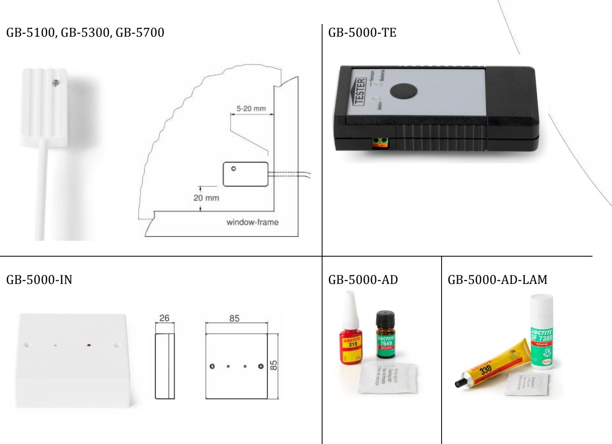

Glaskrossdetektorer

De nya EN 50131-2-7-2 godkãnda glaskrossdetektorserien GB-5000 erbjuder ett stort urval av produkter med fôljande funktioner:

- Stort bevakningsområde
- Låg strömförbrukning
- Visuell larmindikering
- Versioner med strömslinga och reläutgång
- Version för laminerat glas

## Funktioner

### **Användning**

De passiva elektroniska glaskrossdetektorerna i GB-5000 serien står för pålitlig bevakning av glasrutor såsom fönster, skyltfönster och glasdörrar och liknande mot krossning.

### **Funktion**

All krossning av glasrutor genererar vibrationer som fortplantar sig som mekaniska oscillationer. Dessa oscillationer tas emot och konverteras till elektriska signaler av den piezokeramiska sensorn i detektorn. Frekvenserna som krossat glas genererar förstärks av detektorn och analyseras för att avgöra om larm skall ställas ut.

Detektorerna GB-5300 och GB-5700 ansluts till centralapparaten via GB-5000-IN interfacet. Interfacet känner av detektor-slingans ström och reagerar på förändringar i densamma och vid larm ställer den ut det på ett relä. Detta relä kan sedan återställas på plats vid interfacet genom ett litet hål i locket eller genom att bryta strömmen till enheten. GB-5100 ansluts direkt till sektionsingången på centralapparaten då den har ett inbyggt relä. Glaskrossdetektorerna i GB-5000 serien är okänsliga mot störningar från omgivande miljö.

### **Installation**

Glaskrossdetektorerna måste limmas på glasrutan med ett speciellt lim från LOCTITE (se tillbehör). Baksidan på glaskrossdetektorn och motsvarande yta på glaset måste rengöras och avfettas (med sprit eller methylalkohol).

### **Funktionsprov**

Funktionsprov av glaskrossdetektorerna görs efter montaget med testenheten GB-5000- TE.

Vanderbilt © Vanderbilt 2016 023_GB_5000_sv_c..doc 12/08/2016 page 2

Glaskrossdetektorer

## Glaskrossdetektorer

### **Tekniska data**

|                            | GB-5100         | GB-5300         | GB-5700         | GB-5000-IN      |
|----------------------------|-----------------|-----------------|-----------------|-----------------|
| Driftspänning              | 8 – 18 V DC     | 3 – 16 V DC     | 3 – 16 V DC     | 10 – 15 V DC    |
| Intern strömförbrukning    | 0.6 mA          | ˂1 µA (~ 20 nA) | ˂1 µA (~ 20 nA) | 5 mA            |
| Strömförbrukning           | 5 mA (12 V)     | 4 mA (6 V)      | 3.5 mA (6 V)    | 13.5 mA         |
| Resetspänning              | Max. 2 V        | Max. 1 V        | Max. 1 V        |                 |
| Resettid                   | Min. 5 ms       | Min. 12.5 ms    | Min. 12.5 ms    |                 |
| Bevakningsområde, räckvidd | Radie 2 m       | Radie 2 m       | Radie 2 m       |                 |
| Kapslingsstorlek           | 37 x 19 x 12 mm | 37 x 19 x 12 mm | 37 x 19 x 12 mm |                 |
| Växlingsspänning           | Max. 24 V DC    |                 |                 | Max. 24 V DC    |
| Växlingsström              | Max. 200 mA     |                 |                 | Max. 200 mA     |
| Växlingseffekt             | Max. 300 mW     |                 |                 | Max. 300 mW     |
| Kapslingsmaterial          | S-B             | S-B             | S-B             | S-B, A-B-S      |
| Temperaturområde           | -25 °C to 70 °C | -25 °C to 70 °C | -25 °C to 70 °C | -30 °C to 60 °C |
| Kapslingsklass             | IP67            | IP67            | IP67            |                 |
| Miljöklass VdS / EN        | III             | III             | III             | II              |
| Godkännanden               | VdS, EN, SBSC   | VdS, EN, SBSC   | EN, SBSC        | VdS             |

#### **Beställningsinformation**

| Typ            | Artikelnummer    | Beskrivning                                      | Vikt     |
|----------------|------------------|--------------------------------------------------|----------|
| GB-5100-2      | S54535-F101-A100 | Glaskrossdetektor med reläutgång, 2 m kabel      | 0.058 kg |
| GB-5100-6      | S54535-F101-A200 | Glaskrossdetektor med reläutgång, 6 m kabel      | 0.145 kg |
| GB-5300-2      | S54535-F102-A100 | Glaskrossdetektor, 2 m kabel                     | 0.047 kg |
| GB-5300-6      | S54535-F102-A200 | Glaskrossdetektor, 6 m kabel                     | 0.107 kg |
| GB-5300-10     | S54535-F102-A300 | Glaskrossdetektor, 10 m kabel                    | 0.167 kg |
| GB-5700-2      | S54535-F103-A100 | Glaskrossdetektor för laminerat glas, 2 m kabel  | 0.047 kg |
| GB-5700-6      | S54535-F103-A200 | Glaskrossdetektor för laminerat glas, 6 m kabel  | 0.107 kg |
| GB-5700-10     | S54535-F103-A300 | Glaskrossdetektor för laminerat glas, 10 m kabel | 0.167 kg |
| GB-5000-AD     | S54535-N102-A100 | Rengörings- / Limsats för GB-5100 och GB-5300    | 0.136 kg |
| GB-5000-AD-LAM | S54535-N103-A100 | Rengörings- / Limsats för GB-5700                | 0.082 kg |
| GB-5000-TE     | S54535-N101-A100 | Testenhet till GB-5000 serien                    | 0.300 kg |
| GB-5000-IN     | S54550-F112-A100 | Reläinterface för GB-5300 och GB-5700            | 0.08 kg  |

Issued by Vanderbilt Clonshaugh Business and Technology Park Clonshaugh Dublin 17 Ireland www.vanderbiltindustries.com

Vanderbilt © Vanderbilt 2016 023_GB_5000_sv_c..doc 12/08/2016 page 4

Data and design subject to change without notice. Supply subject to availability.