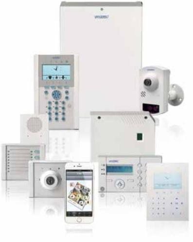

### SPC Kompakt manöverpanel

### SPC Touchmanöverpanel

Vanderbilt`s SPCK520/SPCK521 manöverpaneler erbjuder ett snyggt och överskådligt manöververktyg till SPC systemet, optimerat för flerområdessystem och med inbyggda kortläsare samt talfunktion. Manöverpanelen har en modern design med touchkänsla i handhavandet och smälter in i alla omgivningar.

**Fakta i punktform:** 

- Överskådligt handhavande
 Den kompakta manöverpanelen är ideal att användas i flerområdessystem med sitt användarvänligt handhavande. Den stora LCD displayen kan visa 4 områden i en vy, den har funktionsknappar och en multidimensionell navigationsfunktion som gör systemet lättanvänt med ett minimum av handhavande steg. Kundlogotyp, och snabbfunktionsknappar för brand och medicinsk hjälp kan visas i viloläge.

- Integrerad kortläsare (SPCK521 endast) Den integrerade kortläsaren som både klarar EM4102 och Mifare-kort kan hanteras med bara kort för ett enkelt handhavande och tillsammans med kod för högre säkerhet.
- Trådlös mottagare Den trådlösa mottagaren SPCW114 gör manöverpanelen till en accesspunkt för

trådlösa larmgivare av olika slag.

- Enkel programmering
Manöverpanelen kan anpassas via den själv eller webservern

#### **Manöverpanelsfunktioner:**

- Fullt installatörsläge
- Användarhantering
- Områdesgrupper
- Systemstatus
- Mapping gate styrningar
- SMS inställningar
- Visa loggar
- Flerspröksstöd
- Dörrkontroll

#### **Manöverpanel:**

- Kompatibel med SPC 3.4.5 eller senare.
- Infällnadssats som tillbehör
- Snabbkopplingsplintar för snabbare installation

### SPC Kompakt manöverpanel

#### Tekniska data

| Funktioner           |                                                                |
|----------------------|----------------------------------------------------------------|
| Display              | 128 x 64 pixels (approx. 6 x 20 characters)                    |
| LED indikeringar     | 5 status LED                                                   |
| Specialknappar       | 4 funktionsknappar, 1 multi-dimensionell navigationsknapp      |
| Radiomodul           | Option (SPCW114)                                               |
| Interface            | X-BUS (in, ut)                                                 |
|                      |                                                                |
| Ström och mekanik    |                                                                |
|                      |                                                                |
| Matningsspänning     | 9.5 ~ 14 V DC                                                  |
| Sabotagekontakt      | Frontsabotage/bortbrytningsskydd                               |
| Arbetstemperatur     | 5° ~ +40 °C                                                    |
| Kapsling             | Plastkapsling (PMMA, PC ABS, ABS)                              |
| Färg                 | RAL 9003 (signalvit)                                           |
| Mått                 | 110 x 150 x 17.5 mm                                            |
| Vikt                 | 0.380 kg                                                       |
|                      |                                                                |
| SPCK520 ström     |                                                                |
| Strömförbrukning     | Max. 210 mA vid 12 V DC (belysning, LED och talfunktion aktiv) |
| Viloströmförbrukning | Max. 55 mA vid 12 V DC                                         |
| Audio                | Stöds via integrerad högtalare                                 |
|                      |                                                                |
| SPCK521 ström     |                                                                |
|                      |                                                                |

| Strömförbrukning     | Max. 210 mA vid 12 V DC (belysning, LED och talfunktion aktiv) |  |
|----------------------|----------------------------------------------------------------|--|
| Viloströmförbrukning | Max. 95 mA vid 12 V DC                                         |  |
| Kortläsare           | EM 4102 och Mifare                                             |  |
| Audio                | Stöds via integrerad högtalare                                 |  |

### SPC Kompakt manöverpanel

#### Beställningsdata

| Typ             | Artikelnummer    | Beskrivning                              | Vikt*    |
|-----------------|------------------|------------------------------------------|----------|
| Manöverpanel    | V54543-F115-A100 | SPCK520                                  | 0.325 Kg |
| Manöverpanel    | V54543-F116-A100 | SPCK521                                  | 0.325 Kg |
| Infällnadssats  | V54543-H101-A100 | SPCY520.000 Infällnadssats till SPCK52x  | 0.125 Kg |
| Metallbakstycke | V54543-H102-A100 | SPCY521.000 Metallbakstycke till SPCY520 | 0.325 Kg |
| SiWay-modul     | V54554-B104-A100 | SiWAY RF Modul till SPCK52x              | 0.010 Kg |

* Total produktvikt inklusive tillbehör och förpackning.

### Beställningsdata centralapparater & utökningsenheter

| Typ            | Artikelnummer    | Beskrivning                                                                           |
|----------------|------------------|---------------------------------------------------------------------------------------|
| SPC centraler  |                  |                                                                                       |
| SPC6350.320-L1 | V54541-C118-A100 | SPC centralapparat, 16-512 sektioner, Ethernet, G5 kapsling                           |
| SPC6330.320-L1 | V54541-C105-C100 | SPC centralapparat, 8-512 sektioner, Ethernet, G3 kapsling                            |
| SPC5350.320-L1 | V54541-C117-A100 | SPC centralapparat, 16-128 sektioner, Ethernet, G5 kapsling                           |
| SPC5330.320-L1 | V54541-C107-B100 | SPC centralapparat, 8-128 sektioner, Ethernet, kapsling                               |
| SPC5320.320-L1 | V54541-C106-B100 | SPC centralapparat, 8-128 sektioner, Ethernet, G2 kapsling                            |
| SPC4320.320-L1 | V54541-C109-B100 | SPC centralapparat, 8-32 sektioner, Ethernet, G2 kapsling                             |
| SPC4320.220-L1 | V54541-C114-A100 | SPC centralapparat, 8-32 sektioner, Ethernet, G2 kapsling med plastlock               |
| Manöverpaneler |                  |                                                                                       |
| SPCK620.100    | V54543-F110-A100 | LCD manöverpanel med grafisk display                                                  |
| SPCK623.100    | V54543-F111-A100 | LCD manöverpanel med grafisk display, kortläsare och talfunktion                      |
| SPCK420.100    | V54543-F101-A100 | LCD manöverpanel med 2 x 16 tecken                                                    |
| SPCK421.100    | V54543-F102-A100 | LCD manöverpanel med 2 x 16 tecken och kortläsare                                     |
| Expanders      |                  |                                                                                       |
| SPCE452.100    | V54542-F107-A100 | Expander med 8 utgångar, sabotageskydd                                                |
| SPCE652.100    | V54542-F106-A100 | Expander med 8 sektionsingångar och 2 utgångar, sabotageskydd                         |
| SPCA210.100    | V54547-A101-A100 | Dörrcentral för 2 dörrar                                                              |
| SPCP432.300    | V54545-C103-A100 | Smart PSU med dörrcentral, G2-kapsling för 7Ah ackumulator                            |
| SPCP433.300    | V54545-C104-A100 | Smart PSU med dörrcentral, G3-kapsling för 17Ah ackumulator                           |
| SPCE110.100    | V54542-F104-A100 | Nyckelomkopplare med 2 LED och 3-positions nyckelbrytare                              |
| SPCE120.100    | V54542-F105-A100 | Indikeringsenhet med 16 LED, 4 funktionsknappar och kortläsare                        |
| SPCW130.100    | V54554-F101-B100 | SiWay trådlös mottagarexpander                                                        |
| SPCP332.300    | V54545-C102-A100 | Smart PSU med sektionsexpander 8 in- och 2 utgångar, G2-kapsling för 7Ah ackumulator  |
| SPCP333.300    | S54545-C101-A100 | Smart PSU med sektionsexpander 8 in- och 2 utgångar, G3-kapsling för 17Ah ackumulator |
| SPCP355.300    | S54545-C105-A100 | Smart PSU med 8 sektionsingångar och 6 utgångar, G5-kapsling för 2x27Ah ackumulator   |

| Tillbehör |                  |                                                  |  |
|-----------|------------------|--------------------------------------------------|--|
| IPAW8-10  | V54538-F107-A100 | Trådlös överfallskontakt, bältesmodell           |  |
| IRCW6-11  | V54543-F109-A100 | Trådlös fjärrkontroll, vit med utbytbart batteri |  |
| IPAW6-10  | V54538-F108-A100 | Trådlös överfallskontakt                         |  |

SPC G5 Intrusion System

### SPC Kompakt manöverpanel

| Verifiering                                                                                                         |  |
|---------------------------------------------------------------------------------------------------------------------|--|
| SPCV340.000 V54542-F108-B100 Audioexpander med 4 sektionsingångar och 1 utgång                                |  |
| SPCV341.000 V54542-F109-B100 Audioexpander med 4 sektionsingångar och 1 line-utgång                           |  |
| SPCV310.000 V54542-F120-A100 Audiosatellit                                                                    |  |
| SPCV440.000 V54542-F118-A100 Kombiaudioexpander för MAGIC rörelsedetektor med 4 sektionsingångar och 1 utgång |  |
| SPCV410.000 V54542-F119-A100 Kombiaudiosatellit för MAGIC rörelsedetektor                                     |  |
| CCMS2010-IR S54561-C112-A100 1/2.7" 2MP Kompakt IP Kamera PoE(LAN)                                            |  |

| Kortläsare |                 |                                              |
|------------|-----------------|----------------------------------------------|
| PP500-EM   | V54501-F1-A1    | Beröringsfri läsare för EM-kort och kod      |
| PR500-EM   | V24246-F3913-A1 | Beröringsfri läsare för EM-kort              |
| HD500-EM   | V24246-F3901-A1 | Beröringsfri läsare för EM-kort, vandalsäker |

# Learn more at www.vanderbiltindustries.com

Issued by Vanderbilt Clonshaugh Business and Technology Park Clonshaugh Dublin 17 Ireland www.vanderbiltindustries.com

SPC G5 Intrusion System

P

© Vanderbilt 2016 Data and design subject to change without notice. Supply subject to availability. Document version: b Edition: 01.01.2016

Vanderbilt © Vanderbilt 2016 I-200090-2 page 4