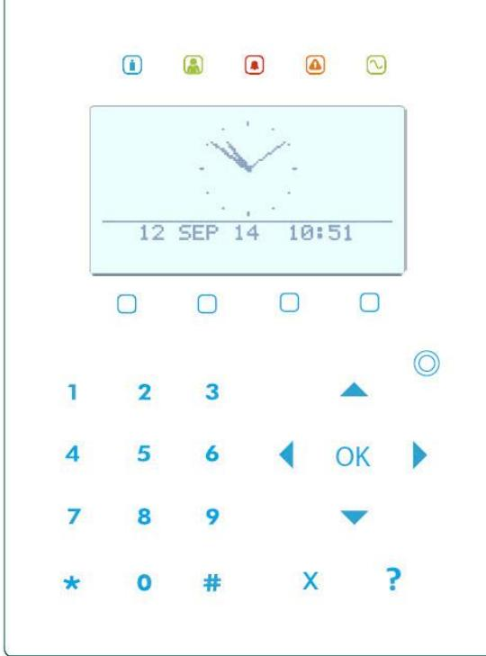
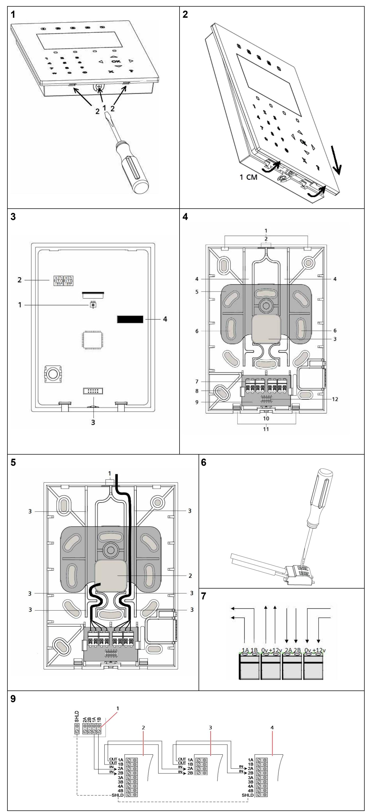

# **SPCK520/SPCK521**

**Compact Keypad, Compact Keypad with CR (en) Kompakt-Bedienteil, Kompakt-Bedienteil mit Kartenleser (de) Teclado compacto, Teclado compacto con lector de tarjetas (es) Clavier compact, Clavier compact avec lecteur de badges (fr) Tastiera compatta, Tastiera compatta con lettore di scheda (it) Compact keypad, Compact keypad met kaartlezer (nl)**

**Kompakt knappsats, Kompakt knappsats med kortläsare (sv)**

Doc. No. I-200002-1, Edition: 01.10.2015

# **English – Installation Instructions**

**Attention:** This device shall only be connected to power supplies compliant to EN60950-1, chapter 2.5 ("limited power source").

#### **Risk of damage to the device**

- Use the device only indoors and in dry environments.
- Do not expose it to dripping or splashing water.
- Do not let the contact areas of the board get dusty and do not touch them with your bare hands.

## **EC Declaration of Conformity**

Hereby, Vanderbilt International (IRL) Ltd declares that this radio equipment type is in compliance with all relevant EU Directives for CE marking. From 20/04/2016 it is in compliance with Directive 2014/30/EU (Electromagnetic Compatibility Directive) and Directive 2014/35/EU (Low Voltage Directive). From 13/06/2016 it is also in compliance with Directive 2014/53/EU (Radio Equipment Directive). The full text of the EU declaration of conformity is available at: http://pcd.vanderbiltindustries.com/doc/SPC

## **Product Description**

The slim and elegant SPCK520 and SPCK521 Compact Keypads are designed with ease of operation in mind. Both keypads are equipped with capacitive touch keys and voice annunciation support.

The SPCK521 Compact Keypad comes with proximity detection for two card technologies (EM4102 and Mifare).

Two optional flush mount products, SPCY520 and SPCY521, enable the keypads to be recessed into the wall.

An optional SiWay RF-Module (SPCW114) is available which provides a wireless interface (868 MHz) for SiWay detectors.

## **Opening the Keypad**

- 1. Loosen the screw at the bottom of the keypad by a couple of turns (Fig. 1, item 1).
- 2. Using a screwdriver, push the clips to disengage the front cover (Fig. 1, item 2).
- 3. Lift the cover no higher than about 1 cm to avoid breaking the restraining lugs and then pull the cover gently down and away from the unit (Fig. 2).

#### **Fig. 3: Keypad Front Cover - Underside**

| 1 | Tamper switch                                                                                                   |
|---|-----------------------------------------------------------------------------------------------------------------|
| 2 | Rotary switches for manually setting X-BUS address                                                              |
| 3 | Connector header                                                                                                |
| 4 | Connector socket for plugin wireless module (refer to the SPCW101/110/111/112/114 Installation Instructions) |

#### **Fig. 4: Keypad Base**

| 1  | Securing lugs for mounting keypad front cover                 |
|----|---------------------------------------------------------------|
| 2  | Cable entry breakout (top)                                    |
| 3  | Cable entry breakout (base)                                   |
| 4  | Cable channel                                                 |
| 5  | Tamper plate                                                  |
| 6  | Mounting screw holes for tamper plate                         |
| 7  | Push wire terminals x 4                                       |
| 8  | Mounting screw holes                                          |
| 9  | Rear mounted PCB                                              |
| 10 | Front cover securing screw                                    |
| 11 | Opening clips for front cover                                 |
| 12 | Connector socket (for connector header on keypad front cover) |

## **Mounting the Base**

- To maximise visibility of the touch keys, mount the keypad away from direct
sunlight.

Ensure that the unit is mounted on surfaces that are sufficiently rigid.

## **Standard Mounting**

- 1. Mark 4 holes on the wall for the fixing screws aligned to the fixing holes on the four corners of the keypad base.
- 2. Drill the holes and screw the base of the unit into the wall.

## **Socket Mounting**

There are a number of screw holes for mounting the keypad on various European outlet sockets.

## **Flush Mounting**

Refer to the *SPCY520 Installation Instructions* for details of how to flush mount the keypad.

For back tamper protection, use the two fixing holes in the breakout plate (Fig. 4, item 6).

## **Connecting Cables**

- 1. Insert the cable through one of the cable entry holes (Fig. 5, item 1 or Fig. 5, item 2).
- 2. Ensure that the cables are securely threaded through the cable channels. If necessary, use micro cable ties through the cable anchor points (Fig. 5, item 3).
- 3. Connect the individual wires to the push wire terminals (Fig. 5, 6, 7).

#### **Fig. 7: Push Wire Terminals**

| Contact Pin | Label | Function              |
|-------------|-------|-----------------------|
| 1           | 1 A   | X-BUS out             |
| 2           | 1 B   | X-BUS out             |
| 3           | 0 V   | Power supply negative |
| 4           | +12 V | Power supply positive |
| 5           | 2 A   | X-BUS in              |
| 6           | 2 B   | X-BUS in              |
| 7           | 0 V   | Power supply negative |
| 8           | +12 V | Power supply positive |

## **Closing the Keypad**

- 1. Hook the top of the front cover into the securing lugs of the keypad base (Fig. 4, item 1) and press downward.
- 2. Press firmly to ensure that the two clips on the base engage fully with the corresponding recesses in the front cover.
- 3. Tighten the screw at the bottom of the unit.

## **Keypad Setup**

When you apply power to the compact keypad, the keypad enters into an initialization mode to calibrate the capacitive touch keys. This initialization mode lasts about 30 seconds.

Do not touch the keypad keys during the initialization mode.

The keypad is delivered with a protective film printed with alphabetical characters to facilitate initial system setup. This film can be removed after the system has been configured.

Refer to the *SPCK520/SPCK521 User Guide* for details of how to adjust the brightness of the keypad screen and numerical characters.

## **Wiring the X-BUS Interface**

The X-BUS interface connects expanders and keypads to the SPC controller. The X-BUS can be wired in a number of different configurations depending on the installation requirements.

|  | Maximum system cable length = number of expanders and keypads in the |
|--|----------------------------------------------------------------------|
|  | system X maximum distance for cable type.                            |

| Cable type                   | Distance |
|------------------------------|----------|
| CQR standard alarm cable     | 200 m    |
| UTP category: 5 (solid core) | 400 m    |

Fig. 8 shows the wiring of X-BUS devices in spur configuration. If using a spur configuration, the last device is not wired back to the controller.

#### **Fig. 8: Wiring X-BUS Devices**

- **1** SPC controller **2** Previous X-BUS device **3** SPCK520/SPCK521 **4** Next X-BUS device
Refer to the *SPC4xxx/5xxx/6xxx Installation & Configuration Manual* of the connected controller for further wiring instructions, specifications, and limitations.

## **X-BUS Addressing**

Refer to the *SPC4xxx/5xxx/6xxx Installation & Configuration Manual* of the connected controller for addressing, reconfiguration, device location, monitoring, editing of names, X-BUS type of communication, and failure timer.

## **Technical Data**

| LCD display           | 128 x 64 pixels (approx. 6 x 20 characters) |  |  |
|-----------------------|---------------------------------------------|--|--|
| Operating current     | SPCK520: Max. 210 mA at 12V DC              |  |  |
|                       | SPCK521: Max. 210 mA at 12V DC              |  |  |
|                       | SPCK520: Max. 55 mA at 12V DC               |  |  |
| Quiescent current     | SPCK521: Max. 95 mA at 12V DC               |  |  |
| Operating voltage     | 9.5 – 14 VDC                                |  |  |
| Field bus             | X-BUS on RS-485 (307 kb/s)                  |  |  |
| Tamper protection     | Type B (per EN50131-3)                      |  |  |
| Tamper contact        | Front/back tamper                           |  |  |
| Supported card        | SPCK521:                                    |  |  |
| technologies          | (EM 4102 and Mifare)                        |  |  |
| Audio                 | Supported via integrated speaker            |  |  |
| Operating temperature | 5 – +40 °C                                  |  |  |
| Relative humidity     | Max. 90 % (non-condensing)                  |  |  |
|                       |                                             |  |  |

| Colour                          | RAL 9003 (signal white)             |  |
|---------------------------------|-------------------------------------|--|
| Mounting                        | Flat surface, wall-mounted          |  |
| Housing                         | Plastic housing (PMMA, PC ABS, ABS) |  |
| Dimensions (W x H x D)          | 110 x 150 x 17.5 mm                 |  |
| Weight                          | 0.25 kg                             |  |
| Housing protection/IP rating | IP30                                |  |

# **Deutsch – Installationsanleitung**

**Achtung:** Dieses Gerät darf nur an Stromquellen angeschlossen werden, die der Norm EN60950-1, Kapitel 2.5 ("Stromquelle mit beschränkter Leistung") entsprechen.

## **Gefahr von Schäden am Gerät!**

- Das Gerät nur in trockenen Innenräumen verwenden.
- Das Gerät weder Tropf- noch Spritzwasser aussetzen.
- Darauf achten, dass die Kontakte an der Platte staubfrei sind und Kontakte nicht mit bloßen Händen berühren.

## **EG-Konformitätserklärung**

Hiermit erklärt Vanderbilt International (IRL) Ltd, dass dieser Funkgerätetyp den Anforderungen aller relevanten EU-Richtlinien für die CE-Kennzeichnung entspricht. Ab dem 20.04.2016 entspricht er der Richtlinie 2014/30/EU (Richtlinie über elektromagnetische Verträglichkeit) und der Richtlinie 2014/35/EU (Niederspannungsrichtlinie). Ab dem 13.06.2016 entspricht er außerdem der Richtlinie 2014/53/EU (Richtlinie über Funkanlagen).

Der vollständige Text der EU-Konformitätserklärung steht unter http://pcd.vanderbiltindustries.com/doc/SPC zur Verfügung.

## **Produktbeschreibung**

Die eleganten Kompakt-Bedienteile der Baureihen SPCK520 und SPCK521 weisen eine geringe Bauhöhe auf und wurden mit Hinblick auf größtmögliche Bedienerfreundlichkeit entwickelt. Beide Bedienteile besitzen kapazitive Sensortasten und unterstützen Sprachansagen für eine sichere und intuitive Bedienung des Systems.

Das SPCK521 Kompakt-Bedienteil unterstützt zwei verschiedene Technologien für berührunglose Kartenleser: EM4102 und Mifare.

Mit den beiden Modelloptionen SPCY520 und SPCY521 für die Unterputzmontage können die Bedienteile auch in die Wand eingelassen werden.

Es ist ein optionales SiWay-Funkmodul (SPCW114) verfügbar, das eine Funkschnittstelle (868 MHz) für SiWay-Detektoren bietet.

## **Öffnen des Bedienteils**

- 1. Die Schraube auf der Bedienteilunterseite mit mehreren Umdrehungen lösen (Abb. 1, Element 1).
- 2. Mit einem Schraubendreher die Nasen nach innen drücken und die Frontplatte aushaken (Abb. 1, Element 2).
- 3. Die Frontabdeckung um höchstens 1 cm anheben damit die Haltelaschen nicht abbrechen - und parallel nach unten vom Gerät abziehen (Abb. 2).

#### **Abb. 3: Frontplatte des Bedienteils - Unterseite**

| 1 | Sabotagekontakt                                                                              |  |
|---|----------------------------------------------------------------------------------------------|--|
| 2 | Drehschalter für die manuelle Einstellung der X-BUS-Adresse                                  |  |
| 3 | Steckbuchse                                                                                  |  |
| 4 | Steckplatz für Funk-Steckmodul (siehe Installationsanleitung für SPCW101/110/111/112/114) |  |

#### **Abb. 4: Bedienteil-Unterteil**

| 1  | Haltelaschen für die Befestigung der Bedienteil-Frontplatte      |
|----|------------------------------------------------------------------|
| 2  | Ausbruchstelle für Kabeleinführung (Oberteil)                    |
| 3  | Ausbruchstelle für Kabeleinführung (Unterteil)                   |
| 4  | Kabelkanal                                                       |
| 5  | Sabotageschutzplatte                                             |
| 6  | Bohrungen für Befestigungsschrauben für die Sabotageschutzplatte |
| 7  | 4 Federkraftklemmen                                              |
| 8  | Bohrungen für Befestigungsschrauben                              |
| 9  | Rückwärtig montierte Platine                                     |
| 10 | Sicherungsschraube für Frontplatte                               |
| 11 | Nasen für Verriegelung der Frontplatte                           |
| 12 | Anschlussbuchse (für Steckerkopf auf Bedienteil-Frontplatte)     |

## **Montieren des Unterteils**

- Das Bedienteil sollte nicht an einem Ort mit direkter Sonneneinstrahlung montiert werden, damit die Sensortasten gut abgelesen werden können.
Das Gerät sollte auf einer ausreichend festen Oberfläche montiert werden.

## **Standardmontage**

- 1. Das Bedienteil-Unterteil anlegen und an der Wand 4 Löcher für die Befestigungsschrauben markieren. Diese Markierungen müssen mit den Öffnungen an den vier Ecken des Bedienteil-Unterteils übereinstimmen.
- 2. Die Löcher für die Befestigungsschrauben bohren und das Geräte-Unterteil festschrauben.
## **Sockelmontage**

Das Bedienteil besitzt eine Reihe von Bohrungen für die Montage auf verschiedenen europäischen Sockeln.

## **Unterputzmontage**

In den *Installationsanleitungen für SPCY520/SPCY521* finden Sie nähere Informationen zur Unterputzmontage des Bedienteils.

Für den rückwärtigen Sabotageschutz die beiden Befestigungsbohrungen in der Ausbruchsplatte (Abb. 4, Element 6) verwenden.

## **Anschließen der Kabel**

- 1. Das Kabel durch eine der dafür vorgesehenen Öffnungen einführen (Abb. 5, Element 1 bzw. Abb. 5, Element 2).
- 2. Es muss sicher gestellt sein, dass die Kabel einwandfrei in die Kabelkanäle eingefädelt sind. Gegebenenfalls können die Kabel mit Mikro-Kabelbindern befestigt werden, die durch die Kabelverankerungspunkte gezogen werden (Abb. 5, Element 3).
- 3. Die einzelnen Adern an die Federkraftklemmen anschließen (Abb. 5, 6, 7).

## **Abb. 7: Federkraftklemmen**

| Anschluss-Pin | Etikett | Funktion                  |
|---------------|---------|---------------------------|
| 1             | 1 A     | X-BUS aus                 |
| 2             | 1 B     | X-BUS aus                 |
| 3             | 0 V     | Stromversorgung, Minuspol |
| 4             | +12 V   | Stromversorgung, Pluspol  |
| 5             | 2 A     | X-BUS ein                 |
| 6             | 2 B     | X-BUS ein                 |
| 7             | 0 V     | Stromversorgung, Minuspol |
| 8             | +12 V   | Stromversorgung, Pluspol  |

## **Bedienteil schließen**

- 1. Die Frontplatte in die Haltelaschen des Bedienteil-Unterteils (Abb. 4, Element 1) einhaken und nach unten drücken.
- 2. Fest drücken, damit die beiden Nasen des Unterteils völlig in die entsprechenden Aussparungen auf der Frontplatte einrasten.
- 3. Die Schraube unten am Gerät festziehen.

## **Bedienteilkonfiguration**

Wenn am Kompakt Bedienteil Spannung angelegt wird, startet der Initialisierungsmodus zum Kalibieren der kapazitiven Berührungstasten. Dieser Vorgang benötigt ungefähr 30 Sekunden.

Während der Initialisierung sollen die Tasten nicht berührt werden.

Das Bedienteil wird mit einer Schutzfolie geliefert, auf der Buchstaben aufgedruckt sind, um die Erst-Systemkonfiguration zu erleichtern. Diese Folie kann nach der Konfiguration des Systems abgezogen werden.

Im *SPCK520/SPCK521-Benutzerhandbuch* finden Sie nähere Informationen zur Einstellung der Helligkeit des Bedienteil-Displays und der Zahlen.

## **Verdrahtung der X-BUS-Schnittstelle**

Die X-BUS-Schnittstelle verbindet Erweiterungsmodule und Bedienteile mit dem SPC-Controller. Der X-BUS kann je nach Anforderungen an die Anlage auf unterschiedliche Weise verdrahtet werden.

| Maximale Systemkabellänge = Anzahl von Erweiterungsmodulen und    |
|-------------------------------------------------------------------|
| Bedienteilen im System mal maximale Entfernung für den jeweiligen |
| Kabeltyp.                                                         |

| Kabeltyp                             | Länge |
|--------------------------------------|-------|
| CQR-Standardalarmkabel               | 200 m |
| UTP-Kategorie: 5 (Massivdrahtleiter) | 400 m |

Abb. 8 veranschaulicht die Verdrahtung von X-BUS-Teilnehmern in

Stichleitungskonfiguration. Bei einer Stichleitungskonfiguration hat das letzte Gerät keine Rückleitung zum Controller.

## **Abb. 8: Verdrahtung von X-BUS-Teilnehmern**

- **1** SPC-Zentrale
- **2** Vorhergehender X-BUS-Teilnehmer
- **3** SPCK520/SPCK521

## **4** Nachfolgender X-BUS-Teilnehmer

Weitere Einzelheiten zur Verdrahtung sowie Spezifikationen und Einschränkungen finden Sie im *SPC4xxx/5xxx/6xxx -Installations- und Konfigurationshandbuch* der angeschlossenen Zentrale.

## **X-BUS-Adressierung**

Einzelheiten zu Adressierung, Neukonfiguration, Geräteanordnung, Überwachung, Namensbearbeitung, X-BUS-Kommunikationstypen, Ausfall-Timer finden Sie im *SPC4xxx/5xxx/6xxx-Installations- und Konfigurationshandbuch*.

## **Technische Daten**

| LCD-Display                        | 128 × 64 Bildpunkte (ca. 6 × 20 Zeichen)           |  |  |
|------------------------------------|----------------------------------------------------|--|--|
| Betriebsstrom                      | SPCK520: Max. 210 mA bei 12 V Gleichspannung       |  |  |
|                                    | SPCK521: Max. 210 mA bei 12 V Gleichspannung       |  |  |
|                                    | SPCK520: Max. 55 mA bei 12 V Gleichspannung        |  |  |
| Ruhestrom                          | SPCK521: Max. 95 mA bei 12 V Gleichspannung        |  |  |
| Betriebsspannung                   | 9,5–14 V DC                                        |  |  |
| Feldbus                            | X-BUS über RS-485 (307 kBit/s)                     |  |  |
| Sabotageschutz                     | Typ B (gemäß EN50131-3)                            |  |  |
| Sabotagekontakt                    | Sabotagekontakt auf der Frontplatte und rückwärtig |  |  |
| Unterstützte Karten                | SPCK521:                                           |  |  |
| Technologien                       | EM 4102 und Mifare                                 |  |  |
| Audio                              | Unterstützt durch integrierten Lautsprecher        |  |  |
| Betriebstemperatur                 | 5 – +40 °C                                         |  |  |
| Rel. Luftfeuchtigkeit              | Max. 90 % (nicht kondensierend)                    |  |  |
| Farbe                              | RAL 9003 (Signalweiß)                              |  |  |
| Montage                            | ebener Untergrund, Wandmontage auf Putz            |  |  |
| Gehäuse                            | Kunststoffgehäuse (PMMA, PC ABS, ABS)              |  |  |
| Abmessungen (B × H × T)         | 110 x 150 x 17,5 mm                                |  |  |
| Gewicht                            | 0,25 kg                                            |  |  |
| Gehäuseschutzart / Schutzklasse | IP30                                               |  |  |

# **Español – Instrucciones de instalación**

**Atención:** Este dispositivo únicamente se conectará a fuentes de alimentación que cumplan la norma EN60950-1, capítulo 2.5 ("Fuente de alimentación limitada").

#### **Riesgo de daños en el dispositivo**

- Utilice el dispositivo únicamente en interiores y en entornos secos.
- No lo exponga al goteo ni a salpicaduras de agua.
- No deje que las superficies de contacto de la placa se cubran de polvo, y no las toque con las manos desnudas.

## **Declaración de conformidad CE**

Por la presente, Vanderbilt International (IRL) Ltd declara que este tipo de equipo de radio cumple con todas las directivas de la UE relevantes para el marcado CE. Desde el 20/04/2016 cumple con la directiva 2014/30/UE (directiva de compatibilidad electromagnética) y con la directiva 2014/35/UE (directiva sobre baja tensión). Desde el 13/06/2016 cumple también con la directiva 2014/53/UE (directiva de equipos radioeléctricos).

El texto completo de la declaración UE de conformidad está disponible en http://pcd.vanderbiltindustries.com/doc/SPC

## **Descripción del producto**

Los esbeltos y elegantes teclados compactos SPCK520 y SPCK521 han sido diseñados pensando en su facilidad de uso. Ambos teclados están equipados con teclas táctiles capacitivas y soporte de ayuda vocal.

El teclado compacto SPCK521 viene con detección de proximidad para dos tecnologías de tarjeta (EM4102 y Mifare).

Dos productos opcionales de montaje a ras, SPCY520 y SPCY521, permiten empotrar los teclados en la pared.

También hay un módulo RF SiWay (SPCW114) disponible opcionalmente que proporciona una interfaz vía radio (868 MHz) para los detectores SiWay.

## **Apertura del teclado**

- 1. Afloje el tornillo en la base del teclado con un par de vueltas (Fig. 1, elemento 1).
- 2. Con un destornillador, abra los clips para desenganchar la cubierta frontal (Fig. 1, elemento 2).
- 3. Levante la cubierta, no más de 1 cm para evitar que se rompan los ojales de sujeción, y, a continuación, baje suavemente la cubierta y retírela de la unidad (Fig. 2).

#### **Fig. 3: Cubierta frontal del teclado, parte inferior**

| 1 | Interruptor de tamper                                                                                                           |  |
|---|---------------------------------------------------------------------------------------------------------------------------------|--|
| 2 | Conmutadores rotativos para ajustar manualmente la dirección del X-BUS                                                          |  |
| 3 | Cabezal de conectores                                                                                                           |  |
| 4 | Zócalo de conectores para módulo vía radio enchufable (consulte las Instrucciones de instalación de SPCW101/110/111/112/114) |  |

## **Fig. 4: Base del teclado**

| 1 | Ojales de sujeción para montaje de la cubierta frontal |  |  |  |  |  |  |
|---|--------------------------------------------------------|--|--|--|--|--|--|
|---|--------------------------------------------------------|--|--|--|--|--|--|

| 2  | Orificio pretroquelado para entrada de cable (parte superior)                         |
|----|---------------------------------------------------------------------------------------|
| 3  | Orificio pretroquelado para entrada de cable (base)                                   |
| 4  | Canaleta de cables                                                                    |
| 5  | Placa de tamper                                                                       |
| 6  | Orificios de tornillos de montaje para placa de tamper                                |
| 7  | 4 clemas de presión                                                                   |
| 8  | Orificios para tornillos de montaje                                                   |
| 9  | PCI de montaje trasero                                                                |
| 10 | Tornillo de fijación de cubierta frontal                                              |
| 11 | Clips de apertura para cubierta frontal                                               |
| 12 | Zócalo de conectores (para cabezal de conector en la cubierta frontal del teclado) |
|    |                                                                                       |

#### **Montaje de la base**

| Para maximizar la visibilidad de las teclas táctiles, monte el teclado apartado de la luz solar directa. |
|-------------------------------------------------------------------------------------------------------------|
| Asegúrese de que la unidad esté montada sobre superficies suficientemente rígidas.                       |

#### **Montaje estándar**

- 1. Marque 4 orificios en la pared para los tornillos de fijación alineados con los orificios de fijación en las cuatro esquinas de la base del teclado.
- 2. Taladre los orificios y atornille la base de la unidad a la pared.

#### **Montaje del zócalo**

Hay una serie de orificios de tornillos para permitir el montaje del teclado en diversos zócalos de salida de distintos países europeos.

#### **Montaje a ras**

Consulte las *Instrucciones de instalación de SPCY520/SPCY521* para más información sobre cómo montar a ras el teclado.

Para la protección de tamper trasera, utilice los dos orificios de fijación en la placa de orificio pretroquelado (Fig. 4, elemento 6).

## **Conexión de los cables**

- 1. Inserte el cable a través de uno de los orificios de entrada de cables (Fig. 5, elemento 1 o Fig. 5, elemento 2).
- 2. Asegúrese de que los cables estén sujetos firmemente con rosca a través de las canaletas de cables. Si es necesario, utilice abrazaderas cables pasándolas a través de los puntos de sujeción de cables (Fig. 5, elemento 3).
- 3. Conecte los hilos individuales a los terminales de inserción de cables (Fig. 5, 6, 7).

#### **Fig. 7: Terminales de inserción de cables**

| Pin de contacto | Etiqueta | Función                          |
|-----------------|----------|----------------------------------|
| 1               | 1 A      | Salida X-BUS                     |
| 2               | 1 B      | Salida X-BUS                     |
| 3               | 0 V      | Alimentación polo negativo       |
| 4               | +12 V    | Polo positivo de la alimentación |
| 5               | 2 A      | Entrada X-BUS                    |
| 6               | 2 B      | Entrada X-BUS                    |
| 7               | 0 V      | Alimentación polo negativo       |
| 8               | +12 V    | Polo positivo de la alimentación |

## **Cierre del teclado**

- 1. Enganche la parte superior de la cubierta frontal en los ojales de fijación de la base del teclado (Fig. 4, elemento 1) y empújela hacia abajo.
- 2. Presione firmemente para asegurarse de que los dos clips de la base encajen con las correspondientes ranuras de la cubierta frontal.
- 3. Apriete el tornillo en la base de la unidad

## **Configuración del teclado**

Al aplicar tensión al teclado compacto, éste entra en modo inicialización durante

30 seg aproximadamente para calibrar las teclas capacitivas.

## ¡No toque ninguna tecla durante ese periodo!

El teclado se suministra con una lámina protectora impresa con caracteres alfabéticos para facilitar la configuración inicial del sistema. Esta lámina se puede retirar una vez configurado el sistema.

Para más información sobre cómo ajustar el brillo de la pantalla del teclado y los caracteres numéricos, consulte el *Manual de usuario del SPCK520/SPCK521*.

## **Cableado de la interfaz X-BUS**

La interfaz X-BUS permite conectar módulos de expansión y teclados al controlador SPC. El X-BUS se puede cablear con un gran número de configuraciones diferentes según los requisitos de la instalación.

Longitud máxima de cables del sistema = número de módulos de expansión y teclados en el sistema × distancia máxima del tipo de cable.

| Tipo de cable                | Distancia |
|------------------------------|-----------|
| Cable de alarma estándar CQR | 200 m     |

| Categoría UTP: 5 (núcleo sólido) | 400 m |
|----------------------------------|-------|
|----------------------------------|-------|

La fig. 8 muestra el cableado de los dispositivos X-BUS con configuración en punta. Si se emplea una configuración en punta, el último dispositivo no se conecta al controlador.

#### **Fig. 8: Cableado de dispositivos X-BUS**

| 1 | Controlador SPC             |
|---|-----------------------------|
| 2 | Dispositivo X-BUS anterior  |
| 3 | SPCK520/SPCK521             |
| 4 | Dispositivo X-BUS siguiente |
|   |                             |

Para más información sobre cableado, especificaciones y limitaciones, consulte el *Manual de instalación y configuración de SPC4xxx/5xxx/6xxx* del controlador conectado.

## **Direccionamiento X-BUS**

Para más información sobre direccionamiento, reconfiguración, ubicación de dispositivos, supervisión, edición de nombres, tipo de comunicación X-BUS o fallo del temporizador, consulte el *Manual de instalación y configuración de SPC4xxx/5xxx/6xxx* del controlador conectado.

## **Datos técnicos**

| Pantalla LCD                           | 128 x 64 píxeles (aprox. 6 x 20 caracteres)                      |
|----------------------------------------|------------------------------------------------------------------|
| Corriente de funcionamiento            | SPCK520: Máx. 210 mA a 12 V CC SPCK521: Máx. 210 mA a 12 V CC |
| Corriente de reposo                    | SPCK520: Máx. 55 mA a 12 V CC SPCK521: Máx. 95 mA a 12 V CC   |
| Voltaje de funcionamiento              | 9,5 – 14 V CC                                                    |
| Bus de campo                           | X-BUS sobre RS-485 (307 kb/s)                                    |
| Protección de tamper                   | Tipo B (por EN50131-3)                                           |
| Contacto de tamper                     | Tamper frontal/trasero                                           |
| Tecnologías de tarjeta admitidas    | SPCK521: (EM 4102 y Mifare)                                   |
| Audio                                  | Soportado mediante altavoz integrado                             |
| Temperatura de funcionamiento          | 5 – +40 °C                                                       |
| Humedad relativa                       | Máx. 90% (sin condensación)                                      |
| Color                                  | RAL 9003 (blanco señal)                                          |
| Montaje                                | En superficie plana, mural                                       |
| Carcasa                                | Carcasa de plástico (PMMA, PC ABS, ABS)                       |
| Dimensiones (An. x Al. x Pr.)          | 110 x 150 x 17,5 mm                                              |
| Peso                                   | 0,25 kg                                                          |
| Protección de la carcasa / grado IP | IP30                                                             |

# **Français – Instructions d'installation**

**ATTENTION :** cet appareil ne doit être connecté qu'à des sources d'alimentation électrique conformes à la norme EN60950-1, chapitre 2.5 (« Source d'énergie limitée »).

**Risque d'endommagement de l'appareil**

- Utilisez l'appareil uniquement à l'intérieur, dans des environnements secs.
- Ne l'exposez pas aux ruissellements ni aux éclaboussures.
- Empêchez l'accumulation de poussière sur les surfaces de contact de la carte et ne les touchez pas les mains nues.

## **Déclaration de conformité CE**

Par la présente, Vanderbilt International (IRL) Ltd déclare que le type d'équipement radio considéré est en conformité avec toutes les directives UE applicables relatives au marquage CE. Il sera en conformité avec les directives 2014/30/UE (directive compatibilité électromagnétique (CEM)) et 2014/35/UE (directive basse tension) à compter du 20.04.2016. Il sera également en conformité avec la directive 2014/53/UE (directive dite RED relative à l'équipement radio) à compter du 13.06.2016.

Le texte intégral de la déclaration de conformité aux directives de l'Union européenne est disponible à http://pcd.vanderbiltindustries.com/doc/SPC

## **Description du produit**

Les claviers compacts SPCK520 et SPCK521, fins et élégants, sont conçus pour une grande facilité d'utilisation. Les deux claviers sont équipés de touches tactiles capacitatives et prennent en charge les annonces vocales.

Le SPCK521 Compact Keypad intègre un détecteur de proximité pour les technologies employant deux cartes (EM4102 et Mifare).

Deux accessoires de montage, le SPCY520 et le SPCY521, permettent d'encastrer les claviers dans le mur.

Un module radio SiWay optionnel (SPCW114) permettant permet d'interfacer les détecteurs et télécommandes radio SiWay (868 MHz).

## **Ouverture du clavier**

1. Desserrez la vis située en bas du clavier de quelques tours (Fig. 1, réf. 1).

- 2. À l'aide d'un tournevis, pousser les agrafes pour dégager le capot avant (Fig. 1, réf. 2).
- 3. Soulevez le capot de moins de 1 cm pour éviter de rompre les languettes de maintient et abaissez-le doucement pour l'éloigner de l'embase (Fig. 2).

#### **Fig. 3 : Partie avant du clavier - face inférieure**

| 1 | Bouton antisabotage                                                                                                |
|---|--------------------------------------------------------------------------------------------------------------------|
| 2 | Commutateur rotatifs pour le réglage manuel de l'adresse X-BUS                                                     |
| 3 | Tête du connecteur                                                                                                 |
| 4 | Connecteur pour le module radio optionnel (reportez-vous au Instructions d'installation du SPC/110/111/112/114) |
|   |                                                                                                                    |

#### **Fig. 4 : base du clavier**

| 1  | Languettes de fixation pour le montage du capot avant du clavier             |
|----|------------------------------------------------------------------------------|
| 2  | Perforation de l'entrée de câble (haut)                                      |
| 3  | Perforation de l'entrée de câble (base)                                      |
| 4  | Goulotte pour câble                                                          |
| 5  | Plaque antisabotage                                                          |
| 6  | Orifices des vis de montage pour la plaque antisabotage                      |
| 7  | Borniers à ressort x 4                                                       |
| 8  | Trous de vis pour fixation                                                   |
| 9  | Carte d'interface de raccordement                                            |
| 10 | Vis de fixation du capot avant                                               |
| 11 | Ouverture des clips du capot avant                                           |
| 12 | Embase de connecteur (pour tête de connecteur sur capot avant du clavier) |
|    |                                                                              |

#### **Fixation de l'embase**

Pour optimiser la visibilité des touches tactiles, montez le clavier à l'abri de la lumière directe du soleil.

Assurez-vous que le clavier est monté sur des surfaces suffisamment rigides.

#### **Montage standard**

- 1. Marquez 4 trous sur le mur pour les vis de fixation, alignés sur les orifices de fixation des quatre coins de la base du clavier.
- 2. Percez les trous et vissez l'embase du clavier dans le mur.

#### **Montage de la douille**

Un certain nombre de trous sont disponibles pour le montage du clavier sur des prises de sortie européennes.

#### **Montage encastré**

Reportez-vous aux *Instructions d'installation du SPCY520/SPCY521* pour obtenir des informations détaillées sur comment monter le clavier dans son adaptateur d'encastrement.

Pour la protection antisabotage, utilisez les deux orifices de la plaque perforée (Fig. 4, réf. 6).

#### **Branchement des câbles**

- 1. Insérez le câble au travers d'un des orifices d'entrée de câble (Fig. 5, réf. 1 ou Fig. 5, réf. 2).
- 2. Assurez-vous que les câbles sont bien tressés au travers des goulottes. Si nécessaire, utilisez un serre câble au travers des points d'ancrage du câble (Fig. 5, réf. 3).
- 3. Connectez chaque câble aux borniers à ressort (Fig. 5, 6, 7).

#### **Fig. 7 : borniers à ressort**

| Borne de contact | Étiquette | Fonction                     |
|------------------|-----------|------------------------------|
| 1                | 1 A       | Sortie X-BUS                 |
| 2                | 1 B       | Sortie X-BUS                 |
| 3                | 0 V       | Alimentation, borne négative |
| 4                | +12 V     | Alimentation, borne positive |
| 5                | 2 A       | Entrée X-BUS                 |
| 6                | 2 B       | Entrée X-BUS                 |
| 7                | 0 V       | Alimentation, borne négative |
| 8                | +12 V     | Alimentation, borne positive |

## **Fermeture du clavier**

- 1. Enclenchez le haut du capot avant dans les languettes de fixation de la base du clavier (Fig. 4, réf. 1) et appuyez vers le bas.
- 2. Appuyez fermement pour s'assurer que les deux crochets situées sur la base s'enclenchent complètement dans les cavités du capot avant.
- 3. Serrez la vis en bas de l'unité.

## **Configuration du clavier**

Lorsque le clavier Compact est mis sous tension, il entre dans une phase d'initialisation pour calibrrer les touches capacitives. La phase de calibration dure environ 30 secondes.

Veuillez à ne pas toucher les touches capacitives du clavier pendant toute la durée de cette phase d'initialisation.

Le clavier est livré avec un film protecteur imprimé avec des caractères alphabétiques pour faciliter la configuration initiale du système. Ce film peut être retiré une fois le système configuré.

Reportez-vous au *Guide de l'utilisateur SCK520/SPCK521* pour plus de détails sur comment ajuster la luminosité de l'écran du clavier et des caractères numériques.

# **Câblage de l'interface X-BUS**

L'interface X-BUS connecte les transpondeurs et les claviers à la centrale SPC. Le X-BUS peut être câblé selon plusieurs configurations différentes en fonction des besoins d'installation.

Longueur maximale du câble système = nombre de transpondeurs et de claviers dans le système x distance maximale pour le type de câble.

| Type de câble                  | Distance |
|--------------------------------|----------|
| Câble d'alarme CQR standard    | 200 m    |
| Catégorie UTP : 5 (âme pleine) | 400 m    |

La fig. 8 montre le câblage des périphériques X-BUS en configuration en boucle ouverte. Si vous utilisez une configuration en boucle ouverte, le dernier périphérique n'est pas câblé en retour sur la centrale.

#### **Fig. 8: câblage du module XBUS**

| 1 | Centrale SPC                 |
|---|------------------------------|
| 2 | Module X-Bus précédent       |
| 3 | SPCK520/SPCK521              |
| 4 | Vers le module X-BUS suivant |
|   |                              |

Veuillez-vous référez au *Manuel d'installation et de configuration du SPC4xxx/5xxx/6xxx* de la centrale correspondante pour obtenir des instructions de câblage, des spécifications et des limitations supplémentaires

## **Adressage du X-BUS**

Référez-vous au *Manuel d'installation et de configuration du SPC4xxx/5xxx/6xxx*  de la centrale correspondante pour l'adressage, la reconfiguration, la localisation du périphérique, la surveillance, l'édition des noms, les types de communication X-BUS.

## **Caractéristiques techniques**

| Écran LCD                       | 128 x 64 pixels (env. 6 x 20 caractères)    |
|---------------------------------|---------------------------------------------|
|                                 | SPCK520 : Max. 210 mA à 12 V CC             |
| Courant de service              | SPCK521 : Max. 210 mA à 12 V CC             |
|                                 | SPCK520 : Max. 55 mA à 12 VCC               |
| Courant de repos                | SPCK521 : Max. 95 mA à 12 V CC              |
| Tension de service              | 9,5 – 14 V CC                               |
| Bus de terrain                  | X-BUS sur RS-485 (307 ko/s)                 |
| Protection antisabotage         | Type B (selon EN50131-3)                    |
| Contact d'antisabotage          | Antisabotage avant / arrière                |
| Technologies à carte prises en  | SPCK521 :                                   |
| charge                          | (EM 4102 et Mifare)                         |
| Audio                           | Prise en charge via haut-parleurs intégrés  |
| Température de fonctionnement   | 5 – +40 °C                                  |
| Humidité relative               | Max. 90 % (sans condensation)               |
| Couleur                         | RAL 9003 (blanc signal)                     |
| Montage                         | Surface plane, montage mural                |
| Boîtier                         | Boîtier en plastique (PMMA, PC ABS, ABS) |
| Dimensions (l x H x P)          | 110 x 150 x 17,5 mm                         |
| Poids                           | 0,25 kg                                     |
| Protection du boîtier/indice IP | IP30                                        |

**Italiano – Istruzioni di installazione**

**Attenzione:** Questo dispositivo può essere collegato solo ad alimentatori conformi alla normativa EN60950-1, capitolo 2.5 ("sorgente di potenza limitata").

- **Pericolo danneggiamento dispositivo**
	- Utilizzare il dispositivo esclusivamente in ambienti interni asciutti.
	- Non esporre il dispositivo a spruzzi o gocce d'acqua.
	- Evitare che le aree di contatto della scheda entrino in contatto con polvere e non toccarle a mani nude.

## **Dichiarazione di conformità CE**

Con la presente Vanderbilt International (IRL) Ltd dichiara che questo tipo di apparecchio radio è conforme a tutte le relative Direttive UE per la marcatura CE. Dal 20/04/2016 è conforme alla Direttiva 2014/30/UE (Direttiva sulla compatibilità elettromagnetica) e Direttiva 2014/35/UE (Direttiva sulla bassa tensione). Dal 13/06/2016 è anche conforme con la Direttiva 2014/53/UE (Direttiva sulle apparecchiature radio).

Il testo completo della dichiarazione di conformità UE è disponibile presso http://pcd.vanderbiltindustries.com/doc/SPC

## **Descrizione del prodotto**

Le tastiere SPCK520 e SPCK521 sono compatte, sottili ed eleganti, e sono state progettate per garantire un facile utilizzo. Entrambe le tastiere sono dotate di tastiere touch capacitative e supporto di annunci vocali.

La tastiera compatta SPCK521 è dotata di un lettore di scheda di prossimità doppia (EM 4102 e Mifare).

Due prodotti di montaggio opzionali, SPCY520 e SPCY521, permettono alle tastiere di essere incassate nella parete.

È disponibile un modulo opzionale RF SiWay (SPCW114) con un'interfaccia wireless (868 MHz) per rilevatori SiWay.

## **Aprire la tastiera**

- 1. Allentare le viti alla base della tastiera di alcuni giri (Fig. 1, elemento 1).
- 2. Usando un cacciavite, spingere i morsetti per liberare il coperchio anteriore (Fig. 1, elemento 2).
- 3. Sollevare il coperchio non più di 1 cm per evitare di rompere le asole, quindi tirare delicatamente il coperchio verso il basso allontanandolo dall'unità (Fig. 2).

#### **Fig. 3: Coperchio frontale della tastiera - Parte inferiore**

| 1 | Interruttore tamper                                                                                                                 |
|---|-------------------------------------------------------------------------------------------------------------------------------------|
| 2 | Interruttori rotativi per l'impostazione manuale dell'indirizzo X-BUS                                                               |
| 3 | Testa connettore                                                                                                                    |
| 4 | Presa del connettore per il modulo wireless plugin (far riferimento alle Istruzioni di installazione di SPCW101/110/111/112/114) |

#### **Fig. 4: Base della tastiera**

| 1  | Asole di fissaggio per il montaggio del coperchio frontale della tastiera               |
|----|-----------------------------------------------------------------------------------------|
| 2  | Punto di passaggio forabile di ingresso cavo (superiore)                                |
| 3  | Punto di passaggio forabile di ingresso cavo (superiore)                                |
| 4  | Canale del cavo                                                                         |
| 5  | Piastra tamper                                                                          |
| 6  | Fori delle viti di montaggio per la piastra tamper                                      |
| 7  | Morsettiere a molla x 4                                                                 |
| 8  | Fori delle viti di montaggio                                                            |
| 9  | PCB montata posteriore                                                                  |
| 10 | Vite di fissaggio del coperchio frontale                                                |
| 11 | Morsetti di apertura per coperchio frontale                                             |
| 12 | Presa del connettore (per testa del connettore su coperchio frontale della tastiera) |
|    |                                                                                         |

## **Montaggio della base**

| Per massimizzare la visibilità dei tasti touch, montare la tastiera lontano dalla luce solare diretta. |
|-----------------------------------------------------------------------------------------------------------|
|                                                                                                           |

- Verificare che l'unità sia montata su superfici sufficientemente rigide.
#### **Montaggio standard**

- 1. Segnare 4 fori sulla parete per le viti di fissaggio, allineate ai fori di fissaggio sui quattro angoli della base della tastiera.
- 2. Praticare i fori e avvitare la base dell'unità nella parete.

#### **Montaggio della presa**

C'è un numero di fori per viti per il montaggio della tastiera su varie prese d'uscita europee.

#### **Montaggio a livello**

Far riferimento alle *Istruzioni di installazione SPCY520/SPCY521* per dettagli su come eseguire il montaggio a livello della tastiera.

- Per la protezione antisabotaggio posteriore usare due fori di fissaggio nella piastra forabile (Fig. 4, elemento 6).

## **Collegare i cavi**

- 1. Inserire il cavo attraverso i fori d'ingresso per cavi (Fig. 5, elemento 1 o Fig. 5, elemento 2).
- 2. Verificare che i cavi siano infilati nei canali per cavi. Se necessario, usare le fascette per micro cavi tramite i punti di ancoraggio per cavi (Fig. 5, elemento 3).
- 3. Collegare i singoli cavi alle morsettiere a molla (Fig. 5, 6, 7).

#### **Fig. 7: Morsettiere a molla**

| Pin di contatto | Etichetta | Funzione               |
|-----------------|-----------|------------------------|
| 1               | 1 A       | Uscita X-BUS           |
| 2               | 1 B       | Uscita X-BUS           |
| 3               | 0 V       | Alimentazione negativa |
| 4               | +12 V     | Alimentazione positiva |
| 5               | 2 A       | Ingresso X-BUS         |
| 6               | 2 B       | Ingresso X-BUS         |
| 7               | 0 V       | Alimentazione negativa |

#### **8** +12 V Alimentazione positiva

## **Chiudere la tastiera**

- 1. Agganciare la parte superiore del coperchio anteriore nelle asole di fissaggio della base della tastiera (Fig. 4, elemento 1) e premere verso il basso.
- 2. Premere saldamente per accertarsi che i due morsetti alla base si incastrino bene con le rientranze corrispondenti nel coperchio anteriore.
- 3. Stringere la vite alla base dell'unità.

## **Configurare la tastiera**

Quando l'alimentazione è applicata alla tastiera compatta, la tastiera entra in una modalità di inizializzazione per calibrare i tasti touch capacitivi. Questa modalità di inizializzazione impiega circa 30 secondi per il completamento.

Non toccare i tasti touch capacitivi durante il periodo di inizializzazione.

La tastiera è consegnata con una pellicola protettiva stampata con caratteri alfanumerici per facilitare la configurazione iniziale del sistema. Questa pellicola può essere rimossa dopo la configurazione del sistema.

Far riferimento alla *Guida utente di SPCK520/SPCK521* per dettagli su come regolare la luminosità dello schermo della tastiera e dei caratteri numerici.

## **Collegamento dell'interfaccia X-BUS**

L'interfaccia X-BUS consente la connessione di espansioni e tastiere al controllore SPC. L'X-BUS può essere collegato in un vasto numero di configurazioni diverse in base ai requisiti d'installazione.

Lunghezza cavo massima del sistema = numero di espansioni e tastiere nel sistema x distanza massima per tipo di cavo.

| Tipo di cavo                   | Distanza |
|--------------------------------|----------|
| Cavo allarme standard CQR      | 200 m    |
| Categoria UTP: 5 (anima piena) | 400 m    |

La Fig. 8 mostra il cablaggio di dispositivi X-BUS in configurazione a spur. Se si usa una configurazione a catena, l'ultimo dispositivo non è collegato al controllore.

#### **Fig. 8: Cablaggio dei dispositivi X-BUS**

| 1 | Controllore SPC              |
|---|------------------------------|
| 2 | Dispositivo X-BUS precedente |
| 3 | SPCK520/SPCK521              |
| 4 | Dispositivo X-BUS successivo |

Per ulteriori istruzioni relative a cablaggio, specifiche tecniche e limitazioni, fare riferimento al *Manuale di configurazione e installazione SPC4xxx/5xxx/6xxx* del controllore collegato.

## **Indirizzamento X-BUS**

Per ulteriori informazioni su indirizzamento, riconfigurazione, posizione del dispositivo, monitoraggio, modifica dei nomi, tipo di comunicazione X-BUS, temporizzatore di guasto, fare riferimento al *Manuale di installazione e configurazione SPC4xxx/5xxx/6xxx*.

| Specifiche tecniche                            |                                                                |  |
|------------------------------------------------|----------------------------------------------------------------|--|
| Display LCD                                    | 128 x 64 pixel (circa 6 x 20 caratteri)                        |  |
| Corrente di esercizio                          | SPCK520: Max. 210 mA a 12 VCC SPCK521: Max. 210 mA a 12 VCC |  |
| Corrente di riposo                             | SPCK520: Max. 55 mA a 12 VCC SPCK521: Max. 95 mA a 12 VCC   |  |
| Tensione di esercizio                          | 9,5 – 14 VCC                                                   |  |
| Bus di campo                                   | X-BUS su RS-485 (307 kb/s)                                     |  |
| Protezione antisabotaggio (tamper)          | Tipo B (per EN50131-3)                                         |  |
| Contatto antisabotaggio (tamper)               | Tamper anteriore/posteriore                                    |  |
| Scheda supportata                              | SPCK521: (EM 4102 e Mifare)                                 |  |
| Audio                                          | Supportato tramite altoparlante integrato                      |  |
| Temperatura di esercizio                       | 5 – +40 °C                                                     |  |
| Umidità relativa                               | Max. 90 % (senza condensa)                                     |  |
| Colore                                         | RAL 9003 (bianco segnale)                                      |  |
| Montaggio                                      | Superficie piatta, montaggio a parete                          |  |
| Alloggiamento                                  | Alloggiamento in plastica (PMMA, PC ABS, ABS)               |  |
| Dimensioni (L x A x P)                         | 110 x 150 x 17,5 mm                                            |  |
| Peso                                           | 0,25 kg                                                        |  |
| Grado di protezione / IP dell'alloggiamento | IP30                                                           |  |

# **Nederlands – Installatie-instructies**

**Attentie:** Sluit dit apparaat alleen aan op voedingseenheden die voldoen aan EN60950-1, hoofdstuk 2.5 ("beperkte stroombon").

#### **Risico op schade aan het apparaat**

- Gebruik het apparaat alleen binnenshuis en in droge omgevingen.
- Stel het apparaat niet bloot aan druip- of spatwater.
- Laat de contactoppervlakken van de kaart niet stoffig worden en raak deze niet aan met blote handen.

## **EC-verklaring van conformiteit**

Hiermee verklaart Vanderbilt International (IRL) Ltd dat dit type radioapparatuur voldoet aan alle toepasselijke EU-richtlijnen voor CE-markering. Vanaf 20-04-2016 voldoet het aan richtlijn 2014/30/EU (Richtlijn Elektromagnetische compatibiliteit) en richtlijn 2014/35/EU (Laagspanningsrichtlijn). Vanaf 13-06-2016 voldoet het ook aan richtlijn 2014/53/EU (Richtlijn Radioapparatuur).

De volledige tekst van de EU-conformiteitsverklaring is beschikbaar op http://pcd.vanderbiltindustries.com/doc/SPC

## **Productbeschrijving**

De slanke en elegante SPCK520 en SPCK521 Compact Keypads zijn ontworpen met het oog op de gebruiksvriendelijkheid. Beide keypads zijn voorzien van capacitieve aanraaktoetsen en ondersteuning voor gesproken meldingen.

Het SPCK521 Compact Keypad wordt geleverd met nabijheidsdetectie voor twee kaarttechnologieën (EM4102 en Mifare).

Twee optionele producten, SPCY520 en SPCY521, maken het mogelijk om de keypads verzonken in de muur te monteren.

Er is als optie een SiWay RF-module (SPCW114) beschikbaar als draadloze interface (868 MHz) voor SiWay detectoren.

## **Het keypad openen**

- 1. Draai de schroeven aan de onderzijde van het keypad met enkele slagen los (Afb. 1, punt 1).
- 2. Duw de clips met een schroevendraaier in om het frontdeksel los te maken (Afb. 1, punt 2).
- 3. Til het deksel niet meer dan circa 1 cm op om te vermijden dat de borglippen breken en trek het deksel dan zachtjes naar beneden en weg van de unit (Afb. 2).

#### **Afb. 3: Frontdeksel Keypad - Onderkant**

| 1 | Sabotageschakelaar                                                                                          |  |
|---|-------------------------------------------------------------------------------------------------------------|--|
| 2 | Draaischakelaars voor manuele instelling van X-BUS adres                                                    |  |
| 3 | Connector                                                                                                   |  |
| 4 | Stekkeraansluiting voor draadloze plugin-module (zie de Installatie instructies SPCW101/110/111/112/114) |  |

#### **Afb. 4: Basis keypad**

| 1                 | Borglippen voor de montage van het frontdeksel van het keypad |  |
|-------------------|---------------------------------------------------------------|--|
| 2                 | Uitdrukstuk kabelingang (bovenaan)                            |  |
| 3                 | Uitdrukstuk kabelingang (onderaan)                            |  |
| 4                 | Kabelkanaal                                                   |  |
| 5                 | Sabotageplaat                                                 |  |
| 6                 | Montagegaten voor de sabotageplaat                            |  |
| 7                 | Drukklemmen voor bedrading x 4                                |  |
| 8                 | Montagegaten                                                  |  |
| 9                 | Achteraan gemonteerde printplaat                              |  |
| 10                | Borgschroef frontdeksel                                       |  |
| 11                | Opening clips voor frontdeksel                                |  |
| 12                | Stekkeraansluiting (voor connectorkop op frontdeksel keypad)  |  |
|                   |                                                               |  |
| De basis monteren |                                                               |  |

#### Om de zichtbaarheid van de aanraaktoetsen te maximaliseren, het keypad monteren buiten het bereik van direct zonlicht.

|  | Controleer of de unit op een voldoende stevige ondergrond wordt |
|--|-----------------------------------------------------------------|
|  | gemonteerd.                                                     |

#### **Standaardmontage**

- 1. Markeer 4 gaten op de muur voor de bevestiging van de schroeven in overeenstemming met de bevestigingsgaten op de vier hoeken aan de onderkant van het keypad.
- 2. Boor de gaten en schroef de onderkant van de unit op de wand.

#### **Montage van contactdozen**

Er zijn een aantal schroefgraten voorzien om het keypad te monteren op diverse Europese contactdozen.

## **Verzonken montage**

Zie de *SPCY520/SPCY521 Installatie-instructies* voor details over een verzonken montage van het keypad.

Gebruik ter bescherming tegen sabotage achteraan de twee boorgaten in de uitbreekplaat (Afb. 4, punt 6).

## **Verbindingskabels**

- 1. Voer de kabel door een van de kabelopeningen (Afb. 5, punt 1 of afb. 5, punt2).
- 2. Controleer of de kabels veilig door de kabelgoten worden geleid. Gebruik, indien nodig, micro-kabelbinders door de kabelankerpunten (Afb. 5, punt 3).
- 3. Sluit de individuele draden aan op de inplugklemmen voor de bedrading (afb. 5, 6, 7).

#### **Afb. 7: Inplugklemmen**

| Contactpen | Etiket | Functie          |
|------------|--------|------------------|
| 1          | 1 A    | X-BUS uit        |
| 2          | 1 B    | X-BUS uit        |
| 3          | 0 V    | Voeding negatief |
| 4          | +12V   | Voeding positief |
| 5          | 2 A    | X-BUS in         |
| 6          | 2 B    | X-BUS in         |
| 7          | 0 V    | Voeding negatief |
| 8          | +12V   | Voeding positief |

## **Het keypad sluiten**

- 1. Haak de bovenkant van het frontdeksel in de borglippen aan de onderkant van het keypad (afb. 4, punt 1) en druk naar beneden.
- 2. Stevig drukken om ervoor te zorgen dat de twee klemmen op de basis volledig in de overeenkomstige uitsparingen in het frontdeksel klikken.
- 3. Draai de schroef aan de onderkant van de unit vast.

## **Instelling keypad**

Bij het opstarten van het compact keypad, zal het keypad in een initialisatiefase gaan om de capacitieve toetsen te kalibreren. Deze kalibratiefase duurt ongeveer 30 seconden.

Raak de capacitieve toetsen niet aan tijdens de initialisatiefase.

Het keypad wordt geleverd met een beschermfilm bedrukt met alfabetische karakters om de aanvankelijke instelling van het systeem te vereenvoudigen. Deze film mag worden verwijderd nadat het systeem is ingesteld.

Zie de *SPCK520/SPCK521 Gebruikersgids* voor details over de regeling van de helderheid van het keypadscherm en de numerieke karakters.

## **Bedrading van X-bus-interface**

De X-Bus-interface verbindt de expanders en keypads met de SPC-controller. Er zijn verschillende bedradingsconfiguraties voor de X-bus mogelijk. Welke wordt gekozen, is afhankelijk van de vereisten van de installatie.

Maximale kabellengte van het systeem = aantal expanders en keypads in het systeem x maximumafstand voor kabeltype.

| Kabeltype                        | Afstand |
|----------------------------------|---------|
| CQR-standaard alarmkabel         | 200 m   |
| UTP-categorie: 5 (massieve kern) | 400 m   |

Afb. 8 toont de bedrading van X-BUS apparaten in lijnconfiguratie. Bij een lijnconfiguratie wordt het laatste apparaat niet terug aangesloten op de controller.

#### **Afb. 8: Bedrading X-bus apparaten**

| 1                                                                       | SPC-controller         |  |
|-------------------------------------------------------------------------|------------------------|--|
| 2                                                                       | Vorig X-BUS apparaat   |  |
| 3                                                                       | SPCK520/SPCK521        |  |
| 4                                                                       | Volgend X-BUS apparaat |  |
| Zie de SPC4xxx/5xxx/6xxx Installatie- en configuratiehandleiding van de |                        |  |

aangesloten controller voor meer informatie over bedrading, specificaties en beperkingen.

## **X-BUS adressering**

Voor informatie over adressering, herconfiguratie, plaats van apparaten, bewaking, bewerken van namen, communicatietypen van X-Bus en storingtimer zie de *SPC4xxx/5xxx/6xxx Installatie- en configuratiehandleiding van de aangesloten controller*.

| Technische gegevens                |                                                                      |  |  |
|------------------------------------|----------------------------------------------------------------------|--|--|
| Lcd-display                        | 128 x 64 pixels (circa . 6 x 20 karakters)                           |  |  |
| Bedrijfsstroom                     | SPCK520: Max. 210 mA bij 12 V DC SPCK521: Max. 210 mA bij 12 V DC |  |  |
| Ruststroom                         | SPCK520: Max. 55 mA bij 12 VDC SPCK521: Max. 95 mA bij 12 V DC    |  |  |
| Bedrijfsspanning                   | 9,5 – 14 VDC                                                         |  |  |
| Veldbus                            | X-bus op RS-485 (307 kb/s)                                           |  |  |
| Beveiliging tegen sabotage         | Type B (per EN50131-3)                                               |  |  |
| Sabotagecontact                    | Sabotageschakelaar voor/achter                                       |  |  |
| Ondersteunde kaarttechnologieën | SPCK521: (EM 4102 en Mifare)                                      |  |  |
| Audio                              | Ondersteund via ingebouwde luidspreker en microfoon               |  |  |
| Bedrijfstemperatuur                | 5 - +40°C                                                            |  |  |
| Relatieve vochtigheid              | Max. 90% (niet-condenserend)                                         |  |  |

| Kleur                                    | RAL 9003 (signaalwit)                  |
|------------------------------------------|----------------------------------------|
| Montage                                  | Vlak oppervlak, wandmontage            |
| Behuizing                                | Kunststofbehuizing (PMMA, PC ABS, ABS) |
| Afmetingen (B x H x D)                   | 110 x 150 x 17,5 mm                    |
| Gewicht                                  | 0,25 kg                                |
| Beveiliging van behuizing / IP-klasse | IP30                                   |

# **Svenska – Installationsinstruktioner**

**Observera:** Denna enhet får endast anslutas till strömkällor som uppfyller kraven för EN60950-1, kapitel 2.5 ("limited power source" (begränsad strömkälla)).

## **Risk för skada på enheten**

- Använd enheten endast inomhus och i torra miljöer.
- Utsätt den inte för droppande eller stänkande vatten.
- Låt inte kontaktytorna på kortet bli dammiga och rör dem inte med bara händerna.

## **EG-försäkran om överensstämmelse**

Härmed försäkrar Vanderbilt International (IRL) Ltd att denna typ av radioutrustning överensstämmer med alla relevanta EG-direktiv för CE-märkning. Från 20/04/2016 överensstämmer den med direktiv 2014/30/EG (Direktiv om elektromagnetisk kompatibilitet) och direktiv 2014/35/EG (Direktiv om lågspänning). Från 13/06/2016 överensstämmer den även med direktiv 2014/53/EG (Direktiv om radioutrustning).

Den fullständiga texten för EG-försäkran om överensstämmelse finns på http://pcd.vanderbiltindustries.com/doc/SPC

## **Produktbeskrivning**

De smala och eleganta knappsatserna för SPCK520 och SPCK521 är utformade med enkel användning i åtanke. Båda knappsatserna är utrustade med kapacitiva pektangenter och har stöd för röstsignalering.

Den kompakta knappsatsen SPCK521 levereras med närhetsdetektering för två korttekniker (EM 4102 och Mifare).

Två valfria infällningsprodukter, SPCY520 och SPCY521, gör det möjligt att fälla in knappsatserna i en vägg.

En valfri SiWay RF-modul (SPCW114) finns tillgänglig för att ge ett trådlöst gränssnitt (868 MHz) för SiWay-detektorer.

## **Öppna knappsatsen**

- 1. Lossa skruvarna på knappsatsens undre del några varv (Fig. 1, objekt 1).
- 2. Tryck in klämmorna med en skruvmejsel för att lossa det främre höljet (Fig. 1, objekt 2).
- 3. Lyft inte höljet mer än 1 cm för att undvika att spärröglorna går sönder och dra sedan ner höljet försiktigt och bort från enheten (Fig. 2).

## **Fig. 3: Knappsatsens främre hölje - Undersida**

| 1 | Sabotagebrytare                                                                                  |
|---|--------------------------------------------------------------------------------------------------|
| 2 | Vridomkopplare för manuell inställning av X-BUS-adress                                           |
| 3 | Kontaktheader                                                                                    |
| 4 | Kontaktuttag för trådlös plugin-modul (se SPCW101/110/111/112/114 Installationsinstruktioner) |

## **Fig. 4: Knappsatsens bas**

| 1 | Säkerhetsöglor för montering av knappsatsens främre hölje |
|---|-----------------------------------------------------------|
| 2 | Kabelingångens utgrening (överdel)                        |
| 3 | Kabelingångens utgrening (bas)                            |
| 4 | Kabelkanal                                                |
| 5 | Sabotageplatta                                            |
| 6 | Monteringsskruvhål för sabotageplatta                     |
| 7 | Snabbkopplingsplint x 4                                   |
| 8 | Monteringsskruvhål                                        |

| 9  | Kretskort monterat på baksidan                                |
|----|---------------------------------------------------------------|
| 10 | Fästskruv för främre hölje                                    |
| 11 | Öppningsklämmor för främre hölje                              |
| 12 | Kontaktuttag (för kontaktheader på knappsatsens främre hölje) |

## **Montera basen**

| Maximera synligheten av pektangenterna genom att montera knappsatsen på en plats där den inte befinner sig i direkt solljus. |
|---------------------------------------------------------------------------------------------------------------------------------|
|                                                                                                                                 |

|  | Säkerställ att enheten är monterad på en yta som är tillräckligt stabil. |  |  |  |
|--|--------------------------------------------------------------------------|--|--|--|
|--|--------------------------------------------------------------------------|--|--|--|

## **Standardmontering**

- 1. Markera 4 hål på väggen där fästskruvarna riktas in mot fästhålen vid knappsatsbasens fyra hörn.
- 2. Borra hålen och skruva fast enhetens bas på väggen.

## **Uttagsmontering**

Det finns flera skruvhål för montering av knappsatsen på ett antal olika europeiska uttag.

#### **Infälld montering**

Se *SPCY520/SPCY521 Installationsinstruktioner* för detaljer om hur knappsatsen fälls in.

Som sabotageskydd för baksidan, använd de två fästhålen på utgreningsplattan (Fig. 4, objekt 6).

## **Anslutning av kablar**

- 1. För in kabeln genom ett av kabelingångshålen (Fig. 5, objekt 1 eller Fig. 5, objekt 2).
- 2. Säkerställ att kablarna förs igenom på säkert vis genom kabelkanalerna. Vid behov, använd mikrokabelband på kabelns ankarpunkter (Fig. 5, objekt 3).
- 3. Anslut individuella ledningar till snabbkopplingsplintar (Fig. 5, 6, 7).

#### **Fig. 7: Snabbkopplingsplintar**

| Kontaktstift | Etikett | Funktion                 |
|--------------|---------|--------------------------|
| 1            | 1 A     | X-BUS ut                 |
| 2            | 1 B     | X-BUS ut                 |
| 3            | 0 V     | Strömförsörjning negativ |
| 4            | +12 V   | Strömförsörjning positiv |
| 5            | 2 A     | X-BUS in                 |
| 6            | 2 B     | X-BUS in                 |
| 7            | 0 V     | Strömförsörjning negativ |
| 8            | +12 V   | Strömförsörjning positiv |

## **Försluta knappsatsen**

- 1. Fäst den övre delen av det främre höljet på knappsatsbasens säkerhetsöglor (Fig. 4, objekt 1) och tryck nedåt.
- 2. Tryck hårt för att säkerställa att de två klämmorna på basen sitter fast ordentligt i motsvarande fördjupningar i det främre höljet.
- 3. Dra åt skruvarna på enhetens underdel.

## **Knappsatsens inställning**

När strömmen slås på till den kompakta knappsatsen, går knappsatsen in i ett initiering läge för att kalibrera de kapacitiva touchknapparna. Detta initiering läge tar ungefär 30 sekunder att genomföra.

Rör inte de kapacitiva touchknapparna under initieringen perioden.

Knappsatsen levereras med en skyddsfilm försedd med alfabetiska tecken för att underlätta den ursprungliga systeminställningen. Denna film kan tas av efter att systemet har konfigurerats.

Se *SPCK520/SPCK521 Bruksanvisning* för detaljer om hur ljusstyrkan på knappsatsens skärm och de numeriska tecknen kan justeras.

## **Koppling av X-BUS-gränssnittet**

X-BUS-gränssnittet ansluter expansionsenheter och knappsatser till SPCcentralapparaten. Kopplingen av X-BUS kan göras på många olika sätt beroende på installationskrav.

Maximal längd för systemkabel = antal expansionsenheter och knappsatser i systemet x maxavstånd för kabeltypen.

| Kabeltyp                       | Avstånd |
|--------------------------------|---------|
| CQR standard larmkabel         | 200 m   |
| UTP-kategori: 5 (solid ledare) | 400 m   |

Fig. 8 visar kopplingen av X-BUS-enheter i kedjekonfiguration. Vid användning av kedjekonfiguration kopplas den sista enheten inte tillbaka till centralapparaten.

#### **Fig. 8: Koppling av X-BUS-enheter**

| 1 | SPC-centralapparat   |  |
|---|----------------------|--|
| 2 | Tidigare X-BUS-enhet |  |
| 3 | SPCK520/SPCK521      |  |
| 4 | Nästa X-BUS-enhet    |  |
|   |                      |  |

Se *SPC4xxx/5xxx/6xxx Installations- & konfigurationsanvisningen* för den anslutna centralapparaten för fler kopplingsinstruktioner, specifikationer och begränsningar.

## **X-BUS-adressering**

Se *SPC4xxx/5xxx/6xxx Installations- & konfigurationsanvisningen* för den anslutna centralapparaten för att få mer information om adressering, omkonfigurering, enhetslokalisering, övervakning, redigering av namn, X-BUS-kommunikationstyp och timerfunktion vid fel.

## **Tekniska data**

| LCD-display   | 128 x 64 pixlar (cirka 6 x 20 tecken) |
|---------------|---------------------------------------|
|               | SPCK520: Max. 210 mA vid 12 V DC      |
| Driftsström   | SPCK521: Max. 210 mA vid 12 V DC      |
|               | SPCK520: Max. 55 mA vid 12 V DC       |
| Viloström     | SPCK521: Max. 95 mA vid 12 V DC       |
| Driftspänning | 9,5 ~ 14 V DC                         |
| Fältbuss      | X-BUS på RS-485 (307 kb/s)            |
| Sabotageskydd | Typ B (per EN50131-3)                 |

| Sabotagekontakt         | Främre/bakre sabotagebrytare     |
|-------------------------|----------------------------------|
| Korttekniker som stöds  | SPCK521: (EM 4102 och Mifare) |
| Ljud                    | Stöds via integrerad högtalare   |
| Drifttemperatur         | 5 – +40 °C                       |
| Relativ luftfuktighet   | Max. 90 % (icke-kondenserande)   |
| Färg                    | RAL 9003 (vit signal)            |
| Montering               | Yt-, väggmontering               |
| Hölje                   | Plasthölje (PMMA, PC ABS, ABS)   |
| Mått (B x H x D)        | 110 x 150 x 17,5 mm              |
| Vikt                    | 0,25 kg                          |
| Höljeskydd/IP-klassning | IP30                             |