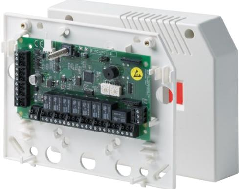
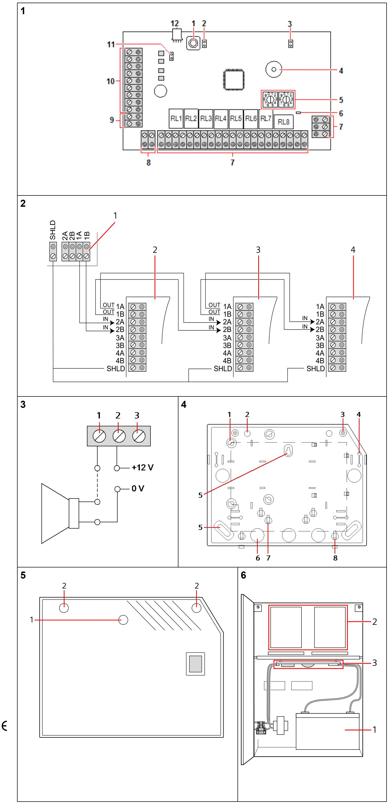

# **SPCE450/452**

**Expander with 8 relay outputs (en) Expansor de 8 salidas (es) Uitbreiding met 8 relaisuitgangen (nl) Espansione con 8 uscite relè (it) Expansionsenhet med 8 reläutgångar (sv) Erweiterungsmodul mit 8 Relaisausgängen (de) Transpondeur avec 8 sorties de relais (fr)**

STEP: A6V10209234, Edition: 01.10.2015

# **English – Instructions**

**WARNING:** Before starting to install and work with this device, please read the Safety Instructions.

- This device shall only be connected to power supplies compliant to EN60950- 1, chapter 2.5 ("limited power source"). -
When changing or installing an SPCE450/452 on the SPC system, ensure that all anti-static precautions are adhered to while handling connectors, wires, terminals and PCBs.

#### **EC Declaration of Conformity**

Hereby, Vanderbilt International (IRL) Ltd declares that this equipment type, is in compliance with all relevant EU Directives for CE marking. From 20/04/2016 it is in compliance with Directive 2014/30/EU (Electromagnetic Compatibility Directive). The full text of the EU declaration of conformity is available at:

http://pcd.vanderbiltindustries.com/doc/SPC

#### **Introduction to the SPCE450/452**

The SPCE450/452 allows an existing system to be expanded, providing 8 outputs for use on the SPC system. The SPCE450/452 incorporates the following elements, as shown in Fig. 1.

- 1. **Tamper by-pass [J1]:** The jumper setting determines the operation of the tamper. The tamper operation can be overridden by fitting J1. The engineer must ensure that J1 is removed before leaving site for the system to comply with standards.
- 2. **Front tamper switch:** The expander has a front tamper switch with spring. When the lid is closed the spring closes the switch.
- 3. **Back tamper by-pass [JP6].**
- 4. **Buzzer:** The buzzer is activated in order to locate the Expander (see SPC Configuration Manual).
- 5. **Manual addressing switches:** The switches allow manual setting of the ID of each expander in the system.
- 6. **X-BUS status LED:** The LED indicates the status of the X-BUS when the system is in FULL ENGINEER mode, as shown below:

| LED status                                            | Description                                                                         |
|-------------------------------------------------------|-------------------------------------------------------------------------------------|
| Flashes regularly (once every 1.5 seconds approx.) | The X-BUS communications status is OK.                                              |
| Flashes quickly (once every 0.2 seconds approx.)   | Indicates the last in line expander (excludes star and multi-drop configuration) |

- 7. **Outputs:** The expander provides 8 programmable outputs for use on the SPC-series system.
- 8. **Auxiliary power supply (12 V):** These are used to power auxiliary devices to a maximum of 200 mA.
- 9. **Input power:** The expander requires 12 V DC that can be supplied directly from the SPC-series controller or from a SPC PSU expander.
- 10.**X-BUS Interface:** The communication bus is used to connect expanders together on the SPC-series system. See Section - Wiring the X-BUS interface.
- 11.**Termination Jumper:** This jumper as a default is always fitted, however, when wiring for Star configuration this fitting should be removed. See section - Wiring the X-BUS interface.
- 12.**PSU 4-pin Interface**: Connects to item 9, Power and Data Connector, with a straight through cable.

#### **SPCE452**

Please ensure the back tamper spring has been fitted to the underside of the expander housing. The spring should be perpendicular to the exit aperture hole and be firmly connected to the switch plunger on the internal PCB.

#### **Wiring the X-BUS interface**

The X-BUS interface provides connection of expanders and keypads to the SPC controller. The X-BUS can be wired in a number of different configurations depending on the installation requirements.

NOTE: Maximum system cable length = number of expanders and keypads in the system x maximum distance for cable type.

| Cable type                   | Distance |
|------------------------------|----------|
| CQR standard alarm cable     | 200 m    |
| UTP category: 5 (solid core) | 400 m    |
| Belden 9829                  | 400 m    |
| IYSTY 2 x 2 x 0.6 (min)      | 400 m    |

Fig. 2 shows the wiring of the X-BUS to an expander/controller and the following expander/controller in spur configuration. Terminals 3A/3B and 4A/4B are only used for using a branch wiring technique.

If using a spur configuration, the last expander is not wired back to the controller.

#### **See Fig. 2: Wiring of expanders**

- **1** SPC controller
- **2** Previous expander
- **3** SPCE450/452

**4** Next expander

Please refer to SPC Configuration Manual of connected controller for further wiring instructions, shielding, specifications and limitations.

#### **Wiring the outputs**

The SPCE450/452 has 8 on-board 1-Amp, single pole changeover relays that can be assigned to any of the SPC system outputs. These relay outputs can switch a rated voltage of 30 V DC (non-inductive load).

Fig. 3 shows the wiring of an active high output. When the relay is activated, the Common terminal connection (COM) is switched from the Normally Closed terminal (NC) to the Normally Open terminal (NO).

#### **See Fig. 3: Wiring of a standard +12 V siren**

- **1** Normally Open terminal (NO)
- **2** Common terminal connection (COM)
- **3** Normally Closed terminal (NC)

#### **X-BUS addressing**

For addressing, reconfiguration, device location, monitoring, editing of names, X-BUS type of communication, failure timer please refer to SPC Configuration Manual.

#### **Mounting expander in SPC hinged enclosure**

The SPCE450/452 may also be installed in a hinged enclosure. This enclosure can accommodate

- 1 battery (17 Ah max.), 1 SPC controller and a possible 4 I/O expanders, or
- 1 battery (17 Ah max.), 1 SPC PSU expander and a possible 3 I/O expanders.

To access or install an expander:

- 1. Open the front cover on the enclosure.
- 2. With an appropriate screwdriver loosen (but do not remove) the top two screws on the mounting bracket.
- 3. Gently push the mounting bracket in an upward direction until the screws are free from contact with the bracket.
- 4. Slowly but firmly pull the mounting bracket out until it rotates down and is secured by the resting pins.
- 5. The underside of the mounting bracket and the enclosure provides space for additional expanders to be installed (secured by 4 mounting pillars).

#### **See Fig. 6: Rotated views**

- **1** Battery
- **2** Expanders
- **3** SPC controller or SPC PSU

#### **Appendix**

#### **See Fig. 4: SPCE450/452 enclosure specifications**

- **1** Expander anchor points
- **2** Wall spacers
- **3** Cover anchor points
- **4** Cable grips
- **5** Mounting holes
- **6** Cable entry holes
- **7** Cable ties
- **8** Cover hooks

#### **See Fig. 5: Expander cover**

- **1** Front tamper guide
- **2** Cover fixing screws

#### **Technical Data**

| Operating voltage               | 9.5 – 14 V DC                                                                |
|---------------------------------|------------------------------------------------------------------------------|
| Current consumption             | Min. 40 mA at 12 V DC                                                        |
|                                 | Max. 190 mA at 12 V DC                                                       |
| Number of on-board relays    | 8 single-pole changeover,                                                    |
|                                 | 30 V DC / 1 A (resistive switching current)                               |
|                                 | X-BUS on RS485 (307 kb/s)                                                    |
| Field bus                       |                                                                              |
| Interfaces                      | X-BUS (In, Out, Branch)                                                      |
| Tamper contact                  | On-board front spring tamper SPCE452: On-board front / back spring tamper |
| Operating temperature        | -10 to +50 °C                                                                |
| Relative humidity               | Max. 90 % (no condensation)                                                  |
| Housing protection/IP rating | IP30                                                                         |
| Colour                          | RAL 9003                                                                     |
| Housing protection class     | Class II Indoor General                                                      |
| Mounting                        | Surface, wall-mounted                                                        |
| Dimensions                      | Enclosure: 200 x 153 x 47 mm                                                 |
| (W x H x D)                     | PCB: 150 x 82 x 20 mm                                                        |
| Weight                          | 0.40 kg                                                                      |
| Housing material                | ABS                                                                          |
| Housing                         | Plastic enclosure                                                            |

EN50131-1:2006 (Grade 2 and 3), TS50131-3:2003 (Grade 3), SSF 1014:3 Alarm Class 1, SSF 1014:3 Alarm Class 2 (only SPCE452)

# **Deutsch – Anweisungen**

- **WARNUNG:** Lesen Sie vor der Installation und Verwendung dieses Geräts die Sicherheitshinweise. Das Gerät darf nur an einer Stromversorgung angeschlossen werden, welche der Norm EN 60950-1 / Kapitel 2.5 ("limited power source") entspricht.
Beim Austauschen oder Installieren eines SPCE450/452 im SPC-System müssen während der Handhabung von Anschlüssen, Drähten, Klemmen und Platinen alle Antistatik-Maßnahmen getroffen werden.

# **EG-Konformitätserklärung**

Hiermit erklärt Vanderbilt International (IRL) Ltd, dass dieser Gerätetyp den Anforderungen aller relevanten EU-Richtlinien für die CE-Kennzeichnung entspricht. Ab dem 20.04.2016 entspricht er der Richtlinie 2014/30/EU (Richtlinie über elektromagnetische Verträglichkeit).

Der vollständige Text der EU-Konformitätserklärung steht unter http://pcd.vanderbiltindustries.com/doc/SPC zur Verfügung.

#### **SPCE450/452 – Einführung**

Das SPCE450/452 ermöglicht durch die Bereitstellung von 8 Ausgängen für die Verwendung im SPC-System, ein vorhandenes System zu erweitern. Das SPCE450/452 besteht aus folgenden Komponenten, die in Abb. 1 dargestellt sind:

- 1. **Tamper Bypass [J1]:** Die Jumper-Einstellung legt den Betrieb des Sabotagealarms fest. Der Sabotagebetrieb kann durch Stecken von Jumper J1 umgangen werden. Der Techniker muss vor Verlassen des Standorts sicherstellen, dass J1 entfernt wird, damit das System den Normen entspricht.
- 2. **Sabotageschalter auf der Frontplatte:** Das Erweiterungsmodul hat einen Sabotageschalter mit Feder auf der Frontplatte. Beim Schließen des Deckels schließt die Feder den Schalter.
- 3. **Bypass für rückwärtigen Sabotagekontakt [JP6].**
- 4. **Summer:** Der Summer wird aktiviert, um das Erweiterungsmodul zu lokalisieren (siehe Konfigurationshandbuch).
- 5. **Schalter zum manuellen Adressieren:** Die Schalter ermöglichen das manuelle Einstellen der ID jedes Erweiterungsmoduls im System.
- 6. **X-BUS-Status-LED:** Die LED zeigt den Status des X-Bus an, wenn sich das System wie unten dargestellt im Konfigurationsmodus befindet:

| LED-Status                                   | Beschreibung                                                                                                      |
|----------------------------------------------|-------------------------------------------------------------------------------------------------------------------|
| Blinkt regelmäßig (ca. alle 1,5 Sekunden) | Status der X-BUS-Kommunikation ist OK.                                                                            |
| Blinkt schnell (ca. alle 0.2 Sekunden)    | Zeigt letztes Erweiterungsmodul in der Reihe an (berücksichtigt keine Stern- und Multidrop-Konfigurationen) |

- 7. **Ausgänge:** Das Erweiterungsmodul stellt 8 programmierbare Ausgänge für die Verwendung in Systemen der SPC-Reihe zur Verfügung.
- 8. **Hilfsausgangsspannung (12 V):** Wird verwendet, um Hilfsausgänge mit maximal 200 mA zu versorgen.
- 9. **Versorgungsspannung:** Das Erweiterungsmodul benötigt eine 12-V-Gleichstromversorgung, die direkt vom SPC-Controller oder einem SPC PSU-Erweiterungsmodul bereitgestellt werden kann.
- 10. **X-BUS-Schnittstelle:** Der Kommunikationsbus verbindet die Erweiterungsmodule im SPC-System untereinander. Siehe Abschnitt Verdrahtung der X-BUS-Schnittstelle.
- 11. **Abschluss-Jumper:** Dieser Jumper ist standardmäßig immer gesteckt, muss jedoch bei einer Sternkonfiguration entfernt werden. Siehe Abschnitt Verdrahtung der X-BUS-Schnittstelle.
- 12. **4-poliger PSU-Stecker:** Wird mit einem ungekreuzten Kabel an Element 9, Strom- und Datenanschluss, angeschlossen.

# **SPCE452**

Achten Sie darauf, dass der Sabotagekontakt an der Unterseite des Expandergehäuses angebracht ist. Die Feder sollte senkrecht zur Kabelaustrittsöffnung angebracht und fest mit dem Plunger auf der internen

Leiterplatte verbunden sein.

#### **Verdrahtung der X-BUS-Schnittstelle**

Die X-BUS-Schnittstelle stellt die Verbindungen von Erweiterungsmodulen und Bedienteilen zum SPC-Controller her. Der X-BUS kann je nach Anforderungen der Installation auf unterschiedliche Weise verdrahtet werden.

HINWEIS: Maximale Systemkabellänge = Anzahl von Erweiterungsmodulen und Bedienteilen im System mal maximale Entfernung nach Kabeltyp.

| Kabeltyp                     | Abstand |
|------------------------------|---------|
| CQR Standard-Alarmkabel      | 200 m   |
| UTP Kategorie 5 (solid core) | 400 m   |
| Belden 9829                  | 400 m   |
| IYSTY 2 x 2 x 0.6 (min.)     | 400 m   |

Abb. 2 zeigt die Verdrahtung des X-BUS mit dem Erweiterungsmodul/Controller und das/den folgende/n Erweiterungsmodul/Controller in Stichleitungskonfiguration. Die Klemmen 3A/3B und 4A/4B werden nur für Abzweigverdrahtungen verwendet.

Bei einer Stichleitungskonfiguration hat das letzte Erweiterungsmodul keine Rückleitung zum Controller.

#### **Siehe Abb. 2: Verdrahtung von Erweiterungsmodulen**

- **1** SPC-Controller
- **2** Vorangegangenes Erweiterungsmodul
- **3** SPCE450/452

**4** Nächstes Erweiterungsmodul

Weitere Einzelheiten zur Verdrahtung und Abschirmung sowie Spezifikationen und Einschränkungen enthält das SPC Konfigurationshandbuch des angeschlossenen Controllers.

## **Verdrahtung der Ausgänge**

Das SPCE450/452 verfügt on-board über 8 einpolige 1-A-Umschaltrelais, die jedem beliebigen Ausgang des SPC-Systems zugewiesen werden können. Diese Relaisausgänge können eine Nennspannung von 30 V DC schalten (nicht induktive Last).

Abb. 3 zeigt die Verdrahtung eines Active-high-Ausgangs. Wenn das Relais aktiviert wird, wird die gemeinsame Klemme (COM) von einem Ruhekontakt (NC) auf einen Arbeitskontakt (NO) umgeschaltet.

#### **Siehe Abb. 3: Verdrahtung einer +12-V-Standardsirene**

- **1** Arbeitskontakt (NO)
- **2** Gemeinsame Klemme (COM)
- **3** Ruhekontakt (NC)

# **X-BUS-Adressierung**

Einzelheiten zu Adressierung, Rekonfiguration, Geräteanordnung, Überwachung, Namensbearbeitung, X-BUS-Kommunikationstyp, Ausfall-Timer enthält das SPC Konfigurationshandbuch.

#### **Montieren des Erweiterungsmoduls im SPC-Gehäuse mit klappbarer Frontplatte**

Das SPCE450/452 kann auch in einem Gehäuse mit klappbarer Frontplatte installiert werden. In diesem Gehäuse kann Folgendes untergebracht werden:

- 1 Batterie (max. 17 Ah), 1 SPC-Controller und ein Erweiterungsmodul mit 4 E/A oder
- 1 Batterie (max. 17 Ah), 1 SPC PSU-Erweiterungsmodul und ein Erweiterungsmodul mit 3 E/A.

Installation oder Zugriff auf ein Erweiterungsmodul:

- 1. Öffnen Sie die Frontplatte des Gehäuses.
- 2. Lösen Sie mit einem geeigneten Schraubendreher die beiden oberen Schrauben an der Halterung (ohne sie zu entfernen).
- 3. Schieben Sie die Halterung sanft nach oben, bis sie keinen Kontakt mehr mit den Schrauben hat.
- 4. Ziehen Sie die Halterung langsam aber fest heraus, bis sie sich nach unten dreht und von den Haltestiften gesichert wird.
- 5. Die Unterseite der Halterung und das Gehäuse bieten Platz für die Installation zusätzlicher Erweiterungsmodule (die mit 4 Montagezapfen befestigt werden).

#### **Siehe Abb. 6: Gedrehte Ansichten**

- **1** Akku
- **2** Erweiterungsmodule
- **3** SPC-Controller oder SPC PSU

#### **Anhang**

#### **Siehe Abb. 4: SPCE450/452 Gehäusespezifikation**

- **1** Befestigungspunkte des Erweiterungsmoduls
- **2** Abstandshalter
- **3** Befestigungspunkte der Abdeckung
- **4** Kabelziehklemmen
- **5** Montagelöcher
- **6** Kabeleintrittsöffnungen
- **7** Kabelbinder
- **8** Abdeckungshaken

#### **Siehe Abb. 5: Abdeckung des Erweiterungsmoduls**

- **1** Führung des Alarmschalters auf der Frontplatte
- **2** Befestigungsschrauben der Abdeckung

#### **Technische Daten**

| Betriebsspannung      | 9,5 -14 V Gleichspannung                                |
|-----------------------|---------------------------------------------------------|
| Stromverbrauch        | Min. 55 mA bei 12 V DC                                  |
|                       | Max. 180 mA bei 12 VDC                                  |
| Anzahl Relais onboard | 8 einpolige Umschaltrelais, 30 V DC / 1 A               |
|                       | (ohmscher Schaltstrom)                                  |
| Feldbus               | X-BUS über RS485 (307 kBit/s)                           |
| Schnittstellen        | X-BUS (Ein, Aus, Verzweigung)                           |
| Sabotagekontakt       | Onboard-Sabotagekontakt in der Frontplatte mit Feder |
|                       | SPCE452: Integrierter Sabotagekontakt mit               |
|                       | Feder in Front-/Rückplatte                              |
| Betriebstemperatur    | -10 bis +50 ºC                                          |

| Rel. Luftfeuchtigkeit      | Max. 90% (nicht kondensierend)                                                                                                   |
|----------------------------|----------------------------------------------------------------------------------------------------------------------------------|
| Schutzklasse               | IP30                                                                                                                             |
| Farbe                      | RAL 9003                                                                                                                         |
| Gehäuseschutzart           | Class II, innen allgemein                                                                                                        |
| Montage                    | Wandmontage, auf Putz                                                                                                            |
| Abmessungen (B x H x T) | Gehäuse: 200 x 153 x 47 mm Platine: 150 x 82 x 20 mm                                                                          |
| Gewicht                    | 0,40 kg                                                                                                                          |
| Gehäusematerial            | ABS                                                                                                                              |
| Gehäuse                    | Kunststoffgehäuse                                                                                                                |
| Normen                     | EN50131-1:2006 (Grad 2 und 3), TS50131-3:2003 (Grad 3) SSF 1014:3 Alarmklasse 1, SSF 1014:3 Alarmklasse 2 (nur SPCE452) |

# **Español – Instrucciones**

**ADVERTENCIA:** Antes de instalar y usar este dispositivo, lea las Instrucciones de seguridad. Este dispositivo únicamente se conectará a fuentes de alimentación que cumplan la norma EN60950-1, capítulo 2.5 ("limited power source").

Al cambiar o instalar un SPCE450/452 en el sistema SPC-Series, asegúrese de observar todas las precauciones antiestáticas al manipular conectores, cables, terminales y placas.

# **Declaración de conformidad CE**

Por la presente, Vanderbilt International (IRL) Ltd declara que este tipo de equipo cumple con todas las directivas de la UE relevantes para el marcado CE. Desde el 20/04/2016 cumple con la directiva 2014/30/UE (directiva de compatibilidad electromagnética).

El texto completo de la declaración UE de conformidad está disponible en http://pcd.vanderbiltindustries.com/doc/SPC

#### **Introducción al SPCE450/452**

El SPCE450/452 permite ampliar un sistema existente con 8 salidas que pueden utilizarse en el sistema SPC. El SPCE450/452 incorpora los siguientes elementos, como se muestra en Fig. 1.

- **1. By-pass de manipulación [J1]:** La configuración del puente determina el funcionamiento del interruptor. El funcionamiento del interruptor se puede anular instalando J1. El técnico debe asegurarse de retirar J1 antes de abandonar el lugar de instalación para que el sistema cumpla con las normas.
- **2. Interruptor de manipulación frontal:** El expansor tiene un interruptor de manipulación delantero con resorte. Cuando se cierra la ta-pa, el resorte cierra el interruptor.
- **3. Bypass de tamper trasero [JP6].**
- **4. Zumbador:** El zumbador se activa para localizar el expansor (ver Manual de configuración de SPC).
- **5. Interruptores de direccionamiento manual:** Los interruptores permiten configurar manualmente el ID de cada expansor en el sistema.
- **6. LED de estado de X-BUS:** El LED indica el estado del X-BUS cuando el sistema está en modo FULL ENGINEER, como se muestra abajo:

| Estado del LED                                                 | Descripción                                                                                       |
|----------------------------------------------------------------|---------------------------------------------------------------------------------------------------|
| Parpadea regularmente (una vez cada 1,5 segundos aprox.) | El estado de comunicación del X-BUS es correcto.                                               |
| Parpadea rápidamente (una vez cada 0,2 segundos aprox.)  | Indica el último expansor de la línea (excepto en las configuraciones en estrella y multipunto |

- **7. Salidas:** El expansor dispone de 8 salidas programables para utilizar en el sistema SPC-Series.
- **8. Fuente de alimentación auxiliar (12 V):** Se utilizan para suministrar energía a dispositivos auxiliares hasta un máximo de 200 mA.
- **9. Potencia de entrada:** El expansor requiere 12 V CC que pueden suministrarse directamente desde el controlador SPC-Series o desde un

expansor de fuente de alimentación SPC.

- **10. Interfaz X-BUS:** El bus de comunicación se utiliza para conectar entre sí los expansores en el sistema SPC-Series. (Ver sección – Cableado de la interfaz X-BUS.)
- **11. Puente de terminación:** Por defecto, este puente está siempre instalado. No obstante, debe quitarse para el cableado en la configuración en estrella. (Ver sección – Cableado de la interfaz X-BUS.)
- **12. Interfaz de fuente de alimentación de 4 pines:** conecta con el elemento 9, conector de alimentación y datos, con un cable directo.

#### **SPCE452**

Compruebe que el muelle de tamper trasero se haya fijado a la parte inferior de la carcasa del módulo de expansión. El muelle debe quedar perpendicular al orificio de apertura de salida y estar conectado firmemente al émbolo del interruptor en la placa interna.

#### **Cableado de la interfaz X-BUS**

La interfaz X-BUS permite conectar expansores y teclados al controlador SPC. El X-BUS puede cablearse en distintas configuraciones según los requisitos de instalación.

**NOTA:** Longitud máxima de cables del sistema = número de expansores y teclados del sistema x distancia máxima del tipo de cable.

Fig. 2 muestra el cableado del X-BUS a un expansor/controlador y al siguiente expansor/controlador. Los terminales 3A/3B y 4A/4B se utilizan únicamente en una técnica de cableado de ramales.

Si emplea una configuración en punta, el último expansor no se conecta al controlador.

**Consulte la Fig. 2: Cableado de expansores**

- **1** SPC Controller
- **2** Expansor anterior
- **3** SPCE450/452
- **4** Expansor siguiente

Consulte en el Manual de configuración de SPC otras instrucciones sobre cableado, blindaje, especificaciones y limitaciones de los cables.

#### **Cableado de las salidas**

El SPCE450/452 dispone de 2 relés intercambiables de polo único de 1 amp en placa que pueden asignarse a cualquier salida del sistema SPC. Estas salidas de relé pueden conmutar un voltaje nominal de 30 V CC (carga no inductiva).

La Fig. 3 muestra el cableado de una salida alta activa. Cuando se activa el relé, la conexión de terminal común (COM) conmuta del terminal Cerrado normalmente (CN) al terminal Abierto normalmente (AN).

| Consulte la Fig. 3: Cableado de una sirena estándar de +12 V |                                     |  |  |
|--------------------------------------------------------------|-------------------------------------|--|--|
|                                                              | 1 Terminal Abierto normalmente (AN) |  |  |
|                                                              | 2 Conexión de terminal común (COM)  |  |  |

- **3** Terminal Cerrado normalmente (CN)
#### **Direccionamiento X-BUS**

Para direcciones, reconfiguración, ubicación de dispositivos, control, edición de nombres, tipo de comunicación X-BUS y contador de fallos, consulte el Manual de configuración de SPC.

#### **Montaje del expansor en una carcasa con bisagras SPC**

Los SPCE450/452 pueden instalarse también en una carcasa con bisagras. Esta carcasa dispone de espacio para:

- 1 batería (máx. 17 Ah), 1 controlador SPC y hasta 4 expansores de E/S, o
- 1 batería (máx. 17 Ah), 1 expansor de fuente de alimentación SPC y hasta 3 expansores de E/S.
- Para acceder o instalar un expansor E/S en esta carcasa:
- **1.** Abra la cubierta frontal de la carcasa.
- **2.** Con un destornillador apropiado afloje (sin quitar) los dos tornillos superiores del soporte de montaje.
- **3.** Empuje hacia arriba suavemente el soporte de montaje hasta que los tornillos no estén en contacto con el soporte.
- **4.** Lenta pero firmemente, tire del soporte de montaje hacia fuera hasta que gire hacia abajo y cuelgue de los goznes.
- **5.** La parte inferior del soporte de montaje y de la carcasa dispone de espacio para instalar más expansores (asegurados por 4 terminales de montaje).

#### **Consulte la Fig. 6: Parte iferior del soporte de montaje**

- **1** Batería
- **2** Expansers
- **3** Controlador SPC o fuente de alimentación SPC

#### **Apéndice**

**Consulte la Fig. 4: Especificaciones de la carcasa de SPCE450/452**

- **1** Puntos de anclaje del expansor
- **2** Separadores murales

| 3                            | Puntos de anclaje de la cubierta                                     |                      |
|------------------------------|----------------------------------------------------------------------|----------------------|
| 4                            | Sujetacables                                                         |                      |
| 5                            | Orificios de montaje                                                 |                      |
| 6                            | Orificios de entrada para los cables                                 |                      |
| 7                            | Lazos de cables                                                      |                      |
| 8                            | Ganchos de la cubierta                                               |                      |
| 1 2                       | Guía de manipulación frontal Tornillos de fijación de la cubierta |                      |
|                              | Datos técnicos                                                       |                      |
| Voltaje de funcionamiento |                                                                      | 9,5 – 14 V CC        |
| Consumo de corriente         |                                                                      | Mín. 40 mA a 12 V CC |

| Número de relés incorporados      | 8 intercambiables de polo único, 30 V CC / 1 A (corriente de conmutación de resistencia)                                                    |
|--------------------------------------|------------------------------------------------------------------------------------------------------------------------------------------------|
| Bus de campo                         | X-BUS sobre RS485 (307 kb/s)                                                                                                                   |
| Interfaces                           | X-BUS (entrada, salida, bifurcación)                                                                                                           |
| Contacto de manipulación          | Tamper con muelle frontal incorporado SPCE452: Tamper con muelle frontal/trasero incorporado                                                |
| Temperatura de funcionamiento     | -10 a +50 °C                                                                                                                                   |
| Humedad relativa                     | Máx. 90 % (sin condensación)                                                                                                                   |
| Protección de la carcasa          | IP30                                                                                                                                           |
| Color                                | RAL 9003                                                                                                                                       |
| Clase de protección de la carcasa | Clase II Interior general                                                                                                                      |
| Montaje                              | En superficie, mural                                                                                                                           |
| Dimensiones (A x H x F)           | Caja: 200 x 153 x 47 mm PCI: 150 x 82 x 20 mm                                                                                               |
| Peso                                 | 0,40 kg                                                                                                                                        |
| Material de la carcasa               | ABS                                                                                                                                            |
| Carcasa                              | Caja de plástico                                                                                                                               |
| Normas                               | EN50131-1:2006 (Grado 2/3), TS50131-3:2003 (Grado 3), SSF 1014:3 clase de alarma 1, SSF 1014:3 clase de alarma 2 (únicamente SPCE452) |

# **Français – Instructions**

**AVERTISSEMENT:** Avant d'installer et d'utiliser ce dispositif, veuillez lire les consignes de sécurité. Cet appareil ne doit être connecté qu'à des sources d'alimentation électrique conformes à la norme EN60950-1, chapitre 2.5 (« Source d'énergie limitée »).

Lors du remplacement ou de l'installation d'un SPCE450/452 sur un système SPC, assurez-vous que toutes les précautions antistatiques sont respectées lors de la manipulation des connecteurs, fils, bornes et cartes de circuit imprimé.

# **Déclaration de conformité CE**

Par la présente, Vanderbilt International (IRL) Ltd déclare que le type d'équipement considéré est en conformité avec toutes les directives UE applicables relatives au marquage CE. Il sera en conformité avec la directive 2014/30/UE (directive compatibilité électromagnétique (CEM)) à compter du 20.04.2016.

Le texte intégral de la déclaration de conformité aux directives de l'Union européenne est disponible à http://pcd.vanderbiltindustries.com/doc/SPC

#### **Introduction au SPCE450/452**

Le SPCE450/452 permet d'étendre un système existant en mettant à disposition 8 sorties pouvant être utilisées sur le système SPC. Le SPCE450/452 comprend les éléments suivants, comme illustré dans la fig. 1.

- **1. Tamper by-pass [J1]:** Le réglage de ce cavalier détermine comment opère l'autosurveillance. Le fonctionnement de l'autosurveillance peut être annulé en mettant un cavalier J1 en place. L'ingénieur doit s'assurer que le cavalier J1 est retiré avant de quitter le site, pour que le système soit conforme aux normes.
- **2. Commutateur autosurveillance avant:** Le transpondeur est équipé d'un commutateur d'autosurveillance avant avec ressort. Lorsque le couvercle est fermé, le ressort ferme le commutateur.
- **3. Contournement de l'autosurveillance arrière [JP6].**
- **4. Buzzer:** Le buzzer est activé pour localiser le transpondeur (voir le manuel de configuration du SPC).
- **5. Commutateurs d'adressage manuel:** Les commutateurs permettent un réglage manuel de l'ID de chacun des transpondeurs du système.
- **6. Témoin d'état X-BUS:** Le témoin indique l'état de l'X-BUS lorsque le système est en Mode Paramétrage, comme illustré ci-dessous :

| État du témoin                                                         | Description                                                                                                    |
|------------------------------------------------------------------------|----------------------------------------------------------------------------------------------------------------|
| Clignotement régulier (une fois toutes les 1,5 secondes environ) | L'état des communications X-BUS est OK.                                                                        |
| Clignotement rapide (une fois toutes les 0,2 secondes environ)   | Indique le dernier transpondeur en ligne (ne s'applique pas aux configurations en étoile et multipoints) |
|                                                                        |                                                                                                                |

# **SPCE452**

Veuillez vous assurer que le ressort d'autosurveillance arrière a été mis en place sur la face inférieure du boîtier du transpondeur. Le ressort devrait être perpendiculaire à l'orifice de sortie et fermement connecté au bouton-poussoir situé sur la carte de circuit imprimé interne.

# **Câblage de l'interface X-BUS**

L'interface X-BUS permet la connexion des transpondeurs et des claviers à la centrale SPC. Le X-BUS peut être câblé selon plusieurs configurations différentes en fonction des besoins d'installation.

REMARQUE : longueur maximale du câble système = nombre de transpondeurs et de claviers dans le système x distance maximale pour le type de câble.

| Type de câble                  | Distance |
|--------------------------------|----------|
| Câble d'alarme CQR standard    | 200 m    |
| Catégorie UTP : 5 (âme pleine) | 400 m    |
| Belden 9829                    | 400 m    |
| IYSTY 2 x 2 x 0,6 (min)        | 400 m    |

La fig. 2 montre le câblage du X-BUS sur un transpondeur/une centrale et le transpondeur/la centrale suivante en configuration en boucle ouverte. Les bornes 3A/3B et 4A/4B ne sont utilisées que dans le cadre d'un câblage en branche.

Si vous utilisez une configuration en boucle ouverte, le dernier transpondeur n'est pas câblé en retour sur la centrale.

#### **Voir fig. 2 : câblage de transpondeurs**

- **1** Centrale SPC
- **2** Transpondeur précédent
- **3** SPCE450/452
- **4** Transpondeur suivant

- **1.** Ouvrez le couverte avant de l'enceinte.
- **2.** Avec un tournevis adéquat, desserrez (mais ne retirez pas) les deux vis supérieures du support de fixation.
- **3.** Poussez en douceur le support de fixation vers le haut jusqu'à ce que les vis ne soient plus en contact avec le support.
- **4.** Doucement mais fermement, dégagez le support de fixation jusqu'à ce qu'il tourne vers le bas et soit serré par les chevilles de repos.
- **5.** Le côté inférieur du support de fixation et l'enceinte fournissent un espace
- **7. Sorties:** Le transpondeur fournit 8 sorties programmables pour utilisation sur le système de la série SPC.
- **8. Alimentation électrique auxiliaire (12 V):** Elle est utilisée pour alimenter les périphériques auxiliaires jusqu'à une valeur maximale de 200 mA.
- **9. Alimentation d'entrée:** Le transpondeur nécessite 12 V CC qui peuvent être directement fournis par les centrales de la série SPC ou par un module d'alimentation de SPC.
- **10. Interface X-BUS:** Le bus de communication est utilisé pour interconnecter des transpondeurs sur le système de la série SPC. Voir la section Câblage de l'interface X-BUS.
- **11. Cavalier de terminaison:** Ce cavalier est toujours monté par défaut. Toutefois, dans le cadre d'un câblage d'une configuration en étoile, il faut le supprimer. Voir la section Câblage de l'interface X-BUS.
- **12. Interface à 4 broches du module d'alimentation:** se connecte à l'élément 9, le connecteur d'alimentation et de données, avec un câble traversant droit.

Veuillez vous référez au manuel de configuration de la centrale SPC pour obtenir des instructions de câblage, de blindage, des spécifications et des limitations supplémentaires.

#### **Câblage des sorties**

Le SPCE450/452 possède 8 relais de commutation unipolaire 1 A intégrés pouvant être attribués à chacune des sorties du système SPC. Les sorties du relais prennent en charge une tension nominale de 30 V CC (charge non inductive).

La fig. 3 montre le câblage d'une sortie relais. Lorsque le relais est activé, la connexion de borne commune (COM) passe du mode Normalement fermé (NF) au mode Normalement ouvert (NO).

| Voir fig. 3 : Câblage d'une sirène standard +12 V |                                 |  |
|---------------------------------------------------|---------------------------------|--|
| 1                                                 | Contact Normalement ouvert (NO) |  |
| 2                                                 | Contact Commun (COM)            |  |
| 3                                                 | Contact Normalement fermé (NF)  |  |

# **Adressage du X-BUS**

Pour l'adressage, la reconfiguration, la localisation du périphérique, la surveillance, l'édition des noms, le type de communication X-BUS, le minuteur de panne, veuillez vous référez au manuel de configuration du SPC.

#### **Montage du transporteur dans l'enceinte du SPC sur gonds**

Le SPCE450/452 peut également être installé dans une enceinte sur gonds. Cette enceinte peut accueillir

- 1 batterie (17 Ah max.), 1 centrale SPC et au plus 4 transpondeurs E/S ou
- 1 batterie (17 Ah max.), 1 module d'alimentation pour centrale SPC et au plus 3 transpondeurs E/S.

Pour accéder ou installer un transpondeur :

suffisant pour l'installation de transpondeurs supplémentaires (fixés par 4 piliers de montage).

#### **Voir fig. 6 : vues après rotation**

- **1** Batterie
- **2** Transpondeurs
- **3** Centrale SPC ou module d'alimentation SPC

# **Annexe**

| Voir fig. 4 : Spécifications de l'enceinte du SPCE450/452 |                                   |  |  |  |
|-----------------------------------------------------------|-----------------------------------|--|--|--|
| 1                                                         | Points d'ancrage du transpondeur  |  |  |  |
| 2                                                         | Entretoises murales               |  |  |  |
| 3                                                         | Recouvrement des points d'ancrage |  |  |  |
| 4                                                         | Serre-câbles                      |  |  |  |
| 5                                                         | Trous de fixation murale          |  |  |  |
| 6                                                         | Orifices d'entrée des câbles      |  |  |  |
|                                                           |                                   |  |  |  |

- **7** Attaches de câble
- **8** Accroches de couvercle

#### **Voir fig. 5 : couvercle du transpondeur**

- **1** Guide du ressort de l'autosurveillance
- **2** Vis de fixation du couvercle

#### **Caractéristiques techniques**

| Tension de fonctionnement       | 9,5 - 15 V CC                                                                                                                                        |
|------------------------------------|------------------------------------------------------------------------------------------------------------------------------------------------------|
| Consommation                       | min. 40 mA à 12 V CC                                                                                                                                 |
| électrique                         | max. 190 mA à 12 V CC                                                                                                                                |
| Nombre                             | 8 relais de commutation unipolaire, 30 V CC / 1 A                                                                                                    |
| de relais intégrés                 | (courant non inductif)                                                                                                                               |
| Bus de terrain                     | X-BUS sur RS-485 (307 ko/s)                                                                                                                          |
| Interfaces                         | X-BUS (entrée, sortie, branche)                                                                                                                      |
| Contact d'autosurveillance      | Dispositif d'autosurveillance intégré avant à resort SPCE452 : Dispositif intégré d'autosurveillance avant/arrière à ressort                   |
| Température de fonctionnement   | De -10 à +50 °C                                                                                                                                      |
| Humidité relative                  | 90 % max. (sans condensation)                                                                                                                        |
| Protection du boîtier              | IP30                                                                                                                                                 |
| Couleur                            | RAL 9003                                                                                                                                             |
| Indice de protection du boîtier | Classe II Intérieur, général                                                                                                                         |
| Montage                            | Surface, montage mural                                                                                                                               |
| Dimensions                         | Enceinte : 200 x 153 x 47 mm                                                                                                                         |
| (L x H x P)                        | Carte de circuit imprimé : 150 x 82 x 20 mm                                                                                                          |
| Poids                              | 0.40 kg                                                                                                                                              |
| Matériau du boîtier                | ABS                                                                                                                                                  |
| Boîtier                            | Enceinte en plastique                                                                                                                                |
| Normes                             | EN50131-1:2006 (niveaux 2 et 3), TS50131-3:2003 (niveau 3), SSF 1014:3 classe d'alarme 1, SSF 1014:3 classe d'alarme 2 (uniquement SPCE452) |
|                                    |                                                                                                                                                      |

# **Italiano – Istruzioni**

- **AVVERTENZA:** Prima di procedere con l'installazione e l'utilizzo di questo dispositivo, leggete le Istruzioni di sicurezza. Questo dispositivo può essere collegato solo ad alimentatori conforme a EN60950-1, capitolo 2.5 ("limited power source").
Quando caricate o installate un SPCE450/452 sul sistema SPC, verificate che siano state rispettate tutte le precauzioni antistatiche durante il maneggiamento di connettori, cavi, terminali e PCB.

#### **Dichiarazione di conformità CE**

Con la presente Vanderbilt International (IRL) Ltd dichiara che questo tipo di apparecchio è conforme a tutte le relative Direttive UE per la marcatura CE. Dal 20/04/2016 è conforme alla Direttiva 2014/30/UE (Direttiva sulla compatibilità elettromagnetica).

Il testo completo della dichiarazione di conformità UE è disponibile presso http://pcd.vanderbiltindustries.com/doc/SPC

#### **Introduzione a SPCE450/452**

SPCE450/452 consente di espandere un sistema esistente, fornendo 8 uscite utilizzabili sul sistema SPC. SPCE450/452 incorpora i seguenti elementi, come mostrato in figura 1.

- **1. Bypass tamper [J1]:** La regolazione del jumper determina il funzionamento del tamper. Il funzionamento del tamper può essere prevaricato fissando l'J1. L'installatore deve accertarsi che l'J1 sia rimosso prima di lasciare l'impianto in modo che il sistema sia conforme agli standard.
- **2. Interruttore tamper frontale:** L'espansione è dotata di un interruttore tamper frontale con molla. Quando il coperchio è chiuso, la molla chiude l'interruttore.
- **3. Bypass tamper posteriore [JP6].**
- **4. Cicalino:** Il cicalino è attivato per individuare l'espansione (vedi il Manuale di configurazione SPC).
- **5. Interruttore di indirizzamento manuale:** Gli interruttori consentono l'impostazione manuale dell'ID di tutte le espansioni del sistema.
- **6. LED di stato X-BUS:** Il LED indica lo stato dell'X-BUS quando il sistema è in modo INSTALLATORE COMPLETO, come mostrato di seguito:

| Stato del LED                      | Descrizione                                  |
|------------------------------------|----------------------------------------------|
| Lampeggia regolarmente             | Lo stato delle comunicazioni X-BUS non       |
| (una volta ogni 1,5 secondi circa) | presenta problemi.                           |
| Lampeggia rapidamente              | Indica l'ultima espansione in linea (esclude |
| (una volta ogni 0,2 secondi circa) | la configurazione a stella e multidrop)      |

- **7. Uscite:** L'espansione fornisce 8 uscite programmabili utilizzabili sul sistema serie SPC.
- **8. Alimentazione ausiliaria (12 V):** È utilizzata per alimentare dispositivi ausiliari ad un massimo di 200 mA.
- **9. Alimentazione d'ingresso:** L'espansione richiede un'alimentazione di 12 V DC che può essere fornita direttamente dal controllore serie SPC o da un'espansione SPC PSU.
- **10. Interfaccia X-BUS:** Il bus di comunicazione è utilizzato per collegare assieme le espansioni sul sistema serie SPC. Vedi sezione - Cablaggio dell'interfaccia X-BUS.
- **11. Jumper di terminazione:** Di default questo jumper è sempre installato, tuttavia è necessario rimuovere questo fissaggio quando effettuate il cablaggio per la configurazione a stella. Vedi sezione - Cablaggio dell'interfaccia X-BUS.
- **12. Interfaccia a 4-pin PSU:** si connette all'elemento 9, connettore di alimentazione e dati, con un cavo diritto.

#### **SPCE452**

Controllate che la molla del tamper posteriore sia stata montata sul lato inferiore della custodia dell'espansione. La molla deve essere perpendicolare al foro dell'apertura di uscita e collegata saldamente alla spina dell'interruttore sulla PCB interna.

## **Cablaggio dell'interfaccia X-BUS**

L'interfaccia X-BUS consente la connessione di espansioni e tastiere al controllore SPC. L'X-BUS può essere collegato in un vasto numero di configurazioni diverse in base ai requisiti d'installazione.

| NOTA: Lunghezza cavo massima del sistema = numero di espansioni e tastiere |
|----------------------------------------------------------------------------|
| nel sistema x distanza massima per tipo di cavo.                           |

| Tipo di cavo                   | Distanza |
|--------------------------------|----------|
| Cavo allarme standard CQR      | 200 m    |
| Categoria UTP: 5 (anima piena) | 400 m    |
| Belden 9829                    | 400 m    |
| IYSTY 2 x 2 x 0,6 (min)        | 400 m    |

La figura 2 mostra il cablaggio dell'X-BUS ad un'espansione/controllore e la seguente espansione/controllore nella configurazione spur. I terminali 3A/3B e 4A/4B sono utilizzati solo per impiegare una tecnica di cablaggio ramificata. Se usate una configurazione spur, l'ultima espansione non è collegata al controllore.

|  | Vedi Fig. 2: Cablaggio di espansioni |  |  |
|--|--------------------------------------|--|--|
|  |                                      |  |  |

- **1** Controllore SPC
- **2** Espansione precedente
- **3** SPCE450/452
- **4** Espansione successiva

Per ulteriori istruzioni relative al cablaggio, schermatura, specifiche tecniche e limitazioni, fate riferimento al Manuale di configurazione SPC del controllore collegato.

#### **Cablaggio delle uscite**

SPCE450/452 dispone di 8 relè scambiatori a singolo polo, on-board 1-Amp, che possono essere assegnati a qualsiasi uscita del sistema SPC. Queste uscite relè possono commutare una tensione nominale di 30 V DC (carico non induttivo). La figura 3 mostra il cablaggio di un'uscita attiva alta. Quando il relè viene attivato, la connessione terminale (COM) passa dal terminale normalmente chiuso (NC) al terminale normalmente aperto (NO).

**Vedi Fig. 3: Cablaggio di una sirena standard +12 V**

- **1** Terminale normalmente aperto (NO)
- **2** Connessione terminale (COM)
- **3** Terminale normalmente chiuso (NC)

#### **Indirizzamento X-BUS**

Per informazioni su indirizzamento, riconfigurazione, posizione del dispositivo, monitoraggio, modifica di nomi, tipo di comunicazione X-BUS, temporizzatore di guasto, fate riferimento al Manuale di configurazione SPC.

# **Montaggio dell'espansione in custodia SPC con cardini**

SPCE450/452 può essere anche installato in una custodia con cardini. Questa custodia può contenere

- 1 batteria (max.17 Ah), 1 controllore SPC e 4 possibili espansioni I/O, oppure
- 1 batteria (max. 17 Ah), 1 espansione SPC PSU e 3 possibili espansioni I/O. Per aprire o installare un'espansione:
- **1.** Aprite il coperchio frontale sulla custodia.
- **2.** Con un cacciavite idoneo svitate (ma non rimuovete) le due viti superiori sul supporto di montaggio.
- **3.** Spingete delicatamente il supporto di montaggio verso l'alto finché le viti non toccano più il supporto.
- **4.** Estraete lentamente ma saldamente il supporto di montaggio finché non ruota verso il basso ed è protetto dai pin.
- **5.** Il lato inferiore del supporto di montaggio e la custodia forniscono spazio per l'installazione di altre espansioni (fissate da 4 pilastri di montaggio).

#### **Vedi Fig. 6: Viste capovolte**

**1** Batteria

- **2** Espansioni
- **3** Controllore SPC o SPC PSU

#### **Appendice**

| Vedi Fig. 4: Specifiche tecniche custodia SPCE450/452 |                                     |  |  |  |  |
|-------------------------------------------------------|-------------------------------------|--|--|--|--|
| 1                                                     | Punti di ancoraggio dell'espansione |  |  |  |  |
| 2                                                     | Distanziatori da parete             |  |  |  |  |
| 3                                                     | Punti di ancoraggio del coperchio   |  |  |  |  |
| 4                                                     | Tiranti per cavi                    |  |  |  |  |
| 5                                                     | Fori di montaggio                   |  |  |  |  |
| 6                                                     | Fori d'ingresso per cavi            |  |  |  |  |
| 7                                                     | Fascette per cavi                   |  |  |  |  |
| 8                                                     | Ganci del coperchio                 |  |  |  |  |

#### **Vedi Fig. 5: Coperchio dell'espansione**

- **1** Guida tamper frontale
- **2** Viti di fissaggio del coperchio

#### **Specifiche tecniche**

| Tensione di esercizio                         | 9,5 – 14 V CC                                                                                                                          |  |
|-----------------------------------------------|----------------------------------------------------------------------------------------------------------------------------------------|--|
| Consumo                                       | Min. 40 mA a 12 V DC Max. 190 mA a 12 V DC                                                                                          |  |
| Numero di relè on-board                    | 8 relè scambiatori a singolo polo, 30 V DC / 1 A (corrente commutabile resistiva)                                                   |  |
| Bus di campo                                  | X-BUS su RS485 (307 kb/s)                                                                                                              |  |
| Interfacce                                    | X-BUS (Ingresso, Uscita, Ramificazione)                                                                                                |  |
| Contatto tamper                               | Tamper a molla frontale on-board SPCE452: Tamper a molla frontale/posteriore on board                                            |  |
| Temperatura di esercizio                   | -10 a +50 °C                                                                                                                           |  |
| Umidità relativa                              | Max. 90 % (in assenza di condensa)                                                                                                     |  |
| Protezione alloggiamento                   | IP30                                                                                                                                   |  |
| Colore                                        | RAL 9003                                                                                                                               |  |
| Categoria di protezione dell'alloggiamento | Classe II - Interno Generale                                                                                                           |  |
| Montaggio                                     | Superficie, montaggio a parete                                                                                                         |  |
| Dimensioni (L x A x P)                     | Alloggiamento: 200 x 153 x 47 mm PCB: 150 x 82 x 20 mm                                                                              |  |
| Peso                                          | 0,40 kg                                                                                                                                |  |
| Materiale alloggiamento                       | ABS                                                                                                                                    |  |
| Alloggiamento                                 | Custodia in plastica                                                                                                                   |  |
| Standard                                      | EN50131-1:2006 (grado 2/3), TS50131-3:2003 (grado 3), SSF 1014:3 Classe allarme 1, SSF 1014:3 Classe allarme 2 (solo SPCE452) |  |

# **Nederlands –Instructies**

**WAARSCHUWING** - Lees de veiligheidsinstructies voordat u dit apparaat installeert en in gebruik neemt.

Houdt u bij het vervangen of installeren van een SPCE450/452 op het SPCsysteem aan alle voorzorgsmaatregelen om de vorming van statische energie te voorkomen als u werkt met connectoren, draden, klemmen en printplaten.

# **EU-compatibiliteitsverklaring**

Hiermee verklaart Vanderbilt International (IRL) Ltd dat dit type radioapparatuur voldoet aan alle toepasselijke EU-richtlijnen voor CE-markering. Vanaf 20-04-2016 voldoet het aan richtlijn 2014/30/EU (Richtlijn Elektromagnetische compatibiliteit).

De volledige tekst van de EU-conformiteitsverklaring is beschikbaar op http://pcd.vanderbiltindustries.com/doc/SPC

# **Kennismaking met de SPCE450/452**

De SPCE450/452 is voorzien van 8 uitgangen voor gebruik op het SPC-systeem en kan worden ingezet om een bestaand systeem uit te breiden. De volgende elementen zijn geïntegreerd in de SPCE450/452, zoals aangegeven in Afb. 1.

- **1. Sabotage negeren [J1]:** De jumperinstelling bepaalt de werking van de sabotagefunctie. De sabotagefunctie kan worden gedeactiveerd door J1 aan te brengen. De engineer moet J1 verwijderen voordat deze de locatie verlaat anders voldoet het systeem niet aan de normen.
- **2. Sabotageschakelaar voorzijde:** De uitbreiding heeft aan de voorzijde een sabotageschakelaar met veer. Wanneer het paneel wordt gesloten, wordt de schakelaar afgesloten door de veer.
- **3. Overbrugging sabotage achterzijde [JP6].**
- **4. Zoemer:** De zoemer wordt geactiveerd om de uitbreiding te lokaliseren (zie SPC Configuratiehandleiding).
- **5. Schakelaars voor handmatige adressering:** Met de schakelaars kan de ID van elke uitbreiding in het systeem handmatig worden ingesteld.
- **6. X-BUS status-LED:** De LED geeft de status van de X-BUS aan als het systeem in de volledige engineermodus is, zoals hieronder wordt aangegeven:

| LED-status | Beschrijving |
|------------|--------------|
|            |              |

Knippert langzaam (ongeveer elke 1,5 seconde) De X-BUS-communicatiestatus is OK.

| Knippert snel (ongeveer elke 0,2 | Geeft de laatste uitbreiding op de lijn aan |
|----------------------------------|---------------------------------------------|
| seconde)                         | (geldt niet voor steren                     |
|                                  | multipuntconfiguratie)                      |

- **7. Uitgangen:** De uitbreiding is voorzien van 8 programmeerbare uitgangen voor gebruik in het SPC-systeem.
- **8. Hulpvoeding (12 V):** Met deze uitgangen kunnen hulpapparaten worden gevoed tot een maximum van 200 mA.
- **9. Ingangsvermogen:** De uitbreiding moet direct worden gevoed met 12V DC door de controller van de SPC-serie of door een SPC PSU-uitbreiding.
- **10. X-BUS-interface:** Via de communicatiebus worden uitbreidingen gezamenlijk aangesloten op het systeem van de SPC-serie. Zie de paragraaf - Bekabeling van X-BUS-interface.
- **11. Afsluitjumper:** Deze jumper is standaard altijd aangebracht, maar bij de bekabeling voor een sterconfiguratie moet de jumper worden verwijderd. Zie de paragraaf - Bekabeling van X-BUS-interface.
- **12. PSU 4-pins interface:** aansluiting met item 9, voedings- en gegevensconnector, met een directe kabel.

## **SPCE452**

Controleer of het sabotagecontact achter is aangebracht op de onderzijde van behuizing van de uitbreiding. De veer moet loodrecht op de uitvoeropening staan en stevig zijn bevestigd op de schakeltaster op de interne printplaat.

#### **Bekabeling van X-BUS-interface**

De X-BUS-interface verzorgt de verbinding van uitbreidingen en bediendelen met de SPC-controller. De X-BUS kan worden bekabeld in diverse verschillende configuraties, afhankelijk van de vereisten van de installatie.

**OPMERKING:** Maximale kabellengte van het systeem = aantal uitbreidingen en bediendelen in het systeem x maximumafstand voor kabeltype.

| Kabeltype                        | Afstand |
|----------------------------------|---------|
| CQR standaardalarmkabel          | 200 m   |
| UTP categorie: 5 (massieve kern) | 400 m   |
| Belden 9829                      | 400 m   |
| IYSTY 2 x 2 x 0,6 (min)          | 400 m   |

In Afb. 2 ziet u de bekabeling van de X-BUS naar een uitbreiding/controller en de volgende uitbreiding/controller in kanaalconfiguratie. De aansluitingen 3A/3B en 4A/4B worden alleen gebruikt voor de bekabeling van een aftakking.

Bij een kanaalconfiguratie wordt de laatste uitbreiding niet terug aangesloten op de controller.

| Zie Afb. 2: Bekabeling van uitbreidingen |                      |  |
|------------------------------------------|----------------------|--|
| 1                                        | SPC-controller       |  |
| 2                                        | Vorige uitbreiding   |  |
| 3                                        | SPCE450/452          |  |
| 4                                        | Volgende uitbreiding |  |

Zie de SPC Configuratiehandleiding van de aangesloten controller voor meer instructies voor de bekabeling, afscherming, specificaties en beperkingen.

#### **Bekabeling van uitgangen**

De SPCE450/452 heeft 8 geïntegreerde 1-Amp, eenpolige wisselrelais die kunnen worden toegewezen aan een van de uitgangen van het SPC-systeem. Deze relaisuitgangen kunnen een nominale spanning van

30 V DC schakelen (inductievrije belasting).

In Afb. 3 ziet u de bekabeling van een actief hoge uitgang. Wanneer het relais wordt geactiveerd, schakelt het gemeenschappelijke contact (COM) van het rustcontact (NC) naar het arbeidscontact (NO).

#### **Zie Afb. 3: Bekabeling van een standaard +12 V sirene**

- **1** Arbeidscontact (NO)
- **2** Gemeenschappelijk contact (COM)
- **3** Rustcontact (NC)

#### **Adressering van X-BUS**

Voor informatie over adressering, reconfiguratie, plaats van apparaten, bewaking, bewerken van namen, communicatietype van X-BUS, storingtimer zie de SPC Configuratiehandleiding.

# **itbreiding monteren in SPC-behuizing met scharniermechanisme.**

De SPCE450/452 kan ook worden geïnstalleerd in een behuizing met scharniermechanisme. Deze behuizing biedt plaats aan

- 1 accu (17 Ah max.), 1 SPC-controller en tot 4 I/O-uitbreidingen, of
- 1 accu (17 Ah max.), 1 SPC PSU-uitbreiding en tot 3 I/O-uitbreidingen. Een uitbreiding benaderen of installeren:
- 1. Open het voorpaneel van de behuizing.
- 2. Draai met een passende schroevendraaier de twee bovenste schroeven los (maar verwijder ze niet) op de montagebeugel.
- 3. Duw de montagebeugel voorzichtig omhoog totdat de schroeven geen contact meer maken met de beugel.
- 4. Trek de montagebeugel voorzichtig maar met enige kracht uit totdat deze naar beneden draait en wordt ondersteund door de rustende pennen.

- 5. De onderzijde van de montagebeugel en de behuizing bieden ruimte voor de installatie van aanvullende uitbreidingen (worden bevestigd op 4 montagevoetjes).
#### **Zie Afb. 6: Gedraaide weergaven**

- **1** Accu
- **2** Uitbreidingen
- **3** SPC-controller of SPC PSU

#### **Appendix**

| Zie Afb. 4: SPCE450/452 Specificaties behuizing |                         |  |
|-------------------------------------------------|-------------------------|--|
| 1                                               | Ankerpunten uitbreiding |  |
| 2                                               | Afstandstukken wand     |  |
| 3                                               | Afdekking ankerpunten   |  |
| 4                                               | Kabelklemmen            |  |
| 5                                               | Montagegaten            |  |

- **6** Kabeldoorvoer
- **7** Kabelbinders
- **8** Klephaakjes

#### **Zie Afb. 5: Klep van uitbreiding**

- **1** Geleider sabotage voorzijde
- **2** Afdekking bevestigingsschroeven

#### **Technische gegevens**

| Bedrijfsspanning                | 9,5 – 14 V DC                                                                                                                        |
|---------------------------------|--------------------------------------------------------------------------------------------------------------------------------------|
| Stroomverbruik                  | Min. 40 mA bij 12 V DC Max. 190 mA bij 12 V DC                                                                                    |
| Aantal geïntegreerde relais  | 8 enkelpolig wissel, 30 V DC / 1 A (resistieve schakelstroom)                                                                     |
| Veldbus                         | X-BUS op RS485 (307 kb/s)                                                                                                            |
| Interfaces                      | X-BUS (in, uit, aftakking)                                                                                                           |
| Sabotagecontact                 | Ingebouwd sabotagecontact voor SPCE452: Ingebouwd sabotagecontact voor/achter                                                  |
| Bedrijfstemperatuur             | -10 tot +50 °C                                                                                                                       |
| Relatieve vochtigheid           | Max. 90% (geen condensatie)                                                                                                          |
| Beveiliging van behuizing       | IP30                                                                                                                                 |
| Kleur                           | RAL 9003                                                                                                                             |
| Beveiligingsklasse behuizing | Klasse II binnenshuis algemeen                                                                                                       |
| Bevestiging                     | Oppervlakte, wandmontage                                                                                                             |
| Afmetingen                      | Omhulsel: 200 x 153 x 47 mm                                                                                                          |
| (B x H x D)                     | PCB: 150 x 82 x 20 mm                                                                                                                |
| Gewicht                         | 0,40 kg                                                                                                                              |
| Materiaal behuizing             | ABS                                                                                                                                  |
| Behuizing                       | Kunststofbehuizing                                                                                                                   |
| Normen                          | EN50131-1:2006 (Klasse 2/3), TS50131-3:2003 (Klasse 3), SSF 1014:3 Alarmklasse 1, SSF 1014:3 Alarmklasse 2 (alleen SPCE452) |

# **Svenska – Instruktioner**

**VARNING:** Innan du börjar installera och arbeta med denna anordning, var god läs Säkerhetsinstruktionerna. Denna enhet får endast anslutas till strömkällor som uppfyller kraven för EN60950-1, kapitel 2.5 ("limited power source").

När du byter eller installerar en SPCE450/452 i SPC-systemet, var noga med

att vidta åtgärder för att undvika antistatisk effekt vid hantering av kontakter, ledningar, terminaler och kretskort.

### **EC Konformitetsdeklaration**

Härmed försäkrar Vanderbilt International (IRL) Ltd att denna typ av utrustning överensstämmer med alla relevanta EG-direktiv för CE-märkning. Från 20/04/2016 överensstämmer den med direktiv 2014/30/EG (Direktiv om elektromagnetisk kompatibilitet).

Den fullständiga texten för EG-försäkran om överensstämmelse finns på http://pcd.vanderbiltindustries.com/doc/SPC

# **Introduktion till SPCE450/452**

SPCE450/452 ger befintliga system en expansionsmöjlighet med 8 utgångar att användas i SPC-systemet. SPCE450/452 har följande delar, som fig. 1 visar.

- 1. **Förbikoppling av sabotagelarm [J1]:** Sabotagelarmets funktion bestäms av bygelinställningen. Sabotageskyddet kan åsidosättas med att sätta i J1. Installatören måste se till att J1 tas bort innan han lämnar platsen för att systemet ska uppfylla standarderna.
- 2. **Främre sabotagekontakt:** Expansionsenheten har en främre sabotagekontakt med fjäder. När locket stängs, stänger fjädern kontakten.
- 3. **Förbikoppling av bakre sabotagelarm [JP6].**
- 4. **Summer:** Summern aktiveras för att lokalisera expansionsenheten (se SPC konfigurationsmanual).
- 5. **Manuell adressomkopplare:** Med hjälp av omkopplarna kan man ställa in ID för varje expansionsenhet i systemet manuellt.
- 6. **X-BUS statuslampa:** Lysdioden indikerar X-BUS-status när systemet befinner sig i FULLT INST-läge, enligt nedanstående:

| LED status                              | Beskrivning                                                                                 |
|-----------------------------------------|---------------------------------------------------------------------------------------------|
| Blinkar regelbundet                     | X-BUS kommunikationsstatus är OK.                                                           |
| (ungefär var 1,5 sek)                   |                                                                                             |
| Blinkar snabbt (ungefär var 0,2 sek) | Indikerar den sista expansionsenheten (gäller inte stjärn- och multi-drop-konfiguration) |

- 7. **Utgångar:** Expansionsenheten har 8 programmerbara utgångar för användning i SPC-systemet.
- 8. **Strömförsörjning till extrautrustning (12 V):** Används för att ge ström till extrautrustning, maximalt 200 mA.
- 9. **Strömförsörjning:** Expansionsenheten kräver 12 V DC antingen direkt från SPC-centralapparaten eller från en SPC-expansionsenhet för kraftförsörjning.
- 10. **X-BUS-gränssnitt:** Kommunikationsbussen används för att koppla ihop expansionsenheter i SPC-systemet. Se avsnittet Koppling av X-BUSgränssnittet.
- 11. **Termineringsbygling:** Som standard sitter denna bygling alltid i, men den bör tas bort när man drar ledningar för stjärnkonfiguration. Se avsnittet Koppling av X-BUS-gränssnittet.
- 12. **4-stiftsgränssnitt för nätenhet:** Ansluter till objekt 9, kraft- och datakontakt, med en rak kabel.

#### **SPCE452**

Kontrollera att bortbrytningsfjädern sitter på plats på undersidan av expansionsenhetens kapsling. Fjädern skall sitta rakt ut genom hålet och sitta ordentligt fast på sabotagekontakten på kretskortet.

#### **Koppling av X-BUS-gränssnittet**

X-BUS-gränssnittet ger anslutning av expansionsenheter och knappsatser till SPCcentralapparaten. Kopplingen av X-BUS kan göras på många olika sätt beroende på installationskrav.

OBS! Maximal längd för systemkabel = antal expansionsenheter och knappsatser i systemet x max avstånd för kabeltypen.

| Kabeltyp                       | Avstånd |
|--------------------------------|---------|
| CQR standard larmkabel         | 200 m   |
| UTP-kategori: 5 (solid ledare) | 400 m   |
| Belden 9829                    | 400 m   |
| IYSTY 2 x 2 x 0,6 (min)        | 400 m   |

Fig. 2 visar kopplingen av X-BUS till en expansions-/centralapparat och nästa expansions-/centralapparat i kedjekonfiguration. Terminalerna 3A/3B och 4A/4B används bara när man använder kabelförgrening.

Vid användning av kedjekonfiguration kopplas den sista expansionsenheten inte tillbaka till centralapparaten.

#### **Se fig. 2: Koppling av expansionsenheter**

| 1 | SPC-centralapparat      |
|---|-------------------------|
| 2 | Förra expansionsenheten |
| 3 | SPCE450/452             |
| 4 | Nästa expansionsenhet   |

Se SPC konfigurationsmanual för den anslutna centralapparaten för att få ytterligare information om kablage, skärmning och begränsningar.

#### **Koppling av utgångarna**

SPCE450/452 har 8 enpols växlande reläer på kortet som kan tilldelas vilken som helst av utgångarna i SPC-systemet. Dessa reläutgångar kan koppla om en märkspänning på 30 V DC (icke-induktiv belastning).

I fig. 3 visas kopplingen av en aktiv hög utgång. När reläet aktiveras, växlar den gemensamma terminalanslutningen (COM) från Normalt stängd terminal (NC) till Normalt öppen terminal (NO)

#### **Se fig. 3: Koppling av standard +12 V sirén**

- **1** Normalt öppen terminal (NO) **2** Gemensam terminalanslutning (COM)
- **3** Normalt stängd terminal (NC)

Se SPC konfigurationsmanual för den anslutna kontrollenheten för att få ytterligare information om kablage, skärmning och begränsningar.

# **X-BUS-adressering**

Se SPC konfigurationsmanual för information om adressering, enhetslokalisering, omkonfiguration, övervakning, redigering av namn, X-.BUS kommunikationstyp och timerfunktion vid fel.

# **Montera expansionsenheten i SPC centralapparatens kapsling**

SPCE450/452 kan också installeras i centralapparaten. Detta utrymme har plats för

- 1 batteri (17 Ah max.), 1 SPC-centralapparat och upp till 4 I/O expansionsenheter eller
- 1 batteri (17 Ah max.), 1 SPC-centralapparat och upp till 3 I/O expansionsenheter.

För att komma åt eller installera en expansionsenhet:

- 1. Öppna främre locket på höljet.
- 2. Lossa (men ta inte bort) de två översta skruvarna på monteringsfästet med en lämplig skruvmejsel.
- 3. Tryck försiktigt monteringsfästet uppåt tills skruvarna inte längre har kontakt med fästet.
- 4. Dra långsamt men bestämt ut monteringsfästet tills det vrids ned och hålls fast av stödsprintarna.
- 5. På undersidan av monteringsfästet och höljet finns det plats att installera ytterligare expansionsenheter (fastsatta med 4 monteringspelare).

#### **Bilaga**

| Se fig. 4: SPCE450/452 specifikation för hölje |                                 |  |
|------------------------------------------------|---------------------------------|--|
| 1                                              | Fästpunkter för expansionsenhet |  |
| 2                                              | Väggdistanser                   |  |
| 3                                              | Fästpunkter för locket          |  |
| 4                                              | Dragavlastare                   |  |
| 5                                              | Monteringshål                   |  |
| 6                                              | Genomföringshål för kabel       |  |
| 7                                              | Buntband                        |  |
| 8                                              | Hakar på locket                 |  |
|                                                |                                 |  |
| Se fig. 5: Expansionsenhetens lock             |                                 |  |

- **1** Riktpunkt för främre sabotagelarm
- **2** Skruvar för fastsättning av lock

#### **Tekniska data**

| Driftspänning         | 9.5 – 14 V DC                           |
|-----------------------|-----------------------------------------|
|                       | Min. 40 mA vid 12 V DC                  |
| Strömförbrukning      | Max. 190 mA vid 12 V DC                 |
| Antal                 | 8 enpols växlande reläer, 30 V DC / 1 A |
| relän på kortet       | (resistiv kopplingsström)               |
| Fältbuss              | X-BUS på RS485 (307 kb/s)               |
| Gränssnitt            | X-BUS (In, Ut, Förgrening)              |
|                       | Främre sabotagelarm med fjäder          |
| Sabotagekontakt       | SPCE452: Bortbrytningskontakt           |
| Drifttemperatur       | -10 till +50 °C                         |
| Relativ luftfuktighet | Max. 90 % (ej kondenserande)            |
| Kapslingsskydd        | IP30                                    |
| Färg                  | RAL 9003                                |
| Kapslingsskyddsklass  | Klass II inomhus allmänt                |
| Montering             | Yt-, väggmontering                      |
|                       | Kapsling: 200 x 153 x 47 mm             |
| Mått (B x H x D)      | PCB: 150 x 82 x 20 mm                   |
| Vikt                  | 0,40 kg                                 |
| Kapslingsmaterial     | ABS                                     |
| Kåpa                  | Plasthölje                              |
|                       | EN50131-1:2006 (grad 2 och 3),          |
|                       | TS50131-3:2003 (grad 3),                |
| Standarder            | SSF 1014:3 Larmklass 1                  |
|                       | SSF 1014:3 Larmklass 2 (enbart SPCE452) |