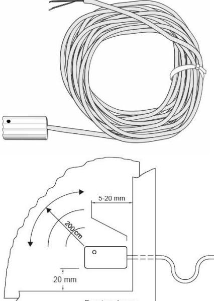
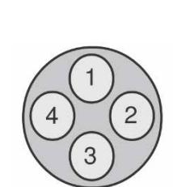
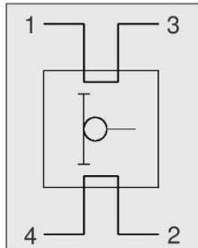

## **GB-5700**

**Glasbruchsensor Glassbreak Detector Capteur de bris de vitre Sensore rottura vetro Sensor de rotura del cristal Glaskrossdetektor för laminerat glas**

## Issued by:

Vanderbilt Clonshaugh Business and Technology Park Clonshaugh Dublin D17 KV84 Ireland

## www.vanderbiltindustries.com

Document no. A6V10422213_d Edition 04.2016 Ordering Information

| Art.                 | Art. No.         |  |
|----------------------|------------------|--|
| GB-5700-2, 2m, lam   | V54535-F103-A100 |  |
| GB-5700-6, 6m, lam   | V54535-F103-A200 |  |
| GB-5700-10, 10m, lam | V54535-F103-A300 |  |

Data and design subject to change without notice Supply subject to availability

| Deutsch                                                                                                                                                                                                                                                                                                                                                                                                                                                                                                                                                                                                                                                                                                                                                                                                                 |                                                                                                                                                                                   |                                                                                                                      | Installationsanleitung                                                                                  |
|-------------------------------------------------------------------------------------------------------------------------------------------------------------------------------------------------------------------------------------------------------------------------------------------------------------------------------------------------------------------------------------------------------------------------------------------------------------------------------------------------------------------------------------------------------------------------------------------------------------------------------------------------------------------------------------------------------------------------------------------------------------------------------------------------------------------------|-----------------------------------------------------------------------------------------------------------------------------------------------------------------------------------|----------------------------------------------------------------------------------------------------------------------|---------------------------------------------------------------------------------------------------------|
|                                                                                                                                                                                                                                                                                                                                                                                                                                                                                                                                                                                                                                                                                                                                                                                                                         |                                                                                                                                                                                   | Anschluss und Verdahtung                                                                                             |                                                                                                         |
| Vor der eigentlichen Installation des Geräts, lesen Sie bitte die Sicherheitshinweise aufmerksam durch.                                                                                                                                                                                                                                                                                                                                                                                                                                                                                                                                                                                                                                                                                                                 |                                                                                                                                                                                   | Anschlusskabel: LIYY 4 x 0,14mm² Cu verzinnt LSA Schneidklemmtechnik geeignet                                     |                                                                                                         |
|                                                                                                                                                                                                                                                                                                                                                                                                                                                                                                                                                                                                                                                                                                                                                                                                                         | Für das direkte Anschließen an die SPC Zentrale ist das GB-5000-IN Relaisanschlussmodul                                                                                           |                                                                                                                      |                                                                                                         |
|                                                                                                                                                                                                                                                                                                                                                                                                                                                                                                                                                                                                                                                                                                                                                                                                                         |                                                                                                                                                                                   | Masse Kabel : Ø 3,2mm (bis 10m Länge VdS zugelassen)                                                                 |                                                                                                         |
| erforderlich.                                                                                                                                                                                                                                                                                                                                                                                                                                                                                                                                                                                                                                                                                                                                                                                                           |                                                                                                                                                                                   | Vor dem Anschluss sind die Zuleitungen elektrisch zu messen                                                          |                                                                                                         |
| Installationsanleitung                                                                                                                                                                                                                                                                                                                                                                                                                                                                                                                                                                                                                                                                                                                                                                                                  | Bemerkung                                                                                                                                                                         |                                                                                                                      |                                                                                                         |
| Beschichtetes Glas 6mm +/- 3mm                                                                                                                                                                                                                                                                                                                                                                                                                                                                                                                                                                                                                                                                                                                                                                                          | Ja                                                                                                                                                                                | Technische Daten                                                                                                     |                                                                                                         |
| Strukturglas (unebene Oberfläche) Drahtglas (eingegossenes Drahtgewebe)                                                                                                                                                                                                                                                                                                                                                                                                                                                                                                                                                                                                                                                                                                                                              | Nein – beeinträchtigte die Detektionsleistung Nein – beeinträchtigte die Detektionsleistung                                                                                    |                                                                                                                      | 12 V DC (Toleranzbereich 9  16 V                                                                        |
| Sicherheitsglas (innenliegende Folie)                                                                                                                                                                                                                                                                                                                                                                                                                                                                                                                                                                                                                                                                                                                                                                                   | Nein – beeinträchtigte die Detektionsleistung                                                                                                                                     | Betriebsspannung                                                                                                     | DC)                                                                                                     |
| Beschädigtes Glass                                                                                                                                                                                                                                                                                                                                                                                                                                                                                                                                                                                                                                                                                                                                                                                                      | Nein – verursacht Falschalarme                                                                                                                                                    | Zulässige Welligkeit                                                                                                 | Max. 1 Vss                                                                                              |
| Im Rahmen eingefasste Scheibe                                                                                                                                                                                                                                                                                                                                                                                                                                                                                                                                                                                                                                                                                                                                                                                           | Ja - ,wenn nicht kann es zu Falschalarmen kommen                                                                                                                                  | Stromaufnahme (Ruhe / ausgelöst) :                                                                                   | < 1 µA (ca. 20 nA) / ca. 10 mA                                                                          |
| Glasschneidereinsatz                                                                                                                                                                                                                                                                                                                                                                                                                                                                                                                                                                                                                                                                                                                                                                                                    | Kann es eventuell nicht detektiert werden                                                                                                                                         | Löschspannung                                                                                                        | Max 1 V                                                                                                 |
| Mindestabstand des Sensors zum Rahmen                                                                                                                                                                                                                                                                                                                                                                                                                                                                                                                                                                                                                                                                                                                                                                                   | 20mm (siehe oben)                                                                                                                                                                 | Löschdauer                                                                                                           | Min. 12.5 ms                                                                                            |
| Min-/Max Abstand der Kabeleinführung zum Rahmen                                                                                                                                                                                                                                                                                                                                                                                                                                                                                                                                                                                                                                                                                                                                                                         | 5…20mm (siehe oben)                                                                                                                                                               | Masse Gehäuse                                                                                                        | 37 x 19 x 12mm                                                                                          |
| Mindestabstand des Sensors zum Rahmen                                                                                                                                                                                                                                                                                                                                                                                                                                                                                                                                                                                                                                                                                                                                                                                   | 20mm                                                                                                                                                                              | Gehäusematerial Farbe                                                                                             | S-B Weiss                                                                                            |
| Detektionsradius                                                                                                                                                                                                                                                                                                                                                                                                                                                                                                                                                                                                                                                                                                                                                                                                        | 2m, (Bemerkung 1)                                                                                                                                                                 | Betriebstemperatur                                                                                                   | -40 °C bis +70 °C                                                                                       |
| Montage horizontal /vertikal                                                                                                                                                                                                                                                                                                                                                                                                                                                                                                                                                                                                                                                                                                                                                                                            | Ja / Nein                                                                                                                                                                         | Schutzart                                                                                                            | Umweltklasse III A, IP 67                                                                               |
| Max Anzahl von Detektoren pro Linie                                                                                                                                                                                                                                                                                                                                                                                                                                                                                                                                                                                                                                                                                                                                                                                     | 20 (Bemerkung 2)                                                                                                                                                                  | Glasarten                                                                                                            | Verbundglas (3 / Folie / 3)                                                                             |
| Die Montagefläche und die Rückseite des Detektors müssen von                                                                                                                                                                                                                                                                                                                                                                                                                                                                                                                                                                                                                                                                                                                                                            | Reinigung erforderlich - Fremdkörper beeinträchtigen die Detektionsleistung                                                                                                       | Glasdicke                                                                                                            | 6mm                                                                                                     |
| Schmutz- und Staubrückstände befreit werden Die Montagefläche und die Rückseite des Detektors müssen vor der                                                                                                                                                                                                                                                                                                                                                                                                                                                                                                                                                                                                                                                                                                         | Reinigung erforderlich – empfohlen: Spiritus oder Methylalkohol                                                                                                                   | Glasgröße pro Melder                                                                                                 | Min. 40 x 40cm, Max. 200 x 100cm                                                                        |
| Installation gereinigt werden                                                                                                                                                                                                                                                                                                                                                                                                                                                                                                                                                                                                                                                                                                                                                                                           |                                                                                                                                                                                   | Zulassungen                                                                                                          | EN-ST-000220                                                                                            |
| Klebemittel                                                                                                                                                                                                                                                                                                                                                                                                                                                                                                                                                                                                                                                                                                                                                                                                             | GB-5000-AD-LAM/Loctite Multibond 330                                                                                                                                              |                                                                                                                      | SBSC, Larmklass 1/2                                                                                     |
| Anschluss für Sicherheitssystem                                                                                                                                                                                                                                                                                                                                                                                                                                                                                                                                                                                                                                                                                                                                                                                         | Relaisanschlussmodul GB-5000-IN                                                                                                                                                   |                                                                                                                      |                                                                                                         |
| Test-& Inbetriebnahmeanleitung                                                                                                                                                                                                                                                                                                                                                                                                                                                                                                                                                                                                                                                                                                                                                                                          | Bemerkung                                                                                                                                                                         | Optionen: Glas-Metall-Klebeset GB-5000-AD-LAM (LOCTITE Multibond 330) Glasbruchsensor Prüfgerät GB-5000-TE     |                                                                                                         |
| Für den Funktionstest geeignetes Testtool verwenden.                                                                                                                                                                                                                                                                                                                                                                                                                                                                                                                                                                                                                                                                                                                                                                    | Ja - GB-5000-TE                                                                                                                                                                   |                                                                                                                      |                                                                                                         |
|                                                                                                                                                                                                                                                                                                                                                                                                                                                                                                                                                                                                                                                                                                                                                                                                                         | Nein – Dies führt zur Beschädigung des Detektors                                                                                                                                  |                                                                                                                      |                                                                                                         |
| 1. sonstigen Glasbeschaffenheiten) der Glasscheibe. 2. Erforderlich für VdS.                                                                                                                                                                                                                                                                                                                                                                                                                                                                                                                                                                                                                                                                                                                                   | Der Detektionsradius ist abhängig von der Beschaffenheit (Glasdicke, Alter der Scheiben, Befestigung der Scheibe im Rahmen und                                                    |                                                                                                                      |                                                                                                         |
| 3. Der Abschlusswiderstand RA muss hinter dem letzten Glasbruchsensor angeschlossen werden.                                                                                                                                                                                                                                                                                                                                                                                                                                                                                                                                                                                                                                                                                                                          |                                                                                                                                                                                   | Terminal and wiring                                                                                                  | Installation Instruction                                                                                |
| Das Klopfen und Schlagen auf den Detektor Bemerkungen English Before starting to install and work with this device, please read the Safety Instructions For SPC panel connection a GB-5000-IN interface relay must be used.                                                                                                                                                                                                                                                                                                                                                                                                                                                                                                                                                                                 |                                                                                                                                                                                   | Connection cable: LIYY 4 x 0,14 mm² Cu tinned Cable dimension : Ø 3,2mm (< 10m authorized by VdS)                 |                                                                                                         |
| Installation Instructions                                                                                                                                                                                                                                                                                                                                                                                                                                                                                                                                                                                                                                                                                                                                                                                               | Comment                                                                                                                                                                           | Before connecting, the wires must be electrically checked                                                            |                                                                                                         |
| Laminated glass 6mm +/- 3mm                                                                                                                                                                                                                                                                                                                                                                                                                                                                                                                                                                                                                                                                                                                                                                                             | Yes                                                                                                                                                                               |                                                                                                                      |                                                                                                         |
|                                                                                                                                                                                                                                                                                                                                                                                                                                                                                                                                                                                                                                                                                                                                                                                                                         | No – impairs detectors performance                                                                                                                                                | Technical data                                                                                                       |                                                                                                         |
|                                                                                                                                                                                                                                                                                                                                                                                                                                                                                                                                                                                                                                                                                                                                                                                                                         | No - impairs detectors performance                                                                                                                                                | Voltage                                                                                                              |                                                                                                         |
|                                                                                                                                                                                                                                                                                                                                                                                                                                                                                                                                                                                                                                                                                                                                                                                                                         | No - impairs detectors performance                                                                                                                                                |                                                                                                                      | DC)                                                                                                     |
|                                                                                                                                                                                                                                                                                                                                                                                                                                                                                                                                                                                                                                                                                                                                                                                                                         | No – It will cause false activations                                                                                                                                              | Allowable ripple                                                                                                     | Max. 1 Vss                                                                                              |
|                                                                                                                                                                                                                                                                                                                                                                                                                                                                                                                                                                                                                                                                                                                                                                                                                         | Yes, otherwise it may cause false activations                                                                                                                                     | Current consumption (idle / triggered):                                                                              | <1 uA (ca. 20 nA) / ca. 10 mA                                                                           |
|                                                                                                                                                                                                                                                                                                                                                                                                                                                                                                                                                                                                                                                                                                                                                                                                                         | May not be detected                                                                                                                                                               | Reset voltage                                                                                                        | Max 1 V                                                                                                 |
|                                                                                                                                                                                                                                                                                                                                                                                                                                                                                                                                                                                                                                                                                                                                                                                                                         | 20mm (See Fig: 1) 5mm…20mm (See Fig:1)                                                                                                                                         | Reset timer                                                                                                          | Min. 12.5 ms                                                                                            |
|                                                                                                                                                                                                                                                                                                                                                                                                                                                                                                                                                                                                                                                                                                                                                                                                                         | 20mm                                                                                                                                                                              | Housing dimension Housing material                                                                                | 37 x 19 x 12mm S-B                                                                                   |
|                                                                                                                                                                                                                                                                                                                                                                                                                                                                                                                                                                                                                                                                                                                                                                                                                         | Varies (note 1)                                                                                                                                                                   | Colour                                                                                                               | White                                                                                                   |
|                                                                                                                                                                                                                                                                                                                                                                                                                                                                                                                                                                                                                                                                                                                                                                                                                         | Yes/No                                                                                                                                                                            | Indication                                                                                                           |                                                                                                         |
|                                                                                                                                                                                                                                                                                                                                                                                                                                                                                                                                                                                                                                                                                                                                                                                                                         | 20 (Note 2)                                                                                                                                                                       | Temperature range                                                                                                    | -40 °C to +70 °C                                                                                        |
|                                                                                                                                                                                                                                                                                                                                                                                                                                                                                                                                                                                                                                                                                                                                                                                                                         | Yes, particles left will impair detection                                                                                                                                         | Enclosure rating                                                                                                     | 12V DC (tolerance range 3  16 V LED – clear – normal, Red - Alarm Environmental Class III A, IP67 |
|                                                                                                                                                                                                                                                                                                                                                                                                                                                                                                                                                                                                                                                                                                                                                                                                                         | Use white spirit or methyl alcohol                                                                                                                                                | Types of glass                                                                                                       | Laminated glass (3 / film / 3)                                                                          |
|                                                                                                                                                                                                                                                                                                                                                                                                                                                                                                                                                                                                                                                                                                                                                                                                                         | GB-5000-AD-LAM/Loctite Multibond 330                                                                                                                                              | Glass thickness                                                                                                      | 6mm                                                                                                     |
|                                                                                                                                                                                                                                                                                                                                                                                                                                                                                                                                                                                                                                                                                                                                                                                                                         | Relay Interface GB-5000-IN                                                                                                                                                        | Glass size per detector                                                                                              | Min. 40 x 40cm, Max. 200 x 100cm                                                                        |
|                                                                                                                                                                                                                                                                                                                                                                                                                                                                                                                                                                                                                                                                                                                                                                                                                         | Comment                                                                                                                                                                           | Approvals                                                                                                            | EN-ST-000220                                                                                            |
|                                                                                                                                                                                                                                                                                                                                                                                                                                                                                                                                                                                                                                                                                                                                                                                                                         | Yes - GB-5000-TE                                                                                                                                                                  |                                                                                                                      | SBSC, Larmklass 1/2                                                                                     |
| Structured glass (uneven surface) Reinforced glass (internal wire mesh) Foil glass (internal foil) Damaged glass Securely fitted glass (secured in frame) Scoring of glass with cutter Min distance from frame for main body of sensor Min/Max distance from frame to cable connection side Min distance from frame for main body of sensor Detection radius Horizontal mounting/vertical mounting Max number of detectors per line Remove all debris from glass & rear of detector Clean window and rear of detector prior to installation Adhesive Interface to security system Test/Commissioning Instructions Test after installation using correct test tool Tapping or hitting detector Notes 1. is housed in. 2. This is a VdS requirement. | No – this will damage the detector Detection radius varies depending on the thickness & age of the glass. Also how secure the glass is mounted and the type of frame the glass | Options: Glass / metal adhesive set GB-5000-AD-LAM (LOCTITE Multibond 330) Glassbreak testing unit: GB-5000-TE |                                                                                                         |

| Français                                                                                                                                                    |                                                                                                                                                                    |                                                                                                                                            | Instructions d'installation                                              |
|-------------------------------------------------------------------------------------------------------------------------------------------------------------|--------------------------------------------------------------------------------------------------------------------------------------------------------------------|--------------------------------------------------------------------------------------------------------------------------------------------|--------------------------------------------------------------------------|
| Veuillez lire les consignes de sécurité avant d'installer et d'utiliser l'appareil.                                                                         |                                                                                                                                                                    | Raccordement et câblage Câble de raccordement : LIYY 4 x 0,14 mm² Cu étamé                                                              |                                                                          |
| Pour la connexion directe sur une centrale SPC, l'interface relais GB-5000-IN est inutile.                                                                  |                                                                                                                                                                    | compatible avec la technique à bornes guillotines sans soudure ni vis ni dénudage                                                       |                                                                          |
| Instructions d'installation Vitre standard/Verre flotté 6mm +/- 3mm                                                                                      | Remarques Oui                                                                                                                                                   | Dimensions du câble : Ø 3,2mm (jusqu'à 10m de long admissible pour VdS)                                                                    |                                                                          |
| Vitre structurée (surface irrégulière) Vitre renforcée (Treillis métallique interne)                                                                     | Non – Détériore la performance du détecteur Non - Détériore la performance du détecteur                                                                         | Mesurer électriquement les câbles d'alimentation Caractéristiques techniques                                                            |                                                                          |
| Vitre incassable (film interne) Vitre endommagée                                                                                                         | Non - Détériore la performance du détecteur Non – Peut provoquer des déclenchements intempestifs                                                                | Tension d'exploitation                                                                                                                     | 12V DC (plage de tolérance 3  16                                         |
| Vitre solidement fixée dans l'encadrement                                                                                                                   | Oui, sinon peut provoquer des déclenchements intempestifs                                                                                                          | Ondulation admissible                                                                                                                      | V DC) 1 Vss max.                                                      |
| Rayure de la vitre à l'aide d'un coupe-verre diamant Distance Min de fixation du boitier par rapport à l'encadrement                                     | Non détectée 20mm                                                                                                                                               | Consommation (repos / déclenché): Tension d'effacement                                                                                  | <1 uA (ca. 20 nA) / ca. 10 mA 1 V max.                                |
| Distance Min de sortie du câble par rapport à l'encadrement Rayon de détection                                                                           | 5…20mm 2m, (note 1)                                                                                                                                             | Durée d'effacement Dimensions du boîtier                                                                                                | 12,5 ms min. 37 x 19 x 12mm                                           |
| Montage horizontal /vertical Nombre Max de détecteurs par ligne                                                                                          | Oui/Non 20 (Note 2)                                                                                                                                             | Matériau du boîtier Coloris                                                                                                             | S-B Blanc                                                             |
| Eliminer tout debris de verre de la vitre et de l'arrière du détecteur Nettoyer la vitre et l'arrière du détecteur avant l'installation                  | Oui, Les debris restant détériorent la performance de détection Utiliser du white spirit ou de l'alcool de méthyle                                              | Température d'exploitation Boîtier note                                                                                                 | -40 °C à + 70 °C Classe environnementale III A, IP67                  |
| Type de colle à utiliser Interface pour le raccordement à la centrale d'alarme                                                                           | GB-5000-AD-LAM/Loctite Multibond 330 Interface relais GB-5000-IN (sauf pour les centrales SPC)                                                                  | Types de verre Épaisseur du verre                                                                                                       | Le verre feuilleté (3 / film / 3) 6mm                                 |
| Test/Instructions de mise en service                                                                                                                        | Remarques                                                                                                                                                          | Taille du verre par détecteur                                                                                                              | Min. 40 x 40cm, Max. 200 x 100cm                                         |
| Utilisation d'un outil de test approprié après installation Tappottement ou choc sur le détecteur                                                        | Oui - GB-5000-TE Non – Cela endommage le détecteur                                                                                                              | Certifications EN-ST-000220 SBSC, Larmklass 1/2                                                                                      |                                                                          |
| Notes 1. Le rayon de détection varie selon l'épaisseur et l'âge du verre, ainsi que la manière dont est monté la vitre et le type d'encadrement utilisé. |                                                                                                                                                                    | Options : Kit de collage verre métal GB-5000-AD-LAM (LOCTITE Multibond 330) Appareil de test de capteurs de bris de vitre GB-5000-TE |                                                                          |
| 2. C'est une exigence VdS. 3. La RA de résistance de terminaison doit être connecté après que le capteur de bris de verre dernière.                      |                                                                                                                                                                    |                                                                                                                                            |                                                                          |
| Italiano                                                                                                                                                    |                                                                                                                                                                    |                                                                                                                                            | Istruzioni per l'installazione                                           |
| Prima di iniziare l'installazione e il lavoro con questo dispositivo, leggere le istruzioni di sicurezza.                                                   |                                                                                                                                                                    | Collegamento e cablaggio Cavo di collegamento: LIYY 4 x 0,14mm² Cu stagnato;                                                            |                                                                          |
| Per una connessione a una centrale SPC deve essere usata un'interfaccia relè GB-5000-IN.                                                                    |                                                                                                                                                                    | adatto a perforazione isolante IDC Dimensioni cavo: Ø 3,2mm (fino a 10m di lunghezza approvata VdS)                                     |                                                                          |
| Istruzioni installazione Vetro laminato 6mm +/- 3mm                                                                                                      | Commenti Yes                                                                                                                                                    | Prima del collegamento, le linee devono essere misurate elettricamente                                                                  |                                                                          |
| Vetro strutturato (superficie irregolare)                                                                                                                   | No – ostacola le prestazioni del rilevatore                                                                                                                        |                                                                                                                                            |                                                                          |
| Vetro rinforzato (rete metallica interna) Vetro temperato (lamina interna)                                                                               | No - ostacola le prestazioni del rilevatore No - ostacola le prestazioni del rilevatore                                                                         | Specifiche tecniche                                                                                                                        | 12V DC (campo di tolleranza 3  16                                        |
| Vetro danneggiato Vetro saldamente montato (fissato nel telaio)                                                                                          | No – Causerà false attivazioni Si, altrimenti potrebbe causare falsi allarmi                                                                                    | Tensione di esercizio Ondulazione ammissibile                                                                                           | V DC) Max. 1 Vss                                                      |
| Tagli nel vetro con un tagliatore Distanza minima dal telaio per il corpo principale del sensore                                                         | Potrebbe non rilevare 20mm (Vedi Fig: 1)                                                                                                                        | Consumo di corrente (minimo / attivato):                                                                                                | <1 uA (ca. 20 nA) / ca. 10 mA                                            |
| Distanza min/max dal telaio al cavo di collegamento Distanza minima dal telaio per il corpo principale del sensore                                       | 5mm…20mm (Vedi Fig:1) 20mm                                                                                                                                      | Tensione di reset Tempo di reset                                                                                                        | Max. 1 V Min. 12.5 ms                                                 |
| Raggio di rilevamento Montaggio orizzontale / montaggio verticale                                                                                        | Varie (Nota 1) Si/No                                                                                                                                            | Dimensioni contenitore Materiale del contenitore                                                                                        | 37 x 19 x 12mm S-B                                                    |
| Massimo numero di rilevatori per linea Rimuovere tutti i detriti dal vetro e dal retro del rilevatore                                                    | 20 (Nota 2) Si, le particelle rimanenti bloccheranno il rilevatore                                                                                              | Colore                                                                                                                                     | Bianco                                                                   |
| Pulire il vetro e il retro del rilevatore prima dell'installazione                                                                                          | Utilizzare ragia o alcool metilico                                                                                                                                 | Temperatura di esercizio Grado di protezione                                                                                            | -40 °C a + 70 °C Classe ambientale III A, IP67                        |
| Adesivo Interfaccia con sistema di sicurezza                                                                                                             | GB-5000-AD-LAM/Loctite Multibond 330 Interfaccia relè GB-5000-IN                                                                                                | Tipi di vetro Spessore del vetro                                                                                                        | Il vetro stratificato (3 / pellicola / 3) 6mm                         |
| Test / Istruzioni per la messa in servizio Test dopo l'installazione con gli strumenti corretti per il test                                              | Commenti Si - GB-5000-TE                                                                                                                                        | Dimensioni vetro per rivelatore Omologazioni                                                                                            | Min. 40 x 40cm, Max. 200 x 100cm EN-ST-000220                         |
| Toccando o colpendo il rilevatore Note                                                                                                                   | No – questo danneggerà il rilevatore                                                                                                                               | Opzioni: Set adesivo vetro-metallo GB‑5000‑AD‑LAM                                                                                          | SBSC, Larmklass 1/2                                                      |
| 2. Questo è un requisite VdS.                                                                                                                               | 1. Il raggio di rilevazione varia a seconda dello spessore e dell'età del vetro. Inoltre anche a come è montato il vetro e il tipo di cornice in cui è installato. | (LOCTITE Multibond 330) Tester sensore rottura vetro GB‑5000‑TE                                                                         |                                                                          |
|                                                                                                                                                             |                                                                                                                                                                    |                                                                                                                                            |                                                                          |
| 3. La RA resistenza di terminazione deve essere collegato dopo la rottura del sensore ultimo bicchiere.                                                     |                                                                                                                                                                    |                                                                                                                                            |                                                                          |
| Español                                                                                                                                                     |                                                                                                                                                                    |                                                                                                                                            | Instrucciones de instalación                                             |
| Lea las instrucciones de seguridad antes de empezar a trabajar con este dispositivo.                                                                        |                                                                                                                                                                    | Conexión y cableado                                                                                                                        | Cable de conexión: LIYY 4 x 0,14 mm² Cu estañado; desnudo; adecuado para |
| Para la conexión a centrales SPC emplee el interfaz de relé GB-5000-IN.                                                                                     |                                                                                                                                                                    | conexión por desplazamiento del aislamiento LSA Cable de tierra: Ø 3,2mm (hasta 10m de longitud según VdS)                              |                                                                          |
| Instrucciones de instalación Vidrio laminado de 6mm de espesor +/- 3mm                                                                                   | Comentario Sí                                                                                                                                                   | Antes de la conexión, los cables deben medirse eléctricamente                                                                              |                                                                          |
| Vidrio estructurado (superficie irregular) Vidrio reforzado (malla de alambre interna)                                                                   | No – Perjudica la detección No - Perjudica la detección                                                                                                         | Datos técnicos                                                                                                                             | DC 12V (rango de tolerancia 3  16                                        |
| Vidrio de seguridad (hoja interna de plástico) Vidrio dañado o defectuoso                                                                                | No - Perjudica la detección No – Puede provocar falsas activaciones                                                                                             | Tensión de servicio Ondulación permitida                                                                                                | V DC) Máx. 1 Vss                                                      |
| Vidrio bien colocado en el cerco de montaje Rascado del vidrio con un cortador                                                                           | Sí ya que, de otro modo, pueden producirse falsas activaciones Puede no ser detectado                                                                           | Consumo de corriente (inactivo / desencadenado):                                                                                        | <1 uA (ca. 20 nA) / ca. 10 mA                                            |
| Distancia mínima entre el cerco y el cuerpo del detector Distancia mínima entre el cerco y el cable de conexión                                          | 20 mm (Ver figura) 5 a 20 mm (Ver figura)                                                                                                                       | Tensión de borrado Duración de borrado                                                                                                  | Máx. 1 V Mín. 12.5 ms                                                 |
| Distancia mínima entre el cerco y el cuerpo del detector Radio de detección                                                                              | 20 mm 2 m (Nota 1)                                                                                                                                              | Dimensiones de la carcasa Material de la carcasa                                                                                        | 37 x 19 x 12mm S-B                                                    |
| Montaje horizontal/vertical                                                                                                                                 | Sí/No                                                                                                                                                              | Color                                                                                                                                      | Blanco                                                                   |
| Número máximo de detectores por línea Limpiar perfectamente las superficies de contacto                                                                  | 20 (Nota 2) De otro modo, la detección puede verse perjudicada                                                                                                  | Temperatura de servicio Capacidad de la caja                                                                                            | -40 °C a + 70 °C Clase III A medio ambiente, IP67                     |
| Limpieza Adhesivo                                                                                                                                        | Preferiblemente con alcohol GB-5000-AD-LAM/Loctite Multibond 330                                                                                                | tipos de vidrio Espesor del vidrio                                                                                                      | El vidrio laminado (3 / película / 3) 6mm                             |
| Interfaz con el sistema de seguridad Instrucciones de test y puesta en marcha                                                                            | Módulo de relé GB-5000-IN Comentario                                                                                                                            | Vidrio tamaño por detector Certificaciones                                                                                              | Min. 40 x 40cm, Max. 200 x 100cm EN-ST-000220                         |
| Test tras la instalación mediante la herramienta adecuada Golpeteo directo del detector                                                                  | Sí - GB-5000-TE No, puede dañarle.                                                                                                                              | Opciones: Kit de pegamento cristal-metal GB-5000-AD-LAM                                                                                    | SBSC, Larmklass 1/2                                                      |
| Notas 1. El rango de detección dependerá del espesor, del tipo, del modo y cerco de montaje e incluso de la edad del cristal.                            |                                                                                                                                                                    | (LOCTITE Multibond 330) Dispositivo de comprobación para el sensor de rotura del cristal GB-5000-TE                                     |                                                                          |
| 2. Sólo requerido por VdS. 3. La resistencia de terminación de la AR debe conectarse después de que el sensor de rotura de vidrio última.                |                                                                                                                                                                    |                                                                                                                                            |                                                                          |
|                                                                                                                                                             |                                                                                                                                                                    |                                                                                                                                            |                                                                          |
| Svenska                                                                                                                                                     |                                                                                                                                                                    | Anslutning och ledningsdragning                                                                                                            | Installationsanvisningar                                                 |
| Före installation eller arbete med enheten, läs säkerhetsföreskrifterna.                                                                                    |                                                                                                                                                                    | Anslutningskabel: LIYY 4 x 0,14mm² Cu förtennad passar för LSA-skiljeplintsteknik                                                       |                                                                          |
| För SPC centraler bör GB-5000-IN interfacerelä användas.                                                                                                    |                                                                                                                                                                    | Kabelstorlek: Ø 3,2mm (max. 10m lång enl. VdS)                                                                                             |                                                                          |
| Installationsinstruktion Standard/Planglas 6mm +/- 3mm                                                                                                   | Kommentar JA                                                                                                                                                    | Mät kablaget elektriskt innan de ansluts                                                                                                   |                                                                          |
| Strukturerat glas (ojämn yta) Armerat glas (ståltrådar)                                                                                                  | Nej – försämrad detektering Nej – försämrad detektering                                                                                                         | Tekniska data Driftspänning                                                                                                             | 12V DC (toleransområdet 3  16 V                                          |
| Laminerat glas (plastfolie) Skadat glas                                                                                                                  | Nej – försämrad detektering Nej – genererar falsklarm                                                                                                           | Max. rippel                                                                                                                                | DC) Max. 1 Vss                                                        |
| Löst monterat glas (risk för vibrationer) Skära med glasskärare                                                                                          | Nej – genererar falsklarm Nej – Risk för utebliven detektering                                                                                                  | Strömförbrukning (viloläge / utlöst): Resetspänning                                                                                     | <1 uA (ca. 20 nA) / ca. 10 mA Max. 1 V                                |
| Min avstånd från ram till detektor Min/Max avstånd från kabelsidan på detektorn och karmen                                                               | 20 mm (se bild) 5…20 mm (se bild)                                                                                                                               | Resettid Kapslingsstorlek                                                                                                               | Min. 12.5 ms 37 x 19 x 12mm                                           |
| Min avstånd mellan detektor och karm Detekteringsradie                                                                                                   | 20 mm 2 m, (notering 1)                                                                                                                                         | Kapslingsmaterial Färg                                                                                                                  | S-B Vit                                                               |
| Horisontell montering/vertikal montering                                                                                                                    | Ja/Nej                                                                                                                                                             | Drifttemperatur                                                                                                                            | -40 °C till + 70 °C                                                      |
| Max antal detektorer på en slinga Ta bort all smuts från fönstret & från bakre delen av detektorn                                                        | 20 (notering 2) Ja, Smuts försämrar detekteringen                                                                                                               | Kapslingsklass Typer av glas                                                                                                            | Miljöklass III A, IP67 Laminerat glas (3 / film / 3)                  |
| Gör rent fönstret och detektorns baksida för installation Limsats för detektor                                                                           | Använd sprit eller metylalkohol GB-5000-AD-LAM/Loctite Multibond 330                                                                                            | Glastjocklek Glas storlek per detektor                                                                                                  | 6mm Min. 40 x 40cm, Max. 200 x 100cm                                  |
| Interface till Larmsystem Test/Driftsättningsinstruktioner                                                                                               | Relay Interface GB-5000-IN Kommentar                                                                                                                            | Godkännanden                                                                                                                               | EN-ST-000220 SBSC, Larmklass 1/2                                      |
| Test efter installation, använd rätt verktyg Knacka eller slå på detektorn Notering                                                                   | JA - GB-5000-TE Nej – kommer att skada detektorn                                                                                                                | Tillval: Limsats för glas och metall GB-5000-AD-LAM (LOCTITE Multibond 330) Kontrollinstrument för glaskrossdetektorer GB-5000-TE       |                                                                          |

3. Uppsägningen motståndet RA måste anslutas efter den sista glaskrossgivare.