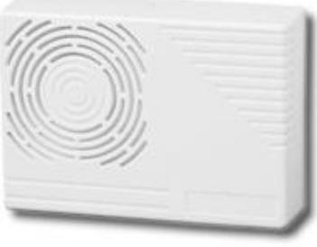

## SP200T, SP203

## Inomhussiren

Egenskaper: Insert picture here

- Elektronisk Inomhussiren
- Variabel ljudnivå
- Valbara toner
- Låg strömförbrukning
- Hög ljudnivå
- Inkapslad elektronik

## SP200T, SP203

|                                 | SP200T         | SP203           |
|---------------------------------|----------------|-----------------|
| Driftspänning                   | 9…14.5 V DC    | 9…14 V DC       |
| Strömförbrukning                | 140 mA         | 20…140 mA       |
| Ljudstyrka vid 1m               | 110 dB         | 70…110 dB       |
| Toner                           | 1              | 4               |
| Dimensioner (B x D x H) mm      | 135 x 35 x 100 | 135 x 35 x 100  |
| Kapslingsklass                  | IP31           | IP31            |
| Sabotage - Borttagning och lock | Ja             | Ja              |
| Kapsling                        | Vit ABS        | Vit ABS         |
| Drifttemperatur                 | -10…+40°C      | -10…+40°C       |
| Godkännanden                    | -              | SBSC, DNV, ANPI |

## **Beställningsinformation**

P200T, SP203, SP205, S

| Typ    | Artikelnummer    | Beskrivning               | Vikt    |
|--------|------------------|---------------------------|---------|
| SP200T | N54539-Z155-A100 | Inomhussiren med sabotage | 0.23 kg |
| SP203  | N54539-Z147-A100 | Inomhussiren med sabotage | 0.23 kg |

Data and design subject to change without notice. Supply subject to availability.

© Vanderbilt 2016

023_SP200_203_b_sv.doc 14/10/2016 page 2