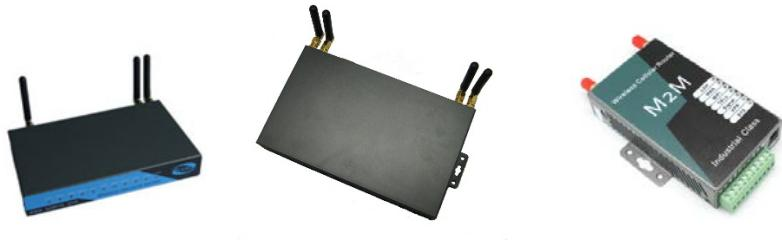
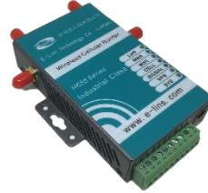

**OBS! Gäller för version 1, se sidan 4 för version 2**

# **Snabbmanual E-Lins**

## **Inlogging**

Anslut en dator till valfri LAN-port och surfa in på routern på adress: http://192.168.8.1

Användarnamn: admin Lösenord: admin

### **OBS: För ökad säkerhet rekommenderar vi byte av lösenord.** Detta görs på fliken *Administration / Management*

| Connect Modem                         |          |                        |  |
|---------------------------------------|----------|------------------------|--|
| Internet Settings                     |          |                        |  |
| VPN                                   |          | Administrator Settings |  |
| WIFI                                  | Account  | admin                  |  |
| Firewall                              |          |                        |  |
| Administration                        | Password |                        |  |
| Management Upload Firmware         | WatchDog | ● Enable ○ Disable     |  |
| Settings Management System Command |          | Cancel Apply        |  |

## **WAN-inställningar**

Kontrollera med din operatör vilka inställningar som gäller för det abonnemang du har. Normalt krävs endast rätt APN eller inloggningsuppgifter, dessa ändras under: *Internet Settings / WAN / Advance Parameter Groups*

| DHCP clients                                                    | Parameter Groups       | WULMA VIEW Delete > |  |  |
|-----------------------------------------------------------------|------------------------|------------------------------|--|--|
| Static Routing                                                  |                        | Cell Modem Parameters Groups |  |  |
| Dynamic Routing Dynamic Routing List                         | Parameters Groups Name | WCDMA                        |  |  |
| QoS                                                             | Dialup                 | *99#                         |  |  |
| SNMP Cell ICMP Check                                         | APN                    | 3gnet                        |  |  |
| Loopback Interface VPN WIFT Firewall Administration | User                   | wap                          |  |  |
|                                                                 | Password               | wap                          |  |  |
|                                                                 | Command                |                              |  |  |
|                                                                 | Auth Type              | AUTO V                    |  |  |
|                                                                 | Pin Code               |                              |  |  |
|                                                                 | Local IP               |                              |  |  |
|                                                                 | AATI I                 |                              |  |  |

För att spara ändrade inställningar krävs att man först trycker på knappen "Add/Edit" och sedan avslutar med knappen "Apply".

| Local IP  |                                                                         |                      |
|-----------|-------------------------------------------------------------------------|----------------------|
| MTU       |                                                                         | Parameter Groups     |
| Note:     | If change this parameters groups please press Add/Edit button first! |                      |
|           | Advance Rerameter Groups                                                |                      |
|           | Add/Edit                                                                |                      |
|           | Advance Cell Options                                                    | MAC Clone Enabled |
| MAC Clone |                                                                         |                      |
| Enabled   | Disable V                                                               |                      |

| VIEW Delete                                   |  |
|--------------------------------------------------|--|
| Advance Parameter Groups Advance Cell Options |  |
|                                                  |  |
|                                                  |  |
| Cancel                                           |  |

## **Status**

På fliken Status visas bland annat:

- Operatör
- Uppkopplingsform
- Signalstyrka
- Om förbindelsen är uppkopplad
- Tilldelad IP-adress och tillhörande gateway/DNS information

| System Info                  |                                          |
|------------------------------|------------------------------------------|
| Series                       | He8E                                     |
| SN                           | 08641210123A                             |
| Software Version             | 2.3.47 (Jun 19 2013)                     |
| Hardware Version             | 1.0.0                                    |
| System Up Time               | 3 min                                    |
| Operation Mode               | Gateway Mode                             |
| Cell Network Info            |                                          |
| Cell Modem                   | SIERRA MC77x0 QMI                        |
| IMEI/ESN                     | 358178040223416                          |
| Sim Status                   | SIM ready                                |
| Selected Network             | AUTO                                     |
| Registered Network           | Registered on Home network: "Tele2 SE".7 |
| Sub Network Type             | LTE                                      |
| Signal                       | Tatl 25 : - 64 dbm                    |
| Cell Status                  | UP                                       |
| Internet Configurations      |                                          |
| Connected Type               | CELL                                     |
| WAN IP Address               | 37.197.16.68                             |
| Subnet Mask                  | 255.255.255.252                          |
| Default Gateway              | 37.197.16.69                             |
| Primary Domain Name Server   | 130.244.127.161                          |
| Secondary Domain Name Server | 130.244.127.169                          |
| MAC Address                  | 08:66:01:00:31:00                        |
| Local Network                |                                          |
| Local IP Address             | 192.168.8.1                              |
| Local Netmask                | 255.255.255.0                            |
| MAC Address                  | 08:66:01:00:31:0D                        |

## **Anslutningar**

Antenningångar:

- Cell / Ant 1 = Primär antennanslutning mobilnät
- Aux / Ant 2 = Diversitet mobilnät
- Wifi / Ant 3 = Trådlöst nätverk
- GPS / Ant4 = GPS

Plintanslutning:

- 1 = VCC 5-40 VDC
- 2 = Jordanslutning strömförsörjning
- 3 = RS-232 Jord
- 4 = RS-232 RX
- 5 = RS-232 TX
- 6 = Reset (Jordning minst 3 sek ger fabriksåterställning av router)
- 7 = Används förnärvarande inte
- 8 = Används förnärvarande inte
- 9 = Används förnärvarande inte
- 10 = Används förnärvarande inte

## **Utökad kontroll av förbindelse - ICMP check**

Om routern är inställd på "Keep Alive" under WAN settings så är en PPP watchdog aktiverad för att säkerställa uppkopplingen.

Som ytterligare säkerhet kan man aktivera en funktion som automatisk startar om routern om förbindelsen inte går at etablera.

Funktionen heter ICMP check och finns under: *Internet Settings / Cell ICMP Check* 

Aktivera funktionen i bockrutan.

välj lämpliga IP-adresser eller internetadresser som routern ska kontrollera att det finns kontakt med via Ping.

Under "Check Interval Time" bestämmer du hur ofta routern ska Pinga.

| >                  |               |  |
|--------------------|---------------|--|
| 8.8.8.8            | host/IP check |  |
| www.sunet.se       | host/IP check |  |
| 600 (120-86400) |               |  |
| 3 (3-1000)      |               |  |
| 3 (2-50)        |               |  |
| (0-43200) 5     |               |  |
|                    |               |  |

### **Schemalagd omstart**

Som ett alternativ till ICMP check kan man schemalägga omstart av routern för att minska risken att kommunikationen hänger sig. Antingen schemalägger man med valfritt intervall eller på valfritt klockslag.

inställningar för detta finns under: *Administration /Reboot.*

# **Komplett manual och tillbehör hittar du på www.acandia.se**

# **Kom igång – version V2**

## **Inlogging**

Anslut en dator till valfri LAN-port och surfa in på routern på adress: http://192.168.1.1

Användarnamn: admin Lösenord: admin

**OBS: För ökad säkerhet rekommenderar vi byte av lösenord.** Detta görs på fliken *System / Setup Wizard*

| Status       | Password settings    |   |
|--------------|----------------------|---|
| System       |                      |   |
| Setup Wizard | New password         | 4 |
| System       |                      |   |
| Password     | Confirm new password | 4 |
| NTP          |                      |   |

## **WAN-inställningar**

Kontrollera med din operatör vilka inställningar som gäller för det abonnemang du har. Normalt krävs endast rätt APN, vilket ändras under: *Network / Mobile* 

| Network        | Enable            | B         |
|----------------|-------------------|-----------|
| Operation Mode | Mobile connection | DHCP mode |
| Mobile         | APN               | 3gnet     |
| LAN            |                   |           |
| Wired WAN      | PIN code          |           |
| WAN IPv6       | Dialing number    | *99#      |

## **WIfi-inställningar**

Wifi är påslagen från fabrik med kryptering WPA2-PSK och har lösenord: **m2mrouter168!!!**

## **Spara och aktivera**

För att spara ocj aktivera ändrade inställningar krävs att man trycker på knappen Save & Apply

## **Status**

På fliken Status (*Status / Overview)* visas bland annat:

- Operatör
- Modultyp
- Uppkopplingsform
- Signalstyrka
- Om förbindelsen är uppkopplad
- Tilldelad IP-adress och DNS

| Mobile 1           |                                         |
|--------------------|-----------------------------------------|
| Celluar Status     | Up                                      |
| IP Address         | 100.66.156.40/255.255.255.240           |
| DNS 1              | 130.244.127.161                         |
| DNS 2              | 130.244.127.169                         |
| Cell Modem         | HUAWEI-ME906s-909s (12D1_15C1 )         |
| IMEI/ESN           | 867377020416487                         |
| Sim Status         | SIM Ready                               |
| Strength           | 18 / 31 Tall                         |
| Selected Network   | Automatic                               |
| Registered Network | Registered on Home network: "Tele2", 7, |
| Sub Network Type   | LTE                                     |
| Location Area Code | 8206                                    |
| Cell ID            | 04CF4906                                |

## **Anslutningar**

Antenningångar:

- Cell 1 = Primär antennanslutning mobilnät
- Cell 2 = Diversitet mobilnät
- Wifi 1 = Trådlöst nätverk
- Wifi 2 = Trådlöst nätverk

#### Plintanslutning:

- 1 = VCC 5-40 VDC
- 2 = Jordanslutning strömförsörjning
- 3 = RS-232 Jord
- 4 = RS-232 RX
- 5 = RS-232 TX
- 6 = Reset (Jordning ger återstart av router)
- 7 = Används förnärvarande inte
- 8 = Används förnärvarande inte
- 9 = Används förnärvarande inte
- 10 = Används förnärvarande inte