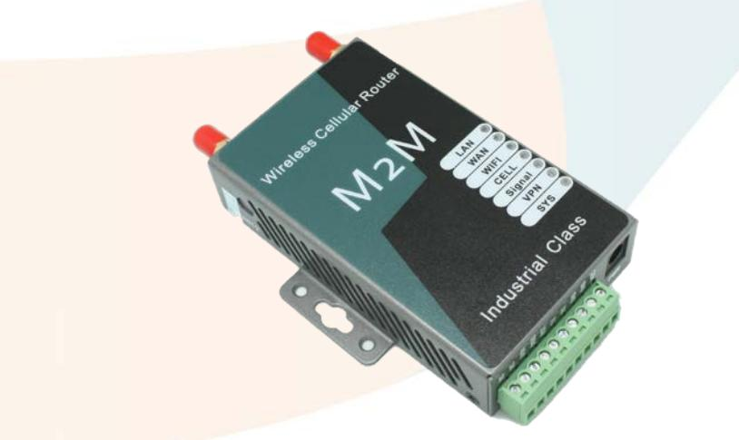
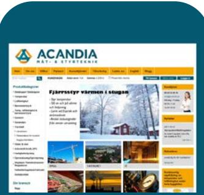

## **Industriell mobil router från E-Lins,**

Kraftfull router med många avancerade funktioner och säkerhetsinställningar som standard, dessutom finns möjlighet att välja till ytterligare optioner för ökad funktionalitet.

Finns i alla vanliga mobilstandarder: GSM, UMTS WCDMA, 4G LTE och CDMA 450MHz EVDO Rev-B

Tåligt plåtchassi i kompakt design med robusta anslutningar. Bred temperaturtålighet och matningsspänning.

#### **Standardfunktioner:**

1 WAN RJ45 port + 1 LAN RJ45 port Wifi 802.11 b/g/n Seriellt interface RS-232 Wan failover SNMP, stöder V1, V2 och V3 Watchdog, Keep alive, Autoreboot LCP, ICMP kontroll NAT, DMZ, DNS, DDNS VPN (PPTP, L2TP, IP-Sec, GRE) VLAN, stöder multi-LAN IP VRRP Telnet, SSH Firewall, Packet filtering Mac/IP/Port filtrering Port forwarding Fjärrkonfigurering via webgränssnitt/Telnet/SSH Konfigureringsprofiler med backup/återställning Självdiagnostik och larmhantering

## **Optioner:**

Seriellt interface RS-485 GPS (Ej CDMA versionen) OSPF, BGP

## **Specifikationer:**

Mått: 100mm x 60mm x 21mm Vikt: 220g Matning: 5-40VDC (5-50VDC option) Temperatur: Drift: -30 / 75˚C, Lagring: -40 / 85˚C Antenningångar: SMA för både mobil och Wifi

Läs mer på: **http://www.acandia.se**

Vi kan även leverera kompletta lösningar med t.ex. givare och insamlings- /fjärrstyrningssystem. Fråga oss.

# **Router H685**

Industriell mobil router från E-Lins.

- 2G/3G/4G/CDMA
- Inbyggd Watchdog
- 1WAN + 1LAN + Wifi
- DTU RS-232
- VPN (PPTP, L2TP, IP-Sec, GRE)
- VRRP
- Optioner: GPS, OSPF, BGP

#### *Tillbehör som ingår:*

- *AC/DC adapter*
- *Antenner*

*Acandia AB är ett privatägt företag som erbjuder produkter och tjänster inom mät- och styrteknik. Vårt motto är att lösa våra kunders mätbehov bättre och billigare än de själva eller våra konkurrenter kan. Vi är beredda att anstränga oss lite extra för att klara det!*

*Certifikat ISO9001/14001/OHSAS18001*

**Kontakta oss gärna eller besök vår hemsida**

Acandia AB Vintervägen 2B 135 40 TYRESÖ

Tel: 08-52 22 40 30 Fax: 08-52 22 40 35 E-post: info@acandia.se Hemsida: www.acandia.se