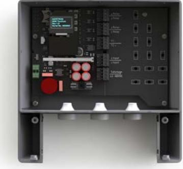
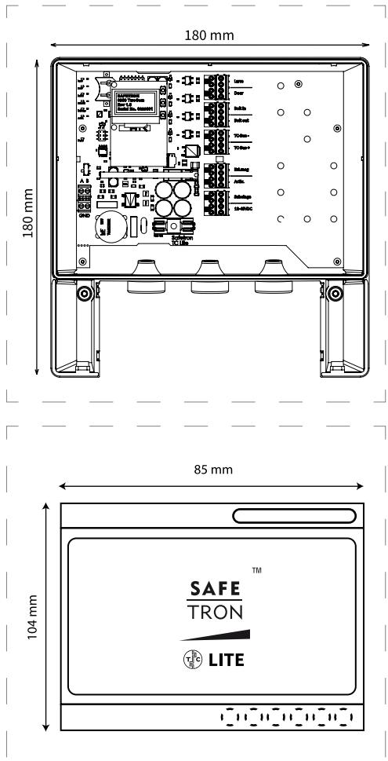
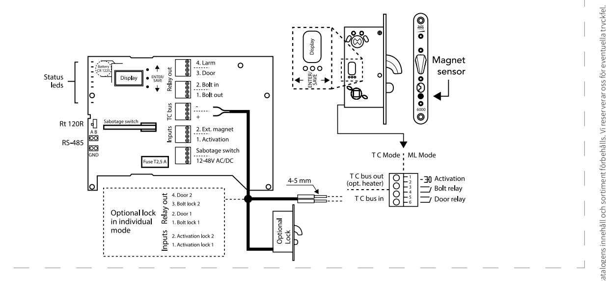

## Styrenhet med marknadens smartaste teknologi S T Y R E N H E T TWOCOM LITE

TwoCom innebär en helt ny och unik två-trådsteknik där kryptering, signalutbyte samt strömmatning sker i endast två parter. Unikt framtaget av Safetron.

Styrenhet TwoCom LITE fungerar tillsammans med motorlåskistorna 6100, 6200 samt 6300.

### Display

TwoCom LITE är försedd med en navigeringsbar display där konfiguration, adressering samt informationshämtning sker. Installationen blir lättöverskådlig och värdefull tid sparas.

Styrenheten är försedd med reläutgångar av SSR typ för kolvläge, dörrstatus och larm. Reläutgångarna är individuellt ställbara mellan NO eller NC funktion.

### Långa kabellängder

Tillsammans med motorlås ur 6000 serien ger TwoCom LITE en 128-bitars kryptering för högsta säkerhet. TwoCom tekniken tillåter kabellängder upp till 100 meter mellan låshus och styrenhet med standardkabeln. Detta öppnar för nya möjligheter att installera styrenheter i skyddade miljöer såsom elcentraler eller serverrum. För längre kabellängder skall kabelarean beräknas.

### Två motorlås - en styrenhet

Möjlighet till seriekoppling av två låshus mot TwoCom LITE finns. Valbara funktioner i detta läge är: induviduell-, synkroniserad- samt slusstyrning. Vid användning av "individuell styrning" av de båda motorlåsen ges endast signaler för dörr stängd samt regel ute. Vid behov av fullständig låsstatus skall TwoCom reläkort användas.

# S T Y R E N H E T TWOCOM LITE

Montagelåda för DIN-skena

### EGENSKAPER

- TwoCom BUS teknik
- Två-trådsteknik: krypterad kommunikation, signalutbyte samt strömmatning i endast två parter.
- Aktivering: potentialfri
- Extern dörrmagnetkontakt
- Reläutgångar: Larm, dörrstatus, kolv inne/ute
- Sabotageswitch
- Relä av SSR typ för låg strömförbrukning
- Varje reläutgång kan ställas individuellt NO eller NC i display
- Lysdiod på varje enskild reläutgång för indikering av aktivering
- Ställbar öppettid 1 till 30 sekunder
- Automatisk initiering av enheter
- Händelselogg (upp till 4000 händelser för såväl styrenhet som motorlås)
- Felkodshantering via display
- Klarar långa kabellängder, upp till 100 meter mellan låskista och styrenhet
- Låg strömförbrukning (>1W vid standby)
- Seriekoppling, upp till två motorlås mot TwoCom LITE
- Ihop med motorlås ur 6000 serien uppfylls SSF-3522 låsklass 3, 4 och 5

### TEKNISKA DATA

- 10-48VDC, 8-35VAC
- Strömförbrukning: 30 mA @ 24VDC
- Arbetstemperatur -5°C till +40°C
- SSR reläer, enpoligt växlande 48VDC eller 100mA, max 0.3W

| BENÄMNING                                                                                                                                               | ART NR                                                                                 |
|---------------------------------------------------------------------------------------------------------------------------------------------------------|----------------------------------------------------------------------------------------|
| TwoCom LITE styrenhet                                                                                                                                   | 202 144 709                                                                            |
| Tillbehör Montagelåda för DIN-skena Anslutningskabel 10m Anslutningskabel 100m TwoCom reläkort TwoCom kopplingsdosa TwoCom öppnaknapp | 202 144 721 202 144 710 202 144 752 202 144 727 202 144 720 202 144 726 |

#### **SAFETRON AB**

Säterivägen 18 P.O. Box 2096 65002 Karlstad Sweden

Tel: +46 54 19 02 45 Email: info@safetron.com

Du hittar alltid det senaste på safetron.com

Rätt till ändringar av katalogens innehåll och sortiment förbehålls. Vi reserverar oss för eventuella tryckfel. SAFETRON™ är ett registrerat varumärke.