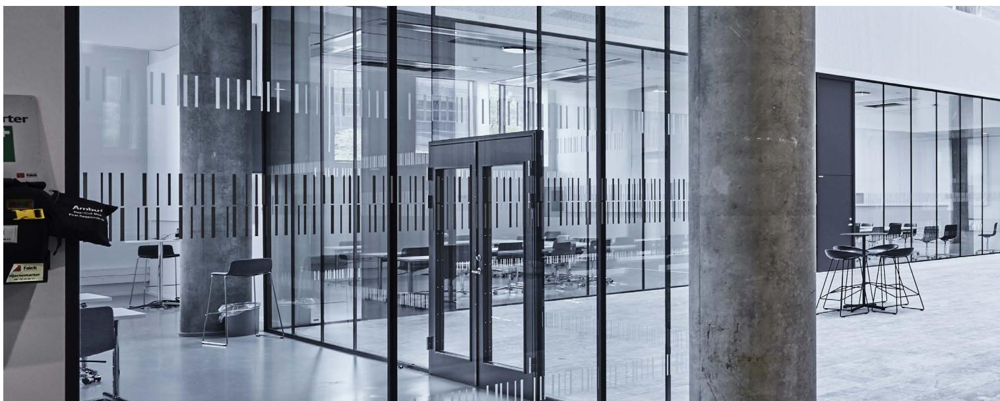
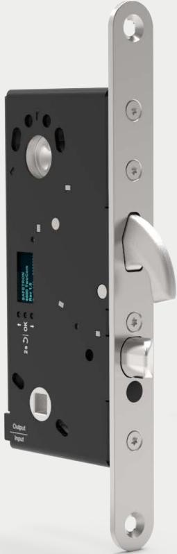
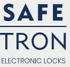
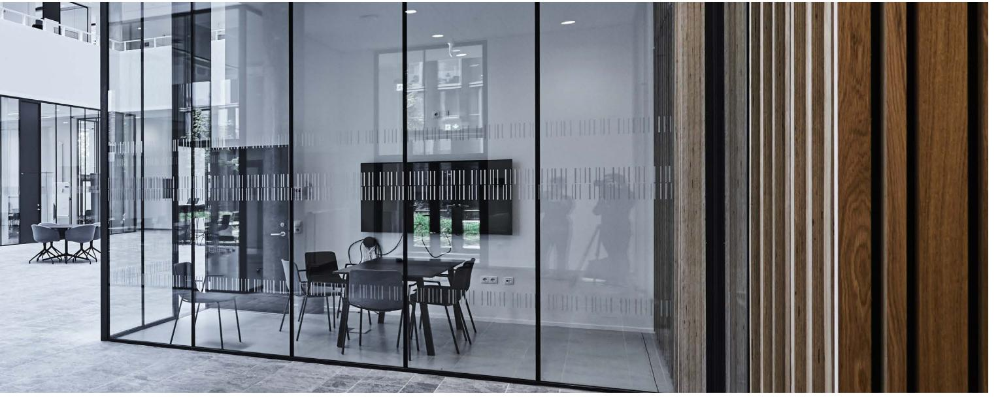
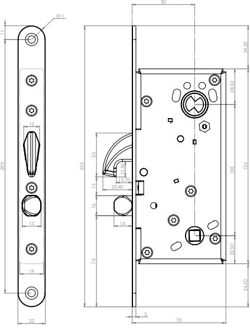
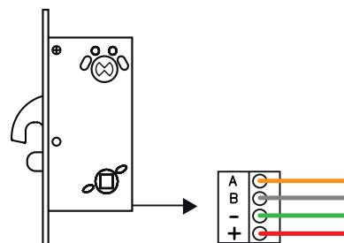

# Marknadens mest kompletta motorlås med klassisk kolvplacering

SAFETRON 6200 tillhör marknadens snabbaste och mest avancerade motorlås.

Låset frånreglar under 0.2 sekunder och därför behövs normalt sett inget separat daglås på högfrekventa dörrar.

Typiska användningsområden är dag-, natt- och säkerhetslåsning inom handel, kontor och industri samt där det ställs höga till mycket höga krav på säkerhet. SAFETRON 6200 är certifierad enligt SS-EN 14846 Grade 7 samt SSF-3522 låsklass 2B, 3, 4 och 5.

### Brandceller

SAFETRON 6200 är försedd med en förstärkt hakregelkolv samt fallkolv för tryckesfunktion och igenhållande egenskaper i t.ex. brandcellsgräns. Motorlås 6200 används med fördel som enda lås i dörrar med skyddsklasskrav 1, 2 eller 3.

# Certifierad låsprodukt ≥

SAFETRON 6200 är certifierad enligt Stöldskyddsföreningens norm SSF 3522 klass 2A, 2B, 3, 4 och 5 samt den europeiska standarden SS-EN 14846 Grade 7. SAFETRON 6100 är också godkänd som låsning i dörrar enligt RC3 och RC4.

#### Integrerade mot passersystem

SAFETRON 6000-serien erbjuder integrerad styrning mot flera av marknadens stora passersystemleverantörer. Detta innebär att motorlåsen kan anslutas direkt mot passersystemets dörrcentral utan styrenhet och därefter kan konfigureras genom passersystemets mjukvara vilket ger en förenklad installation och en mer kostnadseffektiv dörrmiljö..

#### Nödutrymning enligt SS-EN 179

SAFETRON 6200 kan användas i nödutrymningsvägar ihop med SAFETRON nödutrymningsbehör 796 enligt Europastandarden SS-EN 179:2008, samt SSF 3522 klass 2B. Kombinationen ger en dörrmiljö där krav för såväl hög säkerhet som nödutrymning tillgodoses i en låsenhet.

# **Utvecklad och tillverkad i Sverige**

SAFETRON 6200 är precis som alla våra motorlås utvecklade och tillverkade i Sverige för den Skandinaviska marknaden. Våra lås tillverkas av material som klarar tuffa miljöer och säkerhetskrav. Vi sparar inte in där andra gör utan garanterar högkvalitativa produkter även om det innebär en dyrare tillverkningsprocess.

# **Hardox®**

Väsentliga detaljer är producerade i Hardox®-stål från SSAB, ett stål med världsunika egenskaper gällande slitstyrka, hårdhet och seghet. Varför tillverka produkter med material från andra länder när vi är bäst i världen på hemmaplan?

# **Egenskaper**

- Certifierad enligt SS-EN 14846 grade 7 samt SSF-3522 låsklass 2B, 3, 4 och 5
- Dorndjup 50 mm
- Hakregel & fallkolv
- Frånregling: 0.2 sekunder
- Öppningsbart med nyckel/vred (90 graders vridning)
- Nödutrymning ihop med Nödutrymningsbehör 796
- Återinrymning valbar i styrenhet
- Plug and playinstallation
- Upp till 100m kabel mellan motorlås och styrenhet
- RS-485/OSDP krypterad kommunikation
- Händelselogg
- Servicemodul i styrenhet
- Seriekoppling, upp till två motorlås mot en styrenhet

# **Tekniska data**

- Multispänning 12-24 VDC +/- 15%
- Strömförbrukning: 150mA @ 24VDC
- Arbetstemperatur -20°C till +40°C

| BENÄMNING              | INNEHÅLL                                                                                             | ART NR    | E-NUMMER |
|------------------------|------------------------------------------------------------------------------------------------------|-----------|----------|
| SAFETRON 6200          | Motorlås 6200                                                                                        | 202144704 | 5866980  |
| SAFETRON 6200 sats     | Motorlås 6200, Styrenhet TC CU2, Anslutningskabel C06 (10m), Slutbleck 106-2, Karmöverföring CT81 | 202144833 | 5867684  |
| SAFETRON 6200 halvsats | Motorlås 6200, Anslutningskabel C06 (10m), Slutbleck 106-2, Karmöverföring CT81                   | 202144836 | 5867704  |

