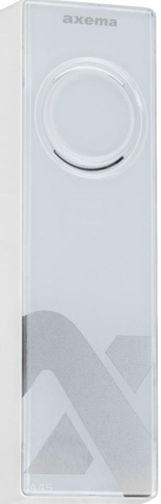
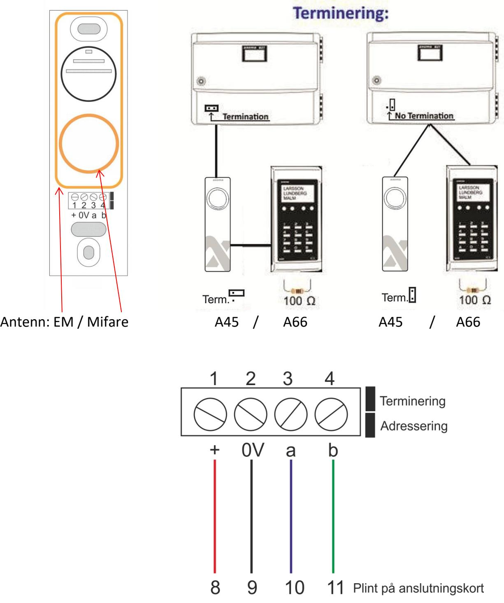
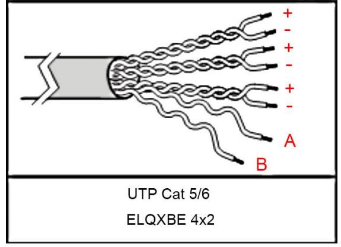

# **A45 Läsarterminal**

# Inkopplingsanvisning

(Kräver Vaka ver. 3.5x eller senare.)

 *20031-02 Se www.axema.se för de senaste manualerna.* 

Byglar

Bygel "Terminering" för terminering, monterad bygel = terminerad Bygel "Adressering" för adressering av in-/utläsare, monterad bygel = Term A

# **Inkoppling skruvplint:**

| Plint nr | Användning:                      | Plint i B17/B27 |
|-------------|----------------------------------|-----------------|
| 1-2         | Matningsspänning + på plint 1 | 8 - 9     |
| 3-4         | Kommunikation *               | 10 - 11   |

***** Terminering enligt illustration på sidan 2.

## **Kabel-längder:**

| Kabel       | Längd vid 24 V |
|-------------|----------------|
| 1 x 4 x 0,5 | 150 m          |
| Cat 5/6     | 200 m          |

Bild på hur **UTP Kat 5/6** skall kopplas:

**OBS!** Max kabellängd är 10 m mellan B16/26 (äldre hårdvaran) och A45 terminal. Ingen terminering skall användas.

#### **Avläsning.**

Visa brickan/kortet mitt framför fronten. Avläsning visas genom godkänd eller nekad passage. Om läsaren inte reagerar är EM/Mifare läsning avaktiverad i programvaran. Alternativt är brickan inte kompatibel.

A45 kan läsa EM & Mifare var för sig eller samtidigt. Detta programmeras i Vaka under *Inställningar - Kort/Kod – Brickor*. EM är aktiverat som standard.

### **Tekniska Data:**

Strömförsörjning: från dörrcentral Mått: (HxBxD) Strömförbrukning vid 24V: 136x42x18

| A 61          | Vila |
|---------------|------|
| Enbart EM     | 25mA |
| Enbart Mifare | 40mA |
| EM+Mifare     | 50mA |

#### **Lästeknik:**

EM: 4200/4102, 125khz Mifare: Avläsning av serienummer: 13.56Mhz Classic, Plus, Ultralight, Desfire, Desifre EV 1, Desfire EV2